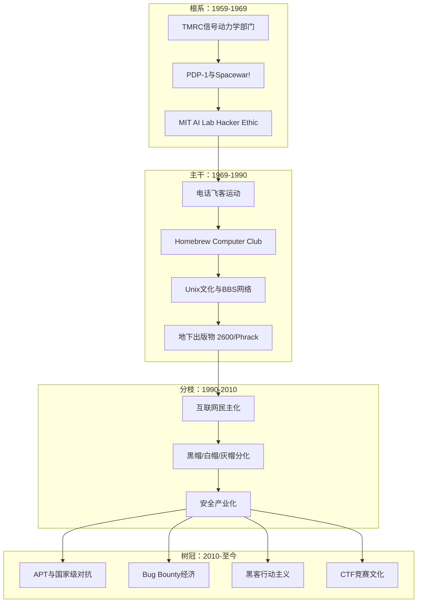
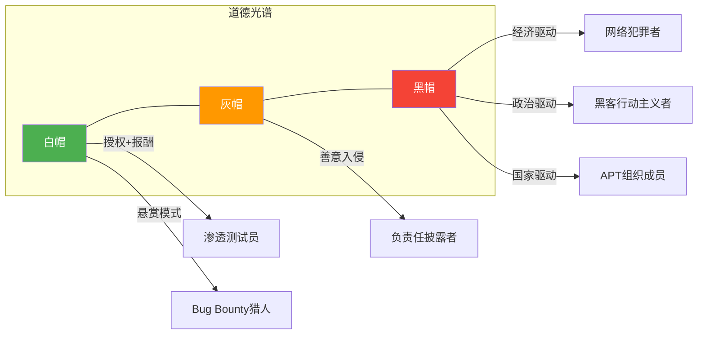
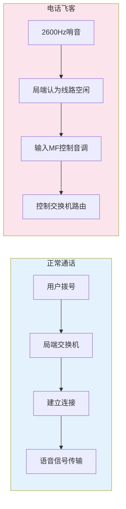
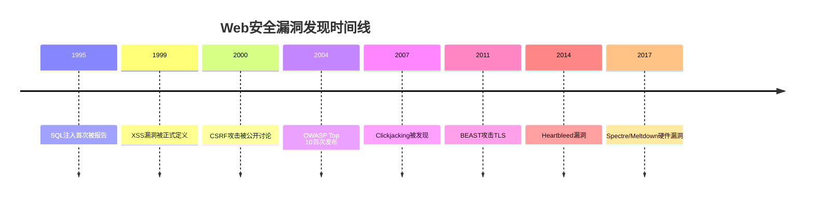
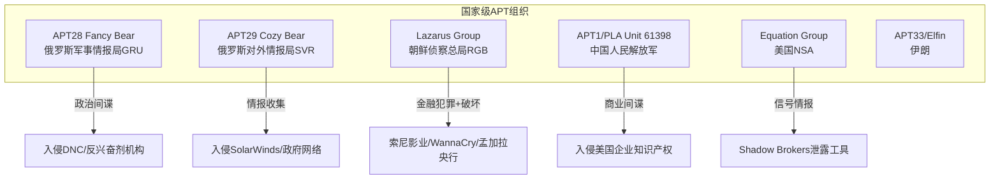
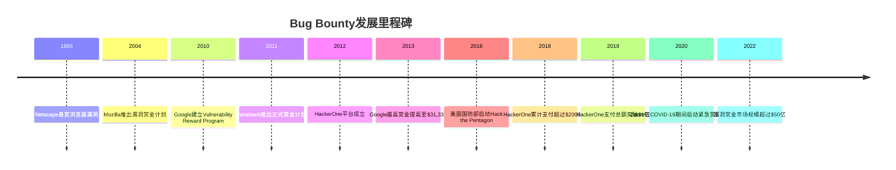
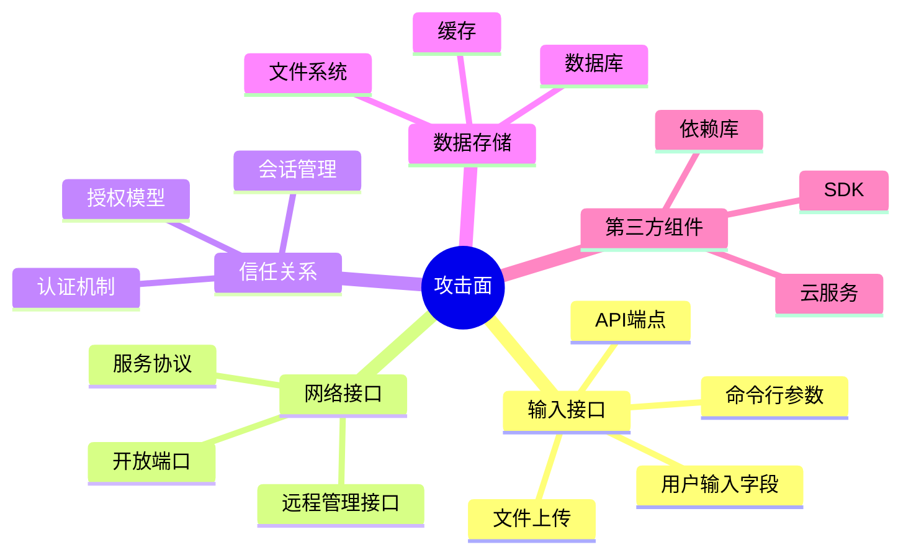
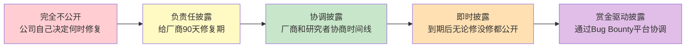

## 1.5 黑客文化的历史演化与深层解构

黑客文化不是一条直线，而是一棵不断分叉的树。理解这棵树的根系、主干和枝叶，是理解整个网络安全领域的前提。本节将以编年史为骨架，以文化分析为血肉，逐层解构黑客文化从MIT实验室到全球网络空间的六十年演化历程。

### 1.5.1 术语正本清源：Hacker、Cracker与命名战争

在展开历史叙事之前，必须先厘清一个持续了四十年的术语争议——这个争议本身，就是黑客文化最生动的注脚。

**Hacker的原始含义**

在MIT语境中，"hack"最初指的是巧妙的、令人赞叹的技术操作。一个hack必须具备创造性、技术含量和一定程度的优雅。MIT的Great Dome上被放上警车模型、校园里出现假的路标，这些被称为"hack"——它们是智慧的玩笑，不是犯罪。

**Cracker一词的诞生**

1985年，当媒体开始将所有计算机入侵者称为"hacker"时，黑客社区深感不满。他们创造了"cracker"（破解者）一词来区分：
- **Hacker**：对技术有深刻理解并用于创造性目的的人
- **Cracker**：以非法入侵、破坏或牟利为目的的人

Eric S. Raymond在《黑客词典》（Jargon File）中明确写道："真正的黑客会进入你的系统并修补它，cracker会进入你的系统并偷走你的东西。"

**命名战争的失败**

尽管黑客社区竭力纠正，主流媒体和社会大众最终还是将"hacker"与"入侵者"画上了等号。这一失败有深刻的文化原因：新闻媒体需要简洁的叙事标签，而"hacker"比"cracker"更具戏剧性和传播力。语言学家称这种现象为"语义漂移"——词汇的含义随大众使用而改变，任何个体或群体都无法阻止。

**当代术语体系**

今天，业界用帽子颜色来区分：

| 类型 | 动机 | 合法性 | 典型活动 |
|------|------|--------|----------|
| 白帽（White Hat） | 帮助组织提升安全 | 授权范围内合法 | 渗透测试、漏洞赏金、安全审计 |
| 灰帽（Grey Hat） | 个人好奇心、技术探索 | 未经授权但无恶意 | 未授权测试后报告漏洞 |
| 黑帽（Black Hat） | 经济利益、破坏、政治目的 | 非法 | 数据窃取、勒索、DDoS攻击 |
| 红帽（Red Hat） | 反制黑帽 | 法律灰色地带 | 主动攻击黑帽基础设施 |
| 蓝帽（Blue Hat） | 外部安全顾问 | 授权范围内合法 | 微软蓝帽项目、受邀漏洞测试 |

### 1.5.2 第一阶段：MIT模型铁路俱乐部与黑客精神的起源（1959-1969）

#### TMRC：一切开始的地方

黑客文化的起源可以追溯到MIT的技术模型铁路俱乐部（Tech Model Railroad Club, TMRC）。这个成立于1946年的社团，表面上是搭建精密铁路模型，实际上是20世纪50年代最聪明的年轻人沉迷于复杂系统的竞技场。

TMRC内部分为两个派系：
- **线路运营派（Layout Subcommittee）**：专注于铁路模型的外观和运行
- **信号动力学派（Signals and Power Subcommittee）**：痴迷于控制电路和电话交换系统的底层技术

正是信号动力学派的成员们，后来成为第一代计算机黑客。他们从电话交换系统中获得的技能——理解复杂的状态机、寻找系统边界条件、用最小的输入产生最大的效果——直接迁移到了计算机领域。

#### 术语体系的形成

TMRC成员创造了一套沿用至今的术语：

- **Hack**：巧妙的技术操作。一个真正的hack必须满足三个条件——技术含量、创造性、优雅度。MIT至今仍在每年评选"年度最佳hack"
- **Hack value**：衡量一个hack的价值标准，由同行评议决定
- **Losing**：当hack变得过于复杂、偏离原始目标，或者被管理层破坏时的状态
- **Recursive**：自我指涉。TMRC成员热爱递归——递归笑话、递归缩写（如GNU = GNU's Not Unix）、递归思维

#### PDP-1：从物理世界到数字世界的跃迁

1961年，DEC（数字设备公司）向MIT捐赠了一台PDP-1计算机。这台机器的规格在今天看来微不足道——9KB内存、9英寸圆形显示器——但它改变了历史。

PDP-1上诞生的第一个重量级hack是Steve Russell在1962年编写的《Spacewar!》。这是世界上第一个在计算机上运行的交互式游戏：两艘太空飞船围绕一颗恒星互相射击，恒星的引力会影响飞船的运动轨迹。

Spacewar!的文化意义远超技术意义：它确立了一个关键范式——**最优秀的程序不是被分配的任务，而是出于兴趣和热情创造的作品**。这个范式后来成为整个开源运动的精神内核。

#### ITS操作系统：没有锁的门

MIT AI实验室开发的ITS（Incompatible Timesharing System）是黑客文化的第一个"操作系统级表达"。ITS的设计理念极具颠覆性：

- **没有密码**：所有用户共享同一个系统，任何人的代码都可以被任何人查看和修改（后来因为ARPA的要求才被迫添加了密码功能，但密码文件是公开可读的）
- **没有文件权限**：信任是默认的，因为使用系统的都是"自己人"
- **代码即文档**：所有程序的源代码都是公开的，阅读源代码是学习编程的主要方式

ITS体现了早期黑客文化的乌托邦理想：一个完全开放、完全信任、以技术能力为唯一标准的精英社区。这种理想在后来的互联网时代既得到了部分实现（开源运动），也遭到了残酷的现实打击（网络犯罪）。

#### Hacker Ethic的首次系统化表述

Steven Levy在1984年出版的《黑客：计算机革命的英雄》（Hackers: Heroes of the Computer Revolution）中，首次将MIT AI实验室的隐性文化规范总结为"黑客伦理"：

1. **对计算机的访问应该不受限制，完全民主化**：任何人都应该能够在任何时间使用任何计算机
2. **所有信息都应该免费**：不要在计算机上复制受保护的信息
3. **不信任权威——促进去中心化**：官僚主义是创造力的敌人
4. **判断黑客的标准应该是其hack的质量**：而不是学历、年龄、种族、职位等外在标签
5. **计算机可以创造艺术和美**：技术不仅是工具，更是表达
6. **计算机可以改善你的生活**：技术乐观主义是黑客文化的底色

这六条原则后来被不同群体以不同方式诠释和挪用。Richard Stallman在此基础上发展出自由软件运动；硅谷创业者将其转化为"改变世界"的叙事；而犯罪黑客则将其第一条原则曲解为"一切信息都应该被获取"——包括不属于他们的信息。

### 1.5.3 第二阶段：硬件黑客与电话飞客（1969-1979）

#### 电话飞客：声音的艺术

电话飞客（Phone Phreaking）是黑客文化中一个独特而重要的分支。这些技术爱好者发现，电话网络的控制系统使用的是特定频率的音频信号——掌握了这些频率，就能免费拨打电话，甚至操控整个电话交换系统。

**关键人物与事件：**

- **John Draper（Captain Crunch）**：1960年代末，他发现Captain Crunch麦片附赠的塑料玩具哨子恰好发出2600Hz的音调——这正是AT&T电话系统用来标识空闲线路的频率。吹响这个哨子，电话系统就会认为当前线路空闲并等待指令。Draper由此获得了一个传奇绰号
- **Joybubbles**（本名Josef Carl Engressia Jr.）：一位天生失明的电话飞客，能够用口哨精确模仿电话系统的控制信号。他的音准天赋使他成为电话飞客社区的传奇人物
- **Steve Wozniak和Steve Jobs**：在创立苹果公司之前，两位史蒂夫通过制造和销售"蓝盒子"（Blue Box）来赚钱。蓝盒子是一种能够生成电话系统控制音调的电子设备。Wozniak后来回忆说："如果没有蓝盒子，就不会有苹果公司"

**2600Hz与电话网络架构**

AT&T的电话系统采用的是带内信令（in-band signaling）——控制信号和通话内容走同一条线路。这是一个经典的安全设计缺陷：数据平面和控制平面没有分离。电话飞客利用的正是这个缺陷。

电话飞客文化的深远影响在于：它培养了一代对电信系统有深刻理解的技术人才，建立了"探索系统边界"的核心黑客价值观，并直接催生了后来的计算机安全研究。更重要的是，电话飞客揭示了一个永恒的安全教训——**当控制信号和数据信号共用同一通道时，系统就天然存在被滥用的风险**。这个教训在几十年后的HTTP注入、SQL注入、XSS攻击中反复重演。

#### 家酿计算机俱乐部：硅谷的摇篮

1975年3月5日，在加州门洛帕克（Menlo Park）Gordon French的车库里，28个人聚在一起，围绕一台刚发布的Altair 8800微型计算机展开讨论。这就是家酿计算机俱乐部（Homebrew Computer Club）的第一次聚会。

俱乐部的核心成员及其后来的成就：

| 成员 | 俱乐部中的角色 | 后来的贡献 |
|------|---------------|------------|
| Steve Wozniak | 分享Apple I电路设计 | 苹果联合创始人 |
| Steve Jobs | 从技术中看到商业潜力 | 苹果联合创始人，重新定义个人计算 |
| Lee Felsenstein | 社区计算机运动的推动者 | 设计Osborne 1便携电脑 |
| Bob Marsh | 硬件创新者 | 创立Processor Technology公司 |
| Jerry Lawson | 游戏硬件设计 | 发明第一个可换卡带的游戏机 |
| Tom Pittman | 编程语言和编译器 | 早期微处理器编程工具 |

俱乐部的运作方式体现了黑客文化的核心特征：

- **"给我看你的"环节**：每次聚会都有成员展示自己的最新作品，这种公开分享的传统直接促进了创新
- **信息免费原则**：电路设计图和程序代码被毫无保留地分享
- **DIY精神**：强调动手创造而非被动消费
- **反权威主义**：对IBM等大公司的垄断持批判态度，相信个人可以改变世界

俱乐部的newsletter（由Bob Reiling编辑）记录了早期个人计算机革命的思想碰撞。第一期中写道："我们在创造一种新的工具，这种工具将改变社会的权力结构。"

#### 跨时代的影响

电话飞客和硬件黑客这两条线在1970年代末交汇。它们共同塑造了第二代黑客的核心价值观：

1. **系统是可以被理解的**：无论多么复杂的系统，都可以通过耐心的观察和实验来理解
2. **理解系统是改变系统的第一步**：技术知识赋予个人挑战机构的权力
3. **分享知识是道德义务**：独占技术知识是一种罪恶
4. **业余爱好者可以改变世界**：最好的创新来自车库，不是实验室

### 1.5.4 第三阶段：地下出版物与BBS网络（1980-1990）

1980年代是黑客文化的"地下时代"。个人计算机的普及创造了一代技术青少年，而早期网络（BBS系统）为他们提供了聚集和交流的空间。与此同时，法律的铁拳也开始落下。

#### BBS：互联网之前的互联网

电子公告板系统（Bulletin Board System, BBS）是互联网普及之前的在线社区基础设施。通过调制解调器（Modem）以拨号方式连接，BBS提供了消息发布、文件共享、在线讨论等功能。

一个典型的BBS系统配置：
- 一台专用PC，运行BBS软件（如PCBoard、Wildcat!、RemoteAccess）
- 一条或多条电话线路
- 一个调制解调器（速率从300bps到后来的56Kbps）
- 每次只能一个用户连接（单线BBS）

BBS在黑客文化中的地位类似于中世纪的修道院——它们保存和传播了知识。不同的BBS形成了不同的社区文化，有些公开，有些隐蔽。隐蔽的BBS（通常称为"地下BBS"或"elite BBS"）需要邀请码或通过"面试"才能加入，面试通常是展示你拥有的有价值的信息或工具。

#### 地下出版物：文字的力量

**2600: The Hacker Quarterly**

1984年，Emmanuel Goldstein（本名Eric Corley）创办了2600杂志。这个以电话飞客频率命名的杂志，成为英语世界黑客文化的旗舰出版物。2600的核心内容包括：

- 漏洞披露和技术分析（在法律允许的范围内）
- 黑客社区的新闻和评论
- 读者来信和问答
- 对政府和企业安全政策的批评

2600不仅仅是一本杂志，它还是一个运动的旗帜。每年夏天在纽约举行的HOPE（Hackers on Planet Earth）大会，至今仍是全球黑客社区最重要的聚会之一。

**Phrack Magazine**

1985年由Taran King和Knight Lightning创办的Phrack，是地下黑客社区最具影响力的电子杂志。与2600面向更广泛的技术爱好者不同，Phrack的目标读者是真正的"地下黑客"——那些探索系统边界、挑战安全防线的人。

Phrack的标志性文章包括：
- "The Conscience of a Hacker"（1986年，The Mentor撰写）——黑客文化的"独立宣言"
- 大量的技术教程，涵盖电话系统入侵、UNIX安全、网络协议分析等领域
- 对黑客社区内部事件的深度报道

The Mentor在"黑客的良知"中写道：

> "我们探索……因为你对我们来说一切都是新的。你叫我们罪犯，但你叫我们罪犯是因为你们不理解我们。你们害怕我们，因为你们不了解我们。我们是你们的影子，是你们的梦魇……"

这段文字后来成为黑客文化的经典文本，经常被引用为黑客精神的本质表达。

**TAP/YIPL（Youth International Party Line）**

TAP是最早的电话飞客出版物之一，由Abbie Hoffman和Al Bell在1971年创办。它最初名为YIPL（Youth International Party Line），是嬉皮士反文化运动和电话飞客技术的结合。TAP/YPIL传播了电话飞客的技术知识，并将其框架化为对企业和政府权力的反抗。

#### 著名黑客组织

1980年代见证了第一批有组织的黑客群体的形成：

**Legion of Doom（LoD）**

LoD（末日军团）是美国最著名的黑客组织之一，由Lex Luthor于1984年成立。LoD的成员以技术能力著称，他们对电话系统和计算机网络的深入研究推动了安全技术的发展。LoD的电子杂志《Legion of Doom Technical Journal》包含了大量有价值的技术内容。

LoD的文化特点：
- 强调技术能力，排斥"脚本小子"
- 内部有严格的等级制度
- 与竞争对手Masters of Deception（MoD）之间的"黑客战争"成为传奇

**Chaos Computer Club（CCC）**

1981年在德国汉堡成立的CCC，是欧洲最具影响力的黑客组织。CCC至今仍然活跃，每年举办的Chaos Communication Congress（33C3等）是全球最大的黑客大会之一。CCC的哲学立场是"信息自由"和"技术透明"，他们倡导安全研究、数字权利和政治参与。

**Cult of the Dead Cow（cDc）**

1984年在德克萨斯州Lubbock成立的cDc，将技术黑客能力与政治活动主义相结合。cDc最著名的贡献是Back Orifice系列远程管理工具——虽然这些工具可以被恶意使用，但cDc发布它们的目的是暴露Windows系统的安全缺陷。

#### 法律的铁拳：1990年大清洗

1990年代初期，美国执法机构对黑客社区发动了一系列大规模打击行动：

**Operation Sundevil（1990年）**

美国特勤局（USSS）发动的大规模行动，搜查了全美14个城市，没收了42台计算机和25,000张软盘。虽然最终起诉的案件很少，但这次行动的目的是震慑黑客社区。

**Steve Jackson Games事件（1990年）**

特勤局在调查黑客组织时，突袭了位于德州奥斯汀的Steve Jackson Games出版社，扣押了计算机、BBS服务器和正在出版的手稿。这次行动被证明是过度执法——Steve Jackson Games是一家合法的游戏出版商，被扣押的材料中有作家正在创作的小说。这起事件直接催生了电子前线基金会（EFF）的成立。

**Kevin Poulsen（1990年）**

Poulsen入侵了电话公司的计算机系统，操纵了洛杉矶KIIS-FM电台的拨入竞赛，赢得了一辆保时捷944 S2。他在联邦调查局的追捕下逃亡了17个月，最终被捕并被判入狱51个月。Poulsen是第一个因计算机犯罪入狱的著名黑客之一。

**Kevin Mitnick（1988-1995年）**

Mitnick的案件是黑客文化与法律体系冲突的最典型案例。他因入侵DEC、Sun Microsystems等公司的系统而被捕入狱，出狱后因违反假释条件再次被FBI通缉。1995年被捕后，他被单独监禁了近五年——检察官声称他"仅凭口哨就能发射核导弹"，这是对黑客能力最荒谬的妖魔化之一。

Mitnick案件的深远影响：
- 它推动了计算机犯罪法律的完善
- 它揭示了执法机构对技术的无知和恐惧
- 它成为了黑客文化中"被体制迫害的天才"叙事的核心素材
- Mitnick出狱后成为安全顾问，将个人经历转化为商业价值

### 1.5.5 第四阶段：互联网时代的文化分裂（1990-2010）

#### 万维网：潘多拉的盒子

1991年Tim Berners-Lee创建万维网（WWW）后，互联网从学术和军方的专属工具变成了大众化的信息平台。这一变革对黑客文化产生了深远的、不可逆转的影响。

**准入门槛的塌陷**

在互联网普及之前，使用计算机需要一定的技术基础。你必须理解命令行操作、文件系统、网络协议等基本概念。万维网的图形界面和"点击即用"的交互模式，将互联网的使用门槛降到了接近于零。

这带来了一个悖论：更多的人能够接触计算机技术，但平均技术素养却下降了。在MIT的ITS时代，每一个计算机用户都是潜在的黑客；在互联网时代，绝大多数用户只是消费者。

**新攻击面的爆炸**

Web应用的普及创造了前所未有的攻击面。HTTP协议的设计初衷是传输静态文档，安全性远不如专用的网络协议。SQL注入、跨站脚本（XSS）、跨站请求伪造（CSRF）等Web特有的漏洞类型相继被发现和利用。

#### 黑客社区的分裂

互联网时代见证了黑客社区更明确的分裂。这种分裂不仅是"帽子颜色"的区分，更是价值观和身份认同的根本分歧。

**白帽黑客的崛起**

安全产业的兴起为黑客提供了一条合法的职业道路。1990年代末和2000年代初，一批安全公司成立或成长壮大：
- ISS（Internet Security Systems）——后来被IBM收购
- Foundstone——由著名黑客创建的渗透测试公司
- iDEFENSE——后来被VeriSign收购

安全认证体系也逐渐完善：CISSP（2002年正式成为ISO标准）、CEH（道德黑客认证）、OSCP（进攻性安全认证）等认证成为安全从业者的"通行证"。

**黑帽黑客的产业化**

与此同时，网络犯罪也从个人行为演变为产业化的经济活动：
- 垃圾邮件产业雇佣了数千人
- 僵尸网络出租业务应运而生
- 信用卡信息在地下论坛上批量交易
- 有针对性的勒索攻击开始出现

**灰帽的道德困境**

灰帽黑客处于最尴尬的位置。他们可能出于好奇心或善意未经授权地测试系统安全，然后向厂商报告发现的漏洞。但从法律角度来看，未经授权的访问本身就是违法的——无论动机如何。这种法律与伦理的张力，成为灰帽黑客面临的持续困境。

#### 开源运动：Hacker Ethic的合法继承

开源运动可以被视为MIT黑客伦理在软件领域的合法化继承。

Richard Stallman在1983年发起的GNU项目和1985年创立的自由软件基金会（FSF），将"信息应该免费"的理念转化为法律框架——GPL许可证。Stallman区分了"自由软件"（强调用户的自由权利）和"开源软件"（强调开发方法论），这一区分至今仍有争议。

Linus Torvalds在1991年发布的Linux内核，以及Eric Raymond在1998年出版的《大教堂与集市》，从实践和理论两个层面证明了开源模式的有效性。

开源安全工具的涌现降低了安全研究的门槛：
- **Nmap**（1997年）：网络扫描工具，由Gordon Lyon（Fyodor）创建
- **Wireshark**（1998年，原名Ethereal）：网络协议分析器
- **Metasploit**（2003年）：渗透测试框架，由H.D. Moore创建
- **OWASP**（2001年成立）：开放Web应用安全项目

### 1.5.6 第五阶段：黑客行动主义与国家级对抗（2010-至今）

#### 黑客行动主义：键盘上的抗议

黑客行动主义（Hacktivism）是将黑客技术用于政治和社会目的的行为。它的根源可以追溯到电话飞客时代的反文化运动，但在互联网时代获得了前所未有的规模和影响力。

**Anonymous：无领袖的反抗**

Anonymous（匿名者）是黑客行动主义最具代表性的组织——如果它能被称为"组织"的话。Anonymous没有正式的成员身份、组织架构或领导层。任何人只要声称代表Anonymous并采取行动，就是Anonymous的一部分。

Anonymous的标志性行动：

| 时间 | 行动代号 | 目标 | 原因 | 技术手段 |
|------|---------|------|------|----------|
| 2008 | Project Chanology | 科学教教会 | 审查互联网内容 | DDoS攻击、信息泄露 |
| 2010 | Operation Payback | Visa/MasterCard/PayPal | 切断WikiLeaks捐款渠道 | LOIC DDoS工具 |
| 2011 | Operation Tunisia | 突尼斯政府 | 支持阿拉伯之春 | 网站攻击、信息支持 |
| 2012 | Operation Darknet | 暗网儿童色情网站 | 揭露犯罪行为 | 获取并公开用户信息 |
| 2015 | Operation Paris | ISIS相关账户 | 回应巴黎恐袭 | 社交媒体账户关闭 |

Anonymous的文化特征：
- **Guy Fawks面具**：作为集体身份的视觉标识，源自电影《V字仇杀队》
- **"We are Legion"**：集体身份高于个人身份
- **去中心化决策**：通过IRC频道和4chan论坛协调行动
- **道德自我授权**：成员自行决定哪些目标"值得攻击"

**WikiLeaks与信息泄露**

Julian Assange在2006年创立的WikiLeaks，将"信息应该免费"的黑客信条推向了极致。WikiLeaks发布了大量机密文件，包括美国外交电报（Cablegate，2010年）、伊拉克和阿富汗战争日志、以及后来的CIA黑客工具泄露（Vault 7，2017年）。

WikiLeaks与黑客社区的关系复杂：一方面，许多黑客认同信息透明的理念；另一方面，WikiLeaks对信息来源的保护不足和对政治的介入引发了争议。

#### 国家级网络战：潘多拉的核按钮

**Stuxnet：网络战的里程碑**

2010年，安全研究员在伊朗发现了Stuxnet蠕虫。这个高度复杂的恶意软件被广泛认为是美国和以色列联合开发的网络武器，目标是破坏伊朗纳坦兹核设施的铀浓缩离心机。

Stuxnet的技术特征揭示了国家级网络攻击的复杂性：
- 利用了四个零日漏洞（当时前所未有）
- 使用了两个被盗的数字签名证书
- 包含专门针对西门子SCADA系统的攻击代码
- 通过USB设备传播（跨越了气隙隔离）
- 能够精确控制离心机的转速而不触发报警

Stuxnet之后，APT（高级持续性威胁）组织相继被曝光：

**Shadow Brokers事件（2016-2017年）**

一个自称"影子经纪人"（Shadow Brokers）的组织声称入侵了NSA下属的Equation Group，并开始拍卖其黑客工具。泄露的工具包括EternalBlue——一个利用Windows SMB协议漏洞的远程代码执行工具。

EternalBlue的泄露直接导致了两场全球性灾难：
- **WannaCry**（2017年5月）：利用EternalBlue传播的勒索蠕虫，在150个国家感染了23万台计算机，英国NHS医疗系统瘫痪
- **NotPetya**（2017年6月）：同样利用EternalBlue，伪装成勒索软件实为破坏性攻击，造成超过100亿美元的经济损失

Shadow Brokers事件揭示了一个深层问题：**当国家积累了网络武器，这些武器就面临着泄露和扩散的风险——就像生物武器库可能被盗窃一样。**

#### Bug Bounty：漏洞经济的合法化

漏洞赏金计划的兴起，为黑客文化注入了新的合法经济动力。

Bug Bounty文化的深层影响：
1. **将"灰色地带"合法化**：漏洞发现从地下活动变成了正当职业
2. **创造了新的经济模式**：安全研究者可以靠发现漏洞维生
3. **推动了安全标准的提升**：企业有经济动机主动修复漏洞
4. **催生了全球化的安全人才市场**：发展中国家的年轻研究者可以通过漏洞赏金获得远超当地水平的收入

#### CTF竞赛：黑客文化的竞技场

CTF（Capture The Flag，夺旗赛）成为现代黑客文化的核心活动。CTF竞赛将安全技术转化为竞技运动，吸引了大量年轻人进入安全领域。

CTF的主要形式：

| 类型 | 描述 | 代表赛事 | 适合人群 |
|------|------|----------|----------|
| Jeopardy | 解题模式，分值制 | DEF CON CTF Quals, Google CTF | 各级别研究者 |
| Attack-Defense | 攻防对抗，实时比赛 | DEF CON CTF Finals, iCTF | 高级团队 |
| King of the Hill | 控制服务器维持时间最长者胜 | CTFtime部分赛事 | 进阶选手 |
| 协作式 | 需要多人协作完成复杂任务 | 企业内部CTF | 团队训练 |

**DEF CON CTF**是CTF竞赛的"世界杯"。每年在拉斯维加斯举行的DEF CON大会上，全球最顶尖的安全团队在此一决高下。DEF CON本身（1993年由Jeff Moss创办）是世界上规模最大、历史最悠久的黑客大会之一，每年吸引超过30,000名参与者。

### 1.5.7 黑客文化的思维模式深度分析

黑客文化不仅是一套行为规范，更是一套独特的认知框架。以下是四种核心思维模式：

#### 逆向工程思维（Reverse Engineering Mindset）

逆向工程思维的核心是"从结果推导过程，从输出推导输入"。

| 步骤 | 操作 | 案例 |
|------|------|------|
| 观察 | 收集系统在各种输入下的行为表现 | 向Web应用发送不同参数，记录响应差异 |
| 分解 | 将复杂系统拆解为独立的子系统 | 将网络协议拆分为物理层、数据链路层、应用层 |
| 分析 | 理解每个子系统的功能和交互方式 | 分析HTTP请求/响应的结构和含义 |
| 推理 | 从已知行为推导内部实现 | 从错误信息推断数据库类型和版本 |
| 验证 | 通过实验验证推理的正确性 | 构造特定输入验证SQL注入漏洞 |

逆向工程思维的训练方法：
- 阅读开源项目的源代码，理解设计决策
- 使用调试器（GDB、WinDbg、LLDB）跟踪程序执行
- 分析恶意软件样本，理解其行为模式
- 参加逆向工程CTF题目

#### 攻击面思维（Attack Surface Thinking）

攻击面思维要求从攻击者的视角审视系统，而不是从设计者的视角。

一个系统的攻击面由以下要素组成：

攻击面思维的训练方法：
- 对每个新接触的系统，先画出其攻击面地图
- 思考每个入口点可能被滥用的方式
- 关注信任边界：系统在哪里做了一个未经验证的假设？
- 阅读漏洞报告，学习他人是如何发现攻击面的

#### 第一性原理思维（First Principles Thinking）

第一性原理思维要求从最基本的事实和原理出发，而不是依赖类比或权威。

实践方法：
- **质疑每一个假设**：当有人说"这个系统是安全的"，追问"基于什么假设？这些假设什么时候会失效？"
- **回到协议和标准**：不理解HTTP，就无法理解Web安全；不理解TCP/IP，就无法理解网络攻击
- **阅读RFC文档**：RFC是互联网协议的权威规范，包含了大量安全相关的细节
- **质疑"最佳实践"**：最佳实践是在特定条件下形成的，条件变化时可能失效

#### 系统思维（Systems Thinking）

系统思维要求理解系统作为一个整体的运作方式，而不仅仅是单个组件。

关键概念：
- **反馈循环**：正反馈会放大偏差（如雪球效应），负反馈会抑制偏差（如负反馈调节器）
- **涌现行为**：系统组件的交互可能产生任何单一组件都无法预测的行为
- **边界条件**：系统在极端输入下的行为往往与正常行为完全不同——这正是安全漏洞的温床
- **依赖关系**：一个组件的故障可能通过依赖关系链传播到整个系统（如供应链攻击）

### 1.5.8 全球黑客文化的地域特征

黑客文化虽然具有全球性，但在不同地区呈现出鲜明的地域特色。

#### 美国：创业与商业化

美国黑客文化的特点是与创业精神深度结合。硅谷的车库创业文化与黑客精神天然契合。美国黑客社区对"将技术能力转化为商业价值"持积极态度——这既是创新的引擎，也是"出售漏洞"争议的根源。

美国安全社区的标志性机构：
- MIT、CMU、Stanford等高校的安全研究实验室
- DARPA资助的网络挑战赛（Cyber Grand Challenge）
- NSA和CIA的网络能力部门
- 硅谷安全创业生态（CrowdStrike、Mandiant等）

#### 俄罗斯及东欧：数学底蕴与地下经济

俄罗斯和东欧地区有着深厚的数学和技术教育传统。苏联时期建立的理工科教育体系培养了大量具有扎实数学功底的技术人才。

该地区黑客文化的特点：
- 技术功底扎实，特别擅长密码学、逆向工程和系统编程
- 黑客社区与政府之间的关系复杂——有时合作，有时对抗
- 网络犯罪产业相对成熟，形成了完整的分工体系
- 知名黑客组织：Fancy Bear（APT28）、Cozy Bear（APT29）、Carbanak/FIN7（金融犯罪）

#### 中国：从红客到产业

中国黑客文化的发展可以划分为几个清晰的阶段：

**萌芽期（1997-2001）**

1997年左右，中国第一批黑客社区开始形成。安全焦点（XFocus）是中国最早的网络安全技术社区之一，绿盟科技（NSFOCUS）则从技术社区发展为商业安全公司。这一时期的特点是技术爱好者自发组织、以学习和分享为主。

**红客联盟时期（2001）**

2001年中美撞机事件后，中国红客联盟（Honker Union of China）和美国黑客之间爆发了大规模的网络互相攻击。虽然技术含量有限，但这次事件极大地提升了中国社会的网络安全意识，推动了第一批中国安全从业者的职业化。

**产业化期（2008-2015）**

各大互联网公司纷纷建立安全实验室：
- 腾讯安全玄武实验室
- 阿里安全潘多拉实验室
- 360安全研究院
- 百度安全实验室

安全会议也开始繁荣：XCON、ISC、CSS等。

**国际化期（2015-至今）**

中国安全研究者在国际会议上频繁亮相，在Pwn2Own等国际比赛中取得优异成绩。中国安全社区开始从"学习者"转变为"贡献者"。

#### 以色列：军事情报的摇篮

以色列的黑客文化与其独特的军事和安全环境密切相关：

- **8200部队**（以色列军事情报单位）：被称为以色列的"NSA"，是许多安全创业者的摇篮。8200的退役士兵创立了Check Point（防火墙）、CyberArk（特权访问安全）、Wiz（云安全）等全球知名安全公司
- **国家政策支持**：以色列将网络安全视为国家核心竞争力，在教育和产业政策上给予了大量支持
- **军事技术向民用转化**：军事领域开发的网络技术被快速转化为商业产品

#### 日本：工匠精神与亚文化交叉

日本黑客文化融合了传统工匠精神和现代技术追求：

- 对技术细节的极致追求（与"改善"精神一脉相承）
- 独特的CTF和信息安全竞赛文化，SECCON是亚洲最重要的CTF之一
- 与动漫、游戏和御宅族文化的有趣交叉——许多日本黑客同时也是ACG爱好者
- 对隐私保护的高度重视（这与日本社会的集体主义文化形成了有趣的张力）

### 1.5.9 黑客文化与现代社会的深层交汇

#### 隐私权运动：技术对抗监控

2013年Edward Snowden曝光的NSA全球监控计划，引发了全球范围内对隐私权的深刻讨论。黑客社区在这一议题上发挥了核心作用——不仅在理念层面倡导隐私权，更在技术层面提供了对抗监控的工具：

| 工具/项目 | 功能 | 开发者/组织 |
|-----------|------|------------|
| Tor | 匿名通信洋葱路由 | 美国海军研究实验室（后独立） |
| Signal | 端到端加密即时通讯 | Open Whisper Systems（Moxie Marlinspike） |
| Let's Encrypt | 免费SSL/TLS证书 | ISRG（Internet Security Research Group） |
| Tails | 注重隐私的操作系统 | Tor项目 |
| EFF | 数字权利倡导和法律援助 | 电子前线基金会 |

这些项目体现了黑客文化的核心信念：**技术应该是解放的工具，而不是控制的手段。**

#### 加密货币：去中心化理想的货币化

Bitcoin（2009年由中本聪发布）和区块链技术可以被视为黑客文化在金融领域的延伸：

- **去中心化**：挑战传统金融体系的中心化控制——与黑客"不信任权威"的核心信条一致
- **密码学应用**：使用SHA-256哈希、椭圆曲线数字签名等密码学技术保护交易安全
- **开源精神**：Bitcoin的核心代码是开源的，任何人都可以审计和贡献
- **隐私保护**：加密货币的匿名性（尽管并非完全匿名）反映了黑客文化对隐私的重视
- **智能合约**：以太坊将"代码即法律"的黑客理念推向了逻辑极致——虽然DAO攻击事件证明了代码可能不如法律可靠

#### 开源安全工具：民主化的利剑

开源安全工具的广泛使用，降低了安全研究的门槛，推动了安全技术的民主化：

- **Metasploit Framework**：渗透测试框架，集成了数千个漏洞利用模块
- **Wireshark**：网络协议分析器，被安全研究者和网络管理员广泛使用
- **Nmap**：网络扫描和发现工具，被称为"网络映射的瑞士军刀"
- **OWASP ZAP**：Web应用安全测试工具
- **Burp Suite Community**：Web安全测试平台（社区版免费）

这些工具的共同特点是：将原本只有少数专家掌握的技术，以开源软件的形式普及到了全球安全社区。

### 1.5.10 黑客文化的伦理框架演进

#### 从无政府主义到专业伦理

早期黑客文化带有强烈的无政府主义色彩，强调信息的完全自由和对权威的不信任。随着网络安全产业的发展和法律框架的完善，黑客文化逐渐形成了更成熟的专业伦理框架。

**负责任披露（Responsible Disclosure）**

负责任披露制度的演变，是黑客伦理从混沌走向秩序的缩影：

Google Project Zero在2014年提出的"90天披露期限"成为行业标准：研究者在向厂商报告漏洞后，给厂商90天时间修复。90天后，无论厂商是否修复，漏洞细节都会被公开。这一政策引发了争议——微软曾抱怨90天不够，而安全社区则认为无限期保密会导致厂商拖延。

**技术伦理的哲学基础**

黑客伦理可以从多个哲学框架来理解：

| 伦理框架 | 核心观点 | 在黑客伦理中的体现 |
|----------|----------|-------------------|
| 功利主义 | 评估行为对社会整体利益的影响 | 漏洞披露的利弊权衡：公开漏洞让所有人受益，但也可能被恶意利用 |
| 义务论 | 遵守明确的规则和原则 | 授权原则：无论动机如何，未经授权的访问都是错误的 |
| 美德伦理 | 培养诚实、好奇心、责任感等品质 | 黑客社区推崇的技术能力和探索精神 |
| 关怀伦理 | 关注行为对弱势群体的影响 | 安全研究应保护普通用户免受攻击 |

#### 法律框架的全球图景

不同国家和地区的法律框架对安全研究的影响各不相同：

| 法律/法规 | 地区 | 对安全研究的影响 |
|-----------|------|-----------------|
| CFAA（计算机欺诈和滥用法案） | 美国 | 宽泛的条款使得"未经授权的访问"定义模糊，研究者面临法律风险 |
| DMCA（数字千年版权法案） | 美国 | 限制逆向工程，但有安全研究豁免条款 |
| GDPR（通用数据保护条例） | 欧盟 | 对数据处理有严格要求，但也为安全研究提供了合法基础 |
| 网络安全法 | 中国 | 对网络攻击行为有明确的法律界定，同时鼓励安全产业发展 |
| Computer Misuse Act | 英国 | 对未经授权的计算机访问有严格规定 |

**Aaron Swartz案件（2011-2013年）**

Aaron Swartz案件是法律与黑客伦理冲突的最悲剧性案例。Swartz是一位天才程序员、互联网活动家和信息自由倡导者。他通过MIT的网络批量下载了JSTOR学术论文数据库中的数百万篇论文，意图将其免费公开。

Swartz面临联邦检察官提出的最高35年监禁和100万美元罚款。2013年1月11日，26岁的Swartz在纽约布鲁克林的公寓中自杀。

Swartz案件引发的讨论：
- CFAA的宽泛条款是否赋予了检察官过大的自由裁量权？
- 学术论文的付费墙是否符合公共利益？
- 法律对"未经授权的访问"的定义是否需要更新？

这些讨论至今仍在继续，Swartz的经历成为了黑客社区中"技术天才被体制碾压"叙事的核心案例。

### 1.5.11 本节小结

六十年的黑客文化演化史，可以提炼出以下核心洞见：

**1. 文化的自组织能力**

黑客文化没有中央权威，没有创始人宣言，没有入会仪式。它完全通过实践、故事和价值观的代际传承而自组织。从TMRC到DEF CON，从BBS到Discord，载体在变，精神内核不变。

**2. 分裂是常态**

黑客文化从诞生之日起就在不断分裂：建设派vs探索派、白帽vs黑帽、自由软件vs开源软件、黑客vs脚本小子。每一次分裂都推动了文化的演化和制度的完善。

**3. 技术乐观主义的张力**

黑客文化的核心信仰——技术可以改善世界——在实践中面临持续的张力。同一个漏洞可以用来保护系统，也可以用来攻击系统。同一套技术能力可以用来防御，也可以用来犯罪。技术本身是中性的，使用技术的人决定了它的善恶。

**4. 法律与伦理的持续博弈**

从CFAA到GDPR，从Kevin Mitnick到Aaron Swartz，法律和黑客文化之间的博弈从未停止。法律总是滞后于技术发展，而黑客社区总是在探索法律的边界。这种博弈既是冲突的来源，也是进步的动力。

**5. 从精英到大众的不可逆趋势**

黑客文化正从少数精英的亚文化，变成大众可以参与的技术实践。Bug Bounty平台让普通人也能靠安全研究赚钱；CTF竞赛让大学生也能体验攻防对抗；开源工具让任何人也能学习渗透测试。这种民主化降低了门槛，但也稀释了"黑客"这个词的含意。

理解这些规律，不仅能帮助你把握黑客文化的历史脉络，更能让你在面对未来的技术变革时，保持清醒的判断力和独立的思考能力。
