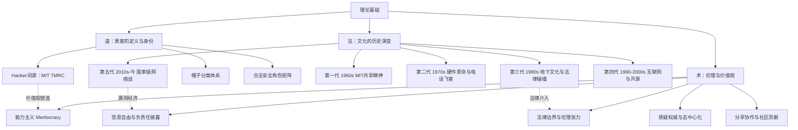
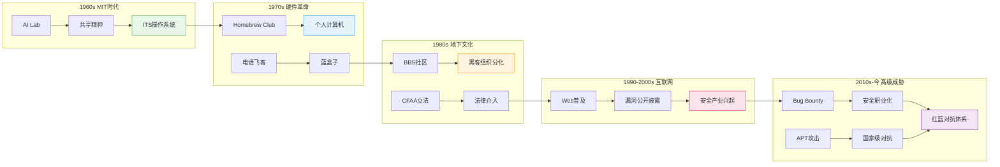
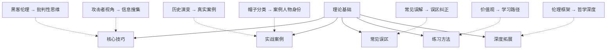

## 1.6 理论基础总结

### 1.6.1 本节定位：全书的思想地基

理论基础是本章的第一个模块，也是全书的思想起点。它回答了三个根本问题：黑客是谁？黑客文化从何而来？黑客遵循什么行为准则？这三个问题的答案，决定了你在整个安全职业生涯中的行为边界和职业高度。

跳过这一节直接学技术，你可能成为一个熟练的工具操作者——但永远无法理解为什么渗透测试要从"假设一切都有漏洞"开始，为什么负责任的漏洞披露需要给厂商修复时间，为什么真正的安全社区尊重的是代码质量而非学历背景。

### 1.6.2 知识体系全景回顾

本节围绕三条主线展开，构成"道-法-术"的递进结构：

#### 一、黑客是谁——定义、分类与角色

**词源与原意**

"Hacker"一词诞生于1960年代MIT的技术模型铁路俱乐部（TMRC）。在TMRC的术语体系中，"hack"指的是"一种创造性的、巧妙的、优雅的项目或解决方案"。一个"好的hack"意味着用最简洁、最优雅的方式完成复杂的技术任务。这个定义与犯罪毫无关系——它描述的是一种对技术极致追求的精神品质。

Steven Levy在1984年出版的《黑客：计算机革命的英雄》中，将第一代黑客的核心价值观总结为六条原则：计算机的使用应该是自由的、所有信息都应该自由流通、不信任权威、你可以用计算机创造艺术和美、计算机可以改善你的生活、判断标准应该是hack的质量而非虚假的社会标签。这六条原则至今仍是理解黑客文化的基石。

**帽子分类体系**

媒体的误用让"hacker"与"网络罪犯"画上等号。为了对抗这种语义污染，安全社区发展出"帽子"分类系统，借鉴了美国西部片中好人白帽、坏人黑帽的传统：

| 类型 | 核心特征 | 法律地位 | 典型职业 | 代表行为 |
|------|---------|---------|---------|---------|
| 白帽 White Hat | 获得授权的安全测试 | 完全合法 | 渗透测试工程师、安全架构师 | 企业安全评估、漏洞赏金 |
| 黑帽 Black Hat | 未经授权的恶意入侵 | 违法犯罪 | 无合法对应 | 数据窃取、勒索攻击 |
| 灰帽 Grey Hat | 未授权但无恶意 | 法律灰色地带 | 漏洞赏金猎人（需规范操作） | 发现漏洞后报告厂商 |
| 红帽 Red Hat | 主动攻击黑帽黑客 | 法律地位模糊 | 部分政府安全机构 | 反制恶意黑客组织 |
| 蓝帽 Blue Hat | 外部安全测试人员 | 合法 | 微软蓝帽计划 | 产品发布前安全测试 |
| 脚本小子 Script Kiddie | 使用他人工具、不理解原理 | 取决于行为 | 需尽快成长 | 运行现成攻击脚本 |

**现代安全角色矩阵**

在合法框架内，黑客技术催生了多种专业角色。每种角色需要不同的技能深度和思维方式：

| 角色 | 核心能力 | 思维侧重 | 典型认证 |
|------|---------|---------|---------|
| 渗透测试工程师 | 漏洞发现与利用 | 攻击者视角 | OSCP、CEH |
| 安全研究员 | 新漏洞类型发现 | 逆向工程 + 第一性原理 | 无强制认证 |
| 漏洞赏金猎人 | Web应用漏洞挖掘 | 攻击面思维 | HackerOne声望 |
| 安全架构师 | 安全系统设计 | 威胁建模 + 防御纵深 | CISSP、SABSA |
| 应急响应工程师 | 安全事件调查与恢复 | 取证思维 + 时间线分析 | GCIH、GCFA |
| 安全运营分析师 | 日志分析与威胁检测 | 模式识别 + 异常检测 | CySA+、SEC+ |

根据(ISC)²报告，全球网络安全专业人员已超过500万人，但人才缺口仍超过300万。理解这些角色定位，有助于你选择适合自己的职业路径。

#### 二、黑客文化从何而来——五个世代的演化

黑客文化不是凭空出现的。它从MIT的实验室萌芽，经过半个多世纪的分裂、融合和循环，形成了今天的复杂生态。理解这段历史，不是为了背诵年表，而是为了理解：为什么某些价值观会反复出现？为什么某些行为模式会周期性重演？

**第一代（1960s）：MIT共享精神的诞生**

MIT AI实验室和TMRC孕育了黑客文化的DNA。代表人物包括Peter Deutsch、Richard Greenblatt、Gosper。这个时期确立了几个至今仍有效的核心原则：

- **共享精神**：计算机时间极其宝贵，应该充分利用每一秒。黑客们会在其他人不使用计算机时"蹭"机时
- **反对官僚主义**：实验室管理层试图限制计算机使用，黑客们深恶痛绝
- **技术至上**：评价标准完全基于技术能力，与学历、年龄、职位无关
- **自由访问**：任何人都应该有权使用计算机来探索和学习

最著名的产物是ITS（Incompatible Timesharing System）——一个专门为黑客文化设计的操作系统，系统上没有密码（后来因ARPA要求才添加），所有代码公开可读。Steve Russell在PDP-1上编写的《Spacewar!》游戏，建立了一个关键的文化范式：**最优秀的程序不是被分配的任务，而是出于兴趣和热情创造的作品**。

**第二代（1970s）：从软件到硬件的革命**

黑客文化从大学实验室扩展到更广阔的天地。两条主线并行发展：

个人计算机方面，1975年Gordon French和Fred Moore在加州Menlo Park创办了Homebrew Computer Club。成员包括Steve Wozniak和Steve Jobs。俱乐部体现了黑客文化的核心特征：信息共享（公开分享电路设计）、反权威主义（批判大公司的垄断）、DIY精神（动手创造而非被动消费）。

电话飞客（Phreaking）方面，John Draper（Captain Crunch）发现Captain Crunch麦片盒里附赠的玩具哨子发出的2600Hz频率恰好可以控制AT&T的电话交换系统。年轻的Wozniak和Jobs就是电话飞客出身，甚至制作并销售过"蓝盒子"。电话飞客文化培养了一代对电信和计算机系统有深刻理解的技术人才，并建立了"理解系统原理就能创造性利用"这一核心价值观。

**第三代（1980s）：地下文化与法律碰撞**

BBS（电子公告板）成为黑客群体的主要聚集地。社区开始分化：Legion of Doom和Masters of Deception等组织代表了探索系统边界的"探索性"黑客，而另一群人则追求技术创新。

这个时期的关键转折点是法律的介入：1986年CFAA（计算机欺诈和滥用法案）的通过，标志着黑客行为首次面临明确的法律约束。Kevin Mitnick和Kevin Poulsen先后入狱。1988年Morris蠕虫成为第一个根据CFAA被定罪的案例——Robert Tappan Morris因编写和释放互联网蠕虫被判3年缓刑、400小时社区服务和10,000美元罚款。

2600 Magazine（1984年创刊）和Phrack Magazine（1985年创刊）成为黑客文化的两面旗帜，分别代表了技术出版和地下社区的传播渠道。

**第四代（1990-2000s）：互联网时代的双面性**

1991年Tim Berners-Lee创建万维网后，互联网从学术和军方的专属工具变成了大众化的信息平台。这对黑客文化产生了深远影响：

积极面——Linus Torvalds的Linux内核（1991）和Eric Raymond的《大教堂与集市》（1998）推动了开源运动。Richard Stallman的GNU/GPL许可证体系为"信息自由"提供了法律表达。安全社区开始形成负责任的漏洞披露规范。

消极面——ILOVEYOU蠕虫（2000）造成约100亿美元损失，Code Red感染35万台服务器，SQL Slammer在10分钟内感染全球75%的SQL Server主机。网络犯罪开始产业化，"脚本小子"群体大量出现——他们使用现成的攻击工具，但不理解底层原理。

**第五代（2010s至今）：高级威胁时代**

Stuxnet（2010）的发现标志着网络战时代的正式到来——网络武器首次成功破坏物理设施（伊朗核离心机）。此后：

- **APT组织曝光**：APT28（俄罗斯）、APT29（俄罗斯）、Lazarus Group（朝鲜）等国家级黑客组织被逐一揭露
- **漏洞经济成熟**：HackerOne（2012年成立）、Bugcrowd等平台将漏洞发现合法化和商业化，2019年HackerOne支付赏金总额超过1亿美元
- **供应链攻击升级**：2020年SolarWinds事件证明，通过攻击软件供应链可以入侵数千个组织，包括美国政府机构
- **勒索软件产业化**：2021年Colonial Pipeline事件展示了勒索软件对关键基础设施的威胁，攻击者只用一个泄露的VPN密码就瘫痪了美国东海岸45%的燃油供应
- **开源安全危机**：2021年Log4Shell漏洞（CVE-2021-44228）证明，一个被全球数十万应用依赖的开源组件中的单个JNDI查找调用，就可能让攻击者获得远程代码执行能力

#### 三、黑客遵循什么行为准则——伦理、价值观与法律边界

黑客文化不是无政府主义——它有一套被广泛认同的伦理原则。这些原则决定了你的行为边界。

**核心价值观矩阵**

| 价值观 | 内涵 | 在安全领域的体现 | 边界与限制 |
|--------|------|----------------|-----------|
| 信息自由 | 信息应该自由流通 | GPL许可证、开源软件、CTF知识共享 | 不等于无条件公开零日漏洞利用代码 |
| 能力主义 | 技术能力是唯一评价标准 | "Talk is cheap, show me the code" | 不等于不需要团队协作和沟通能力 |
| 质疑权威 | 对集中化权力持怀疑态度 | 开源运动、加密朋克、去中心化技术 | 不等于可以无视法律和授权边界 |
| 分享协作 | 知识越分享越有价值 | 安全会议、在线社区、开源贡献 | 分享有边界——漏洞细节需要负责任地披露 |
| 创造性解决问题 | 用非传统方式达到目标 | 漏洞挖掘、逆向工程、红队演练 | 创造力必须在授权范围内发挥 |

**负责任的漏洞披露（Responsible Disclosure）**

这是"信息自由"与"安全风险"之间的核心平衡机制。争议焦点在于：

- **立即公开**可能让用户面临风险，但会迫使厂商快速修复
- **完全保密**可能让厂商拖延修复，但保护了用户
- **协调披露**是折中方案：给厂商合理的时间修复后再公开

Google Project Zero的90天披露政策是目前业界较为广泛接受的标准。Katie Moussouris创立的协调漏洞披露（CVD）流程进一步细化了这一机制，包括：初始报告、厂商确认、修复窗口、公开披露四个阶段。

信息自由不是绝对的——零日漏洞利用代码的公开传播可能带来安全风险。这就是为什么安全社区发展出了"先通知厂商、给修复时间、再公开细节"的行业规范。

**法律边界：合法与违法的分界线**

技术能力本身是中性的，决定行为性质的是意图和授权。以下是明确的分界线：

| 行为 | 合法性 | 关键条件 |
|------|--------|---------|
| 在授权范围内进行渗透测试 | 合法 | 书面授权、明确范围、不超出授权 |
| 在合法平台上参与漏洞赏金 | 合法 | 遵守平台规则、不超出scope |
| 在隔离实验环境中研究攻击技术 | 合法 | 虚拟机、CTF平台、不连接生产环境 |
| 参加CTF竞赛 | 合法 | 竞赛平台授权 |
| 未经授权访问他人系统 | 违法 | 无论是否造成损害 |
| 窃取、篡改或破坏数据 | 违法 | 无论动机如何 |
| 制作和传播恶意软件 | 违法 | 除安全研究和授权测试外 |
| 进行拒绝服务攻击 | 违法 | 除授权的压力测试外 |

关键法律框架包括：美国CFAA（计算机欺诈和滥用法案）、欧盟GDPR（数据保护法规）、中国《网络安全法》和《刑法》第285-287条、DMCA（数字千年版权法案）。每个框架对安全研究的影响不同，从业者需要了解所在司法管辖区的具体规定。

**伦理框架的哲学基础**

黑客伦理可以从多个伦理学派来理解：

- **功利主义**：评估安全研究行为对社会整体利益的影响——负责任的披露让数百万用户受益
- **义务论**：遵守明确的规则和原则——未经授权就是未经授权，无论结果如何
- **美德伦理**：培养诚实、好奇心、责任感等品质——一个真正的黑客应该同时是一个好的社区成员
- **关怀伦理**：关注安全研究行为对弱势群体的影响——公开漏洞利用代码可能最先伤害的是最缺乏防护能力的用户

在实践中，法律和伦理之间经常存在张力。一些伦理上合理的行为可能在法律上存在风险（如灰帽黑客未经授权发现漏洞后报告），而一些法律框架可能限制了必要的安全研究（如DMCA对逆向工程的限制）。安全从业者需要在这两者之间找到平衡——不是选边站，而是在理解双方的基础上做出负责任的判断。

### 1.6.3 关键概念速查表

| 概念 | 定义 | 核心要点 |
|------|------|---------|
| Hacker | 能以创造性方式解决技术问题的人 | 词源MIT TMRC，非犯罪含义 |
| Cracker | 未经授权入侵系统的非法行为者 | 与Hacker的区别是关键 |
| 白帽黑客 | 在授权下进行安全测试的专业人员 | 渗透测试、安全审计、红队演练 |
| 黑帽黑客 | 未经授权入侵系统的非法行为者 | 经济利益、政治目的、个人满足 |
| 灰帽黑客 | 介于白帽和黑帽之间的行为者 | 未授权但无恶意，法律灰色地带 |
| 黑客伦理 | 黑客文化的价值观体系 | 信息自由、能力主义、质疑权威、分享协作 |
| 负责任披露 | 漏洞报告的行业规范 | 90天修复窗口、协调披露流程 |
| CFAA | 美国计算机欺诈和滥用法案 | 1986年通过，黑客法律史的里程碑 |
| APT | 高级持续性威胁 | 通常由国家级行为体发起 |
| ITS | MIT不兼容分时系统 | 黑客文化的第一个操作系统产物 |

### 1.6.4 本节与后续内容的连接

本节建立的概念框架将贯穿全书。以下是关键连接点：

**与核心技巧的连接**：理论基础中定义的"质疑权威"和"第一性原理"思维，在核心技巧模块中将具体化为攻击者视角、攻击树分析和STRIDE威胁建模。没有价值观的指引，技巧就是无根之木。

**与实战案例的连接**：理论基础中梳理的五代黑客文化演化，为实战案例提供了理解框架——Kevin Mitnick属于第三代地下文化时期，Stuxnet标志着第五代的开端，Log4Shell体现了开源安全的结构性挑战。每个案例都是历史脉络中的一个节点。

**与常见误区的连接**：理论基础中确立的正确概念，是纠正七大常见误区的基准线。例如，理解了"Hacker"的原始含义，才能理解为什么"黑客=犯罪分子"是一个被媒体制造的误解。

**与全书技术章节的连接**：

| 理论基础概念 | 连接章节 | 连接方式 |
|------------|---------|---------|
| 黑客伦理 | 第02章 法律与道德 | 深入法律边界和职业伦理 |
| 攻击者思维 | 第03章 网络基础 | 理解网络协议的攻击面 |
| 威胁建模 | Web安全章节 | 应用STRIDE分析Web应用 |
| 攻击树 | 渗透测试章节 | 系统化攻击规划 |
| 社会工程学 | 社会工程学章节 | 深入人的因素 |
| 供应链攻击 | 恶意软件分析章节 | 理解攻击载体 |
| 漏洞经济 | 漏洞研究章节 | 发现与报告漏洞 |
| APT攻击 | 高级持续性威胁章节 | 国家级攻击分析 |

### 1.6.5 自检清单

完成本节学习后，用以下问题检验理解深度：

**记忆层（知道）**
- [ ] "Hacker"一词最初来自哪里？原始含义是什么？
- [ ] 白帽、黑帽、灰帽黑客的核心区别是什么？
- [ ] 黑客文化经历了哪五个阶段？每个阶段的关键词是什么？
- [ ] Steven Levy总结的黑客伦理包含哪些原则？

**理解层（懂为什么）**
- [ ] 为什么媒体会将"黑客"与"犯罪"画等号？这种误解的根源是什么？
- [ ] 为什么负责任的漏洞披露需要给厂商修复时间？如果不给会怎样？
- [ ] 为什么说"信息自由"不是绝对的？举一个具体例子说明边界在哪。
- [ ] 为什么1986年CFAA法案是黑客文化史的转折点？

**应用层（会用）**
- [ ] 你能判断一个安全行为是否合法吗？判断依据是什么？
- [ ] 你能设计一个简单的负责任漏洞披露流程吗？
- [ ] 你能根据帽子分类体系，分析一个具体黑客人物的行为归属吗？

**分析层（看得透）**
- [ ] 开源运动的"信息自由"与安全研究的"负责任披露"之间是否存在矛盾？如何平衡？
- [ ] 从MIT到今天，黑客文化的价值观有哪些变化了？哪些没有变？为什么？
- [ ] 国家级网络战的兴起，是否改变了黑客文化的本质？为什么？

### 1.6.6 常见薄弱点与补救

| 薄弱点 | 典型表现 | 补救方法 |
|--------|---------|---------|
| 黑客伦理的边界 | 只知道"信息应该自由"，不知道边界在哪 | 研究Google Project Zero的披露政策，阅读CVE-2017-5638（Equifax漏洞）的完整披露时间线 |
| 历史事件的关联性 | 每个世代单独看懂了，但看不到演变脉络 | 画一条从Morris蠕虫→ILOVEYOU→Stuxnet→SolarWinds→Log4Shell的技术演变线 |
| 法律边界的实际判断 | 知道"未授权=违法"，但实际场景判断不清 | 阅读本章"常见误区"中关于灰帽黑客的讨论，结合第02章法律与道德深入理解 |
| 对"能力主义"的片面理解 | 认为只要技术好就行，忽视沟通和协作 | 参考现代安全团队的分工矩阵，理解不同角色需要的能力组合 |

### 1.6.7 核心金句回顾

> *"The world is full of fascinating problems waiting to be solved."*
> — Eric S. Raymond，《黑客文化简史》

> *"Talk is cheap, show me the code."*
> — Linus Torvalds

> *"Information wants to be free."*
> — Stewart Brand，《Whole Earth Catalog》

这三句话分别代表了黑客文化的三个核心面向：对问题的好奇心、对技术能力的尊重、对信息自由的追求。记住它们——它们不仅是口号，更是贯穿全书的行为准则。

### 1.6.8 下一步：从理论到实践

理论基础为你建立了正确的认知框架。接下来的模块将从"道"进入"术"——核心技巧模块将教你如何像黑客一样思考：批判性思维、攻击者视角、第一性原理、攻击树分析、威胁建模。这些思维工具将把本节建立的价值观转化为可操作的安全分析能力。

记住：技术是工具，价值观是指南针。没有正确价值观指引的技术能力，可能带来比保护更大的危害。你已经完成了指南针的校准——接下来，让我们拿起工具。
