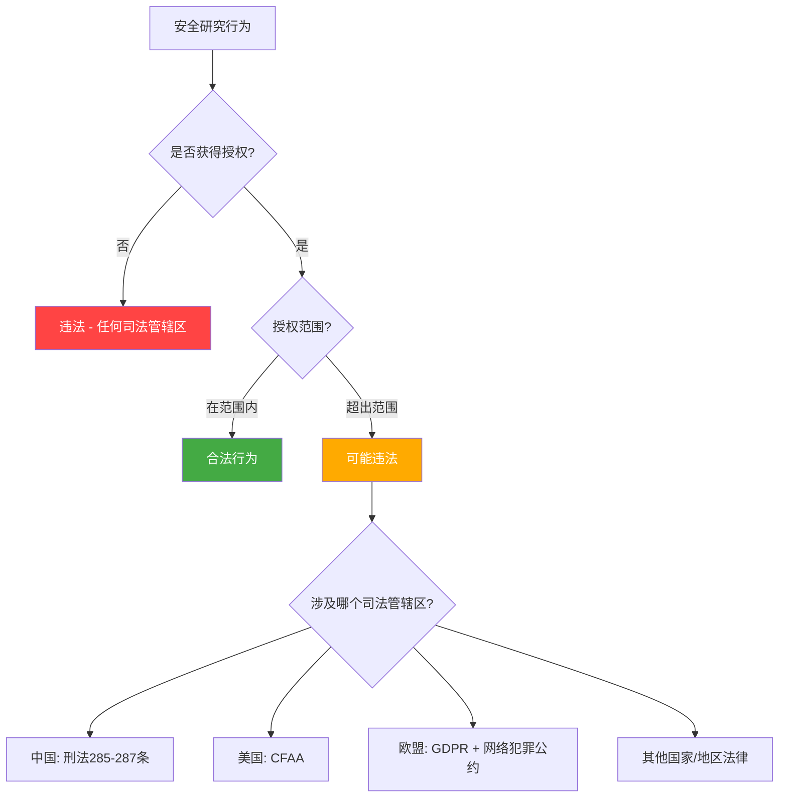

# 第02章 法律与道德 - 章节概览

## 开篇：为什么这章是你的"生存指南"

在上一章中，我们探讨了黑客哲学与文化——黑客精神的核心是探索、分享和创造。但有一个残酷的现实是任何技术热情都无法绕过的：**法律**。

网络安全领域存在一个根本性的悖论：**同样的技术动作，在不同的授权条件下，可能是合法的职业行为，也可能是严重的刑事犯罪**。一个 `nmap -sV 192.168.1.0/24` 命令，在你自己的实验室里是学习，在未经授权的网络上就是违法。这不是理论上的可能性——每年都有安全研究人员因为越界而面临起诉、罚款甚至牢狱之灾。

### 一个你必须正视的现实

以下数据来自公开的法律文书和行业报告：

| 地区 | 相关罪名 | 最高刑罚 | 典型量刑 |
|------|---------|---------|---------|
| 中国 | 非法侵入计算机信息系统罪（刑法285条） | 3-7年有期徒刑 | 1-3年 + 罚金 |
| 中国 | 破坏计算机信息系统罪（刑法286条） | 5年以上有期徒刑 | 2-5年 + 罚金 |
| 美国 | CFAA违规（18 U.S.C. § 1030） | 20年联邦监禁 | 1-5年 |
| 欧盟 | GDPR数据泄露 | 2000万欧元或全球营业额4% | 数十万至数百万欧元罚款 |
| 英国 | 计算机滥用法案违规 | 10年监禁 | 6个月-2年 |

这些不是吓唬人的数字。2023年，中国公安机关办理网络犯罪案件超过11万起；美国司法部每年处理数百起CFAA案件。**无知不是免责的理由**——"我不知道这违法"在法庭上不构成有效抗辩。

### "技术无罪"是一种危险的误解

很多初学者，特别是年轻的技术爱好者，抱有这样的心态：

- "我只是看看，又没搞破坏"
- "系统有漏洞是他们的问题，我帮他们发现了"
- "我用的是公开工具，工具本身是合法的"
- "我在自己电脑上操作，怎么能算违法"

**以上每一条都是错误的。** 在全球绝大多数司法管辖区：

1. **未经授权访问即为犯罪**——不需要造成任何实际损害
2. **意图不改变行为性质**——"善意"不是免责理由
3. **工具合法性不等于使用合法**——菜刀合法，用来伤人就是犯罪
4. **物理位置不决定管辖权**——你的操作可能跨越多个司法管辖区

本章的目的不是让你恐惧安全研究，而是让你**在合法的框架内自信地进行安全研究**。理解法律边界不是限制你的能力，而是保护你的职业生涯。

## 本章核心内容详解

### 1. 全球网络安全法律框架

网络安全法律是各国针对计算机犯罪和数据保护制定的专门法律体系。不同国家和地区的法律在立法理念、覆盖范围和处罚力度上存在显著差异，但核心关切是相似的：保护计算机系统和数据的机密性、完整性和可用性。

#### 主要法律体系概览

**中国网络安全法律体系**是本章的重点。中国的网络安全立法呈现出"一法两办法多标准"的架构：

- **《网络安全法》（2017年施行）**：基础性法律，确立了网络安全的基本制度框架，包括网络运行安全、网络信息安全、关键信息基础设施保护等
- **《数据安全法》（2021年施行）**：首次在法律层面建立了数据分类分级制度，确立了数据安全审查制度
- **《个人信息保护法》（2021年施行）**：对标欧盟GDPR，建立了个人信息处理的完整规则体系
- **《刑法》第285-287条**：直接规定了计算机犯罪的刑事责任，是安全从业者最需要警惕的红线

对于安全研究人员，最关键的是理解**《刑法》第285条**的构成要件。该条规定："违反国家规定，侵入国家事务、国防建设、尖端科学技术领域的计算机信息系统的，处三年以下有期徒刑或者拘役。"注意：这里不要求造成损害，**侵入行为本身就是犯罪**。

**美国法律体系**以CFAA（计算机欺诈和滥用法案）为核心。CFAA最初制定于1986年，历经多次修订，其核心条款禁止"未经授权或超越授权访问计算机"。CFAA的一个争议点在于"超越授权"（exceeds authorized access）的定义过于宽泛，导致一些看似无害的行为也可能被起诉。2021年美国最高法院在Van Buren v. United States案中对"超越授权"进行了限缩解释，将其限定为"访问其无权访问的计算机特定区域"，而非"以不被允许的方式访问有权访问的区域"。

**欧盟法律体系**的特点是以GDPR（通用数据保护条例）为核心的数据保护框架。GDPR不仅影响欧洲企业，任何处理欧盟公民数据的组织都需要遵守。对安全研究人员来说，GDPR带来了一个额外的法律维度：在安全测试中接触到个人数据可能触发数据保护法的合规义务。

**其他重要法律体系**包括：英国的《计算机滥用法案》（CAA）、日本的《不正访问禁止法》、韩国的《信息通信网络利用促进及信息保护法》、澳大利亚的《刑法修正案（计算机犯罪）法》等。每个法律体系都有其独特的构成要件和处罚标准。

#### 跨境执法的现实

在互联网时代，一个安全测试行为可能同时涉及多个司法管辖区。例如，你在中国对一家美国公司的服务器进行测试，可能同时触犯中国刑法和美国CFAA。多个国际条约（如《布达佩斯网络犯罪公约》）为跨境执法提供了合作框架。中国虽然未加入该公约，但通过双边司法协助条约和其他国际合作机制，跨境网络犯罪的追诉已成为现实。

### 2. 渗透测试的法律边界

渗透测试（Penetration Testing）是网络安全领域最需要法律意识的工作之一。一个完全合法的渗透测试和一个刑事犯罪之间，区别可能仅仅在于一份授权文件的有无。

#### 合法渗透测试的五大要素

要使渗透测试完全合法，必须同时满足以下五个条件：

**第一，明确的书面授权。** 这是最基本也是最重要的要素。口头授权在法律上几乎无法证明。书面授权应当由被测试系统的所有者或合法授权代表签署，明确说明同意进行安全测试。授权书应当包含：授权方的名称和身份、被测试系统的清单、测试的时间范围、测试方的身份信息。

**第二，清晰的测试范围（Scope）。** 测试范围必须明确规定哪些系统、端口、服务可以测试，哪些绝对不可以。一个典型的测试范围定义包括：IP地址范围和域名清单、允许使用的测试技术（黑盒/白盒/灰盒）、禁止的测试行为（如社会工程、拒绝服务攻击）、排除的系统（如生产数据库、第三方服务）。

**第三，规定的测试时间窗口。** 渗透测试应当在约定的时间段内进行，通常避开业务高峰期。未在约定时间窗口内进行的测试行为可能被认定为未授权访问。

**第四，双方签署的合同协议。** 合同应包含服务级别协议（SLA）、保密条款（NDA）、责任限制条款、保险条款、争议解决机制。合同是保护双方利益的法律文件，缺失合同的渗透测试是在法律风险中裸奔。

**第五，法律顾问的参与。** 对于大型或高风险的渗透测试项目，建议聘请专门的网络安全律师审查授权文件和合同条款，确保测试活动在法律框架内进行。

#### 常见的法律灰色地带

即使在合法的渗透测试中，也存在一些容易触碰法律红线的灰色地带：

- **发现意外漏洞后的进一步测试**：测试过程中发现了约定范围之外的系统漏洞，进一步测试可能超出授权范围
- **第三方数据的接触**：测试过程中不可避免地接触到第三方用户的个人数据
- **供应链测试**：对目标系统的第三方组件进行测试可能涉及第三方的授权问题
- **持续性测试**：某些测试可能在约定时间窗口结束后仍有持续影响（如植入的后门）

对于这些情况，最佳做法是在合同中预先约定处理方案，或者在发现意外情况时立即暂停测试并与客户沟通。

### 3. 漏洞赏金计划的法律框架

漏洞赏金计划（Bug Bounty Program）是近年来兴起的一种合法安全研究渠道，由企业主动邀请安全研究人员在约定范围内寻找漏洞并给予奖励。主流的漏洞赏金平台包括HackerOne、Bugcrowd、Intigriti等。

#### 漏洞赏金的法律保护

漏洞赏金计划的核心法律价值在于：**它在企业和安全研究人员之间建立了一种合同关系**，使得原本可能构成"未授权访问"的行为变为合法的安全研究。但这种保护是有条件的：

1. **严格遵守计划范围**：只测试计划明确列出的资产，多一个子域名都可能越界
2. **遵守禁止行为清单**：如禁止进行社会工程、禁止访问其他用户数据、禁止进行拒绝服务攻击
3. **遵守负责任披露规则**：在规定时间内向厂商报告漏洞，不公开细节直到修复完成
4. **不进行数据外泄**：发现漏洞后证明其存在即可，不要下载、存储或传输敏感数据

#### 中国的SRC生态

中国的安全应急响应中心（SRC）生态与国际Bug Bounty有显著差异。主要SRC包括：

- **企业SRC**：如腾讯安全应急响应中心（TSRC）、阿里安全响应中心（ASRC）、百度安全应急响应中心（BSRC）
- **平台型SRC**：如漏洞盒子、补天漏洞响应平台
- **政府CERT**：如国家信息安全漏洞共享平台（CNVD）、国家信息安全漏洞库（CNNVD）

参与国内SRC需要特别注意：不同SRC的规则差异较大，务必仔细阅读每家的"活动规则"和"免责声明"。部分SRC的法律保护力度弱于国际平台，在参与前建议了解相关法律风险。

### 4. 安全从业者的道德准则

法律是行为的底线，而道德是职业的高标准。一个优秀的安全从业者不仅要在法律框架内工作，还应当遵守一套高于法律要求的道德准则。

#### 核心道德原则

**无害原则（Do No Harm）**：安全研究的目的是提升安全性，而非造成损害。即使在合法授权范围内，也应当避免不必要的破坏性测试。在测试环境中操作时，应当考虑对业务连续性的影响。

**知情同意原则（Informed Consent）**：确保授权方充分理解测试可能带来的风险。不能利用信息不对称来获取超出对方真实意愿的授权。

**保密原则（Confidentiality）**：在测试过程中接触到的任何敏感信息——无论是技术漏洞、商业机密还是个人数据——都必须严格保密，仅用于约定的目的。

**负责任披露原则（Responsible Disclosure）**：发现漏洞后，应当通过负责任的渠道向厂商报告，给予合理的修复时间窗口，而不是直接公开或出售给恶意方。

**专业能力原则（Professional Competence）**：只承接自己能力范围内的工作。能力不足导致的测试失败或系统损害，同样需要承担道德责任。

#### 行业认证的道德要求

主流的安全认证都包含道德准则要求：

| 认证 | 颁发机构 | 道德准则 | 违反后果 |
|------|---------|---------|---------|
| CISSP | (ISC)² | (ISC)²道德准则 | 吊销认证、行业禁入 |
| CEHP | EC-Council | EC-Council道德准则 | 吊销认证 |
| OSCP | OffSec | 负责任披露准则 | 吊销认证 |
| CISP | 中国信息安全测评中心 | 中国信息安全职业道德规范 | 吊销认证 |

以(ISC)²的道德准则为例，其核心准则包括：保护社会、公共利益和基础设施；行为得体、诚实、公正、负责和合法；为委托人提供勤勉和胜任的服务；发展和保护行业。违反这些准则可能导致认证被撤销，进而影响职业生涯。

### 5. 真实案例分析

本章的案例分析部分将深入剖析多个具有里程碑意义的法律案例，每个案例都揭示了法律边界的不同侧面。

#### 案例预览

**Aaron Swartz案件**（详见实战案例01）：互联网活动家Aaron Swartz因大规模下载JSTOR学术论文被依据CFAA起诉，面临最高35年监禁和100万美元罚款。此案引发了关于CFAA过度严厉和学术信息开放获取的广泛讨论。Swartz最终在2013年自杀，年仅26岁。此案推动了美国国会的"Aaron法案"（后未通过）以及多个学术开放获取运动。

**Marcus Hutchins案件**（详见实战案例02）：因阻止WannaCry勒索软件而声名大噪的英国安全研究员Marcus Hutchins，后来因在早年编写和传播Kronos银行木马被美国FBI逮捕。此案揭示了一个重要教训：即使你现在是"好人"，过去的行为仍然可能带来法律后果。

**Weev案件**（详见实战案例03）：安全研究员Andrew Auernheimer（网名Weev）因发现AT&T网站的安全漏洞并公开披露而被依据CFAA定罪。虽然判决后来被推翻，但此案暴露了CFAA中"未经授权访问"定义的模糊性。

**中国网络安全法律案例**（详见实战案例04）：包括多起国内安全研究人员因越界测试而被追究刑事责任的真实案例，为国内安全从业者提供了最直接的法律警示。

**Colonial Pipeline勒索事件**（详见实战案例07）：2021年的Colonial Pipeline勒索软件攻击导致美国东海岸燃油供应中断，揭示了关键基础设施安全的法律和政策维度。

## 本章学习路线图

为了最大化学习效果，建议按照以下路线图学习本章：

**建议学习顺序：**

1. **先通读本概览**（10分钟）：建立全局认知，理解本章的整体框架
2. **精读理论基础**（30分钟）：重点理解中国和主要国家的法律框架，做笔记记录关键法条
3. **学习核心技巧**（25分钟）：掌握合法安全研究的具体方法和自我保护技巧
4. **研读实战案例**（30分钟）：结合理论分析每个案例的法律争议点
5. **检视常见误区**（20分钟）：对照检查自己是否存在这些误解
6. **完成练习方法**（20分钟）：通过实践巩固所学知识
7. **回顾本章小结**（10分钟）：确认学习目标的达成情况
8. **选读深度拓展**（按需）：根据个人兴趣和职业方向选择性学习

## 学习目标

完成本章学习后，你应当具备以下能力：

### 基础认知层

- 能够列举中国《网络安全法》《数据安全法》《个人信息保护法》的核心条款和适用场景
- 能够解释《刑法》第285-287条的构成要件和量刑标准
- 能够比较中国、美国、欧盟三大法律体系在计算机犯罪立法上的主要差异
- 能够识别哪些安全研究行为可能触发刑事责任

### 实践应用层

- 能够为一个渗透测试项目设计完整的法律合规方案（授权书、范围定义、合同模板）
- 能够判断一个安全研究行为是否在法律允许的范围内
- 能够选择合适的漏洞披露渠道并遵守负责任披露流程
- 能够在发现意外漏洞时做出合法且道德的决策

### 综合素养层

- 能够建立个人的安全研究合规检查清单
- 能够分析真实法律案例中的争议焦点和判决逻辑
- 能够理解跨境安全研究的法律管辖权问题
- 能够在职业发展中持续关注法律环境的变化

## 前置知识

- **必读**：第01章 - 黑客哲学与文化（理解黑客精神与法律约束的关系）
- **推荐**：具备基本的网络协议知识（TCP/IP、HTTP）有助于理解案例中的技术细节

## 章节结构

| 文件 | 内容 | 关键知识点 | 预计阅读时间 |
|------|------|-----------|-------------|
| 00-章节概览 | 本章整体介绍 | 法律意识的重要性、章节框架 | 15分钟 |
| 01-理论基础 | 全球法律框架与道德准则 | 中国法律体系、美国CFAA、欧盟GDPR、道德准则 | 40分钟 |
| 02-核心技巧 | 合法安全研究的方法与边界 | 授权管理、负责任披露、合规流程 | 30分钟 |
| 03-实战案例 | 真实法律案例深度分析 | Aaron Swartz、Marcus Hutchins、中国案例 | 40分钟 |
| 04-常见误区 | 关于法律的常见误解 | "技术无罪"等10大误区 | 25分钟 |
| 05-练习方法 | 法律合规的实践练习 | 合同模板、检查清单、模拟场景 | 25分钟 |
| 06-本章小结 | 回顾与下章预告 | 知识点回顾、能力自检 | 15分钟 |
| 07-深度拓展 | 前沿法律议题与进阶内容 | AI安全法律、跨境执法、法律改革 | 按需 |

总计约 **3小时** 的核心阅读与练习时间（不含深度拓展）。

---

> *"With great power comes great responsibility."*
> — 蜘蛛侠（也适用于网络安全从业者）

> *"The law is reason, free from passion."*
> — 亚里士多德（法律是不受激情影响的理性）

两句话放在一起，恰好概括了本章的核心：**用理性和责任来约束你的技术能力**。
