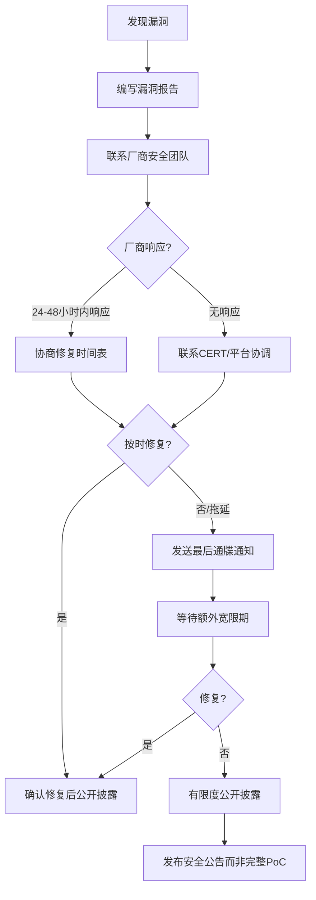

# 第02章 法律与道德 - 常见误区

> **本章导读**：网络安全领域存在大量法律认知误区，这些误区轻则导致研究者踩入灰色地带，重则直接引发刑事追诉。本章逐一拆解十大常见误区，通过法律条文解析、真实案例复盘和对比分析，帮助你建立正确的法律认知框架。每一个误区都附带"自检清单"，确保你在实际操作中能立即应用。

## 5.1 误区一：不造成损害就不违法

### 5.1.1 误解的来源

这种误解根植于日常生活中的朴素正义观——"没有受害者就没有犯罪"。在物理世界中，这一逻辑大致成立：如果没人受伤、没有财产损失，通常不会引发法律纠纷。许多人将这种直觉类推到网络空间，认为只要不删除数据、不瘫痪系统、不窃取资金，"看看而已"不算违法。

这种想法还受到技术社区中"好奇心无罪"文化的影响。在早期互联网时代，系统管理员和程序员之间存在一种默契：发现漏洞后"看看就走"被视为一种善意行为。但随着网络安全法律体系的完善，这种默契早已不复存在。

### 5.1.2 法律事实：行为犯而非结果犯

在大多数司法管辖区，**未经授权访问计算机系统本身就是犯罪**——这在刑法学上称为"行为犯"（行为完成即构成犯罪），而非"结果犯"（需要产生危害后果才构成犯罪）。

**中国法律框架**

《刑法》第285条规定了三个层次的罪名：

| 罪名 | 条款 | 构成要件 | 刑罚 |
|------|------|----------|------|
| 非法侵入计算机信息系统罪 | 第285条第1款 | 侵入国家事务、国防建设、尖端科学技术领域的计算机信息系统 | 三年以下有期徒刑 |
| 非法获取计算机信息系统数据罪 | 第285条第2款 | 违反国家规定，侵入前款规定以外的计算机信息系统，获取该计算机信息系统中存储、处理或者传输的数据 | 三年以下有期徒刑或拘役，并处或单处罚金；情节特别严重的，三年以上七年以下有期徒刑 |
| 非法控制计算机信息系统罪 | 第285条第3款 | 提供专门用于侵入、非法控制计算机信息系统的程序、工具 | 同上 |

关键点：**第285条第1款是典型的行为犯**——只要未经授权进入特定系统即构成犯罪，无需证明任何损害后果。第285条第2款虽然需要"获取数据"，但"获取"包括任何形式的数据读取，包括浏览器中查看网页源代码。

**美国法律框架**

《计算机欺诈与滥用法》（CFAA, 18 U.S.C. § 1030）同样不要求证明实际损害：

- **§ 1030(a)(2)**：未经授权获取信息，最高5年监禁（累犯最高10年）
- **§ 1030(a)(5)**：故意造成计算机损害，最高10年监禁
- **§ 1030(a)(1)**：未经授权访问并获取国家安全信息，最高10年监禁

2021年美国最高法院在 *Van Buren v. United States* 案中对"未经授权"的范围做了限缩解释，明确了CFAA不适用于"有权访问但违反使用政策"的情形。但**完全未经授权的访问仍然明确违法**。

**欧盟法律框架**

欧盟《网络犯罪公约》（布达佩斯公约）第2-6条将以下行为定为犯罪：

1. 非法访问（第2条）
2. 非法拦截（第3条）
3. 数据干扰（第4条）
4. 系统干扰（第5条）
5. 设备滥用（第6条）

其中第2条"非法访问"同样不要求造成损害结果。

### 5.1.3 真实案例复盘

**案例一：Marcus Hutchins（WannaCry英雄的另一面）**

Marcus Hutchins 因在2017年发现WannaCry勒索软件的"杀死开关"而被誉为英雄。但FBI随后发现，他在2014-2015年（青少年时期）创建了Kronos银行木马。尽管他声称当时只是"练习编程"，且Kronos的实际损害数据有限，他仍于2017年被逮捕并被起诉六项联邦重罪。2019年他认罪两项，被判处缓刑、社区服务和罚款。此案例说明：**即使你后来"改邪归正"，早期的未授权行为仍可被追诉**。

**案例二：Weev（Andrew Auernheimer）案**

2010年，安全研究员Andrew Auernheimer发现AT&T的iPad用户数据通过一个简单的URL枚举即可获取（没有认证保护）。他将漏洞信息提供给媒体。尽管AT&T的系统对任何人开放且无需认证，联邦检察官仍以CFAA起诉他。他最初被定罪并判处41个月监禁（后因审判地问题推翻）。此案说明：**系统本身的安全缺陷不构成你"有权访问"的法律依据**。

**案例三：中国"白帽"案**

近年来中国也出现多起安全研究员被追诉的案例。2019年，一名安全研究员在发现某电商平台的SQL注入漏洞后，进一步提取了部分用户数据以"证明漏洞严重性"，被以"非法获取计算机信息系统数据罪"起诉。法院认定：即使目的是善意的，未经授权获取用户数据的行为本身已构成犯罪。

### 5.1.4 自检清单

在进行任何安全测试前，确认以下事项：

- [ ] 是否获得系统所有者的**书面授权**？
- [ ] 授权范围是否**明确**（IP地址、域名、端口）？
- [ ] 授权是否在**有效期内**？
- [ ] 测试方法是否在授权范围内？
- [ ] 是否有**不造成损害**的约束条款？你的测试方案是否遵守？

### 5.1.5 正确理解

```text
┌──────────────────────────────────────────────────────────────────┐
│                    未经授权访问的法律定性                          │
├──────────────────────────────────────────────────────────────────┤
│                                                                  │
│  未授权访问 ──→ 行为犯 ──→ 行为完成即构成犯罪                     │
│       │                                                          │
│       ├── 是否造成损害？──→ 仅影响量刑，不影响定罪                │
│       │                                                          │
│       ├── 是否"只是看看"？──→ "看"即"获取数据"，构成犯罪          │
│       │                                                          │
│       └── 是否善意？──→ 动机不是法定免责事由                      │
│                                                                  │
└──────────────────────────────────────────────────────────────────┘
```

**核心原则**：未经授权访问本身就是违法的，"没有损害"不是有效的法律辩护，合法的安全测试必须有明确的书面授权。


## 5.2 误区二：漏洞赏金平台允许我测试任何系统

### 5.2.1 误解的来源

漏洞赏金（Bug Bounty）平台如HackerOne、Bugcrowd、漏洞盒子等的普及，让许多人第一次接触到"合法的黑客测试"概念。但平台的存在容易让人产生一种错觉：注册了平台账号就等于获得了"通用许可证"，可以在平台上列出的任何公司系统上进行测试。

### 5.2.2 法律事实：授权的精确边界

每个漏洞赏金计划都是一个**独立的、有明确边界的授权协议**。超出边界的部分，你与未注册平台的路人毫无区别。

**授权范围的三个维度**

| 维度 | 说明 | 超出范围的后果 |
|------|------|----------------|
| **资产范围**（Scope） | 计划明确列出的域名、IP、应用 | 未列出的资产=未授权，可能被起诉 |
| **方法范围**（Rules of Engagement） | 允许的测试技术（如SQL注入、XSS） | 使用禁止的技术（如DDoS、社会工程）可能违法 |
| **排除项**（Exclusions） | 明确排除的资产或行为 | 测试排除项等同于未经授权访问 |

**关键区别：平台账号≠授权**

HackerOne和Bugcrowd的服务条款都明确声明：**平台本身不授予对任何系统的测试授权**。授权来自资产所有者通过计划发布的具体条款。没有计划覆盖的系统，平台账号不提供任何法律保护。

### 5.2.3 真实案例复盘

**案例一：Orange Tsai vs. Facebook（2019）**

台湾安全研究员Orange Tsai在Facebook的漏洞赏金计划中发现了一个SSRF漏洞。在深入研究时，他通过该漏洞访问了Facebook内部服务器的本地端口，获取了Facebook企业VPN的源代码。Facebook最初拒绝支付赏金，理由是他访问了超出范围的内部系统。尽管最终Facebook承认了漏洞并支付了赏金，但此案说明：即使在漏洞赏金框架内，"越界探索"也可能面临法律风险。

**案例二：某安全研究员超范围测试案（2019）**

一名安全研究员在测试某公司的漏洞赏金计划时，发现计划范围内的一个子域名指向了另一台服务器。他认为"子域名应该都算范围内"，继续在该服务器上进行渗透测试，获取了大量数据。尽管他报告了漏洞，该公司仍选择追究其法律责任，因为他访问的服务器不在计划范围内。

**案例三：Zerodium等漏洞收购平台**

一些人误以为在Zerodium等平台上出售漏洞是"合法的"。实际上，这些平台只收购你通过合法途径发现的漏洞。如果你在未授权的系统上发现漏洞并出售，买卖双方都可能面临法律风险。

### 5.2.4 常见边界场景与判断

| 场景 | 是否在范围内 | 说明 |
|------|-------------|------|
| 计划列出了 `*.example.com`，你测试 `api.example.com` | ✅ 是 | 通配符匹配 |
| 计划列出了 `*.example.com`，你测试 `example.com.cn` | ❌ 否 | 不同域名不在通配符范围内 |
| 计划列出了移动应用，你通过逆向工程发现后端API | ⚠️ 灰色地带 | 需要确认后端API是否在范围内 |
| 你发现范围内系统连接了一个未列出的数据库 | ❌ 否 | 数据库不在范围内，不应继续 |
| 计划允许SQL注入，你在注入后尝试提权 | ⚠️ 灰色地带 | 需确认提权测试是否被明确允许 |

### 5.2.5 自检清单

- [ ] 仔细阅读计划的完整规则页面，包括所有排除项
- [ ] 确认目标资产在范围内（域名、IP、应用版本）
- [ ] 确认使用的测试技术在允许范围内
- [ ] 保存计划规则的截图（规则可能随时修改）
- [ ] 不确定时，**先联系计划管理员**，获取书面确认再行动
- [ ] 不要假设"子域名肯定在范围内"——必须逐一确认

### 5.2.6 正确理解

漏洞赏金计划是有**精确边界的有限授权**，不是一张"万能通行证"。在行动前，必须逐条确认资产范围、方法范围和排除项；不确定时，先问后做。


## 5.3 误区三：发现漏洞后立即公开是负责任的

### 5.3.1 误解的来源

"Full Disclosure"（完全披露）运动在安全社区有着悠久的历史。一些研究者认为，立即公开漏洞信息能迫使厂商尽快修复，同时让用户知情以采取防护措施。这种观点在理论上很有吸引力，但在实践中往往造成更大的伤害。

### 5.3.2 三种披露模式对比

| 模式 | 做法 | 优点 | 缺点 | 适用场景 |
|------|------|------|------|----------|
| **完全披露**（Full Disclosure） | 发现即公开 | 透明、迫使厂商行动 | 攻击者可立即利用 | 几乎不推荐 |
| **负责任披露**（Responsible Disclosure） | 先报告厂商，修复后公开 | 保护用户、给厂商修复时间 | 厂商可能拖延 | 推荐 |
| **协调披露**（Coordinated Disclosure） | 与厂商和CERT协调时间表 | 兼顾透明度和安全性 | 流程较长 | 最佳实践 |

### 5.3.3 负责任披露的标准流程



### 5.3.4 行业标准与时间表

**Google Project Zero：90天政策**

Google Project Zero的披露政策是目前最具影响力的行业标准之一：

- **90天**：从报告之日起，厂商有90天修复漏洞
- **宽限期**：如果厂商在第90天仍未修复，Google将公开漏洞详情
- **特殊情况**：如果漏洞被主动利用（0-day in the wild），披露时间缩短至7天
- **2024年更新**：对被利用的漏洞增加1天通知期后即公开

**其他主要政策**

| 组织 | 标准时间 | 特殊情况 |
|------|----------|----------|
| Google Project Zero | 90天 | 7天（在野利用） |
| Microsoft | 90天 | 可协商延期 |
| CERT/CC（卡内基梅隆） | 45天 | 可协商 |
| Zero Day Initiative | 120天 | 可协商 |
| 中国CNVD | 无强制时限 | 厂商承诺修复时间 |

### 5.3.5 真实案例复盘

**案例一：Heartbleed（2014）**

Heartbleed（CVE-2014-0160）是一个影响OpenSSL的严重漏洞，允许攻击者读取服务器内存中的敏感数据。发现者在2014年3月报告给NCSC和Red Hat，4月7日公开。短短几天内，大量服务器被攻击。如果披露过程更加协调，可能给更多组织留出修复窗口。

**案例二：EternalBlue泄露（2017）**

NSA的EternalBlue漏洞工具在2017年4月被Shadow Brokers泄露。微软在2017年3月已经发布了补丁（MS17-010），但许多组织未及时更新。两个月后，WannaCry勒索软件利用该漏洞在全球爆发，造成数十亿美元损失。此案例说明：**即使厂商已发布补丁，立即公开利用代码仍可能造成灾难**。

**案例三：Log4Shell（2021）**

Apache Log4j的远程代码执行漏洞（CVE-2021-44228）在2021年12月公开后，由于影响范围极广（几乎所有Java应用），立即引发了全球性的应急响应。许多组织在补丁可用之前就被攻击。事后分析表明，更长的协调披露窗口可能减少受影响的组织数量。

### 5.3.6 法律风险

在某些司法管辖区，不恰当的漏洞披露本身可能带来法律风险：

- **中国**：如果公开的漏洞信息被他人用于犯罪，披露者可能面临"帮助信息网络犯罪活动罪"的指控
- **美国**：如果披露包含可直接利用的代码，可能面临DMCA反规避条款的挑战
- **德国**：德国刑法典第202c条禁止传播"绕过安全措施的工具"

### 5.3.7 自检清单

- [ ] 编写专业的漏洞报告，包含影响范围、严重程度评估、复现步骤
- [ ] 通过厂商的安全联系方式报告（security@邮箱、漏洞赏金平台、CERT）
- [ ] 与厂商协商合理的修复时间表
- [ ] 保留所有沟通记录
- [ ] 仅在厂商不响应且经过合理等待后才考虑公开
- [ ] 公开时提供防护建议而非完整利用代码
- [ ] 考虑通过CNVD/CNNVD等官方平台协调

### 5.3.8 正确理解

负责任的披露需要给供应商合理的修复时间。立即公开可能让用户面临更大的风险。遵循行业最佳实践的披露流程，既保护用户也保护自己。


## 5.4 误区四：匿名就安全了

### 5.4.1 误解的来源

VPN广告、Tor浏览器的宣传、暗网市场的存在，共同构建了一种"匿名即安全"的神话。许多人相信，只要使用了匿名工具，就可以在网络空间中隐形。

### 5.4.2 匿名工具的技术局限

**VPN的真实保护能力**

| VPN特性 | 实际保护 | 局限性 |
|---------|---------|--------|
| IP地址隐藏 | ✅ 隐藏你的真实IP | VPN提供商知道你的真实IP |
| 流量加密 | ✅ 防止中间人窃听 | VPN提供商可以看到解密后的流量 |
| 地理位置伪装 | ✅ 可以选择其他国家的服务器 | 时区、语言设置可能泄露真实位置 |
| 日志政策 | ⚠️ 取决于提供商 | "无日志"承诺可能不实 |

**Tor的安全边界**

Tor通过多层加密和多跳路由提供匿名性，但它并非万无一失：

1. **入口和出口节点**：入口节点知道你的真实IP但不知道你访问的内容，出口节点知道你访问的内容但不知道你的真实IP。如果攻击者同时控制入口和出口节点（"端到端关联攻击"），可以去匿名化。

2. **流量分析**：2013年，NSA的XKeyscore项目据称能够对Tor用户进行大规模流量分析。虽然技术细节未公开，但这表明国家级对手具有超出一般预期的能力。

3. **浏览器漏洞**：2013年FBI通过Firefox漏洞（Tor浏览器基于Firefox）识别了多个Tor用户。2017年又有类似的漏洞被利用。

4. **行为指纹**：你的打字速度、语言风格、活跃时间、访问网站的习惯，都可以作为去匿名化的线索。

### 5.4.3 执法机构的追踪能力

现代执法机构拥有多种去匿名化技术：

- **流量关联分析**：比较VPN/Tor入口流量和出口流量的时间和大小模式
- **蜜罐/监控节点**：运行Tor出口节点或VPN服务器以记录流量
- **法律传票**：要求VPN/服务提供商交出用户数据
- **浏览器指纹**：通过Canvas、WebGL、字体列表等生成唯一标识
- **跨站追踪**：即使使用Tor，登录真实账户即暴露身份
- **供应链渗透**：在匿名工具的供应链中植入监控能力
- **金钱追踪**：加密货币交易虽然匿名但可追溯（区块链是公开账本）

### 5.4.4 真实案例复盘

**案例一：Ross Ulbricht（Silk Road，2013）**

Silk Road是暗网上最大的非法市场。创始人Ross Ulbricht使用Tor运营网站，但他最终被FBI通过以下方式锁定：

1. 早期帖子中使用的电子邮件地址与他的真实身份关联
2. 服务器日志显示从一个VPN连接到Silk Road服务器
3. FBI通过海关拦截的方式获取了他的笔记本电脑（未锁定状态）
4. 最终被判终身监禁，不得假释

**案例二：Hansa Market卧底行动（2017）**

荷兰警方秘密接管了暗网市场Hansa Market的服务器，在其运营期间收集了所有用户的数据——包括IP地址、交易记录和加密货币钱包地址。在关闭另一个暗网市场AlphaBay后，大量用户涌入Hansa，全部落入警方的数据收集网中。

**案例三：比特币追踪（Colonial Pipeline，2021）**

2021年Colonial Pipeline被勒索软件攻击，支付了75比特币赎金。FBI通过区块链分析追踪到赎金流向，成功追回了63.7比特币（约230万美元）。这证明了加密货币并非"不可追踪"。

**案例四：中国"净网"行动**

中国公安机关近年来多次破获使用VPN、Tor等工具进行网络犯罪的案件。通过ISP日志、流量分析和跨平台关联，成功识别和逮捕了大量犯罪嫌疑人。

### 5.4.5 去匿名化技术层级

```text
┌─────────────────────────────────────────────────────────────┐
│                  去匿名化技术层级金字塔                       │
│                                                              │
│                        ▲ 国家级对手                          │
│                       ╱ ╲                                    │
│                      ╱   ╲ 零日漏洞、供应链渗透               │
│                     ╱─────╲                                  │
│                    ╱       ╲ 流量关联分析、蜜罐节点            │
│                   ╱─────────╲                                │
│                  ╱           ╲ 法律传票、ISP日志              │
│                 ╱─────────────╲                              │
│                ╱               ╲ 浏览器指纹、跨站追踪          │
│               ╱─────────────────╲                            │
│              ╱                   ╲ 社会工程学、行为分析        │
│             ╱─────────────────────╲                          │
│            ╱                       ╲ 基础IP追踪              │
│           ╱─────────────────────────╲                        │
│                                                              │
│   ▲ 难度递增    ▼ 对手能力递减                               │
└─────────────────────────────────────────────────────────────┘
```

### 5.4.6 自检清单

- [ ] 不要假设任何工具提供"完美匿名"
- [ ] 了解你使用的匿名工具的技术原理和已知局限
- [ ] 合法的安全研究**不需要匿名**——如果有，说明你的方法可能有问题
- [ ] 不要在匿名网络上登录与真实身份关联的账户
- [ ] 不要相信"无日志"VPN——无法独立验证
- [ ] 始终假设你可能被监控

### 5.4.7 正确理解

匿名工具增加追踪难度，但不能保证完全匿名。违法行为即使使用匿名工具也可能被追踪，合法的安全研究不需要匿名——如果你觉得需要匿名才能做某件事，那你应该重新审视这件事本身是否合法。


## 5.5 误区五：国外的法律不适用于我

### 5.5.1 误解的来源

物理世界中，法律的管辖权确实主要以领土为界。许多人因此推断：在中国境内对美国服务器发起攻击，只受中国法律管辖，美国法律管不到我。

### 5.5.2 网络犯罪的管辖权原则

网络犯罪的管辖权比传统犯罪复杂得多，各国法律体系都扩展了自己的管辖范围：

| 管辖权类型 | 说明 | 例子 |
|-----------|------|------|
| **属地管辖** | 犯罪行为发生地的法律适用 | 在中国境内发起的攻击适用中国法律 |
| **属人管辖** | 犯罪者国籍国的法律适用 | 中国公民在海外犯罪仍受中国法律管辖 |
| **保护管辖** | 受害国的法律适用 | 中国公民攻击美国系统，美国可以主张管辖权 |
| **普遍管辖** | 严重犯罪适用国际法 | 某些跨国网络犯罪适用国际公约 |
| **长臂管辖** | 通过最低限度连接主张管辖权 | 使用了美国的服务器/域名/支付通道即可触发 |

**美国的"长臂管辖"**

美国通过以下方式主张对跨国网络犯罪的管辖权：

1. **CFAA的域外适用**：只要犯罪行为"涉及"美国的计算机系统（包括使用美国云服务器）
2. **美元结算管辖**：任何使用美元结算的交易，美国都可能主张管辖权
3. **引渡条约**：美国与100多个国家签有引渡条约
4. **国际合作**：FBI在全球主要国家驻有法律参事

**中国的管辖权规定**

《刑法》第7-9条规定了中国的域外管辖权：

- **第7条（属人管辖）**：中国公民在境外犯罪，最高刑为三年以上有期徒刑的，适用中国法律
- **第8条（保护管辖）**：外国人在境外对中国国家或公民犯罪，按中国法律最低刑为三年以上有期徒刑的，适用中国法律
- **第9条（普遍管辖）**：中国缔结或参加的国际条约所规定的犯罪，中国在所承担条约义务的范围内行使刑事管辖权

### 5.5.3 真实案例复盘

**案例一：中国APT组织被起诉（2014-2020）**

美国多次起诉中国人民解放军和国家安全部的黑客成员。2014年起诉5名PLA 61398部队成员，2018年起诉两名MSS（国家安全部）关联黑客，2020年起诉两名云南关联黑客。虽然这些起诉的实际执行力有限，但它确立了一个原则：**美国愿意对任何国家的公民提起网络犯罪指控**。

**案例二：Roman Seleznev案（2014）**

俄罗斯公民Roman Seleznev因黑客攻击美国零售系统窃取信用卡数据，2014年在马尔代夫被美国特勤局逮捕并引渡到美国受审，被判处27年监禁——这是当时美国网络犯罪案件中最长的刑期。他的父亲是俄罗斯国会议员，但俄罗斯的政治关系未能保护他。

**案例三：Lauri Love案（2013-2018）**

英国公民Lauri Love被指控入侵美国政府系统（包括NASA、US Army、Federal Reserve）。美国要求引渡，英国法院最初批准，后因Love的健康状况（Asperger综合征和抑郁症）拒绝引渡。此案说明：即使引渡请求最终被拒绝，**面临引渡本身就已经是巨大的法律风险**。

**案例四：中国公民被通缉（2017-2024）**

美国FBI通缉令上有多名中国公民，涉及网络间谍、商业机密窃取等指控。虽然他们在中国境内暂时安全，但一旦前往与美国有引渡条约的国家，就面临被逮捕的风险。

### 5.5.4 跨国网络安全法律对比

| 国家/地区 | 主要法律 | 未授权访问刑罚 | 特殊规定 |
|-----------|---------|---------------|---------|
| 中国 | 刑法第285-287条 | 3-7年有期徒刑 | 专门针对关键信息基础设施有加重条款 |
| 美国 | CFAA (18 U.S.C. §1030) | 5-20年监禁 | 域外适用能力强 |
| 欧盟 | 各成员国法律+网络犯罪公约 | 各国不同 | GDPR增加数据保护相关罪名 |
| 英国 | Computer Misuse Act 1990 | 最高10年监禁 | 2015年修正案加重了刑罚 |
| 日本 | 不正アクセス禁止法 | 最高3年监禁 | 包括"未遂"也构成犯罪 |
| 德国 | 刑法典第202a-202c条 | 最高3年监禁 | 第202c条专门针对黑客工具传播 |

### 5.5.5 自检清单

- [ ] 在进行跨国安全研究前，了解目标系统所在国家的法律
- [ ] 了解中国《刑法》的域外管辖条款
- [ ] 了解美国CFAA的域外适用范围
- [ ] 如果可能面临跨国法律风险，咨询具有国际经验的律师
- [ ] 注意：使用美国公司的云服务（AWS、Azure、GCP）可能触发美国管辖权
- [ ] 注意：使用美元结算可能触发美国管辖权

### 5.5.6 正确理解

网络犯罪案件具有跨国性质。中国公民攻击外国系统，既可能受中国法律管辖，也可能受受害国法律管辖。了解主要国家的网络安全法律，在进行跨国安全研究时咨询法律专家。


## 5.6 误区六：安全研究不需要律师

### 5.6.1 误解的来源

安全研究是一项高度技术性的工作，许多研究者认为法律问题离他们很远，律师只会"妨碍"他们的研究。这种技术至上的态度在安全社区中颇为常见。

### 5.6.2 安全研究涉及的法律领域

安全研究远不只是"找到漏洞"这么简单，它可能触及多个法律领域：

| 法律领域 | 相关问题 | 风险等级 |
|---------|---------|---------|
| **刑法** | 未经授权访问、数据窃取、破坏计算机系统 | 🔴 极高 |
| **民法** | 侵权责任、合同违约（违反TOS） | 🟡 中等 |
| **知识产权法** | 逆向工程的合法性、DMCA反规避条款 | 🟡 中等 |
| **数据保护法** | GDPR、《个人信息保护法》涉及用户数据的处理 | 🟡 中等 |
| **合同法** | NDA（保密协议）、漏洞赏金规则 | 🟢 较低 |
| **出口管制法** | 某些加密技术的出口限制 | 🟢 较低 |

### 5.6.3 律师在安全研究中的角色

**研究前**

- 审查授权协议的法律效力
- 确认测试范围是否明确
- 评估潜在的法律风险
- 准备应急法律方案

**研究中**

- 遇到灰色地带时提供法律意见
- 审查数据处理方式是否合规
- 确保发现的敏感数据得到妥善处理

**研究后**

- 协助编写漏洞报告（措辞可能影响法律后果）
- 协助与厂商进行负责任的披露沟通
- 如果面临法律威胁，提供紧急辩护

### 5.6.4 真实案例复盘

**案例一：Aaron Swartz案件（2011-2013）**

Aaron Swartz因从JSTOR大量下载学术论文被起诉。虽然他的目的是开放学术资源，但检察官以CFAA的多项重罪起诉他，面临最高35年监禁和100万美元罚款。Swartz的辩护律师团队虽然优秀，但案件的复杂性远超预期。2013年1月，Swartz在压力下自杀。事后，法律专家普遍认为：如果他在行为前咨询了律师，了解了法律风险，结果可能完全不同。此案件还推动了美国国会讨论修改CFAA（"Aaron's Law"法案，虽未通过）。

**案例二：Weev（Andrew Auernheimer）案**

Weev在发现AT&T的漏洞后没有咨询律师就直接将数据提供给媒体。如果他在行动前咨询律师，律师可能会建议他通过漏洞赏金平台或直接联系AT&T来报告漏洞，而不是公开数据。

**案例三：Raphael Gray（"Curador"案）**

2000年，英国18岁的Raphael Gray入侵了多个电子商务网站的信用卡数据库，声称是为了揭露这些网站的安全漏洞。他没有律师，被捕后在法庭上的辩护混乱不堪。最终被判处软禁和社区服务。

### 5.6.5 如何找到合适的安全律师

安全法律是一个高度专业化的领域，你需要找到既懂技术又懂法律的专业人士：

1. **寻找具有网络安全经验的律师**：他们应该了解CFAA、刑法第285条等法律的实际应用
2. **寻找有处理安全研究案件经验的律师**：了解漏洞赏金、负责任披露的法律框架
3. **考虑国际合作**：如果涉及跨国研究，可能需要多个国家的律师
4. **提前建立关系**：在危机发生前建立律师关系，而不是在被逮捕后才找律师
5. **利用行业资源**：EFF（电子前沿基金会）为安全研究者提供免费法律咨询

### 5.6.6 自检清单

- [ ] 在开始可能有风险的研究前，咨询律师
- [ ] 让律师审查你的授权协议
- [ ] 让律师审查你的漏洞报告措辞
- [ ] 建立与专业律师的长期合作关系
- [ ] 保存EFF等组织的法律援助联系方式
- [ ] 了解你所在地区的法律援助资源

### 5.6.7 正确理解

法律咨询是安全研究的重要组成部分，不是可选项。在开始可能有风险的研究前咨询律师，在遇到法律问题时及时寻求专业帮助，建立与专业律师的长期合作关系。


## 5.7 误区七：开源软件的安全研究不需要授权

### 5.7.1 误解的来源

开源软件的核心理念就是"开放"——代码公开、任何人可以查看、修改和分发。许多人因此推断：既然代码是公开的，对其进行安全研究自然不需要额外的授权。

### 5.7.2 法律事实：两种行为的本质区别

这个误区的核心在于混淆了两种根本不同的行为：

| 行为 | 性质 | 法律地位 | 是否需要授权 |
|------|------|---------|-------------|
| **代码审查** | 阅读和分析公开的源代码 | ✅ 合法 | 不需要 |
| **实例测试** | 对运行中的系统进行安全测试 | ⚠️ 取决于目标 | 需要目标系统所有者授权 |
| **漏洞利用** | 在未授权系统上利用发现的漏洞 | ❌ 违法 | 不可能获得"通用授权" |

**关键逻辑**

开源许可（如MIT、GPL、Apache）授予你的是**代码的使用权**，不是**对运行该代码的系统的测试权**。类比：一本出版的锁具设计图纸是公开的，但你不能拿着图纸去撬别人的锁。

### 5.7.3 安全研究的合法实践路径

**路径一：本地测试环境（推荐）**

```text
┌─────────────────────────────────────────────────────────┐
│                    本地测试环境搭建                        │
│                                                          │
│  1. 克隆开源项目源代码                                     │
│  2. 在本地/隔离网络中编译部署                              │
│  3. 在自己的环境中进行安全测试                             │
│  4. 发现漏洞后通过官方渠道报告                             │
│  5. 不触碰任何他人的生产环境                               │
│                                                          │
│  ✅ 完全合法  ✅ 零法律风险  ✅ 伦理合规                   │
└─────────────────────────────────────────────────────────┘
```

**路径二：代码审计（纯静态分析）**

仅阅读和分析源代码，不进行任何动态测试。这包括：

- 代码审查（Code Review）
- 静态分析工具扫描
- 手动漏洞搜索
- 架构安全性评估

**路径三：协调漏洞研究（通过官方渠道）**

许多开源项目有专门的安全报告渠道：

- **GitHub Security Advisories**：通过GitHub的安全漏洞报告功能
- **项目安全邮箱**：通常为 security@project.org
- **HackerOne等平台**：一些开源项目在平台上开设了漏洞赏金计划

### 5.7.4 真实案例复盘

**案例一：OpenSSL Heartbleed（2014）**

Heartbleed漏洞最初由Google的Neel Mehta和芬兰安全公司Codenomicon的研究人员独立发现。他们都是通过代码审计发现的，然后通过负责任的披露流程报告给OpenSSL团队。这是合法的安全研究典范。

**案例二：Log4Shell（2021）**

Log4j漏洞最初由阿里巴巴云安全团队的Chen Zhaojun在内部测试中发现。他通过阿里云的安全团队向Apache报告了漏洞。但据报，漏洞信息在正式披露前就已泄露，导致了混乱。此案例说明：**即使是合法发现的漏洞，信息披露过程也需要严格控制**。

**案例三：开源项目维护者被骚扰**

近年来，一些安全研究者在发现开源项目漏洞后，对维护者施加压力甚至骚扰，要求立即修复。虽然发现漏洞本身是合法的，但骚扰行为可能构成违法。2018年，一名研究者因对Node-RED项目维护者的威胁行为被社区封禁。

### 5.7.5 常见场景判断矩阵

| 场景 | 合法性 | 说明 |
|------|--------|------|
| 阅读Linux内核源代码寻找漏洞 | ✅ 合法 | 纯代码审查 |
| 在本地Docker容器中测试Nginx漏洞 | ✅ 合法 | 本地测试环境 |
| 对生产中的Nginx服务器进行渗透测试 | ⚠️ 需授权 | 需要服务器所有者授权 |
| 对他人运行的WordPress站点进行安全扫描 | ❌ 违法 | 未经授权的实例测试 |
| 在自己的服务器上测试WordPress漏洞 | ✅ 合法 | 自己的环境 |
| 发现漏洞后直接在GitHub issue中公开PoC | ⚠️ 有风险 | 应先通过安全渠道报告 |

### 5.7.6 自检清单

- [ ] 区分代码审查和实例测试——前者合法，后者可能违法
- [ ] 在本地环境中搭建测试实例
- [ ] 不要对他人运行的系统进行安全测试（即使代码是开源的）
- [ ] 通过项目的官方安全渠道报告漏洞
- [ ] 不要在公开渠道直接发布完整的漏洞利用代码
- [ ] 考虑参加有明确授权的开源漏洞赏金计划

### 5.7.7 正确理解

代码审查和系统测试是完全不同的行为。对开源代码的审查是合法且受鼓励的，但对他人运行的系统实例进行测试仍然需要授权。在自己的环境中研究是安全的，遵循项目的漏洞报告流程。


## 5.8 误区八：法律会保护"白帽"黑客

### 5.8.1 误解的来源

"白帽"与"黑帽"的二分法在安全社区深入人心。许多人认为，只要自己的目的是"好的"——发现漏洞、提高安全性、帮助他人——法律就会站在自己一边。这种想法将道德判断与法律判断混为一谈。

### 5.8.2 法律事实：善意不是免责事由

法律体系运作的基本逻辑是**规则主义**，而非**目的主义**：

- **法律保护的是合法行为**，而不是善意动机
- **"我是为了帮助他们"**不是有效的法律辩护
- **未经书面授权的测试**，即使是"善意"的，也可能构成犯罪

**中国法律中的"善意"抗辩**

中国《刑法》中没有"善意黑客"的免责条款。以下是可能的辩护路径及其实效：

| 辩护路径 | 法律依据 | 实际效果 |
|---------|---------|---------|
| 主观无恶意 | 刑法第13条"但书"（情节显著轻微） | ⚠️ 可能有效但不确定 |
| 紧急避险 | 刑法第21条 | ❌ 通常不适用于网络安全场景 |
| 被害人承诺 | 刑法理论争议 | ❌ 未经授权≠承诺 |
| 行为不构成犯罪 | 具体条文分析 | ⚠️ 取决于具体行为 |

**美国法律中的类似情况**

美国CFAA同样没有"善意黑客"的免责条款。Van Buren案虽然限缩了"未经授权"的范围，但完全未经授权的访问仍然明确违法。

### 5.8.3 真实案例复盘

**案例一：Hewlett Packard pretexting丑闻（2006）**

HP董事长Patricia Dunn雇用调查人员通过pretexting（社会工程学）获取董事会成员的电话记录，目的是调查内部泄密。虽然目的是保护公司利益，但她的行为仍构成犯罪，被起诉并最终辞去董事长职务。

**案例二：中国安全研究员被诉案**

在中国，有安全研究员在发现电商平台漏洞后主动报告，但仍因未经授权的测试行为被起诉。法院的逻辑很清晰：**发现漏洞后的报告行为值得肯定，但此前未经授权的测试行为仍然违法**。两者是独立的法律事实。

**案例三：HackerOne的法律保护局限**

即使在HackerOne平台上，如果研究员超出计划范围进行测试，平台也不会提供法律保护。HackerOne的服务条款明确声明：平台不对研究员的行为承担法律责任。

### 5.8.4 "善意"与"合法"的关系图

```text
┌──────────────────────────────────────────────────────────────┐
│               善意与合法的四个象限                              │
│                                                               │
│         善意                      非善意                      │
│    ┌──────────────────┬──────────────────┐                   │
│ 合 │                  │                  │                    │
│ 法 │  ✅ 最佳实践      │  ❓ 合法但可疑    │                    │
│    │  授权测试+善意    │  授权但动机可疑   │                    │
│    │  法律保护✅       │  法律保护✅       │                    │
│    ├──────────────────┼──────────────────┤                   │
│ 非 │                  │                  │                    │
│ 合 │  ⚠️ 善意≠免责    │  ❌ 明确违法      │                    │
│ 法 │  未授权+善意      │  未授权+恶意     │                    │
│    │  可能被起诉       │  严重犯罪        │                    │
│    └──────────────────┴──────────────────┘                   │
│                                                               │
│  关键：只有左上角（合法+善意）才是安全的                       │
└──────────────────────────────────────────────────────────────┘
```

### 5.8.5 如何正确地做"白帽"

1. **获取书面授权**：在任何测试前，获得系统所有者的明确书面授权
2. **明确测试范围**：与授权方书面确认测试的资产范围和方法范围
3. **遵守规则**：严格按照授权范围行事
4. **负责任披露**：发现问题后通过正当渠道报告
5. **保留证据**：保存所有授权文件和沟通记录
6. **咨询律师**：在高风险研究前咨询专业律师

### 5.8.6 自检清单

- [ ] 不要假设"好的意图"能保护你
- [ ] 获取书面授权是法律保护的唯一可靠来源
- [ ] 即使对方口头同意，也要获取书面文件
- [ ] 即使发现了严重漏洞，未经授权的测试行为仍可能被追究
- [ ] "白帽"是一个职业道德标签，不是法律保护标签

### 5.8.7 正确理解

法律保护的是合法行为，不是善意。必须在测试前获取书面授权，善意不能免除法律责任。"白帽"是一种职业道德选择，而不是一种法律身份。


## 5.9 误区九：漏洞信息是公开的，所以分享漏洞利用代码没问题

### 5.9.1 误解的来源

CVE、NVD、CNVD等漏洞数据库公开了大量漏洞信息，安全博客和会议论文中也有大量漏洞分析。许多人认为：既然漏洞信息公开了，分享对应的漏洞利用代码（exploit/PoC）也是合理的。

### 5.9.2 法律事实：漏洞信息与漏洞利用代码的法律区别

| 类别 | 定义 | 例子 | 法律风险 |
|------|------|------|---------|
| **漏洞信息** | 描述漏洞的存在、影响、原理 | CVE描述、安全公告 | 🟢 较低 |
| **概念验证（PoC）** | 证明漏洞存在的最小代码 | 一个触发崩溃的输入 | 🟡 中等 |
| **漏洞利用代码（Exploit）** | 可实际利用漏洞的完整代码 | 远程代码执行脚本 | 🔴 较高 |
| **武器化工具** | 集成多种攻击能力的工具 | 完整的攻击框架 | 🔴 极高 |

关键区别在于**可用性**：漏洞信息告诉你"这里有个洞"，漏洞利用代码给了你"打开这扇门的钥匙"。法律对后者的管制要严格得多。

### 5.9.3 各国法律对漏洞利用代码的管制

**美国：DMCA反规避条款**

《数字千年版权法》（DMCA）第1201条禁止"规避技术保护措施"的行为和工具。这意味着：

- 编写用于绕过DRM（数字版权管理）的代码可能违法
- 分发用于绕过技术保护措施的工具可能违法
- 例外：安全研究（有严格的条件限制）

2018年美国版权局扩大了安全研究的DMCA豁免，但条件严格：只能在"善意的、合法的安全研究"中使用，且必须采取"合理措施"防止滥用。

**中国：帮助信息网络犯罪活动罪**

《刑法》第287条之二规定了"帮助信息网络犯罪活动罪"：明知他人利用信息网络实施犯罪，为其犯罪提供技术支持或帮助的，情节严重的，处三年以下有期徒刑或拘役，并处或单处罚金。

这意味着：如果你分享的漏洞利用代码被他人用于犯罪，你可能面临此罪名的指控——即使你自己没有实施犯罪。

**德国：刑法典第202c条**

德国刑法典第202c条"预备窥探数据和拦截数据"禁止以下行为：

- 生产、获取、销售或分发"旨在实施第202a或202b条犯罪"的密码或其他安全代码
- 制作、获取、销售或分发能够用于绕过安全措施的计算机程序

这一条款的范围非常宽泛，理论上连Metasploit等合法安全工具的分发都可能落入其范围。德国安全社区对此条款的批评持续不断。

**英国：Computer Misuse Act第3A条**

英国《计算机滥用法》第3A条（2006年修正案）专门针对"制造、供应或获取用于计算机犯罪的工具"：

- 制作或改编用于实施犯罪的工具：最高2年监禁
- 供应或提供此类工具：最高2年监禁
- 获取此类工具（意图使用）：最高2年监禁

### 5.9.4 真实案例复盘

**案例一：Marcus Hutchins的Kronos木马**

如前所述，Hutchins在青少年时期创建了Kronos银行木马。他声称当时只是"练习编程"，但Kronos被实际用于网络犯罪。2019年他认罪并被判处缓刑。此案例说明：**创建攻击工具的行为本身可能构成犯罪，即使你声称没有恶意使用意图**。

**案例二：DigiTrust Security案（德国）**

2014年，德国安全公司DigiTrust Security的创始人因在会议上演示了绕过德国电子身份证（ePA）的安全措施而被调查。虽然最终未被起诉，但此案件展示了德国第202c条对安全研究的寒蝉效应。

**案例三：Immunity Canvas和Core Impact**

这些商业渗透测试工具在购买时都要求签署严格的使用协议，限制用于合法的安全测试。如果将这些工具的破解版分享给他人，分享者可能面临多重法律风险。

### 5.9.5 负责任的漏洞信息披露指南

| 内容类型 | 是否可以公开分享 | 注意事项 |
|---------|----------------|---------|
| 漏洞描述（无代码） | ✅ 通常可以 | 不包含可直接利用的技术细节 |
| 修复建议 | ✅ 应该公开 | 帮助用户保护自己 |
| 概念验证（PoC） | ⚠️ 谨慎 | 在厂商修复后再公开，且仅证明漏洞存在 |
| 完整利用代码（Exploit） | ❌ 高风险 | 可能触发刑事责任 |
| 武器化工具 | ❌ 极高风险 | 几乎必然面临法律问题 |

### 5.9.6 自检清单

- [ ] 区分漏洞信息和漏洞利用代码——法律风险截然不同
- [ ] 在厂商修复漏洞前，不要公开利用代码
- [ ] 公开PoC时，删除可直接用于攻击的功能
- [ ] 了解所在国家对漏洞利用代码的管制法律
- [ ] 分享安全研究时，添加法律免责声明
- [ ] 使用负责任的披露平台（CNVD、HackerOne等）协调

### 5.9.7 正确理解

漏洞信息和漏洞利用代码在法律上有本质区别。传播漏洞利用代码可能触发刑事责任（中国的帮助信息网络犯罪活动罪、美国的DMCA、德国的第202c条）。在分享安全研究时，始终考虑法律影响。


## 5.10 误区十：安全认证就是法律许可

### 5.10.1 误解的来源

CEH（认证道德黑客）、OSCP（进攻性安全认证专家）、CISSP（注册信息系统安全专家）等认证在安全行业中具有很高的声誉。一些人认为，获得这些认证就等于获得了"执照"，可以合法地进行渗透测试。

### 5.10.2 法律事实：认证≠授权

| 概念 | 含义 | 法律效力 |
|------|------|---------|
| **认证**（Certification） | 证明你具有某方面的技术能力 | ❌ 不授予任何法律权限 |
| **执照**（License） | 政府颁发的从业资格证明 | ⚠️ 仅在特定行业有效 |
| **授权**（Authorization） | 系统所有者授予的测试许可 | ✅ 这是法律保护的唯一来源 |

安全认证的本质是**能力证明**，类似于驾照证明你会开车——但驾照不给你开别人车的权利。每次开别人的车，你仍然需要车主的同意。

### 5.10.3 认证的实际价值

虽然认证不提供法律保护，但它们确实有重要价值：

**在法律辩护中的间接作用**

- **专业性证明**：如果你面临法律诉讼，持有OSCP等认证可以帮助证明你的行为是"专业安全测试"而非"黑客攻击"
- **合理注意义务**：认证表明你受过专业训练，了解安全测试的标准和伦理
- **减轻处罚因素**：在某些司法管辖区，专业资质可能作为量刑的减轻因素

**在商业中的价值**

- **客户信任**：客户更愿意将渗透测试合同交给持有认证的安全团队
- **保险要求**：一些网络安全责任保险要求测试人员持有特定认证
- **合规要求**：一些行业标准（如PCI DSS）要求渗透测试由合格人员执行

### 5.10.4 主要安全认证对比

| 认证 | 颁发机构 | 侧重点 | 伦理条款 | 市场认可度 |
|------|---------|--------|---------|-----------|
| **OSCP** | Offensive Security | 实战渗透测试 | 有严格的行为准则 | 🔴 极高（技术圈） |
| **CEH** | EC-Council | 伦理黑客 | 要求签署伦理誓言 | 🟡 中等 |
| **CISSP** | (ISC)² | 信息安全管理 | 要求遵守(ISC)²伦理准则 | 🔴 极高（管理层） |
| **GPEN** | SANS/GIAC | 渗透测试 | 有伦理条款 | 🔴 极高 |
| **CISP-PTE** | 中国信息安全测评中心 | 渗透测试（中国） | 要求遵守中国法律 | 🔴 高（中国市场） |

### 5.10.5 真实案例复盘

**案例：认证持有者被起诉**

在多个已知案例中，持有安全认证的人员因在未获授权的情况下进行安全测试而被起诉。法院在判决中明确指出：**认证不构成进行未经授权测试的法律依据**。持有CEH或OSCP认证的事实不改变未经授权访问的违法性质。

### 5.10.6 自检清单

- [ ] 不要假设认证给你任何法律保护
- [ ] 每次测试都需要独立的书面授权
- [ ] 将认证视为专业能力的证明，而非法律许可
- [ ] 保持认证的伦理条款的遵守（违反可能导致认证被撤销）
- [ ] 在法律辩护中，认证可以作为辅助证据，但不是核心辩护依据

### 5.10.7 正确理解

认证和授权是完全不同的概念。认证证明你的技术能力，授权来自系统所有者的明确许可。每次测试都需要独立的书面授权，认证不能替代授权。


## 本节小结

### 十大误区速查表

| # | 误区 | 正确理解 | 核心法律原则 |
|---|------|---------|-------------|
| 1 | 不造成损害就不违法 | 未经授权访问是行为犯，无需证明损害 | 刑法第285条 / CFAA |
| 2 | Bug Bounty允许测试任何系统 | 每个计划有精确的授权边界 | 授权范围=法律保护范围 |
| 3 | 立即公开是负责任的 | 应先给厂商合理的修复时间 | 负责任披露流程 |
| 4 | 匿名就安全了 | 匿名工具增加难度但不保证安全 | 执法技术持续进化 |
| 5 | 国外法律不适用 | 网络犯罪具有跨国管辖权 | 属地/属人/保护管辖 |
| 6 | 不需要律师 | 安全研究涉及多个法律领域 | 事前预防胜于事后辩护 |
| 7 | 开源研究不需要授权 | 代码审查合法，实例测试需授权 | 使用权≠测试权 |
| 8 | 法律保护白帽 | 法律保护合法行为，不保护善意 | 善意≠免责事由 |
| 9 | 公开漏洞信息就能分享Exploit | 漏洞信息与Exploit法律风险不同 | 各国有专门管制法律 |
| 10 | 认证就是许可 | 认证是能力证明，不是法律授权 | 每次测试需要独立授权 |

### 核心行动指南

1. **永远获取书面授权**——这是一切合法安全研究的基础
2. **明确授权边界**——资产范围、方法范围、时间范围
3. **遵循负责任披露流程**——先报告，后公开
4. **咨询专业律师**——在高风险研究前寻求法律意见
5. **了解相关法律**——至少熟悉中国《刑法》第285-287条和主要国家的网络安全法律
6. **保留所有记录**——授权文件、沟通记录、测试日志

> **最后的忠告**：在安全研究中，保护自己的最好方式是在法律框架内行事。法律的边界是明确的，不要试图在灰色地带行走。如果某件事让你觉得"需要匿名才能做"，那它大概率是违法的。真正的"白帽"不是通过意图来定义的，而是通过合法的行为来定义的。
