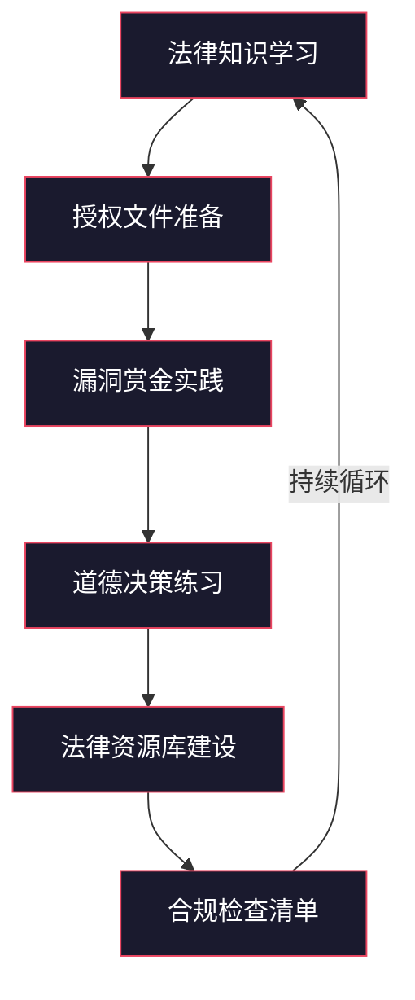
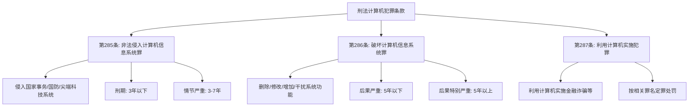
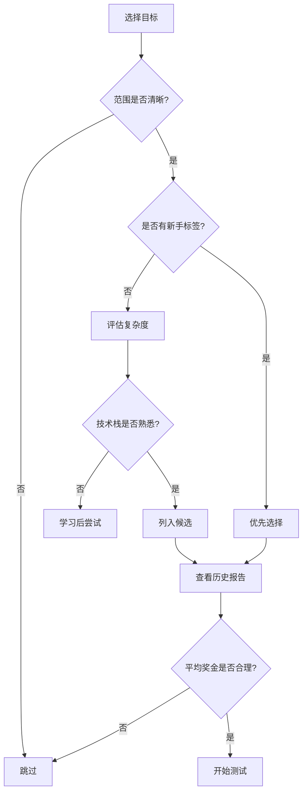
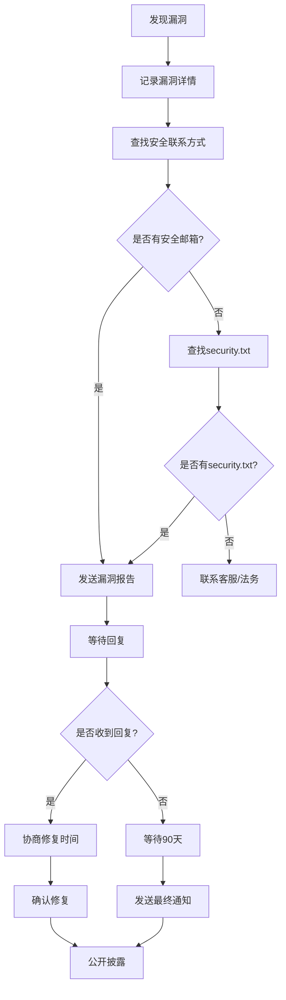
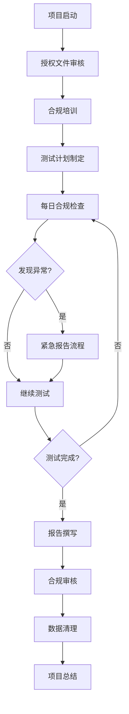

# 第02章 法律与道德 - 练习方法

法律与道德知识不能仅停留在理论层面，必须通过系统化的练习将其内化为本能反应。本节提供六大模块的实操练习，覆盖从法律知识学习到合规检查的完整闭环。每个练习都包含具体任务、参考答案和自评标准，确保读者能够独立完成并检验学习效果。



## 6.1 法律知识学习

### 6.1.1 中国网络安全法律体系学习

**学习目标**：能够准确说出每部法律的立法目的、关键条款、违法后果，并能在实际场景中判断行为是否合法。

**学习路线图**


#### 第一周：《网络安全法》精读

**阅读任务**

《网络安全法》全文共七章七十九条，逐条阅读并完成以下笔记模板：

| 条款 | 核心内容 | 对安全研究的影响 | 个人理解 |
|------|---------|-----------------|---------|
| 第21条 | 网络安全等级保护制度 | 测试前必须确认目标系统的保护等级 | （填写） |
| 第27条 | 禁止非法侵入他人网络 | 明确了"未经授权"的法律红线 | （填写） |
| 第44条 | 禁止非法获取个人信息 | 渗透测试中发现数据需立即报告 | （填写） |
| 第63条 | 违法行为的处罚 | 最高可处违法所得10倍罚款 | （填写） |

**重点精读章节**

- **第二章（网络安全支持与促进）**：理解国家对网络安全的整体战略，特别是第15条关于网络安全人才培养的表述——这是安全研究合法化的政策基础
- **第三章（第21条-第39条）**：网络运行安全，重中之重是等级保护制度。需要理解等保2.0的五个等级分别对应什么系统，不同等级的系统对安全测试的要求有何不同
- **第四章（第40条-第50条）**：网络信息安全，重点理解个人信息的定义和处理规则。第42条的"网络运营者应当采取技术措施和其他必要措施，确保其收集的个人信息安全"是数据泄露事件中最常被引用的条款

**练习1：场景判断**

对以下场景逐条分析合法性，引用具体法律条款：

1. 某安全研究员在未获授权的情况下，对公司官网进行了端口扫描，发现了一个开放的管理后台，但未进行任何进一步操作
2. 某公司安全部门员工在工作职责范围内对内部系统进行渗透测试，但没有书面授权
3. 某白帽黑客在补天平台发现某企业漏洞，按照平台规则提交报告后，企业拒绝修复也拒绝支付赏金，研究员在社交媒体上公布了漏洞详情
4. 某安全公司在客户授权下进行渗透测试，测试过程中误操作导致客户数据库中10万条用户记录被导出到测试服务器

**参考分析（点击展开）**

场景1分析：根据《刑法》第285条，非法侵入计算机信息系统罪的构成要件是"违反国家规定，侵入国家事务、国防建设、尖端科学技术领域的计算机信息系统"。普通公司官网不属于此列，但根据《网络安全法》第27条，"任何个人和组织不得从事非法侵入他人网络、干扰他人网络正常功能、窃取网络数据等危害网络安全的活动"。端口扫描是否构成"侵入"存在争议，但司法实践中，仅进行端口扫描且未突破任何安全措施的行为，多数情况下不被认定为犯罪。然而，这仍然是一个高风险行为——如果扫描导致服务中断，可能构成破坏计算机信息系统罪。

场景2分析：《网络安全法》第27条明确规定"经被测试方授权"是合法测试的前提。内部员工虽然有职务便利，但法律要求的是"授权"而非"职务"。没有书面授权的情况下，一旦发生数据泄露或系统故障，员工将面临无法自证清白的风险。

场景3分析：补天平台有明确的规则——漏洞信息在修复前属于保密信息。提前公开漏洞详情可能违反平台协议（合同违约），如果该漏洞导致他人利用并造成损害，研究员可能面临民事赔偿责任。正确的做法是通过平台协调，或在合理等待期后通过负责任披露流程处理。

场景4分析：根据《数据安全法》第27条，数据处理活动应当"采取必要的技术措施和其他必要措施，确保数据安全"。即使是授权测试，超出授权范围的数据导出仍然构成违规。正确的做法是立即停止操作，通知客户，按照数据泄露应急流程处理。

#### 第二周：《数据安全法》精读

**核心知识节点**

- **数据分类分级制度（第21条）**：国家建立数据分类分级保护制度，这意味着不同级别的数据受到不同程度的保护。安全研究涉及不同级别的数据时，法律后果截然不同
- **重要数据保护（第27条）**：关系国家安全、国民经济命脉的重要数据受到最严格的保护，未授权访问可能直接触发刑事追诉
- **数据安全审查（第24条）**：数据处理活动影响或可能影响国家安全的，应当进行国家安全审查。这意味着某些企业的数据处理本身就是国家安全事项
- **数据出境管理（第31条）**：关键信息基础设施的运营者在境内运营中收集和产生的重要数据的出境安全管理，适用《网络安全法》规定

**练习2：数据安全影响分析**

假设你是一名安全研究员，在某医疗公司的漏洞赏金计划中发现了一个API接口，该接口返回了大量患者病历数据。请完成以下分析：

1. 这些数据属于什么分类级别？
2. 涉及哪些法律？
3. 你应该如何处理发现的数据？
4. 如果这些数据已包含欧盟公民的医疗记录，还需要考虑哪些法律？

**分析要点**

医疗健康数据属于敏感个人信息（《个人信息保护法》第28条），同时也是"重要数据"的候选类别（《数据安全法》第21条）。涉及的法律包括《网络安全法》《数据安全法》《个人信息保护法》，如果涉及关键信息基础设施还可能涉及《关键信息基础设施安全保护条例》。处理原则：不存储、不传播、不分析具体内容，立即停止API访问，记录发现过程，通过平台报告。如果涉及欧盟公民，GDPR的"特殊类别个人数据"（第9条）将适用，数据泄露通知义务为72小时。

#### 第三周：《个人信息保护法》精读

**核心条款对照表**

| 条款 | 内容要点 | 安全研究场景关联 |
|------|---------|----------------|
| 第4条 | 个人信息的定义：以电子或其他方式记录的与已识别或可识别的自然人有关的各种信息 | 渗透测试中接触的任何可关联到个人的数据都受保护 |
| 第13条 | 个人信息处理的合法性基础 | 安全研究不属于任何一种合法基础，除非获得单独同意 |
| 第14条 | 同意的要求：自愿、明确、充分知情 | 口头同意不足以支撑安全研究 |
| 第28条 | 敏感个人信息：生物识别、宗教信仰、特定身份、医疗健康、金融账户、行踪轨迹等 | 渗透测试中如果接触到敏感信息，法律风险急剧上升 |
| 第55条 | 个人信息保护影响评估 | 企业在授权安全测试前应当进行评估 |
| 第66条 | 违法处理个人信息的处罚 | 最高可处5000万元或上一年度营业额5%的罚款 |

**练习3：个人信息保护合规方案设计**

某电商平台邀请你进行安全测试，测试范围包括用户注册系统、订单管理系统和支付系统。请设计一份个人信息保护合规方案，至少包含以下内容：

1. 测试过程中可能接触到的个人信息类型清单
2. 每种类型的法律保护级别
3. 测试数据隔离措施
4. 数据泄露应急预案

#### 第四周：《刑法》相关条款精读

**第285条-第287条详解**



**练习4：罪名辨析**

判断以下行为可能触犯的罪名和条款：

| 行为 | 可能触犯的罪名 | 关键法条 | 量刑范围 |
|------|--------------|---------|---------|
| 未经授权进入某政府网站后台 | 非法侵入计算机信息系统罪 | 第285条第1款 | 3年以下 |
| 未经授权进入普通企业网站并下载用户数据库 | 非法获取计算机信息系统数据罪 | 第285条第2款 | 3年以下，情节严重3-7年 |
| 渗透测试中误删了数据库 | 破坏计算机信息系统罪 | 第286条 | 5年以下 |
| 利用发现的漏洞窃取用户资金 | 盗窃罪/诈骗罪 | 第287条+第264/266条 | 按金额定 |
| 编写并传播勒索软件 | 破坏计算机信息系统罪+非法控制计算机信息系统罪 | 第285条+第286条 | 数罪并罚 |

#### 第五周：配套法规与标准

**必读法规清单**

- 《关键信息基础设施安全保护条例》（2021年9月1日施行）：定义了关键信息基础设施的范围，如果测试目标属于CII，法律后果将显著加重
- 《网络安全等级保护条例》（征求意见稿）：等保2.0的具体实施要求
- 《网络数据安全管理条例》（2025年1月1日施行）：细化了数据安全法的实施要求
- 《个人信息出境标准合同办法》：跨境数据传输的具体规定
- 《数据出境安全评估办法》：数据出境的安全评估流程

**练习5：法规关联分析**

选择一个你熟悉的企业（如某互联网公司），分析它可能涉及哪些配套法规，并说明理由。

#### 第六周：综合案例分析

**案例分析模板**

```markdown
## 案例分析报告

### 基本信息
- 案例名称：
- 案发时间：
- 涉及主体：
- 案件结果：

### 事实还原
[客观描述事件经过，不添加主观判断]

### 法律分析
- 涉及法律：
- 关键条款：
- 违法行为认定：
- 法律后果：

### 对安全研究的启示
[分析该案例对安全研究人员的警示意义]

### 合规建议
[如果相关人员想要合法行事，正确的做法是什么]
```

**练习6：使用上述模板分析以下案例**

1. **Aaron Swartz案**：MIT网络下载学术论文被起诉
2. **Marcus Hutchins案**：WannaCry英雄被发现曾编写恶意软件
3. **Weev案**：AT&T网站漏洞利用被起诉

### 6.1.2 国际法律学习

**学习目标**：理解主要司法管辖区的网络安全法律框架，能够判断跨国安全研究活动的法律风险。

#### CFAA（美国计算机欺诈和滥用法案）

**核心条款梳理**

- **第1030(a)(2)条**：未经授权或超越授权访问计算机并获取信息
- **第1030(a)(4)条**：以欺诈为目的未经授权访问计算机
- **第1030(a)(5)条**：故意传播程序、信息、代码或命令导致计算机受损
- **第1030(a)(7)条**：以敲诈为目的威胁损害计算机

**关键争议： "exceeds authorized access"的解释**

CFAA中"超越授权"的定义一直是法律争议的焦点。2021年美国最高法院在Van Buren v. United States案中做出重要裁决：仅违反使用限制（如违反网站服务条款）不构成"超越授权访问"。这一裁决对安全研究意义重大——它缩小了CFAA的适用范围，但"未经授权访问"的界限仍然模糊。

**练习7：CFAA场景判断**

以下行为在CFAA框架下是否违法？

1. 某安全研究员发现某公司API端点缺少认证，直接调用并获取了用户数据
2. 某员工在离职后仍使用原有账号访问公司系统
3. 某安全研究员在漏洞赏金计划范围内测试，发现了超出范围的漏洞

#### GDPR（通用数据保护条例）

**与安全研究相关的核心条款**

| 条款 | 内容 | 对安全研究的影响 |
|------|------|----------------|
| 第5条 | 数据处理原则 | 安全研究中的数据处理必须符合合法性、目的限制、数据最小化原则 |
| 第9条 | 特殊类别数据 | 健康数据、生物识别等受更严格保护 |
| 第25条 | 设计和默认的数据保护 | 安全工具的设计应考虑隐私保护 |
| 第33条 | 数据泄露通知 | 72小时内通知监管机构 |
| 第35条 | 数据保护影响评估 | 高风险处理活动需提前评估 |

**练习8：GDPR合规方案设计**

假设你在欧洲进行安全测试，目标公司的系统中存储了欧盟公民的个人数据。请设计一份GDPR合规方案，包含数据处理的合法基础、数据最小化措施、泄露通知流程。

### 6.1.3 法律知识综合测试

完成以下测试，检验你的法律知识掌握程度。每题附有详细解析。

**选择题**

**1. 根据中国《刑法》，非法侵入计算机信息系统罪（第285条第1款）保护的客体是？**

- A. 所有计算机信息系统
- B. 国家事务、国防建设、尖端科学技术领域的计算机信息系统
- C. 关键信息基础设施
- D. 等保三级以上的系统

**答案**：B

**解析**：第285条第1款保护的是特定领域的计算机信息系统，而非所有系统。对于普通系统的非法侵入，适用第285条第2款"非法获取计算机信息系统数据、非法控制计算机信息系统罪"。这一区分非常重要——不同罪名的构成要件和量刑完全不同。

**2. GDPR要求数据泄露通知监管机构的时限是？**

- A. 24小时
- B. 48小时
- C. 72小时
- D. 96小时

**答案**：C

**解析**：GDPR第33条规定，除非数据泄露不太可能对自然人的权利和自由造成风险，否则控制者应当在知悉后72小时内通知监管机构。值得注意的是，中国《个人信息保护法》第57条也有类似要求，但未明确具体时限，仅要求"立即"采取补救措施并通知。

**3. 以下哪种行为在法律上风险最低？**

- A. 未经授权测试朋友的网站
- B. 在漏洞赏金计划范围内按规则测试
- C. 使用发现的漏洞访问用户数据
- D. 将漏洞信息出售给黑市

**答案**：B

**解析**：漏洞赏金计划提供了明确的授权和范围界定，是目前最安全的合法安全研究途径。A缺少书面授权，C超出合法测试范围，D直接构成犯罪。

**4. 某安全研究员在测试中发现漏洞影响超出赏金计划范围，正确的做法是？**

- A. 继续深入测试超出范围的系统
- B. 停止测试，仅报告已发现的范围内的漏洞
- C. 报告给平台管理员，说明超出范围的情况，等待进一步授权
- D. 直接联系受影响的第三方

**答案**：C

**解析**：发现超出范围的情况后，应当停止对超出范围系统的测试，向平台管理员报告情况，说明影响范围，等待进一步指示。A违反授权范围，B可能遗漏严重风险，D可能违反平台协议。

**判断题**

**1. 只要不造成损害，未经授权的测试就不违法。（×）**

**解析**：错误。在大多数司法管辖区，未经授权访问本身就是违法行为，不要求证明实际损害。中国《刑法》第285条、美国CFAA第1030条都不要求"造成损害"作为构成要件。即便只是"看了看"没有动任何东西，也可能构成犯罪。

**2. 安全认证（如OSCP、CEH）授予了进行渗透测试的法律权限。（×）**

**解析**：错误。认证证明的是技术能力，而非法律授权。进行渗透测试的法律权限只能来自目标系统所有者的明确书面授权。一个持有OSCP证书的渗透测试人员在未获授权的情况下测试他人系统，仍然是违法行为。

**3. 负责任的披露需要给供应商合理的修复时间。（✓）**

**解析**：正确。负责任披露的核心原则是：先私下通知供应商，给予合理的修复时间（通常90天），然后再考虑公开披露。Google Project Zero的90天规则已成为行业标准。

**4. 匿名工具（如Tor、VPN）可以保证完全匿名。（×）**

**解析**：错误。没有任何工具能提供绝对的匿名性。流量关联攻击、日志泄露、操作失误都可能导致身份暴露。法律调查机构拥有比普通攻击者更多的追溯手段。依赖匿名工具从事违法活动是极其危险的误判。

**5. 开源软件的代码审查不需要授权。（×）**

**解析**：错误。虽然源代码是公开的，但对运行中的开源软件实例进行安全测试（如部署在服务器上的开源Web应用）仍然需要授权。代码审查（静态分析）和安全测试（动态测试）是两回事。你有权阅读公开的源代码，但无权测试他人部署的实例。

**6. 在中国，网络安全从业者发现漏洞后有义务向主管部门报告。（✓）**

**解析**：正确。根据《网络安全法》第22条和《网络产品安全漏洞管理规定》（2021年9月1日施行），任何组织或者个人发现网络产品安全漏洞后，应当在2日内向工业和信息化部网络安全威胁和漏洞信息共享平台报送相关信息。这是法定义务，不履行可能面临行政处罚。

## 6.2 授权文件准备

### 6.2.1 渗透测试授权书

授权书是渗透测试的法律基石。没有授权书的渗透测试等同于未授权入侵，无论你的意图多么善良。

#### 授权书必备要素

| 要素 | 说明 | 示例 |
|------|------|------|
| 授权方信息 | 公司全称、法定代表人、联系方式 | XX科技有限公司，法定代表人张三 |
| 被授权方信息 | 个人/公司全称、身份证号/统一社会信用代码 | 李四，身份证号310xxx |
| 测试范围 | 具体的域名、IP地址、应用名称 | shop.example.com, 192.168.1.100 |
| 测试时间 | 精确到小时的起止时间 | 2024-01-15 09:00至2024-01-31 18:00 |
| 测试方法 | 允许和禁止的技术手段 | 允许Web应用测试，禁止DDoS攻击 |
| 授权签字 | 授权方授权代表签字+公章 | （签字+公章） |
| 法律声明 | 免责条款和保密条款 | 参考下方模板 |

#### 练习1：基础授权书撰写

**场景**：你被一家小型电商公司雇佣，测试他们的网站安全性。

**练习要求**：根据以下信息，撰写一份完整的授权书。

- 公司名称：上海XX电子商务有限公司
- 法定代表人：王五
- 测试域名：shop.xxshop.com、admin.xxshop.com
- 测试IP：47.xxx.xxx.100、47.xxx.xxx.101
- 测试时间：2024年1月15日9:00至2024年1月31日18:00
- 测试方法：Web应用安全测试，包括但不限于SQL注入、XSS、CSRF、文件上传、身份认证绕过等
- 禁止行为：拒绝服务攻击、社会工程学攻击、物理安全测试、针对第三方系统的测试

**参考模板**

```markdown
# 渗透测试授权书

## 一、授权方信息
- 公司全称：上海XX电子商务有限公司
- 统一社会信用代码：91310000XXXXXXXXXX
- 法定代表人：王五
- 联系电话：021-XXXX-XXXX
- 地址：上海市浦东新区XX路XX号

## 二、被授权方信息
- 姓名：李四
- 身份证号：310XXXXXXXXXXXXXXX
- 联系电话：138XXXXXXXX
- 电子邮箱：lisi@example.com
- 所属机构：XX安全咨询有限公司（如有）

## 三、测试范围
### 3.1 域名范围
- shop.xxshop.com
- admin.xxshop.com

### 3.2 IP地址范围
- 47.xxx.xxx.100
- 47.xxx.xxx.101

### 3.3 应用范围
- Web应用程序（前端页面、后端API、管理后台）
- 不包括：数据库服务器、内部办公系统、第三方服务

## 四、测试时间
- 开始时间：2024年1月15日 09:00（北京时间）
- 结束时间：2024年1月31日 18:00（北京时间）
- 非工作时间测试：需提前24小时通知授权方联系人

## 五、测试方法
### 5.1 允许的测试方法
- Web应用安全测试（OWASP Top 10相关测试）
- 自动化漏洞扫描（需提前告知扫描范围和时间）
- 手动渗透测试
- 源代码审查（如授权方提供源码）

### 5.2 禁止的测试方法
- 拒绝服务攻击（DoS/DDoS）
- 社会工程学攻击
- 物理安全测试
- 针对第三方系统的任何测试
- 删除、修改或下载生产数据
- 安装后门或持久化工具

## 六、数据保护
- 测试过程中接触到的所有数据均视为机密信息
- 不得存储、复制或传播测试过程中获取的数据
- 测试结束后，所有测试数据和工具必须从测试环境中清除
- 如发现数据泄露，应在2小时内通知授权方

## 七、免责条款
- 被授权方在授权范围内进行的测试活动，授权方不追究法律责任
- 因被授权方超出授权范围或违反禁止条款导致的损失，由被授权方承担全部责任
- 因测试导致的系统故障，被授权方应在第一时间通知授权方，并配合恢复

## 八、保密条款
- 本授权书及测试过程中获取的所有信息均属机密
- 未经授权方书面同意，不得向第三方披露
- 保密义务在本授权书终止后继续有效，期限为2年

## 九、授权方声明
本授权书仅授权上述指定的被授权方在上述范围内进行安全测试。被授权方不得将本授权书转授权或转让给第三方。本授权书自双方签字之日起生效，至测试结束时间自动终止。

## 十、签字盖章

授权方：上海XX电子商务有限公司
法定代表人（或授权代表）签字：________________
公司公章：
日期：2024年1月10日

被授权方：
签字：________________
日期：2024年1月10日
```

#### 练习2：复杂授权书撰写

**场景**：你被一家金融机构雇佣，进行红队演练。

**练习要求**：在基础授权书的基础上，增加以下特殊条款：

- 多个测试目标（域名、IP段、内部网络）
- 社会工程学测试（钓鱼邮件、电话诈骗模拟）
- 物理安全测试（尾随进入、USB投放）
- 24小时测试窗口
- 多人团队协作

**重点补充条款**

1. **社会工程学测试条款**：必须明确钓鱼邮件的模板（不得包含真实恶意链接）、电话脚本（不得冒充监管机构）、目标人员范围（通常排除C级高管和HR部门）
2. **物理安全测试条款**：必须明确允许进入的时间窗口、携带的设备清单、遇到安保人员时的应对方案（通常要求立即出示授权书）
3. **升级流程**：测试过程中发现严重漏洞时的报告流程和时限
4. **紧急停止条款**：授权方可以随时终止测试的条件和方式

### 6.2.2 渗透测试计划撰写

测试计划是授权书的技术延伸，确保测试活动有组织、有记录、可追溯。

#### 测试计划模板

```markdown
# 渗透测试计划

## 1. 项目概述
- 项目名称：
- 委托方：
- 测试方：
- 项目周期：
- 文档版本：

## 2. 测试目标
### 2.1 业务目标
[本次测试要解决什么业务问题]

### 2.2 技术目标
- [ ] 发现并记录所有可利用的安全漏洞
- [ ] 评估现有安全防护措施的有效性
- [ ] 验证安全策略的执行情况
- [ ] 提供可操作的修复建议

## 3. 测试范围
### 3.1 范围内资产
| 资产类型 | 具体信息 | 保护等级 |
|---------|---------|---------|
| 域名 | example.com | 内部 |
| IP | 10.0.0.0/24 | 内部 |
| 应用 | Web App v2.0 | 内部 |

### 3.2 范围外资产
[明确列出不在测试范围内的资产]

## 4. 测试方法论
### 4.1 测试框架
采用PTES（渗透测试执行标准）框架：
1. 前期交互
2. 情报收集
3. 威胁建模
4. 漏洞分析
5. 渗透利用
6. 后渗透利用
7. 报告撰写

### 4.2 测试工具
| 工具 | 用途 | 版本 |
|------|------|------|
| Burp Suite Pro | Web应用测试 | 2024.x |
| Nmap | 端口扫描 | 7.94 |
| Metasploit | 漏洞利用 | 6.x |

## 5. 时间安排
| 阶段 | 时间 | 内容 |
|------|------|------|
| 准备 | Day 1-2 | 环境确认、工具准备 |
| 信息收集 | Day 3-4 | 资产发现、端口扫描 |
| 漏洞发现 | Day 5-10 | 自动扫描+手动测试 |
| 漏洞利用 | Day 11-14 | 验证漏洞可利用性 |
| 报告撰写 | Day 15-17 | 整理发现、编写报告 |

## 6. 风险评估
| 风险 | 概率 | 影响 | 缓解措施 |
|------|------|------|---------|
| 服务中断 | 低 | 高 | 提前备份，限制扫描速率 |
| 数据泄露 | 极低 | 极高 | 不存储数据，加密传输 |
| 误操作 | 中 | 中 | 使用独立测试账户 |

## 7. 应急计划
- 紧急联系人：[姓名、电话、邮箱]
- 紧急停止流程：[描述停止测试的具体步骤]
- 故障恢复流程：[描述系统故障时的恢复步骤]
- 数据泄露应急：[描述发现数据泄露时的处理流程]

## 8. 沟通计划
| 频率 | 方式 | 内容 | 参与人 |
|------|------|------|--------|
| 每日 | 邮件 | 测试进展 | 项目经理 |
| 发现严重漏洞时 | 电话 | 紧急报告 | 技术负责人+项目经理 |
| 周会 | 视频 | 阶段总结 | 全体 |

## 9. 交付物
- [ ] 渗透测试报告（含详细发现和修复建议）
- [ ] 漏洞清单（含CVSS评分）
- [ ] 原始测试数据（加密存储）
- [ ] 修复验证报告（如有需要）
```

#### 练习3：测试计划编写

根据练习1的电商公司场景，编写一份完整的渗透测试计划。要求：

1. 至少覆盖OWASP Top 10的6个类别
2. 时间安排不少于10个工作日
3. 包含至少3种风险的评估和缓解措施
4. 沟通计划要具体到人名和联系方式

### 6.2.3 漏洞报告撰写

漏洞报告是安全研究的核心交付物。一份好的漏洞报告能让开发团队准确理解问题并高效修复，一份差的报告可能导致漏洞被忽视或误解。

#### 报告结构详解

**1. 漏洞标题**：简洁准确描述漏洞类型和影响位置。好标题："shop.xxshop.com 订单API存在SQL注入可导致用户数据泄露"，坏标题："SQL注入漏洞"。

**2. 漏洞概述**：用2-3句话概括漏洞的核心问题、影响范围和严重程度。

**3. 影响分析**：详细说明漏洞被利用后可能造成的具体损害，包括数据泄露范围、业务中断影响、合规风险等。

**4. CVSS评分**：使用CVSS 3.1计算器计算分数，并给出每个维度的评分依据。

**5. 复现步骤**：这是报告的核心，必须足够详细，让开发人员能够独立复现。每一步都应包含具体的输入、预期输出和截图。

**6. 修复建议**：给出具体的、可操作的修复方案，不是泛泛的"加强安全"。

#### 练习4：SQL注入漏洞报告

**场景**：你在测试电商网站时，在订单查询API中发现了SQL注入漏洞。

**要求**：使用以下信息撰写完整报告。

- 端点：GET /api/orders?order_id=
- 参数：order_id
- 注入点：基于时间的盲注
- 影响：可以读取整个数据库，包括用户表（含密码哈希）、订单表、支付信息表
- 数据量估计：约50万用户记录

**参考报告**

```markdown
# 漏洞报告：订单查询API SQL注入导致用户数据泄露

## 漏洞概述
shop.xxshop.com的订单查询API（/api/orders）在处理order_id参数时存在SQL注入漏洞。
攻击者可以通过构造恶意请求，绕过认证读取数据库中的所有数据，包括50万用户的
个人信息和密码哈希。

## 影响分析
- **数据泄露**：攻击者可读取整个数据库，包括用户表（用户名、邮箱、密码哈希、
  手机号）、订单表（订单详情、收货地址）、支付信息表（支付方式、交易记录）
- **业务影响**：用户隐私泄露、公司声誉损害、可能面临监管处罚
- **合规风险**：违反《个人信息保护法》第51条，可能面临最高5000万元罚款

## CVSS 3.1 评分
**总分：9.8（严重）**

| 维度 | 值 | 说明 |
|------|-----|------|
| Attack Vector | Network | 可通过网络远程利用 |
| Attack Complexity | Low | 利用难度低 |
| Privileges Required | None | 不需要任何权限 |
| User Interaction | None | 不需要用户交互 |
| Scope | Changed | 可影响数据库层面 |
| Confidentiality | High | 完全泄露数据库内容 |
| Integrity | High | 可修改/删除数据 |
| Availability | High | 可导致服务不可用 |

## 复现步骤

### 步骤1：发送正常请求
```
GET /api/orders?order_id=12345 HTTP/1.1
Host: shop.xxshop.com
Cookie: session=abc123
```text
响应：正常返回订单详情

### 步骤2：验证注入点
```
GET /api/orders?order_id=12345' AND SLEEP(5)-- HTTP/1.1
Host: shop.xxshop.com
Cookie: session=abc123
```text
响应延迟5秒，确认存在SQL注入

### 步骤3：提取数据库信息
```
GET /api/orders?order_id=12345' AND (SELECT SLEEP(5) FROM information_schema.tables WHERE table_schema=database() LIMIT 0,1)-- HTTP/1.1
```text
通过基于时间的盲注，逐字符提取数据库内容。

### 步骤4：确认数据泄露
通过以上技术，成功提取了以下信息：
- 数据库名：xxshop_production
- 用户表：users（约50万条记录）
- 订单表：orders（约200万条记录）
- 支付信息表：payments（约180万条记录）

[注：实际测试中仅提取了表名和字段名以确认漏洞存在，未提取任何实际用户数据]

## 漏洞类型
- OWASP分类：A03:2021 - Injection
- CWE分类：CWE-89（SQL注入）

## 修复建议

### 紧急修复（24小时内）
1. 对order_id参数进行严格的输入验证，只允许数字
2. 部署WAF规则拦截SQL注入攻击模式

### 根本修复（7天内）
1. 使用参数化查询（Prepared Statements）替代字符串拼接
2. 实施最小权限原则，数据库用户只授予必要的权限
3. 配置数据库防火墙，限制查询返回的数据量
4. 开启数据库审计日志，记录所有敏感查询

### 代码修复示例
```python
# 错误写法（存在SQL注入）
query = f"SELECT * FROM orders WHERE order_id = '{order_id}'"

# 正确写法（参数化查询）
query = "SELECT * FROM orders WHERE order_id = %s"
cursor.execute(query, (order_id,))
```text

## 参考资料
- CWE-89: https://cwe.mitre.org/data/definitions/89.html
- OWASP SQL Injection: https://owasp.org/www-community/attacks/SQL_Injection
- CVSS Calculator: https://www.first.org/cvss/calculator/3.1

## 发现者信息
- 姓名：[你的名字]
- 邮箱：[你的邮箱]
- 发现时间：2024年1月20日
```

#### 练习5：XSS漏洞报告

**场景**：你在测试中发现商品评价功能存在存储型XSS漏洞。

**要求**：

- 端点：POST /api/reviews
- 参数：review_content
- XSS类型：存储型，反射给所有访问该商品页面的用户
- 影响：可以窃取用户session、执行任意操作

撰写完整报告，注意说明XSS漏洞可能造成的具体危害场景。

#### 练习6：CVSS评分练习

对以下漏洞进行CVSS 3.1评分，说明每个维度的选择理由：

1. 某管理后台存在默认密码，可直接登录
2. 某API接口缺少速率限制，可暴力破解验证码
3. 某文件上传功能允许上传WebShell
4. 某SSO系统存在OAuth重定向URL未校验漏洞

## 6.3 漏洞赏金实践

### 6.3.1 平台选择与注册

#### 主流平台对比

| 平台 | 特点 | 适合人群 | 支付方式 | 中文支持 |
|------|------|---------|---------|---------|
| HackerOne | 全球最大，企业客户多 | 中高级研究员 | PayPal/银行转账 | 部分 |
| Bugcrowd | 企业级，流程规范 | 中高级研究员 | PayPal/银行转账 | 部分 |
| 补天 | 国内最大，中文界面 | 中国研究员 | 支付宝/银行转账 | 完全 |
| 漏洞盒子 | 国内平台，企业客户 | 中国研究员 | 支付宝/银行转账 | 完全 |
| Intigriti | 欧洲平台，GDPR友好 | 欧洲研究员 | SEPA转账 | 部分 |

#### 注册注意事项

1. **实名认证**：国内平台（补天、漏洞盒子）通常要求实名认证，准备好身份证件
2. **个人资料**：填写真实的技术背景和擅长领域，有助于获得邀请制计划
3. **声誉系统**：大多数平台有声誉系统，高质量的报告会提升声誉，获得优先访问权
4. **支付信息**：提前设置好支付方式，避免因支付问题延误赏金

#### 练习7：平台注册与探索

1. 在至少两个平台上注册账户
2. 完善个人资料，包括技术背景、擅长领域、认证信息
3. 阅读平台的服务条款和规则，特别注意禁止行为
4. 浏览平台的学习资源和新手指南
5. 记录各平台的报告模板差异

### 6.3.2 目标选择策略

#### 新手目标选择原则



**选择标准详解**

1. **范围清晰度**：好的计划会明确列出测试范围（域名、IP、应用），避免范围模糊导致的争议
2. **新手友好标签**：部分平台有"beginner friendly"标签，这些计划通常有详细的指南和较低的技术门槛
3. **响应速度**：查看计划的历史报告，如果管理员通常在几天内响应，说明计划活跃
4. **奖金合理性**：严重漏洞赏金低于500美元的计划通常不值得投入大量时间
5. **技术栈熟悉度**：优先选择你熟悉的技术栈，降低学习成本
6. **竞争程度**：热门目标可能已经被大量研究员测试过，新手难以发现新漏洞

### 6.3.3 第一次实战测试

#### 完整测试流程

**阶段1：信息收集（1-2天）**

```bash
# 子域名枚举
subfinder -d target.com -o subdomains.txt

# 端口扫描
nmap -sV -sC -oA nmap_scan target.com

# 技术栈识别
whatweb https://target.com

# 目录枚举
gobuster dir -u https://target.com -w /usr/share/wordlists/dirb/common.txt
```

**阶段2：漏洞发现（3-5天）**

按照优先级测试以下漏洞类型：

1. **认证相关**：默认凭据、弱密码策略、密码重置逻辑缺陷
2. **授权相关**：IDOR（不安全的直接对象引用）、权限提升
3. **注入相关**：SQL注入、XSS、命令注入
4. **业务逻辑**：支付绕过、优惠券滥用、竞态条件

**阶段3：漏洞验证（1天）**

- 确认漏洞可复现
- 记录完整复现步骤
- 评估影响范围
- 计算CVSS评分

**阶段4：报告提交（1天）**

- 按平台模板撰写报告
- 附上截图和复现步骤
- 提交前检查：是否在范围内？是否违反禁止行为？报告是否清晰？

#### 首次测试常见问题

| 问题 | 原因 | 解决方案 |
|------|------|---------|
| 报告被标记为重复（Duplicate） | 其他研究员已发现相同漏洞 | 换目标或尝试发现更深层次的变种 |
| 报告被标记为信息性（Informational） | 漏洞影响太小 | 专注于高影响的漏洞类型 |
| 报告被拒绝（N/A） | 不在范围内或不是漏洞 | 仔细阅读范围说明 |
| 管理员不回复 | 计划不活跃 | 选择活跃的计划 |

#### 练习8：完整漏洞赏金流程

1. 选择一个新手友好的目标
2. 完成信息收集阶段，记录发现的所有资产
3. 对发现的资产进行安全测试
4. 即使没有发现漏洞，也要记录测试过程和使用的技术
5. 撰写测试总结报告，分析自己的优势和不足

### 6.3.4 负责任披露流程

当你在非漏洞赏金平台上发现漏洞时，负责任披露是唯一正确的做法。



## 6.4 道德决策练习

### 6.4.1 案例深度分析

以下每个案例都需要用EASE框架进行完整分析，并撰写分析报告。

#### 案例1：朋友的网站

**场景**：你的朋友请你测试他的网站安全性，但没有提供书面授权。你发现了严重的SQL注入漏洞，可以访问所有用户数据。

**EASE分析**

- **E（道德）**：帮助朋友发现安全问题是道德的，但未经授权访问用户数据是否道德？即使是出于善意，接触他人数据本身就有道德风险
- **A（授权）**：口头授权在法律上几乎无法证明。如果朋友事后否认授权，你将面临法律风险。更关键的是，朋友作为网站运营者，他是否有权授权你访问用户数据？根据《个人信息保护法》，用户数据属于用户，网站运营者只是数据处理者
- **S（安全）**：如果测试过程中数据泄露，你和朋友都将面临法律责任。即使没有恶意，数据接触本身就创造了风险
- **E（有效）**：没有正式流程的安全测试，发现的问题可能不会被认真对待和修复

**正确做法**：

1. 与朋友签订书面授权书，明确测试范围
2. 要求朋友提供测试环境或脱敏数据
3. 撰写正式的漏洞报告
4. 建议朋友建立安全测试流程

#### 案例2：公共Wi-Fi漏洞

**场景**：你在咖啡店使用公共Wi-Fi时，发现网络存在安全漏洞，可以嗅探其他用户的流量。

**EASE分析**

- **E（道德）**：发现漏洞并报告是道德的，但主动嗅探流量是否道德？即使不分析内容，捕获他人流量本身就有道德问题
- **A（授权）**：你没有授权测试咖啡店的网络，即使发现漏洞也不应主动测试
- **S（安全）**：如果你的测试活动被发现，可能面临法律后果。其他用户的流量中可能包含敏感信息
- **E（有效）**：直接告诉咖啡店工作人员，他们可能不理解。正确的渠道是联系网络服务提供商

**正确做法**：

1. 停止任何进一步的测试行为
2. 不要存储或分析捕获的流量
3. 记录发现的漏洞现象（不包含他人数据）
4. 通过正式渠道报告给咖啡店管理层或网络服务提供商
5. 如果是大型连锁咖啡店，查找其安全联系方式

#### 案例3：工作中的发现

**场景**：在工作中，你发现公司的竞争对手的系统存在严重漏洞。你的上司让你利用这个漏洞获取商业情报。

**EASE分析**

- **E（道德）**：利用竞争对手的漏洞获取商业情报明显不道德。这与商业间谍行为没有本质区别
- **A（授权）**：你没有授权测试竞争对手的系统，无论上司如何指示
- **S（安全）**：如果被发现，你和公司都将面临严重的法律后果，包括刑事责任
- **E（有效）**：通过非法手段获取的信息在法律上不具有任何价值，反而会成为对方的证据

**正确做法**：

1. 明确拒绝上司的指示
2. 解释法律风险和道德问题
3. 如果上司坚持，记录沟通内容
4. 考虑向公司合规部门或法律部门报告
5. 如果公司文化鼓励违法行为，考虑离职

### 6.4.2 EASE框架进阶练习

#### 场景1：零日漏洞披露困境

**场景**：你发现了一个严重的零日漏洞，但软件供应商不响应你的报告。90天已过，你计划公开披露。

**EASE分析**

- **E（道德）**：公开披露的目的是保护用户，但可能被恶意利用。道德天平的两端是"公众知情权"和"保护用户免受攻击"
- **A（授权）**：你最初的研究可能是授权的（开源软件），但公开披露超出了原始授权
- **S（安全）**：公开披露会让所有用户面临风险，但也迫使供应商修复。不公开则用户持续处于风险中
- **E（有效）**：公开披露通常能促使供应商快速修复，但可能损害与供应商的关系

**进阶思考**：

1. 你是否有义务保护那些不更新软件的用户？
2. 如果漏洞已被恶意利用（在野利用），公开披露的时间线是否应该调整？
3. 你能否在公开披露时提供临时缓解措施？

#### 场景2：范围外漏洞

**场景**：在漏洞赏金计划中，你发现了一个影响范围外的严重漏洞。该漏洞可能导致大量用户数据泄露。

**EASE分析**

- **E（道德）**：报告漏洞是道德的，但超出范围测试是否道德？
- **A（授权）**：你没有授权测试范围外的系统，但发现了严重漏洞
- **S（安全）**：不报告漏洞会让用户面临持续风险
- **E（有效）**：报告可能不会获得赏金，但保护了用户

**进阶思考**：

1. 如果平台拒绝处理范围外的报告，你应该如何处理？
2. 你是否有法律义务报告这个漏洞？
3. 如何在报告中平衡"发现漏洞的事实"和"超出范围测试的事实"？

#### 练习9：自定义EASE分析

选择一个你亲身经历或了解的安全研究道德困境，使用EASE框架进行完整分析，并撰写500字以上的分析报告。

### 6.4.3 道德决策日志

建立一个道德决策日志，记录你在安全研究过程中遇到的每一个道德决策点。日志模板如下：

```markdown
## 道德决策日志

### 日期：YYYY-MM-DD
### 场景：[简短描述]
### 决策点：[具体面临的选择]
### EASE分析：
- E（道德）：
- A（授权）：
- S（安全）：
- E（有效）：
### 最终决定：[你的选择]
### 决策依据：[为什么做出这个选择]
### 事后反思：[事后看来是否正确，有没有更好的选择]
```

## 6.5 法律资源库建设

### 6.5.1 建立个人法律资源库

系统化地收集和整理法律资源，建立一个随时可用的知识库。

#### 中国法律资源

| 资源类型 | 名称 | 网址 | 用途 |
|---------|------|------|------|
| 官方法律库 | 国家法律法规数据库 | flk.npc.gov.cn | 查阅法律原文 |
| 监管机构 | 国家互联网信息办公室 | www.cac.gov.cn | 了解政策动向 |
| 行业标准 | 全国信息安全标准化技术委员会 | www.tc260.org.cn | 查阅技术标准 |
| 漏洞管理 | CNVD | www.cnvd.org.cn | 了解漏洞管理政策 |
| 司法案例 | 中国裁判文书网 | wenshu.court.gov.cn | 查阅相关判例 |

#### 国际法律资源

| 资源类型 | 名称 | 网址 | 用途 |
|---------|------|------|------|
| 美国法律 | 美国司法部CCIPS | www.justice.gov/criminal-ccips | 了解美国计算机犯罪法律 |
| 欧盟法律 | GDPR官方文本 | gdpr.eu | 理解GDPR要求 |
| 国际公约 | 布达佩斯公约 | www.coe.int/en/web/cybercrime | 了解国际网络犯罪法律框架 |
| 安全标准 | OWASP | owasp.org | 安全测试标准和最佳实践 |
| 漏洞披露 | CERT/CC | www.kb.cert.org | 负责任披露指南 |

#### 安全法律博客和社区

- **法律博客**：关注安全法律专家的博客，了解最新法律解读
- **安全社区**：加入安全社区，参与法律和道德讨论
- **学术论文**：搜索网络安全法律相关的学术论文
- **新闻追踪**：订阅安全法律相关新闻，保持信息更新

#### 练习10：资源库建设

1. 建立个人法律资源库（可以使用Notion、Obsidian或简单的Markdown文件）
2. 为每个资源添加分类标签和使用说明
3. 建立法律更新追踪机制
4. 定期（每月）更新资源库

### 6.5.2 建立专业律师联系

在安全研究遇到法律问题时，专业律师的支持至关重要。

#### 寻找合适律师的标准

1. **专业领域**：网络安全法律、知识产权、数据保护
2. **行业经验**：有处理安全研究相关案件的经验
3. **语言能力**：能够理解技术概念，与技术人员有效沟通
4. **响应速度**：能够在紧急情况下快速响应

#### 建立关系的步骤

1. **初步接触**：通过行业活动、推荐或在线搜索找到候选律师
2. **初步咨询**：进行一次咨询，了解律师的专业能力和沟通风格
3. **签订协议**：签订服务协议，明确服务范围和费用
4. **定期沟通**：定期与律师沟通，更新法律知识
5. **紧急联系**：建立紧急情况下的联系方式和响应流程

#### 练习11：律师联系建立

1. 搜索并列出3-5位在网络安全法律领域有经验的律师
2. 了解他们的专业背景和服务范围
3. 如果可能，进行一次初步咨询
4. 记录咨询内容和建议

## 6.6 合规检查清单

### 6.6.1 个人合规检查清单

合规检查清单是安全研究的最后防线，确保每一步都在法律和道德的框架内。

#### 研究前检查（必须全部通过才能开始测试）

```markdown
## 研究前合规检查清单

### 授权检查
- [ ] 我已获得目标系统所有者的书面授权
- [ ] 授权书包含明确的测试范围（域名、IP、应用）
- [ ] 授权书包含明确的测试时间窗口
- [ ] 授权书包含明确的允许和禁止的测试方法
- [ ] 授权书由有权签字的人签署并盖章
- [ ] 我已确认授权书中的信息准确无误

### 法律检查
- [ ] 我已了解适用的法律法规
- [ ] 我已确认测试活动不违反任何法律
- [ ] 我已了解相关法律的处罚条款
- [ ] 我已咨询法律专业人士（如需要）

### 技术准备
- [ ] 我已建立独立的测试环境
- [ ] 我已准备必要的测试工具
- [ ] 我已备份重要数据
- [ ] 我已设置测试网络隔离
- [ ] 我已准备测试数据（不使用真实数据）

### 沟通准备
- [ ] 我已与目标方确认紧急联系人
- [ ] 我已确认报告提交渠道
- [ ] 我已确认异常情况报告流程
- [ ] 我已确认每日/每周沟通频率
```

#### 研究中检查（每天测试开始前和结束后各检查一次）

```markdown
## 研究中合规检查清单

### 范围检查
- [ ] 我今天的测试活动在授权范围内
- [ ] 我没有测试范围外的系统或应用
- [ ] 我没有使用禁止的测试方法
- [ ] 我的测试活动没有超出授权时间窗口

### 数据保护
- [ ] 我没有访问或下载用户数据
- [ ] 我没有存储任何敏感信息
- [ ] 我的测试工具没有泄露数据到外部
- [ ] 我已加密传输所有测试数据

### 活动记录
- [ ] 我已记录今天的测试活动
- [ ] 我已记录发现的所有漏洞
- [ ] 我已记录遇到的任何异常情况
- [ ] 我的测试日志完整且可追溯

### 系统影响
- [ ] 我的测试没有导致服务中断
- [ ] 我的测试没有导致数据损坏
- [ ] 我的测试没有影响其他用户
- [ ] 如有异常，我已立即报告
```

#### 研究后检查（测试结束后必须全部完成）

```markdown
## 研究后合规检查清单

### 报告提交
- [ ] 我已整理所有测试发现
- [ ] 我已编写完整的漏洞报告
- [ ] 我已计算CVSS评分
- [ ] 我已提供修复建议
- [ ] 我已通过指定渠道提交报告

### 数据清理
- [ ] 我已删除所有测试数据
- [ ] 我已清除所有测试工具
- [ ] 我已从测试环境中移除我的账号
- [ ] 我已确认没有残留的测试痕迹
- [ ] 我已格式化或销毁存储测试数据的设备

### 保密处理
- [ ] 我已删除所有包含敏感信息的截图
- [ ] 我已加密存储原始测试日志
- [ ] 我已确认没有在公开渠道泄露测试信息
- [ ] 我已遵守保密条款

### 总结复盘
- [ ] 我已总结本次测试的经验教训
- [ ] 我已更新个人知识库
- [ ] 我已记录改进点和最佳实践
- [ ] 我已与团队分享有价值的经验
```

### 6.6.2 团队合规检查流程

当以团队形式进行安全测试时，需要额外的合规管理流程。

#### 团队角色与职责

| 角色 | 职责 | 合规责任 |
|------|------|---------|
| 项目经理 | 统筹协调，沟通联络 | 确保整体合规，管理授权文件 |
| 技术负责人 | 技术方案，质量控制 | 确保技术活动在授权范围内 |
| 测试人员 | 执行测试，记录活动 | 遵守个人合规检查清单 |
| 法律顾问 | 法律咨询，风险评估 | 审核授权文件和报告 |

#### 团队合规流程



#### 练习12：团队合规方案设计

假设你是一个5人安全测试团队的项目经理，请设计一份完整的团队合规方案，包括：

1. 角色分工和职责
2. 授权文件管理流程
3. 每日合规检查机制
4. 异常情况处理流程
5. 数据保护措施
6. 保密管理方案

## 本节小结

本节通过六大模块的实操练习，系统性地构建了法律合规的安全研究能力：

| 模块 | 核心能力 | 练习数量 |
|------|---------|---------|
| 法律知识学习 | 法律条文理解、场景判断、案例分析 | 8个练习 |
| 授权文件准备 | 授权书撰写、测试计划制定、漏洞报告编写 | 6个练习 |
| 漏洞赏金实践 | 平台使用、目标选择、实战测试 | 2个练习 |
| 道德决策练习 | EASE框架应用、案例分析、决策日志 | 3个练习 |
| 法律资源库建设 | 资源收集、律师联系、知识管理 | 2个练习 |
| 合规检查清单 | 个人合规、团队合规、流程设计 | 1个练习 |

**关键要点**

1. **授权是一切的前提**：没有书面授权的渗透测试等同于犯罪
2. **记录是自保的关键**：完整的活动记录是证明合法性的最有力证据
3. **合规是持续的过程**：不是一次性的检查，而是贯穿整个研究周期的习惯
4. **道德是更高的标准**：法律是底线，道德是追求。合法的行为不一定道德，但道德的行为应该合法
5. **资源是长期投资**：法律知识和律师关系需要长期积累和维护

记住：在安全研究的世界里，技术能力决定你能走多快，法律合规决定你能走多远。
