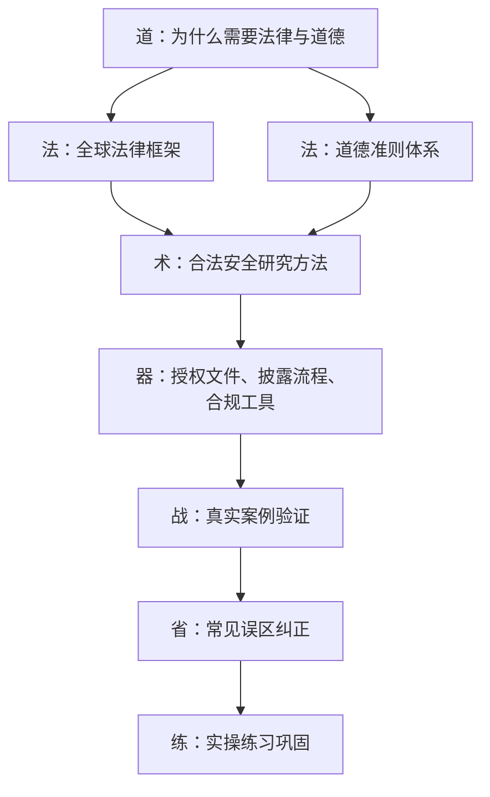
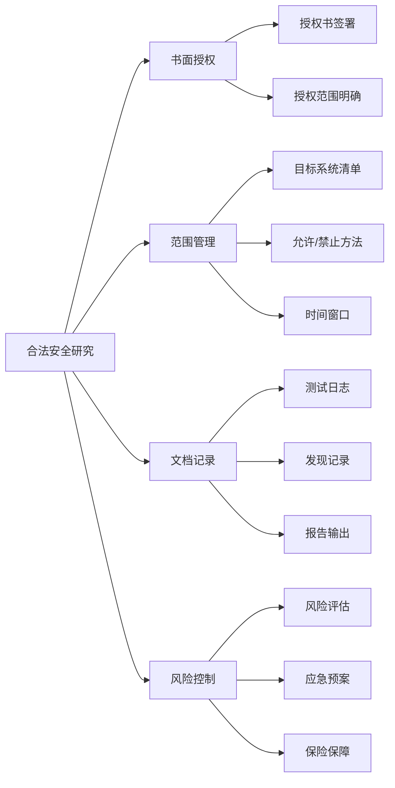

# 第02章 法律与道德 - 本章小结

## 一、本章核心思想

法律与道德不是安全技术的"附加项"，而是安全从业者的**操作系统**——你的一切技术能力都运行在它之上。本章的核心命题可以用一句话概括：

> **在没有明确授权的情况下，任何安全测试行为都可能构成犯罪，无论你的意图多么"善意"，无论你是否造成了实际损害。**

这不是一句空洞的警告。全球绝大多数司法管辖区的法律都遵循同一逻辑：**行为本身即构成要件，而非结果**。中国《刑法》第285条的"非法侵入计算机信息系统罪"不要求证明损害；美国CFAA的"未经授权访问"同样不以损害为前提。理解这一点，是本章最重要的收获。

## 二、知识体系全景回顾

本章按照"道法术器"的层次展开，构建了从法律原理到实操落地的完整知识链：



### 2.1 理论基础层：法律框架与道德准则

本章系统梳理了全球三大法律体系的网络安全法规：

**中国法律体系——"三法一条例"核心框架**

| 法律法规 | 核心制度 | 对安全从业者的直接影响 |
|----------|----------|----------------------|
| 《刑法》第285-287条 | 计算机犯罪的刑事定罪 | 未经授权访问即构成犯罪，最高可处3-7年有期徒刑 |
| 《网络安全法》（2017） | 等级保护制度、关键基础设施保护 | 渗透测试必须在等保定级框架内进行 |
| 《数据安全法》（2021） | 数据分类分级、数据安全审查 | 测试中接触的数据必须按等级保护 |
| 《个人信息保护法》（2021） | 个人信息处理规则 | 测试中不得访问、存储或传输个人信息 |
| 《关键信息基础设施安全保护条例》（2021） | CII特别保护 | 对CII的测试需要更高层级的审批和保护措施 |

**美国法律体系——CFAA为核心**

CFAA（计算机欺诈和滥用法案）是美国计算机犯罪法律的基石，但其"未经授权"的定义长期存在争议。2021年Van Buren v. United States案的最高法院裁决缩小了解释范围：CFAA仅适用于绕过技术性访问控制的行为，不适用于超出授权使用范围的行为。这对安全研究者是积极信号，但CFAA的模糊性仍然存在风险。

**欧盟法律体系——GDPR引领全球**

GDPR不仅是一部隐私法律，其第32条（处理安全）、第33-34条（数据泄露通知，72小时时限）、第35条（数据保护影响评估）深刻影响了安全实践。NIS2指令和《网络弹性法案》（CRA）进一步扩展了网络安全要求的适用范围。

### 2.2 方法论层：合法安全研究的四根支柱

合法的安全研究建立在四根支柱之上，缺一不可：



**授权是第一根也是最核心的支柱。** 没有书面授权的安全测试，无论技术多么专业，都是非法的。授权书必须明确包含：测试目标（域名、IP地址、应用名称）、测试范围（允许和禁止的测试方法）、测试时间窗口、紧急联系人、双方签字盖章。

**范围管理决定了测试的合法边界。** 即使有授权，超出授权范围的测试行为仍然违法。漏洞赏金计划同样如此——每个计划都有明确的范围内系统、范围内方法和排除项，必须严格遵守。

### 2.3 技术层：负责任漏洞披露的完整流程

负责任披露不是"发现漏洞后告诉厂商"这么简单。完整流程包括六个阶段：

1. **发现**：在合法授权范围内发现漏洞
2. **验证**：确认漏洞真实存在，记录复现步骤，但不扩大影响
3. **报告**：通过厂商的安全联系地址、安全响应中心（PSIRT）或漏洞赏金平台提交报告
4. **协调**：与厂商沟通修复方案和时间线，提供必要的技术细节
5. **等待**：给予厂商合理的修复时间（行业标准为90天，参考Google Project Zero政策）
6. **公开**：在厂商修复后或等待期满后，按照协调好的方式公开披露

关键原则：**披露的目的是保护用户，而非展示发现者的聪明才智。** 立即公开漏洞会让未打补丁的用户面临风险，这不是负责任的行为。

### 2.4 道德层：EASE框架与职业准则

安全从业者面临的道德困境往往没有标准答案。EASE框架提供了一个结构化的决策分析方法：

| 步骤 | 内容 | 关键问题 |
|------|------|----------|
| **E** - Evaluate（评估） | 评估事实和利益相关方 | 谁会受到影响？影响程度如何？ |
| **A** - Analyze（分析） | 分析可选方案的利弊 | 每个方案的短期和长期后果是什么？ |
| **S** - Select（选择） | 选择最优方案 | 哪个方案最符合职业道德准则？ |
| **E** - Execute（执行） | 执行决策并记录 | 如何执行？如何记录决策过程？ |

四大职业准则为道德决策提供了基准：保护社会和公共利益、以荣誉和诚实的方式行事、以胜任的方式提供服务、发展和保护职业。

## 三、真实案例的核心教训

本章通过七个真实案例展示了法律边界的实际情况。以下是每个案例的核心教训：

| 案例 | 核心教训 | 对你的启示 |
|------|----------|-----------|
| **Aaron Swartz** | CFAA的"未经授权"定义过于宽泛，可被用于过度起诉 | 即使是学术数据的批量下载也可能触发CFAA，法律风险远超技术风险 |
| **Marcus Hutchins** | 过去的行为可能在未来带来法律后果 | 青少年时期的"技术探索"可能成为未来的法律隐患 |
| **Weev（Andrew Auernheimer）** | "未经授权"的边界模糊，法院解释可能出乎意料 | 不要假设"信息已公开"就等于"访问合法" |
| **中国案例** | 中国法律的执行力度正在加强 | 不要抱有"法不责众"的侥幸心理 |
| **Google Project Zero** | 负责任披露需要在透明度和保护用户之间平衡 | 90天是行业标准，但具体场景可能需要灵活调整 |
| **Equifax** | 数据泄露的法律后果极其严重 | 安全合规不是成本，而是生存底线 |
| **Colonial Pipeline** | 关键基础设施攻击引发国家级法律和政策响应 | 对CII的安全测试必须获得最高层级的授权 |

## 四、必须牢记的误区纠正

本章纠正了五个常见误区。这些误区的危险之处在于，它们看起来"合理"，但每一个都可能导致严重的法律后果：

**误区一：不造成损害就不违法**
→ **事实：未经授权访问本身就是犯罪。** 中国《刑法》第285条、美国CFAA都不以"造成损害"为构成要件。

**误区二：漏洞赏金平台允许我测试任何系统**
→ **事实：每个计划都有严格的范围和规则。** 超出范围的测试不受平台保护，可能被追究法律责任。

**误区三：发现漏洞后立即公开是负责任的**
→ **事实：立即公开可能让用户面临更大风险。** 负责任的披露需要给厂商合理的修复时间。

**误区四：匿名就安全了**
→ **事实：匿名工具不能保证完全匿名。** VPN日志、流量分析、行为模式分析、法律传票都可能暴露身份。Ross Ulbricht、多名Anonymous成员的被捕证明了这一点。

**误区五：国外的法律不适用于我**
→ **事实：网络犯罪法律具有域外效力。** 如果目标系统在海外、数据涉及海外用户、或通过海外服务器进行测试，都可能触发当地法律。

## 五、知识检验清单

完成本章学习后，你应该能够回答以下问题并解释原因：

**法律知识**
- [ ] 中国《刑法》第285-287条分别规定了哪些计算机犯罪？最高刑期是多少？
- [ ] CFAA的核心争议是什么？Van Buren案的裁决意味着什么？
- [ ] GDPR对安全研究有哪些具体影响？72小时通知要求如何适用？
- [ ] 网络犯罪法律的域外效力如何运作？什么情况下会触发？

**实操能力**
- [ ] 如何撰写一份合规的渗透测试授权书？需要包含哪些必要要素？
- [ ] 负责任漏洞披露的完整流程是什么？每个阶段的关键注意事项？
- [ ] 如何使用EASE框架分析一个具体的道德困境？
- [ ] 发现漏洞后，从验证到公开的每一步应该怎么做？

**风险意识**
- [ ] 为什么"不造成损害"不能作为法律辩护？
- [ ] 匿名工具为什么不能保证安全？
- [ ] 超出漏洞赏金计划范围测试的法律后果是什么？
- [ ] 过去的"技术探索"行为可能带来什么法律风险？

## 六、构建你的合规体系

本章的最终目标不是让你记住法律条文，而是帮助你建立一套**可执行的合规体系**。以下是每个安全从业者都应该建立的五项基础能力：

### 6.1 授权管理能力

```text
┌─────────────────────────────────────────────────┐
│                  授权管理检查清单                   │
├─────────────────────────────────────────────────┤
│ □ 获取书面授权（合同/授权书/漏洞赏金平台规则）        │
│ □ 确认授权范围（目标系统、方法、时间窗口）             │
│ □ 确认授权有效期（起止日期、续约条件）                 │
│ □ 确认紧急联系人（技术联系人、法务联系人）             │
│ □ 保存授权文件原件（电子+纸质备份）                   │
│ □ 测试前二次确认范围（防止范围变更未通知）             │
└─────────────────────────────────────────────────┘
```

### 6.2 测试记录能力

每次测试活动都应该记录以下信息：测试日期和时间、测试目标（系统、IP、URL）、使用的工具和方法、发现的问题和证据、异常情况和处理方式、测试结论。这些记录在法律纠纷中是保护自己的关键证据。

### 6.3 漏洞披露能力

建立标准化的漏洞报告模板，包含：漏洞概述（一句话描述）、影响范围和严重程度评估、复现步骤（详细的操作步骤）、证据截图或日志、修复建议、发现者联系方式。

### 6.4 法律知识更新能力

网络安全法律处于快速变化中。建立法律知识更新的习惯：定期关注国家互联网信息办公室（CAC）、关注GDPR执法案例和裁决、跟踪CFAA相关判例、订阅安全法律领域的专业资讯。

### 6.5 道德决策能力

当面临道德困境时，使用EASE框架进行结构化分析，同时参考四大职业准则。记住：**如果你需要说服自己"这是合法的"，那它很可能不是。**

## 七、从本章到下一章的过渡

法律与道德建立了安全从业者的**行为边界**。知道了边界在哪里，接下来的问题是：**如何在边界内高效地思考和行动？**

第三章《安全思维培养》将从以下维度展开：

| 维度 | 核心问题 | 与本章的联系 |
|------|----------|-------------|
| 安全思维核心要素 | 如何像安全专家一样思考？ | 安全思维必须在法律框架内运作 |
| 攻击者思维模式 | 攻击者如何思考和行动？ | 理解攻击者思维是合法渗透测试的基础 |
| 系统化思考方法 | 如何系统地分析安全问题？ | 系统化方法帮助你在授权范围内高效测试 |
| 威胁建模技术 | 如何识别和评估威胁？ | 威胁建模指导测试范围和优先级 |
| 安全设计原则 | 如何设计安全的系统？ | 从防御视角理解攻击的价值 |

安全思维是安全从业者最核心的能力。它不是关于具体的技术或工具，而是一种**在法律和道德框架内系统化地思考安全问题的方式**。掌握了安全思维，你就能更高效地利用授权范围内的测试时间，发现更有价值的安全问题。

## 八、推荐下一步行动

1. **自测**：用第五节的知识检验清单逐项检查，对无法回答的问题回到对应章节复习
2. **实操**：完成本章练习（编写授权书、使用EASE框架分析道德困境）
3. **建档**：建立个人的安全研究合规档案，包含授权模板、报告模板、法律知识更新清单
4. **进入第三章**：开始学习安全思维，将法律意识内化为思维方式

---

> *"The law is reason, free from passion."*
> — 亚里士多德

记住：法律和道德是安全研究的基石。技术能力越强，法律意识就越重要——因为你有能力造成的破坏越大，你需要承担的责任就越重。在追求技术能力的同时，始终在法律框架内行事，遵守职业道德准则，这是成为专业安全从业者的必要条件，也是区分"黑客"与"安全专家"的根本标志。
