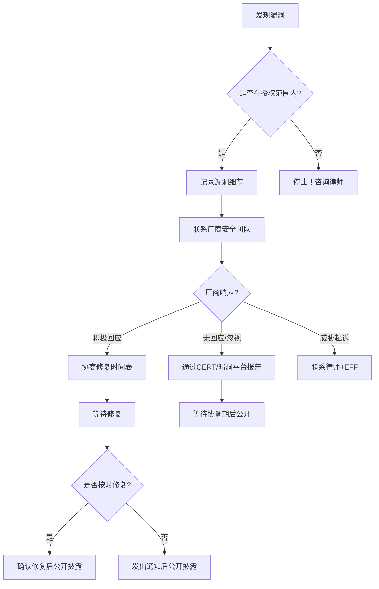

## 4.1 Aaron Swartz案件

Aaron Swartz案是21世纪最具影响力的网络法律案件之一。一位26岁的天才程序员因从学术数据库下载论文而面临35年联邦监禁，最终选择结束自己的生命。这个案件不仅暴露了《计算机欺诈和滥用法案》（CFAA）的深层缺陷，更成为推动学术开放获取运动和网络法律改革的催化剂。对于每一位安全研究者和互联网从业者而言，理解这个案件不是可选项，而是必修课。

---

### 4.1.1 人物背景：天才的短暂一生

Aaron Swartz（1986年11月8日—2013年1月11日）是一位美国程序员、作家、政治组织者和互联网活动家。他的成就密度之高，在同龄人中几乎无人能及。

**技术成就**

| 年龄 | 成就 |
|------|------|
| 14岁 | 参与创建RSS 1.0规范，成为最年轻的W3C工作组成员 |
| 15岁 | 与John Gruber共同创建Markdown语言规范 |
| 17岁 | 进入斯坦福大学，一年后辍学创业 |
| 19岁 | 创建Infogami，后与Reddit合并，成为Reddit联合创始人 |
| 20岁 | 创建Open Library项目 |
| 22岁 | 创办Watchdog.net（政治问责网站） |
| 23岁 | 参与创建Progressive Change Campaign Committee |
| 24岁 | 下载JSTOR论文事件发生 |
| 25岁 | 创办Demand Progress，成功阻止SOPA/PIPA法案 |
| 26岁 | 自杀身亡 |

**信息自由理念**

Swartz不仅是技术天才，更是信息自由的坚定信仰者。他的《Guerilla Open Access Manifesto》（2008年）写道：

> "信息就是力量。但就像所有权力一样，总有人想将其据为己有。全世界所有的科学文化遗产——数百年间出版的书籍、期刊文章——正被少数私有公司数字化并锁在高墙之后。想要阅读那些用纳税人的钱资助的学术论文？你必须向像Reed Elsevier这样的出版商支付巨额费用。"

这份宣言在案件之后被广泛引用，成为理解Swartz动机的关键文本。

---

### 4.1.2 事件详细时间线

理解这个案件需要精确的时间线。以下按时间顺序还原整个事件：

**2010年9月 — 第一次尝试**

Swartz在MIT校园内使用JSTOR账户，通过Python脚本批量下载学术论文。JSTOR检测到异常流量后封锁了他的IP地址和账户。

**2010年10月-11月 — 升级**

Swartz更换IP地址和用户代理字符串继续下载。他将笔记本电脑（Acer Aspire）放置在MIT的一间网络配线间内，连接到网络交换机。他注册了多个JSTOR账户，使用自动化脚本模拟正常用户行为。

**2010年11月-12月 — 技术对抗**

JSTOR和MIT展开技术对抗：

| 阶段 | JSTOR/MIT的措施 | Swartz的应对 |
|------|----------------|-------------|
| 第一阶段 | 封锁异常IP | 更换IP地址 |
| 第二阶段 | 限制单IP下载速率 | 使用多个IP轮换 |
| 第三阶段 | 检测异常用户代理 | 伪造正常浏览器UA |
| 第四阶段 | MIT封锁整个网段的JSTOR访问 | 将电脑转移到不同网段 |
| 第五阶段 | JSTOR暂停MIT的全部访问权限 | 下载暂停 |

**2010年12月 — 发现设备**

MIT网络管理员在配线间发现了一台笔记本电脑，隐藏在一堆箱子后面。管理员安装了监控摄像头。2011年1月6日，摄像头拍到Swartz取回设备。

**2011年1月6日 — 逮捕**

MIT和剑桥警方在Swartz骑车离开校园时将其逮捕。他被指控 breaking and entering with intent to commit a felony。

**2011年6月 — 联邦起诉**

联邦检察官Carmen Ortiz办公室接手案件，由助理检察官Stephen Heymann主导，依据CFAA提起13项联邦重罪指控。

**2012年9月 — 拒绝认罪协议**

检方提出认罪协议：Swartz认罪，服刑6个月。Swartz拒绝，坚持自己无罪。

**2013年1月9日 — JSTOR公开声明**

JSTOR发表声明，表示已将350万篇论文纳入免费公开访问计划，并对案件表示遗憾。

**2013年1月11日 — 自杀**

Aaron Swartz在布鲁克林的公寓中上吊自杀，年仅26岁。

**2013年1月14日 — 撤销指控**

Swartz去世两天后，联邦检察官撤销全部指控。

---

### 4.1.3 技术细节深度分析

**下载机制**

Swartz编写的脚本（后来被公开为`sync_tax.py`）工作原理如下：

```python
# 核心逻辑（简化示意）
import requests
import time
import random

def download_paper(paper_id):
    """下载单篇论文，加入随机延迟模拟人类行为"""
    url = f"https://www.jstor.org/action/showSingleResult?queryUri={paper_id}"
    
    # 随机延迟 1-5 秒，避免触发速率限制
    delay = random.uniform(1, 5)
    time.sleep(delay)
    
    # 轮换 User-Agent
    ua = random.choice(USER_AGENTS)
    headers = {"User-Agent": ua}
    
    response = requests.get(url, headers=headers)
    if response.status_code == 200:
        save_pdf(response.content, paper_id)
    elif response.status_code == 429:
        # 被限速，等待更长时间
        time.sleep(random.uniform(30, 60))
        download_paper(paper_id)  # 重试

def main():
    """遍历JSTOR论文ID空间"""
    for paper_id in range(START_ID, END_ID):
        download_paper(paper_id)
```

**关键争议点：脚本是否构成"未经授权"？**

这是案件的核心法律问题。让我们逐层分析：

```text
授权层级分析：

第1层：MIT的开放网络
├─ MIT的无线网络对所有人开放，无需认证
├─ Swartz使用开放网络本身不违法
└─ 结论：网络访问是授权的

第2层：JSTOR的访问权限
├─ MIT作为机构订阅了JSTOR
├─ MIT网络内的用户可以访问JSTOR
├─ Swartz通过MIT网络访问JSTOR
└─ 结论：单次访问是授权的

第3层：批量下载的行为
├─ JSTOR的服务条款禁止系统性下载
├─ Swartz通过技术手段规避了速率限制
├─ Swartz伪造了用户代理字符串
└─ 争议：这是否构成"超越授权"？

第4层：将设备藏匿在配线间
├─ MIT的配线间不对公众开放
├─ Swartz未经许可放置设备
└─ 这是物理空间的未授权进入，相对明确
```

这个层级分析揭示了CFAA的核心困境：**"授权"是一个二元概念，但现实中的访问行为是连续的光谱**。从"正常浏览"到"批量下载"到"规避限制"，每一步之间的界限在哪里？CFAA没有给出答案。

---

### 4.1.4 检方策略与起诉裁量权

**联邦检察官Carmen Ortiz的角色**

Carmen Ortiz是马萨诸塞州联邦检察官，她在本案中的决定引发了巨大争议：

**检方的立场**：Swartz的行为造成了实质性损害——JSTOR被迫暂停MIT的访问权限，影响了全校师生的研究工作；下载的数据量巨大（约480万篇论文，约35GB）；Swartz使用了规避技术手段。

**批评者的立场**：JSTOR已经恢复了数据且不起诉；MIT没有要求起诉；行为的主观动机是推动信息自由而非牟利；量刑建议（35年）与行为严重性严重不匹配。

**认罪谈判的僵局**

案件中最令人痛心的部分之一是认罪谈判的失败：

| 时间 | 检方提议 | Swartz的回应 |
|------|---------|-------------|
| 2012年 | 认罪+6个月监禁 | 拒绝，坚持无罪 |
| 2012年末 | 认罪+6个月，若拒绝则求刑7年 | 仍然拒绝 |
| 2013年初 | 保持强硬立场 | 未达成协议 |

Swartz的律师Elliot Peters后来披露，检方的态度极其强硬。Stephen Heymann被认为将此案视为职业晋升的机会。Heymann此前曾因处理其他计算机犯罪案件而获得司法部嘉奖。

**检察官裁量权的制度性问题**

这个案件暴露了美国联邦检察系统的结构性问题：

1. **重罪叠加**：检方可以将同一行为拆分为多项指控（电信欺诈、计算机欺诈、非法获取信息等），使最高刑期成倍增加
2. **审前压力**：即使最终判决远低于最高刑期，漫长的审判过程本身就是惩罚
3. **资源不对等**：联邦政府几乎无限的诉讼资源 vs. 个人有限的辩护能力
4. **缺乏问责**：检察官的起诉决定几乎不受司法审查

---

### 4.1.5 JSTOR与MIT的不同立场

**JSTOR的态度演变**

JSTOR的立场经历了微妙但重要的变化：

- **2011年1月**：发现异常下载后暂停MIT的访问，要求Swartz归还数据
- **2011年6月**：收到Swartz归还的数据后，发表声明称"此事已解决"，明确表示不要求起诉
- **2013年1月9日**：Swartz去世前两天，JSTOR宣布将350万篇早期论文免费向公众开放
- **2013年1月12日**：Swartz去世后，JSTOR发表哀悼声明，表示"对这一悲剧深感遗憾"

JSTOR的声明中有一段值得注意的话："我们理解并尊重信息自由的诉求，但我们认为应该通过合法渠道推动变革。"这句话既表达了对Swartz理念的部分认同，也划清了行为边界的底线。

**MIT的沉默与争议**

MIT在案件中的角色最为复杂和令人不安：

- MIT拥有开放网络文化——校园网络对访客开放，这在学术机构中很常见
- MIT的网络管理员发现异常后采取了合理的技术应对措施
- 但在联邦检察官介入后，MIT选择了**不主动介入也不反对起诉**的立场
- MIT校长Rafael Reif在Swartz去世后下令进行内部调查
- 2013年7月，MIT发布调查报告，承认"MIT的机会主义立场（neutrality）可能对案件结果产生了影响"

MIT教授Hal Abelson（Swartz的朋友）主持的调查报告指出：

> "MIT没有对Aaron Swartz的起诉表示支持，也没有表示反对。MIT的立场可以被描述为'被动的中立'。但我们必须问自己：在一个年轻人面临35年监禁的情况下，被动的中立是否是一种道德上可接受的立场？"

这份报告在MIT社区引发了深刻的反思。许多教授和学生认为，MIT本应更积极地保护学术自由和开放获取的价值观。

---

### 4.1.6 CFAA法律问题深度剖析

**"未经授权"的定义困境**

CFAA的核心问题在于"unauthorized access"这一概念的模糊性。让我们通过几个维度来分析：

**1. 技术维度**

```text
什么是"授权"？

场景A：使用共享密码登录系统 → 明确授权
场景B：使用默认密码登录路由器 → 灰色地带
场景C：访问公开网页但加速下载 → 灰色地带
场景D：绕过IP封锁继续访问 → 灰色地带
场景E：破解密码进入系统 → 明确未授权

Swartz的案件落在C和D之间——行为是灰色地带，但被当作E来起诉。
```

**2. 合同法 vs. 刑法维度**

服务条款（ToS）违反通常属于民事违约，不应构成刑事犯罪。但CFAA的宽泛解释使得：

- 违反网站ToS → 可能被解释为"超越授权" → 可能构成联邦重罪
- 这将几乎每个互联网用户都变成了潜在罪犯

**3. 最高法院的澄清：Van Buren v. United States (2021)**

Swartz案发生8年后，美国最高法院在Van Buren案中对CFAA的"未经授权"作出了重要限制：

> CFAA仅适用于那些**突破了技术性访问控制**的人，而不适用于那些**超越了使用权限**的人。

用通俗的话说：
- 用偷来的钥匙进入禁区 → 违反CFAA
- 有权进入房间但违反了房间使用规定 → 不违反CFAA

如果这一标准在2011年就存在，Swartz案的法律基础将大大削弱。他在MIT的开放网络上访问JSTOR，虽然违反了JSTOR的服务条款，但没有突破技术性访问控制。

**量刑比例性问题**

35年最高刑期与行为严重性的不匹配可以通过对比来说明：

| 犯罪行为 | 典型刑期 |
|---------|---------|
| 过失杀人 | 2-10年 |
| 武装抢劫 | 5-15年 |
| 入室盗窃 | 1-5年 |
| Swartz被指控的下载行为 | 最高35年 |
| 奴隶制（历史上的联邦法律） | 最高10年 |

这种量刑失衡不是Swartz案独有的问题。CFAA的量刑条款本身就需要改革——同一部法律的同一条款，可以用来起诉真正的网络犯罪分子，也可以用来起诉做安全研究的学生，而两者的最高刑期相同。

---

### 4.1.7 伦理分析框架

Aaron Swartz案件可以从多个伦理框架来分析，每个框架得出不同但有价值的结论：

**1. 功利主义视角（Utilitarianism）**

```text
行为后果分析：

正面后果：
├─ 推动学术论文开放获取
├─ 引发CFAA改革讨论
├─ 加速开放获取运动
└─ 促进公众对学术出版垄断的认识

负面后果：
├─ JSTOR服务中断
├─ MIT网络资源被大量占用
├─ 法律成本和资源消耗
└─ 最终导致一人死亡

功利主义结论：行为的正面后果（推动信息自由）是否足以证明手段的正当性？
答案取决于你如何衡量长期社会收益 vs. 短期直接损害。
```

**2. 义务论视角（Deontology）**

Kantian伦理学关注行为本身的道德性质，而非后果：

- Swartz违反了已知的服务条款 → 行为本身是错误的
- 但检方的过度起诉也违反了比例原则 → 同样是错误的
- 双方都有道德过失

**3. 美德伦理学视角（Virtue Ethics）**

关注行为者的品格和动机：

- Swartz的动机是推动信息自由，这是一种美德
- 但手段（规避限制、藏匿设备）破坏了信任
- 美德伦理学会问：一个有美德的人会如何行动？

**4. 社会正义视角（Social Justice）**

从权力结构的角度分析：

- 学术出版商（Elsevier、Springer等）垄断了本应属于全人类的知识
- 研究者用公共资金做研究，成果被私有公司收费
- Swartz挑战的正是这种不公正的权力结构
- 国家机器保护了资本的利益，而非公众的利益

**对安全研究者的启示**

这些伦理框架的分析并非为了得出一个"正确答案"，而是帮助你建立自己的道德判断能力。在面对类似的灰色地带时，你需要：

1. 明确自己的价值优先级
2. 理解不同立场的合理性
3. 预见行为的法律后果
4. 选择合法或至少风险可控的方式推动变革

---

### 4.1.8 对比案例：相似案件的不同结局

将Swartz案与其他CFAA案件对比，可以更清楚地看到法律适用的不一致性：

**Case 1: Weev案（Andrew Auernheimer, 2010-2014）**

- 行为：发现AT&T网站的安全漏洞，通过简单的URL枚举获取了11.4万iPad用户的邮箱地址
- 起诉：依据CFAA，被判41个月监禁
- 结果：第三巡回上诉法院以管辖权问题推翻定罪
- 对比：行为比Swartz更轻微，但仍被重判

**Case 2: Marcus Hutchins案（2017-2019）**

- 行为：青少年时期编写了Kronos银行木马
- 起诉：依据CFAA和其他联邦法律
- 结果：被判缓刑，无监禁
- 对比：行为涉及恶意软件，性质更严重，但量刑更轻

**Case 3: Sergey Aleynikov案（2009-2012）**

- 行为：从高盛离职时复制了高频交易源代码
- 起诉：依据经济间谍法和CFAA
- 结果：定罪后被推翻，后改用州法律重新定罪
- 对比：涉及商业利益，但法律适用同样混乱

这些对比揭示了一个令人不安的事实：**CFAA的适用高度依赖检察官的裁量权，而非行为本身的严重性**。同样的行为，在不同的检察官手下，可能面临完全不同的命运。

---

### 4.1.9 Aaron's Law与改革努力

**Aaron's Law的内容**

2013年，国会议员Zoe Lofgren和参议员Ron Wyden提出了"Aaron's Law"（H.R. 2454 / S. 1196），核心修改包括：

1. **限制"未经授权"的定义**：将CFAA的适用范围限制在突破技术性访问控制的行为，排除违反服务条款的情况
2. **取消重罪叠加**：禁止检方将同一行为拆分为多项CFAA指控
3. **降低量刑**：将非牟利性质的CFAA违规行为的最高刑期大幅降低

**为什么失败**

Aaron's Law在国会从未获得投票。失败原因包括：

- **司法部的反对**：联邦检察官不希望限制其起诉权力
- **商业利益集团的游说**：版权持有者和大型科技公司支持宽泛的CFAA解释
- **政治时机不佳**：2013年国会的立法议程被其他议题占据
- **缺乏两党共识**：虽然在民间获得广泛支持，但在国会缺乏足够的政治动力

**后续改革进展**

尽管Aaron's Law失败了，改革的努力并未停止：

- **2015年**：Obama政府发布网络安全战略，承认CFAA需要更新
- **2021年**：最高法院在Van Buren案中限制了CFAA的适用范围（见4.1.6节）
- **2022年**：多个州通过了"right to repair"法案，部分削弱了CFAA的适用
- **持续的讨论**：学术界和公民社会组织持续推动CFAA改革

---

### 4.1.10 开放获取运动：Swartz的遗产

**Swartz去世前的学术出版格局**

在Swartz去世时，学术出版的状况是：

- 五大出版商（Elsevier、Springer、Wiley、Taylor & Francis、SAGE）控制了超过50%的学术论文
- 大学图书馆每年需要支付数百万美元的订阅费用
- 纳税人资助的研究成果被锁在付费墙后
- 发展中国家的研究者几乎无法获取最新研究

**Swartz去世后的变化**

Aaron Swartz的去世成为开放获取运动的转折点：

| 年份 | 事件 |
|------|------|
| 2013 | JSTOR开始提供有限的免费访问 |
| 2013 | 美国国会通过法案要求联邦资助的研究在12个月后公开 |
| 2015 | Sci-Hub由Alexandra Elbakyan创建，提供免费论文下载 |
| 2016 | German研究机构抵制Elsevier |
| 2018 | 欧洲研究资助机构推出Plan S，要求所有资助研究立即开放获取 |
| 2020 | COVID-19疫情加速了医学论文的开放获取 |
| 2022 | 美国OSTP发布"Nelson Memo"，要求2025年底前所有联邦资助研究免费公开 |
| 2023 | Elsevier和Springer开始与机构签订"转换协议" |

**开放获取的两种路径**

```text
金色开放获取（Gold OA）
├─ 论文发表在开放获取期刊上
├─ 作者或机构支付文章处理费（APC）
├─ 代表期刊：PLOS ONE, eLife, Nature Communications
└─ 优点：合法、可持续；缺点：APC费用高昂

绿色开放获取（Green OA）
├─ 论文先在传统期刊发表
├─ 作者将预印本或接受稿存入机构知识库
├─ 可能有禁令期（6-12个月）
└─ 优点：免费；缺点：可能有延迟

Swartz的愿景（Guerrilla OA）
├─ 直接将付费论文免费发布
├─ 代表：Sci-Hub
├─ 法律上是违法的
└─ 道德上存在争议
```

---

### 4.1.11 对安全研究者的实践启示

Aaron Swartz案给安全研究者留下了深刻的教训。以下是具体的实践建议：

**1. 理解法律边界**

```text
安全研究的法律风险矩阵：

低风险：
├─ 在授权范围内测试自己的系统
├─ 参与官方漏洞赏金计划
├─ 使用CTF/靶场环境练习
└─ 阅读公开的安全研究论文

中等风险：
├─ 未经授权但公开暴露的服务的漏洞发现
├─ 逆向工程自己购买的设备
├─ 研究公开API的行为
└─ 报告漏洞给厂商

高风险：
├─ 未经授权访问他人系统
├─ 大规模数据收集（即使数据是公开的）
├─ 规避技术保护措施
└─ 发布漏洞利用代码而无负责任披露

极高风险：
├─ 访问政府或军事系统
├─ 金融系统的漏洞利用
├─ 任何涉及个人数据的大规模行为
└─ 跨境进行安全研究
```

**2. 建立防护措施**

在进行任何可能处于灰色地带的研究之前：

- **获取书面授权**：即使是"善意"的研究也需要明确的授权
- **咨询律师**：在开始之前而非被起诉之后
- **记录一切**：保存所有通信、授权文件、研究日志
- **使用合法渠道**：漏洞赏金计划、负责任披露机制
- **限制数据收集**：只收集证明漏洞所需的最小数据量

**3. 负责任披露流程**



**4. 了解你的权利**

- **安全港条款**：部分国家和平台为安全研究提供法律保护
- **漏洞赏金的法律保护**：参与官方计划通常有法律豁免
- **EFF等组织的支持**：电子前沿基金会为安全研究者提供法律援助
- **学术研究的保护**：在大学环境下进行的研究可能有额外的法律保护

---

### 4.1.12 常见误解与纠正

**误解1："Swartz只是下载了一些论文，有什么大不了的？"**

纠正：行为的法律后果不取决于你认为它是否严重。Swartz的行为涉及：规避技术保护措施、伪造身份、未经许可使用物理空间、大规模数据获取。每一项单独来看可能不严重，但叠加在一起构成了多项联邦指控的基础。

**误解2："JSTOR不起诉了，所以应该没事"**

纠正：在美国联邦法律体系中，受害者不起诉不等于检方不起诉。联邦检察官有独立的起诉裁量权。这是Swartz案最令人痛心的教训之一——即使受害者已经和解，国家机器仍可以继续推进。

**误解3："信息应该自由，所以下载论文是正当的"**

纠正：理念的正当性不能证明行为的合法性。你可以相信信息应该自由，同时认识到在当前法律框架下某些行为是有风险的。推动变革的方式有很多种——Swartz创建的Demand Progress就通过合法途径成功阻止了SOPA法案。

**误解4："CFAA改革失败了，什么都没变"**

纠正：Aaron's Law虽然失败了，但变化是真实的——Van Buren案的最高法院判决限制了CFAA的适用范围；开放获取运动取得了巨大进展；安全社区对法律风险的意识显著提高。变革是渐进的，不是一蹴而就的。

**误解5："只有黑客才会被CFAA起诉"**

纠正：CFAA的适用范围远超传统黑客行为。违反网站服务条款、超越工作场所的网络使用政策、甚至使用假名注册网站，理论上都可能触发CFAA。每个互联网用户都生活在CFAA的阴影之下。

---

### 4.1.13 延伸阅读与资源

**原始文献**

- 《Guerilla Open Access Manifesto》 — Aaron Swartz, 2008
- MIT调查报告：*MIT and the Prosecution of Aaron Swartz* — Hal Abelson, 2013
- 联邦起诉书：*United States v. Swartz*, No. 11-CR-10260

**纪录片与书籍**

- 《The Internet's Own Boy》(2014) — Brian Knappenberger 导演的纪录片
- *The Boy Who Could Change the World: The Writings of Aaron Swartz* — The New Press, 2016
- *Hacker, Hoaxer, Whistleblower, Spy* — Gabriella Coleman（关于Anonymous的书，包含Swartz相关章节）

**法律分析**

- Orin Kerr, "Norms of Computer Trespass," *Columbia Law Review*, 2016
- EFF, "CFAA Reform" 专题页面 — 持续更新的CFAA改革进展
- Van Buren v. United States, 593 U.S. ___ (2021) — 最高法院判决全文

**开放获取资源**

- DOAJ (Directory of Open Access Journals) — 开放获取期刊目录
- Unpaywall — 浏览器插件，自动寻找论文的免费版本
- Open Access Button — 类似工具
- Sherpa/Romeo — 查询期刊的开放获取政策

---

### 4.1.14 本案例核心要点

Aaron Swartz案件的本质不是一个简单的"黑客犯罪"故事，而是一面多棱镜，折射出多个层面的问题：

| 层面 | 核心问题 | 启示 |
|------|---------|------|
| 法律 | CFAA的"未经授权"定义模糊 | 了解法律边界，不要依赖直觉判断 |
| 伦理 | 信息自由 vs. 法律秩序 | 理念的正当性不能保证行为的合法性 |
| 制度 | 检察官裁量权过大 | 认识到法律体系的不完美，做好风险评估 |
| 社会 | 学术出版垄断 | 推动变革有多种方式，选择风险可控的路径 |
| 个人 | 心理健康与压力 | 面对法律压力时寻求支持，不要独自承受 |

对安全研究者而言，最重要的教训是：**理解法律环境、评估风险、获取授权、记录过程、寻求支持**。Swartz的悲剧不应重演，而防止悲剧重演的最好方式是教育和准备。

---

> "信息就是力量。但就像所有权力一样，总有人想将其据为己有。" —— Aaron Swartz, 2008
