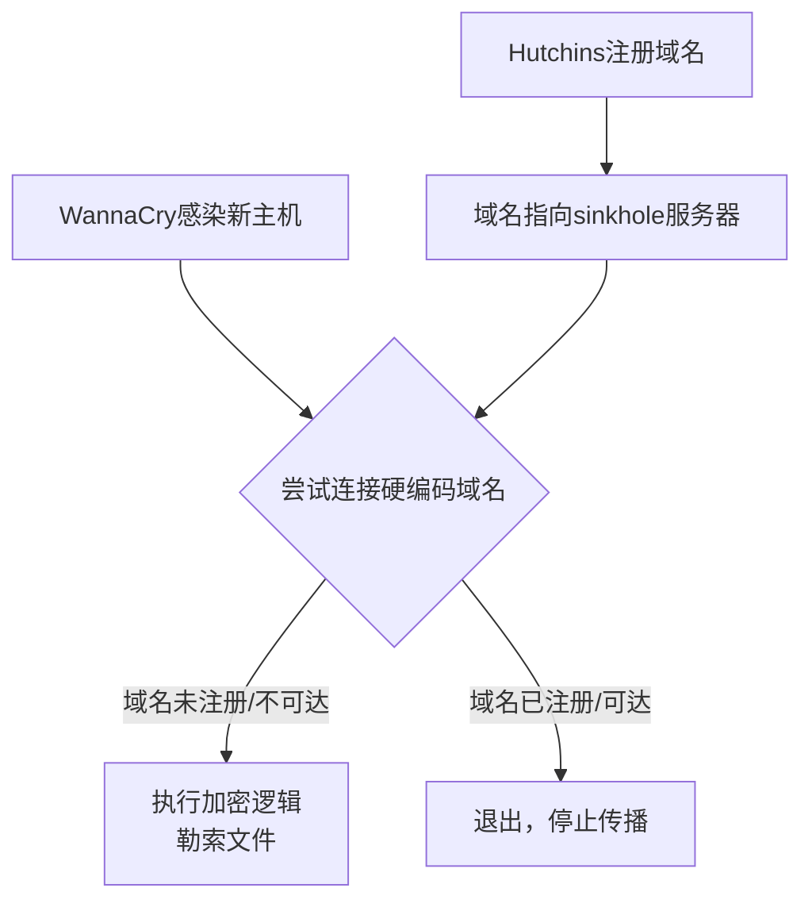
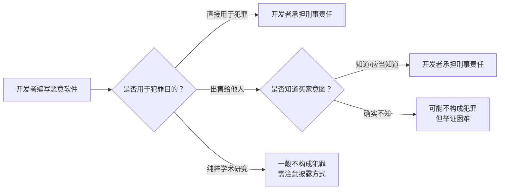
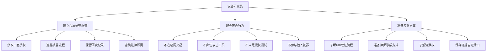

## 4.2 Marcus Hutchins案件：从恶意软件少年到WannaCry英雄再到被告席

Marcus Hutchins案是网络安全史上最富戏剧性的法律事件之一。一个少年时期编写银行木马的年轻人，后来凭一己之力阻止了席卷全球的勒索软件攻击，却在英雄光环最高点时被FBI逮捕。这个案件深刻揭示了"灰帽"转型的法律代价、青少年黑客行为的追溯风险，以及安全研究与计算机犯罪之间那条模糊而危险的边界线。

---

### 4.2.1 人物背景与早期经历

#### Marcus Hutchins其人

Marcus Hutchins（1994年6月出生于英国德文郡），网名"MalwareTech"，是一位自学成才的恶意软件分析师。他从青少年时期就展现出对计算机安全的浓厚兴趣和天赋，在地下论坛中活跃，参与恶意软件的开发与交易。

Hutchins在十几岁时便以"MalwareTech"为网名活跃于多个黑客论坛。根据后来法庭文件披露，他大约在2012年（18岁左右）开始编写恶意软件工具，并在地下市场出售。2014至2015年间，他参与开发了Kronos银行木马和UPAS Kit恶意软件，这些工具随后被网络犯罪分子广泛使用，对全球金融机构造成实际经济损失。

#### 职业转型

在编写恶意软件的同时，Hutchins也在逐步向安全研究领域转型。他加入了加州网络安全公司Kryptos Logic，担任威胁情报分析师。在工作中，他发表了大量恶意软件分析文章，建立了行业内的专业声誉，其博客和推特账号成为安全社区的重要信息来源。

这种"白天做安全研究、青少年时期有过黑客经历"的双面身份，在安全行业中并不罕见。许多顶尖安全研究员都有类似的背景——从"黑"到"白"的转变被视为行业常态。然而，Hutchins的案例证明，这种转变并不能自动豁免过去行为的法律责任。

---

### 4.2.2 WannaCry事件：一夜成名

#### WannaCry勒索软件爆发

2017年5月12日，WannaCry勒索软件在全球范围内爆发，成为当时破坏力最大的网络攻击事件之一。其核心特征如下：

| 维度 | 详情 |
|------|------|
| 攻击方式 | 利用NSA泄露的EternalBlue漏洞（MS17-010），通过SMB协议横向传播 |
| 影响范围 | 150多个国家、超过230,000台计算机 |
| 主要受害者 | 英国国民健康服务（NHS）、西班牙电信Telefónica、德国铁路Deutsche Bahn、中国部分高校和企业 |
| 加密方式 | RSA-2048 + AES-128，勒索300-600美元比特币赎金 |
| 传播速度 | 峰值时每小时感染数千台新机器 |

WannaCry的破坏力在医疗领域尤为严重——英国NHS被迫取消大量手术和门诊预约，医院工作人员不得不回到纸质记录系统，急诊患者面临生命危险。

#### 发现Kill Switch

2017年5月12日，Hutchins在逆向分析WannaCry样本时，发现了一段关键代码：恶意软件在启动加密逻辑之前，会尝试连接一个硬编码的域名。如果域名**不可达**（即未被注册），加密流程正常执行；如果域名**可达**（已被注册），恶意软件立即停止传播。

这个域名是一串看似随机的字符：`iuqerfsodp9ifjaposdfjhgosurijfaewrwergwea.com`。它实际上是恶意软件作者内置的"沙箱检测"机制——在安全实验室中，研究人员通常会将恶意软件运行在无法访问真实互联网的隔离环境中，因此这类硬编码域名不会被解析到真实IP。如果恶意软件能解析到该域名，说明它处于真实互联网环境，作者可能希望此时停止传播以避免引起注意。

Hutchins迅速以约10.69美元的价格注册了这个域名，并将其指向一个安全的sinkhole服务器。这一行为立即阻断了WannaCry在全球范围内的传播链。

#### 技术分析：Kill Switch的工作原理

WannaCry作者设计这个机制的真实意图至今仍有争议。主流观点认为这是一种反沙箱技术，用于判断恶意软件是否运行在隔离的分析环境中。也有分析认为这是作者的一种"紧急制动"机制——如果攻击失控，作者可以通过不注册域名来让恶意软件继续传播，但也可以通过注册域名来停止它。

#### 媒体封神与公众反应

Kill Switch生效后，Hutchins迅速成为全球媒体焦点。《纽约时报》《卫报》《连线》等主流媒体均对其进行了大篇幅报道，称他为"阻止WannaCry的22岁英雄"。他的推特粉丝在数天内从几千暴涨到十几万。英国政府和安全社区对他表达了高度赞赏。

然而，Hutchins本人对此保持低调。他在博客中写道："我只是做了任何一个分析样本的恶意软件研究员都会做的事情。"但媒体的聚光灯已经无法熄灭——他的面容和名字已被全球公众记住，这也为三个月后的戏剧性转折埋下了伏笔。

---

### 4.2.3 DEF CON与FBI逮捕

#### 拉斯维加斯之行

2017年8月，Hutchins前往美国拉斯维加斯参加DEF CON和Black Hat安全会议——这是全球最大的黑客与安全研究者年度聚会。对于安全研究员来说，参加这些会议既是学习交流的机会，也是行业社交的重要场景。

#### 机场逮捕

2017年8月2日，Hutchins在拉斯维加斯麦卡伦国际机场准备搭乘航班返回英国时，被FBI探员拦截并逮捕。逮捕令显示，他面临六项联邦指控，涉及2014至2015年期间创建和传播Kronos银行木马。

这一逮捕在全球安全社区引发了震惊和争议。一个刚刚被誉为"英雄"的安全研究员，在同一个夏天被FBI以计算机犯罪罪名逮捕——这种反差之大，令许多人难以接受。

#### 逮捕的时机与策略

FBI选择在DEF CON期间逮捕Hutchins并非偶然。安全会议期间，大量安全研究员聚集在美国境内，这为美国执法机构提供了"地利"优势。从法律策略角度看，这是一个精心选择的时间窗口：

- Hutchins身处美国领土，美国联邦法院拥有管辖权
- 大量安全社区人士在场，可以作为潜在证人或提供相关线索
- 会议期间的社交活动可能暴露更多信息

这一策略在安全社区引发了广泛讨论——许多研究员开始担心赴美参加安全会议的法律风险，部分非美国籍研究员甚至因此取消了后续年份的参会计划。

---

### 4.2.4 Kronos木马：指控详情

#### Kronos银行木马技术特征

Kronos是一款典型的银行木马（Banking Trojan），于2014年首次出现在俄罗斯地下黑客论坛上进行销售。其核心功能包括：

| 功能模块 | 技术细节 |
|----------|----------|
| Web注入（Web Inject） | 劫持银行网站页面，插入伪造的表单字段窃取凭证 |
| 键盘记录（Keylogger） | 记录用户在金融网站上的键盘输入 |
| 表单抓取（Form Grabbing） | 拦截HTTP POST请求中的表单数据 |
| 远程访问（RAT） | 提供完整的远程桌面控制能力 |
| 反检测 | 绕过主流杀毒软件、沙箱和行为分析系统 |
| 持久化 | 通过注册表、计划任务等方式实现开机自启 |

Kronos在地下市场的售价约为7,000美元（比特币支付），后期版本（Kronos 2.0）价格更高。根据法庭文件，Hutchins参与了Kronos的开发，并通过暗网论坛出售该木马。

#### UPAS Kit

除Kronos外，Hutchins还被指控开发了UPAS Kit——一款较早期的恶意软件工具包。UPAS Kit的功能相对简单，主要用于信息窃取和远程访问，但它是Hutchins恶意软件开发经历的起点。

#### 六项联邦指控

美国联邦检察官对Hutchins提出了以下指控：

1. **共谋犯罪（Conspiracy）**：与他人合谋违反《计算机欺诈与滥用法》（CFAA）
2. **传播恶意软件**：故意传播Kronos银行木马
3. **非法访问计算机**：未经授权访问受保护的计算机系统
4. **协助和教唆**：帮助他人实施计算机犯罪
5. **涉及Kronos 2.0的指控**：参与更新版本的开发和传播
6. **涉及UPAS Kit的指控**：开发和传播早期恶意软件工具

这些指控均依据美国联邦法律《计算机欺诈与滥用法》（Computer Fraud and Abuse Act, 18 U.S.C. § 1030），最高可判处数十年联邦监禁。

---

### 4.2.5 法律程序与审判过程

#### 保释与法律战

Hutchins被捕后，缴纳了保释金获释，但被限制居住在洛杉矶地区，佩戴GPS监控手环，不得离开美国。对于一个英国公民来说，这意味着他在漫长的法律程序期间被"软禁"在美国。

辩护律师团队的核心论点包括：

- Hutchins被捕时已彻底转向合法安全研究工作
- 他在WannaCry事件中展现了对公共安全的积极贡献
- 青少年时期的错误行为不应与成年后的功绩抵消，但应获得从轻考虑
- 检方的某些证据链存在薄弱环节

#### 认罪协议

经过近两年的法律程序，2019年4月19日，Hutchins与检方达成认罪协议，对两项较轻的指控认罪：

- **第一项**：共谋违反CFAA（2012-2015年间的恶意软件开发活动）
- **第二项**：传播恶意软件（Kronos相关）

作为交换，检方撤销了其余四项指控。这一协议意味着Hutchins承认了在青少年时期的恶意软件开发行为，但避免了最严重的指控。

#### 量刑与判决

2019年7月26日，美国威斯康星州东区联邦法院作出判决：

| 判决内容 | 详情 |
|----------|------|
| 监禁 | 无（time served，无需额外入狱） |
| 缓刑 | 两年联邦缓刑（supervised release） |
| 社区服务 | 要求完成社区服务 |
| 没收 | 涉案域名和服务器 |
| 犯罪记录 | 联邦重罪记录 |

法官J.P. Stadtmueller在量刑时表示，Hutchins"经历了从黑暗面到光明面的非凡转变"，并指出其在WannaCry事件中的贡献体现了"内在的善良品质"。检方最初建议判处10个月监禁，但法官最终选择了更轻的缓刑判决。

---

### 4.2.6 案件的深层法律分析

#### CFAA在本案中的适用

《计算机欺诈与滥用法》（CFAA）是美国联邦层面最重要的计算机犯罪法律，1986年制定，此后多次修订。在Hutchins案中，CFAA的适用引发了安全社区的广泛讨论：

**CFAA的模糊地带**：CFAA将"未经授权访问受保护的计算机"定为犯罪，但对"授权"的定义相当模糊。安全研究员在漏洞研究过程中，是否获得了"授权"？如果一个研究员在未被授权的情况下测试某个网站的安全性，是否构成CFAA违反？Hutchins案并没有直接回答这个问题——因为他涉及的是恶意软件开发和销售，而非漏洞研究本身。

**跨司法管辖权问题**：Hutchins是英国公民，被指控的行为发生在英国，但被美国以CFAA起诉。这涉及到美国联邦法律的域外效力——CFAA允许美国对任何"影响美国计算机系统"的犯罪行为进行起诉，即使犯罪者和犯罪行为都发生在美国境外。Kronos木马感染了美国银行的客户，这就足以构成美国的管辖权。

#### 恶意软件开发者的刑事责任

本案在恶意软件开发者刑事责任方面树立了重要先例：

Hutchins案的关键在于：他不仅编写了恶意软件，还在暗网论坛上出售了它。尽管他声称"不知道会被用于犯罪"，但检方认为，在暗网地下市场出售银行木马的行为本身就足以推断犯罪意图。

#### 安全研究与犯罪的边界

这个案件凸显了安全研究合法性的核心问题：

| 行为 | 法律风险等级 | 说明 |
|------|-------------|------|
| 在授权环境中研究恶意软件 | 低 | 标准安全研究实践 |
| 分析恶意软件样本并发布报告 | 低 | 行业通行做法，受合法研究例外保护 |
| 编写PoC漏洞代码 | 中 | 需注意披露方式和时间 |
| 编写恶意软件用于个人学习 | 中高 | 即使不传播，也可能被视为"准备工具" |
| 在地下论坛出售恶意软件 | 高 | 很难证明无犯罪意图 |
| 部署恶意软件获取经济利益 | 极高 | 明确的刑事犯罪 |

---

### 4.2.7 安全社区的反应与争议

#### 支持方观点

大量安全研究员和行业人士为Hutchins辩护，主要论点包括：

- **浪子回头**：Hutchins已经彻底转型，WannaCry事件证明了他的道德立场。法律应鼓励而非惩罚这种转型。
- **过度追诉**：FBI花费大量资源追诉一个已改过自新的安全研究员，而真正的网络犯罪组织仍在逍遥法外。
- **寒蝉效应**：逮捕行动会让其他有类似背景的安全研究员不敢公开合作执法机构，反而损害网络安全。
- **技术贡献**：Hutchins在安全社区的贡献（博客文章、工具开发、威胁情报分享）具有显著社会价值。

#### 反对方观点

另一些观点认为法律面前不应因"英雄事迹"而网开一面：

- **法律平等**：如果一个普通人编写并出售银行木马会被起诉，那么Hutchins也应该被起诉。"英雄"身份不应成为免罪金牌。
- **受害者视角**：Kronos木马的实际受害者——被盗取银行账户信息的普通人——的损失不应被忽视。
- **威慑作用**：轻判会向青少年黑客传递错误信号：只要后来"转正"，过去的犯罪行为就不会有后果。

#### FBI执法策略的争议

安全社区对FBI的执法策略提出了尖锐批评：

1. **钓鱼执法嫌疑**：有报道称FBI探员在逮捕Hutchins前，曾在未告知身份的情况下对其进行讯问，这在英国法律下可能构成不当取证
2. **会议场所逮捕**：在安全会议上逮捕研究员的做法被认为破坏了执法机构与安全社区之间的信任
3. **域外管辖权滥用**：美国对发生在他国的行为行使管辖权的做法引发了主权争议

---

### 4.2.8 后续影响与行业变革

#### Hutchins的转变

案件结束后，Hutchins继续从事安全研究工作。他在推特上公开了自己的经历，并成为推动安全社区合法化和透明化的重要声音。他的个人博客和YouTube频道继续发表高质量的恶意软件分析内容，并公开讨论青少年黑客行为的教训。

#### 安全行业的自我反思

Hutchins案促使安全行业对以下问题进行了深入讨论：

**"从黑到白"路径的规范化**：许多安全公司开始更明确地讨论，是否应该雇佣有过"黑帽"历史的人员。一些公司制定了明确政策，要求候选人披露过去的黑客经历，并将"已改过"作为评估因素之一。

**漏洞披露法律保护**：案件推动了安全社区对漏洞研究法律保护的倡导。多个行业组织（如HackerOne、Bugcrowd）加大了推动"合法安全研究例外"立法的力度。

**国际法律合规**：非美国籍安全研究员开始更加谨慎地评估赴美参会的法律风险，部分组织开始在其他法律管辖区举办安全会议。

#### 法律先例的持续影响

Hutchins案成为后续安全研究相关法律讨论中的重要参考案例。以下是其影响的主要方面：

| 影响领域 | 具体表现 |
|----------|----------|
| CFAA改革讨论 | 推动了对CFAA过度宽泛条款的立法改革讨论 |
| 安全研究豁免 | 促进了"安全研究例外"条款的进一步明确 |
| 跨境执法合作 | 英美之间在网络安全犯罪领域的执法合作框架更加清晰 |
| 青少年网络犯罪 | 引发了对青少年黑客行为追溯期的法律讨论 |
| 暗网交易追踪 | 展示了执法机构追踪暗网交易的技术能力 |

---

### 4.2.9 对安全研究员的实操建议

#### 法律风险自查清单

每一位安全研究员都应定期审视自己的行为边界：

1. **恶意软件研究**：是否在隔离环境中进行？是否保留了研究日志？
2. **漏洞研究**：是否获得了目标系统的书面授权？是否遵循负责任的披露流程？
3. **工具开发**：开发的安全工具是否有明确的合法用途说明？是否避免了在暗网渠道分发？
4. **在线活动**：匿名身份下的行为是否可经得起法律审查？是否与现实身份有明确隔离？
5. **跨境活动**：是否了解目标国家的法律风险？是否咨询了法律顾问？

#### 保护自身的关键措施

#### 被FBI接触时的应对

如果FBI或其他执法机构联系你，请记住以下要点：

1. **保持冷静**：不要恐慌，不要逃跑，不要销毁证据
2. **行使沉默权**：在美国，你有权保持沉默，有权要求律师在场。不要在没有律师的情况下作任何陈述
3. **不要自证其罪**：即使你认为自己是清白的，也不要主动提供可能被曲解的信息
4. **联系律师**：立即联系一名具有网络安全法律经验的律师
5. **保留证据**：保留所有能证明你研究活动合法性的证据（授权文件、研究日志、通信记录等）

---

### 4.2.10 案例对比与延伸思考

#### 与其他安全研究员法律案件的对比

| 案件 | 当事人 | 行为 | 结果 | 对比意义 |
|------|--------|------|------|----------|
| Hutchins案 | Marcus Hutchins | 编写/出售银行木马，后转为安全研究 | 缓刑，无监禁 | 展示"改过自新"的量刑影响 |
| Aaron Swartz案 | Aaron Swartz | 学术论文批量下载 | 自杀身亡（检方求刑35年） | 展示CFAA过度追诉的极端后果 |
| Weev案 | Andrew Auernheimer | 发现AT&T漏洞并公开 | 定罪后上诉推翻 | 展示CFAA"未授权访问"定义争议 |
| Lauri Love案 | Lauri Love | 入侵美国政府系统 | 英国拒绝引渡 | 展示域外管辖权的限制 |

#### 核心教训总结

Marcus Hutchins案件给安全社区留下了深刻而复杂的教训：

1. **过去的行为不会自动消失**：无论你后来取得了多大的成就，青少年时期的网络犯罪行为仍可能在数年后被追究。法律的追溯不受"改过自新"的影响，虽然"改过自新"可以作为量刑的从轻因素。

2. **英雄与罪犯的身份可以共存**：同一个人可以同时是"拯救互联网的英雄"和"银行木马的开发者"。安全社区需要接受这种复杂性，而不是简单地将人归类为"好人"或"坏人"。

3. **法律的边界是真实的**：安全研究的合法性不是自动的，它需要明确的授权、合理的边界和负责任的行为。"为了安全研究"不是万能的免罪理由。

4. **跨司法管辖权风险真实存在**：在互联网时代，任何安全研究活动都可能触及多个国家的法律。研究员需要了解并评估这些风险。

5. **尽早咨询律师**：Hutchins在被FBI接触时的第一反应并不理想。如果他在更早的阶段就获得了专业法律建议，案件的走向可能不同。

---

### 4.2.11 延伸阅读

- **Hutchins个人博客**：MalwareTech博客（malwaretech.com），记录了大量恶意软件分析文章和WannaCry事件的技术细节
- **法庭文件**：美国威斯康星州东区联邦法院，案件编号：17-CR-137（United States v. Hutchins）
- **媒体深度报道**：《连线》杂志关于Hutchins案件的长篇报道，详细记录了从逮捕到量刑的全过程
- **法律分析**：电子前沿基金会（EFF）对CFAA在安全研究领域适用性的系列分析文章
- **Aaron Swartz纪录片**：《互联网之子》（The Internet's Own Boy），了解CFAA过度追诉的另一极端案例

---

> **关键提示**：本案件展示了安全研究与犯罪之间的复杂关系。无论你处于安全研究的哪个阶段，都应当时刻牢记法律的边界，确保你的行为在合法框架内进行。转型是可以的，但转型不能抹去过去——法律会追究，但量刑会考虑。
