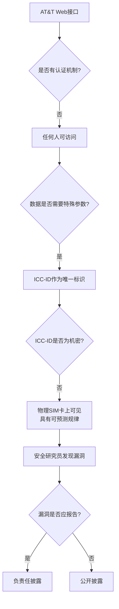
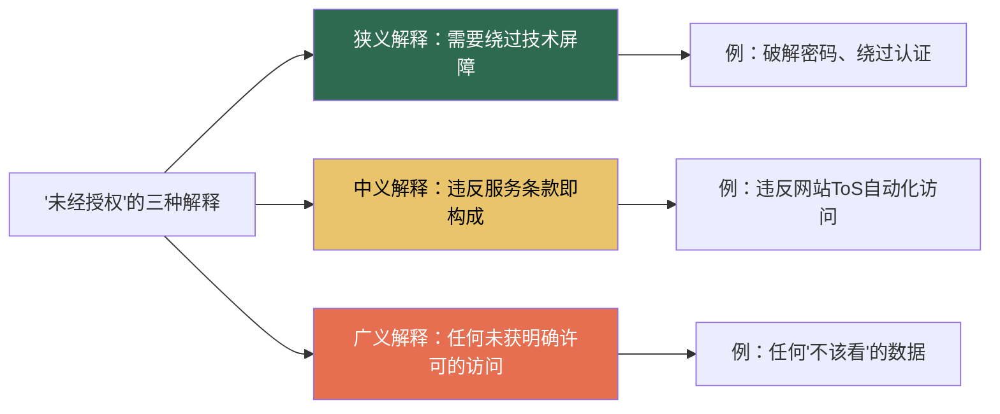
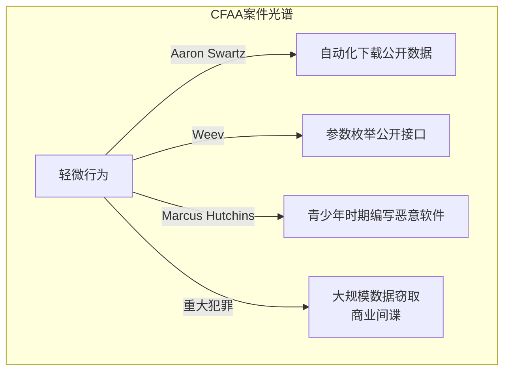

## 4.3 Weev案件：公开数据、CFAA与安全研究的法律灰区

Weev案件是美国计算机犯罪法律史上最具争议的判例之一。它直接触及了CFAA最核心也最模糊的问题——"未经授权访问"的边界在哪里？当一个接口对所有人公开，仅通过修改URL参数就能获取数据时，这种行为究竟是"发现漏洞"还是"入侵系统"？第三巡回上诉法院最终以程序性理由撤销定罪，回避了这一实质性问题，但案件本身对安全研究社区的影响深远持久。

### 4.3.1 案件背景

#### Andrew Auernheimer其人

Andrew Auernheimer（1985年出生），网名"weev"，是美国早期黑客文化中的知名人物。他活跃于多个黑客社区和IRC频道，以激进的技术观点和挑衅性的言论著称。在本案发生之前，他已经是一位有一定知名度的安全研究员和漏洞猎人，同时也是一位黑客活动家（hacktivist），信奉信息应该自由流通的理念。

他的技术能力和争议性并存——在安全社区中，有人视他为发现漏洞的白帽研究员，也有人认为他的行为方式越过了合法研究的边界。这种复杂身份背景，使得他的案件从一开始就充满争议。

#### AT&T iPad数据泄露事件始末

**发现漏洞**

2010年6月，Auernheimer和同伴Daniel Spitler（网名"json"）在研究AT&T为Apple iPad 3G用户提供的网站服务时，发现了一个严重的安全漏洞。

AT&T为iPad 3G用户提供了一个名为"非常简化的注册流程"（prefilled login form）的功能。当iPad用户首次连接3G网络时，AT&T的服务器会通过iPad的ICC-ID（Integrated Circuit Card Identifier，集成电路卡标识符，即SIM卡的唯一序列号）识别用户身份，并自动填充用户的电子邮件地址到登录页面，以简化用户体验。

问题在于：AT&T的这个Web接口完全没有认证机制。任何人只要在URL中提供一个有效的ICC-ID，服务器就会返回对应的用户邮箱地址。而ICC-ID本身并非机密信息——它是一串可预测规律的数字序列，可以通过简单的遍历方式生成。

**技术细节**

漏洞存在于AT&T的一个公开API端点中。请求格式大致如下：

```text
GET https://www.att.com/iriswireless/esvc/v2/session?iccid=<ICC-ID>
```

服务器的响应中直接包含了用户的电子邮件地址，没有任何认证检查。这意味着：

- 接口完全公开，无需登录即可访问
- 仅通过修改URL中的ICC-ID参数即可获取不同用户的数据
- ICC-ID是SIM卡的物理标识符，具有可预测的编号规律
- 没有任何速率限制或反爬虫机制

Spitler编写了一个Python脚本，通过批量遍历ICC-ID值来获取用户数据。在短时间内，他们获取了约114,000名iPad 3G用户的电子邮件地址。这些用户中包括了纽约市市长Michael Bloomberg、前白宫参谋长Rahm Emanuel、前ABC新闻主播Diane Sawyer、多位军方高层官员以及众多企业高管和名人。

**漏洞的本质分析**

从技术角度看，这个漏洞具有以下特征：



这个漏洞的关键问题在于：数据本身是"公开可访问的"（不需要认证），但获取这些数据需要"主动构造请求"（遍历ICC-ID）。这种模糊地带正是CFAA"未经授权"条款争议的核心。

#### 数据披露与事件升级

Auernheimer和Spitler将发现的漏洞和部分数据提供给了科技媒体Gawker（现已关闭的美国八卦新闻网站）。Gawker于2010年6月9日发布了报道，公开了漏洞细节和受影响的名人名单。

AT&T在媒体报道后迅速修复了漏洞，关闭了该接口。AT&T在声明中表示，他们"一获悉这个问题就立即采取了措施保护客户的信息"。

然而，事件的后续发展远超预期。联邦调查局（FBI）随即介入调查，最终导致了对Auernheimer的刑事起诉。

### 4.3.2 法律程序详解

#### 起诉与审判

2011年，联邦大陪审团对Andrew Auernheimer提起公诉，指控依据是《计算机欺诈和滥用法案》（CFAA，18 U.S.C. § 1030）中的"未经授权访问受保护的计算机"条款。

**管辖权问题**

案件的一个关键争议是管辖权。Auernheimer居住在阿肯色州（Arkansas），而AT&T的服务器位于其他州。联邦检察官选择在新泽西州（New Jersey）提起诉讼，理由是受害用户中有部分位于该州。

辩护团队对此提出强烈反对，认为Auernheimer从未踏足新泽西州，将案件放在该州审理违反了宪法第六修正案中关于"犯罪行为发生地"管辖权的规定。

**定罪与量刑**

2011年11月，陪审团在不到一天的 deliberation 后裁定Auernheimer有罪。

2013年3月，Auernheimer被判处：

- 41个月联邦监禁
- 53,000美元赔偿金
- 3年监督释放（supervised release）

这个量刑在安全社区引起了巨大震动。许多人认为，相对于行为的性质——发现一个完全公开的接口中的数据泄露——将近3年半的联邦监禁明显过重。

#### 上诉与撤销

Auernheimer的辩护团队向第三巡回上诉法院（United States Court of Appeals for the Third Circuit）提起上诉。上诉主要基于以下理由：

**程序性上诉理由：管辖权不当**

辩护方认为，在新泽西州审理此案违反了正当程序。Auernheimer的全部行为都发生在阿肯色州，服务器不在新泽西州，没有任何行为要素与新泽西州产生实质联系。

**实质性上诉理由：CFAA适用争议**

辩护方还提出了更深层的法律论点：

1. **"未经授权访问"的定义**：AT&T的接口对所有人公开，无需任何认证。访问一个公开的Web服务器是否可能构成"未经授权"？
2. **没有绕过任何安全措施**：Auernheimer没有破解密码、绕过防火墙或利用任何技术手段突破安全防线
3. **数据本身不是机密**：电子邮件地址本身不属于CFAA所保护的"受保护信息"类别

2014年4月，第三巡回上诉法院做出了裁决——**撤销定罪**。

然而，上诉法院选择了一条保守的路径。它没有对CFAA"未经授权"的实质定义做出裁决，而是仅基于管辖权问题撤销了定罪。法院认为，联邦检察官未能证明新泽西州与本案有充分的联系，因此该州不具有管辖权。

这意味着：CFAA中"未经授权访问公开接口"这一核心法律问题，至今仍然没有明确的判例法指导。

### 4.3.3 核心法律争议深度分析

#### "未经授权"的定义困境

Weev案件暴露了CFAA最根本的问题——"未经授权"（without authorization）这一核心概念缺乏明确定义。

**三种可能的解释**



在Weev案件中，适用不同解释会导致截然不同的结论：

| 解释方式 | 是否构成"未经授权" | 分析理由 |
|---------|-------------------|---------|
| 狭义解释 | 否 | 没有绕过任何技术屏障，接口完全公开 |
| 中义解释 | 可能 | 取决于AT&T是否有明确的使用条款禁止此类行为 |
| 广义解释 | 是 | AT&T未授权Auernheimer获取这些数据 |

**与Aaron Swartz案的对比**

两个案件虽然都涉及CFAA，但具体情况有所不同：

| 对比维度 | Weev案 | Swartz案 |
|---------|--------|----------|
| 数据类型 | 用户邮箱地址 | 学术论文 |
| 访问方式 | 修改公开URL参数 | 自动化脚本批量下载 |
| 安全措施 | 无任何认证 | 有IP封禁和ToS限制 |
| 数据提供方 | 无（公开接口） | JSTOR（有明确授权系统） |
| 动机 | 发现并公开漏洞 | 推动学术论文开放获取 |
| 最终结果 | 定罪后撤销（程序性理由） | 被告自杀，案件撤销 |

#### 技术漏洞与法律定性的鸿沟

Weev案件揭示了一个根本性矛盾：安全研究中的"发现漏洞"行为在技术上和法律上可能有完全不同的定性。

**技术视角**

从安全研究的角度看，Auernheimer的行为属于典型的"信息泄露漏洞发现"：

- 发现了一个未认证的API端点
- 通过参数枚举确认了数据泄露范围
- 将发现报告给了媒体（而非直接利用）

这种行为在安全研究中非常常见。许多漏洞赏金项目（Bug Bounty Programs）甚至会将此类漏洞归类为中等或高危，并给予发现者奖励。

**法律视角**

然而，从CFAA的字面意义看，问题在于：

- Auernheimer明知这些数据不属于他
- 他主动构造了请求来获取数据
- 他获取了114,000个用户的个人信息
- 他将数据提供给了第三方（媒体）

这种"明知不可为而为之"的行为模式，在法律上可能构成"未经授权访问"。

**安全社区的困境**

这个案件给安全研究人员提出了一个严峻的问题：如果你发现了一个公开接口中的数据泄露，你应该如何正确处理？

```mermaid
graph TD
    A[发现公开接口漏洞] --> B{处理方式}
    B --> C[直接报告给厂商]
    B --> D[通过媒体公开]
    B --> E[提交漏洞赏金]
    B --> F[自行验证漏洞范围]

    C --> C1[最低法律风险]
    D --> D1[高法律风险<br/>可能被指控"未授权访问"]
    E --> E1[有法律保护<br/>取决于项目条款]
    F --> F1[中等法律风险<br/>取决于验证程度和数据处理]
```

#### 管辖权问题的深层影响

第三巡回上诉法院虽然回避了CFAA的实质问题，但管辖权裁决本身也具有重要意义。

**数字犯罪的管辖权挑战**

在网络犯罪案件中，确定管辖权远比传统犯罪复杂。Weev案件暴露了以下问题：

1. **行为地与结果地分离**：Auernheimer在阿肯色州操作，影响的是全国用户
2. **服务器位置的不确定性**：云计算和CDN使得"服务器所在地"变得模糊
3. **联邦与州管辖的重叠**：网络犯罪天然具有跨州性质，但联邦法院的管辖权仍需满足特定条件

**对后续案件的影响**

这个管辖权裁决为后续类似案件提供了参考。联邦检察官在选择起诉地点时需要更加谨慎，确保所选地点与案件有实质联系。

### 4.3.4 案件后续与人物命运

#### Auernheimer的后续经历

在定罪被撤销后，Auernheimer的人生轨迹发生了重大转变。

**转向极端主义**

2010年代中期，Auernheimer逐渐转向白人至上主义和新纳粹思想。他成为多个极端主义在线社区的活跃成员，发表了大量种族主义和反犹太言论。他的政治立场转变引发了安全社区的广泛讨论——许多人开始质疑，是否应该继续将他视为"安全研究受迫害"的典型案例。

**移居海外**

据报道，Auernheimer后来移居海外，以避免在美国可能面临的进一步法律问题。

**社会活动家身份的争议**

Auernheimer的案件常常被引用来说明CFAA对安全研究的威胁。然而，随着他转向极端主义，这种引用变得越来越有争议。一些人认为应该将案件本身与当事人的个人行为分开讨论；另一些人则认为他的极端主义立场削弱了"无辜安全研究员"的叙事。

#### Daniel Spitler的结局

案件的另一位当事人Daniel Spitler（json）在2011年对CFAA指控认罪，签署了认罪协议（plea agreement）。与Auernheimer不同，Spitler选择了配合联邦调查，最终获得了较轻的处理。

### 4.3.5 对安全研究的影响

#### CFAA改革的呼声

Weev案件与Aaron Swartz案一起，成为推动CFAA改革的重要催化剂。

**Aaron's Law**

国会议员Zoe Lofgren和Ron Wyden多次提出"Aaron's Law"法案，试图：

- 明确定义"未经授权访问"的概念
- 将违反服务条款（ToS）的行为排除在CFAA刑事管辖之外
- 限制检察官对CFAA条款的过度解读

虽然这些法案至今未能通过，但它们持续推动着关于CFAA改革的公众讨论。

**安全研究豁免**

美国版权局在2018年和2021年的DMCA豁免规则中，扩大了对安全研究的保护范围。这些豁免虽然主要针对DMCA的反规避条款，但它们反映了立法和监管机构对安全研究重要性的认识。

#### 负责任披露的最佳实践

Weev案件为安全研究人员提供了重要的教训。以下是发现类似漏洞时的最佳实践：

**第一步：记录发现过程**

- 记录你如何发现漏洞（不获取敏感数据）
- 截图展示漏洞的存在（不截取用户数据）
- 记录时间戳和你的位置

**第二步：评估漏洞严重性**

- 确定泄露数据的敏感程度
- 评估受影响用户的范围
- 判断漏洞是否正在被恶意利用

**第三步：选择披露渠道**

| 渠道 | 适用场景 | 法律风险 |
|------|---------|---------|
| 厂商安全团队 | 厂商有明确的安全联系人 | 最低 |
| 漏洞赏金计划 | 厂商有官方Bug Bounty | 低（有法律保护） |
| CERT/CC | 无法联系到厂商 | 低 |
| 媒体 | 厂商不响应且漏洞严重 | 高 |

**第四步：不要扩大数据获取**

Weev案件的核心教训之一：获取大量用户数据会显著增加法律风险。如果可能的话：

- 只验证漏洞的存在，不获取完整数据集
- 不存储、不传输获取的用户数据
- 不将数据提供给媒体或第三方

### 4.3.6 与其他案件的对比分析

#### 案例对比矩阵



| 维度 | Weev | Swartz | Hutchins | Equifax泄露 |
|------|------|--------|----------|------------|
| 行为性质 | 发现公开接口漏洞 | 批量下载学术论文 | 编写银行木马 | 安全疏忽导致泄露 |
| 数据敏感度 | 中（邮箱地址） | 低（学术论文） | 高（银行凭证） | 极高（SSN/金融） |
| 主观意图 | 演示漏洞 | 推动开放获取 | 盈利（青少年） | N/A（过失） |
| CFAA适用 | 争议大 | 争议中 | 争议小 | 明确适用 |
| 最终结果 | 撤销（管辖权） | 被告自杀 | 缓刑 | 和解/罚款 |

#### 法律风险等级评估

基于Weev案件和其他CFAA判例，安全研究人员可以参考以下风险评估框架：

**低风险行为**

- 在自己的系统上测试漏洞
- 在授权范围内进行渗透测试
- 通过漏洞赏金计划提交发现
- 发现漏洞后仅报告给厂商，不获取数据

**中等风险行为**

- 发现公开接口漏洞，获取少量样本数据验证
- 在未明确授权的系统上进行安全测试
- 发现漏洞后通过CERT/CC等中立机构披露

**高风险行为**

- 获取大量用户数据并提供给媒体
- 在未经授权的系统上进行大规模数据获取
- 将发现的漏洞数据公开发布
- 在发现漏洞后不立即报告，而是持续监控

### 4.3.7 深度思考：公开数据与隐私的悖论

Weev案件触及了一个更深层的哲学问题：什么是"公开"的数据？

**"公开"的多重含义**

在技术语境中，"公开"可以有多种含义：

- **技术公开**：无需认证即可访问（Weev案的AT&T接口）
- **法律公开**：不受法律保护的信息
- **社会公开**：人们自愿公开的信息
- **可发现公开**：通过搜索引擎等工具可以找到的信息

Weev案中的数据处于一种尴尬的中间状态——技术上是公开的（无认证），但用户并不知道他们的邮箱地址可以通过这种方式获取。这种"意外公开"的漏洞，既不同于用户自愿公开的信息，也不同于被黑客攻破的系统。

**对安全研究的启示**

这个案件提醒安全研究人员：即使数据在技术上是"公开"的，获取和使用这些数据仍然可能带来法律后果。法律的判断标准不仅包括技术手段，还包括主观意图、获取规模和后续处理方式。

### 4.3.8 教训与启示总结

#### 对安全研究人员的实操建议

1. **即使是"公开"的数据**：通过操纵参数获取的数据可能被视为"未经授权访问"。技术上的"无认证"不等于法律上的"可访问"。

2. **不要将数据提供给媒体**：将发现的数据提供给媒体会显著增加法律风险。媒体曝光虽然能引起公众关注，但也可能被视为"扩大损害"。

3. **管辖权很重要**：案件的审理地点可能影响结果。如果你的活动跨越多个司法管辖区，了解各地的法律差异至关重要。

4. **记录一切**：详细记录你的研究过程、发现时间和采取的行动。在面临法律挑战时，这些记录可能成为重要的证据。

5. **寻求法律咨询**：在公开披露任何漏洞之前，考虑咨询专门从事网络安全法的律师。许多律师事务所提供针对安全研究人员的免费初步咨询。

6. **使用漏洞赏金计划**：如果目标公司有漏洞赏金计划，优先通过该渠道报告。这些计划通常提供明确的法律保护。

7. **最小化数据获取**：只获取验证漏洞所需的最少数据。不要获取完整的数据集，不要存储或传输用户数据。

#### 对立法者的建议

Weev案件暴露了CFAA的根本性缺陷：

- "未经授权"的定义过于模糊，给检察官过大的自由裁量权
- 刑事处罚与行为的严重性不成比例
- 缺乏对安全研究的明确保护条款
- 数字犯罪的管辖权规则需要更新

未来的立法应该：

- 明确定义"未经授权访问"的技术标准
- 将违反服务条款的行为排除在刑事管辖之外
- 为善意的安全研究创建明确的法律保护
- 更新管辖权规则以适应数字时代的特点

### 4.3.9 延伸阅读

- **CFAA全文**：18 U.S.C. § 1030
- **第三巡回上诉法院裁决**：United States v. Auernheimer, No. 13-1816 (3d Cir. 2014)
- **Aaron's Law提案**：H.R. 2454 (113th Congress)
- **EFF关于CFAA的分析**：Electronic Frontier Foundation 的 CFAA Reform 专题
- **Google Project Zero披露政策**：作为负责任披露的行业参考标准
