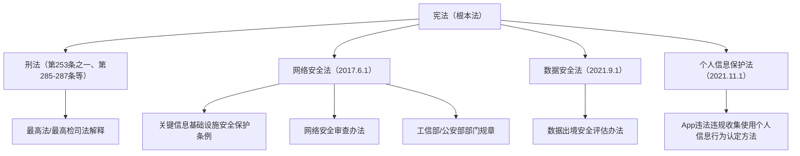
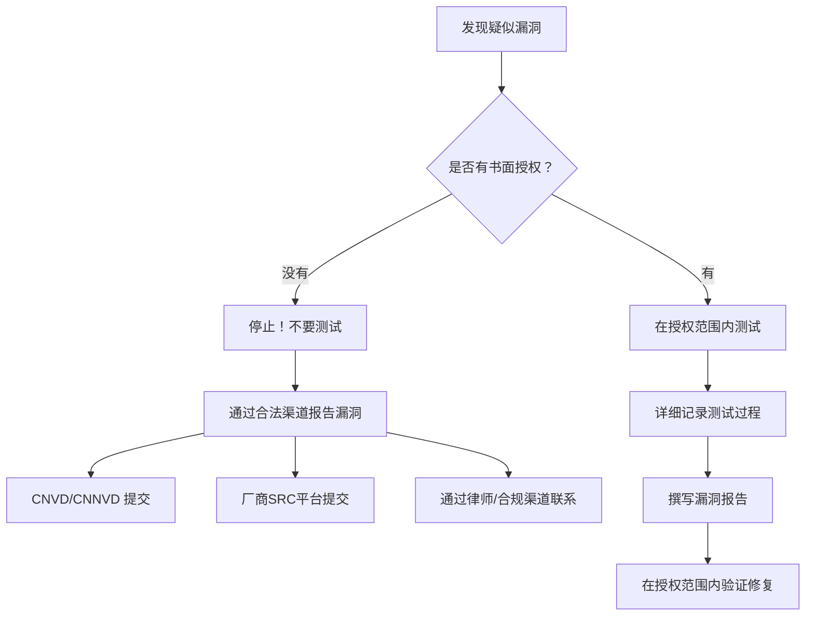
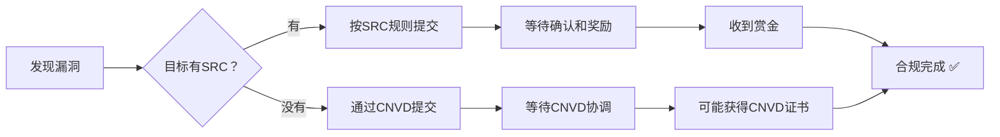
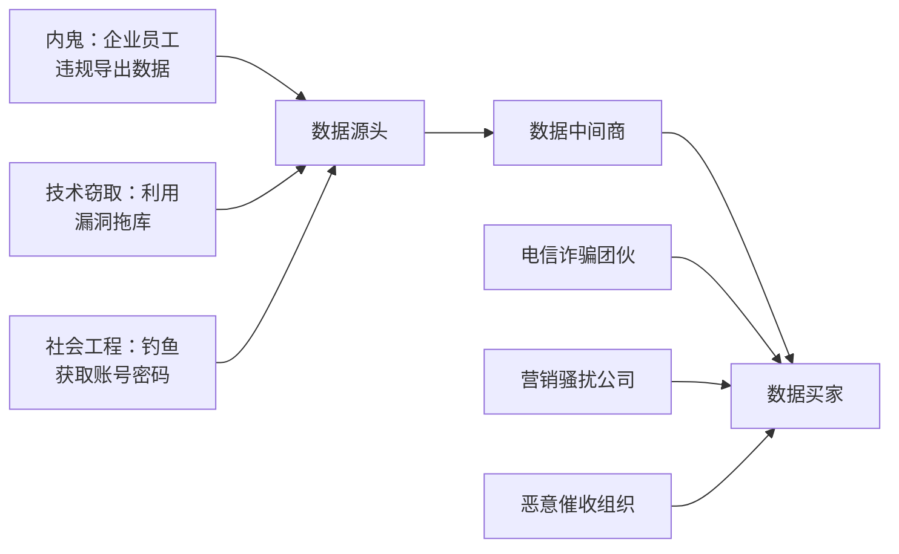
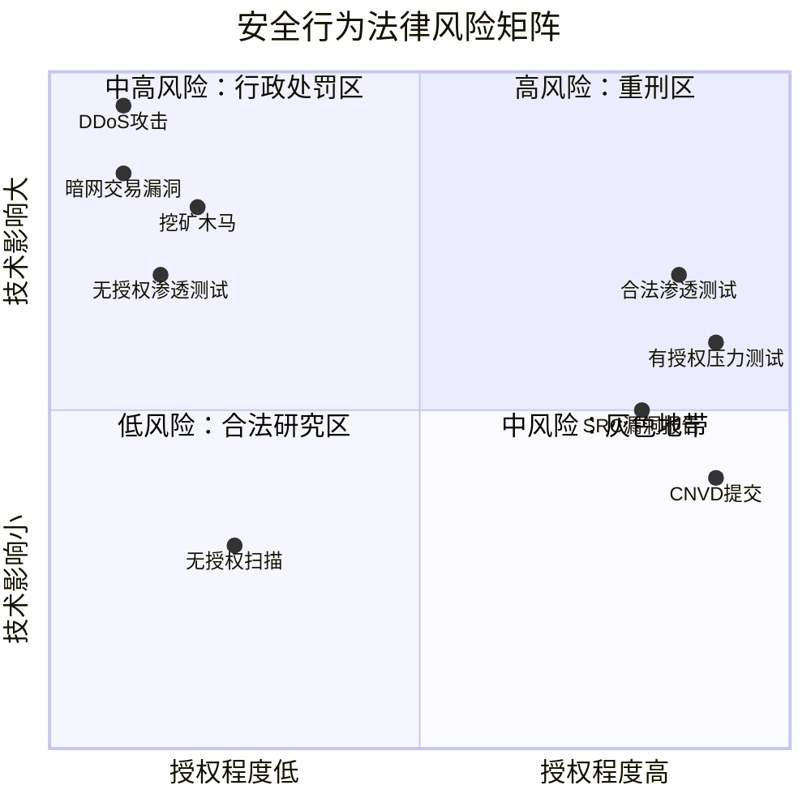
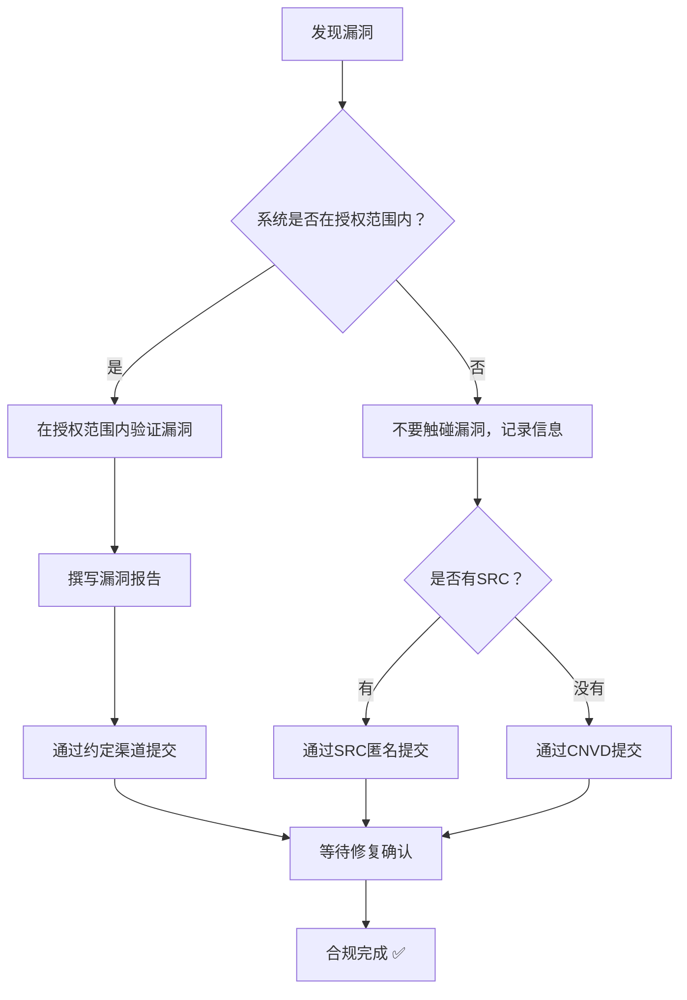

## 4.4 中国的网络安全法律案例

理解法律条文是一回事，看到法律在真实案件中如何适用则是另一回事。本节通过梳理中国网络安全领域的典型司法案例和行政执法案例，帮助安全从业者建立清晰的行为边界意识。每一个案例都附带法律依据、裁判逻辑和实务启示，让你知道"红线"到底在哪里。

***

### 4.4.1 中国网络安全法律体系概览

在进入具体案例之前，先建立法律框架的整体认知。中国的网络安全法律体系呈金字塔结构，从上位法到部门规章层层细化：

| 法律法规 | 施行日期 | 核心内容 | 与安全从业者的关联 |
|---------|---------|---------|-----------------|
| 《网络安全法》 | 2017.6.1 | 网络运行安全、信息安全、监测预警 | 渗透测试需授权、漏洞报告义务、等保要求 |
| 《数据安全法》 | 2021.9.1 | 数据分类分级、安全审查、出境管理 | 数据处理活动合规、重要数据保护 |
| 《个人信息保护法》 | 2021.11.1 | 个人信息处理规则、权利保障、跨境提供 | 收集/使用个人信息的合法性基础 |
| 《刑法》第285条 | 1997（多次修订） | 非法侵入计算机信息系统罪 | 未经授权访问系统即构成犯罪 |
| 《刑法》第286条 | 1997（多次修订） | 破坏计算机信息系统罪 | 删除/修改/增加数据或程序 |
| 《刑法》第253条之一 | 2009（刑法修正案七） | 侵犯公民个人信息罪 | 非法获取/出售/提供个人信息 |
| 《刑法》第287条之二 | 2015（刑法修正案九） | 帮助信息网络犯罪活动罪 | 为犯罪提供技术支持/工具 |
| 《网络犯罪公约》相关条款 | — | 国际网络犯罪合作 | 跨境网络犯罪的管辖权问题 |

**关键刑法条文速查表：**

| 罪名 | 法条 | 入罪门槛 | 刑罚幅度 |
|------|------|---------|---------|
| 非法侵入计算机信息系统罪 | 第285条第1款 | 侵入国家事务/国防/尖端科技系统 | 3年以下有期徒刑 |
| 非法获取计算机信息系统数据罪 | 第285条第2款 | 获取数据违法所得5000元以上或造成经济损失1万元以上 | 3年以下或3-7年 |
| 破坏计算机信息系统罪 | 第286条 | 造成系统不能正常运行，后果严重 | 5年以下或5年以上 |
| 侵犯公民个人信息罪 | 第253条之一 | 行踪轨迹/通信内容50条以上；其他信息5000条以上 | 3年以下或3-7年 |
| 帮助信息网络犯罪活动罪 | 第287条之二 | 明知他人利用信息网络实施犯罪而提供帮助 | 3年以下 |

***

### 4.4.2 案例一：未经授权渗透测试 — "白帽子"获刑案

#### 案件背景

2016年，安全研究人员王某（化名）发现某政府网站存在SQL注入漏洞。王某未获得任何书面授权，自行利用漏洞获取了数据库中的部分数据（包含用户名和邮箱），随后通过电子邮件向该单位报告了漏洞。该单位在收到报告后选择报警。

#### 侦查与起诉

公安机关以涉嫌"非法获取计算机信息系统数据罪"立案侦查。检察机关审查后提起公诉。王某辩称自己是"善意的白帽子"，目的是帮助发现和修复漏洞，未造成实际损害。

#### 法院裁判

法院审理认为：

1. **行为定性**：被告人利用SQL注入漏洞，绕过网站正常访问控制机制，获取了数据库中的用户数据，属于"侵入计算机信息系统并获取数据"的行为。
2. **主观故意**：被告人明知未获授权仍实施侵入行为，具有非法获取数据的故意。"善意目的"不能否定行为的违法性。
3. **量刑考量**：鉴于被告人获取数据后未进一步传播或牟利，且主动报告了漏洞，法院从轻处罚，判处有期徒刑一年，缓刑一年，并处罚金人民币五千元。

#### 法律分析

本案的核心法律问题是**"善意测试"能否阻却违法性**。答案是：不能。

根据《刑法》第285条第2款的规定，侵入"前款规定以外的计算机信息系统或者采用其他技术手段，获取该计算机信息系统中存储、处理或者传输的数据"即构成犯罪。法律条文并未设置"善意目的"的免责条款。

从法理上看，这与传统刑法中的"紧急避险"或"正当防卫"不同。网络安全领域中，未经授权的系统测试不具有紧迫的危险性，不存在"不测试就会造成更大损害"的紧急状态，因此不适用紧急避险。

#### 合规操作流程

正确的漏洞发现与报告流程应当如下：

**关键要点：**

- **授权先行**：任何渗透测试活动必须获得目标系统所有者的书面授权。口头同意不够，必须是加盖公章或具有法律效力的书面文件。
- **范围可控**：授权书应明确测试范围（IP地址、域名、功能模块）、测试时间窗口、允许的测试方法、禁止的行为。
- **数据最小化**：即使获得授权，也应当尽量减少对生产数据的接触。获取的数据应在测试结束后立即删除。
- **报告渠道优先**：如果你发现了未授权系统的漏洞，最安全的做法是通过CNVD（国家信息安全漏洞共享平台）或厂商的安全应急响应中心（SRC）匿名提交，而非自行测试后报告。

***

### 4.4.3 案例二：大规模数据泄露 — 企业及责任人双重追责

#### 案件背景

2020年，某大型互联网企业的用户数据库在暗网上被公开售卖，涉及超过5亿条用户记录，包含姓名、手机号、身份证号、收货地址、消费记录等敏感信息。监管部门介入调查后发现，该企业存在多项严重的安全管理缺陷：

- 用户数据库未加密存储，明文保存身份证号和手机号
- 数据库管理员账号使用弱密码（"admin123"）
- 未部署数据库审计系统，无法追溯数据访问记录
- 未执行网络安全等级保护制度要求的安全措施
- 内部员工可通过VPN无限制访问全量用户数据，无最小权限控制

#### 调查过程

公安机关网络安全保卫部门联合网信办、工信部门组成联合调查组。调查过程包括：

1. **技术取证**：对企业的服务器、网络设备、日志系统进行电子取证，还原数据泄露路径
2. **人员询问**：对IT运维人员、安全负责人、高管进行调查询问
3. **合规检查**：对照等保2.0标准检查企业的安全防护措施
4. **溯源分析**：追踪泄露数据在暗网的传播路径

调查认定：泄露的根本原因是企业安全管理严重失职，且在事件发生后未在法定时限内（72小时）向监管部门报告。

#### 法律处理

企业及责任人面临多部法律的叠加处罚：

**（一）依据《网络安全法》的行政处罚：**

- 第21条：网络运营者应当采取数据分类、重要数据备份和加密等措施。→ 企业未加密存储敏感数据，违反本条。
- 第42条：网络运营者应当采取技术措施和其他必要措施，确保其收集的个人信息安全。→ 企业未部署审计系统、未实施访问控制，违反本条。
- 第25条：网络运营者应当制定网络安全事件应急预案。发生网络安全事件时，应当立即启动应急预案。→ 企业未在法定时限内报告，违反本条。

处罚结果：对企业处以100万元罚款（《网络安全法》第64条规定的上限），责令停业整顿。

**（二）依据《个人信息保护法》的处罚：**

- 第51条：个人信息处理者应当采取加密、去标识化等安全技术措施。→ 企业未采取加密措施。
- 第57条：发生或者可能发生个人信息泄露时，应当立即采取补救措施，并通知履行个人信息保护职责的部门。→ 企业未及时报告。

处罚结果：对企业处以上一年度营业额5%的罚款，对直接负责人处以10万元罚款，禁止其在一定期限内担任企业董事、监事、高级管理人员和个人信息保护负责人。

**（三）依据《刑法》的刑事追诉：**

直接负责的IT运维主管因涉嫌"侵犯公民个人信息罪"被立案侦查。检察机关认定，该运维主管明知数据库存在严重安全漏洞而未修复，且长期违规允许无权限人员访问全量数据，其不作为构成"非法提供个人信息"的帮助行为。

最终，该运维主管被判处有期徒刑三年，并处罚金10万元。

#### 案例启示

| 层面 | 教训 | 具体措施 |
|------|------|---------|
| 技术层 | 敏感数据必须加密存储 | 使用AES-256加密，密钥由KMS管理 |
| 管理层 | 最小权限原则 | 按角色分配权限，定期审计 |
| 响应层 | 事件报告有法定时限 | 建立72小时报告流程，预设通知模板 |
| 合规层 | 等保2.0不是走形式 | 每年至少一次等保测评，持续整改 |
| 责任层 | 管理层不能免责 | CISO/CTO需对安全事件承担个人责任 |

***

### 4.4.4 案例三：漏洞交易平台被查处 — "Hacker Lu"事件

#### 案件背景

2018年至2019年间，国内某知名漏洞交易平台被公安机关查处。该平台允许安全研究人员注册后提交漏洞信息，包括漏洞描述、影响范围、漏洞利用代码（PoC/EXP），并由平台审核后向企业客户出售。

表面上看，这是一个"连接安全研究者与企业"的中介平台。但公安机关调查发现以下问题：

1. **漏洞利用代码可直接用于攻击**：平台上的部分漏洞附带完整的利用代码，未经脱敏处理，任何人注册即可下载
2. **审核机制形同虚设**：平台对提交的漏洞缺乏有效审核，无法确保漏洞仅用于防御目的
3. **购买者身份不核查**：平台未对购买漏洞的企业客户进行实名认证和资质审核
4. **灰色产业链**：部分漏洞被倒卖至境外，流入黑产链条

#### 法律处理

平台运营者及核心成员被以"帮助信息网络犯罪活动罪"起诉。

《刑法》第287条之二规定："明知他人利用信息网络实施犯罪，为其犯罪提供互联网接入、服务器托管、网络存储、通讯传输等技术支持，或者提供广告推广、支付结算等帮助，情节严重的，处三年以下有期徒刑或者拘役，并处或者单处罚金。"

法院认定：平台运营者明知部分漏洞利用代码可能被用于实施网络攻击犯罪，仍提供发布和交易渠道，属于"提供技术支持"的帮助行为。

最终判决：

- 平台主犯：有期徒刑二年六个月，并处罚金20万元
- 核心技术人员：有期徒刑一年六个月，并处罚金5万元
- 平台被关闭，服务器被扣押
- 违法所得被追缴

#### 合法漏洞报告的边界在哪里？

这个案例引发了安全社区的广泛讨论：漏洞研究与漏洞交易的边界在哪里？

**合法的漏洞报告活动：**

| 渠道 | 特点 | 法律风险 |
|------|------|---------|
| CNVD（国家信息安全漏洞共享平台） | 官方平台，仅收录漏洞信息，不提供EXP | 低 |
| CNNVD（国家信息安全漏洞库） | 官方平台，漏洞编号管理 | 低 |
| 厂商SRC（安全应急响应中心） | 企业自建平台，有明确的报告规则和奖励 | 低（需遵守规则） |
| 有授权的渗透测试 | 合同约定范围内的合法测试 | 低（需在授权范围内） |

**高风险或违法的活动：**

| 行为 | 风险等级 | 法律后果 |
|------|---------|---------|
| 在公开论坛发布未修复漏洞的EXP | 高 | 可能构成提供侵入/破坏工具罪 |
| 向未授权第三方出售漏洞利用代码 | 极高 | 帮助信息网络犯罪活动罪 |
| 在暗网交易零日漏洞 | 极高 | 多项罪名叠加 |
| 未授权测试后以漏洞为要挟索要报酬 | 极高 | 敲诈勒索罪 |

**合法漏洞赏金的注意事项：**

**特别提醒：** 即使是通过合法SRC提交漏洞，也必须严格遵守SRC的测试规则。常见的违规行为包括：

- 超出授权范围测试（如从Web测试扩展到内网渗透）
- 测试过程中访问了不属于测试范围的用户数据
- 使用自动化工具进行大规模扫描影响了业务可用性
- 在漏洞修复前公开漏洞细节

***

### 4.4.5 案例四：侵犯公民个人信息罪 — 数据黑产全链条打击

#### 案件背景

2021年，公安部"净网"行动中破获了一起特大侵犯公民个人信息案。犯罪团伙构建了一条完整的数据黑产链：

**犯罪链条详情：**

1. **数据获取层**：多名企业内部员工利用职务便利，违规导出客户数据（包括银行客户信息、快递面单数据、房产中介客户名单）。同时，技术团伙利用SQL注入等漏洞批量获取网站数据库。
2. **数据加工层**：中间商对原始数据进行清洗、去重、分类、打标签，形成"精准营销数据库"。
3. **数据销售层**：通过Telegram群组、暗网论坛、加密通信工具进行交易，使用虚拟货币结算。
4. **数据使用层**：下游买家将数据用于电信诈骗、精准营销、恶意催收等违法活动。

**涉案数据规模：** 超过10亿条公民个人信息，涵盖姓名、身份证号、手机号、银行卡号、家庭住址、消费记录、出行记录等。

#### 法律处理

本案涉及多个罪名，体现了"全链条打击"的司法理念：

| 角色 | 罪名 | 量刑 |
|------|------|------|
| "内鬼"（企业员工） | 侵犯公民个人信息罪 | 3-5年有期徒刑 |
| 技术窃取者 | 非法获取计算机信息系统数据罪 + 侵犯公民个人信息罪 | 数罪并罚，5-7年 |
| 数据中间商 | 侵犯公民个人信息罪（情节特别严重） | 5-7年有期徒刑 |
| 平台运营者 | 帮助信息网络犯罪活动罪 | 2-3年有期徒刑 |
| 下游诈骗团伙 | 诈骗罪 + 侵犯公民个人信息罪 | 数罪并罚，10年以上 |

**"情节特别严重"的认定标准：**

根据《最高人民法院、最高人民检察院关于办理侵犯公民个人信息刑事案件适用法律若干问题的解释》（2017年），以下情形属于"情节特别严重"：

- 行踪轨迹信息、通信内容、征信信息、财产信息500条以上
- 住宿信息、通信记录、健康生理信息、交易信息等其他可能影响人身、财产安全的公民个人信息5000条以上
- 其他公民个人信息5万条以上
- 违法所得5万元以上

#### 安全从业者的警示

这个案例对安全从业者的警示是多方面的：

**第一，"内鬼"是最大的安全风险。** 无论你的系统防护多么严密，一个拥有合法访问权限的内部员工都可以绕过所有技术防护。企业需要实施数据防泄漏（DLP）方案、数据库审计、异常行为检测。

**第二，数据泄露的法律后果向个人延伸。** 不仅仅是企业被处罚，直接责任人面临刑事追诉。即使是"老板让导出的"，员工也不能以"执行上级命令"为由免责。

**第三，数据黑产已经形成完整的产业链。** 从获取、加工、销售到使用，每个环节都有专业分工。安全从业者不仅要防止自己的系统被攻破，还要意识到泄露的数据在黑产中的流转方式。

***

### 4.4.6 案例五：DDoS攻击 — 破坏计算机信息系统罪

#### 案件背景

2019年，被告人张某因与某游戏公司产生商业纠纷，雇佣黑客对该公司游戏服务器发动DDoS（分布式拒绝服务）攻击。攻击持续72小时，导致游戏服务器完全不可用，超过200万玩家无法正常游戏，企业直接经济损失超过300万元。

攻击者使用了一个由数万台被入侵的物联网设备（路由器、摄像头）组成的僵尸网络，峰值流量超过200Gbps。

#### 法律处理

**对雇佣者（张某）的处理：**

以"破坏计算机信息系统罪"起诉。《刑法》第286条规定："违反国家规定，对计算机信息系统功能进行删除、修改、增加、干扰，造成计算机信息系统不能正常运行，后果严重的，处五年以下有期徒刑或者拘役；后果特别严重的，处五年以上有期徒刑。"

法院认定攻击行为属于"干扰"计算机信息系统功能，且造成了"后果特别严重"（经济损失超过300万元、影响用户超过200万）。张某被判处有期徒刑六年。

**对攻击实施者的处理：**

直接实施DDoS攻击的黑客被以"破坏计算机信息系统罪"起诉。同时，因其控制的僵尸网络涉及大量被入侵的物联网设备，还被追加"非法控制计算机信息系统罪"（《刑法》第285条第2款）。数罪并罚，判处有期徒刑八年。

#### DDoS攻击的法律认定要点

| 认定要素 | 具体要求 | 本案情况 |
|---------|---------|---------|
| 行为方式 | 删除/修改/增加/干扰系统功能 | 通过大流量攻击使服务器无法响应 |
| 主观故意 | 明知会造成系统不可用 | 张某明确指示攻击目标和时间 |
| 因果关系 | 攻击行为与系统不可用之间有直接因果 | 攻击期间服务器完全不可用，攻击停止后恢复 |
| 后果认定 | 经济损失、用户影响、社会影响 | 经济损失300万+，影响200万用户 |
| 量刑档次 | 后果严重：5年以下；后果特别严重：5年以上 | 认定为后果特别严重 |

#### 与安全研究的边界

安全从业者可能会问：如果我在测试中不小心触发了类似DDoS的效果（如压力测试导致服务器崩溃），会怎样？

关键区别在于**主观故意**和**授权范围**：

- 有授权的压力测试，即使导致服务中断，属于"授权范围内的正常测试行为"，不构成犯罪
- 无授权的任何形式的拒绝服务测试，即使声称是"善意测试"，也可能构成犯罪
- 即使有授权，超出授权范围的压力测试（如约定测试10分钟却持续攻击72小时）仍可能构成犯罪

***

### 4.4.7 案例六：某安全公司非法侵入案 — "以安全之名"行违法之实

#### 案件背景

2020年，某网络安全公司为了拓展业务，安排技术人员对多家潜在客户的信息系统进行"免费安全检测"。该公司未获得任何目标系统的书面授权，技术人员使用漏洞扫描器和渗透测试工具对目标系统进行了全面扫描，并获取了部分系统的管理员权限。

该公司随后联系被检测企业，告知其系统存在严重安全漏洞，并以此推销安全产品和服务。

#### 法律处理

多名技术人员被以"非法侵入计算机信息系统罪"和"非法获取计算机信息系统数据罪"起诉。

辩护律师提出：被告人的目的是发现漏洞并帮助企业提升安全水平，属于"正当的商业行为"。

法院驳回了这一辩护理由，认为：

1. **未经授权是核心问题**：不论目的如何，未经授权访问他人计算机信息系统即构成违法
2. **商业目的不等于合法目的**：以推销产品为目的的"免费检测"本质上是未经同意的商业行为
3. **公司行为构成单位犯罪**：公司作为单位主体，也承担刑事责任

最终判决：

- 公司：罚金50万元，吊销相关业务资质
- 技术负责人：有期徒刑二年
- 直接实施测试的技术人员：有期徒刑一年，缓刑一年六个月

#### 行业警示

这个案例在安全行业引起了巨大震动，因为它涉及的不是个人黑客，而是正规的安全公司。案件揭示了安全行业的几个重要合规要点：

**第一，安全公司的业务推广不能依赖"展示肌肉"式的入侵。** 正确的做法是通过白皮书、技术博客、行业会议、客户案例等方式展示能力，而不是通过入侵潜在客户的系统来证明。

**第二，"免费检测"必须获得明确授权。** 即使是免费服务，也需要目标企业的书面同意。最佳实践是签订正式的授权协议，明确检测范围、时间、方法和数据处理方式。

**第三，安全行业的商业伦理底线：** 安全公司是"守护者"，不是"攻击者"。行业声誉建立在信任之上，一旦安全公司自身成为违法者，对整个行业的信誉损害是深远的。

***

### 4.4.8 案例七：网络安全审查 — 滴滴出行事件

#### 案件背景

2021年6月，滴滴出行在美国纽交所上市。上市次日，国家互联网信息办公室宣布对滴滴出行实施网络安全审查。审查期间，滴滴出行App被要求停止新用户注册。

2022年7月，网信办发布对滴滴全球股份有限公司的行政处罚决定：

**违法事实：**

1. **违规收集个人信息**：App在用户明确拒绝的情况下，仍持续收集手机相册中的截图信息
2. **过度收集个人信息**：收集了与提供出行服务无关的个人信息，包括用户剪切板信息、应用列表信息
3. **过度收集乘客人脸识别信息**：在不必要场景下强制进行人脸识别
4. **过度收集司机年龄信息**：收集了司机年龄段信息，与出行服务无直接关系
5. **严重违规处理个人信息**：在未明确告知用户的情况下处理敏感个人信息
6. **数据出境违规**：将中国用户的个人信息传输至境外，未依法进行安全评估

**处罚结果：**

- 对滴滴全球股份有限公司处以人民币80.26亿元罚款
- 对董事长兼CEO程维处以人民币100万元罚款
- 对总裁柳青处以人民币100万元罚款

#### 法律依据

本案适用了多部法律法规：

| 法律依据 | 适用条款 | 违法行为 |
|---------|---------|---------|
| 《网络安全法》 | 第41条 | 违规收集个人信息 |
| 《网络安全法》 | 第42条 | 未确保个人信息安全 |
| 《网络安全法》 | 第37条 | 关键信息基础设施运营者数据出境未评估 |
| 《个人信息保护法》 | 第6条 | 最小必要原则 |
| 《个人信息保护法》 | 第13条 | 未取得个人同意处理个人信息 |
| 《个人信息保护法》 | 第38条 | 向境外提供个人信息未评估 |
| 《数据安全法》 | 第31条 | 关键信息基础设施运营者数据出境管理 |

#### 对安全从业者的启示

滴滴事件的影响远超一家企业，它确立了几个重要先例：

**第一，罚款可以是"天文数字"。** 80.26亿元的罚款是中国数据安全领域有史以来最高的单笔处罚，传递了监管的严厉信号。《个人信息保护法》规定，情节严重的可以处以上一年度营业额5%的罚款。

**第二，高管个人需承担责任。** 董事长和总裁各被罚100万元，这表明监管不再仅处罚企业，而是向"关键个人"追责。

**第三，数据出境成为监管重点。** 企业在海外上市或与境外机构共享数据时，必须依法进行数据出境安全评估。这直接影响了后续多家中国科技企业的上市策略。

**第四，上市前的数据合规审查成为必选项。** 滴滴事件后，计划上市的中国科技企业普遍加强了数据合规审查，聘请专业的数据合规律师团队进行全面评估。

***

### 4.4.9 案例八：挖矿木马与非法控制计算机信息系统

#### 案件背景

2019年至2021年间，被告人李某开发了一款加密货币挖矿木马程序，并通过以下方式将其植入大量计算机：

1. 将挖矿程序伪装成"系统优化工具"在软件下载站传播
2. 利用Web应用漏洞（SQL注入、文件上传漏洞）入侵网站，在网页中嵌入挖矿脚本
3. 通过破解弱口令SSH服务器植入挖矿程序
4. 利用永恒之蓝（EternalBlue）漏洞在内网横向传播

被感染的计算机超过10万台，涵盖了企业服务器、政府网站服务器、高校服务器和个人电脑。挖矿产生的加密货币价值超过200万元。

#### 法律处理

被告人被以以下罪名起诉：

1. **非法控制计算机信息系统罪**（第285条第2款）：控制超过10万台计算机，属于"情节特别严重"
2. **非法获取计算机信息系统数据罪**：利用漏洞入侵服务器获取控制权
3. **破坏计算机信息系统罪**：挖矿程序导致被感染系统CPU占用率长期100%，严重影响正常业务运行

法院认定"情节特别严重"，判处有期徒刑七年六个月，并处罚金50万元。违法所得200万元被全部追缴。

#### 技术与法律的交汇

这个案例展示了技术手段如何转化为法律认定：

| 技术行为 | 法律认定 | 法律后果 |
|---------|---------|---------|
| 植入挖矿程序 | 非法控制计算机信息系统 | 3年以下或3-7年 |
| 利用漏洞入侵 | 非法获取计算机信息系统数据 | 3年以下或3-7年 |
| CPU满载影响业务 | 破坏计算机信息系统（干扰） | 5年以下或5年以上 |
| 控制10万+台计算机 | 情节特别严重 | 从重处罚 |
| 获取200万元加密货币 | 违法所得 | 全部追缴 + 罚金 |

***

### 4.4.10 案例九：算法歧视与大数据杀熟 — 《个人信息保护法》新领域的执法

#### 案件背景

2022年以来，多起涉及"大数据杀熟"的投诉和诉讼引发了社会关注。典型场景包括：

- 某在线旅游平台对老用户显示更高的酒店价格
- 某打车平台对经常使用苹果手机的用户收取更高的费用
- 某电商平台对不同消费能力的用户展示不同的商品价格

#### 法律依据与处理

《个人信息保护法》第24条规定："个人信息处理者利用个人信息进行自动化决策，应当保证决策的透明度和结果公平、公正，不得对个人在交易价格等交易条件上实行不合理的差别待遇。"

2023年，某省市场监管局对一家在线旅游平台作出行政处罚：

- 认定其"大数据杀熟"行为违反了《个人信息保护法》第24条
- 同时违反了《电子商务法》第18条（不得针对个人特征提供不合理差别待遇）
- 处以50万元罚款，责令整改

#### 对安全和数据从业者的启示

这个案例的意义在于，它扩展了"网络安全"的边界——不仅仅是技术层面的攻防，数据处理方式本身也可以构成违法。安全从业者在设计系统时需要考虑：

- 用户数据的使用是否超出了授权范围
- 算法决策是否对用户造成了不公平的待遇
- 用户是否能够便捷地拒绝个性化推荐

***

### 4.4.11 案例十：人脸识别技术滥用 — 首例人脸识别侵权案

#### 案件背景

2019年，杭州野生动物世界在未告知消费者的情况下，将入园方式从指纹识别升级为人脸识别。消费者郭兵认为这一变更未经其同意，侵犯了其个人信息权，遂提起诉讼。

#### 法院裁判

本案被称为"中国人脸识别第一案"，经历了两审：

**一审（2020年）：** 法院认定，人脸识别信息属于敏感个人信息，处理时应当取得个人的单独同意。杭州野生动物世界在未取得消费者同意的情况下收集人脸信息，构成违约和侵权。判令赔偿郭兵合同利益损失及交通费，并删除其人脸信息。

**二审（2021年）：** 杭州市中级人民法院维持了一审判决，进一步明确：经营者不得以"提升服务"为由强制收集消费者的人脸信息，消费者有权选择替代性的验证方式。

#### 法律意义

本案确立了几个重要原则：

1. **人脸识别信息属于敏感个人信息**：处理前必须取得个人的"单独同意"，而非概括性的隐私政策同意
2. **"告知-同意"规则的具体适用**：经营者必须明确告知收集目的、方式和范围，不得以格式条款规避
3. **替代方案原则**：当存在非敏感信息的替代验证方式时，不得强制要求消费者提供敏感个人信息
4. **用户有权撤回同意**：即使已经同意，用户也有权随时撤回，并要求删除已收集的信息

***

### 4.4.12 案例十一：跨境数据传输 — 数据出境安全评估第一案

#### 案件背景

2023年，某跨国企业在华子公司被要求进行数据出境安全评估。该企业长期将中国员工和客户的个人信息传输至其总部的全球HR系统和CRM系统。

监管机构在评估中发现：

- 传输的数据包括员工的薪资信息、绩效评估、健康信息等敏感个人信息
- 数据传输未进行安全评估
- 境外接收方的数据保护水平未经评估
- 数据传输未取得个人的单独同意

#### 处理结果

- 限期6个月内完成数据出境安全评估
- 评估未通过前，暂停向境外传输个人信息
- 处以30万元罚款

#### 数据出境的合规路径

根据《数据安全法》和《个人信息保护法》，企业向境外传输数据有以下合规路径：

| 路径 | 适用场景 | 核心要求 |
|------|---------|---------|
| 安全评估（强制） | 关键信息基础设施运营者；处理100万人以上个人信息；累计出境10万人以上或1万人以上敏感个人信息 | 向网信部门申报，通过评估 |
| 标准合同 | 非强制评估的一般情形 | 与境外接收方签订标准合同并向网信部门备案 |
| 个人信息保护认证 | 跨境企业集团内部传输 | 通过专业机构认证 |
| 国际条约/协定 | 依据中国缔结或参加的国际条约 | 按条约规定执行 |

***

### 4.4.13 案例十二：网络暴力与"人肉搜索" — 个人信息的刑事保护边界

#### 案件背景

2022年，某网民在社交媒体上因发表争议性言论，遭到大规模"人肉搜索"。多名网民通过各种渠道获取并公开了该网民的真实姓名、身份证号、家庭住址、工作单位、配偶信息等个人信息，导致当事人遭受严重的网络暴力和现实骚扰。

#### 法律处理

公安机关依据《刑法》第253条之一（侵犯公民个人信息罪）对主要参与者立案侦查。最终：

- 3名主要参与者被以"侵犯公民个人信息罪"起诉，分别判处6个月至2年有期徒刑
- 多名参与者被处以行政拘留和罚款
- 社交平台因未及时采取删除、屏蔽措施，被依据《网络安全法》第47条处以行政罚款

#### 法律分析

这个案例明确了几个重要原则：

**第一，"人肉搜索"不是法外之地。** 即使被搜索的对象确实有道德瑕疵，未经授权公开他人个人信息仍然构成违法。法律不支持"以正义之名"实施的违法行为。

**第二，参与者和组织者均需承担法律责任。** 不仅是第一个公开信息的人，后续转发、补充信息的参与者也可能构成违法。

**第三，平台有"通知-删除"义务。** 社交平台在接到用户举报后，应当及时采取删除、屏蔽等措施。否则，平台也可能承担行政责任。

***

### 4.4.14 案例对比分析与规律总结

将上述案例放在一起对比，可以发现以下规律：

#### 定罪量刑趋势

| 维度 | 早期（2017年前） | 近期（2021年后） |
|------|---------------|----------------|
| 处罚对象 | 主要处罚直接行为人 | 扩展到企业高管、平台运营者 |
| 处罚力度 | 罚款多在100万以下 | 出现80亿级罚款、7年以上重刑 |
| 执法范围 | 以刑事打击为主 | 行政处罚+刑事追诉并行 |
| 数据保护 | 较少涉及 | 成为重点领域 |
| 跨境问题 | 几乎不涉及 | 成为新的执法重点 |
| 新技术领域 | 较少涉及 | AI算法、人脸识别纳入监管 |

#### 安全从业者的行为边界矩阵

#### 十大红线总结

根据上述案例，安全从业者应当牢记以下十条红线：

| 序号 | 红线行为 | 法律后果 | 案例来源 |
|------|---------|---------|---------|
| 1 | 未经授权访问任何信息系统 | 非法侵入计算机信息系统罪 | 案例一、六 |
| 2 | 获取/出售/提供公民个人信息 | 侵犯公民个人信息罪 | 案例四、十二 |
| 3 | 对系统发动DDoS攻击 | 破坏计算机信息系统罪 | 案例五 |
| 4 | 植入恶意程序（含挖矿） | 非法控制计算机信息系统罪 | 案例八 |
| 5 | 交易平台提供漏洞利用代码 | 帮助信息网络犯罪活动罪 | 案例三 |
| 6 | 企业未保护好用户数据 | 行政处罚 + 高管追责 | 案例二、七 |
| 7 | 未授权收集人脸等敏感信息 | 个人信息保护法处罚 | 案例十 |
| 8 | 数据出境未评估 | 数据安全法处罚 | 案例七、十一 |
| 9 | 大数据杀熟/算法歧视 | 个人信息保护法处罚 | 案例九 |
| 10 | "人肉搜索"公开他人信息 | 侵犯公民个人信息罪 | 案例十二 |

***

### 4.4.15 安全从业者的合规操作手册

#### 渗透测试合规清单

在进行任何渗透测试之前，逐项确认以下内容：

- [ ] **书面授权书**：目标系统所有者签署的授权书，包含公章或法定代表人签字
- [ ] **测试范围**：明确的IP地址、域名、功能模块列表
- [ ] **时间窗口**：明确的测试开始和结束时间
- [ ] **允许的方法**：列出允许使用的测试工具和方法
- [ ] **禁止的行为**：明确禁止的操作（如删除数据、影响业务可用性）
- [ ] **数据处理规则**：测试过程中获取的数据如何处理（留存期限、删除方式）
- [ ] **保密条款**：测试结果的保密义务和报告流程
- [ ] **应急联系人**：测试过程中出现问题时的联系人和联系方式
- [ ] **免责条款**：在授权范围内的合法测试行为的法律免责

#### 漏洞发现后的合规流程

#### 数据处理合规要点

| 环节 | 合规要求 | 常见违规 |
|------|---------|---------|
| 数据收集 | 最小必要原则，取得同意 | 超范围收集、默认勾选同意 |
| 数据存储 | 加密存储、访问控制 | 明文存储、弱口令保护 |
| 数据使用 | 按授权目的使用 | 超目的使用、数据共享未告知 |
| 数据传输 | 加密传输、安全评估 | 未加密、跨境未评估 |
| 数据删除 | 到期删除、用户请求后删除 | 永不删除、删除不彻底 |
| 安全事件 | 72小时内报告 | 隐瞒不报、延迟报告 |

***

### 4.4.16 常见误区与纠偏

#### 误区一："我是善意的，不会被追究"

**现实：** 中国刑法对计算机犯罪不设"善意免责"条款。无论你的动机多么正当，未经授权的系统侵入就是犯罪。法院在量刑时可能会考虑动机（如从轻处罚），但这不改变行为的违法性。

**正确做法：** 即使发现了严重漏洞，也应通过合法渠道报告，而非自行测试验证。

#### 误区二："扫描不算入侵，不会有事"

**现实：** 这取决于扫描的深度和影响。简单的端口扫描通常不构成犯罪，但使用漏洞扫描器进行深度扫描（发送exploit payload、尝试获取系统信息）可能被认定为"侵入"行为。2021年后，多地公安机关将"未授权的漏洞扫描"纳入了执法范围。

**正确做法：** 任何超出"正常网络访问"行为的主动测试活动，都需要授权。

#### 误区三："漏洞在公开论坛上讨论不违法"

**现实：** 漏洞的技术讨论通常是合法的，但如果你发布了未修复漏洞的详细利用方法（EXP），且该漏洞可以被直接用于攻击系统，可能构成"提供侵入、非法控制计算机信息系统的程序、工具罪"（第285条第3款）。

**正确做法：** 在漏洞被修复之前，只发布漏洞的影响范围和防护建议，不发布具体的利用代码。

#### 误区四："数据删了就没事了"

**现实：** 数据删除不等于法律责任消灭。如果数据泄露已经发生，删除原始数据不能消除泄露数据在暗网中的流转。而且，在调查过程中删除数据可能被认定为"销毁证据"，加重处罚。

**正确做法：** 数据泄露后，应立即启动应急响应，保留所有日志和证据，配合监管部门调查。

#### 误区五："用虚拟货币收款就追查不到"

**现实：** 虚拟货币的匿名性被高估。公安机关已经建立了成熟的虚拟货币追踪技术，能够通过链上分析、交易所KYC信息、IP地址关联等手段追溯资金流向。多起案件中，使用虚拟货币结算的犯罪团伙均被成功追查。

**正确做法：** 不要抱有侥幸心理，任何违法行为的收益都不值得冒险。

***

### 4.4.17 进阶：网络安全领域的前沿法律问题

#### 人工智能安全的法律规制

2023年以来，AI安全成为新的法律关注点：

- **《生成式人工智能服务管理暂行办法》**（2023.8.15）：要求AI服务提供者对训练数据进行安全评估，对生成内容进行审核，不得生成违法内容
- **深度伪造（Deepfake）** 的法律规制：使用AI生成的虚假人脸视频可能构成诽谤、诈骗、侵犯肖像权等多项违法
- **AI安全测试** 的法律边界：对AI模型进行对抗性攻击测试（如越狱、提示注入）是否合法，目前法律尚未明确，但存在法律风险

#### 物联网安全的法律空白

物联网设备的安全问题日益突出，但法律规制相对滞后：

- 大量IoT设备使用默认密码，被用于组建僵尸网络
- 设备制造商的安全责任不明确
- 消费者被入侵的IoT设备可能被用于违法行为，设备所有者是否需要承担责任？

#### 区块链与智能合约安全

- 智能合约漏洞导致的资产损失，开发者是否需要承担法律责任？
- DeFi项目的安全审计是否属于"网络安全服务"，需要相应的资质？
- DAO治理攻击是否构成"破坏计算机信息系统"？

这些问题目前大多处于法律灰色地带，但随着技术的发展，未来必然会有更明确的法律规制。安全从业者应持续关注法律动态，确保自身行为始终在法律框架内。

***

### 4.4.18 本节小结

通过以上十二个案例的分析，我们可以看到中国网络安全法律体系的几个核心特征：

1. **法律框架日趋完善**：从《网络安全法》到《数据安全法》《个人信息保护法》，形成了覆盖网络运行安全、数据安全、个人信息保护的完整法律体系
2. **执法力度持续加大**：从早期的象征性罚款到80亿元级处罚，从3年以下轻刑到7年以上重刑，监管态度越来越严厉
3. **责任主体不断扩大**：从直接行为人到企业高管、平台运营者、安全公司，责任链条不断延伸
4. **新技术带来新挑战**：AI安全、物联网安全、区块链安全等领域的法律规制仍在演进中

对于安全从业者而言，遵守法律不是束缚，而是职业发展的基石。只有在法律框架内行事，才能赢得行业的信任和尊重，才能让安全研究真正发挥其正面价值。

**核心原则：永远不要在没有书面授权的情况下触碰他人的系统。**
