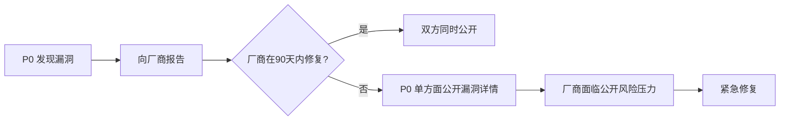
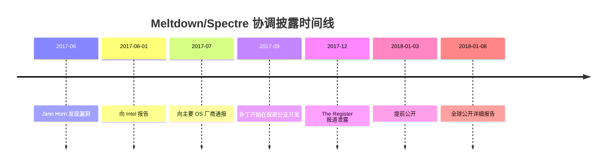

## 4.5 Google Project Zero案例

Google Project Zero（以下简称 P0）是安全研究史上最具影响力的团队之一。它不仅发现了大量关键漏洞，更通过其披露政策推动了整个行业的漏洞协调披露规范演进。理解 P0 的案例，是理解"负责任披露"与"完全披露"之间张力的最佳切入点。

### 4.5.1 团队背景与运作机制

#### 成立背景

2014年7月，Google 正式成立 Project Zero，由著名安全研究者 Chris Evans 领导。成立的直接导火索是当时多个被"国家级"攻击者利用的零日漏洞（如 Heartbleed、Hacking Team 泄露事件）长期未被发现。Google 认为，业界对漏洞研究的投入不足，尤其是对"非自家产品"漏洞的研究几乎处于空白。

#### 团队构成与研究范围

P0 的核心成员包括：

| 成员 | 专长领域 | 代表性成果 |
|------|----------|------------|
| Tavis Ormandy | 系统安全、杀毒软件 | 多个 Windows 内核、Symantec/Norton 漏洞 |
| Ian Beer | iOS/macOS 内核 | 多个 iOS 越狱级漏洞 |
| Ben Hawkes | 浏览器安全 | Chrome、Firefox 多个 RCE |
| Jann Horn | 处理器安全 | Meltdown/Spectre 发现者之一 |
| Natalie Silvanovich | 嵌入式/协议安全 | WhatsApp、WebRTC RCE |

研究范围涵盖：操作系统内核、浏览器引擎、虚拟化平台、密码学库、杀毒软件、硬件处理器、即时通讯协议等。P0 不限于 Google 自有产品——事实上，绝大多数发现涉及 Apple、Microsoft、Qualcomm、ARM 等竞争对手产品。

#### 90天披露政策

P0 的核心制度是**90天披露期限**：从向厂商报告漏洞之日起，无论厂商是否完成修复，90天后自动公开漏洞详情（PoC、分析报告）。这一政策的设计逻辑：

1. **给予厂商足够时间修复**：90天对于大多数漏洞修复是充足的
2. **创造紧迫感**：避免厂商无限期拖延修复
3. **保护用户知情权**：用户有权知道正在使用的产品存在安全风险
4. **建立可预期的规则**：厂商可以提前规划补丁周期



### 4.5.2 核心争议案例详解

#### 案例一：Windows 内核提权漏洞（2015年1月）

**背景**

2014年9月30日，P0 研究员 Tavis Ormandy 向微软报告了一个 Windows 内核漏洞（CVE-2015-0057）。该漏洞存在于 `win32k.sys` 的系统调用处理中，攻击者可以从低权限用户提升到 SYSTEM 权限。

**时间线**

| 日期 | 事件 |
|------|------|
| 2014-09-30 | P0 向微软 MSRC 报告漏洞 |
| 2014-10-02 | 微软确认收到，开始分析 |
| 2014-12-30 | 90天期限到期（2015年1月1日为周末，提前到工作日） |
| 2015-01-01 | P0 公开漏洞详情和 PoC |
| 2015-01-13 | 微软补丁日（距离公开仅12天） |

**争议焦点**

微软认为 P0 应该多给几天时间，因为补丁日就在眼前。P0 认为规则就是规则——如果这次给延期，以后所有厂商都会要求"再等几天"。

**技术细节**

漏洞核心在于 `win32k!xxxEnableWndSBArrows` 函数中未正确验证窗口滚动条状态，攻击者可以通过精心构造的 `NtUserEnableScrollBar` 系统调用触发越界内存写入，进而覆盖内核对象的函数指针获得代码执行。

**影响评估**

- 该漏洞被后续多个 APT 组织使用
- 微软在2015年2月补丁日才正式修复（MS15-010）
- 从公开到修复的12天窗口期内，多个攻击框架整合了该漏洞

#### 案例二：Symantec/Norton 杀毒软件漏洞（2016年）

**背景**

Tavis Ormandy 发现 Symantec/Norton 杀毒软件存在严重的远程代码执行漏洞。由于杀毒软件拥有内核级权限，且会自动扫描所有网络流量和文件，这意味着**任何接收到的恶意文件——甚至不需要用户打开——就能触发漏洞**。

**技术影响**

- 影响所有 Symantec/Norton 产品线
- 漏洞存在于核心扫描引擎 `Dec2LHA.dll` 中
- 攻击者可以发送一封包含恶意附件的邮件，杀毒软件扫描时自动触发
- 权限：内核级 SYSTEM

**披露过程**

P0 给了 Symantec 完整的90天，Symantec 在期限内发布了补丁。但 Ormandy 在公开报告中写道：

> "这是一个无需用户交互的远程内核代码执行漏洞，在杀毒软件中。我很难想象还有什么比这更糟糕的了。"

**行业影响**

这次披露推动了整个安全行业审视杀毒软件自身的攻击面——如果保护你的软件本身就是攻击入口，那安全模型就需要重新审视。

#### 案例三：Meltdown 与 Spectre（2018年）

**背景**

2017年6月1日，Jann Horn（P0）独立发现了现代处理器的推测执行机制存在严重的侧信道漏洞。几乎同时，奥地利格拉茨技术大学的团队也独立发现了类似问题。

这两个漏洞的影响范围前所未有：
- **Meltdown（CVE-2017-5754）**：打破用户态和内核态的隔离，几乎影响所有 Intel 处理器（1995年以来）
- **Spectre（CVE-2017-5753, CVE-2017-5715）**：打破进程间隔离，影响 Intel、AMD、ARM 处理器

**协调披露的特殊安排**

由于漏洞涉及硬件层面，修复周期远超软件漏洞。各方同意了一个特殊的协调披露方案：

| 事项 | 详情 |
|------|------|
| 原始披露日期 | 2018年1月9日 |
| 实际公开日期 | 2018年1月3日（因媒体报道泄露，提前6天） |
| 协调范围 | Google、Intel、AMD、ARM、Microsoft、Apple、Linux 内核社区、Amazon |
| 保密级别 | 多个大型项目的补丁在保密分支中开发 |



**为什么延长披露期**

与软件漏洞不同，处理器漏洞的修复涉及：
1. 硬件设计修改（需要数年）
2. 操作系统内核重写（需要数月）
3. 云服务商的虚拟化层调整（需要数周）
4. 浏览器 JavaScript 引擎补丁

90天对这类跨硬件-软件栈的漏洞显然不够。这次事件促使 P0 对其披露政策增加了**14天宽限期**机制：如果厂商能证明补丁将在14天内发布，可以申请延期。

### 4.5.3 披露政策的演进

P0 的90天政策经历了多次调整：

| 时间 | 变化 | 原因 |
|------|------|------|
| 2014年 | 初始90天政策 | 建立明确规则 |
| 2015年 | Windows 争议后未改变 | 坚持规则的刚性 |
| 2018年 | 增加14天宽限期 | Meltdown/Spectre 的教训 |
| 2020年 | 对关键基础设施漏洞增加协调选项 | 医疗、能源等行业的特殊需求 |

**与其他披露政策的对比**

| 披露模式 | 代表方 | 特点 | 优势 | 劣势 |
|----------|--------|------|------|------|
| 负责任披露（Responsible） | CERT/CC | 45天，可延期 | 灵活 | 容易被厂商利用拖延 |
| 协调披露（Coordinated） | P0 | 90天+14天宽限 | 规则明确 | 对复杂漏洞可能不够 |
| 完全披露（Full Disclosure） | FD 邮件列表 | 发现即公开 | 用户知情最快 | 无修复窗口期 |
| 漏洞赏金 | 各厂商 | 等修复后公开 | 经济激励 | 覆盖范围有限 |

### 4.5.4 对安全研究者的启示

#### 正面经验

1. **建立明确的沟通时间线**：P0 的做法证明，清晰的规则比模糊的"尽快修复"更有效。安全研究者在报告漏洞时，应明确告知厂商预期的披露日期。

2. **技术深度决定话语权**：P0 能够推动行业变革，根本原因是其发现的漏洞足够重要、分析足够深入。浅层的漏洞扫描报告无法产生同样的影响力。

3. **透明度建立信任**：P0 公开所有报告、时间线和沟通记录，这种透明度使其披露政策获得了广泛信任。

#### 需要警惕的问题

1. **90天不是万能的**：不同类型的漏洞需要不同的时间窗口。Web 应用漏洞可能几天就能修，但内核漏洞或硬件漏洞可能需要数月。一刀切的政策会带来摩擦。

2. **披露不等于攻击**：P0 公开漏洞详情时会提供 PoC，但同时也会提供缓解方案和检测指标。关键是披露后要有足够的防御信息。

3. **研究者的责任边界**：P0 的做法有时被批评为"高高在上"——大公司有资源在90天内修复，但小型开源项目可能没有。对开源项目的披露需要更多同理心。

#### 实操建议

如果你发现了漏洞并需要进行协调披露，以下是参考流程：

```plaintext
1. 确认漏洞影响范围和严重程度（CVSS评分）
2. 识别正确的联系人（security@vendor.com 或 CERT/CC）
3. 首次报告邮件模板：
   - 漏洞描述（不含PoC）
   - 影响版本
   - 预期披露日期（报告日+90天）
   - 你希望收到确认的时间（建议7天）
4. 等待厂商确认（7天无回复则联系CERT/CC）
5. 在披露日期前14天提醒厂商
6. 到期后公开漏洞详情（包含PoC和防御建议）
```

### 4.5.5 案例的法律与伦理维度

#### 法律层面

P0 的披露行为在法律上处于灰色地带：
- **美国 CFAA**：P0 的研究通常在受控环境下进行，不涉及未授权访问
- **DMCA 反规避条款**：处理器漏洞研究可能触发，但安全研究豁免条款提供了一定保护
- **欧盟 GDPR**：如果漏洞涉及用户数据泄露，披露时需要考虑是否触发数据泄露通知义务

#### 伦理层面

P0 的案例提出了几个根本性的伦理问题：

1. **谁有权替用户做决定？**厂商声称"我们需要更多时间"，但用户有权知道自己面临的风险。P0 的立场是：透明优于保密。

2. **零日漏洞的军火化**：P0 公开的漏洞 PoC 理论上可以被攻击者利用。但 P0 认为，如果一个漏洞已经被国家级攻击者使用（如 Stuxnet），公开它反而迫使厂商修复。

3. **研究者的独立性**：P0 隶属于 Google，但研究不受 Google 商业利益影响。这种独立性是其公信力的基石，但也引发了"Google 为什么花钱研究竞争对手产品"的质疑。

### 4.5.6 总结

Google Project Zero 的案例深刻塑造了现代漏洞披露实践。其90天政策从最初的争议到成为行业基准，体现了安全社区在"保护用户"和"给厂商时间"之间寻找平衡的持续努力。对安全研究者而言，P0 的经验表明：**规则的刚性与灵活性并不矛盾——关键在于规则本身要透明、可预期、且对所有参与者一视同仁**。
