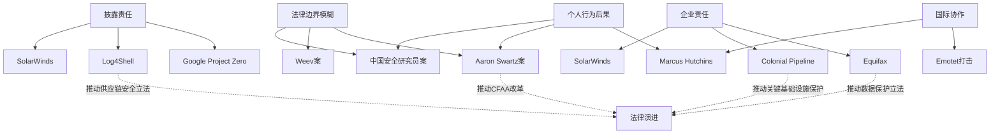

## 本节小结

本节通过九个真实案例，从不同维度展示了网络安全法律的实际应用。这些案例不是孤立的法律故事，而是一套完整的认知体系——从个人研究者到跨国企业，从漏洞披露到供应链攻击，从国内执法到国际合作，每一个案例都在回答同一个根本问题：**安全从业者的法律边界在哪里？**

### 案例全景回顾

以下表格汇总了本节所有案例的核心信息，便于快速对比和记忆：

| 案例 | 时间 | 核心法律问题 | 结果 | 关键教训 |
|------|------|-------------|------|---------|
| Aaron Swartz | 2011-2013 | CFAA"未经授权"定义模糊 | 被告自杀，引发CFAA改革讨论 | 检察官裁量权滥用可致命 |
| Marcus Hutchins | 2017-2019 | 青少年时期行为的追溯责任 | 缓刑，无需入狱 | 过去行为不会因后来的英雄事迹而消失 |
| Weev | 2010-2014 | 公开数据的参数操纵是否构成"未授权" | 定罪后因管辖权问题撤销 | 法律程序细节可能比实体问题更关键 |
| 中国安全研究员案 | 2019 | 善意测试≠合法测试 | 以非法侵入罪起诉 | 书面授权是底线，善意不能免责 |
| Google Project Zero | 2015-2018 | 漏洞披露时间线的合理性 | 90天政策成为行业标准 | 披露政策需要灵活性 |
| Equifax | 2017-2019 | 数据泄露的企业责任 | 5.75亿美元和解 | 管理层必须为安全疏忽承担后果 |
| Colonial Pipeline | 2021 | 勒索软件与关键基础设施保护 | 支付440万赎金，FBI追回部分 | 政府-私营部门合作是关键 |
| Log4Shell | 2021-2022 | 开源安全责任与供应链信任 | 推动SBOM和供应链安全立法 | 每一行开源代码都是潜在攻击面 |
| SolarWinds | 2020-2021 | 供应链攻击的法律后果 | SEC调查，零信任架构加速 | 软件供应链安全是系统性风险 |

### 九大核心教训

通过对所有案例的深度分析，可以提炼出以下九条核心教训。每一条都不是抽象的道德说教，而是从真实案件中血淋淋地总结出来的实操准则。

#### 教训一：法律不关心你的意图，只关心你的行为

Aaron Swartz认为学术论文应该免费开放，目的不可谓不高尚。中国安全研究员发现漏洞后主动报告，动机不可谓不善意。但法律的评价标准是行为本身，而非行为背后的意图。Swartz的脚本下载行为触犯了CFAA，中国研究员的未授权测试触犯了《刑法》第285条——无论动机如何，行为的违法性不会因此消除。

这不是说意图完全不重要。在量刑阶段，良好的意图可能成为减轻处罚的考量因素。但在定罪阶段，意图的辩护效力极为有限。安全从业者必须牢记：**先获得授权，再进行测试。顺序不能颠倒。**

#### 教训二："未经授权"是一个法律概念，不是技术概念

从技术角度看，Swartz使用的是MIT的开放网络，Weev访问的是公开可用的API接口，两者都没有突破任何技术访问控制。但从法律角度看，"未经授权"的判断标准不在于你是否突破了技术壁垒，而在于你是否获得了系统所有者的明确许可。

这意味着：即使某个端口对外开放，即使某个API不需要认证，即使某个页面没有访问控制——如果你没有获得所有者的明确授权去访问或测试，你的行为就可能构成"未经授权访问"。技术上的可达性不等于法律上的合法性。

#### 教训三：过去的行为会追上你

Marcus Hutchins在2017年因阻止WannaCry而成为全球英雄，但仅仅三个月后就因2014年创建Kronos木马的往事被FBI逮捕。这个案例的残酷教训是：安全行业的声誉不能抵消过去的法律责任。

对于年轻的安全研究者，这意味着：不要以为"黑帽时期"的行为会随着转为"白帽"而自动消失。法律的追溯期通常很长，而且国际合作使得跨境追诉成为可能。如果你过去有过灰色行为，最好的策略是咨询律师，而不是祈祷没人发现。

#### 教训四：披露是权利，也是责任

Google Project Zero的90天披露政策、Log4Shell的快速公开、SolarWinds的延迟披露——三个案例展示了漏洞披露的三种不同策略，以及每种策略的利弊。

- **快速公开**（如Log4Shell）：保护了用户知情权，但给攻击者提供了利用窗口
- **延迟披露**（如SolarWinds）：给厂商修复时间，但可能被指控隐瞒
- **固定期限**（如Project Zero）：平衡了各方利益，但缺乏对特殊情况的灵活性

安全研究者在发现漏洞后面临两难：公开可能帮助攻击者，隐瞒可能纵容厂商拖延。负责任的披露流程（Responsible Disclosure）不是简单的"报告然后等"，而是一个需要持续沟通、协调和判断的复杂过程。

#### 教训五：企业安全疏忽的代价正在急剧上升

Equifax案5.75亿美元的和解金额、Colonial Pipeline案440万美元的赎金、以及SolarWinds案的SEC调查，共同指向一个趋势：**企业对安全疏忽的法律代价正在从"罚款"升级为"生存威胁"。**

这不仅是企业的警示，也是安全从业者的机遇。企业对安全的重视程度直接决定了安全岗位的需求量和预算。同时，安全从业者也需要理解：当你为企业提供安全服务时，你承担的是法律责任，而不仅仅是技术责任。

#### 教训六：供应链安全是下一个法律战场

Log4Shell和SolarWinds两个案例共同揭示了一个深刻的问题：现代软件的供应链极其复杂，任何一个环节的漏洞都可能影响整个生态系统。Log4Shell暴露了开源软件维护者缺乏资源和法律保护的困境，SolarWinds暴露了软件供应商在代码完整性方面的系统性风险。

监管机构已经开始回应：美国行政命令要求软件物料清单（SBOM），欧盟《网络弹性法案》对软件供应链安全提出了强制要求。对于安全从业者，供应链安全分析将成为一项核心技能。

#### 教训七：国际协作正在改变网络犯罪的游戏规则

Emotet僵尸网络的全球打击行动涉及8个国家的执法机构协同作战，展示了国际网络安全合作的现实能力。Marcus Hutchins案件展示了英国公民可以在美国被起诉，Aaron Swartz案件展示了美国CFAA的域外效力。

对于安全从业者，这意味着：不要以为跨国行为可以规避法律。《布达佩斯网络犯罪公约》等国际条约正在建立跨境执法的法律框架，各国之间的司法协助越来越高效。匿名性和地理距离提供的保护正在迅速消失。

#### 教训八：网络安全保险不是万能的保护伞

本节涉及的网络安全保险案例表明，保险可以在一定程度上转移财务风险，但存在明显的局限性：

- **免赔额和赔付上限**：大多数保单都有免赔额，且赔付上限可能不足以覆盖重大事件
- **除外条款**：故意违法行为、未采取合理安全措施等情况通常不在保险范围内
- **理赔条件**：保险公司可能要求被保险人证明已采取合理的安全措施
- **不能替代合规**：保险不能免除法律合规义务

安全从业者应该理解保险的定位：它是风险管理的补充工具，而不是替代合规和安全实践的捷径。

#### 教训九：合规不是终点，而是起点

所有案例共同指向一个结论：**法律合规是安全从业者的最低要求，而不是最高标准。** Equifax在数据泄露前可能在形式上满足了某些合规要求，但其实际安全措施远未达到应有的水平。中国安全研究员案中的企业可能在合规方面做得不错，但仍然遭受了数据泄露。

真正的安全不是"通过审计"，而是建立持续的安全文化和实践。法律合规提供了行为的底线，但安全从业者应该追求的是在合规基础上的卓越——主动发现和修复漏洞，建立纵深防御体系，培养全员安全意识。

### 案例间的深层关联

这些案例不是孤立存在的，它们之间存在深层的逻辑关联。理解这些关联有助于建立完整的法律认知框架：

从这个关联图可以看出，所有案例都围绕着四个核心张力展开：

1. **安全研究自由 vs. 法律限制**：研究者需要空间探索和发现漏洞，但法律需要明确的边界
2. **快速披露 vs. 安全修复**：用户有权知道风险，但厂商需要时间修复
3. **个人责任 vs. 组织责任**：安全事件中，个人和组织各应承担多少责任
4. **国内法律 vs. 国际协作**：网络犯罪没有国界，但法律体系有

### 从案例到实践：安全从业者的法律自检清单

基于本节所有案例的教训，以下是安全从业者在日常工作中应该遵循的法律自检清单：

**开始任何安全活动之前：**

- [ ] 是否获得了书面授权？（中国安全研究员案、Weev案）
- [ ] 授权范围是否明确？包括目标系统、测试方法、时间窗口？（中国安全公司违规渗透案）
- [ ] 是否了解目标所在司法管辖区的法律？（Marcus Hutchins案）
- [ ] 是否准备了应急方案？（Colonial Pipeline案）

**发现漏洞之后：**

- [ ] 是否按照负责任披露流程报告？（Google Project Zero案）
- [ ] 是否给了厂商合理的修复时间？（Log4Shell案）
- [ ] 是否保留了所有沟通记录？（Aaron Swartz案）
- [ ] 是否避免了对生产系统的影响？（Equifax案）

**发布安全研究结果之前：**

- [ ] 是否评估了公开信息可能被恶意利用的风险？（Log4Shell案）
- [ ] 是否与受影响方进行了协调？（SolarWinds案）
- [ ] 是否遵守了漏洞赏金计划的条款？（各案例通用）
- [ ] 是否咨询了法律专业人士？（Aaron Swartz案）

**日常工作中：**

- [ ] 是否定期更新安全知识和法律意识？
- [ ] 是否购买了适当的职业责任保险？
- [ ] 是否建立了安全事件响应流程？
- [ ] 是否记录了所有安全活动的日志？

### 对不同角色的针对性建议

#### 对个人安全研究者

Aaron Swartz和Marcus Hutchins的案例最为相关。你的研究自由不是无限的——在你开始任何测试之前，先问自己三个问题：我有授权吗？我了解法律后果吗？我有律师的联系方式吗？

具体建议：

1. **建立授权模板**：准备标准化的授权协议模板，确保每次测试都有书面授权
2. **了解管辖权**：不同国家和地区的法律差异很大，跨境研究需要特别谨慎
3. **保持透明**：与目标组织保持良好沟通，避免单方面行动
4. **购买保险**：如果从事专业安全服务，考虑购买职业责任保险
5. **加入社区**：加入安全研究者社区，了解最新的法律动态和最佳实践

#### 对企业安全团队

Equifax、Colonial Pipeline和SolarWinds的案例最为相关。安全不是IT部门的内部事务，而是涉及整个组织法律责任的战略问题。

具体建议：

1. **建立安全文化**：安全意识培训不应流于形式，要让每个员工理解安全的法律意义
2. **完善授权管理**：对内部和外部的安全测试活动建立严格的授权和审计流程
3. **事件响应准备**：建立并定期演练安全事件响应流程，包括法律响应
4. **供应链审计**：评估和管理供应链中的安全风险，建立SBOM管理能力
5. **合规与卓越并重**：在满足合规要求的基础上，追求更高的安全标准

#### 对安全服务提供商

中国安全公司违规渗透案和网络安全保险案例最为相关。你的服务不仅涉及技术交付，更涉及法律责任的转移和分担。

具体建议：

1. **明确服务范围**：在合同中明确界定测试范围、方法和限制
2. **保留证据**：完整记录测试过程，包括授权、发现、报告和修复建议
3. **购买专业保险**：网络安全服务的责任风险需要通过保险来管理
4. **建立质量体系**：通过ISO 27001等认证建立可信赖的服务质量
5. **持续教育**：确保团队成员了解最新的法律要求和行业标准

### 法律环境的演进趋势

从这些案例中，可以清晰地看到网络安全法律正在经历的几个重要演进：

**趋势一：从事后惩罚到事前预防**

传统法律主要关注安全事件发生后的惩罚和赔偿。但Equifax、Colonial Pipeline等案例推动了立法方向的转变——从"出了事再罚"转向"要求你提前做好安全措施"。美国的行政命令、欧盟的NIS2指令、中国的《数据安全法》都体现了这一趋势。

**趋势二：从个人责任到组织责任**

早期的网络安全法律主要追究个人黑客的责任。但SolarWinds、Equifax等案例表明，监管机构越来越关注组织层面的安全责任。CISO（首席信息安全官）的角色正在从技术管理者转变为法律责任人。

**趋势三：从国内法律到国际协调**

Emotet打击行动、Marcus Hutchins案件、Log4Shell的全球影响都表明，网络安全法律正在从各国独立执法走向国际协调。《布达佩斯网络犯罪公约》、双边司法协助条约、国际刑警组织的协调机制都在加强。

**趋势四：从代码安全到供应链安全**

Log4Shell和SolarWinds共同推动了供应链安全立法。美国的行政命令要求联邦供应商提供SBOM，欧盟的《网络弹性法案》对软件供应链安全提出了强制要求。这将深刻影响软件开发和分发的整个流程。

### 结语

这九个案例讲述的不仅是法律条文的应用，更是安全行业与法律体系之间持续博弈的真实写照。每一个案例都在提醒我们：安全研究和职业活动必须在法律框架内进行，但法律框架本身也需要在安全实践的推动下不断演进。

理解法律边界不仅是保护自己的需要，更是职业责任的一部分。当Aaron Swartz面对35年刑期的指控时，当Marcus Hutchins在英雄光环下被逮捕时，当中国安全研究员因善意测试被起诉时——他们都在用最惨痛的方式告诉我们：**法律不会因为你的心是好的就对你的手软。**

作为安全从业者，我们的使命是在法律允许的范围内，尽最大努力保护数字世界的安全。这不是一个容易的平衡，但它是唯一可持续的道路。
