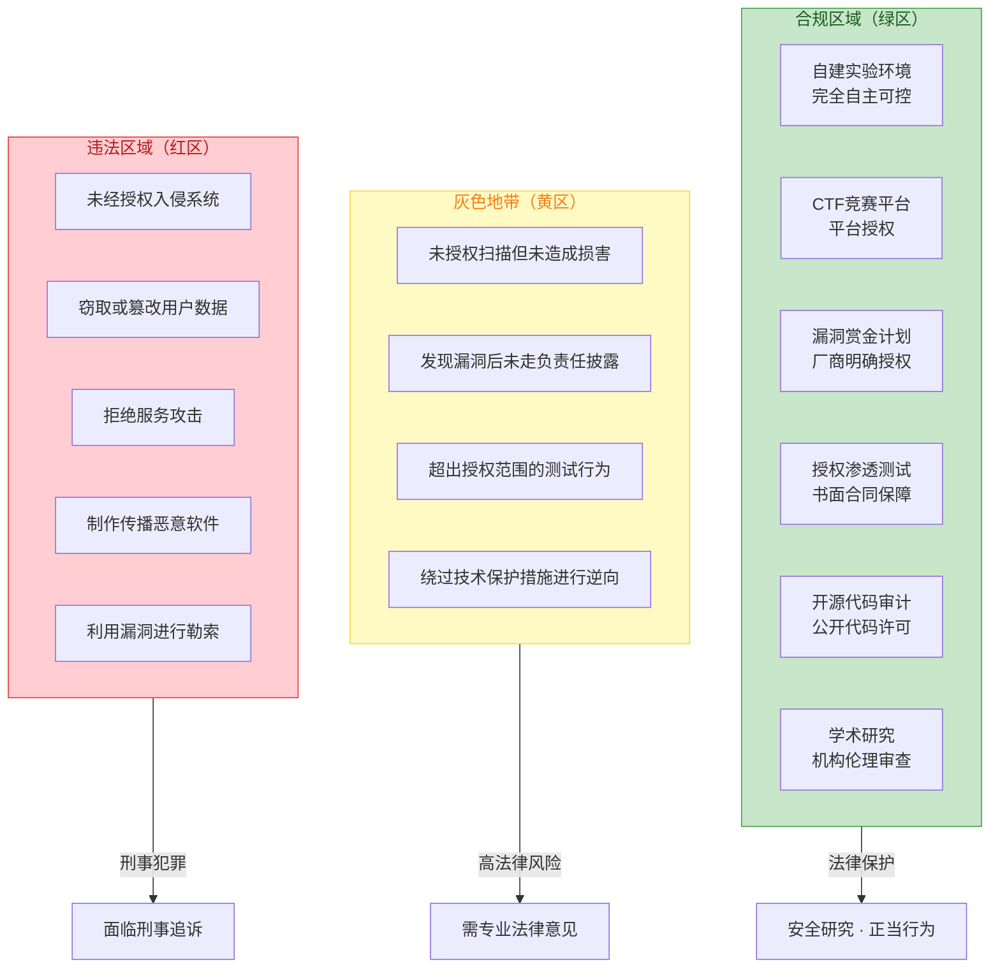
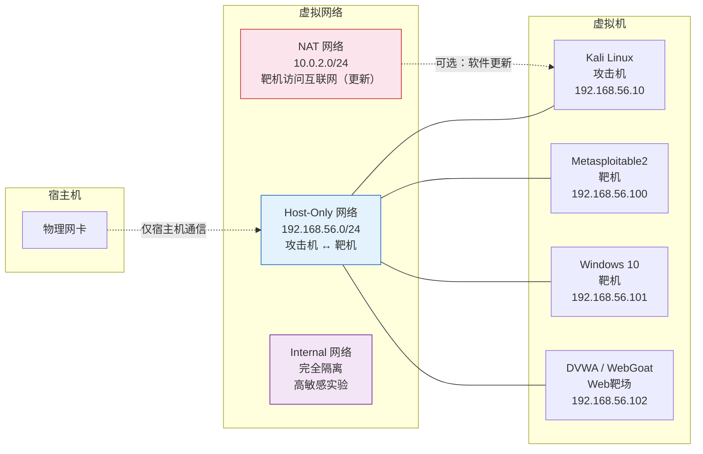
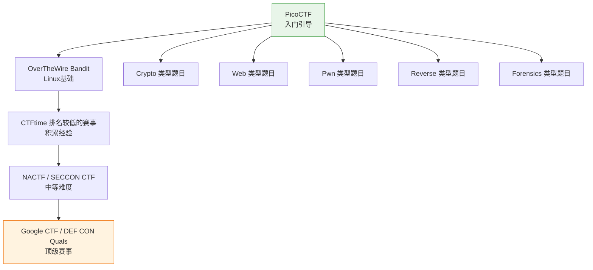
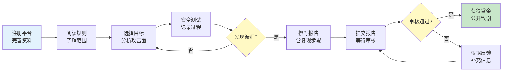
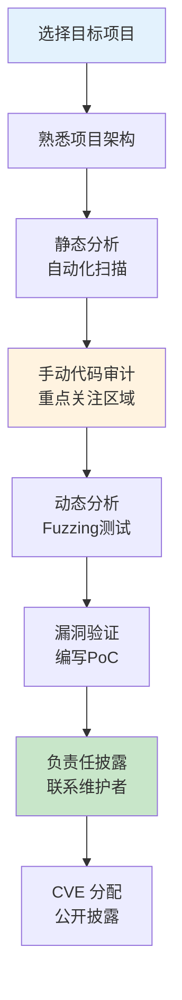
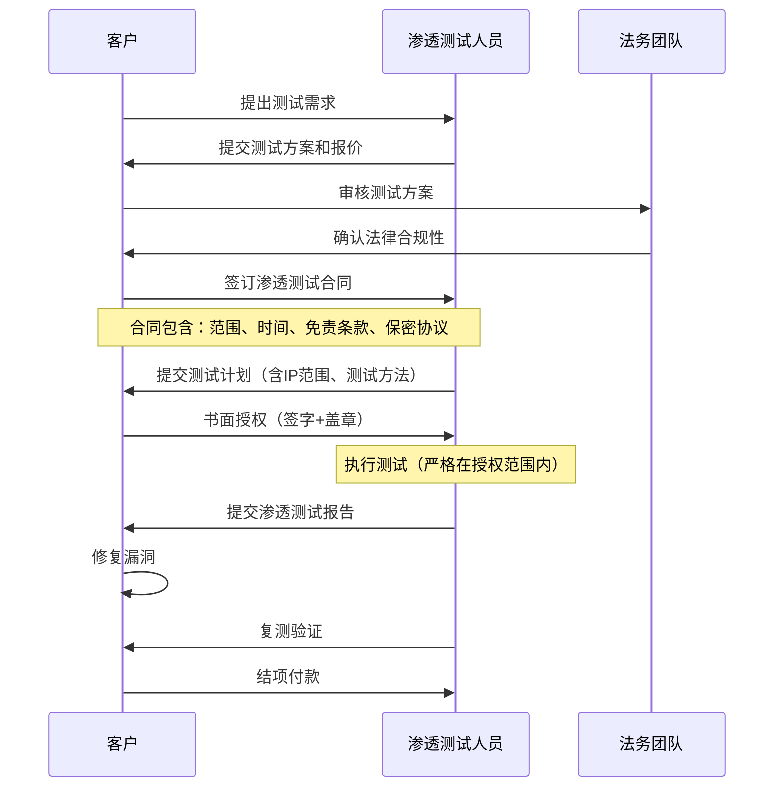
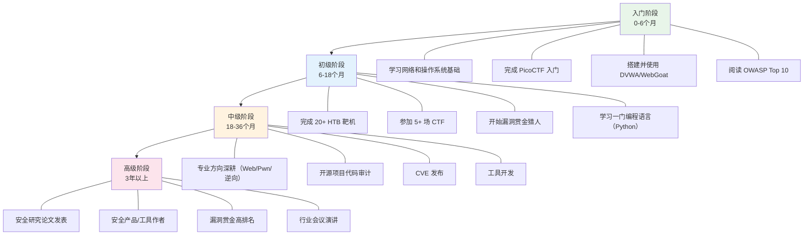

## 3.1 合法安全研究的方法

合法安全研究是网络安全能力成长的唯一可持续路径。本节系统介绍六种受法律保护的研究方法，从自建实验环境到参与漏洞赏金计划，每种方法都给出完整的操作流程、工具链和注意事项。

### 3.1.1 合法研究的法律边界

在深入具体方法之前，必须明确合法与违法的边界。下图展示了安全研究的三个区域：



**关键法律原则**：合法安全研究的核心要素是 **明确授权** + **范围限定** + **不造成损害**。缺少任何一个要素，行为就可能从合法滑向违法。详细法律分析请参见本章理论基础部分（第2.1-2.5节）。

### 3.1.2 自建实验环境

自建实验环境是最安全、最灵活的安全研究方式。你在自己的硬件和网络中进行实验，不受任何外部限制，也不需要担心法律风险——前提是你使用的软件和数据都是合法获取的。

#### 为什么必须自建实验环境

- **零法律风险**：对自己的系统进行任何操作都不违反法律
- **完全可控**：可以随意配置网络拓扑、操作系统版本、服务状态
- **可重复实验**：通过快照功能随时恢复到任意状态
- **学习成本低**：失败了重来即可，不会有真实后果

#### 虚拟化平台选择

| 平台 | 类型 | 价格 | 性能 | 适用场景 |
|------|------|------|------|----------|
| VMware Workstation Pro | Type-2 虚拟化 | 免费（2024年后） | 优秀 | 专业研究、日常使用 |
| VirtualBox | Type-2 虚拟化 | 开源免费 | 良好 | 入门学习、跨平台 |
| VMware ESXi | Type-1 虚拟化 | 免费版有限制 | 极佳 | 搭建多节点实验集群 |
| Proxmox VE | Type-1 虚拟化 | 开源免费 | 极佳 | 服务器级虚拟化环境 |
| KVM/QEMU | Type-1 虚拟化 | 开源免费 | 优秀 | Linux原生虚拟化 |
| Docker/LXC | 容器化 | 免费 | 极快 | 轻量级服务隔离 |

#### 搭建完整实验环境的步骤

**第一步：安装虚拟化平台**

以 VirtualBox 为例（跨平台、免费、社区活跃）：

```bash
# Ubuntu/Debian
sudo apt update
sudo apt install virtualbox virtualbox-ext-pack

# 验证安装
VBoxManage --version
# 输出示例：7.0.20r163906
```

**第二步：规划网络拓扑**

实验环境的网络设计直接影响安全性和真实性：



```bash
# VirtualBox 创建 Host-Only 网络
VBoxManage hostonlyif create
VBoxManage hostonlyif ipconfig vboxnet0 --ip 192.168.56.1 --netmask 255.255.255.0

# 为虚拟机添加网卡
# 攻击机（Kali）：Adapter 1 = Host-Only (vboxnet0)
# 靶机（Metasploitable）：Adapter 1 = Host-Only (vboxnet0)
```

**网络隔离三条铁律**：
1. 靶机**绝不**连接到物理网络（桥接模式）
2. 攻击机通过 NAT 访问互联网时，确保不将实验流量暴露到公网
3. 高敏感实验使用 Internal 网络，完全断开与宿主机的连接

**第三步：准备攻击机**

```bash
# 下载 Kali Linux 官方虚拟机镜像
# https://www.kali.org/get-kali/#kali-virtual-machines
# 选择 VirtualBox 64-bit 镜像，导入即可

# 首次启动后更新系统
sudo apt update && sudo apt full-upgrade -y

# 安装常用安全工具（Kali 默认已包含大部分）
sudo apt install -y metasploit-framework burpsuite nmap wireshark sqlmap
```

**第四步：准备靶机环境**

常用靶机及其特点：

| 靶机 | 难度 | 漏洞类型 | 特点 |
|------|------|----------|------|
| Metasploitable2 | 入门 | 系统+网络+Web | 经典靶机，漏洞数量多且明显 |
| Metasploitable3 | 中级 | Windows+Linux | 更贴近真实环境 |
| DVWA | 入门 | Web安全 | 可调难度等级，适合Web入门 |
| WebGoat | 入门-中级 | Web安全 | OWASP官方教学项目 |
| OWASP Juice Shop | 中级 | 现代Web应用 | 现代前端+API，100+挑战 |
| VulnHub 靶机 | 各级 | 综合 | 社区贡献，风格多样 |
| HackTheBox | 中级-高级 | 综合 | 在线平台，定期更新 |

```bash
# DVWA 安装（Docker 方式，最简单）
docker run --rm -it -p 80:80 vulnerables/web-dvwa
# 访问 http://localhost:80，默认账号 admin/password

# WebGoat 安装（Docker 方式）
docker run --rm -it -p 8080:8080 -p 9090:9090 webgoat/webgoat
# 访问 http://localhost:8080/WebGoat

# OWASP Juice Shop（Docker 方式）
docker run --rm -p 3000:3000 bkimminich/juice-shop
# 访问 http://localhost:3000
```

**第五步：建立快照管理策略**

快照是实验环境的灵魂。合理的快照策略能让你随时回到干净状态：

```bash
# 创建基线快照（安装完成后立即创建）
VBoxManage snapshot "Kali-Linux" take "baseline-clean" --description "纯净系统，已更新"
VBoxManage snapshot "DVWA" take "baseline-fresh" --description "DVWA初始安装状态"

# 恢复快照
VBoxManage snapshot "Kali-Linux" restore "baseline-clean"

# 查看快照树
VBoxManage showvminfo "Kali-Linux" | grep -i snapshot
```

**快照命名规范**：
- `baseline-*`：基线状态，干净系统
- `pre-experiment-*`：实验前的状态
- `post-experiment-*`：实验后的状态（用于记录过程）
- `milestone-*`：重要里程碑（如完成某个靶机的全部挑战）

#### 进阶：搭建自动化实验集群

当你需要频繁复现实特定环境时，可以用 Vagrant + Ansible 自动化整个过程：

```ruby
# Vagrantfile - 自动化创建多节点实验环境
Vagrant.configure("2") do |config|
  # 攻击机
  config.vm.define "kali" do |kali|
    kali.vm.box = "kalilinux/rolling"
    kali.vm.hostname = "kali"
    kali.vm.network "private_network", ip: "192.168.56.10"
    kali.vm.provider "virtualbox" do |vb|
      vb.memory = "4096"
      vb.cpus = 2
    end
  end

  # 靶机
  config.vm.define "target" do |target|
    target.vm.box = "ubuntu/focal64"
    target.vm.hostname = "target"
    target.vm.network "private_network", ip: "192.168.56.100"
    target.vm.provider "virtualbox" do |vb|
      vb.memory = "2048"
      vb.cpus = 1
    end
    target.vm.provision "shell", inline: <<-SHELL
      apt-get update
      apt-get install -y docker.io
      docker run -d -p 80:80 vulnerables/web-dvwa
    SHELL
  end
end
```

```bash
# 一键启动整个实验环境
vagrant up

# 销毁并重建（回到初始状态）
vagrant destroy -f && vagrant up
```

### 3.1.3 使用合法在线平台

在线安全学习平台是快速提升实战能力的捷径。这些平台已经获得了靶机所有者的授权，你在平台上进行的所有操作都是合法的。

#### 渗透测试练习平台

**Hack The Box (HTB)**

Hack The Box 是全球最大的渗透测试练习平台之一，提供数百台靶机和挑战。

注册和使用流程：

1. 访问 `hackthebox.com` 注册账号
2. 下载 OpenVPN 连接配置文件
3. 连接到 HTB 的 VPN 网络
4. 选择一台靶机开始渗透

```bash
# 连接 HTB VPN
sudo openvpn your_config.ovpn

# 扫描靶机（以 Starting Point 的 Meow 为例）
nmap -sC -sV -oN nmap_initial.txt 10.129.x.x

# 使用 HTB 提供的 PwnBox（在线攻击机）也可以
# 无需本地安装任何工具
```

HTB 的难度分级：
- **Starting Point**：入门引导，手把手教学
- **Easy**：适合有一定基础的学习者
- **Medium**：需要综合运用多种技术
- **Hard/Insane**：高级挑战，可能需要自定义工具

**TryHackMe**

TryHackMe 以学习路径（Learning Path）著称，适合系统性学习：

- **Pre Security**：零基础入门，涵盖网络、Linux、Web基础
- **Complete Beginner**：从基础到实战
- **Jr Penetration Tester**：初级渗透测试工程师路径
- **Offensive Pentesting**：高级渗透测试路径

每个房间（Room）都有引导式的任务，配合虚拟机即时练习，不需要配置本地环境。

**PentesterLab**

专注于 Web 安全，以高质量的练习题著称。特点是：
- 每个练习聚焦一个漏洞类型
- 提供详细的解题思路和原理讲解
- 从 SQL 注入到高级代码执行，覆盖面广

#### CTF（Capture The Flag）竞赛

CTF 是安全圈最主流的竞技形式，也是检验和提升技术能力的有效手段。

**CTF 竞赛类型**：

| 类型 | 特点 | 适合人群 | 代表赛事 |
|------|------|----------|----------|
| Jeopardy（解题） | 独立解题，分值累加 | 初学者友好 | PicoCTF, Google CTF |
| Attack-Defense（攻防） | 实时攻防，既要攻击也要防御 | 高级选手 | DEF CON CTF |
| King of the Hill | 争夺服务器控制权 | 中级-高级 | HTB Cyber Apocalypse |
| Full-pwn | 完整渗透一台机器 | 中级-高级 | HTB Seasonal Events |

**入门 CTF 学习路径**：



**CTF 常用工具链**：

```bash
# Web 类
sqlmap          # SQL 注入自动化
Burp Suite      # Web 代理拦截
dirsearch       # 目录枚举
ffuf            # 模糊测试

# Crypto 类
CyberChef       # 编解码瑞士军刀（在线工具）
hashcat         # 哈希破解
RsaCtfTool      # RSA 攻击工具集

# Forensics 类
Wireshark       # 网络流量分析
binwalk         # 固件/文件分析
Stegsolve       # 隐写术分析
volatility3     # 内存取证

# Pwn 类
pwntools        # Python CTF 框架
GDB + pwndbg    # 调试与漏洞利用
ROPgadget       # ROP 链构造

# Reverse 类
Ghidra          # 逆向工程（NSA 开源）
IDA Pro         # 业界标准（付费）
radare2         # 开源逆向框架
```

#### 漏洞赏金平台（Bug Bounty）

漏洞赏金计划是合法研究漏洞并获得报酬的正规渠道。厂商明确授权你对其系统进行安全测试，发现漏洞后提交报告即可获得奖金。

**国际平台**：

| 平台 | 特点 | 赏金范围 | 链接 |
|------|------|----------|------|
| HackerOne | 最大平台，厂商最多 | $150 - $100,000+ | hackerone.com |
| Bugcrowd | 覆盖广，有私有项目 | $100 - $50,000+ | bugcrowd.com |
| Intigriti | 欧洲为主，审核快 | €50 - €20,000+ | intigriti.com |
| YesWeHack | 欧洲平台，增长快 | €50 - €10,000+ | yeswehack.com |

**国内平台**：

| 平台 | 特点 | 赏金范围 | 链接 |
|------|------|----------|------|
| 补天 | 国内最大，响应快 | ¥100 - ¥100,000+ | butian.net |
| 漏洞盒子 | 覆盖国内厂商 | ¥100 - ¥50,000+ | vulbox.com |
| SRC 排名 | 各厂商独立 SRC | 差异大 | 各厂商官网 |

**参与漏洞赏金的完整流程**：



**选择第一个赏金目标的策略**：

1. **从新项目开始**：新上线的赏金计划竞争较少，漏洞密度高
2. **选择你熟悉的领域**：如果你擅长 Web，就选 Web 类项目
3. **关注范围变化**：厂商扩大测试范围时，新功能往往漏洞较多
4. **阅读公开报告**：学习其他研究者的思路和报告写法

**高质量漏洞报告模板**：

```markdown
# 漏洞报告：[简要描述]

## 基本信息
- **严重程度**：Critical / High / Medium / Low / Informational
- **漏洞类型**：如 XSS、SQLi、IDOR、SSRF 等
- **影响范围**：受影响的功能和用户群
- **CVSS 3.1 评分**：X.X（附计算过程）

## 摘要
[用一两句话描述漏洞的核心问题和潜在影响]

## 复现步骤
1. 登录账号 A（低权限用户）
2. 访问 https://example.com/api/v1/users/{id}/settings
3. 将 {id} 替换为其他用户的 ID
4. 使用 Burp Suite 拦截请求，修改 id 参数
5. 观察返回了其他用户的敏感信息

## 影响分析
[详细说明攻击者利用此漏洞可以做什么]
[量化影响：受影响用户数量、数据敏感程度]

## 修复建议
[给出具体的修复方案，而非笼统的建议]

## 附录
- 截图/视频复现
- HTTP 请求/响应完整记录
- 测试环境信息
```

**赏金猎人实战技巧**：

- **记录一切**：用 Burp Suite 日志或自定义脚本记录所有请求和响应
- **关注认证和授权**：IDOR（不安全的直接对象引用）是最常见的高价值漏洞
- **测试边界情况**：API 参数篡改、ID 枚举、权限提升
- **自动化初筛**：用 nuclei、ffuf 等工具批量扫描已知漏洞模板
- **保持耐心**：一个高质量漏洞胜过十个低质量报告

### 3.1.4 开源软件安全审计

对开源软件进行安全研究是完全合法且受到鼓励的行为。开源软件的源代码公开，任何人都可以阅读、分析和报告安全问题。

#### 开源审计的完整工作流



**第一步：选择审计目标**

选择一个合适的目标是成功审计的基础：

- **高价值目标**：广泛使用的库（如 OpenSSL、libcurl）、Web 框架（如 Django、Spring）
- **低竞争目标**：小众但有用户的项目，竞争者少
- **近期有变更的代码**：新功能和重构往往引入新漏洞
- **历史漏洞密集区域**：同一模块反复出现漏洞说明可能存在系统性问题

```bash
# 克隆目标项目
git clone https://github.com/example/project.git
cd project

# 查看项目结构
find . -type f -name "*.py" | head -50
wc -l $(find . -type f -name "*.py") | sort -n

# 查看近期变更（关注最近修改的文件）
git log --oneline -20
git diff HEAD~10 --stat
```

**第二步：自动化静态分析**

静态分析工具能快速发现已知模式的漏洞：

```bash
# Semgrep - 通用静态分析，支持多语言
pip install semgrep
semgrep --config=auto --config=p/security-audit --config=p/owasp-top-ten /path/to/source

# Bandit - Python 专用安全分析
pip install bandit
bandit -r /path/to/python/code -f json -o bandit_report.json
bandit -r /path/to/python/code -ll  # 只显示中高严重度

# SonarQube - 企业级代码质量与安全分析
docker run -d -p 9000:9000 sonarqube:community
# 访问 http://localhost:9000，创建项目，运行 sonar-scanner

# CodeQL - GitHub 的语义代码分析引擎
# 安装：https://github.com/github/codeql-cli-binaries
codeql database create my-db --language=python --source-root=/path/to/source
codeql database analyze my-db python-security-and-quality.qls --format=sarif-lf --output=results.sarif

# Grep 手动搜索危险模式
grep -rn "eval(" --include="*.py" .
grep -rn "os.system(" --include="*.py" .
grep -rn "subprocess.call.*shell=True" --include="*.py" .
grep -rn "pickle.loads" --include="*.py" .
grep -rn "exec(" --include="*.py" .
grep -rn "innerHTML" --include="*.js" .
grep -rn "dangerouslySetInnerHTML" --include="*.jsx" --include="*.tsx" .
```

**各工具对比**：

| 工具 | 语言支持 | 特点 | 学习曲线 |
|------|----------|------|----------|
| Semgrep | 20+ 语言 | 规则灵活，社区规则库丰富 | 低 |
| Bandit | Python | Python 专用，误报率低 | 低 |
| CodeQL | 10+ 语言 | 语义分析，可自定义查询 | 高 |
| SonarQube | 30+ 语言 | 持续集成，企业级报告 | 中 |
| Brakeman | Ruby | Rails 专用，深度分析 | 低 |
| ESLint + plugins | JavaScript | 前端安全规则 | 低 |

**第三步：手动代码审计**

自动化工具只能发现已知模式，真正的高价值漏洞需要人工审计。重点关注以下区域：

```bash
# 审计优先级清单

# 1. 认证与授权模块
#    - 登录、注册、密码重置
#    - Token 生成和验证
#    - 权限检查逻辑

# 2. 输入处理
#    - 所有用户输入点（表单、API、文件上传）
#    - 反序列化操作
#    - 模板渲染

# 3. 加密实现
#    - 密钥管理（硬编码？随机数质量？）
#    - 加密算法选择
#    - 证书验证

# 4. 文件操作
#    - 文件上传（类型检查、路径遍历）
#    - 文件读写（路径注入）
#    - 临时文件处理

# 5. 数据库操作
#    - SQL 查询构造（参数化？拼接？）
#    - ORM 使用方式
#    - 数据库连接管理

# 6. 外部交互
#    - HTTP 请求（SSRF 风险）
#    - 命令执行
#    - 第三方库调用
```

**第四步：动态分析与 Fuzzing**

```bash
# AFL++ - 通用 Fuzzer
# 安装
git clone https://github.com/AFLplusplus/AFLplusplus.git
cd AFLplusplus && make

# 编译目标程序（使用 AFL 的编译器）
CC=afl-clang-fast ./configure
make

# 运行 Fuzzer
afl-fuzz -i input_dir -o output_dir -- ./target_binary @@

# libFuzzer - LLVM 内置 Fuzzer（适合库函数测试）
# 编写测试 harness
cat > fuzz_target.c << 'EOF'
#include <stdint.h>
#include <stdlib.h>
#include "target_library.h"

int LLVMFuzzerTestOneInput(const uint8_t *data, size_t size) {
    // 将 fuzzer 输入传递给被测函数
    process_input(data, size);
    return 0;
}
EOF

# 编译并运行
clang -fsanitize=fuzzer,address fuzz_target.c -o fuzz_target -ltarget_library
./fuzz_target

# HTTP API Fuzzing
# 使用 ffuf 进行 Web 模糊测试
ffuf -u https://target.com/api/FUZZ -w /usr/share/seclists/Discovery/Web-Content/api-endpoints.txt
ffuf -u https://target.com/api/users -X POST -d '{"name":"FUZZ"}' -H "Content-Type: application/json" -w wordlist.txt
```

**第五步：漏洞验证与披露**

发现疑似漏洞后，必须编写 PoC（Proof of Concept）验证其真实性和影响范围。然后按照项目的负责任披露流程提交。详细的负责任披露流程参见本章第3.3节。

### 3.1.5 授权渗透测试

授权渗透测试是由客户或雇主正式委托的安全测试活动。与漏洞赏金不同，渗透测试通常有明确的范围、时间窗口和交付物要求。

#### 渗透测试的合规流程



**授权文件的核心要素**：

渗透测试的法律保障完全依赖于书面授权文件。一份合格的授权文件必须包含：

1. **测试范围**：明确列出所有可测试的 IP 地址、域名、应用
2. **排除范围**：明确列出不可触碰的系统和服务
3. **测试时间窗口**：允许测试的具体日期和时间段
4. **测试方法**：允许使用的攻击手段（是否允许社工、DoS 等）
5. **紧急联系人**：出现问题时的联系渠道和负责人
6. **免责条款**：对测试过程中可能造成的服务中断的免责
7. **保密条款**：测试结果的保密义务和披露限制
8. **数据处理**：测试过程中获取的数据如何处理和销毁

**没有书面授权，绝不进行任何测试。口头授权在法律上几乎没有保护力。**

#### 渗透测试报告的专业标准

渗透测试报告是最终交付物，其质量直接影响客户的安全改进效果：

```markdown
# 渗透测试报告 - [项目名称]

## 1. 执行摘要
- 测试范围和目标
- 整体风险评级（Critical/High/Medium/Low）
- 关键发现摘要
- 总体安全态势评估

## 2. 测试方法论
- 使用的标准（OWASP、PTES、NIST）
- 测试阶段说明
- 工具清单

## 3. 漏洞发现详情
### 漏洞编号：VULN-001
- **标题**：[简明描述]
- **严重程度**：Critical
- **CVSS 3.1 评分**：9.8
- **影响系统**：[具体系统/功能]
- **漏洞描述**：[详细技术描述]
- **复现步骤**：[逐步操作指南]
- **证据截图**：[关键截图]
- **业务影响**：[对客户的实际影响]
- **修复建议**：[具体可行的修复方案]
- **修复优先级**：[立即/一周内/一个月内]

## 4. 风险矩阵
[按可能性和影响排列所有发现]

## 5. 修复建议汇总
[按优先级排列的修复清单]

## 6. 附录
- 完整工具输出
- 网络拓扑图
- 测试时间线
```

### 3.1.6 常见误区与红线

安全研究者最容易犯的错误往往不是技术问题，而是法律和道德边界上的模糊认知。

#### 十大常见误区

**误区一：「只是看看，没有造成损害就不违法」**

事实：在大多数司法管辖区，未经授权访问计算机系统本身就是违法行为，无论是否造成损害。中国《刑法》第285条规定的"非法侵入计算机信息系统罪"不要求造成实际损害。

**误区二：「扫描公开端口不违法」**

事实：端口扫描的法律地位存在争议。在美国，有判例认为大规模端口扫描可能构成违法（如 Sandovich v. United States）。在中国，对他人网络进行未授权的扫描可能被认定为"非法控制计算机信息系统"的预备行为。安全的做法是只扫描你拥有或被授权扫描的目标。

**误区三：「漏洞赏金计划允许我做任何测试」**

事实：每个漏洞赏金计划都有明确的范围和规则。超出范围的行为不受赏金计划的保护。例如，大多数赏金计划禁止 DoS 攻击、社会工程学攻击、物理攻击等。仔细阅读并严格遵守每个计划的规则。

**误区四：「开源软件可以随意进行任何测试」**

事实：虽然分析开源代码是合法的，但对运行中的开源软件实例进行攻击测试仍然需要获得实例所有者的授权。你可以审计源码，但不能攻击使用该软件的第三方服务器。

**误区五：「我用 VPN/匿名工具就查不到我」**

事实：匿名工具只能增加追踪难度，但不能提供绝对保护。执法机构拥有跨辖区合作、流量关联分析等高级追踪手段。更重要的是，使用匿名工具可能被认定为"有预谋"的加重情节。

**误区六：「找到漏洞后先在生产环境验证」**

事实：即使你在漏洞赏金计划中发现了漏洞，也不应该在生产环境中进行破坏性验证。编写本地 PoC 或在测试环境中复现即可。在生产环境中执行漏洞利用代码可能导致服务中断，引发法律责任。

**误区七：「为了安全研究目的制作恶意软件是合法的」**

事实：制作恶意软件本身在许多司法管辖区就是违法行为，即使声称用于研究目的。如果你需要研究恶意软件的工作原理，应该使用已有的恶意软件样本库（如 VirusShare、MalwareBazaar），并确保在隔离环境中进行分析。

**误区八：「与朋友互相授权就可以测试对方的系统」**

事实：这种"互相授权"在法律上存在极大风险。如果其中一方的系统接入了第三方网络或服务，你的测试可能影响到未经授权的第三方。此外，这种非正式授权通常不包含必要的法律保护条款。

**误区九：「公司内网就是我的测试范围」**

事实：即使你是公司员工，对公司内网进行安全测试也需要正式授权。未经授权的内部测试可能违反公司安全政策，甚至构成内部攻击行为。在测试前获取书面授权是保护自己的唯一方式。

**误区十：「发现漏洞后直接在社交媒体公布是负责任的」**

事实：直接公开漏洞细节会将所有用户置于风险之中。负责任的披露需要给厂商足够的时间修复漏洞（通常90天），之后才能公开。详细的披露流程参见本章第3.3节。

#### 法律红线速查表

| 行为 | 中国法律后果 | 国际法律后果 |
|------|-------------|-------------|
| 未授权访问计算机系统 | 3年以下有期徒刑或拘役（刑法285条） | 美国 CFAA：最高5-20年 |
| 非法获取计算机信息系统数据 | 3年以下，情节严重3-7年（刑法285条第2款） | 英国 CMA：最高10年 |
| 提供侵入工具 | 3年以下，情节严重3-7年（刑法285条第3款） | 各国有类似条款 |
| 破坏计算机信息系统 | 5年以下，后果严重5年以上（刑法286条） | 美国 CFAA：最高10年 |
| 拒绝服务攻击 | 5年以下（刑法286条） | 各国均有明确规定 |
| 窃取个人信息 | 3年以下，情节严重3-7年（刑法253条之一） | GDPR：最高全球营收4%罚款 |

### 3.1.7 建立可持续的安全研究习惯

合法安全研究不是一次性的行为，而是需要长期坚持的职业习惯。

#### 研究计划模板

```markdown
# 月度安全研究计划

## 目标
- [ ] 完成 X 个 HTB 靶机
- [ ] 审计 1 个开源项目的特定模块
- [ ] 参加 1 场 CTF 竞赛
- [ ] 阅读 3 篇安全研究论文/博客

## 时间分配
- 工作日晚上：1-2小时练习（HTB、CTF）
- 周末：3-4小时深度研究（代码审计、论文阅读）
- 每月最后一个周末：整理笔记和工具

## 学习记录
| 日期 | 内容 | 时长 | 收获 |
|------|------|------|------|
| | | | |
```

#### 能力提升路径



### 3.1.8 本节小结

| 研究方法 | 法律风险 | 入门难度 | 实战价值 | 推荐优先级 |
|----------|----------|----------|----------|-----------|
| 自建实验环境 | 无 | 低 | 中 | ★★★★★ |
| 在线练习平台 | 无 | 低 | 高 | ★★★★★ |
| CTF 竞赛 | 无 | 中 | 高 | ★★★★☆ |
| 开源代码审计 | 无 | 中 | 极高 | ★★★★☆ |
| 漏洞赏金计划 | 低（需遵守规则） | 中 | 极高 | ★★★★★ |
| 授权渗透测试 | 低（需书面授权） | 高 | 极高 | ★★★★☆ |

合法安全研究的核心原则可以总结为三句话：

1. **永远先获得授权**——没有书面授权就不动手
2. **永远在授权范围内行动**——超出范围就是违法行为
3. **永远优先保护他人安全**——发现漏洞走负责任披露流程

下一节将详细介绍授权管理的具体技巧，包括如何获取、理解和执行渗透测试授权。
