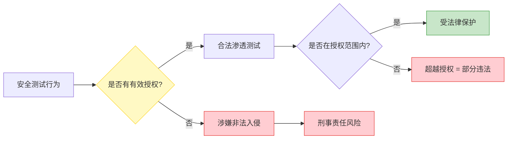
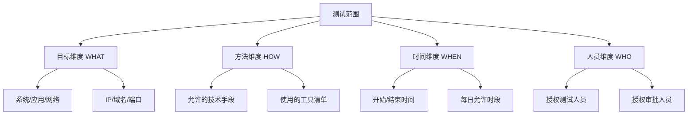
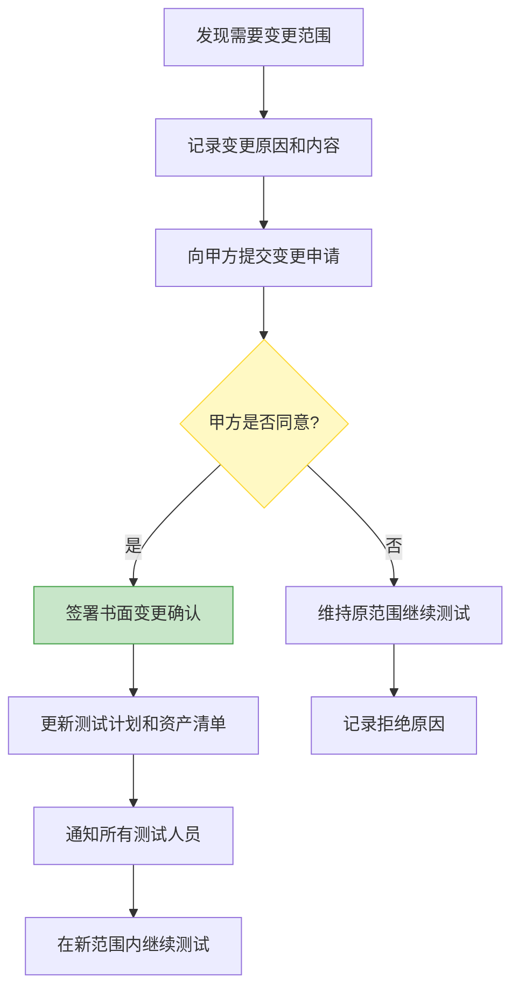

## 3.2 授权管理技巧

授权是合法安全测试与非法入侵之间的唯一法律分界线。没有授权的渗透测试，无论技术多么高超、意图多么善意，在法律上都等同于犯罪。本节从授权的法律本质出发，系统讲解如何获取、管理、记录和存档授权，帮助安全从业者建立一套可审计、可防御的授权管理体系。

### 3.2.1 授权的法律本质

**为什么授权是第一道防线**

从法律角度看，授权是安全测试行为合法性的核心证据。以中国《刑法》第285条"非法侵入计算机信息系统罪"和第286条"破坏计算机信息系统罪"为例，定罪的关键要素是"未经授权或超越授权"。即便测试行为没有造成任何损害，只要缺乏有效授权，就可能构成犯罪。



**授权的三个法律要件**

| 要件 | 含义 | 缺失后果 |
|------|------|----------|
| 主体适格 | 授权人有权代表组织做出授权决定 | 授权无效，测试人员可能被追责 |
| 内容明确 | 测试范围、方法、时间、限制条件必须具体 | 范围争议中法律通常偏向被测试方 |
| 形式合法 | 必须有书面记录，口头授权难以举证 | 发生争议时无法证明授权存在 |

**关键判例启示**

- **Aaron Swartz 案（2011）**：MIT 网络虽开放访问，但未明确授权大规模数据抓取，Swartz 面临最高35年监禁的联邦指控，最终导致悲剧。此案说明"可以访问"不等于"被授权访问"。
- **Weev 案（2010）**：AT&T 网站 URL 参数可预测泄露用户数据，Weev 发现并报告后反被起诉。法院认为即便漏洞存在于公开接口，未授权的数据获取仍然违法。
- **Marcus Hutchins 案（2017）**：即便帮助阻止了 WannaCry 像素攻击，其早年编写的 Kronos 恶意软件仍导致联邦起诉。过去的行为不会因后来的贡献而免责。

这些案例共同说明：**意图和结果都不能替代授权**。

### 3.2.2 获取书面授权

#### 3.2.2.1 授权书的核心要素

一份具有法律效力的安全测试授权书必须包含以下内容，缺少任何一项都可能导致授权在法律争议中被认定为不完整：

**第一部分：主体信息**

```text
授权方（甲方）：
- 公司全称：[与营业执照一致的全称]
- 统一社会信用代码：[18位代码]
- 法定代表人：[姓名]
- 授权签字人：[姓名 + 职务]
  （注：签字人必须有公司内部授权，否则授权可能无效）
- 联系地址：[注册地址]
- 联系电话：[直线电话]

被授权方（乙方）：
- 公司/个人全称：[营业执照或身份证姓名]
- 统一社会信用代码/身份证号：[编号]
- 主要测试人员：[姓名 + 身份证号 + 联系方式]
  （注：只有列在授权书中的人员才有测试权限）
- 资质证明：[CISP-PTE/OSCP等认证编号，如有]
```

**第二部分：授权范围（最关键的部分）**

```text
测试范围：
1. 目标系统清单
   - 系统名称：[具体应用名称]
   - IP地址：[x.x.x.x/xx 或 具体IP列表]
   - 域名：[example.com 及其子域名列表]
   - 端口范围：[如 80, 443, 8080-8090]
   - 系统类型：[Web应用/API/移动端/内网/云环境]

2. 允许的测试方法
   - [✓] 黑盒测试（无凭据）
   - [✓] 灰盒测试（提供测试账号）
   - [ ] 白盒测试（提供源代码/架构文档）
   - [✓] 社会工程学测试（需单独授权）
   - [✓] 物理安全测试（需单独授权）
   - [ ] 拒绝服务测试（默认禁止）
   - [ ] 持久化/后门植入（绝对禁止）

3. 允许使用的工具
   - [✓] Nmap（端口扫描）
   - [✓] Burp Suite（Web测试）
   - [✓] SQLMap（SQL注入检测）
   - [ ] Metasploit（需明确授权）
   - [ ] 自研exploit代码（需提前审查）
```

**第三部分：排除范围（Out of Scope）**

```text
明确排除以下内容：
- 第三方SaaS服务（如AWS/GCP基础设施层面）
- 生产数据库中的真实用户数据
- 物理隔离的安全设备（如HSM硬件安全模块）
- 与目标系统共用网段的其他业务系统
- [根据具体项目补充]

禁止行为：
- 删除或修改生产数据
- 安装持久化后门或木马
- 对系统进行拒绝服务攻击
- 将测试发现的漏洞信息泄露给第三方
- 利用发现的漏洞获取超出测试需要的数据
```

**第四部分：时间与联络**

```text
授权有效期：
- 开始时间：[YYYY-MM-DD HH:MM]
- 结束时间：[YYYY-MM-DD HH:MM]
- 时区：[UTC+8 或其他]
- 允许测试的时段：
  - [ ] 24小时不间断
  - [✓] 仅限工作时间 [09:00-18:00]
  - [✓] 特定窗口期 [如每月第三个周末]

紧急联络机制：
- 甲方技术联系人：[姓名 + 手机 + 邮箱]
- 甲方安全负责人：[姓名 + 手机 + 邮箱]
- 乙方项目负责人：[姓名 + 手机 + 邮箱]
- 应急响应流程：发现严重漏洞后 [15分钟/1小时] 内通知甲方
```

**第五部分：法律条款**

```text
1. 保密条款：乙方对测试过程中获知的所有信息承担保密义务，
   保密期限为授权终止后 [3] 年。
2. 数据处理：测试数据不得带离甲方指定环境，测试结束后
   [7] 日内销毁所有数据副本。
3. 免责条款：在授权范围内的测试行为，甲方承诺不追究乙方
   的法律责任；但因乙方超出授权范围造成的损失由乙方承担。
4. 争议解决：因本授权书引起的争议，双方协商解决；
   协商不成，提交 [甲方/乙方] 所在地法院管辖。
5. 保险条款：乙方应持有不低于 [XX] 万元的职业责任保险。
```

#### 3.2.2.2 授权书签署的注意事项

**签字人资质验证**

仅凭公司公章不代表授权有效。必须确认签字人有权限代表公司做出授权决定：

- 要求提供公司内部的授权委托书或董事会决议
- 验证签字人的身份与公司工商登记信息一致
- 对于大型项目，建议要求法务部门出具专项授权函
- 通过国家企业信用信息公示系统核实公司信息

**授权书的保存与备份**

```text
推荐保存方式：
1. 纸质原件：双方各执一份，签字盖章原件
2. 扫描件：高清PDF，保存在加密存储中
3. 电子签章：使用经认证的电子签章平台（如e签宝、法大大）
4. 区块链存证：将授权书哈希值上链，证明签署时间和内容未被篡改
5. 公证：对于高价值项目，建议对授权书进行公证
```

#### 3.2.2.3 不同场景的授权获取策略

| 场景 | 授权获取难度 | 建议策略 |
|------|-------------|----------|
| 企业委托的渗透测试 | 低 — 甲方主动发起 | 标准流程：需求确认→合同签署→授权书签订 |
| 内部安全团队自测 | 低 — 需要内部审批 | 获取IT/安全部门负责人的书面批准 |
| Bug Bounty 平台 | 中 — 平台规则即授权 | 仔细阅读平台规则，保存规则截图作为证据 |
| 漏洞赏金独立研究 | 高 — 无明确授权方 | 仅在有明确VDP/Bug Bounty计划的目标上测试 |
| 安全研究/学术目的 | 高 — 法律灰色地带 | 使用自建环境或获取明确的书面授权 |
| 第三方系统测试 | 极高 — 涉及多方 | 获取系统所有者+使用者双方的书面授权 |

### 3.2.3 范围管理

#### 3.2.3.1 范围界定的核心原则

范围管理的目标是：**在测试过程中任何时候，都能明确回答"当前操作是否在授权范围内"这个问题**。

**范围的四维模型**



**范围界定的具体操作**

1. **目标资产盘点**：与甲方共同确认所有在测资产，使用资产清单表格记录：

```text
资产编号 | 类型   | IP/域名           | 端口      | 系统描述    | 备注
---------|--------|-------------------|-----------|-------------|------
A-001    | Web    | app.example.com   | 80,443    | 主站Web应用  |
A-002    | API    | api.example.com   | 443       | RESTful API  |
A-003    | 内网   | 192.168.1.0/24    | 全端口    | 办公网段     | 需VPN
A-004    | 云环境 | *.aws.example.com | 按安全组  | AWS生产环境  | 仅读取
```

2. **方法矩阵确认**：对每种测试方法逐一确认是否允许：

| 测试方法 | Web应用 | API | 内网 | 云环境 |
|----------|---------|-----|------|--------|
| 端口扫描 | ✓ | ✓ | ✓ | ✗ |
| 漏洞扫描 | ✓ | ✓ | ✓ | ✗ |
| SQL注入 | ✓ | ✓ | ✗ | ✗ |
| XSS测试 | ✓ | ✗ | ✗ | ✗ |
| 密码爆破 | △ | △ | ✗ | ✗ |
| 社工攻击 | △ | ✗ | △ | ✗ |
| DoS测试 | ✗ | ✗ | ✗ | ✗ |

（✓=允许 △=需要额外审批 ✗=禁止）

#### 3.2.3.2 范围蔓延的防范

范围蔓延（Scope Creep）是渗透测试中最常见的法律风险来源。当测试人员"顺便"测试了不在范围内的系统，或使用了未授权的技术手段，就可能从合法测试滑入违法区域。

**范围蔓延的典型场景**

场景一：测试Web应用时发现了同一网段的其他服务
- 错误做法：直接扫描并测试发现的服务
- 正确做法：记录发现，通知甲方，获取扩展授权后再测试

场景二：发现严重漏洞后想进一步验证影响范围
- 错误做法：利用漏洞深入内网探索
- 正确做法：记录漏洞的初步影响评估，与甲方沟通后决定是否扩大范围

场景三：甲方临时要求增加测试目标
- 错误做法：口头确认后直接开始
- 正确做法：要求甲方出具书面范围变更确认

**范围变更管理流程**



变更确认文件模板：

```text
范围变更确认书

原授权编号：[XXX]
变更编号：[XXX-AMEND-001]
变更日期：[YYYY-MM-DD]

变更内容：
- 新增目标：[具体描述]
- 新增方法：[具体描述]
- 时间调整：[具体描述]

变更原因：
[详细说明为什么需要变更]

风险评估：
[变更可能带来的额外风险]

甲方确认：签字______ 日期______
乙方确认：签字______ 日期______
```

### 3.2.4 文档记录

#### 3.2.4.1 文档记录的重要性

完整的文档记录是安全测试从业者的"护身符"。在发生法律纠纷时，文档是证明测试行为在授权范围内的关键证据。一份完善的文档体系同时也能提升测试质量和效率。

#### 3.2.4.2 测试全生命周期文档体系

**阶段一：测试前文档（Pre-engagement）**

| 文档名称 | 内容要点 | 签署要求 |
|----------|----------|----------|
| 授权书 | 主体、范围、时间、限制、法律条款 | 双方签字盖章 |
| 工作说明书（SOW） | 项目目标、交付物、时间线、费用 | 双方确认 |
| 保密协议（NDA） | 保密范围、期限、违约责任 | 双方签字 |
| 测试计划 | 方法论、工具、时间安排、人员分工 | 甲方审批 |
| 风险评估 | 测试可能造成的业务影响及缓解措施 | 双方确认 |
| 应急预案 | 测试引发故障时的处置流程 | 双方确认 |

**阶段二：测试中文档（Execution）**

实时记录每一项操作是证明"未超出授权范围"的核心手段。推荐使用标准化的日志格式：

```text
[2026-01-15 14:32:07 UTC+8] [TESTER:zhangsan] [TARGET:app.example.com]
操作：使用Nmap进行端口扫描
命令：nmap -sV -sC -T3 app.example.com
结果：发现端口 80(http), 443(https), 8080(http-proxy), 3306(mysql)
备注：3306端口不在原始资产清单中，已通知甲方联系人李某
风险等级：低
证据编号：LOG-20260115-001
```

关键记录项：
- **时间戳**：精确到秒，使用统一时区（推荐UTC+8）
- **操作内容**：执行了什么命令或操作
- **目标**：针对哪个资产
- **结果**：操作产生了什么结果
- **备注**：特殊情况、范围外发现、通知记录
- **证据**：截图、日志文件、输出文件的编号引用

**工具辅助记录**

```bash
# 使用script命令自动记录终端会话
script -a -t 2>timing.log session_$(date +%Y%m%d_%H%M%S).typescript

# Burp Suite 自动保存项目文件
# Project Options -> Misc -> Logging -> 勾选所有日志类型

# 使用tmux记录会话
tmux pipe-pane -o 'cat >> ~/logs/tmux_#S_#W.log'
```

**阶段三：测试后文档（Post-engagement）**

最终报告是一份具有法律效力的文件，需要平衡技术深度和法律安全性：

```text
渗透测试报告结构：

1. 执行摘要（Executive Summary）
   - 项目概述、测试范围、关键发现摘要
   - 整体风险评级（高/中/低）
   - 一页纸给管理层看

2. 测试范围确认
   - 重述授权范围，证明所有测试在范围内
   - 附授权书编号和签署日期

3. 方法论说明
   - 采用的测试标准（OWASP/PTES/NIST）
   - 测试阶段和方法描述

4. 漏洞发现详情
   每个漏洞包含：
   - 漏洞编号和标题
   - 风险等级（CVSS评分）
   - 影响范围
   - 复现步骤（详细到可独立复现）
   - 漏洞证据截图
   - 修复建议（具体可执行）

5. 风险矩阵
   - 漏洞分类统计
   - 风险热力图

6. 附录
   - 完整测试日志
   - 工具输出
   - 参考标准和文献
```

**漏洞报告撰写示例**

```text
漏洞编号：VULN-2026-003
漏洞标题：SQL注入 - 用户登录接口
风险等级：严重（CVSS 9.8）
影响系统：app.example.com

漏洞描述：
用户登录接口的username参数未进行参数化查询，
攻击者可构造恶意SQL语句绕过认证或读取数据库。

复现步骤：
1. 打开 https://app.example.com/login
2. 在用户名输入框输入：admin' OR '1'='1' --
3. 在密码输入框输入任意字符
4. 点击登录按钮

预期结果：登录失败
实际结果：成功登录为管理员账户

影响范围：
- 可绕过所有用户的身份认证
- 可读取数据库中所有数据（含用户密码哈希）
- 可能执行系统命令（取决于数据库权限和配置）

修复建议：
1. 使用参数化查询/预编译语句
2. 实施输入验证和过滤
3. 使用ORM框架替代原生SQL
4. 遵循最小权限原则配置数据库账户

证据：见附件 EVIDENCE-2026-003.png
```

#### 3.2.4.3 文档的保存与销毁

**保存策略**

| 文档类型 | 保存期限 | 保存方式 |
|----------|----------|----------|
| 授权书原件 | 永久 | 纸质保险柜 + 电子加密备份 |
| 测试报告 | 5年以上 | 加密存储，访问权限控制 |
| 测试日志 | 3年以上 | 加密存储，只读保护 |
| 漏洞证据 | 5年以上 | 加密存储，哈希校验 |
| 沟通记录 | 3年以上 | 邮件归档，聊天记录导出 |

**数据销毁**

测试结束后，必须按照授权书约定销毁测试数据：

```bash
# 安全删除测试过程中创建的敏感文件
# Linux: 使用shred覆写3次后删除
shred -vfz -n 3 /path/to/sensitive/data*

# 确认测试账号已停用
# 与甲方确认所有临时创建的测试账户已禁用

# 清理浏览器缓存、Cookies、Burp Suite项目文件
# 或按甲方要求移交给安全团队

# 生成数据销毁确认书，双方签字
```

### 3.2.5 特殊场景的授权管理

#### 3.2.5.1 云环境测试的授权

云环境测试涉及三方——测试人员、甲方、云服务提供商，授权更为复杂：

```text
云环境测试授权检查清单：

□ 甲方对云资源有所有权或管理权
□ 甲方已确认允许对云环境进行安全测试
□ 测试不违反云服务商的可接受使用政策（AUP）
   - AWS: https://aws.amazon.com/aup/
   - Azure: 需要提交渗透测试通知
   - GCP: 允许测试但有特定限制
□ 未测试云服务商的基础设施
□ 未利用云环境对第三方发起攻击
□ 测试产生的额外云费用由甲方承担（已在合同中约定）
```

#### 3.2.5.2 社会工程学测试的授权

社会工程学测试的授权需要特别注意，因为它直接影响真实人员：

```text
社会工程学测试授权的特殊要求：

1. 明确测试对象范围
   - 可以测试哪些部门/人员
   - 哪些高管/关键人员排除在外
   - 是否包含物理社工（如钓鱼邮件、假USB）

2. 明确信息使用边界
   - 测试中收集的个人信息如何处理
   - 测试结束后是否通知被测试人员
   - 成功获取的凭据立即上报，不得保留

3. 明确红线
   - 不得造成被测试人员的财产损失
   - 不得使用恐吓、威胁等手段
   - 不得冒充执法机关或政府机构
   - 测试中发现的个人信息不得用于其他目的

4. 法律合规
   - 确认测试不违反个人信息保护法
   - 确认测试不构成诈骗或冒充
   - 保留甲方HR部门的知情同意
```

#### 3.2.5.3 持续性测试（Retainer）的授权

长期安全服务合同中的授权管理需要定期更新：

```text
持续性测试授权管理要点：

1. 初始授权书设定基准范围
2. 每次测试前发送"测试通知函"确认：
   - 本次测试时间窗口
   - 本次测试目标（从基准范围中选择）
   - 本次测试方法
   - 甲方确认签字/回复
3. 基准范围每季度/半年更新一次
4. 重大系统变更时触发范围评审
5. 授权到期前30天启动续约流程
```

### 3.2.6 常见误区与纠正

**误区一：口头授权就足够了**

- 错误认知："甲方项目经理电话里说了可以测试"
- 正确做法：任何授权都必须有书面记录。口头授权在法律争议中几乎无法举证。即便来不及签正式合同，也至少要通过邮件确认授权内容。

**误区二：Bug Bounty 平台规则等于万能授权**

- 错误认知："HackerOne 上有这个项目的 bounty，所以我什么都可以测"
- 正确做法：仔细阅读项目的详细规则页面，特别注意排除范围（Out of Scope）和禁止行为。平台规则只授权在规则明确允许的范围内测试。

**误区三：发现了漏洞就可以继续深挖**

- 错误认知："我已经进去了，顺便看看里面还有什么"
- 正确做法：验证漏洞存在即可，除非授权明确允许深入利用。利用漏洞获取超出验证目的的数据或权限，可能构成"超越授权"。

**误区四：测试报告是可有可无的**

- 错误认知："测完了跟甲方口头说一下就行"
- 正确做法：正式的测试报告不仅是交付物，更是法律保护文件。没有报告，将来无法证明你的测试行为在授权范围内。

**误区五：授权书签一次就够了**

- 错误认知："半年前签过授权书，现在还能用"
- 正确做法：授权必须在有效期内。系统环境、人员、范围都可能变化，授权书需要定期更新和续签。

### 3.2.7 进阶：建立授权管理知识库

对于经常进行安全测试的团队，建议建立标准化的授权管理知识库：

**授权管理清单（Checklist）**

```text
测试前：
□ 获取正式的书面授权书
□ 验证授权签字人的资质
□ 确认测试范围（资产清单+方法矩阵）
□ 确认排除范围和禁止行为
□ 确认测试时间窗口
□ 确认紧急联络机制
□ 签署保密协议
□ 确认测试人员名单
□ 准备测试日志模板
□ 验证云/第三方服务的测试政策（如适用）

测试中：
□ 每项操作实时记录日志
□ 发现范围外资产立即上报
□ 发现严重漏洞立即通知甲方
□ 需要扩大范围时提交变更申请
□ 定期备份测试日志
□ 保持与甲方的沟通渠道畅通

测试后：
□ 完成并提交正式测试报告
□ 销毁测试数据并获取确认
□ 停用/删除所有测试账号
□ 归档所有文档（授权书、日志、报告）
□ 进行项目复盘和经验总结
□ 更新授权模板和流程（如有改进）
```

**授权文档模板库**

建议维护以下标准模板，根据项目类型快速定制：

- `auth_template_standard.docx` — 标准渗透测试授权书
- `auth_template_cloud.docx` — 云环境测试附加条款
- `auth_template_social_eng.docx` — 社会工程学测试附加条款
- `auth_template_internal.docx` — 内部安全团队自测审批表
- `scope_change_form.docx` — 范围变更确认书
- `test_notification.docx` — 持续性服务测试通知函
- `data_destruction_cert.docx` — 数据销毁确认书
- `final_report_template.docx` — 最终测试报告模板

### 3.2.8 本节小结

授权管理不是安全测试的"行政负担"，而是保护测试人员和整个行业的基础设施。核心要点回顾：

1. **授权是法律底线**：没有授权的测试就是违法，意图和结果都不能替代授权
2. **书面授权是唯一可信形式**：口头授权无法举证，书面文件是法律保护的基础
3. **范围明确才能安全测试**：四维模型（目标/方法/时间/人员）缺一不可
4. **文档记录是护身符**：测试全程实时记录，保存期限不少于3年
5. **范围变更是高风险时刻**：任何变更都必须书面确认，口头同意不算数
6. **特殊场景需要特殊授权**：云环境、社会工程学、持续性服务各有额外要求

> **实战建议**：在开始任何安全测试项目之前，把授权管理清单打印出来，逐项确认。花费30分钟完善授权，可能为你避免数年的法律纠纷。
