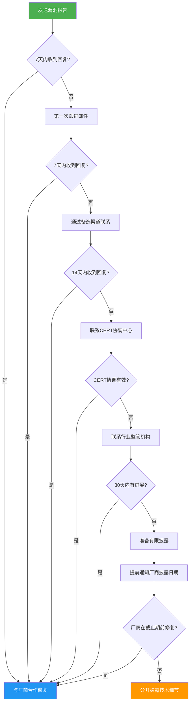

## 3.3 负责任披露的技巧

负责任披露（Responsible Disclosure）是安全研究者发现漏洞后，以合法、有序、可控的方式通知受影响方并给予合理修复时间的过程。它是连接"发现漏洞"与"修复漏洞"之间的桥梁，也是安全研究者保护自身免受法律风险的核心手段。

与之相关的概念有三种：

| 概念 | 含义 | 风险等级 |
|------|------|----------|
| **负责任披露** | 先通知厂商→等待修复→再公开 | 最低 |
| **协调披露（Coordinated Disclosure）** | 与厂商协调时间线后同步公开 | 最低 |
| **完全公开披露（Full Disclosure）** | 发现即公开，不给厂商修复时间 | 最高 |
| **非法披露** | 未获授权即获取漏洞并出售/公开 | 违法 |

本节聚焦第一种——负责任披露——因为它是业界公认的最佳实践，也是绝大多数安全社区、漏洞赏金平台和CERT机构采用的标准流程。

### 3.3.1 为什么负责任披露如此重要

#### 对安全研究者的保护

负责任披露不只是"做好事"，它是安全研究者最实际的法律防火墙。以美国CFAA（计算机欺诈与滥用法案）为例，未经授权访问计算机系统是联邦犯罪。但如果你发现漏洞后立即通知厂商并在合理时间内不公开细节，你的行为更可能被认定为"善意的安全研究"而非"黑客攻击"。

中国《网络安全法》第二十二条和《数据安全法》第三十条也体现了类似精神：发现安全漏洞后应当立即向有关部门报告，不得非法获取、出售、泄露网络数据。

#### 对整个生态系统的保护

一个未修复的公开漏洞意味着攻击者可以在厂商来不及打补丁的情况下发起大规模攻击。2017年Equifax数据泄露事件就是一个反面教训——漏洞在被公开后、厂商补丁发布前被利用，导致1.47亿用户数据泄露。

#### 对厂商的信任建立

负责任披露建立的是长期合作关系。Google Project Zero、微软MSRC、苹果安全团队等顶级厂商都有成熟的漏洞处理流程，它们欢迎负责任的安全研究者，甚至设立名人堂（Hall of Fame）来表彰贡献者。

### 3.3.2 发现漏洞后的完整处理流程

当你在合法研究中发现漏洞时，应严格遵循以下流程。每一步都不可跳过，因为任何一步的缺失都可能带来法律风险或技术失误。

#### 第一步：立即停止并记录

发现漏洞的瞬间，你需要做的第一件事不是进一步验证，而是**停止操作并记录当前状态**。

```bash
# 记录发现时间（UTC时间戳）
date -u "+%Y-%m-%d %H:%M:%S UTC" > /tmp/vuln-discovery-timestamp.txt

# 记录发现时的上下文
cat > /tmp/vuln-discovery-context.md << 'EOF'
# 漏洞发现记录

## 发现时间
[UTC时间戳]

## 发现环境
- 目标域名/IP：
- 测试范围（授权范围）：
- 使用的工具及版本：
- 操作系统环境：

## 发现过程
[你做了什么操作，导致发现了什么异常]

## 当前状态
[漏洞的具体表现，如HTTP响应、错误信息等截图]

## 已停止的操作
[确认你没有进一步测试、没有访问用户数据]
EOF
```

为什么这一步如此关键？因为记录能证明你发现漏洞的时间点，以及你的行为是"无意发现"还是"蓄意探测"。在法律纠纷中，时间线和操作记录是最重要的证据。

#### 第二步：评估漏洞严重程度

在通知厂商之前，你需要对漏洞进行初步评估。这会决定你的报告优先级、联系渠道和沟通策略。

```bash
# 使用CVSS v3.1计算器评估严重程度
# 在线工具：https://www.first.org/cvss/calculator/3.1

# CVSS评分速查表：
# 0.0       - 无（None）
# 0.1 - 3.9 - 低（Low）
# 4.0 - 6.9 - 中（Medium）
# 7.0 - 8.9 - 高（High）
# 9.0 - 10.0 - 严重（Critical）
```

评估维度：

| 维度 | 问题 | 影响 |
|------|------|------|
| **攻击向量** | 是否需要物理访问？是否可远程利用？ | 远程利用 > 本地利用 |
| **攻击复杂度** | 利用条件是否苛刻？ | 无需特殊条件 > 需要用户交互 |
| **权限需求** | 需要认证吗？需要管理员权限吗？ | 无需认证 > 需要高权限 |
| **用户交互** | 需要用户点击/操作吗？ | 无需交互 > 需要社会工程 |
| **影响范围** | 是否影响机密性/完整性/可用性？ | 全部影响 > 单一维度 |
| **数据影响** | 是否能访问敏感数据？ | 个人数据/金融数据 > 一般信息 |

**严重程度决定披露策略：**

- **严重（CVSS 9.0-10.0）**：立即联系厂商安全团队，要求加密通信，不要在任何公开渠道提及
- **高（CVSS 7.0-8.9）**：通过安全联系渠道报告，设定90天披露截止期
- **中（CVSS 4.0-6.9）**：通过标准渠道报告，设定120天披露截止期
- **低（CVSS 0.1-3.9）**：通过标准渠道报告，可给予更多修复时间

#### 第三步：查找联系方式

找到正确的联系渠道是负责任披露中最容易被低估的环节。错误的渠道会导致报告被忽略、延迟处理，甚至引发法律纠纷。

##### 3.3.2.1 RFC 9116 — security.txt 标准

security.txt 是互联网工程任务组（IETF）在RFC 9116中定义的标准，允许网站在固定位置提供安全联系信息。它类似于robots.txt对爬虫的意义——为安全研究者提供一个标准化的"入口"。

```bash
# 查找网站的security.txt（两种标准位置）
curl -sL https://example.com/.well-known/security.txt
curl -sL https://example.com/security.txt

# 使用自动化工具批量查找
# 安装：pip install securitytxt
python3 -c "
import requests
urls = [
    'https://example.com/.well-known/security.txt',
    'https://example.com/security.txt'
]
for url in urls:
    try:
        r = requests.get(url, timeout=10)
        if r.status_code == 200:
            print(f'[FOUND] {url}')
            print(r.text)
            break
    except:
        continue
else:
    print('[NOT FOUND] No security.txt found')
"
```

一个完整的security.txt示例：

```yaml
Contact: mailto:security@example.com
Contact: https://example.com/security/report
Expires: 2027-12-31T00:00:00.000Z
Encryption: https://example.com/pgp-key.txt
Acknowledgments: https://example.com/security/hall-of-fame
Preferred-Languages: en, zh
Canonical: https://example.com/.well-known/security.txt
Policy: https://example.com/security/policy
Hiring: https://example.com/careers/security
```

关键字段解读：

| 字段 | 含义 | 示例 |
|------|------|------|
| `Contact` | 安全联系渠道（邮箱/URL/电话） | `mailto:security@example.com` |
| `Expires` | 此security.txt的有效期 | `2027-12-31T00:00:00.000Z` |
| `Encryption` | 用于加密通信的PGP公钥 | `https://example.com/pgp-key.txt` |
| `Acknowledgments` | 致谢页面（名人堂） | `https://example.com/security/hall-of-fame` |
| `Preferred-Languages` | 偏好语言 | `en, zh` |
| `Policy` | 漏洞披露政策 | `https://example.com/security/policy` |
| `Hiring` | 安全团队招聘信息 | `https://example.com/careers/security` |

##### 3.3.2.2 当security.txt不存在时

很多网站还没有采用security.txt标准。这时你需要多渠道搜索：

```bash
# 1. 尝试常见安全联系邮箱格式
security@example.com
abuse@example.com
sec@example.com
security-alert@example.com

# 2. 查询WHOIS信息获取注册人邮箱
whois example.com | grep -i "email\|contact"

# 3. 查询域名的DNS TXT记录（有些组织会在DNS中记录安全联系信息）
dig TXT example.com +short
dig TXT _security.example.com +short

# 4. 查找漏洞赏金平台
# HackerOne: https://hackerone.com/directory/programs
# Bugcrowd: https://bugcrowd.com/programs
# 补天: https://www.butian.net/
# 漏洞盒子: https://www.vulbox.com/

# 5. 搜索厂商的安全页面
# Google: site:example.com security
# Google: site:example.com "responsible disclosure"
# Google: site:example.com "vulnerability report"

# 6. 社交媒体搜索
# Twitter/X: @example_security
# LinkedIn: "security team" site:example.com
```

##### 3.3.2.3 联系渠道优先级

```text
优先级从高到低：
1. security.txt中的Contact字段
2. 官方漏洞赏金计划（HackerOne/Bugcrowd/补天/漏洞盒子）
3. security@域名 邮箱
4. 安全团队专用表单
5. 官方安全政策页面提供的联系方式
6. WHOIS注册邮箱
7. CERT协调中心
8. 社交媒体私信（最后手段）
```

**为什么不能随便找一个联系方式？** 因为发给错误的人可能导致漏洞信息泄露。你把漏洞详情发给客服邮箱、销售邮箱、甚至公开论坛，都会增加漏洞被恶意利用的风险。

#### 第四步：编写专业的漏洞报告

漏洞报告的质量直接决定了厂商的响应速度和修复效率。一份专业的报告应该让安全工程师在10分钟内理解漏洞、30分钟内复现、1小时内评估影响。

##### 3.3.2.4 漏洞报告模板

```markdown
# 漏洞报告：[产品名] [漏洞类型简述]

## 基本信息

- **报告日期**：2026-06-25
- **发现者**：[你的名字/化名]
- **联系邮箱**：[your-email@example.com]
- **PGP公钥**：[链接或指纹]
- **严重程度**：[Critical/High/Medium/Low] (CVSS 3.1: X.X)
- **漏洞类型**：[CWE分类，如 CWE-79 XSS / CWE-89 SQLi]
- **影响版本**：[受影响的产品版本范围]
- **测试环境**：[操作系统、浏览器、工具版本]

## 漏洞概述

[用2-3句话描述漏洞是什么、影响什么、为什么危险]

示例：在example.com的用户个人资料编辑页面（/profile/edit）中，
"显示名称"字段存在存储型XSS漏洞。攻击者可以通过注入恶意JavaScript
代码，在其他用户查看该资料页面时执行任意脚本，从而窃取会话令牌
或执行账户接管操作。

## 影响分析

### 影响范围
- 受影响的用户数量：[估计值或"所有用户"]
- 受影响的功能模块：[具体URL/功能]
- 数据泄露风险：[可访问的数据类型]

### 攻击场景
[描述一个具体的攻击场景，让非技术人员也能理解]

1. 攻击者注册账户并编辑个人资料
2. 在"显示名称"字段注入恶意代码
3. 其他用户访问攻击者资料页面时触发
4. 恶意脚本将用户的session cookie发送到攻击者服务器

### CVSS 3.1评分
- **攻击向量(AV)**: Network (N)
- **攻击复杂度(AC)**: Low (L)
- **权限要求(PR)**: Low (L)  [需要注册账户]
- **用户交互(UI)**: Required (R)  [需要访问恶意资料页]
- **范围(S)**: Changed (C)
- **机密性(C)**: High (H)
- **完整性(I)**: High (H)
- **可用性(A)**: None (N)
- **总分**: 8.0 (High)

## 复现步骤

### 前置条件
- 已在example.com注册账户
- 使用Chrome 126 / Firefox 127 测试通过

### 步骤

1. 登录example.com账户
2. 访问 https://example.com/profile/edit
3. 在"显示名称"字段中输入以下Payload：
   ```html
   
```text
4. 点击"保存"按钮
5. 使用另一个浏览器/账户访问 https://example.com/profile/[攻击者用户名]
6. 观察浏览器控制台，可以看到恶意请求被发出

### 预期结果
系统应过滤或转义HTML特殊字符，不允许执行脚本

### 实际结果
恶意JavaScript代码被存储并在其他用户浏览时执行

## 证据截图

[附上关键步骤的截图，标注关键信息]
- 截图1：Payload输入界面
- 截图2：恶意代码执行时的浏览器控制台
- 截图3：攻击者服务器接收到的cookie数据（脱敏）

## 建议修复方案

### 短期修复（临时缓解）
- 对"显示名称"字段实施严格的输入验证
- 在输出时对所有用户输入进行HTML实体编码

### 长期修复（根本解决）
- 实施全面的Content Security Policy (CSP)
- 使用HttpOnly和Secure标志保护session cookie
- 部署WAF规则检测常见XSS模式
- 对所有用户输入点实施统一的输入验证和输出编码

### 参考资料
- OWASP XSS Prevention Cheat Sheet: https://cheatsheetseries.owasp.org/cheatsheets/Cross_Site_Scripting_Prevention_Cheat_Sheet.html
- CWE-79: https://cwe.mitre.org/data/definitions/79.html
- CVE参考：[如有相关CVE]

## 声明

本报告基于合法授权的安全研究活动。发现者承诺：
1. 未在授权范围外进行任何测试
2. 未访问、修改或泄露任何用户数据
3. 未利用此漏洞获取任何未授权的利益
4. 在漏洞修复前不会公开任何技术细节
5. 愿意配合厂商的调查和修复工作
```

##### 3.3.2.5 报告质量的评估标准

| 维度 | 差的报告 | 好的报告 |
|------|----------|----------|
| **概述** | "你们网站有XSS" | "在/profile/edit页面的display_name参数存在存储型XSS，影响所有访问该页面的用户" |
| **复现步骤** | "你自己看吧" | 逐步骤、含截图、附Payload、标明环境 |
| **影响分析** | 没有 | 有具体攻击场景、数据影响评估、CVSS评分 |
| **修复建议** | "赶紧修" | 短期缓解+长期根治+参考资料 |
| **态度** | 威胁公开 | 专业、合作、建设性 |

#### 第五步：安全地发送报告

发送报告本身也需要安全意识。漏洞报告中包含的敏感信息如果被中间人截获，后果可能比漏洞本身更严重。

```bash
# 1. 使用PGP加密邮件
# 先获取厂商的安全团队PGP公钥（通常在security.txt的Encryption字段）
curl -sL https://example.com/pgp-key.txt -o vendor-key.asc
gpg --import vendor-key.asc

# 加密报告
gpg --encrypt --armor -r security@example.com vuln-report.md

# 2. 使用安全的文件传输
# 如果厂商提供了安全上传通道，优先使用
# 否则可以使用：
# - Keybase加密文件
# - OnionShare（Tor匿名文件共享）
# - 加密的7z压缩包（AES-256），密码通过单独渠道发送

# 创建加密压缩包
7z a -p -mhe=on encrypted-report.7z vuln-report.md screenshots/
# 密码通过电话或Signal等安全渠道告知对方
```

**通信安全清单：**

- [ ] 使用厂商指定的安全联系渠道
- [ ] 如有PGP公钥，加密邮件内容
- [ ] 不要在邮件标题中包含漏洞细节
- [ ] 截图中的敏感信息（cookie、token）应脱敏
- [ ] 使用专用邮箱发送，不要用个人主邮箱
- [ ] 保留发送记录和时间戳

#### 第六步：等待响应与跟进

发送报告后的等待期是最考验耐心的阶段。不同厂商的响应速度差异很大。

**标准时间线：**

```text
Day 0  : 发送漏洞报告
Day 1-3: 期望收到确认回执（自动回复也算）
Day 7  : 如无任何回复，发送第一次跟进
Day 14 : 如仍无回复，通过备选渠道联系
Day 30 : 如仍无回复，联系CERT协调
Day 60 : 如CERT也无进展，准备有限披露
Day 90 : 最终披露截止期（业界通用的90天规则）
```

**跟进邮件模板：**

```markdown
主题：跟进：[产品名]安全漏洞报告 - [报告编号]

您好，

我于[日期]通过[渠道]提交了一份关于[产品名]的安全漏洞报告
（报告编号：[编号]，严重程度：[Critical/High]）。

至今尚未收到贵团队的确认回复。为确保用户安全，我希望了解：

1. 是否已收到我的报告？
2. 漏洞是否已被确认？
3. 预计的修复时间线是什么？

根据业界通用的90天负责任披露政策，我计划在[日期]前公开
此漏洞的技术细节。如果贵方需要更多时间，请告知，我愿意
在合理范围内协商延长。

感谢您的关注。

[你的名字/化名]
[联系方式]
```

### 3.3.3 漏洞赏金平台的使用

漏洞赏金平台（Bug Bounty）是负责任披露的"升级版"——厂商主动邀请安全研究者寻找漏洞，并提供金钱奖励。使用平台比直接联系厂商更安全，因为平台提供了法律保护、流程规范和争议调解。

#### 主流平台对比

| 平台 | 特点 | 适合对象 | 法律保护 |
|------|------|----------|----------|
| **HackerOne** | 全球最大，厂商最多 | 英语能力好的研究者 | 有标准合同 |
| **Bugcrowd** | 企业级，流程规范 | 专业安全团队 | 有标准合同 |
| **补天（Butian）** | 国内最大，中文支持 | 中国研究者 | 中国法律框架 |
| **漏洞盒子（Vulbox）** | 国内老牌平台 | 中国研究者 | 中国法律框架 |
| **CNVD/CNNVD** | 国家级漏洞库 | 所有研究者 | 国家法律保护 |
| **Intigriti** | 欧洲为主，隐私友好 | 欧洲研究者 | GDPR合规 |
| **YesWeHack** | 欧洲新兴，政府项目多 | 欧洲研究者 | 欧洲法律框架 |

#### 使用平台的流程

```bash
# 1. 注册并完善个人资料
#    - 使用真实信息（平台会保护你的隐私）
#    - 添加PGP公钥
#    - 设置支付方式（银行/PayPal/加密货币）

# 2. 查找目标
#    - 按赏金范围筛选
#    - 查看Scope（授权测试范围）
#    - 阅读Policy（披露政策和规则）
#    - 注意Exclusions（禁止测试的范围）

# 3. 提交报告
#    - 使用平台内置的报告模板
#    - 确保在授权范围内操作
#    - 附上完整的复现步骤和证据

# 4. 跟进和领取赏金
#    - 及时回复厂商的问题
#    - 配合验证修复
#    - 确认赏金支付
```

**平台使用的注意事项：**

- **严格遵守Scope**：只测试授权范围内的目标和功能，超出范围的发现可能不受法律保护
- **阅读细则**：每个厂商的Bug Bounty计划都有特殊规则，例如禁止某些类型的测试（DDoS、社会工程）
- **保留证据**：在平台外备份你的所有测试记录、截图和通信记录
- **不要重复提交**：在提交前搜索平台是否已有类似报告（Duplicate会被拒绝）

### 3.3.4 处理供应商不响应的情况

供应商不响应是最令安全研究者沮丧的情况。你投入时间发现了漏洞，写了专业的报告，却石沉大海。这时你需要冷静、有序地升级处理。

#### 逐步升级策略



#### 中国及国际CERT联系方式

| 机构 | 网站 | 适用场景 |
|------|------|----------|
| **CNCERT/CC（国家互联网应急中心）** | https://www.cert.org.cn | 中国境内网络安全事件 |
| **CNVD（国家信息安全漏洞共享平台）** | https://www.cnvd.org.cn | 中国漏洞报告和协调 |
| **CNNVD（国家信息安全漏洞库）** | https://www.cnnvd.org.cn | 中国漏洞信息收录 |
| **FIRST（事件响应和安全团队论坛）** | https://www.first.org | 国际协调中心 |
| **CERT/CC（卡内基梅隆大学）** | https://www.kb.cert.org/vuls/report/ | 美国及国际漏洞 |
| **JPCERT/CC** | https://www.jpcert.or.jp | 日本相关漏洞 |
| **ENISA** | https://www.enisa.europa.eu | 欧盟相关漏洞 |

#### 联系CERT时的邮件模板

```markdown
主题：漏洞协调请求 - [厂商名] [产品名] [漏洞类型]

尊敬的CERT团队，

我是一名安全研究者，于[日期]发现了[厂商名]旗下[产品名]中的
一个[严重程度]安全漏洞（预估CVSS 3.1: [分数]）。

我已经尝试联系厂商：
- [日期]：通过security@邮箱发送报告，未收到回复
- [日期]：通过[备选渠道]跟进，仍未收到回复
- [日期]：发送第二封跟进邮件，依然无回复

截至目前，厂商已超过[X]天未作任何回应。我请求贵中心协助
协调此漏洞的披露事宜。

漏洞概述（脱敏）：
[简要描述漏洞类型和影响，不要包含具体技术细节]

我愿意：
1. 提供完整的技术报告供贵中心评估
2. 配合贵中心与厂商的协调工作
3. 在合理范围内等待厂商修复

附件：[漏洞报告的加密版本]

[你的名字/化名]
[联系方式]
[PGP公钥指纹]
```

### 3.3.5 披露时间线的行业标准

披露时间线（Disclosure Timeline）是负责任披露中最容易引发争议的部分。厂商希望时间越长越好（确保修复质量），研究者希望时间越短越好（减少暴露风险）。业界经过长期实践，形成了一些共识。

#### 90天规则

Google Project Zero在2010年提出的90天规则已成为行业事实标准：从漏洞报告之日起，厂商有90天时间修复漏洞并发布补丁。90天后，无论是否修复，研究者都有权公开漏洞细节。

```text
时间线示例：

Day 0   : 研究者发现漏洞并报告
Day 1   : 厂商确认收到报告
Day 15  : 厂商确认漏洞有效
Day 60  : 厂商发布修复补丁
Day 61  : 研究者验证修复
Day 75  : 补丁推送到大多数用户
Day 90  : 研究者公开漏洞细节（如未修复则强制披露）

另一种情况：

Day 0   : 研究者发现漏洞并报告
Day 7   : 厂商未回复
Day 14  : 研究者跟进，厂商未回复
Day 30  : 联系CERT协调
Day 60  : CERT协调未果
Day 90  : 研究者公开披露
```

#### 不同严重程度的时间建议

| 严重程度 | CVSS | 初始响应 | 修复期限 | 特殊情况 |
|----------|------|----------|----------|----------|
| **严重** | 9.0-10.0 | 24小时 | 30天 | 在野利用立即披露 |
| **高** | 7.0-8.9 | 3天 | 60天 | — |
| **中** | 4.0-6.9 | 7天 | 90天 | — |
| **低** | 0.1-3.9 | 14天 | 120天 | — |
| **在野利用** | 任意 | 立即 | 7天 | 可能需要更短 |

#### 当厂商要求延长时

厂商可能会以"修复复杂"、"需要更多测试"等理由要求延长披露时间。这时你需要评估：

1. **合理的延期请求**：厂商提供了具体的技术困难说明、明确的修复计划和时间表——可以同意延长30天
2. **不合理的延期请求**：厂商只说"还在处理"，没有具体计划——应拒绝并坚持原定时间线
3. **反复延期**：厂商多次要求延期但始终没有实质进展——应设定最终截止期并明确告知

### 3.3.6 法律风险的识别与规避

负责任披露的最大误区是认为"我是善意的，所以没有法律风险"。现实是，在很多司法管辖区，即使你的意图是好的，某些行为本身也是违法的。

#### 常见的法律风险场景

| 场景 | 风险 | 如何规避 |
|------|------|----------|
| 测试了未授权的目标 | 违反CFAA/网络安全法 | 严格限制在授权范围内 |
| 在生产环境测试导致服务中断 | 可能构成破坏计算机系统 | 只在测试环境操作 |
| 读取了真实的用户数据 | 违反数据保护法 | 看到数据立即停止，不要复制 |
| 漏洞报告中包含了真实数据 | 数据泄露 | 截图脱敏，使用测试数据 |
| 向厂商施压要求赏金 | 可能构成敲诈勒索 | 永远不要以公开漏洞威胁厂商 |
| 在社交媒体透露漏洞细节 | 可能构成间接协助攻击 | 修复前只字不提 |
| 使用了厂商的商标/Logo | 侵犯商标权 | 报告中使用文字描述而非Logo |

#### 关键法律原则

**"善意"不是免责理由。** 在美国、欧盟和中国的法律框架中，"善意"可以作为量刑时的从轻因素，但不能作为完全免责的理由。最安全的做法是：

1. **获取书面授权**：在测试前获取厂商的书面授权（Bug Bounty计划本身就是一种授权）
2. **严格遵守范围**：只测试授权范围内的目标和功能
3. **最小化操作**：只做证明漏洞存在的最少操作
4. **不留痕迹**：不要在目标系统上留下后门、WebShell或其他持久化工具
5. **保护数据**：不访问、复制或存储任何用户数据
6. **及时报告**：发现漏洞后尽快报告，不要"囤积"漏洞

### 3.3.7 特殊场景的披露策略

#### 零日漏洞（0-day）的在野利用

如果你发现一个漏洞正在被积极利用（在野利用），披露策略需要调整：

```text
标准流程：
1. 立即通知受影响厂商（使用加密通信）
2. 同时通知CERT协调中心
3. 如漏洞影响关键基础设施，通知国家网络安全机构
4. 评估是否需要提前公开警告（不包含技术细节）
5. 与厂商和CERT协商加速修复时间线

在中国：通知CNCERT/CC和CNVD
在美国：通知CISA（Cybersecurity and Infrastructure Security Agency）
在欧盟：通知ENISA和相关国家CERT
```

#### 开源软件的漏洞

开源软件的漏洞披露有其特殊性——代码是公开的，任何人都能看到漏洞细节。

```text
开源软件披露流程：
1. 通过安全渠道联系项目维护者
   - 查找项目的SECURITY.md文件
   - 检查GitHub/GitLab的安全通告功能
   - 查看项目的Issue模板中是否有安全报告选项
2. 如项目有安全团队或安全邮箱，优先联系
3. 如维护者不响应，联系项目的上级组织
   - 例如：Apache项目的漏洞联系Apache安全团队
   - Linux内核漏洞联系security@kernel.org
4. 如仍无响应，联系Linux Foundation/OSLF安全团队
5. 准备CVE编号申请
```

#### 供应链漏洞

供应链漏洞（如依赖库中的漏洞）的影响范围可能远超单一厂商。

```text
供应链漏洞披露策略：
1. 首先通知漏洞所在库的维护者
2. 评估有多少上游项目受到影响
3. 与维护者协商修复和发布计划
4. 通知主要的下游项目（如果维护者同意）
5. 在补丁发布前，不要在公开的Issue/PR中提及安全修复
6. CVE编号通常由上游项目申请
```

### 3.3.8 负责任披露的最佳实践清单

#### 报告前

- [ ] 确认你拥有合法的测试授权
- [ ] 确认漏洞是真实存在的（至少复现一次）
- [ ] 评估漏洞严重程度（CVSS评分）
- [ ] 查找厂商的安全联系渠道
- [ ] 阅读厂商的漏洞披露政策
- [ ] 准备好加密通信工具

#### 报告中

- [ ] 使用专业的漏洞报告模板
- [ ] 提供完整的复现步骤
- [ ] 附上脱敏的证据截图
- [ ] 包含CVSS评分和影响分析
- [ ] 提供修复建议
- [ ] 声明你的善意意图

#### 报告后

- [ ] 保留所有通信记录
- [ ] 配合厂商的调查和修复
- [ ] 遵守约定的披露时间线
- [ ] 验证修复是否有效
- [ ] 在公开披露前通知厂商
- [ ] 感谢厂商的合作

### 3.3.9 常见误区与纠正

| 误区 | 正确认知 |
|------|----------|
| "我在做善事，不需要走流程" | 善意不能替代流程，没有流程保护的善意可能变成违法行为 |
| "我找到了漏洞，厂商应该给我钱" | 没有Bug Bounty计划的厂商没有义务支付赏金，不要以公开漏洞相威胁 |
| "漏洞太小了，不值得报告" | 再小的漏洞也可能是攻击链中的一环，所有漏洞都值得报告 |
| "我在社交媒体上提一下，厂商就会重视" | 在公开渠道提及未修复的漏洞会增加被恶意利用的风险 |
| "报告写得简单一点，厂商自己会复现" | 厂商无法复现的报告大概率会被关闭为"无法确认" |
| "我等了7天没人理，就公开了" | 7天远远不够，业界标准是90天 |
| "反正漏洞迟早会被别人发现，我先卖了" | 出售未披露的漏洞在大多数司法管辖区是违法的 |
| "我不需要记录我的测试过程" | 完整的测试记录是你在法律纠纷中最重要的证据 |

### 3.3.10 进阶：建立个人的漏洞披露工作流

对于经常进行安全研究的人，建议建立一套标准化的工作流：

```bash
# 创建漏洞管理目录结构
mkdir -p ~/vuln-disclosure/{templates,reports,evidence,communications}

# 模板目录
~/vuln-disclosure/templates/
├── report-template.md          # 标准漏洞报告模板
├── followup-template.md        # 跟进邮件模板
├── cert-request-template.md    # CERT协调请求模板
├── disclosure-template.md      # 公开披露模板
└── legal-notice-template.md    # 法律声明模板

# 报告目录（按厂商和日期组织）
~/vuln-disclosure/reports/
├── 2026/
│   ├── 2026-01-15_example-com_xss/
│   │   ├── report.md
│   │   ├── evidence/
│   │   ├── communications/
│   │   └── timeline.md
│   └── 2026-03-20_acme-corp_sqli/
│       ├── report.md
│       ├── evidence/
│       ├── communications/
│       └── timeline.md

# 时间线跟踪脚本
cat > ~/vuln-disclosure/track-timeline.sh << 'SCRIPT'
#!/bin/bash
# 漏洞披露时间线追踪
REPORT_DIR="$1"
if [ -z "$REPORT_DIR" ]; then
    echo "Usage: $0 <report-directory>"
    exit 1
fi

TIMELINE_FILE="$REPORT_DIR/timeline.md"
if [ ! -f "$TIMELINE_FILE" ]; then
    echo "# 漏洞披露时间线" > "$TIMELINE_FILE"
    echo "" >> "$TIMELINE_FILE"
    echo "| 日期 | 事件 | 状态 |" >> "$TIMELINE_FILE"
    echo "|------|------|------|" >> "$TIMELINE_FILE"
    echo "| $(date +%Y-%m-%d) | 漏洞发现 | ✅ |" >> "$TIMELINE_FILE"
    echo "时间线已初始化：$TIMELINE_FILE"
else
    echo "当前时间线："
    cat "$TIMELINE_FILE"
fi
SCRIPT
chmod +x ~/vuln-disclosure/track-timeline.sh
```

#### 使用GPG保护通信

```bash
# 生成你的安全研究专用PGP密钥
gpg --full-generate-key
# 选择：RSA and RSA, 4096 bits, 有效期2年

# 导出公钥（上传到密钥服务器或附在报告中）
gpg --armor --export your-email@example.com > ~/vuln-disclosure/my-public-key.asc

# 加密漏洞报告
gpg --encrypt --armor -r vendor-security@example.com report.md

# 签名报告（证明是你写的）
gpg --sign --armor report.md

# 加密+签名
gpg --encrypt --sign --armor -r vendor-security@example.com report.md
```

### 3.3.11 案例研究：成功的负责任披露

#### 案例1：Log4Shell（CVE-2021-44228）

2021年11月24日，阿里云安全团队向Apache基金会报告了Log4j 2中的一个严重RCE漏洞（后来被命名为Log4Shell）。这是一个教科书式的负责任披露案例：

- **Day 0（11月24日）**：阿里云向Apache安全团队报告
- **Day 1-15**：Apache团队确认漏洞并开始修复
- **Day 16（12月9日）**：漏洞细节在小范围泄露，开始被在野利用
- **Day 17（12月10日）**：Apache发布Log4j 2.15.0修复版本
- **后续**：CISA发布紧急指令，全球范围紧急修补

**启示**：即使是最负责任的披露流程，也可能因信息泄露而被打乱。厂商的修复速度至关重要。

#### 案例2：Spectre和Meltdown（2018年）

Google Project Zero团队发现的CPU侧信道漏洞（Spectre/Meltdown）影响几乎所有现代处理器。这个案例展示了多方协调披露的复杂性：

- **2017年6月**：Google通知Intel、AMD、ARM等芯片厂商
- **2017年6月-2018年1月**：长达6个月的多方协调修复
- **2018年1月3日**：原定公开日期前，信息被提前泄露
- **2018年1月4日**：各厂商紧急发布安全公告和补丁

**启示**：涉及多方利益相关者时，协调披露的时间线可能需要数月。提前泄露会打乱所有人的计划。

### 3.3.12 本节总结

负责任披露不是一个"可选项"——它是安全研究者的基本素养。掌握以下核心要点：

1. **流程意识**：发现→验证→报告→跟进→协调→披露，每一步都不可跳过
2. **法律意识**：善意不能替代合法授权，严格遵守授权范围
3. **专业意识**：漏洞报告是你的名片，质量决定厂商的响应速度
4. **时间意识**：90天是行业标准，但不同严重程度需要灵活调整
5. **安全意识**：报告本身也需要安全传输，漏洞信息泄露比漏洞本身更危险
6. **升级意识**：厂商不响应时，有序升级到CERT和行业机构

记住：一个负责任的安全研究者，不仅要有发现漏洞的技术能力，更要有妥善处理漏洞的职业素养。
