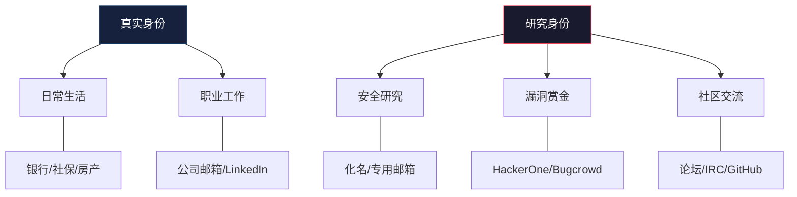
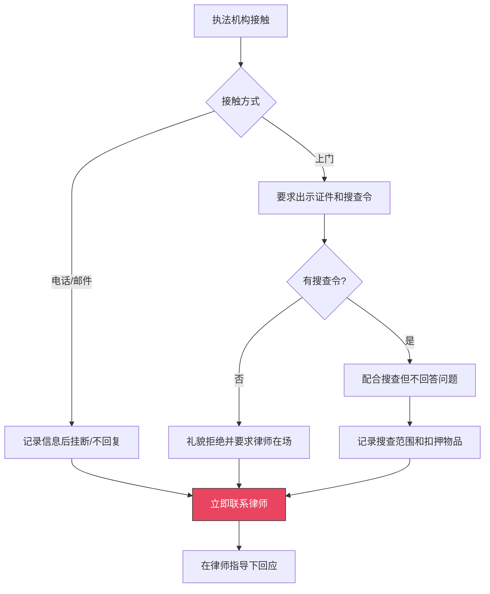

## 3.4 保护自己的技巧

安全研究是一项高风险职业。你面对的不仅是技术层面的挑战，还有法律追诉、人身威胁、职业声誉受损等多重风险。Marcus Hutchins 因少年时期编写的恶意代码在多年后被 FBI 逮捕；Weev 因 AT&T 网站信息泄露案被判刑（后推翻）；无数安全研究员因缺乏自我保护意识而陷入法律纠纷。保护自己不是懦弱，而是职业素养的一部分——只有活着、自由的研究者，才能持续为安全社区做贡献。

本节从法律防护、个人信息隔离、数字安全、通信安全、职业风险管理和应急响应六个维度，系统讲解安全研究者如何在合法研究中保护自己。

### 3.4.1 法律咨询体系

#### 为什么需要法律咨询

安全研究的法律风险具有**滞后性**和**不确定性**。你今天做的事情可能在法律灰色地带，数年后法律解释发生变化，你可能突然面临追诉。Marcus Hutchins 在 2014 年编写的 Kronos 银行木马代码，直到 2017 年才被 FBI 追诉。法律咨询不是出了事才找律师，而是在研究开始前就建立防护网。

#### 如何选择安全领域律师

不是所有律师都能处理网络安全案件。你需要的是**同时懂技术和法律**的专业人士：

| 律师类型 | 适用场景 | 如何找到 |
|---------|---------|---------|
| 网络安全律师 | 刑事辩护、合规咨询 | EFF 律师推荐、CISA 资源库 |
| 知识产权律师 | 漏洞报告版权、DMCA 相关 | 当地律协知识产权委员会 |
| 合同律师 | 渗透测试合同、NDA 审查 | 科技企业法务推荐 |
| 国际法律师 | 跨境研究、跨国漏洞披露 | 国际律师协会（IBA）网络 |

**选择律师的关键标准：**

1. **技术理解力**：律师必须理解什么是 SQL 注入、什么是缓冲区溢出。如果你需要花 30 分钟解释"漏洞"是什么，换一个律师
2. **行业经验**：优先选择处理过 CFAA（美国计算机欺诈和滥用法案）案件或中国《网络安全法》相关案件的律师
3. **响应速度**：安全事件往往需要即时法律响应（如执法机构突击搜查），你的律师必须能在数小时内响应
4. **保密性**：确认律师-客户特权（attorney-client privilege）覆盖范围，特别是跨境场景

#### 法律咨询的时机

不要等到出事才找律师。以下场景必须提前咨询：

- **开始新的安全研究项目前**：确认研究范围是否合法
- **与新客户签订渗透测试合同前**：审查合同条款和免责条款
- **发现高危漏洞后**：在披露前确认法律风险
- **收到执法机构问询后**：不要自行回应，先咨询律师
- **研究涉及跨境目标时**：不同国家法律差异巨大
- **使用漏洞利用代码时**：确认是否触犯反黑客法

#### 法律意见书的获取

律师的口头建议不足以作为法律保护。你应该要求律师提供**书面法律意见书（Legal Opinion Letter）**，包含：

- 研究范围的合法性分析
- 适用法律条款的解读
- 潜在法律风险的评估
- 建议的防护措施
- 律师签名和日期

这份文件在后续可能的法律程序中可以证明你的善意（good faith），表明你已尽合理的法律注意义务。

### 3.4.2 个人信息隔离

#### 身份分离策略

安全研究者的核心防护策略是**身份隔离**——将研究身份与真实身份彻底分开，避免一个身份的暴露导致另一个身份被追溯。



**关键原则：两个身份之间绝不交叉。** 研究身份不使用真实身份的任何信息，真实身份不暴露研究身份的存在。

#### 具体隔离措施

**1. 邮箱隔离**

- 为研究活动注册独立邮箱，使用隐私友好的提供商（如 ProtonMail、Tutanota）
- 不在研究邮箱中绑定真实手机号
- 不用研究邮箱注册任何与真实身份关联的服务
- 使用邮箱别名功能为不同的研究项目创建不同别名

**2. 用户名隔离**

- 为研究活动创建专属用户名，与日常使用的用户名完全不同
- 不要在研究用户名中包含任何可识别个人信息（生日、姓名缩写、所在地）
- 使用密码管理器记录各平台的用户名映射关系
- 定期搜索自己的研究用户名，确认没有与真实身份关联的信息泄露

**3. 支付隔离**

- 漏洞赏金平台的收款账户使用独立银行账户或虚拟卡
- 如果平台支持加密货币支付，考虑使用隐私币（如 Monero）
- 不要在研究相关购买（VPS、域名、工具）中使用与真实身份关联的信用卡

**4. 设备隔离**

- 研究活动使用独立设备或虚拟机，不与日常设备混用
- 研究设备的操作系统账户不使用真实姓名
- 研究设备的浏览器不登录任何与真实身份关联的账号
- 考虑使用 Tails OS 等隐私操作系统进行敏感研究

**5. 网络隔离**

- 研究活动使用 VPN 或 Tor，不使用家庭/公司 IP
- 为研究购买独立 VPS，不使用实名认证的国内服务器
- DNS 查询使用加密 DNS（DoH/DoT），避免 DNS 泄露

#### 数字足迹清理

定期审查并清理你的数字足迹：

1. **搜索引擎搜索**：用 Google、Bing、百度分别搜索你的真名、用户名、邮箱，确认没有意外关联
2. **数据泄露检查**：使用 Have I Been Pwned（haveibeenpwned.com）检查你的邮箱是否出现在数据泄露中
3. **社交图谱分析**：检查你的社交账号的关注者/被关注者是否可能暴露身份关联
4. **元数据清理**：发布研究文档或截图前，清除文件中的元数据（EXIF、作者信息、编辑历史）
5. **代码仓库审查**：检查 Git 提交记录中的邮箱和用户名是否与真实身份关联

```bash
# 检查 Git 全局配置中的身份信息
git config --global user.name
git config --global user.email

# 检查已有仓库中的提交信息
git log --format='%an <%ae>' | sort -u

# 清除图片 EXIF 元数据（发布截图前必须执行）
exiftool -all= screenshot.png

# 使用 mat2 清除文档元数据
mat2 document.pdf
```

### 3.4.3 通信安全

#### 加密通信工具选择

安全研究者之间的通信必须加密。以下是按安全等级排列的通信工具：

| 安全等级 | 工具 | 特点 | 适用场景 |
|---------|------|------|---------|
| 最高 | Signal | 端到端加密、开源、元数据最小化 | 敏感研究讨论 |
| 高 | Matrix (Element) | 端到端加密、去中心化、可自建 | 团队协作 |
| 中高 | Wire | 端到端加密、支持多设备 | 日常通信 |
| 中 | Telegram（秘密聊天） | 端到端加密但仅限秘密聊天模式 | 社区交流 |
| 低 | 微信/QQ | 无端到端加密、内容审查 | 不推荐用于敏感通信 |

#### PGP/GPG 加密

对于邮件和文件加密，PGP 仍然是最可靠的方案：

```bash
# 生成 GPG 密钥对
gpg --full-generate-key

# 导出公钥（发布到公钥服务器或个人网站）
gpg --armor --export your@email.com > public-key.asc

# 导入他人公钥
gpg --import someone-public-key.asc

# 加密文件
gpg --encrypt --recipient recipient@email.com sensitive-file.txt

# 解密文件
gpg --decrypt sensitive-file.txt.gpg > sensitive-file.txt

# 签名文件（证明文件来源和完整性）
gpg --armor --detach-sign research-report.pdf

# 验证签名
gpg --verify research-report.pdf.asc research-report.pdf
```

#### 安全通信实践

1. **确认对方身份**：加密通信的前提是确认对方是本人。通过多渠道（线下见面、视频通话、已验证的电话）交换密钥指纹
2. **前向保密**：使用支持前向保密（Forward Secrecy）的工具，即使长期密钥泄露也不会暴露历史通信
3. **阅后即焚**：讨论高敏感内容时使用阅后即焚功能，但注意对方可能截屏
4. **避免元数据泄露**：即使内容加密，通信的时间、频率、对象也可能泄露信息。Signal 的 Sealed Sender 功能是目前最好的元数据保护方案
5. **离线传递**：极端敏感信息考虑线下当面传递，不经过任何电子设备

### 3.4.4 数字安全基础设施

#### 密码管理

每个安全研究者必须使用密码管理器，并遵循以下原则：

- **唯一密码**：每个服务使用不同的随机生成密码，长度至少 20 字符
- **密码管理器选择**：推荐 Bitwarden（开源、可自建）或 KeePassXC（离线、完全掌控）
- **主密码**：主密码使用 diceware 方法生成的长口令（6 个以上单词），不记录在任何电子设备中
- **双因素认证**：所有支持的服务启用 2FA，优先使用硬件密钥（YubiKey），其次 TOTP，避免短信验证码

```bash
# 使用 pwgen 生成随机密码
pwgen -s 20 1

# 使用 diceware 生成口令（需要安装 diceware 包）
diceware -n 6

# 使用 oathtool 生成 TOTP 验证码（备份方案）
oathtool --totp -b "BASE32SECRET"
```

#### 设备安全

**操作系统加固：**

- 全盘加密（Linux: LUKS, macOS: FileVault, Windows: BitLocker）
- 启用安全启动（Secure Boot）
- 及时安装安全更新，内核更新不超过 48 小时
- 禁用不需要的服务和端口
- 配置防火墙，默认拒绝所有入站连接

**虚拟化隔离：**

```bash
# 使用 libvirt/KVM 创建隔离的研究虚拟机
virt-install --name research-vm \
  --ram 8192 \
  --disk size=100 \
  --os-variant ubuntu22.04 \
  --network network=default \
  --graphics spice \
  --cdrom ubuntu-22.04.iso

# 使用 Qubes OS 进行极致隔离（推荐高级用户）
# Qubes 将不同活动隔离在不同虚拟机中
# 工作 -> work VM, 研究 -> research VM, 浏览 -> untrusted VM
```

**移动设备安全：**

- 使用 GrapheneOS（Pixel 手机）或 CalyxOS 替代原厂系统
- 安装应用只从 F-Droid（开源应用）或经验证的来源
- 禁用蓝牙、NFC 等不需要的近场通信
- 使用 Mullvad 或 IVPN 的移动 VPN

#### 备份策略

采用 3-2-1 备份原则：3 份副本、2 种介质、1 份异地存储。备份本身也需要加密：

```bash
# 使用 restic 加密备份（推荐）
restic -r /path/to/backup init
restic -r /path/to/backup backup /path/to/research

# 异步上传到加密云存储
restic -r s3:s3.amazonaws.com/my-bucket backup /path/to/research

# 使用 age 加密单个文件
age -p -o secrets.txt.age secrets.txt
age -d secrets.txt.age > secrets.txt
```

### 3.4.5 职业风险管理

#### 渗透测试合同保护

渗透测试合同是你法律保护的第一道防线。一份合格的渗透测试合同必须包含：

1. **授权范围（Scope of Work）**
   - 明确列出被测试的 IP 地址、域名、应用
   - 明确列出允许的测试类型（黑盒/白盒/灰盒）
   - 明确列出禁止的测试行为（如拒绝服务测试、社会工程）
   - 明确测试时间窗口

2. **免责条款（Hold Harmless Clause）**
   - 客户对因测试导致的系统中断不追究测试方责任
   - 测试方对测试过程中发现的安全问题不承担责任（责任在客户方）

3. **保密条款（NDA）**
   - 双方对测试结果保密
   - 例外情况：法律强制要求、客户同意披露

4. **数据处理条款**
   - 测试过程中获取的数据如何处理（销毁/归还/保留）
   - 数据保留期限
   - 数据泄露时的责任划分

5. **法律管辖**
   - 明确适用法律和争议解决方式
   - 跨境测试时特别重要

#### 漏洞赏金平台的风险管理

参与漏洞赏金计划时的自我保护：

- **仔细阅读平台规则**：每个平台（HackerOne、Bugcrowd、补天、漏洞盒子）的规则不同，特别是关于测试范围和禁止行为的规定
- **截图保存证据**：在测试过程中持续截图，证明你的行为在授权范围内
- **及时报告**：发现漏洞后立即报告，不要扩大测试范围
- **不要下载敏感数据**：证明漏洞存在即可（如返回数据库表名），不要提取实际用户数据
- **保留通信记录**：与平台和厂商的所有沟通记录都要保存

#### 社会工程测试的特殊风险

社会工程测试（如钓鱼模拟）涉及额外风险：

- 必须获得组织最高管理层的书面授权
- 不要针对个人，而是测试组织的整体安全意识
- 测试结束后立即向所有被测试人员进行安全培训
- 不要在测试中使用真实的紧急事件（如冒充家人出事）
- 保留完整的过程记录，证明测试的专业性和善意

### 3.4.6 保险保护

#### 职业责任保险（Professional Liability Insurance）

职业责任保险（也称 E&O 保险）覆盖因专业服务导致的第三方索赔：

- **适用场景**：渗透测试中因工具故障导致客户系统损坏、安全评估报告中的遗漏导致客户损失
- **保额建议**：独立研究者至少 100 万元人民币，安全公司至少 1000 万元
- **注意事项**：确认保单覆盖网络安全相关索赔，部分传统 E&O 保单排除网络风险

#### 网络安全保险（Cyber Insurance）

网络安全保险覆盖因网络事件导致的直接损失和第三方索赔：

- **覆盖范围**：数据泄露响应费用、法律诉讼费用、监管罚款、业务中断损失
- **对研究者的意义**：如果你的测试环境被入侵导致研究数据泄露，网络安全保险可以覆盖响应费用
- **中国市场**：众安保险、平安保险等均有网络安全保险产品

#### 法律费用保险（Legal Expense Insurance）

法律费用保险专门覆盖法律诉讼的费用：

- **覆盖范围**：律师费、诉讼费、调查费用
- **对研究者的意义**：如果因安全研究被调查或起诉，法律费用保险可以覆盖高昂的律师费用
- **获取方式**：部分职业责任保险包含法律费用覆盖，也可以单独购买

### 3.4.7 应急响应计划

#### 执法机构接触应对

如果执法机构找上门，保持冷静并遵循以下流程：



**关键原则：**

1. **不要恐慌**：执法接触不等于有罪，许多安全研究者的调查最终不了了之
2. **不要自行解释**：你对执法人员说的每一句话都可能成为证据。保持沉默不是认罪，而是行使合法权利
3. **不要销毁证据**：销毁证据本身就是犯罪行为（妨碍司法公正），即使你原本的行为是合法的
4. **记录一切**：记录执法人员的姓名、编号、机构、时间、搜查范围
5. **第一时间联系律师**：在律师到场前，不签署任何文件，不回答任何问题

#### 数据紧急处置

如果面临设备被扣押的风险，提前准备好应急方案：

- **全盘加密**：确保所有设备全盘加密，密码不要记录在任何地方
- **紧急销毁**：了解设备的紧急数据销毁方法，但仅在律师确认必要时使用
- **远程擦除**：配置设备的远程擦除功能（如 Find My iPhone 的远程擦除、Android 的 Find My Device）
- **云端备份**：确保关键研究数据有加密的云端备份，设备被扣押后不影响工作

**重要提醒**：数据销毁的合法性因司法管辖区而异。在美国，销毁潜在证据可能构成妨碍司法公正。在中国，销毁电子证据可能构成毁灭证据罪。在执行任何数据销毁操作前，务必咨询律师。

#### 声誉管理

安全研究者的职业声誉是最宝贵的资产。一旦受损，恢复极为困难：

1. **主动建立声誉**：通过负责任的漏洞披露、技术博客、社区贡献建立正面声誉
2. **声誉监控**：定期搜索你的名字和用户名，及时发现负面信息
3. **危机沟通**：如果发生误解或争议，第一时间通过官方渠道沟通，不要在社交媒体上争论
4. **法律手段**：面对诽谤或不实指控，及时通过法律手段维护声誉

### 3.4.8 心理健康保护

安全研究者经常面临独特的心理压力：持续暴露在网络犯罪和黑暗内容中、面临法律不确定性、孤独的独立工作模式。心理健康保护不是可选项，而是职业可持续性的基础。

- **建立支持网络**：加入安全社区（如 OWASP 本地分会、DEF CON Groups），与同行建立联系
- **设定边界**：明确工作时间和休息时间，不要 24/7 处于研究状态
- **寻求专业帮助**：如果出现焦虑、失眠、过度警觉等症状，及时寻求心理咨询
- **参与社区活动**：参加安全会议（如 KCon、XCon、HITB），线下交流可以缓解孤独感

### 3.4.9 常见误区与纠正

| 误区 | 真实情况 | 正确做法 |
|------|---------|---------|
| "我用化名就安全了" | 化名可以被关联分析去匿名化，IP、写作风格、技术栈都可能暴露身份 | 结合身份隔离、网络匿名、写作风格变换等多层防护 |
| "法律风险只存在于美国" | 中国《刑法》第285/286条、《网络安全法》同样严厉，且执法案例逐年增加 | 了解研究所在地和目标所在地的法律，咨询专业律师 |
| "漏洞赏金平台测试没有风险" | 平台规则有灰色地带，超出授权范围的测试仍可能被追诉 | 严格遵守平台规则，保存所有测试记录和截图 |
| "我只是发现漏洞，没有利用" | 部分司法管辖区中，仅未授权访问本身就构成犯罪 | 在发现漏洞的瞬间停止操作，不获取任何超出必要的信息 |
| "删掉日志就没人知道了" | 云平台有独立审计日志，WAF/IDS 有实时告警，你的操作可能已经被记录 | 假设所有操作都被记录，在授权范围内行事 |
| "安全公司会保护我" | 公司的法律保护仅限于工作职责范围内的行为，个人研究不受保护 | 个人研究同样需要法律咨询和风险评估 |
| "技术上可行就合法" | 技术能力和法律授权是两个完全不同的维度 | 先确认法律授权，再评估技术可行性 |

### 3.4.10 综合防护检查清单

以下是安全研究者在开始任何研究项目前的防护检查清单：

**研究前准备：**
- [ ] 咨询专业律师，获取书面法律意见
- [ ] 确认研究目标在授权范围内
- [ ] 检查研究身份与真实身份的隔离状态
- [ ] 确认 VPN/Tor 正常工作
- [ ] 准备好应急联系人（律师、信任的同事）
- [ ] 确认设备全盘加密已启用
- [ ] 确认备份已加密并存储在安全位置

**研究过程中：**
- [ ] 持续截图保存测试证据
- [ ] 不超出授权范围
- [ ] 不下载超出必要的敏感数据
- [ ] 使用加密通信与团队沟通
- [ ] 定期检查是否有身份关联风险

**研究完成后：**
- [ ] 按合同约定处理测试数据
- [ ] 清除测试过程中创建的临时文件
- [ ] 更新漏洞报告和测试记录
- [ ] 归档所有通信记录和证据
- [ ] 复盘并更新个人防护策略
