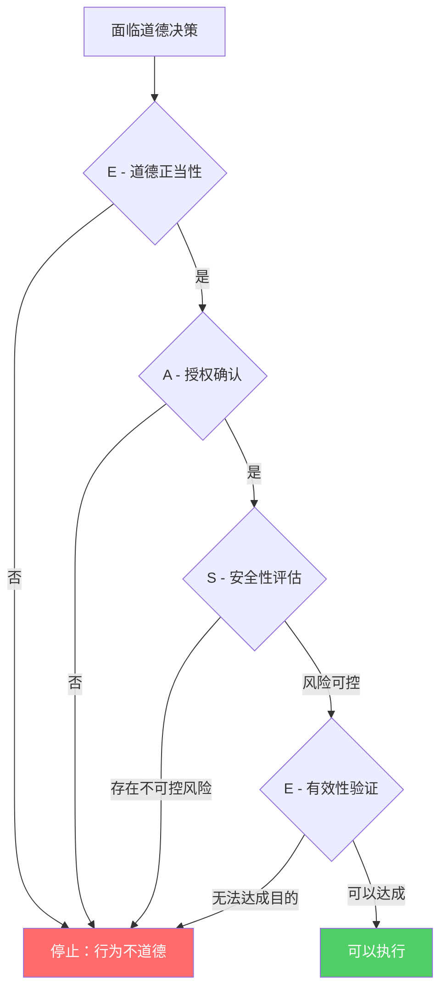
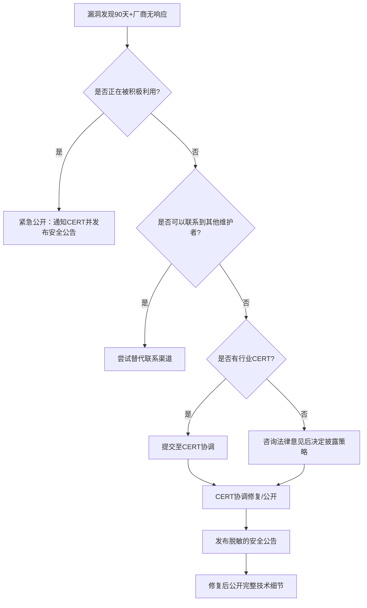
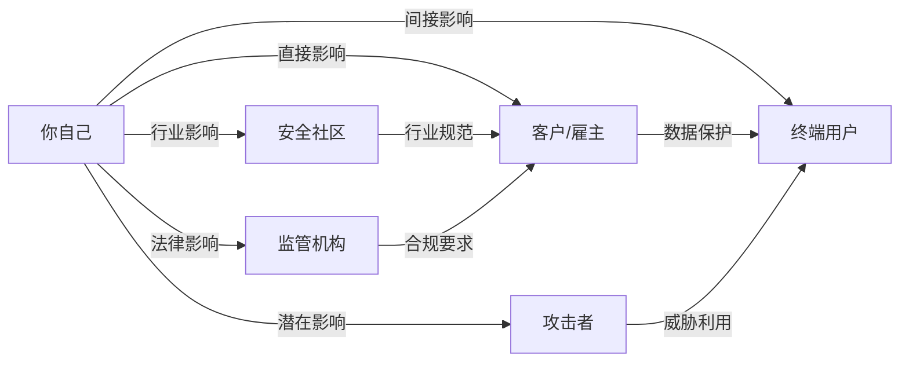

## 3.5 道德决策框架

安全从业者掌握的技术能力具有双面性：同样的渗透测试技能可以保护企业免受攻击，也可以被用于非法入侵。当法律条文无法覆盖所有灰色地带时，道德决策框架就成为安全从业者的"内心罗盘"——它帮助你在复杂的现实场景中做出经得起事后审视的专业判断。

本节将系统介绍适用于网络安全领域的道德决策模型，从理论根基到实操工具，从常见困境到高级场景，帮助你建立一套可复用的决策体系。

### 3.5.1 为什么需要道德决策框架

#### 法律的滞后性与灰色地带

网络安全领域的法律往往滞后于技术发展。以中国为例，《网络安全法》于2017年才正式实施，而物联网安全、AI安全等新兴领域的法律规范至今仍在完善中。这意味着在很多场景下，安全从业者无法简单地"查法条做决定"。

法律的灰色地带包括：

- **漏洞扫描的边界**：对公网IP进行端口扫描在某些司法管辖区属于合法行为，在另一些地区可能被视为"未授权访问"的前奏。2021年，中国某安全研究员因对政府网站进行未授权漏洞扫描被行政拘留，尽管其初衷是善意的。
- **安全工具的开发与传播**：Metasploit、Cobalt Strike等工具既是合法的渗透测试平台，也是攻击者常用的武器。开发者和使用者的"意图"如何界定？
- **数据泄露后的处置**：安全研究员在暗网发现某企业数据泄露，是否应该通知该企业？如果通知过程中接触到泄露数据本身，是否构成"非法获取个人信息"？

#### 职业声誉的长期价值

安全行业是一个高度依赖信任的圈子。一次不道德的决策——哪怕在当时看来收益巨大——可能永久损害你的职业声誉。Kevin Mitnick在1990年代因非法入侵被捕后，花了数十年时间才重建为合法的安全顾问。而那些始终坚守道德底线的研究员，如Google Project Zero团队成员，则建立了持久的行业影响力。

#### 道德决策的心理学基础

人类的道德决策容易受到多种认知偏差的影响：

| 偏差类型 | 表现形式 | 安全场景中的例子 |
|---------|---------|----------------|
| 确认偏差 | 只关注支持自己行为的证据 | "这个系统漏洞百出，我扫描一下是为了帮助他们" |
| 从众效应 | "大家都在做"的合理化 | "其他研究员都在公开披露零日漏洞" |
| 锚定效应 | 被第一个获得的信息主导判断 | "客户说了随便测"——忽略了合同的具体范围限制 |
| 自利偏差 | 将成功归因于自身，将失败归因于外部 | "我发现了漏洞说明我能力强"，"被起诉是因为法律不完善" |
| 滑坡效应 | 小的越界逐步升级 | 从"看看端口"到"试试密码"到"提取数据" |

一个结构化的道德决策框架可以有效对冲这些认知偏差，帮助你做出更理性的判断。

### 3.5.2 EASE框架：安全从业者的快速决策工具

EASE框架是专为安全从业者设计的四维道德评估模型，适用于需要快速做出判断的日常场景。



#### 四个维度详解

**E — Ethical（道德正当性）**

评估核心问题：这个行为在道德上是否正当？

判断标准包括：

- **目的正当性**：你的行为目的是保护还是破坏？是帮助客户提升安全性，还是满足个人好奇心？
- **手段正当性**：即使目的正确，手段是否也经得起道德审视？例如，为了证明某个系统的安全性不足而实际入侵它，即使最终结果是"帮助"了该系统，手段仍然是不正当的。
- **比例原则**：行为的影响是否与其目的相称？一个简单的SQL注入验证不需要dump整个数据库。
- **普遍化检验**：如果所有安全从业者都这样做，行业会变得更好还是更坏？这是一个基于康德伦理学的检验方法。

**A — Authorized（授权确认）**

评估核心问题：我是否获得了执行此行为的充分授权？

授权确认的层级：

| 授权层级 | 要求 | 验证方式 |
|---------|------|---------|
| 法律授权 | 行为不违反适用法律 | 法律顾问审查 |
| 组织授权 | 获得组织的正式许可 | 书面合同、授权书 |
| 技术授权 | 获得目标系统的测试权限 | 书面授权、测试账户 |
| 个人授权 | 相关利益方知情同意 | 知情同意书 |

常见授权误区：

- "口头承诺"不算授权——必须有书面记录
- "老板说可以"不等于组织授权——需要正式的授权链
- "在Bug Bounty范围内"只覆盖该项目声明的范围——超出范围的部分仍需额外授权
- 授权不等于免责——即使有授权，超出合理范围的行为仍然可能违法

**S — Safe（安全性评估）**

评估核心问题：这个行为是否会对相关方造成不可控的伤害？

安全评估的维度：

- **数据安全**：是否可能泄露、损坏或丢失数据？
- **系统安全**：是否可能造成系统中断或性能下降？
- **人身安全**：是否可能影响到物理世界的人身安全？（如医疗系统、交通系统）
- **商业安全**：是否可能造成不可挽回的商业损失？
- **法律安全**：行为人自身是否面临法律风险？

**E — Effective（有效性验证）**

评估核心问题：这个行为是否是达成目的的最优路径？

有效性评估意味着：

- 是否有更安全、更合规的替代方案？
- 行为的投入产出比是否合理？
- 是否可能产生预期之外的副作用？

#### EASE框架的应用示例

**场景：你发现了一个严重的远程代码执行漏洞，但厂商已经三个月没有回应你的报告。**

逐项评估：

1. **道德正当性**：公开漏洞的目的是推动修复，保护用户安全——目的正当。但在厂商未修复的情况下直接公开利用代码，可能导致大规模攻击——手段存在争议。
2. **授权确认**：你在Bug Bounty范围内发现了这个漏洞，但公开披露超出了该项目的范围——授权不充分。
3. **安全性评估**：如果漏洞细节被恶意利用，可能影响数百万用户——风险不可控。
4. **有效性验证**：联系CERT、在安全会议上以脱敏方式讨论、向行业监管机构报告，都是更安全的替代方案。

**结论**：不应直接公开漏洞细节。应通过CERT等第三方协调，或在90天期限后再做决策。

### 3.5.3 多层次伦理学理论基础

EASE框架是实用工具，但要真正理解道德决策的底层逻辑，你需要了解几种主要的伦理学理论。这些理论并非互相排斥，而是在不同场景下提供不同的分析视角。

#### 后果主义（Consequentialism）

核心思想：行为的道德性由其结果决定。最广为人知的分支是功利主义（Utilitarianism）——追求"最大多数人的最大幸福"。

在安全领域的应用：

- **漏洞披露决策**：公开漏洞可能短期内增加被攻击的风险，但长期来看推动了整个生态的安全改进。后果主义者会权衡短期危害与长期收益。
- **渗透测试范围**：如果扩大测试范围可能发现更多漏洞，从而保护更多用户，后果主义者可能倾向于支持扩大范围——但这需要与授权原则平衡。

局限性：

- 结果难以准确预测，尤其在复杂的网络环境中
- 可能为"少数人的牺牲"提供合理化借口
- 忽视了行为本身的道德属性

#### 义务论（Deontology）

核心思想：行为的道德性由行为本身决定，而非其结果。代表人物康德提出了"绝对命令"——只按照你同时愿意它成为普遍法则的准则行动。

在安全领域的应用：

- **"未授权访问永远是错的"**——无论你的目的多么正当，未经许可进入他人系统都是不道德的。
- **合同义务**：一旦签署了保密协议，无论发现的信息多么重要，泄露都违反了义务论原则。

局限性：

- 过于僵化，难以应对复杂的灰色地带
- 当多个义务发生冲突时缺乏优先级指导

#### 美德伦理学（Virtue Ethics）

核心思想：关注行为者的品格而非具体行为。一个有美德的人自然会做出正确的决定。

安全从业者应培养的核心美德：

- **诚实（Honesty）**：如实报告发现，不夸大也不隐瞒
- **审慎（Prudence）**：在行动前充分评估风险
- **勇气（Courage）**：在必要时做出艰难的正确决定，如报告同事的不当行为
- **正义（Justice）**：公平对待所有利益相关方
- **节制（Temperance）**：不被技术好奇心或经济利益驱动越界

#### 关怀伦理学（Ethics of Care）

核心思想：道德决策应考虑人际关系和对他人的关怀。在安全领域，这意味着：

- 渗透测试不仅要关注技术结果，还要关注对运维团队、终端用户的影响
- 漏洞披露要考虑普通用户的安全，而非仅仅追求"技术正确"
- 同事之间的安全问题要优先通过建设性方式解决，而非"告密"

#### 理论综合应用

现实中的道德决策往往需要综合多种理论：

```plaintext
道德决策的多理论分析流程：

1. 义务论检验 → 行为本身是否违反了明确的义务？
   ├── 是 → 停止，寻找不违反义务的替代方案
   └── 否 → 进入下一步

2. 后果主义分析 → 行为的预期结果如何？
   ├── 利远大于弊 → 支持
   ├── 利弊相当 → 谨慎
   └── 弊大于利 → 反对

3. 美德伦理审视 → 一个正直的安全从业者会怎么做？
   ├── 这个决定是否符合我想要成为的那种人？
   └── 我是否愿意公开为这个决定辩护？

4. 关怀伦理补充 → 所有相关方的利益是否被考虑到？
   ├── 最脆弱的受影响方是否被保护？
   └── 是否存在被忽视的利益相关者？
```

### 3.5.4 常见道德困境的深度分析

#### 困境1：发现严重漏洞但供应商不响应

**场景描述**：你在对某开源项目进行安全审计时发现了一个远程代码执行漏洞（CVSS 9.8）。你通过邮件、GitHub Issue和安全邮箱三种方式联系了维护团队，但三个月过去没有任何回应。此时你注意到该软件被数千家企业使用，包括多家金融机构。

**利益相关方分析**：

| 利益相关方 | 立场 | 关注点 |
|-----------|------|--------|
| 你（研究员） | 负责任披露 | 职业声誉、道德义务 |
| 软件维护者 | 可能已放弃维护 | 无明确立场 |
| 使用该软件的企业 | 不知情 | 业务连续性、数据安全 |
| 终端用户 | 不知情 | 个人数据安全 |
| 潜在攻击者 | 可能已独立发现漏洞 | 利用机会 |

**决策树**：



**推荐行动方案**：

1. **第1-30天**：通过所有可用渠道联系厂商，保留所有联系记录
2. **第31-60天**：联系相关CERT（如CNVD、CVE），请求协调
3. **第61-90天**：咨询法律顾问，准备公开披露策略
4. **第90天后**：如果仍未修复，发布安全公告——先描述漏洞影响和缓解措施，延迟发布完整PoC
5. **第120天后**：如果厂商仍无作为，公开完整技术细节

**关键原则**：始终以保护用户为目标，而非惩罚厂商。

#### 困境2：朋友的系统存在安全问题

**场景描述**：你的朋友经营一家小型电商网站。你在帮忙时无意中发现网站存在SQL注入漏洞，且数据库中存储了数万条用户的信用卡信息。朋友请你"帮忙修一下"。

**为什么这个场景特别棘手**：

- 友情关系模糊了专业边界
- "帮忙"的性质缺乏正式定义
- 涉及真实的用户隐私数据
- 可能涉及PCI DSS等合规要求

**正确的处理方式**：

1. **立即停止进一步操作**——不要继续探索数据库，不要复制任何数据
2. **明确告知风险**——用非技术语言向朋友解释漏洞的严重性
3. **建议寻求专业帮助**——推荐有资质的安全公司进行正式的渗透测试和修复
4. **提供文档化建议**——写一份简短的安全建议文档，但不要包含具体的漏洞利用细节
5. **不亲自修复**——除非你们签订了正式的服务合同

**常见错误做法**：

- ❌ 在没有书面授权的情况下"帮忙"测试其他漏洞
- ❌ 下载数据库来"证明"漏洞严重性
- ❌ 在社交媒体上讨论朋友网站的安全问题
- ❌ 认为"反正是帮忙"就不需要正式流程

#### 困境3：在工作中发现超出范围的漏洞

**场景描述**：你受雇对某公司的Web应用进行渗透测试，合同范围限于`app.example.com`。在测试过程中，你发现同一内网中的`admin.example.com`存在严重的未授权访问漏洞，可以访问到整个客户数据库。

**道德张力**：

- 你有义务报告发现的安全问题
- 但测试`admin.example.com`超出了合同范围
- 继续测试可能违反合同条款
- 不报告可能让用户持续暴露在风险中

**正确的处理方式**：

1. **立即停止对admin.example.com的进一步测试**
2. **记录发现过程**——精确记录你是如何在正常测试流程中发现这个问题的
3. **向客户报告**——通过正式渠道报告发现，明确说明这超出了测试范围
4. **获取额外授权**——如果客户希望你继续测试，签订合同补充协议
5. **在报告中标注**——将此发现标记为"范围外发现"，并说明发现过程

**文档模板**：

```plaintext
范围外发现报告

发现日期：YYYY-MM-DD
发现人：[你的姓名]
原始测试范围：app.example.com
范围外目标：admin.example.com

发现过程：
在对app.example.com进行[具体测试类型]测试时，
通过[具体途径]发现了admin.example.com的[具体问题类型]。

初步评估：
- 影响范围：[描述]
- 严重程度：[高/中/低]
- 建议：[初步建议]

行动建议：
建议客户立即对admin.example.com进行安全评估。
如需纳入本次测试范围，请签署合同补充协议。
```

#### 困境4：发现同事的不当行为

**场景描述**：你发现团队中的一名同事在客户授权范围之外进行了额外的测试，并且下载了客户的敏感数据到个人设备上。

**道德考量**：

- 你有义务保护客户利益和公司声誉
- 举报同事可能影响团队关系
- 不举报可能导致更严重的后果
- 同事可能有合理的解释

**决策框架**：

```plaintext
发现同事不当行为的处理流程：

1. 确认事实
   ├── 收集客观证据（日志、截图等）
   ├── 避免主观臆断
   └── 评估证据的充分性

2. 评估严重性
   ├── 轻微违规（如流程不当）→ 私下沟通
   ├── 明显违规（如超出范围测试）→ 向主管报告
   └── 严重违规（如数据窃取）→ 立即向管理层和法务报告

3. 选择报告渠道
   ├── 直接主管
   ├── 合规部门
   ├── 举报热线（如有）
   └── 法律顾问

4. 保护自身
   ├── 保留证据副本
   ├── 记录报告过程
   └── 了解举报人保护政策
```

**中国法律背景**：根据《网络安全法》第22条和第42条，网络运营者应当采取技术措施和其他必要措施确保其收集的个人信息安全。如果发现同事的行为可能导致数据泄露而不上报，公司可能面临法律责任，而你作为知情者也可能承担连带责任。

#### 困境5：漏洞赏金中的灰色地带

**场景描述**：你在参与某平台的漏洞赏金计划时，发现了一个漏洞，其影响远超项目描述的范围。该漏洞可能导致平台所有用户的数据泄露，而非仅仅是项目描述的"信息泄露"。如果按照项目的奖金标准，你只能获得几千元奖金，但这个漏洞的市场价值可能高达数十万元。

**道德分析**：

- 漏洞赏金计划的奖金标准可能无法反映漏洞的真实价值
- 厂商在设定赏金范围时可能存在低估
- 在黑市出售漏洞是违法行为
- 坚持负责任披露可能在经济上"吃亏"

**正确的处理方式**：

1. **如实报告漏洞的完整影响范围**——不要为了保持在赏金范围内而隐瞒更严重的影响
2. **提供详细的漏洞分析**——帮助厂商理解为什么这个漏洞比他们预期的更严重
3. **与厂商协商赏金**——大多数负责任的厂商会根据漏洞的实际影响调整赏金
4. **保留沟通记录**——所有关于漏洞范围和赏金的讨论都应有书面记录
5. **必要时寻求法律建议**——如果厂商拒绝承认漏洞的严重性

#### 困境6：AI辅助安全研究的道德边界

**场景描述**：你使用AI工具自动化发现了大量漏洞，但AI在测试过程中可能访问了未经授权的系统。

**新兴挑战**：

- AI工具的行为可能超出你的预期控制
- 自动化测试的规模可能远超人工测试
- AI生成的漏洞利用代码可能被滥用
- 责任归属问题——AI的行为由谁负责？

**道德准则**：

1. **人在回路原则（Human-in-the-Loop）**：AI工具的每个测试动作都应经过人类审核，至少在首次使用时如此
2. **范围约束**：为AI工具设置严格的目标范围和技术白名单
3. **监控与审计**：记录AI工具的所有行为，确保可追溯
4. **渐进式信任**：从低风险目标开始验证AI工具的行为，逐步扩大范围
5. **责任承担**：作为AI工具的使用者，你对其所有行为承担全部责任

### 3.5.5 道德决策的结构化流程

当面对复杂的道德困境时，仅靠EASE框架可能不够。以下是一个更完整的结构化决策流程：

#### 第一阶段：事实收集

```plaintext
事实收集清单：

□ 我了解完整的事实情况吗？
□ 我是否遗漏了某些利益相关方？
□ 时间压力有多大？是否可以花更多时间收集信息？
□ 是否有可靠的第三方信息来源可以验证？
□ 类似情况的历史案例是什么？
□ 适用的法律和合同条款是什么？
□ 我的组织对此类情况的政策是什么？
```

#### 第二阶段：利益相关方映射

绘制利益相关方图谱，明确每个角色的立场、关切和影响力：



#### 第三阶段：选项生成与评估

列出所有可能的行动方案，对每个方案进行EASE评估：

| 选项 | 道德(E) | 授权(A) | 安全(S) | 有效(E) | 综合评分 |
|------|---------|---------|---------|---------|---------|
| 选项A | ✅ | ✅ | ⚠️ | ✅ | 可接受（需缓解安全风险） |
| 选项B | ✅ | ❌ | ✅ | ✅ | 不可接受（授权不足） |
| 选项C | ⚠️ | ✅ | ✅ | ❌ | 不推荐（效果存疑） |

#### 第四阶段：决策与文档化

做出决策后，记录以下内容：

```plaintext
道德决策记录模板

决策ID：ETH-YYYY-NNNN
日期：YYYY-MM-DD
决策者：[姓名]

1. 情境描述
   [简述面临的情况]

2. 识别的利益相关方
   [列出所有相关方]

3. 评估的选项
   [列出考虑过的所有选项]

4. 选择的方案
   [说明最终选择及其理由]

5. EASE评估结果
   E（道德）：[评估结果]
   A（授权）：[评估结果]
   S（安全）：[评估结果]
   E（有效）：[评估结果]

6. 预期风险与缓解措施
   [说明已知风险和应对方案]

7. 回顾日期
   [设定回顾此决策的日期]
```

#### 第五阶段：事后回顾

在决策执行后进行回顾，评估：

- 决策的结果是否符合预期？
- 是否有未预见的后果？
- 如果重新面对同样的情况，会做出不同的决定吗？
- 这个案例的经验教训是否应该纳入团队知识库？

### 3.5.6 组织层面的道德决策机制

个人的道德判断力固然重要，但组织层面的制度保障同样不可或缺。

#### 建立道德委员会

对于安全公司和团队，建议建立道德委员会：

- **组成**：由资深安全从业者、法律顾问、HR代表组成
- **职能**：处理道德投诉、审核争议决策、制定道德政策
- **权限**：有权暂停可疑项目，要求额外审查
- **保密**：委员会讨论内容严格保密，保护举报人

#### 道德培训体系

定期开展道德培训，内容包括：

- 典型道德案例分析（至少每季度一次）
- 法律法规更新培训
- 角色扮演演练——模拟道德困境场景
- 邀请行业专家分享经验

#### 举报人保护机制

建立安全的举报渠道：

- 匿名举报邮箱或热线
- 举报后的保护措施（禁止报复）
- 举报处理的透明度（定期发布处理结果摘要）
- 对恶意举报的界定和处理

### 3.5.7 常见误区与纠正

#### 误区1："目的正当就可以不择手段"

**错误表现**：认为只要是为了"发现漏洞""保护用户"，就可以不遵守授权协议、超出测试范围、或未经授权访问系统。

**纠正**：目的的正当性不能为不正当的手段提供道德豁免。安全行业的公信力建立在"我们也遵守规则"的基础上。如果你为了"证明安全"而破坏了规则，你已经破坏了你试图保护的东西。

#### 误区2："大家都在做所以没问题"

**错误表现**：看到其他研究员在未授权的情况下扫描、测试，认为这是行业常态，自己也可以。

**纠正**：行业的灰色地带不代表合法。历史上有大量案例证明，"大家都这么做"不能作为法律辩护。更重要的是，你无法确认"大家"是否真的在这么做，还是只是少数人的高调行为。

#### 误区3："反正是厂商的错"

**错误表现**：认为厂商没有及时修复漏洞，所以自己有权公开漏洞细节或利用代码。

**纠正**：厂商的疏忽不能成为你违反负责任披露原则的理由。你对自身行为的道德责任独立于厂商的行为。Google Project Zero的90天政策之所以有效，是因为它平衡了各方利益，而非单方面施压。

#### 误区4："法律没有禁止就是可以的"

**错误表现**：以法律的灰色地带作为行动依据，认为只要不违法就可以做。

**纠正**：道德标准应高于法律底线。法律是社会的最低要求，而职业道德是行业的最高追求。很多在法律上"不违法"的行为，在道德上仍然可能是不正当的。例如，在暗网上购买泄露的凭证进行"研究"，虽然不一定构成犯罪，但在道德上是不可接受的。

#### 误区5："技术好奇心可以作为借口"

**错误表现**：以"学习""研究""好奇心"为名，对未授权目标进行技术探索。

**纠正**：好奇心是安全从业者的美德，但必须在合法和道德的框架内满足。搭建自己的实验环境、参与CTF比赛、使用合法的漏洞赏金平台——这些都是将好奇心转化为正向价值的途径。对未授权目标的好奇心探索，本质上是对他人权益的漠视。

### 3.5.8 进阶：跨文化与国际化场景的道德考量

随着安全研究的国际化，你可能面临跨文化的道德挑战。

#### 不同文化对"善意入侵"的态度

| 文化/地区 | 对"善意入侵"的态度 | 典型反应 |
|----------|-------------------|---------|
| 美国 | 相对宽容，有较强的Bug Bounty文化 | 邀请加入赏金计划 |
| 欧盟 | 严格，强调数据保护（GDPR） | 可能触发数据泄露通知义务 |
| 中国 | 严格管控，强调授权 | 未经授权测试可能面临行政处罚 |
| 日本 | 保守，重视秩序 | 可能被视为不友好的行为 |

#### 国际协作中的道德标准

当你参与跨国安全项目时：

1. **遵守最严格的标准**——当不同国家的法律和道德标准冲突时，选择最严格的那个
2. **了解当地文化**——在某些文化中，直接报告安全问题可能被视为"打脸"，需要更委婉的方式
3. **使用通用的道德框架**——EASE框架在不同文化中都适用
4. **咨询当地专家**——在不确定时，咨询当地的安全社区或法律专家

### 3.5.9 道德决策的自我评估清单

定期使用以下清单评估自己的道德决策能力：

```plaintext
道德决策能力自评（每月一次）

基础能力：
□ 我是否了解适用的法律法规？
□ 我是否知道所在组织的道德政策？
□ 我是否有可以咨询的法律和道德顾问？
□ 我是否记录了所有重要的道德决策？

决策质量：
□ 我最近的道德决策是否经过了结构化分析？
□ 我是否考虑了所有利益相关方？
□ 我是否在决策前咨询了他人意见？
□ 我是否对自己的决策进行了事后回顾？

持续改进：
□ 我是否关注了行业的最新道德讨论？
□ 我是否参加了相关的培训或讨论？
□ 我是否从他人的道德困境中学到了东西？
□ 我的道德决策能力是否在持续提升？

预警信号（以下任何一项为"是"都需要警惕）：
□ 我是否发现自己经常在"灰色地带"操作？
□ 我是否开始觉得"规则不适用于我"？
□ 我是否因为"方便"而跳过了某些流程？
□ 我是否隐瞒了某些行为不让同事知道？
```

### 3.5.10 本节小结

道德决策框架不是束缚你行动的枷锁，而是帮助你在复杂环境中做出正确判断的工具。本节的核心要点：

1. **法律滞后于技术**——在法律灰色地带，道德框架是你的指南针
2. **EASE框架**——道德正当性、授权确认、安全性评估、有效性验证，四维缺一不可
3. **多种伦理学理论互相补充**——后果主义、义务论、美德伦理学、关怀伦理学各有侧重
4. **结构化流程对抗认知偏差**——事实收集、利益相关方映射、选项评估、决策文档化、事后回顾
5. **组织层面的制度保障**——道德委员会、培训体系、举报人保护
6. **警惕常见误区**——"目的正当""大家都在做""法律没禁止"都不是充分理由
7. **跨文化场景需要额外审慎**——遵守最严格的标准，咨询当地专家

记住：你的每一个道德决策都在定义你是谁——不仅作为安全从业者，更是作为一个人。当面临选择时，问自己："我是否愿意让全世界都知道我做了这个决定？"如果答案是否定的，那就不要做。
