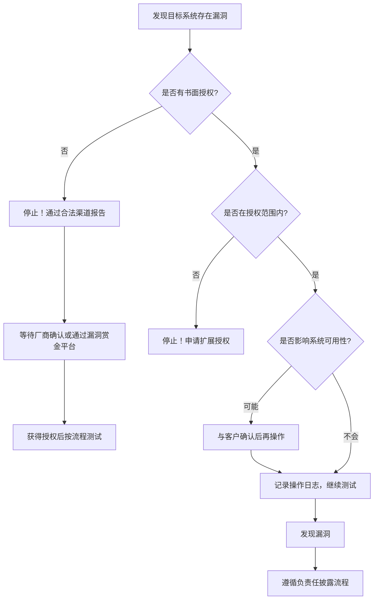
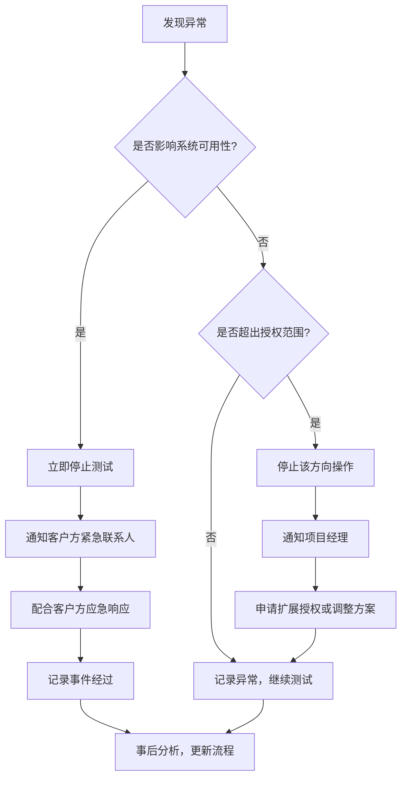
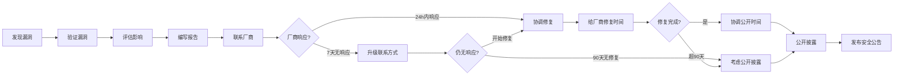

## 3.6 建立合规的安全研究流程

安全研究不是"想测就测"的随意行为，而是一项需要严谨流程支撑的专业活动。缺乏合规流程的安全研究，轻则导致测试结果无效、客户关系破裂，重则面临民事赔偿甚至刑事追诉。本节从个人研究到团队协作、从合同签订到漏洞披露、从风险规避到职业发展，系统性地构建一套可落地的合规安全研究体系。

### 3.6.1 为什么需要合规流程

很多技术能力强的安全研究者栽在流程上——不是因为技术不行，而是因为没有建立合规意识。以下是几个真实教训：

| 案例 | 问题 | 后果 | 根因 |
|------|------|------|------|
| Weev案（2010） | 未授权访问AT&T服务器获取用户数据 | 被判入狱（后上诉推翻） | 缺乏书面授权，未控制数据获取范围 |
| Marcus Hutchins案（2017） | 开发Kronos银行木马 | 被捕，认罪后获缓刑 | 安全工具与恶意软件界限模糊 |
| Aaron Swartz案（2011） | 大量下载学术论文 | 面临35年监禁，最终自杀 | 未获得明确授权，超出合理使用范围 |
| 国内某白帽子案例（2019） | 未授权测试某政务系统 | 被行政拘留 | 认为"发现漏洞是做好事" |

**合规流程的核心价值：**

1. **法律保护**：书面授权、范围明确、过程记录是最有效的法律防线
2. **专业声誉**：规范的流程体现专业度，是获取客户信任的基础
3. **结果有效性**：有记录、可复现的测试结果才具有说服力
4. **风险控制**：将"不可控的未知风险"转化为"可控的已知风险"



### 3.6.2 个人安全研究者的合规清单

个人研究者往往是最容易忽视流程的群体——没有团队监督，没有客户约束，容易在"反正没人知道"的心态下越界。以下清单不是摆设，而是你的法律护身符。

#### 启动前检查（Go/No-Go决策）

每一项必须打勾才能开始，任何一项存疑都应暂停并寻求法律建议：

**授权与范围：**

- [ ] 我是否获得了目标系统所有者的**书面授权**（邮件、合同、授权书均可，但必须是书面形式）
- [ ] 授权是否明确了**测试范围**（IP段、域名、应用列表）
- [ ] 授权是否明确了**测试时间窗口**（开始时间和结束时间）
- [ ] 授权是否明确了**禁止操作**（如禁止DoS、禁止访问生产数据库）
- [ ] 我是否确认目标系统**不在关键基础设施清单**中（未经批准不得测试）

**法律合规：**

- [ ] 我是否了解测试所在司法管辖区的适用法律（中国《刑法》第285/286条、《网络安全法》、《数据安全法》）
- [ ] 我是否了解目标数据的合规要求（个人信息需遵循《个人信息保护法》）
- [ ] 必要时我是否咨询了律师

**技术准备：**

- [ ] 我是否在**隔离环境**中测试了工具和攻击脚本
- [ ] 我是否配置了**日志记录**（所有操作可追溯）
- [ ] 我是否准备了**应急方案**（误操作后如何快速恢复）
- [ ] 我是否使用了**专用测试账户**（不使用个人真实身份）

**数据保护：**

- [ ] 我是否承诺**不下载、存储或转发**测试中接触到的真实用户数据
- [ ] 我是否使用了**加密通道**进行测试
- [ ] 测试结束后我是否知道如何**安全销毁**测试数据

#### 测试中记录模板

```markdown
## 测试日志 - [日期]

### 基本信息
- 测试目标：[IP/域名/应用]
- 授权编号：[合同号或邮件引用]
- 测试时间：[HH:MM - HH:MM]
- 测试环境：[VPN节点/测试机IP]

### 操作记录
| 时间 | 操作 | 工具 | 目标 | 结果 | 备注 |
|------|------|------|------|------|------|
| HH:MM | 端口扫描 | nmap | 192.168.1.0/24 | 发现80/443/22 | 在授权范围内 |
| HH:MM | ... | ... | ... | ... | ... |

### 发现摘要
- 漏洞编号：VULN-001
- 严重程度：[高/中/低]
- 简要描述：[一句话]
```

#### 测试后收尾检查

- [ ] 所有测试数据已加密存储或按约定销毁
- [ ] 测试账户已注销或权限已回收
- [ ] 测试报告已按约定格式编写并提交
- [ ] 所有操作日志已归档（建议保留至少2年）
- [ ] 授权文件已安全存储

### 3.6.3 团队安全研究流程

团队协作相比个人研究，增加了沟通协调、权限管理、质量控制等维度。一个成熟的渗透测试团队应遵循以下四阶段流程。

#### 阶段一：准备阶段（Pre-engagement）

这是最关键但最容易被压缩的阶段。准备不充分会导致测试过程中频繁中断、越权操作或遗漏关键目标。

**1. 项目启动会议**

参与方：项目经理、技术负责人、客户方IT负责人、客户方法务（可选）

议程：
- 明确测试目标（是要评估整体安全态势，还是针对特定系统进行深入测试）
- 确认测试范围（资产清单、排除清单）
- 确认测试时间窗口（避开业务高峰期、财务结算期）
- 确认紧急联系人和沟通机制
- 确认测试环境类型（生产环境需额外谨慎）
- 确认是否存在蜜罐/IDS/IPS系统

**2. 授权文件签署**

必须包含以下要素（详见3.6.5安全合同关键条款）：
- 测试范围和边界
- 允许和禁止的测试技术
- 数据处理约定
- 免责和责任限制
- 争议解决机制

**3. 技术准备**

```yaml
# 测试环境配置清单
testing_environment:
  network:
    - vpn_config: "已配置并测试连通性"
    - dns_servers: "使用指定DNS，避免DNS泄露"
    - proxy_chains: "配置多层代理，保护测试者真实IP"
  
  tools:
    - scanners: "Nessus/OpenVAS 已更新至最新插件"
    - exploit_framework: "Metasploit 已配置数据库"
    - web_testing: "Burp Suite Professional 已配置上游代理"
    - password_tools: "Hashcat/John 已准备字典"
    - custom_scripts: "在隔离环境中已测试通过"
  
  logging:
    - screen_recording: "OBS/Loom 已配置"
    - terminal_logging: "script -a 或 asciinema"
    - burp_logging: "项目文件自动保存"
    - notes: "CherryTree/Notion 模板已创建"
  
  emergency:
    - rollback_plan: "误操作后30分钟内恢复"
    - escalation_contact: "客户方紧急联系人电话"
    - legal_contact: "公司法务或外部律师联系方式"
```

**4. 任务分配**

根据团队成员的技能特长进行分工：

| 角色 | 职责 | 人数 |
|------|------|------|
| 项目经理 | 客户沟通、进度管控、报告审核 | 1 |
| 技术负责人 | 方案设计、技术决策、质量把关 | 1 |
| 网络测试工程师 | 网络层测试、基础设施评估 | 1-2 |
| Web应用测试工程师 | Web漏洞测试、API测试 | 1-2 |
| 社会工程测试员 | 钓鱼邮件、物理渗透（如授权） | 0-1 |
| 报告编写员 | 整理发现、编写报告 | 1（可兼任） |

#### 阶段二：执行阶段（Execution）

**执行原则：**

1. **严格按范围操作**：授权范围是硬边界，任何越界行为都可能构成违法
2. **记录一切**：每个操作、每个发现、每个异常都要记录，这既是质量保障也是法律保护
3. **及时沟通**：发现高危漏洞、误操作、系统异常时，立即通知项目经理和客户方联系人
4. **控制影响**：避免影响系统可用性，DoS类测试必须在客户明确授权下进行
5. **保护数据**：接触到的敏感数据不做截图、不存储、不传播

**每日站会模板（15分钟）：**

```markdown
## 每日进度同步 - [日期]

### 昨日完成
- [成员A] 完成192.168.1.0/24网段扫描，发现3台主机开放SSH
- [成员B] 完成Web应用认证模块测试，发现用户名枚举

### 今日计划
- [成员A] 对3台主机进行SSH弱口令测试
- [成员B] 测试Web应用授权模块（IDOR、越权）

### 阻塞问题
- 目标192.168.1.50的SSH连接超时，需要确认是否为蜜罐

### 发现摘要
- 新增高危：SSH弱口令（user:root, pass:123456）
- 新增中危：用户名枚举
```

**异常处理流程：**



#### 阶段三：收尾阶段（Reporting）

**报告结构：**

```markdown
# 渗透测试报告

## 1. 执行摘要（Executive Summary）
- 测试概述（时间、范围、方法）
- 风险评级总览（高/中/低各多少项）
- 核心发现总结（3-5条）
- 总体安全评级

## 2. 测试范围与方法
- 授权范围说明
- 测试方法论（OWASP/PTES/OSSTMM）
- 使用的工具清单
- 测试时间线

## 3. 漏洞详情
### 3.1 [漏洞标题]
- **严重程度**：高危/中危/低危
- **CVSS评分**：8.5（举例）
- **影响范围**：[具体系统/模块]
- **漏洞描述**：[技术细节]
- **复现步骤**：[详细步骤，含截图]
- **影响分析**：[可能造成的危害]
- **修复建议**：[具体可操作的修复方案]
- **参考资料**：[CWE/CVE链接]

## 4. 风险评估矩阵
[漏洞按影响程度和利用难度排列的矩阵图]

## 5. 修复优先级建议
[按紧急程度排序的修复路线图]

## 6. 附录
- A. 完整漏洞列表
- B. 测试工具配置
- C. 授权文件副本
- D. 测试日志摘要
```

**报告交付注意事项：**

- 报告必须通过加密渠道传输（PGP加密或加密压缩包）
- 报告应标注密级（如"机密-仅限客户方安全团队查阅"）
- 交付后确认客户方已收到并可以正常解密
- 约定报告的使用范围（客户是否可以转发给第三方审计）

#### 阶段四：后续阶段（Post-engagement）

1. **漏洞修复跟进**：与客户约定复测时间，验证漏洞是否真正修复
2. **经验总结会**：团队内部复盘，识别流程改进点
3. **知识库更新**：将新发现的漏洞模式、工具用法沉淀到团队知识库
4. **数据销毁**：按合同约定销毁测试数据，保留销毁证明
5. **客户满意度反馈**：收集客户对测试过程和报告质量的反馈

### 3.6.4 渗透测试合规检查清单

以下清单覆盖渗透测试全生命周期的合规要点。建议打印出来，每个项目开始前逐项检查。

#### 法律合规检查

| 检查项 | 标准 | 常见问题 |
|--------|------|----------|
| 书面授权 | 合同或授权书，含签章 | 仅口头授权、微信聊天记录不构成充分授权 |
| 测试范围 | 明确的IP段/域名/应用清单 | 范围模糊导致误测第三方系统 |
| 测试时间 | 明确的开始和结束时间 | 测试结束后继续操作构成未授权访问 |
| 法律适用 | 确认适用法律和司法管辖区 | 跨境测试需同时遵守多地法律 |
| 禁止事项 | 明确列出禁止的测试类型 | 未明确DoS测试是否允许 |

#### 客户沟通检查

| 检查项 | 标准 | 常见问题 |
|--------|------|----------|
| 保密协议 | 测试前签署NDA | 测试过程中无意泄露客户信息 |
| 紧急联系人 | 7×24小时可联系的联系人 | 发现紧急漏洞后无法及时通知 |
| 环境确认 | 明确测试的是生产环境还是测试环境 | 在生产环境执行破坏性测试 |
| 业务影响 | 了解客户的业务连续性要求 | 在促销高峰期进行DoS测试 |
| 工具限制 | 确认哪些工具可以/不可以使用 | 使用自动化扫描器导致生产系统宕机 |

#### 测试执行检查

| 检查项 | 标准 | 常见问题 |
|--------|------|----------|
| 范围控制 | 所有操作在授权范围内 | 扫描范围超出授权IP段 |
| 活动记录 | 所有操作有时间戳记录 | 无法证明操作是否在授权时间内 |
| 数据保护 | 不下载/存储真实用户数据 | 截图中包含真实用户敏感信息 |
| 系统影响 | 不影响系统可用性 | SQL注入测试导致数据库锁死 |
| 高危报告 | 发现高危漏洞立即报告 | 等到报告阶段才告知客户 |

### 3.6.5 安全合同关键条款

安全服务合同是保护双方权益的法律文件。以下条款不是"有了就行"的装饰，而是每一个都可能在纠纷中决定成败的关键。

#### 1. 服务范围条款

这是合同中最核心的条款，必须尽可能详细：

```text
服务范围示例条款：

本合同项下的安全评估服务范围如下：

1.1 测试目标
    - 主域名：example.com 及其所有子域名
    - IP范围：192.168.1.0/24, 10.0.0.0/16
    - 移动应用：Example App v2.0（Android & iOS）
    - API接口：api.example.com/v1/*, api.example.com/v2/*

1.2 允许的测试技术
    - 网络扫描和枚举
    - Web应用漏洞测试（OWASP Top 10）
    - 认证和授权测试
    - API安全测试
    - 社会工程（仅限钓鱼邮件，需提前48小时通知）

1.3 禁止的测试技术
    - 拒绝服务攻击（DoS/DDoS）
    - 物理入侵
    - 针对员工的电话诈骗
    - 删除或修改生产数据
    - 安装持久化后门

1.4 排除范围
    - 第三方托管的系统（如CDN、云服务商）
    - 合作伙伴系统
    - 已知存在漏洞但客户明确排除的系统

1.5 测试时间
    - 开始时间：2026年7月1日 09:00 CST
    - 结束时间：2026年7月15日 18:00 CST
    - 非工作时间测试：需提前24小时获得批准
```

#### 2. 授权条款

```text
授权条款核心要素：

2.1 授权范围：甲方授权乙方在本合同约定的范围内进行安全测试。

2.2 授权期限：授权自测试开始时间起至测试结束时间止。测试结束后，
    乙方不得继续对甲方系统进行任何形式的访问或测试。

2.3 授权限制：
    - 乙方不得将授权转让给第三方
    - 乙方不得超出合同约定的测试范围
    - 乙方不得利用测试过程中发现的漏洞进行非测试目的的操作

2.4 授权撤销：甲方有权在任何时候以书面形式撤销授权。撤销后，
    乙方必须立即停止所有测试活动，并在48小时内归还或销毁所有测试数据。
```

#### 3. 数据处理条款

这是近年来越来越重要的条款，尤其在《数据安全法》和《个人信息保护法》实施后：

```text
数据处理条款：

3.1 数据收集：乙方在测试过程中可能接触到的数据，仅限于完成测试
    所必需的最小范围。

3.2 数据存储：测试数据必须加密存储，加密标准不低于AES-256。
    存储设备必须有物理和逻辑访问控制。

3.3 数据保留：测试报告保留期限为[2年]。原始测试数据（日志、截图等）
    在报告交付后[30天]内销毁。

3.4 数据泄露：如发生测试数据泄露事件，乙方必须在[24小时]内通知甲方，
    并配合甲方进行事件调查和处置。

3.5 个人信息：乙方承诺不在测试数据中保留任何可识别个人身份的信息。
    如不可避免地接触到个人信息，应立即脱敏处理。
```

#### 4. 免责与责任限制条款

```text
免责条款：

4.1 乙方在严格遵守本合同约定的测试范围和方法的前提下，对测试过程中
    造成的系统故障不承担责任，但应及时配合甲方恢复。

4.2 因甲方系统自身缺陷导致的数据丢失或服务中断，乙方不承担责任。

4.3 乙方的累计赔偿责任不超过本合同服务费用的[100%]。

4.4 甲方应确保测试范围内的系统已进行数据备份。因甲方未备份导致的
    数据丢失，乙方不承担责任。

4.5 建议甲方购买网络安全保险，以覆盖测试期间可能产生的额外风险。
```

### 3.6.6 负责任漏洞披露流程

负责任的漏洞披露（Responsible Disclosure）是安全研究者的核心道德义务。它不仅保护用户安全，也保护研究者自身的法律安全。

#### 完整披露流程



#### 漏洞报告编写规范

一份好的漏洞报告应该让厂商的工程师能在不联系你的情况下独立复现漏洞：

```markdown
# 漏洞报告

## 基本信息
- **报告ID**: VULN-2026-001
- **发现日期**: 2026-06-25
- **报告日期**: 2026-06-25
- **严重程度**: 高危（CVSS 8.5）
- **影响产品**: Example App v2.0 - v3.1
- **漏洞类型**: SQL注入（CWE-89）

## 漏洞描述
在Example App的用户搜索功能中，`/api/v1/users/search`接口的
`keyword`参数未进行参数化查询，导致攻击者可以通过构造恶意输入
执行任意SQL语句。

## 影响范围
- 影响版本：v2.0 至 v3.1
- 影响用户：所有使用搜索功能的用户
- 潜在危害：攻击者可读取、修改、删除数据库中的所有数据

## 复现步骤
1. 使用测试账户登录Example App
2. 访问搜索页面
3. 在搜索框中输入：`' OR 1=1 --`
4. 点击搜索
5. 观察返回结果：显示了所有用户的信息

## 技术详情
[请求/响应的完整HTTP报文]
[数据库类型和版本信息]
[权限上下文]

## 修复建议
1. 使用参数化查询替代字符串拼接
2. 实施输入验证和过滤
3. 使用最小权限原则配置数据库账户
4. 部署WAF规则拦截SQL注入尝试

## 参考资料
- CWE-89: https://cwe.mitre.org/data/definitions/89.html
- OWASP SQL Injection: https://owasp.org/www-community/attacks/SQL_Injection
```

#### 披露时间线建议

| 阶段 | 时间 | 行动 |
|------|------|------|
| 初始通知 | 发现后24小时内 | 通过安全渠道（security@、HackerOne、漏洞平台）联系厂商 |
| 厂商确认 | 通知后7天内 | 确认厂商已收到报告并开始评估 |
| 修复期限 | 通知后90天内 | 给厂商合理时间修复，可协商延长 |
| 延期申请 | 修复期限前15天 | 厂商可申请延期，最多延长30天 |
| 公开披露 | 修复完成后30天 | 确认修复已部署后公开，避免0day风险 |
| 紧急情况 | 视情况缩短 | 如漏洞已被野外利用，可缩短至30天 |

**特殊情况处理：**

- **厂商失联**：尝试多种联系方式（邮件、社交媒体、漏洞赏金平台、CERT），保留所有联系记录
- **厂商拒绝修复**：书面说明风险，给额外30天，之后可公开
- **漏洞被野外利用**：立即通知厂商，缩短披露时间线至30天
- **厂商威胁法律行动**：保留所有沟通记录，联系EFF或当地网络安全组织寻求法律援助

#### 主要漏洞披露渠道

| 渠道 | 适用场景 | 优势 |
|------|----------|------|
| HackerOne/Bugcrowd | 厂商有漏洞赏金计划 | 有平台背书，流程规范，可能有奖金 |
| 厂商security@邮箱 | 厂商有安全邮箱 | 直接沟通，响应可能更快 |
| CERT/CC | 通用漏洞协调 | 中立第三方，有协调经验 |
| CNVD/CNNVD | 国内厂商或国内系统 | 国内官方渠道，有法律保障 |
| GitHub Security Advisory | 开源项目 | 与CVE系统集成 |

### 3.6.7 安全事件报告模板

安全事件报告是渗透测试和安全研究的最终交付物之一。以下模板适用于内部安全事件和对外漏洞报告两种场景。

```markdown
# 安全事件报告

## 1. 事件概述
- **事件ID**: SEC-2026-0001
- **报告日期**: 2026-06-25
- **报告人**: 张三 / 安全团队
- **事件状态**: 新发现 / 调查中 / 已解决
- **严重程度**: 紧急 / 高 / 中 / 低

## 2. 事件分类
- **事件类型**: 数据泄露 / 系统入侵 / DDoS / 恶意软件 / 社会工程 / 其他
- **影响范围**: 单个系统 / 部门 / 全公司 / 外部用户
- **受影响资产**: [具体系统/服务/数据]
- **受影响用户数**: [估计数量]

## 3. 事件时间线

| 时间 | 事件描述 | 操作人 | 状态 |
|------|----------|--------|------|
| 2026-06-25 09:15 | SIEM告警：异常登录尝试 | 系统自动 | 已确认 |
| 2026-06-25 09:30 | 安全团队开始调查 | 张三 | 进行中 |
| 2026-06-25 10:00 | 确认存在未授权访问 | 张三 | 已确认 |
| 2026-06-25 10:15 | 隔离受影响系统 | 李四 | 已完成 |
| 2026-06-25 11:00 | 通知管理层 | 王五 | 已完成 |

## 4. 技术分析
### 4.1 发现过程
[详细描述如何发现事件：告警来源、初步判断、调查过程]

### 4.2 根本原因
[技术层面的根本原因分析：漏洞类型、配置错误、人为失误]

### 4.3 攻击路径
[攻击者从初始入侵到最终目标的完整路径]

### 4.4 影响评估
- 数据影响：[是否涉及数据泄露，泄露了什么数据]
- 系统影响：[系统可用性是否受到影响]
- 业务影响：[对业务运营的影响程度]
- 合规影响：[是否触发数据泄露通知义务]

## 5. 响应措施
### 5.1 即时响应（遏制）
- [已采取的遏制措施]

### 5.2 修复措施（根除）
- [已采取的修复措施]

### 5.3 恢复措施
- [系统恢复步骤]

### 5.4 预防措施
- [防止类似事件再次发生的长期措施]

## 6. 经验教训
- [事件暴露出的安全控制缺陷]
- [流程改进点]
- [技术改进建议]

## 7. 后续行动
| 行动项 | 负责人 | 截止日期 | 状态 |
|--------|--------|----------|------|
| 修复漏洞 | 安全团队 | 2026-07-01 | 进行中 |
| 更新安全策略 | 安全经理 | 2026-07-15 | 待开始 |
| 员工安全培训 | HR+安全 | 2026-07-30 | 待开始 |
```

### 3.6.8 法律风险场景与规避策略

#### 常见法律风险场景分析

**场景一：未授权扫描**

风险等级：高 | 可能罪名：非法侵入计算机信息系统罪

典型情况：研究者发现一个IP段存在大量开放端口，"好奇"之下使用nmap进行全端口扫描，甚至尝试了默认口令登录。即使没有成功登录，扫描行为本身在中国法律下可能构成"侵入"。

规避策略：
- 永远先获得书面授权
- 使用Shodan/ZoomEye等公开搜索引擎替代主动扫描
- 如果必须扫描未授权目标，通过漏洞赏金平台进行
- 中国《刑法》第285条规定，违反国家规定，侵入计算机信息系统的，处三年以下有期徒刑或拘役

**场景二：漏洞公开披露**

风险等级：中-高 | 可能罪名：侵犯商业秘密、协助犯罪

典型情况：研究者发现某知名软件的严重漏洞，在厂商未修复的情况下直接公开了漏洞细节和PoC代码，导致漏洞被大规模利用。

规避策略：
- 严格遵循负责任披露流程
- 公开前确保厂商已修复或已给予合理修复时间
- 不公开可直接利用的完整Exploit代码
- 公开时提供防御建议和检测方法

**场景三：安全工具开发与传播**

风险等级：中 | 可能罪名：提供侵入计算机信息系统程序罪

典型情况：安全研究者开发了一款渗透测试工具并开源发布，后来该工具被用于实际攻击。中国《刑法》第285条第三款规定，提供专门用于侵入计算机信息系统的程序、工具的，可能构成犯罪。

规避策略：
- 工具明确标注"仅供合法安全测试使用"
- 在工具中加入使用条款和免责声明
- 不在工具中内置针对特定目标的攻击代码
- 考虑仅在受控平台（如漏洞赏金平台）上发布工具
- 保留工具的合法用途文档和测试记录

**场景四：数据泄露研究**

风险等级：高 | 可能罪名：侵犯公民个人信息罪

典型情况：研究者发现某网站数据库泄露，下载了部分数据用于"验证"漏洞，然后在网上发布了研究结果。即使目的是善意的，下载和存储真实用户数据本身就可能构成违法。

规避策略：
- **绝对不要下载或存储真实用户数据**
- 仅验证漏洞的存在性，不获取实际数据
- 如果必须获取数据证明漏洞存在，仅获取最小必要量并立即删除
- 通过脱敏方式展示漏洞效果（如用随机数据替代真实数据）
- 中国《刑法》第253条规定，侵犯公民个人信息的，处三年以下有期徒刑或拘役

**场景五：漏洞利用代码发布**

风险等级：中-高 | 可能罪名：传授犯罪方法罪

典型情况：研究者在博客上发布了某个0day漏洞的完整利用代码，没有提供任何防御建议，导致攻击者直接利用。

规避策略：
- 发布漏洞分析时侧重防御视角
- 提供详细的检测规则和修复方案
- 延迟发布完整Exploit代码（等厂商修复后再发布）
- 在代码中加入免责声明和使用限制

#### 综合风险规避策略矩阵

| 风险阶段 | 措施 | 具体行动 |
|----------|------|----------|
| 事前预防 | 法律咨询 | 与熟悉网络安全法的律师建立长期合作关系 |
| 事前预防 | 保险保护 | 购买专业责任保险（E&O保险），覆盖法律费用 |
| 事前预防 | 制度建设 | 建立内部合规制度和操作规范 |
| 事前预防 | 团队培训 | 定期进行法律合规培训 |
| 过程控制 | 范围控制 | 严格遵守授权范围，不越界 |
| 过程控制 | 日志记录 | 完整记录所有测试活动 |
| 过程控制 | 及时沟通 | 范围变更、发现异常时及时沟通 |
| 过程控制 | 影响控制 | 避免过度测试导致系统故障 |
| 事后保护 | 数据安全 | 加密存储测试数据，按约定销毁 |
| 事后保护 | 文档保留 | 保留授权文件和沟通记录至少3年 |
| 事后保护 | 证据保全 | 使用区块链或时间戳服务固定关键证据 |
| 应急准备 | 律师联络 | 保持律师联系方式畅通 |
| 应急准备 | 辩护材料 | 随时准备法律辩护所需材料 |
| 应急准备 | 保险覆盖 | 了解保险覆盖范围和理赔流程 |

### 3.6.9 安全从业者职业发展合规指南

#### 主要安全认证的道德要求

| 认证 | 颁发机构 | 核心道德要求 | 违反后果 |
|------|----------|-------------|----------|
| CISSP | (ISC)² | 保护社会和公共基础设施；行事诚实、正直、公正、负责；勤勉称职地为委托人工作；发展和保护行业 | 撤销认证，公开通报 |
| CEH | EC-Council | 始终获得授权；不损害目标系统；不访问未授权数据；保护发现的敏感信息；及时报告漏洞 | 撤销认证，法律追诉 |
| OSCP | OffSec | 仅用于合法安全评估；不用于恶意目的；遵守法律法规 | 撤销认证 |
| CISA | ISACA | 支持行业标准实施；以适当方式履行职责；保持独立性和客观性；保护信息资产机密性 | 撤销认证，可能面临法律追诉 |
| GPEN | SANS/GIAC | 遵守法律和道德标准；尊重客户隐私；专业负责地执行评估 | 撤销认证 |

#### 合法安全研究资源与平台

**漏洞赏金平台（合法测试环境）：**

| 平台 | 特点 | 适合人群 |
|------|------|----------|
| HackerOne | 全球最大的漏洞赏金平台，客户包括GitHub、GitLab、Twitter等 | 有一定Web安全基础的研究者 |
| Bugcrowd | 覆盖Web、移动、IoT等多类型目标 | 多方向安全研究者 |
| Intigriti | 欧洲为主的平台，客户质量高 | 专注欧洲市场的研究者 |
| 各厂商自有平台 | 如Google VRP、Microsoft MSRC、Apple Security | 针对特定厂商深入研究 |

**安全社区与组织：**

| 组织 | 性质 | 价值 |
|------|------|------|
| OWASP | 开放Web应用安全项目 | 免费工具、文档、社区支持，入门首选 |
| FIRST | 事件响应和安全团队论坛 | 全球CERT协作网络 |
| CREST | 网络安全卓越中心 | 渗透测试认证和行业标准 |
| 中国网络安全产业联盟 | 国内行业组织 | 国内政策解读、行业交流 |

**漏洞数据库：**

| 数据库 | 覆盖范围 | 用途 |
|--------|----------|------|
| CVE / NVD | 全球通用漏洞 | 漏洞编号和详细信息查询 |
| CNVD | 中国国家信息安全漏洞共享平台 | 国内漏洞信息 |
| CNNVD | 中国国家信息安全漏洞库 | 国家级漏洞库 |
| Exploit-DB | 公开的漏洞利用代码 | 学习漏洞利用技术 |

**安全会议：**

| 会议 | 特点 | 价值 |
|------|------|------|
| Black Hat | 全球顶级安全会议，技术深度最高 | 了解最新攻击技术和防御方法 |
| DEF CON | 黑客文化浓厚，实操性强 | 社区交流、CTF竞赛 |
| RSA Conference | 偏商业和管理视角 | 了解行业趋势和企业安全实践 |
| 中国网络安全年会 | 国内官方安全会议 | 了解国内政策和合规要求 |
| KCon / XCTF | 国内技术向安全会议 | 国内安全社区交流 |

### 3.6.10 本节小结

建立合规的安全研究流程不是束缚，而是保护。以下是本节的核心要点：

1. **合规是底线**：没有书面授权的测试不是"善意研究"，而是潜在的犯罪行为
2. **记录是盾牌**：完整的操作日志是应对法律纠纷的最有力证据
3. **合同是武器**：一份好的安全服务合同能在纠纷中保护你的权益
4. **披露是责任**：负责任的漏洞披露既保护用户安全，也保护研究者声誉
5. **数据是红线**：永远不要下载、存储或传播真实用户数据
6. **流程是专业**：规范的流程体现专业度，是区别业余和专业的关键标志

记住：最优秀的安全研究者不是技术最强的，而是在技术能力和合规意识之间找到最佳平衡的。
