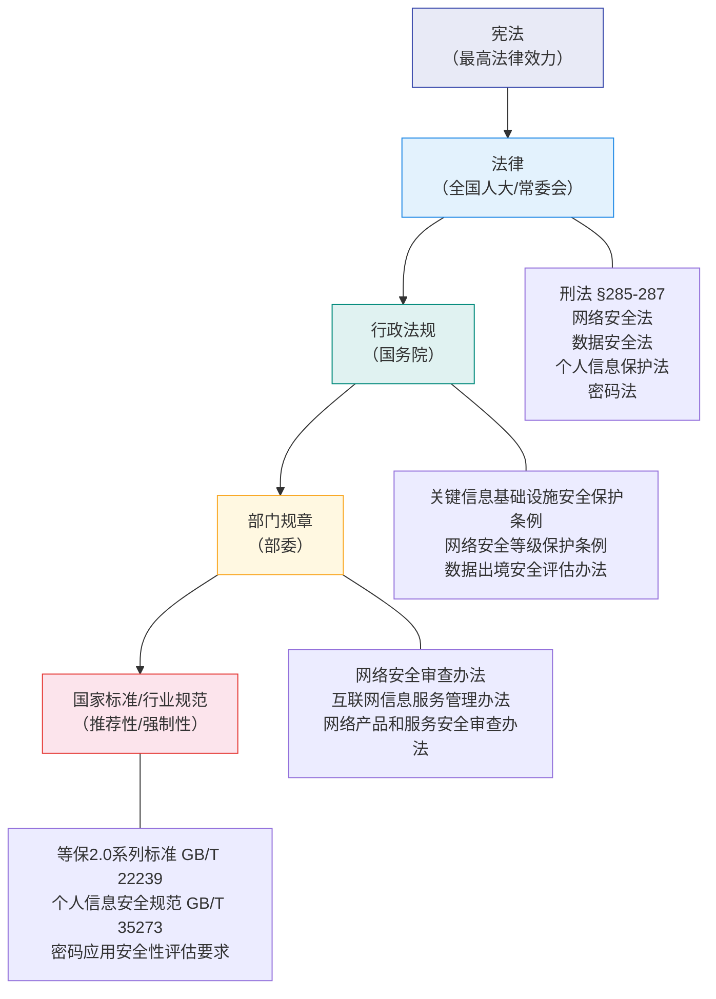
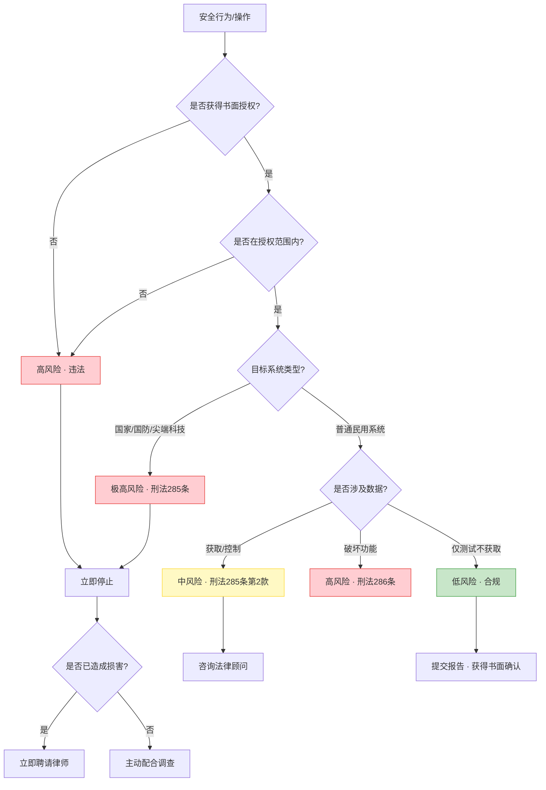
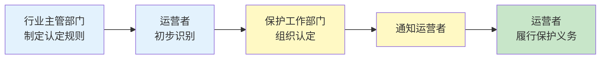
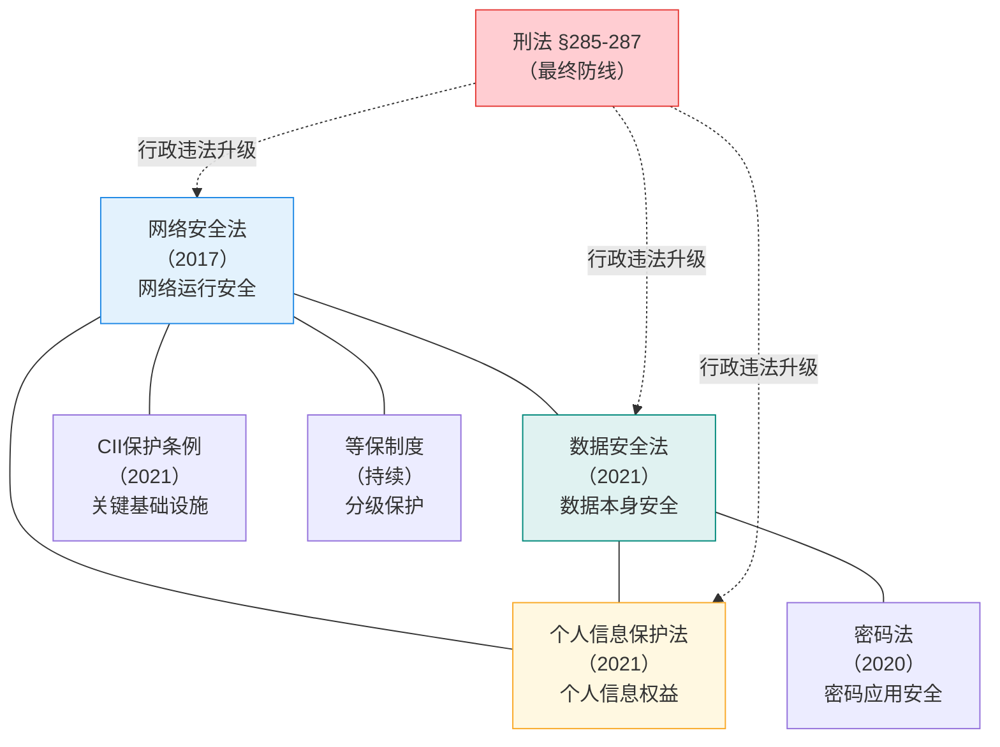
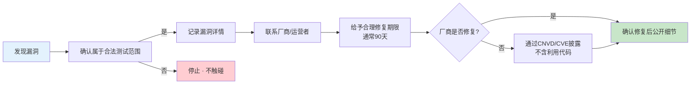

## 2.1 中国网络安全法律体系

网络安全从业者处于技术与法律的交汇地带。每一次渗透测试、每一次漏洞挖掘、每一次数据处理行为，都可能触发法律后果。不了解法律体系的安全人员，就像不知道交通规则的司机——技术再好，也可能在不知不觉中越界。

本节系统梳理中国网络安全法律体系的全貌，帮助从业者建立完整的法律风险认知框架。不是让你成为律师，而是让你知道红线在哪里，如何在合法范围内施展技术能力。

### 2.1.1 法律体系全景

中国网络安全法律体系呈金字塔结构，从宪法到部门规章，效力逐级递减但数量逐级增多：



**宪法层面**：《宪法》第四十条规定公民通信自由和通信秘密受法律保护，这是网络安全法律的宪法基础。任何安全测试涉及通信内容截获时，都需要考虑这一根本性权利。

**法律层面**（效力最高，全国适用）：由全国人大及其常委会制定，目前与网络安全直接相关的核心法律有五部——刑法、网络安全法、数据安全法、个人信息保护法、密码法。这五部法律构成了网络安全法律体系的五大支柱。

**行政法规层面**：由国务院制定，对法律进行细化。关键信息基础设施安全保护条例、网络安全等级保护条例等属于这一层级。

**部门规章层面**：由各部委制定，操作性最强。如网络安全审查办法、互联网信息服务管理办法等。

**标准规范层面**：包括国家标准（GB/T）和行业规范。虽多数为推荐性标准，但在行政执法和司法实践中常被作为判定"合理安全措施"的依据。

### 2.1.2 刑法相关条款详解

刑法是网络安全法律体系中威慑力最强的部分，直接关系到从业者的人身自由。以下逐条解析与计算机犯罪直接相关的刑法条款，每一条都附带实际量刑标准和典型案例。

#### 第285条：非法侵入计算机信息系统罪

**条文原文**：违反国家规定，侵入国家事务、国防建设、尖端科学技术领域的计算机信息系统的，处三年以下有期徒刑或者拘役。

**构成要件分析**：

| 要件 | 说明 | 实务要点 |
|------|------|----------|
| 客体 | 国家事务、国防建设、尖端科技三类系统 | 仅限这三类，普通系统不适用本条 |
| 客观行为 | "侵入"——未经授权或超越授权访问 | 包括绕过安全措施、利用漏洞获取访问权限 |
| 主观方面 | 故意——明知是上述系统仍侵入 | 过失不构成本罪 |
| 主体 | 一般主体，年满16周岁 | 安全从业者属于高风险群体 |

**关键细节**：本条是行为犯，不要求造成实际损害。只要实施了侵入行为即构成犯罪。这意味着即使你只是"看看"、没有下载任何数据、没有造成任何破坏，仍然构成犯罪。

**量刑标准**：三年以下有期徒刑或拘役。考虑到涉及国家安全领域，司法实践中通常从严处理。

**安全从业者的风险场景**：
- 在未明确授权范围的渗透测试中，误触政府或军工系统
- 使用自动化扫描工具时，扫描范围未排除上述三类系统
- 漏洞赏金测试中，未确认目标是否属于保护范围

#### 第285条第2款：非法获取计算机信息系统数据罪

**条文原文**：违反国家规定，侵入前款规定以外的计算机信息系统或者采用其他技术手段，获取该计算机信息系统中存储、处理或者传输的数据，或者对该计算机信息系统实施非法控制，情节严重的，处三年以下有期徒刑或者拘役，并处或者单处罚金；情节特别严重的，处三年以上七年以下有期徒刑，并处罚金。

**与第285条第1款的区别**：

| 对比项 | 第285条第1款 | 第285条第2款 |
|--------|-------------|-------------|
| 保护对象 | 国家事务/国防/尖端科技系统 | 所有其他计算机信息系统 |
| 行为方式 | 侵入 | 侵入或其他技术手段 |
| 危害结果 | 行为犯，不要求后果 | 情节犯，需达到"情节严重" |
| 量刑 | 三年以下 | 三年以下或三至七年 |

**"情节严重"的认定标准**（两高司法解释）：
- 获取支付结算、证券交易、期货交易等网络金融服务的身份认证信息十组以上的
- 获取第（一）项以外的身份认证信息五百组以上的
- 非法控制计算机信息系统二十台以上的
- 违法所得五千元以上或者造成经济损失一万元以上的
- 其他情节严重的情形

**"情节特别严重"**：上述标准的五倍以上。

**"其他技术手段"**包括哪些？司法实践中认定较宽：SQL注入、XSS攻击获取数据、中间人攻击截获数据、利用默认密码登录获取数据等，都属于"其他技术手段"。甚至通过未授权API接口获取数据也可能被纳入。

**典型判例**：2019年某安全研究员在未获授权的情况下，通过SQL注入漏洞获取某电商平台用户数据约50万条并公开披露。法院认定其行为构成非法获取计算机信息系统数据罪，判处有期徒刑一年六个月，并处罚金人民币二万元。此案的关键在于：即使目的是"揭露安全漏洞"，未经授权获取数据仍然违法。

#### 第286条：破坏计算机信息系统罪

**条文原文**：违反国家规定，对计算机信息系统功能进行删除、修改、增加、干扰，造成计算机信息系统不能正常运行，后果严重的，处五年以下有期徒刑或者拘役；后果特别严重的，处五年以上有期徒刑。

**行为方式四种类型**：

| 类型 | 说明 | 安全场景举例 |
|------|------|-------------|
| 删除 | 移除系统功能或数据 | 清除日志、删除配置文件 |
| 修改 | 更改系统功能或数据 | 篡改数据库内容、修改系统配置 |
| 增加 | 添加非授权功能或数据 | 植入后门、注入恶意代码 |
| 干扰 | 影响系统正常运行但未直接修改 | DDoS攻击、ARP欺骗 |

**量刑标准**：
- 后果严重：五年以下有期徒刑或拘役
- 后果特别严重：五年以上有期徒刑（无上限至十五年）

**"后果严重"的认定**（两高司法解释）：
- 造成十台以上计算机信息系统的主要软件或者硬件不能正常运行的
- 对二十台以上计算机信息系统中存储、处理或者传输的数据进行删除、修改、增加操作的
- 违法所得五千元以上或者造成经济损失一万元以上的
- 造成为一百台以上计算机信息系统提供域名解析、身份认证、计费等基础服务或者为一万以上用户提供服务的计算机信息系统不能正常运行累计一小时以上的
- 造成其他严重后果的

**安全测试中的高危场景**：
- 渗透测试中执行了破坏性命令（如 `rm -rf`、格式化操作）
- 测试DoS漏洞时未控制流量导致目标系统实际宕机
- 使用漏洞利用代码（exploit）时未考虑稳定性，导致目标服务崩溃

#### 第286条之一：拒不履行信息网络安全管理义务罪

**适用对象**：网络服务提供者（ISP、云服务商、平台运营商等），不直接适用于个人安全研究者。

**构成要件**：不履行安全管理义务 → 监管部门责令改正 → 拒不改正 → 出现法定情形。

**法定情形**：
- 致使违法信息大量传播的
- 致使用户信息泄露，造成严重后果的
- 致使刑事案件证据灭失，情节严重的
- 其他情形

**对安全从业者的启示**：如果你在企业担任安全负责人（CSO/CISO），发现安全漏洞后向管理层报告但管理层拒绝修复，而监管部门已经责令整改——如果最终发生安全事故，你作为技术负责人可能面临刑事风险。这种情况下，务必书面记录所有报告和沟通，保留证据证明你已尽到职责。

#### 第287条：利用计算机实施犯罪的提示性规定

**条文性质**：提示性规定，不是独立罪名。利用计算机实施金融诈骗、盗窃、贪污、挪用公款、窃取国家秘密或者其他犯罪的，依照刑法有关规定定罪处罚。

**实际意义**：技术只是手段，犯罪的本质不变。用计算机实施诈骗按诈骗罪定罪，用计算机窃取商业秘密按侵犯商业秘密罪定罪。这意味着不能以"我只是用了技术手段"来逃避更重的罪名。

#### 第287条之一：非法利用信息网络罪

**三种行为模式**：
1. 设立用于实施诈骗、传授犯罪方法、制作或销售违禁物品的网站/群组
2. 发布违法犯罪信息
3. 为实施违法犯罪活动发布信息

**对安全从业者的影响**：
- 在公开论坛发布完整的漏洞利用代码（exploit），如果被他人用于犯罪，可能构成本罪
- 在社交媒体上发布"教学"性质的攻击教程，如果内容过于具体可操作，存在风险
- 建立或参与讨论攻击技术的群组，如果群组主要目的被认定为犯罪预备，群主和活跃成员可能被追责

**安全边界**：学术讨论、安全培训、负责任的漏洞披露与本罪的界限在于——是否具有明确的违法犯罪目的，以及内容是否具有直接可操作性。讨论漏洞原理和防御方法通常安全，提供即用型攻击工具则风险极高。

#### 第287条之二：帮助信息网络犯罪活动罪（帮信罪）

**条文原文**：明知他人利用信息网络实施犯罪，为其犯罪提供互联网接入、服务器托管、网络存储、通讯传输等技术支持，或者提供广告推广、支付结算等帮助，情节严重的，处三年以下有期徒刑或者拘役，并处或者单处罚金。

**"明知"的认定**：司法实践中对"明知"的认定较为宽泛，包括：
- 经监管部门告知后仍然实施有关行为的
- 接到举报后不履行法定管理职责的
- 交易价格或者方式明显异常的
- 提供专门用于违法犯罪的程序、工具的
- 频繁采用隐蔽上网、加密通信、销毁数据等措施或者使用虚假身份的

**安全从业者的风险点**：
- 为他人提供"渗透测试服务"但未验证对方身份和授权
- 出售漏洞利用工具给身份不明的买家
- 为他人搭建VPN/代理服务，明知对方用于非法目的

**典型判例**：某技术人员明知客户购买服务器用于DDoS攻击，仍为其提供服务器配置和带宽服务。法院认定其构成帮信罪，判处有期徒刑八个月。该案说明，"我只是卖服务器"不能成为免责理由。

#### 刑法条款速查对照表

| 条款 | 罪名 | 行为 | 最高刑期 | 适用主体 |
|------|------|------|----------|----------|
| §285① | 非法侵入计算机信息系统罪 | 侵入三类重点系统 | 3年 | 一般主体 |
| §285② | 非法获取数据罪 | 获取数据/非法控制 | 7年 | 一般主体 |
| §286 | 破坏计算机信息系统罪 | 删除/修改/增加/干扰 | 15年 | 一般主体 |
| §286之一 | 拒不履行安全管理义务罪 | 不履行义务且拒不改正 | 3年 | 网络服务提供者 |
| §287之一 | 非法利用信息网络罪 | 设立犯罪网站/发布犯罪信息 | 3年 | 一般主体 |
| §287之二 | 帮信罪 | 明知犯罪仍提供技术支持 | 3年 | 一般主体 |

> **安全从业者法律风险评估图**
>
> 以下流程图帮助安全从业者快速评估行为的法律风险等级：



### 2.1.3 网络安全法

2017年6月1日实施的《中华人民共和国网络安全法》是中国网络安全领域的基本法，也是中国第一部全面规范网络空间安全管理的基础性法律。全文共七章七十九条，确立了网络安全的基本制度框架。

#### 核心制度一：网络安全等级保护制度

等保制度是中国网络安全的基石制度，源自1994年的《计算机信息系统安全保护条例》，经《网络安全法》上升为法律层面的强制要求。

**五个安全等级**：

| 等级 | 名称 | 受侵害对象 | 适用场景举例 |
|------|------|-----------|-------------|
| 第一级 | 用户自主保护级 | 公民、法人合法权益 | 个人博客、小型企业官网 |
| 第二级 | 系统审计保护级 | 社会秩序和公共利益 | 一般企业信息系统、非关键业务系统 |
| 第三级 | 安全标记保护级 | 社会秩序和公共利益（严重损害） | 地市级政务系统、金融交易系统、大型电商平台 |
| 第四级 | 结构化保护级 | 社会秩序和公共利益（特别严重损害）或国家安全 | 省级政务核心系统、电力调度系统 |
| 第五级 | 访问验证保护级 | 国家安全 | 国防、军事、尖端科技系统 |

**等保2.0标准体系**（2019年12月1日实施）：

等保2.0在等保1.0基础上增加了云计算、移动互联、物联网、工业控制系统、大数据等新技术新应用的安全扩展要求。核心标准包括：

- **GB/T 22239-2019**：信息安全技术 网络安全等级保护基本要求
- **GB/T 25070-2019**：信息安全技术 网络安全等级保护安全设计技术要求
- **GB/T 28448-2019**：信息安全技术 网络安全等级保护测评要求

**对安全从业者的实际影响**：
- 企业必须完成等保定级备案，否则面临行政处罚（罚款1万-100万）
- 第三级及以上系统每年至少进行一次等级测评
- 渗透测试是等保测评的必检项之一——这意味着安全从业者需要按照等保标准执行测试
- 测评报告需要提交公安机关网安部门

#### 核心制度二：关键信息基础设施保护

**关键信息基础设施（CII）的认定范围**：

《网络安全法》第三十一条规定，公共通信和信息服务、能源、交通、水利、金融、公共服务、电子政务、国防科工等重要行业和领域的信息系统，一旦遭到破坏、丧失功能或数据泄露，可能严重危害国家安全、国计民生、公共利益的，属于关键信息基础设施。

**CII运营者的特殊义务**（超出一般网络运营者）：

1. **安全管理机构**：设置专门安全管理机构，对安全管理负责人和关键岗位人员进行安全背景审查
2. **年度安全检测**：自行或委托安全服务机构每年至少进行一次检测评估
3. **采购安全审查**：采购网络产品和服务影响或可能影响国家安全的，应通过国家安全审查
4. **数据本地化**：在中国境内运营中收集和产生的个人信息和重要数据应当在境内存储
5. **应急预案**：制定网络安全事件应急预案并定期演练

**对安全从业者的影响**：对CII进行安全测试的门槛远高于普通系统。即使获得授权，测试范围、测试方法、测试时间窗口都有严格限制。测试报告的保密等级也更高。

#### 核心制度三：个人信息保护

《网络安全法》第四十至四十五条确立了个人信息保护的基本原则：

**"知情同意"原则的具体要求**：
- 收集信息前必须告知用户：收集目的、方式、范围
- 必须获得用户明确同意（默示同意在多数场景下不被认可）
- 用户有权要求删除其个人信息
- 不得因用户不同意收集非必要信息而拒绝提供基本服务

**安全测试中的个人信息问题**：
- 渗透测试过程中如果接触到用户数据库，测试人员有保密义务
- 漏洞报告中不应包含真实的用户数据作为证据
- 安全评估报告中涉及个人信息的，应当进行脱敏处理

#### 核心制度四：网络安全事件应急

**事件分级**：

| 级别 | 名称 | 判定标准 | 报告时限 |
|------|------|----------|----------|
| 特别重大 | I级 | 省级以上信息系统或CII瘫痪 | 立即报告，不超过1小时 |
| 重大 | II级 | 地市级以上信息系统或重要系统严重受损 | 不超过2小时 |
| 较大 | III级 | 县级以上信息系统或一般系统受损 | 不超过4小时 |
| 一般 | IV级 | 造成一定影响的安全事件 | 不超过24小时 |

**安全从业者的应急响应义务**：
- 如果在安全测试过程中意外触发安全事件，必须立即停止测试并报告
- 企业安全团队发现漏洞被利用时，需要按照应急预案进行处置
- 不得擅自对外发布安全事件细节，需要经过主管部门审批

#### 核心制度五：网络信息内容治理

《网络安全法》第十二条规定，任何个人和组织使用网络应当遵守宪法法律，不得危害网络安全，不得利用网络从事危害国家安全、荣誉和利益，煽动颠覆国家政权、推翻社会主义制度，煽动分裂国家、破坏国家统一，宣扬恐怖主义、极端主义，宣扬民族仇恨、民族歧视，传播暴力、淫秽色情信息，编造、传播虚假信息扰乱经济秩序和社会秩序，以及侵害他人名誉、隐私、知识产权和其他合法权益等活动。

**对安全从业者的影响**：在公开渠道（博客、社交媒体、安全社区）发布安全漏洞信息时，需要注意措辞和范围。避免使用煽动性语言，避免暴露可直接利用的细节，避免将漏洞描述为对特定企业的"攻击指南"。

### 2.1.4 数据安全法

2021年9月1日实施的《中华人民共和国数据安全法》是中国数据安全领域的基础性法律，全文共七章五十五条。它与《网络安全法》形成互补：《网络安全法》侧重于网络运行安全，《数据安全法》侧重于数据本身的安全。

#### 数据分类分级制度

这是《数据安全法》的核心制度。国家建立数据分类分级保护制度，根据数据在经济社会发展中的重要程度，以及一旦遭到篡改、破坏、泄露或者非法获取、非法利用，对国家安全、公共利益或者个人、组织合法权益造成的危害程度，对数据实行分类分级保护。

| 分类 | 定义 | 保护级别 | 监管要求 |
|------|------|----------|----------|
| 核心数据 | 关系国家安全、国民经济命脉、重要民生、重大公共利益的数据 | 最高 | 国家统筹保护，严格限制处理 |
| 重要数据 | 一旦被篡改、破坏、泄露可能危害国家安全、公共利益的数据 | 高 | 实施数据安全评估，限制出境 |
| 一般数据 | 核心数据、重要数据之外的数据 | 常规 | 依照一般数据安全要求处理 |

**安全测试中的数据分级问题**：
- 测试过程中如果接触到核心数据或重要数据，测试人员的保密义务和法律风险大幅提升
- 重要数据的出境受到严格限制——跨境安全测试时需要特别注意
- 即使是一般数据，大规模泄露仍然可能构成犯罪

#### 数据安全审查制度

《数据安全法》第二十四条规定，国家建立数据安全审查制度，对影响或者可能影响国家安全的数据处理活动进行国家安全审查。这意味着涉及国家安全的数据处理行为（包括安全评估、数据迁移等）可能触发国家安全审查。

#### 数据安全保护义务

数据处理者需要履行以下义务：
- 建立健全全流程数据安全管理制度
- 组织开展数据安全教育培训
- 采取相应的技术措施和其他必要措施保障数据安全
- 发生数据安全事件时立即采取处置措施并报告
- 重要数据的处理者应当明确数据安全负责人和管理机构

#### 法律责任

**行政处罚**：
- 未履行数据安全保护义务：责令改正、警告，处5万-50万元罚款
- 拒不改正或造成大量数据泄露：处50万-200万元罚款，可责令停业整顿
- 情节特别严重的：处200万-1000万元罚款，吊销营业执照

**刑事衔接**：构成犯罪的，依法追究刑事责任。

### 2.1.5 个人信息保护法

2021年11月1日实施的《中华人民共和国个人信息保护法》是中国个人信息保护领域的专门法律，全文共八章七十四条。它借鉴了欧盟GDPR的框架，但具有鲜明的中国特色。

#### 个人信息的定义

《个人信息保护法》第四条：个人信息是以电子或者其他方式记录的与已识别或者可识别的自然人有关的各种信息，不包括匿名化处理后的信息。

**敏感个人信息**（第二十八条）：
- 生物识别（指纹、人脸、虹膜、声纹）
- 宗教信仰
- 特定身份（民族、种族、政治面貌）
- 医疗健康
- 金融账户
- 行踪轨迹
- 不满十四周岁未成年人的个人信息

**处理敏感个人信息的特殊要求**：
- 必须具有特定的目的和充分的必要性
- 必须取得个人的单独同意
- 需要进行个人信息保护影响评估

#### 六大合法性基础

不同于《网络安全法》仅规定"知情同意"，《个人信息保护法》提供了六种合法处理个人信息的法律基础：

| 序号 | 基础 | 说明 | 安全测试场景适用性 |
|------|------|------|-------------------|
| ① | 同意 | 取得个人同意 | 最常见，但测试场景下难以逐一获取同意 |
| ② | 合同必需 | 为订立或履行合同所必需 | 适用于受委托的安全测试 |
| ③ | 法定职责 | 为履行法定职责或法定义务所必需 | 适用于监管机构要求的安全评估 |
| ④ | 公共卫生 | 应对突发公共卫生事件 | 不适用于安全测试 |
| ⑤ | 公共利益 | 为公共利益实施新闻报道、舆论监督 | 适用于负责任的漏洞披露（需谨慎） |
| ⑥ | 合理范围 | 在合理范围内处理已公开的个人信息 | 适用于安全研究中使用公开数据集 |

#### 跨境传输规则

个人信息出境需要满足以下条件之一：
- 通过国家网信部门组织的安全评估
- 经专业机构进行个人信息保护认证
- 按照国家网信部门制定的标准合同与境外接收方订立合同
- 法律、行政法规或者国家网信部门规定的其他条件

**对安全从业者的影响**：
- 跨国企业的安全测试如果涉及将测试数据传输到境外，需要满足跨境传输规则
- 使用境外安全工具（如云扫描服务）时，如果工具会将扫描结果上传到境外服务器，存在合规风险
- 境外安全公司在中国开展业务，需要遵守中国数据保护法律

#### 个人信息保护影响评估（PIA）

以下场景需要进行PIA：
- 处理敏感个人信息
- 利用个人信息进行自动化决策
- 委托处理个人信息、向其他个人信息处理者提供个人信息、公开个人信息
- 向境外提供个人信息
- 其他对个人权益有重大影响的个人信息处理活动

**PIA的内容**：
1. 个人信息的处理目的、方式等是否合法、正当、必要
2. 对个人权益的影响及安全风险
3. 所采取的保护措施是否合法、有效并与风险程度相适应

#### 法律责任

| 违法行为 | 行政处罚 | 严重情形 |
|----------|----------|----------|
| 未履行保护义务 | 责令改正、警告、没收违法所得 | 100万以下罚款 |
| 拒不改正 | 100万以下罚款 | 责任人1万-10万罚款 |
| 情节严重 | 5000万以下或上年度营业额5%以下罚款 | 责令暂停业务、吊销许可 |

### 2.1.6 关键信息基础设施安全保护条例

2021年9月1日实施的《关键信息基础设施安全保护条例》是《网络安全法》第三十一条的配套行政法规，共六章四十条，对关键信息基础设施的认定、保护、法律责任等进行了细化。

#### CII认定流程



#### 运营者的安全保护责任

1. **建立健全网络安全保护制度和责任制**：设置专门安全管理机构，对安全管理负责人进行背景审查
2. **保障专门安全管理机构的运行**：保障人力、财力、物力投入
3. **开展网络安全检测和风险评估**：每年至少进行一次，及时整改发现的问题
4. **报告安全威胁和事件**：发现重大安全威胁或事件立即向保护工作部门报告
5. **优先采购安全可信的网络产品和服务**

#### 安全检测评估制度

CII运营者应当每年至少进行一次网络安全检测和风险评估，检测评估内容包括：
- 网络安全制度落实情况
- 技术防护措施有效性
- 安全事件应急演练
- 供应链安全评估

### 2.1.7 其他重要法律法规

除了上述核心法律外，以下法律法规对安全从业者同样重要：

#### 密码法（2020年1月1日实施）

**核心内容**：
- 密码分为核心密码、普通密码和商用密码三类
- 核心密码和普通密码用于保护国家秘密，属于国家事权
- 商用密码用于保护非国家秘密信息，企业和个人可以使用

**对安全从业者的影响**：
- 使用加密技术进行安全测试时，需要使用经国家密码管理局认可的商用密码产品和算法
- 自行研发的加密工具如果使用了未经批准的密码算法（如自创算法），可能违法
- SM系列国密算法（SM2/SM3/SM4）是合规的首选

#### 网络安全审查办法（2022年2月15日修订实施）

**触发条件**：CII运营者采购网络产品和服务，网络平台运营者开展数据处理活动，影响或可能影响国家安全的。

**审查重点**：
- 产品和服务使用后带来的关键信息基础设施被非法控制、遭受干扰或破坏的风险
- 核心数据、重要数据或大量个人信息被窃取、泄露、毁损以及非法利用、非法出境的风险
- 供应中断对关键信息基础设施业务连续性的危害

**对安全从业者的影响**：向CII运营者销售安全产品或服务，可能需要通过网络安全审查。

#### 互联网信息服务管理办法（2000年，修订中）

**与安全从业者的关联**：
- 提供安全信息发布、漏洞公告等互联网信息服务，需要取得ICP许可
- 发布安全漏洞信息需要遵守相关规定，不得发布攻击性工具的下载链接

### 2.1.8 法律间的关联与适用

网络安全领域的多部法律并非孤立存在，而是形成了层层递进、相互补充的法律体系。理解它们之间的关系，对于准确判断法律风险至关重要。



**适用顺序**：一般情况下，先看行为是否违反具体法律（网安法、数安法、个保法），再看是否上升到刑法层面。但《刑法》第285条第1款（侵入三类重点系统）是行为犯，不以行政违法为前提，可直接适用。

**同一行为可能触犯多部法律**：例如，非法获取大量用户个人信息，可能同时违反《网络安全法》（未授权访问）、《数据安全法》（重要数据泄露）、《个人信息保护法》（非法处理个人信息），甚至构成《刑法》第285条第2款的犯罪。司法实践中，通常选择处罚最重的条款适用。

### 2.1.9 典型执法案例与处罚数据

法律的生命在于实施。以下案例展示了近年来网络安全领域的执法实践，帮助从业者直观感受法律的"牙齿"。

#### 企业处罚案例

| 年份 | 企业/机构 | 违法行为 | 处罚依据 | 处罚结果 |
|------|----------|----------|----------|----------|
| 2022 | 某出行平台 | 违法收集使用个人信息 | 个保法 | 罚款80.26亿元 |
| 2021 | 某招聘平台 | 未履行数据安全保护义务 | 数安法 | 罚款未公开，责令整改 |
| 2022 | 某科技公司 | 数据出境违规 | 数安法+个保法 | 下架App，罚款 |
| 2023 | 某银行 | 等保不达标 | 网安法 | 罚款50万元 |
| 2023 | 某医疗平台 | 患者数据泄露 | 个保法 | 罚款150万元 |

#### 个人刑事案例

| 年份 | 被告 | 行为 | 罪名 | 判决 |
|------|------|------|------|------|
| 2020 | 安全研究员A | 未授权获取某电商50万用户数据 | §285② | 有期徒刑1年6个月 |
| 2021 | 白帽子B | 未授权渗透测试政府网站 | §285① | 有期徒刑8个月 |
| 2022 | 技术人员C | 为DDoS攻击提供服务器 | §287之二 | 有期徒刑8个月 |
| 2023 | 安全工程师D | 测试中破坏生产系统 | §286 | 有期徒刑3年 |

> **关键教训**：绝大多数被追究刑事责任的安全从业者，问题不在于技术本身，而在于"没有获得明确的书面授权"或"超越了授权范围"。

### 2.1.10 安全从业者的合规操作指南

了解法律条文是基础，更重要的是知道如何在日常工作中遵守法律。以下是安全从业者必须建立的合规操作流程。

#### 渗透测试合规清单

```text
□ 取得书面授权书（明确测试范围、时间、方法）
□ 确认目标系统不属于国家事务/国防/尖端科技领域
□ 确认测试范围未包含CII系统（除非有特别授权）
□ 制定详细的测试方案和风险控制措施
□ 与客户确认紧急联系人和应急响应流程
□ 测试过程中不下载、不存储真实的用户数据
□ 所有测试数据在项目结束后安全销毁
□ 测试报告中对敏感信息进行脱敏处理
□ 报告通过加密渠道传输
□ 保留完整的测试日志以备审计
```

#### 负责任漏洞披露流程



**负责任披露的法律保护**：虽然中国目前没有明确的"安全港"法律条款保护善意的安全研究者，但以下做法可以降低法律风险：
1. 始终在获得授权的范围内测试
2. 不获取、不存储、不传输真实用户数据
3. 通过厂商安全响应中心（SRC）或CNVD报告漏洞
4. 给予厂商合理的修复时间
5. 公开时仅描述漏洞原理，不提供可直接利用的代码

#### 安全培训与知识分享的法律边界

| 行为 | 法律风险 | 建议 |
|------|----------|------|
| 讲解漏洞原理 | 低风险 | 推荐，学术讨论受法律保护 |
| 提供修复方案 | 无风险 | 推荐，属于防御性知识 |
| 演示攻击过程（使用靶场环境） | 低风险 | 推荐，使用CTF靶场或自建测试环境 |
| 发布完整exploit代码 | 中高风险 | 谨慎，建议仅在授权培训中使用 |
| 提供即用型攻击工具 | 高风险 | 避免，可能构成非法利用信息网络罪 |
| 教授针对特定目标的攻击方法 | 高风险 | 绝对避免，可能构成传授犯罪方法 |

### 2.1.11 国际比较与跨境安全研究

了解中国法律与其他主要法域的对比，对于从事跨境安全研究或国际企业安全合规的从业者至关重要。

| 维度 | 中国 | 欧盟(GDPR) | 美国 |
|------|------|-----------|------|
| 核心法律 | 网安法+数安法+个保法 | GDPR+网络安全法案 | 无统一联邦法，各州立法 |
| 数据出境 | 安全评估/认证/标准合同 | 充分性认定/SCC/BCR | 行业自律为主 |
| 最高罚款 | 营业额5%或5000万元 | 营业额4%或2000万欧元 | 因州法而异(CCPA为7500美元/次) |
| 漏洞披露 | 无明确安全港 | 无明确安全港 | 部分厂商有漏洞赏金计划 |
| 刑事责任 | 有，明确且严厉 | 有，但实践中较少刑事追诉 | 有(CFAA)，但近年有放宽趋势 |
| 等保/认证 | 强制等保制度 | NIS2指令 | NIST框架(自愿) |

**跨境安全研究的注意事项**：
- 如果测试的目标系统位于中国境内，必须遵守中国法律
- 使用境外安全工具可能涉及数据出境问题
- 参与国际漏洞赏金计划时，确认目标不在中国CII范围内
- 跨国公司的安全团队需要同时遵守多国法律

### 2.1.12 常见误区与纠正

**误区一："我是白帽子，做好事不违法"**
纠正：法律不区分"善意"和"恶意"的未授权访问。无论你的出发点多么正当，未经授权侵入计算机系统就是违法。"善意"可能在量刑时作为酌定情节，但不能使违法行为合法化。

**误区二："只看不拿就不违法"**
纠正：《刑法》第285条第1款是行为犯，只要实施了侵入行为即构成犯罪，不要求获取数据或造成损害。对于普通系统，第285条第2款要求"获取数据"或"非法控制"才构成犯罪，但"浏览"行为如果涉及绕过安全措施，仍然可能被认定为"侵入"。

**误区三："漏洞赏金计划授权了所有测试行为"**
纠正：漏洞赏金计划有明确的范围（scope）和规则（rules of engagement）。超出范围的测试行为不受赏金计划的保护。例如，赏金计划允许Web应用测试，你却去测试其内部员工系统——这属于未授权测试。

**误区四："我用的是开源工具，出问题跟我无关"**
纠正：使用工具的行为本身就是你的行为。工具是中性的，但使用工具的行为需要承担法律责任。使用漏洞扫描器对未授权目标进行扫描，你就是行为人。

**误区五："数据已经公开了，我用不违法"**
纠正：即使是"公开"的数据（如未授权访问就能获取的数据），大量获取并利用仍可能构成犯罪。数据的"可访问性"不等于"可合法使用"。

**误区六："等保测评中发现的漏洞我随便测"**
纠正：等保测评有明确的测试方法和范围。超出测评方案的测试行为需要额外授权。测评过程中发现高危漏洞，应通过正规渠道报告，而非自行深入测试。

### 2.1.13 本节小结

中国网络安全法律体系已形成以《网络安全法》《数据安全法》《个人信息保护法》为核心，以《刑法》为最终威慑，以《密码法》《CII保护条例》《网络安全审查办法》等为补充的完整框架。安全从业者必须理解：

1. **授权是一切的前提**：没有书面授权的安全测试，技术能力越强风险越大
2. **范围比授权更重要**：在授权范围内测试是合规，超出范围就是违法
3. **数据是核心风险点**：获取、存储、传输真实数据的行为，法律风险远高于功能性测试
4. **法律不区分善意恶意**：未授权就是未授权，"好心"不构成免责理由
5. **主动合规是最佳策略**：建立完善的合规流程，不仅是法律要求，也是职业素养的体现

> **进阶思考**：随着AI技术的快速发展，AI安全测试、大模型对抗性测试等新场景的法律适用尚不明确。安全从业者需要持续关注立法动态，特别是AI相关法律法规（如《生成式人工智能服务管理暂行办法》）对安全研究的影响。在法律空白地带，保守行事永远比冒险更明智。
