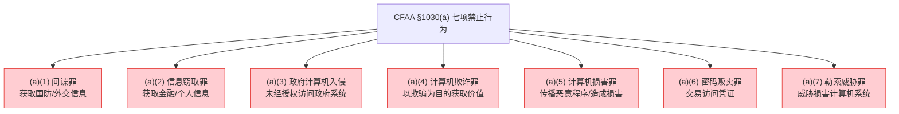
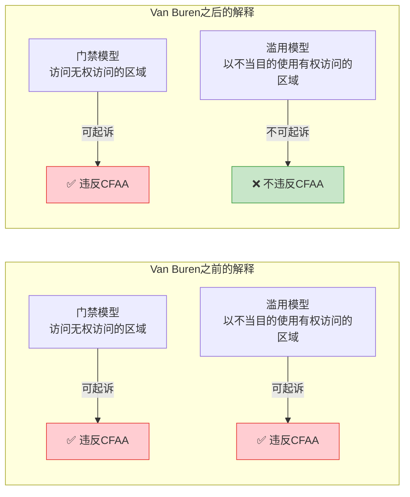
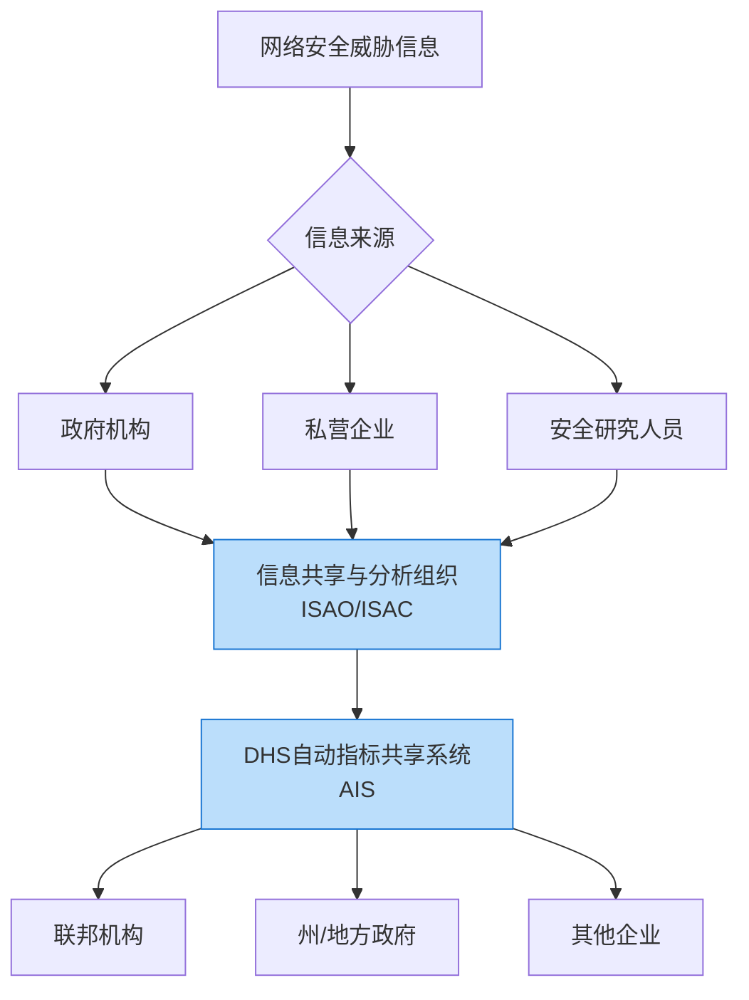
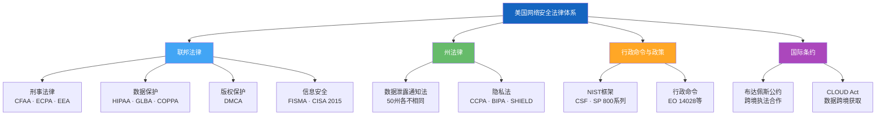

## 2.2 美国网络安全法律

美国没有一部统一的"网络安全法典"，而是由联邦和各州层面的数十部法律、行政命令和监管规则共同构成一个复杂的法律网络。对于安全研究人员来说，理解这个法律体系的关键在于：**哪些行为可能触发刑事责任、哪些场景存在法律保护、以及如何在合法框架内开展研究**。

> **阅读提示**：本节涉及的法律条文引用均标注美国法典编号（如 18 U.S.C. § 1030），便于你在需要时查阅原文。法律条文的精确措辞在实际法律争议中至关重要。

### 2.2.1 联邦核心法律

#### 一、计算机欺诈和滥用法案（CFAA）

CFAA（Computer Fraud and Abuse Act, 18 U.S.C. § 1030）是美国计算机犯罪法律的基石，也是安全研究人员最需要深入理解的法律。

**立法历史与演变**

CFAA并非一成不变，它经历了多次重大修订：

| 年份 | 修订内容 | 背景 |
|------|---------|------|
| 1984 | 初版《伪造接入设备和计算机欺诈与滥用法》 | 最初主要针对政府计算机系统的入侵 |
| 1986 | CFAA全面修订 | 扩展到所有"受保护的计算机"，奠定了现代CFAA的框架 |
| 1994 | 增加民事诉因 | 允许受害者提起民事诉讼，降低了起诉门槛 |
| 1996 | 扩展"损失"定义 | 将调查费用等间接损失纳入计算范围 |
| 2001 | 《爱国者法案》修订 | 扩大了CFAA的适用范围，增加了恐怖主义相关条款 |
| 2008 | 《身份盗窃执法协助法》 | 将身份盗窃相关的计算机犯罪纳入CFAA |
| 2015 | 《网络安全信息共享法》(CISA) | 增加了信息共享的法律保护 |

**CFAA的核心条款（§1030(a)的七项禁止行为）**

CFAA §1030(a)规定了七类联邦计算机犯罪，每一类都有独立的构成要件：

**逐条详解：**

**§1030(a)(1) — 计算机间谍罪**

禁止未经授权或超越授权访问计算机，获取以下信息并意图损害美国或为外国利益服务：
- 国防或外交关系相关的信息
- 受限原子能数据
- 受限的密码或通信信息

量刑：最高10年监禁（初犯），20年监禁（再犯）。这是CFAA中最严重的条款，通常用于涉及国家安全的案件。

**§1030(a)(2) — 信息窃取罪**

禁止未经授权或超越授权访问计算机，获取以下信息：
- (A) 金融记录（银行、信用卡数据等）
- (B) 来自任何部门或机构的信息
- (C) 受保护计算机上的信息

"受保护的计算机"（protected computer）的定义极为宽泛——2008年修订后包括任何"影响州际或外国商业的计算机"，这意味着**任何连接互联网的计算机都在CFAA的管辖范围内**。

量刑：最高1年监禁（初犯，仅获取信息），5年（获取价值超过5000美元的信息），10年（再犯）。

**§1030(a)(3) — 政府计算机入侵**

禁止非经授权故意访问美国政府所属或专用的计算机。

量刑：最高1年监禁（初犯），10年（再犯）。

**§1030(a)(4) — 计算机欺诈罪**

禁止通过故意欺诈的手段，利用计算机访问未经授权的信息，获取价值超过5000美元的利益。

量刑：最高5年监禁（初犯），10年（再犯）。

**§1030(a)(5) — 计算机损害罪**

这是安全研究人员最容易触及的条款。禁止以下三种行为（择一即可定罪）：
- (A) 故意传播程序、信息、代码或命令，造成计算机损害
- (B) 因轻率或不顾后果的行为造成计算机损害
- (C) 因未经授权访问造成计算机损害

"损害"的定义包括：数据泄露、程序破坏、系统可用性降低、经济损失超过5000美元、影响医疗诊断或治疗、影响1台以上的计算机。

量刑：最高10年监禁（初犯），20年（再犯）。如果涉及故意行为且造成严重后果，量刑更重。

**§1030(a)(6) — 密码贩卖罪**

禁止明知地交易或试图交易任何可用于未授权访问的计算机密码或类似信息。

量刑：最高1年监禁（初犯），10年（再犯）。

**§1030(a)(7) — 勒索威胁罪**

禁止传播威胁信息，要求受害者支付报酬以避免计算机损害。

量刑：最高5年监禁（初犯），10年（再犯）。

**CFAA的量刑标准汇总**

| 条款 | 罪名 | 初犯最高刑期 | 再犯最高刑期 |
|------|------|------------|------------|
| (a)(1) | 计算机间谍 | 10年 | 20年 |
| (a)(2) | 信息窃取 | 1-5年 | 5-10年 |
| (a)(3) | 政府计算机入侵 | 1年 | 10年 |
| (a)(4) | 计算机欺诈 | 5年 | 10年 |
| (a)(5) | 计算机损害 | 5-10年 | 10-20年 |
| (a)(6) | 密码贩卖 | 1年 | 10年 |
| (a)(7) | 勒索威胁 | 5年 | 10年 |

**核心争议："未经授权"（Unauthorized Access）的定义**

CFAA最大的法律争议在于"未经授权"和"超越授权"（exceeds authorized access）这两个概念的模糊性。

**什么是"超越授权"？** CFAA §1030(e)(6) 将其定义为"访问计算机并使用此类访问获取计算机上或通过计算机可访问的信息，而访问者无权获取"。但这个定义本身又引入了更多模糊性。

**Van Buren v. United States（2021）——里程碑式的最高法院判决**

2021年6月3日，美国最高法院在Van Buren案中对"超越授权"作出了限缩解释。案件事实如下：

Nathan Van Buren是一名佐治亚州警察，他利用警用数据库查询一名女性的车牌信息（出于个人目的，而非执法目的）。他依据CFAA被起诉，检方认为他"超越授权"使用了数据库。

最高法院以6:3的多数意见裁定：CFAA中的"超越授权"仅指**访问了其无权访问的计算机特定区域**（即"门禁"模型），而非**以不被允许的方式访问其有权访问的区域**（即"滥用"模型）。

**对安全研究人员的影响：**

Van Buren判决缩小了CFAA的适用范围。在此之前，员工因违反公司IT政策而使用公司计算机的行为可能被起诉为CFAA违规；在之后，仅仅是违反使用政策或合同条款不足以构成CFAA中的"超越授权"。

但是，这个判决并没有完全消除安全研究的法律风险。如果安全研究人员访问了明确被限制的系统区域（例如，通过SQL注入获取数据库中的数据），这仍然属于"门禁"模型下的未授权访问。

**CFAA对安全研究的关键风险场景**

| 场景 | 风险等级 | 法律分析 |
|------|---------|---------|
| 在Bug Bounty范围内测试 | 低 | 有明确授权，属于合法研究 |
| 发现公开暴露的API并调用 | 中-高 | Van Buren后仍有争议，取决于API是否有明确的访问控制 |
| 扫描公开IP段寻找漏洞 | 高 | 未经授权的扫描行为在多数解读下属于(a)(2)或(a)(5) |
| 发现漏洞后公开PoC | 高 | 可能被视为传播损害性工具，违反(a)(5) |
| 使用漏洞获取数据以证明漏洞存在 | 极高 | 明确违反(a)(2)，即使意图是"善意"的 |
| 对政府系统进行未授权测试 | 极高 | 直接触发(a)(3)，无任何抗辩空间 |

**CFAA的民事责任**

CFAA不仅规定了刑事责任，§1030(g)还允许受到损害的私人方提起民事诉讼。民事诉讼的标准比刑事更低（不需要证明"故意"），安全研究人员可能面临：

- 禁令救济（法院命令停止特定行为）
- 损害赔偿（包括经济损失和调查费用）
- 最低损害赔偿：每次违规500美元或实际损失

---

#### 二、数字千年版权法案（DMCA）

DMCA（Digital Millennium Copyright Act, 17 U.S.C. § 1201-1205, 512）于1998年通过，是版权法的一部分，但对安全研究产生了深远影响。

**DMCA的三大核心机制**

**（一）反规避条款（§1201）**

这是DMCA中对安全研究影响最大的条款。§1201(a)(1)(A)规定：

> 任何人不得规避有效控制访问受本章保护作品的技术措施。

"规避"包括：破解密码、逆向工程加密算法、绕过DRM（数字版权管理）、禁用软件保护机制。

对于安全研究人员来说，这意味着：
- 逆向工程受DRM保护的软件可能违反DMCA，即使目的是安全研究
- 分析IoT设备的固件可能触发反规避条款
- 绕过软件的许可证验证机制即使不涉及盗版也可能违法
- 发布破解工具（如已root的手机固件）可能违反§1201(a)(2)

**§1201的两个独立禁令：**
- §1201(a)(1)：禁止"规避行为"本身（直接违反者）
- §1201(a)(2)：禁止"提供规避工具"（工具制作者/传播者）
- §1201(b)：禁止提供用于规避"保护版权"技术措施的工具

**民事责任**：每次违规最高25,000美元罚款 + 实际损失
**刑事责任**：故意且出于商业利益或个人经济利益的，最高50万美元罚款 + 5年监禁；再犯最高100万美元罚款 + 10年监禁

**（二）安全港条款（§512）**

DMCA §512为在线服务提供商（OSP）提供了"安全港"保护。满足以下条件的OSP不对用户的版权侵权行为承担赔偿责任：

1. 不实际知晓侵权行为
2. 在有能力控制时未从侵权行为中直接获取经济利益
3. 收到合格的侵权通知后迅速移除或禁止访问相关内容

对于安全研究来说，安全港条款间接影响了漏洞披露平台、代码托管站点（如GitHub）等平台的运营规则。平台在收到DMCA takedown通知后可能会移除安全研究人员发布的逆向工程代码。

**（三）版权管理信息保护（§1202）**

禁止故意移除或修改版权管理信息，以及明知信息已被移除仍传播相关作品。

**DMCA三年一次的豁免规则**

美国版权局每三年发布一次豁免规则，允许特定场景下绕过技术保护措施而不违反§1201。以下是与安全研究最相关的豁免（以2021年最新一期为例）：

| 豁免类别 | 适用范围 | 限制条件 |
|---------|---------|---------|
| 软件安全测试 | 对合法获取的软件进行安全研究 | 必须是善意安全研究，结果不得用于侵权 |
| 固件安全研究 | 对物联网设备固件进行安全测试 | 设备必须是合法获取，测试不得损害设备功能 |
| 车辆安全研究 | 对汽车电子系统进行安全研究 | 不得影响车辆排放控制或安全系统 |
| 医疗设备 | 对植入式医疗设备的安全研究 | 必须在受控环境下进行 |
| 网络安全设备 | 对网络设备固件的安全测试 | 限于发现和修复安全漏洞 |

**重要限制**：这些豁免仅适用于§1201(a)(1)的"规避行为"，不适用于§1201(a)(2)的"提供规避工具"。也就是说，你可以在受控环境下进行逆向工程，但**不能将破解工具或教程公开发布**。

**DMCA与安全研究的冲突案例**

**案例一：IOActive与HDD加密研究（2015）**

安全研究员在研究硬盘加密时，发现可以绕过多家厂商的全盘加密方案。研究结果面临DMCA法律压力，部分研究内容在发布前被修改。

**案例二：汽车安全研究（2015）**

研究人员Charlie Miller和Chris Valasek远程攻破了Jeep Cherokee的车载系统。在此之前，汽车行业曾游说将汽车安全研究纳入DMCA禁止范围。最终版权局在2015年添加了车辆安全研究豁免。

**案例三：DMCA takedown与安全工具**

多个安全工具（包括密码破解工具、漏洞利用框架的某些模块）曾收到DMCA takedown通知。GitHub等平台在收到通知后通常会先移除内容，再等待反通知。

---

#### 三、电子通信隐私法（ECPA）

ECPA（Electronic Communications Privacy Act, 18 U.S.C. §§ 2510-2523, 2701-2712）是规制电子通信监听和存储的联邦法律，由三个子法案构成：

**（一）窃听法（Wiretap Act, §2511）**

禁止故意拦截、试图拦截或促使他人拦截有线、口头或电子通信。

对安全研究人员的影响：
- 使用网络嗅探器（如Wireshark）捕获网络流量可能构成"拦截电子通信"
- 在未授权的网络上进行中间人攻击（MITM）明确违法
- 即使在自己的网络上，捕获他人通信内容也需要至少一方同意

例外情况：合法的安全测试中，如果授权方同意监控通信（在渗透测试合同中明确写入），则不违反窃听法。

**（二）存储通信法（Stored Communications Act, §2701）**

禁止未经授权故意访问电子通信存储设施（如电子邮件服务器、云存储）。

对安全研究人员的影响：
- 即使发现了邮箱服务器的漏洞，未经授权读取存储的邮件违法
- 访问他人云存储中的数据（即使数据因配置错误而公开）可能构成违法
- "访问"不等于"下载"——仅仅是读取就足够构成犯罪

量刑：初犯最高1年监禁，如果出于商业利益或恶意损害目的最高5年。

**（三）笔录器和追踪器法（Pen Register Act, §3121）**

禁止未经法院命令安装或使用笔录器（记录通信元数据的设备）或追踪器（记录通信路由信息的设备）。

对安全研究人员的影响：
- 使用流量分析工具记录通信的元数据（IP地址、时间戳、数据包大小）可能触发此法
- 在渗透测试中，如果测试范围包括流量分析，需要在授权文件中明确写入

---

#### 四、经济间谍法（EEA）

EEA（Economic Espionage Act, 18 U.S.C. §§ 1831-1839）保护商业秘密，对安全研究有直接约束。

**§1831 — 经济间谍罪**

禁止为外国政府或机构利益窃取商业秘密。

量刑：个人最高15年监禁 + 500万美元罚款；组织最高1000万美元罚款。

**§1832 — 商业秘密盗窃罪**

禁止窃取与产品或服务相关的商业秘密以获取经济利益。

量刑：个人最高10年监禁；组织最高500万美元罚款（或被盗秘密价值的3倍，取较大者）。

**对安全研究的影响：**

- 在安全测试过程中，如果发现并获取了商业秘密（如源代码、算法、客户数据），可能触发EEA
- 逆向工程竞争对手的产品可能被指控窃取商业秘密，即使逆向工程本身在版权法下可能有合理使用的抗辩
- 离职员工带走前雇主的安全研究数据是EEA最常见的起诉场景之一

**重要提示**：2016年的《保护商业秘密法》（DTSA）增加了民事诉因，允许商业秘密持有者在联邦法院提起民事诉讼，进一步增加了安全研究人员的法律风险。

---

#### 五、联邦信息安全现代化法案（FISMA）

FISMA（Federal Information Security Modernization Act, 44 U.S.C. § 3551 et seq.）最初为FISAA（2002年），2014年修订为FISMA。

**FISMA的核心要求：**

FISMA不直接规制安全研究人员，但它定义了联邦系统安全评估的法律框架：

| 要求 | 内容 | 对安全研究的影响 |
|------|------|----------------|
| 风险评估 | 联邦机构必须定期进行信息安全风险评估 | 政府系统的渗透测试需遵循FISMA框架 |
| 安全控制 | 采用NIST SP 800-53定义的安全控制 | 测试范围和方法需符合NIST标准 |
| 持续监控 | 建立持续安全监控机制 | 安全研究人员可能被要求配合监控 |
| 事件报告 | 联邦计算机事件必须报告至US-CERT | 发现漏洞后需遵循联邦报告流程 |

**对安全研究人员的意义：**

如果你参与联邦系统的安全测试，你必须理解：
- 所有测试必须经过联邦机构信息安全官（CISO）的书面授权
- 测试方法必须符合NIST SP 800-115《信息安全测试与评估技术指南》
- 测试发现的漏洞必须通过US-CERT报告
- 测试数据属于联邦信息，受《联邦信息自由法》和保密要求的约束

---

### 2.2.2 行业特定法律

#### 一、HIPAA安全规则

HIPAA（Health Insurance Portability and Accountability Act, 42 U.S.C. § 1320d et seq.）中的安全规则（45 CFR Part 160 and Subparts A and C of Part 164）对医疗数据的安全提出了强制性要求。

**安全规则的三大保障：**

| 保障类型 | 具体要求 | 安全测试相关 |
|---------|---------|------------|
| 技术保障 | 访问控制、审计控制、传输加密、完整性控制 | 渗透测试需验证这些控制的有效性 |
| 物理保障 | 设施访问控制、工作站安全、设备控制 | 物理安全测试需考虑HIPAA要求 |
| 管理保障 | 风险评估、人员管理、应急计划、安全意识培训 | 安全评估报告需符合HIPAA格式 |

**对安全研究人员的关键约束：**

- 在HIPAA覆盖的环境中进行安全测试时，**任何接触到受保护健康信息（PHI）的行为都可能触发HIPAA违规**
- 即使是善意的安全研究，如果导致PHI泄露，组织仍需按照HIPAA的数据泄露通知规则报告（60天内通知受影响个人、HHS和媒体）
- HIPAA的民事罚款从每次违规100美元到最高每年150万美元不等
- 故意违规可能面临刑事责任：最高10年监禁（如果涉及虚假陈述或商业利益）

**实践建议**：在医疗系统的安全测试合同中，必须明确：
- 测试环境应尽量使用脱敏数据
- 如果意外接触PHI，应立即停止并报告
- 测试报告中不得包含任何PHI
- 测试方需签署商业伙伴协议（BAA）

#### 二、GLBA（Gramm-Leach-Bliley Act）

GLBA（15 U.S.C. § 6801 et seq.）要求金融机构保护客户的非公开个人信息（NPI）。

**安全规则（Safeguards Rule）要求：**
- 制定书面信息安全计划
- 指定信息安全负责人
- 定期风险评估和渗透测试
- 员工安全培训
- 服务提供商监督

对安全研究人员的影响：在金融机构进行渗透测试时，接触客户NPI的法律后果与HIPAA类似，需要在合同中明确数据处理规则。

#### 三、SOX（Sarbanes-Oxley Act）

SOX（18 U.S.C. § 1519, 1520; 15 U.S.C. § 7241 et seq.）虽然主要是财务审计法律，但其IT控制条款（特别是§404）要求上市公司维护有效的IT内控。

对安全研究人员的影响：
- SOX审计中的IT控制测试可能需要安全研究人员参与
- 故意销毁与SOX审计相关的电子证据（包括安全日志）是联邦犯罪，最高20年监禁
- 安全测试发现的漏洞如果影响财务报告系统的完整性，可能触发SOX合规问题

---

### 2.2.3 州级法律

美国没有联邦层面的综合性数据泄露通知法，但所有50个州和华盛顿特区都有各自的数据泄露通知法，各州法律的差异显著。

#### 一、加州消费者隐私法案（CCPA/CPRA）

CCPA（California Consumer Privacy Act, Cal. Civ. Code § 1798.100 et seq.）于2020年生效，2023年由CPRA（California Privacy Rights Act）修订加强。

**CCPA/CPRA的关键条款：**

| 条款 | 内容 | 对安全研究的影响 |
|------|------|----------------|
| 消费者知情权 | 消费者有权知道企业收集了哪些个人信息 | 安全测试需考虑数据映射的准确性 |
| 删除权 | 消费者有权要求删除其个人信息 | 安全测试中的数据处理需遵守删除要求 |
| 数据泄露诉讼权 | 数据泄露后消费者可直接起诉企业 | 企业对安全测试中的数据泄露承担严格责任 |
| "出售"数据的定义扩展 | 数据共享也可能构成"出售" | 安全测试中数据传输可能触发此条款 |

**数据泄露通知要求：**
- 在发现泄露后"尽可能迅速"通知受影响的加州居民
- 如果影响超过500名加州居民，必须通知州总检察长
- 通知必须包含泄露信息的类型、泄露日期、补救措施等

#### 二、纽约SHIELD法案

纽约Stop Hacks and Improve Electronic Data Security Act（N.Y. Gen. Bus. Law § 899-aa）要求：

- 任何拥有纽约居民私人信息的企业必须实施合理的安全措施
- 数据泄露必须在发现后"尽可能迅速"通知
- 对"私人信息"的定义比许多州更宽泛，包括生物识别数据和用户名/密码组合

#### 三、伊利诺伊BIPA

伊利诺伊州生物识别信息隐私法（Biometric Information Privacy Act, 740 ILCS 14）是美国最严格的生物识别数据保护法：

- 收集生物识别数据前需要书面知情同意
- 禁止出售或从生物识别数据中获利
- 私人诉讼权：每次违规法定损害赔偿1000美元（过失）或5000美元（故意/轻率）
- 对安全研究人员的意义：如果测试涉及人脸识别、指纹等生物识别系统，需特别注意BIPA的合规要求

#### 四、各州数据泄露通知法的主要差异

| 差异维度 | 示例 |
|---------|------|
| 通知时限 | 佛罗里达：30天；马萨诸塞：尽快；加利福尼亚：尽可能迅速 |
| "私人信息"定义 | 多数州：SSN+姓名；部分州加入：生物识别、用户名密码、医疗信息 |
| 执法主体 | 州总检察长；部分州允许私人诉讼 |
| 处罚力度 | 从数百美元到每次违规数十万美元不等 |

---

### 2.2.4 网络空间特定法律

#### 一、网络安全信息共享法（CISA 2015）

CISA（Cybersecurity Information Sharing Act, 6 U.S.C. §§ 1501-1510）于2015年通过，旨在促进政府与私营部门之间的网络安全威胁信息共享。

**核心机制：**

**对安全研究人员的关键保护：**

CISA提供了重要的法律保护——如果安全研究人员以符合CISA规定的方式共享网络威胁信息，可以免除以下联邦和州法律下的民事责任：

- CFAA民事诉讼
- 反垄断诉讼
- ECPA诉讼
- 州侵权诉讼

**但保护有条件：**
- 必须在共享前移除已知的个人身份信息（PII）
- 必须不是故意或重大过失地共享不相关信息
- 必须遵循DHS制定的信息共享程序

#### 二、物联网网络安全改善法（IoT Cybersecurity Improvement Act）

2020年12月通过的《物联网网络安全改善法》（Pub. L. 116-207）要求联邦政府采购的IoT设备必须满足最低安全标准。

**关键要求：**
- 设备不得使用已知的硬编码凭证
- 必须能够安全更新固件
- 必须使用行业标准的安全协议
- 不得包含已知的安全漏洞

**对安全研究人员的影响：**

NIST随后发布了NIST SP 800-183和NIST SP 800-213，为IoT设备的安全测试提供了指南。如果你参与联邦IoT设备的安全评估，测试方法应符合NIST框架。

#### 三、关键基础设施保护

**CISA关键基础设施指令**

美国网络安全和基础设施安全局（CISA）对16个关键基础设施行业有特定的安全报告要求：

| 行业 | 关键法律/指令 | 安全报告要求 |
|------|-------------|------------|
| 金融 | GLBA + FFIEC指南 | 年度渗透测试 + 事件报告 |
| 医疗 | HIPAA | 数据泄露60天通知 |
| 能源 | NERC CIP标准 | 实时安全事件报告 |
| 通信 | FCC规则 | 网络中断90分钟内报告 |
| 政府 | FISMA + 行政命令 | 事件72小时内报告至CISA |

2022年3月发布的《关键基础设施网络事件报告法》（CIRCIA）要求关键基础设施运营者在72小时内报告重大网络事件，24小时内报告勒索软件支付。

---

### 2.2.5 行政命令与政策框架

#### 一、关键行政命令

**Executive Order 14028（2021年5月）——改善国家网络安全**

这是近年来最重要的网络安全行政命令，直接影响了联邦系统的安全测试要求：

| 要求 | 内容 | 对安全研究人员的影响 |
|------|------|----------------|
| 零信任架构 | 联邦机构必须采用零信任安全模型 | 零信任系统的渗透测试方法论需要更新 |
| 软件物料清单(SBOM) | 联邦采购的软件必须提供SBOM | 安全测试需验证SBOM的准确性和完整性 |
| 事件响应 | 建立统一的联邦事件响应流程 | 安全研究人员的报告需遵循新流程 |
| 供应链安全 | 加强软件供应链安全审查 | 供应链安全测试的需求增加 |

**National Cybersecurity Strategy（2023年3月）**

拜登政府发布的国家网络安全战略包含五个支柱，其中对安全研究影响最大的是：

- **支柱一：关键基础设施保护**：要求强化监管而非自愿合规
- **支柱三：数据安全**：推动联邦隐私立法
- **支柱五：国际合作**：加强跨境执法合作

#### 二、NIST网络安全框架（CSF）

NIST CSF虽然不是法律，但被广泛视为事实上的安全标准。2024年发布的CSF 2.0版本增加了"治理"功能。

CSF的六大功能：

| 功能 | 描述 | 安全测试对应 |
|------|------|------------|
| 治理(GV) | 建立网络安全战略和风险管理 | 安全评估策略和流程 |
| 识别(ID) | 资产管理和风险评估 | 资产发现和威胁建模 |
| 保护(PR) | 访问控制和数据安全 | 防御机制测试 |
| 检测(DE) | 安全监控和事件检测 | 检测能力评估 |
| 响应(RS) | 事件响应和沟通 | 红队演练 |
| 恢复(RC) | 业务恢复和改进 | 恢复能力测试 |

---

### 2.2.6 跨境执法与国际合作

#### 一、跨境管辖权

CFAA的管辖范围极为宽泛——任何"影响州际或外国商业"的计算机都在管辖范围内。这意味着：

- 在美国境外攻击美国服务器可以依据CFAA起诉
- 在美国境内攻击外国服务器可能同时触发CFAA和外国法律
- 使用美国公司的云服务（如AWS、Azure）可能使攻击行为落入美国管辖

#### 二、《布达佩斯网络犯罪公约》

美国是《布达佩斯网络犯罪公约》的签约国。该公约为缔约国之间的网络犯罪调查提供了国际合作框架，包括：

- 引渡条款
- 司法协助
- 电子证据的跨境获取
- 紧急数据保存要求

#### 三、CLOUD Act（2018年）

《合法使用境外数据澄清法》（CLOUD Act, Pub. L. 115-141）允许美国执法机构要求美国科技公司提供其存储在海外服务器上的数据。对安全研究人员的影响：

- 如果你的研究数据存储在美国公司的云服务上，可能被美国执法机构获取
- 外国执法机构可以通过CLOUD Act协定获取美国公司的数据

---

### 2.2.7 安全研究者的法律保护机制

尽管美国网络安全法律体系对安全研究施加了诸多限制，但也存在一些保护机制：

#### 一、合理使用（Fair Use）

版权法下的合理使用原则可能为某些安全研究提供保护，特别是：
- 为发现安全漏洞而进行的逆向工程
- 为学术研究目的的安全分析
- 为兼容性目的的代码分析

但合理使用的保护是不确定的，每个案件都需要具体分析四个因素：使用目的、作品性质、使用比例、对市场的影响。

#### 二、DMCA豁免

如前所述，版权局每三年发布的豁免规则为安全研究提供了有限保护。2021年的豁免包括：
- 合法获取的软件安全研究
- IoT设备固件安全研究
- 车辆安全研究
- 医疗设备安全研究

#### 三、CISA的信息共享保护

通过CISA规定的方式共享网络威胁信息可以免除多项联邦法律下的民事责任。

#### 四、Bug Bounty的合同保护

参与企业Bug Bounty计划时，计划的规则和条款构成了一种合同关系。只要严格遵守计划范围和规则，研究人员的行为可以被解释为有授权的安全测试。但需要注意：

- 超出计划范围的行为不受保护
- 不同平台的法律保护力度不同
- Bug Bounty的规则不能凌驾于刑事法律之上

#### 五、各州"白帽"立法

部分州开始推动"白帽"安全研究保护法，但截至目前，联邦层面尚未通过专门保护安全研究人员的立法。

---

### 2.2.8 美国法律体系的特征总结

**美国法律体系的三个核心特征：**

**第一，分散性。** 没有统一的网络安全法典，联邦法律、州法律、行政命令和行业监管规则并存，同一个安全行为可能受到多部法律的约束。这种分散性意味着安全研究人员需要同时考虑多个法律的适用。

**第二，判例法传统。** 美国是普通法系国家，法院判决（特别是最高法院判决）对法律的解释具有约束力。Van Buren案就是一个典型例子——CFAA的文字没有改变，但最高法院的判决实质上缩小了其适用范围。

**第三，执行的选择性。** 美国联邦检察官在决定是否起诉时拥有较大的裁量权。同一个行为，在不同的检察官眼中可能有不同的处理方式。Aaron Swartz案件就是选择性执法的典型例证——JSTOR已经放弃起诉，但联邦检察官仍坚持追诉。

---

### 2.2.9 对安全从业者的实践建议

**事前准备清单**

在对美国境内的目标进行任何安全研究之前，逐一确认：

- [ ] 是否有书面授权（渗透测试协议、Bug Bounty计划规则）
- [ ] 测试范围是否明确定义（IP地址、域名、系统清单）
- [ ] 授权是否覆盖所有计划使用的测试技术
- [ ] 是否了解目标系统所在州的数据保护法律
- [ ] 是否在合同中约定数据处理规则（特别是HIPAA、GLBA适用时）
- [ ] 是否有网络安全律师可随时咨询
- [ ] 是否已加入覆盖法律费用的专业责任保险

**风险规避的核心原则**

1. **永远不要在没有书面授权的情况下测试**
2. **测试范围宁窄勿宽** — 超出范围的发现应报告但不深入
3. **不要下载、存储或传输敏感数据** — 证明漏洞存在即可
4. **所有操作必须有日志记录** — 作为合法研究的证据
5. **发现问题后立即通过合法渠道报告** — 不要公开、不要出售
6. **跨州或跨境测试前咨询律师** — 管辖权问题可能带来多重法律风险

> **关键提示**：美国网络安全法律体系的复杂性意味着，"我以为这是合法的"不能作为有效的法律抗辩。在不确定的情况下，**咨询专业律师的成本远远低于被起诉的代价**。
