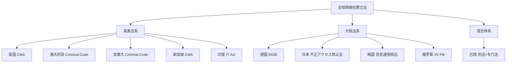
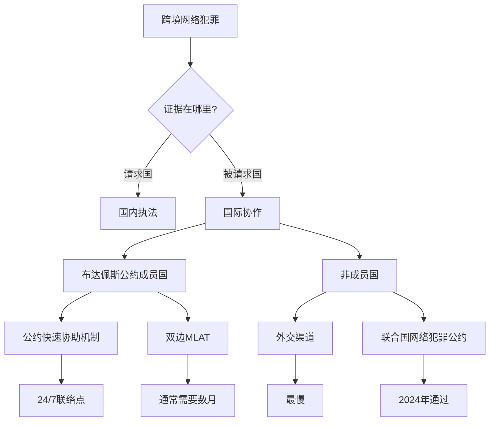

## 2.4 其他国家的法律

前几节分别介绍了中国、美国和欧盟的网络安全法律体系。然而网络犯罪没有国界——攻击者可能在巴西，服务器在新加坡，受害者在日本。理解主要国家和地区的法律框架，不仅能帮助安全从业者规避跨境合规风险，更能在国际协作、跨国取证、漏洞披露等场景中做出正确判断。

本节覆盖英国、日本、德国、澳大利亚、韩国、加拿大、新加坡、巴西、俄罗斯和印度等代表性国家的法律体系，每个国家从**立法背景**、**核心罪名**、**处罚力度**和**对安全从业者的启示**四个维度展开。

### 2.4.1 全球网络犯罪法律概览

在逐国展开之前，先建立一个全局视角。下表汇总了主要国家的核心法律、生效年份和关键特征：

| 国家/地区 | 核心法律 | 生效年份 | 关键特征 |
|-----------|----------|----------|----------|
| 英国 | Computer Misuse Act (CMA) | 1990（多次修订） | 三级罪行体系，含"未经授权造成严重损害" |
| 日本 | 不正アクセス禁止法 | 1999（2012修订） | 强调"标识符"保护，处罚持有他人凭证 |
| 德国 | StGB §202a-§202d, §303a-§303c | 2007修订（StGB modernisiert） | "黑客工具"制造/传播单独入罪 |
| 澳大利亚 | Criminal Code Act 1995, Part 10.7 | 1995（2001修订） | 联邦/州双轨制，涵盖联邦计算机和非联邦计算机 |
| 韩国 | 정보통신망 이용촉진 및 정보보호 등에 관한 법률 | 1986（多次修订） | 严格的数据泄露通知义务 |
| 加拿大 | Criminal Code, Part VI | 1985（2014修订） | "未经授权使用计算机服务"独立罪名 |
| 新加坡 | Computer Misuse Act (CMA) | 1993（2017修订） | 涵盖境外行为的域外管辖权 |
| 巴西 | Lei Carolina Dieckmann (Lei 12.737/2012) | 2012 | 因名人照片泄露事件推动立法 |
| 俄罗斯 | УК РФ §272-§274 | 1996（多次修订） | 严控密码学使用，安全研究受严格限制 |
| 印度 | Information Technology Act | 2000（2008修订） | "网络安全事件"报告义务，涵盖电子治理 |

### 2.4.2 英国：计算机滥用法案（Computer Misuse Act）

#### 立法背景

1990年，英国发生了一起标志性案件——一群黑客入侵了英国电信（British Telecom）的Prestel系统，其中包括著名黑客Robert Schifreen和Steve Gold。当时英国没有专门针对计算机入侵的法律，检方只能依赖《伪造文书法》（Forgery Act）起诉。上议院最终推翻了定罪，认为计算机数据不属于"文书"。这一判决直接催生了1990年的《计算机滥用法案》（Computer Misuse Act, CMA）。

#### 三级罪行体系

CMA建立了三层递进的罪行结构，每一层都建立在前一层的基础上：

**第一级：未经授权访问计算机资料（Section 1）**
- 构成要件：（a）意图访问计算机上的程序或数据；（b）未经授权；（c）明知自己未经授权
- 刑罚：最高6个月监禁和/或罚款（标准等级）
- 典型场景：猜测他人密码登录系统、利用默认凭证访问后台

**第二级：以实施进一步犯罪为目的的未经授权访问（Section 2）**
- 构成要件：在第一级的基础上，访问的目的在于实施或协助实施进一步犯罪（欺诈、盗窃等）
- 刑罚：最高5年监禁和/或无限额罚款
- 典型场景：入侵银行系统为后续转账欺诈做准备

**第三级：未经授权修改计算机资料（Section 3）**
- 构成要件：（a）未经授权修改计算机资料；（b）意图修改或明知会造成修改；（c）知道修改是未经授权的
- 刑罚：最高10年监禁和/或无限额罚款
- 典型场景：植入后门、删除日志、加密文件（勒索软件）、DDoS攻击（通过过载修改系统状态）

#### 重要修订：2006年警察与司法法案

2006年修订新增了**Section 3ZA**——"未经授权访问或修改计算机资料造成或造成严重损害的罪行"（unauthorised acts causing, or creating risk of, serious damage）。这是针对以下场景的回应：

- 关键基础设施攻击（电力、水利、通信）
- 造成经济损失超过500万英镑或危害人类健康/国家安全
- 刑罚：最高10年监禁（如涉及国家安全、人类健康或经济损失），或最高2年监禁（其他情况）

#### 2015年修订：Serious Crime Act 2015

进一步加重了第三级罪行的刑罚，从最高10年提升到**最高14年**，并明确了"用于实施严重犯罪"时的加重情节。

#### 对安全从业者的启示

- 英国法律明确要求**主观明知**（knowledge）——误触系统不应被定罪
- CMA没有美国CFAA那样的"授权"模糊地带——英国法院对"授权"的解释相对明确
- 渗透测试合同在英国同样具有法律保护作用，但合同中需明确授权的具体行为和范围
- 英国的**Computer Misuse Act**常被简称为CMA，注意与新加坡的同名法案（也是CMA）区分

### 2.4.3 日本：不正アクセス禁止法

#### 立法背景

1999年制定，全称为《不正アクセス行為の禁止等に関する法律》。日本在1990年代经历了多次大规模网络入侵事件，包括1998年日本大学入学考试系统遭入侵事件，直接推动了立法进程。2012年进行了重要修订，加重了刑罚并扩展了行为范围。

#### 核心禁止行为

**1. 不正アクセス行為（未经授权访问行为）**

日本法律对"不正访问"的定义非常独特且严格。它不仅包括传统的密码猜测和漏洞利用，还明确规定了以下行为：

- **回避访问控制**（識別符号の入力以外の方法で制御を回避する行為）：绕过认证机制，包括利用Web应用漏洞（SQL注入、XSS等）获取未授权访问
- **利用他人标识符**（他人の識別符号を入力して特定電子計算機を利用する行為）：使用他人的ID和密码访问系统
- **辅助行为**（他人に不正アクセス行為をさせるために特定電子計算機に識別符号を入力させる行為）：诱导他人输入标识符（钓鱼攻击的技术层面）

**2. 識別符号の不正保管（标识符的不当保管）**

日本法律的一个独特之处——**持有他人的ID和密码本身就是犯罪**，即使尚未使用。这在其他国家的法律中极为少见。具体包括：

- 不当获取（窃取、购买、捡拾）他人的标识符并加以保管
- 最高1年监禁和/或50万日元罚款

**3. 識別符号の不正取得（标识符的不当获取）**

通过以下方式获取他人标识符：

- 窃取、欺骗、胁迫
- 向特定电子计算机输入与该标识符相关联的信息并获取响应
- 最高3年监罚和/或100万日元罚款

**4. 不正アクセス助長行為（助长不正访问的行为）**

2012年修订新增——**公开可供不正访问使用的标识符**：

- 在论坛、社交媒体上公开泄露的账号密码
- 提供暴力破解工具并附带使用说明
- 最高1年监禁和/或50万日元罚款

#### 2012年修订要点

| 修订前 | 修订后 |
|--------|--------|
| 不正访问：最高1年监禁 | 不正访问：最高3年监禁 |
| 仅处罚实际访问行为 | 扩展至"助长"行为 |
| 未涵盖标识符公开 | 明确禁止公开他人标识符 |

#### 对安全从业者的启示

- 日本法律对**凭证保护**的关注程度远超其他国家——仅仅"持有"他人密码就构成犯罪
- 漏洞赏金计划在日本需要特别谨慎——PoC中涉及的凭证获取可能触发"标识符不当取得"
- 安全研究人员在分享技术文章时，绝不能包含真实的他人凭证
- 日本法律对"访问控制"的定义包括应用层控制，这意味着利用Web漏洞的行为明确属于"不正访问"

### 2.4.4 德国：刑法典与信息安全法

#### 立法体系

德国采用**刑法典（Strafgesetzbuch, StGB）**中嵌入专门条款的方式，而非制定独立的计算机犯罪法。核心条款包括：

#### §202a 数据窥探（Ausspähen von Daten）

- **构成要件**：为获取自己或第三人不法利益，绕过特别设计的访问保护（特别编码的安全措施），为自己或第三人获取不属于自己的、不公开的数据
- **刑罚**：最高3年监禁或罚款
- **关键概念**："特别编码的安全措施"（besonders gesicherte Zugangsberechtigung）——密码、加密等技术保护措施

#### §202b 数据拦截（Abfangen von Daten）

- **构成要件**：通过技术手段拦截不属于自己的、通过特别安全措施传输的数据
- **刑罚**：最高2年监禁或罚款
- **典型场景**：网络嗅探、中间人攻击

#### §202c 预备行为（Vorbereiten des Ausspähens und Abfangens von Daten）

**这是德国法律最具特色也最具争议的条款**——将制作、获取、销售、分发"黑客工具"的行为独立入罪：

- 制作、获取、销售、提供、分发**密码**或其他安全代码，目的是用于§202a或§202b的犯罪
- 制作、获取、销售、提供、分发**专门用于绕过访问保护或拦截数据的计算机程序**，目的是实施上述犯罪
- **刑罚**：最高2年监禁或罚款

**安全研究豁免**：§202c第3款明确规定了"特权目的"（privilegierte Zwecke）——为保护信息系统安全或用于官方目的而持有上述工具的行为不受处罚。

#### §303a 数据篡改（Datenveränderung）

- 故意删除、抑制、使不可用或修改不属于自己的数据
- 最高2年监禁或罚款

#### §303b 计算机破坏（Computersabotage）

- 通过破坏、损坏、抑制、使不可用或修改数据处理系统，对他人造成重大损害
- 最高3年监禁（情节严重的最高10年）
- **关键基础设施攻击**在此条款下从重处罚

#### §303c 组织（第303a-303b条）

要求德国联邦宪法保护局（Bundesamt für Verfassungsschutz）可监控涉及上述犯罪的通信。

#### 对安全从业者的启示

- 德国是**唯一明确将"黑客工具制造/分发"单独入罪的主要国家**
- 渗透测试工具（Metasploit、Cobalt Strike等）的持有和使用在德国需要严格的安全研究豁免理由
- 德国法律要求"不法获利目的"（Vorsatz + Unrechtsvereinbarung），这为善意安全研究提供了缓冲
- 建议德国的安全从业者保存完整的授权文件和测试目的说明

### 2.4.5 澳大利亚：Criminal Code Act 1995, Part 10.7

#### 立法框架

澳大利亚的网络犯罪法律采取**联邦-州双轨制**。联邦层面的《Criminal Code Act 1995》第10.7节专门规定了计算机犯罪，但各州也有自己的补充立法。

#### 核心罪名

**Section 477.1 — 非法访问/修改/控制联邦计算机**
- 未经授权访问联邦计算机（Commonwealth computer）
- 最高10年监禁

**Section 477.2 — 利用联邦计算机实施严重犯罪**
- 以实施可公诉犯罪为目的访问联邦计算机
- 最高5年监禁（与基础犯罪并罚）

**Section 477.3 — 非法修改联邦计算机数据**
- 未经授权修改、删除或损坏联邦计算机中的数据
- 最高10年监禁

**Section 478.1 — 非法访问/修改/控制非联邦计算机**
- 未经授权访问非联邦计算机（即所有非政府系统）
- 最高2年监禁（基础）/最高10年（造成损害或意图获利）

**Section 478.2 — 控制非联邦计算机**
- 未经授权控制他人计算机
- 最高3年监禁

**Section 478.3 — 非法修改/损害非联邦计算机数据**
- 最高2年监禁（基础）/最高10年（造成损害或意图获利）

#### 澳大利亚的独特之处

- **"意图"门槛较低**：澳大利亚法律对"意图"的认定相对宽松——"鲁莽"（recklessness）即可构成犯罪，而不仅仅是"故意"
- **"联邦计算机"概念**：任何连接到联邦网络的计算机，即使物理上不在联邦管辖范围内，也可能被视为"联邦计算机"
- **域外管辖**：澳大利亚公民在海外实施的针对澳大利亚计算机的犯罪，同样受澳大利亚法律管辖
- **Section 474.14** — 使用电信网络实施严重犯罪（carriage service offence），利用互联网实施任何严重犯罪都可能被追加此罪名

#### 对安全从业者的启示

- 澳大利亚对"鲁reckless"行为的追诉比美国和英国更积极
- "联邦计算机"的定义范围可能比预期更广——为澳大利亚政府提供服务的云服务器、SaaS平台都可能涉及
- 漏洞披露时建议首先联系Australian Cyber Security Centre (ACSC)

### 2.4.6 韩国：信息通信网法

#### 立法背景

韩国作为全球互联网普及率最高的国家之一（2024年互联网普及率超过97%），其网络安全法律体系相对完善。核心法律为《信息通信网利用促进及信息保护等相关法律》（정보통신망 이용촉진 및 정보보호 등에 관한 법률），简称"信息通信网法"。

#### 核心条款

**第48条 — 禁止侵入信息通信网**
- 未经授权访问他人信息通信系统
- 利用技术手段绕过访问控制
- 处罚：3年以下有期徒刑或3000万韩元以下罚款

**第48条之2 — 禁止恶意程序传播**
- 制作、传播、植入计算机病毒、蠕虫等恶意程序
- 处罚：5年以下有期徒刑或5000万韩元以下罚款

**第48条之3 — 禁止数据损毁**
- 故意删除、修改、损坏他人存储的数据
- 处罚：5年以下有期徒刑或5000万韩元以下罚款

**第49条 — 数据泄露通知义务**
- 信息通信服务提供者在发生数据泄露事件时，必须**立即**通知韩国互联网振兴院（KISA）和受影响用户
- 未履行通知义务的，处以3000万韩元以下罚款

#### 韩国的独特之处

- **个人信息保护极其严格**：韩国个人信息保护委员会（PIPC）的执法力度在亚洲首屈一指
- **游戏行业特别关注**：作为游戏大国，韩国对游戏外挂、私服的打击力度极大
- **网络实名制历史**：韩国曾实施网络实名制（2007-2012），后因宪法法院裁定违宪而废除，但对网络安全法律的影响仍在
- **快速响应机制**：KISA设有24小时网络安全事件响应中心

### 2.4.7 加拿大：Criminal Code Part VI

#### 核心罪名

加拿大《刑法典》第VI部分"侵犯隐私的犯罪"中包含计算机相关条款：

**Section 342.1 — 未经授权使用计算机服务**
- 未经授权使用计算机系统或数据
- 最高10年监禁（可公诉罪行）或2年监禁（简易程序）

**Section 342.2 — 拥有用于实施计算机犯罪的设备**
- 持有专门用于实施计算机犯罪的设备
- 最高2年监禁

**Section 430(1.1) — 损坏计算机数据**
- 故意损坏或篡改计算机数据
- 最高10年监禁

加拿大法律的独特之处是将"未经授权使用计算机服务"**单独列为独立罪名**——这意味着不仅访问数据是犯罪，利用他人计算机的计算资源（如挖矿、DDoS僵尸网络）本身也是独立的犯罪行为。

#### 2014年修订：保护加拿大人网络法（Protecting Canadians from Online Crime Act, Bill C-13）

- 赋予执法机构更大的网络监控权力
- 允许在合理怀疑下获取传输数据（transmission data）
- 新增了"非自愿亲密图像"（revenge porn）相关条款

### 2.4.8 新加坡：计算机滥用法（Computer Misuse Act）

#### 立法特色

新加坡的CMA源自英国，但经过多次修订后形成了自己独特的法律特征：

**域外管辖权**：新加坡CMA最显著的特点是其**域外管辖条款**——任何人（无论是否新加坡公民）在新加坡境外实施的针对新加坡计算机的犯罪，均可在新加坡受审。

**2017年网络安全法（Cybersecurity Act 2017）**
- 建立了关键信息基础设施（CII）保护框架
- 赋予网络安全专员（Commissioner of Cybersecurity）广泛的调查权力
- CII运营者必须遵守网络安全标准、报告安全事件、配合调查

#### 核心罪名

| 罪名 | 条款 | 刑罚 |
|------|------|------|
| 未经授权访问 | §3 | 最高2年监禁和/或5000新元罚款 |
| 以实施犯罪为目的的未授权访问 | §4 | 最高5年监禁和/或10000新元罚款 |
| 未经授权修改 | §5 | 最高3年监禁和/或10000新元罚款 |
| 未经授权使用或拦截服务 | §6 | 最高3年监禁和/或10000新元罚款 |
| 未经授权披露访问代码 | §8 | 最高3年监禁和/或10000新元罚款 |

#### 对安全从业者的启示

- 新加坡的域外管辖权意味着即使你不在新加坡，针对新加坡系统的攻击也可能被追诉
- 新加坡网络安全局（CSA）设有SingCERT，是亚洲地区响应速度最快的CERT之一
- 新加坡对关键基础设施的保护标准要求极高，金融机构的渗透测试合规要求特别严格

### 2.4.9 巴西：从Dieckmann事件到系统立法

#### 立法背景

2012年，巴西女演员Carolina Dieckmann的私人照片被黑客入侵其云账户后泄露。这一事件在巴西引发巨大公众关注，直接推动了巴西第一部专门针对计算机犯罪的法律——《第12.737号法律》（Lei 12.737/2012），俗称"Carolina Dieckmann法"。

#### 核心条款

**Art. 154-A — 入侵计算机设备**
- 未经授权或超越授权访问他人计算机系统
- 通过安装漏洞利用代码（vírus ou qualquer programa de computador）实现访问
- 刑罚：3个月至1年监禁和罚款

**Art. 154-B — 扩展处罚**
- 泄露、获取或篡改通过上述方式获得的数据
- 与Art. 154-A并罚

**Marco Civil da Internet（互联网民法框架，2014年）**
- 巴西的"互联网宪法"——建立了互联网使用的基本规则
- 保护用户隐私和言论自由
- 要求互联网服务提供商在特定条件下保留用户连接记录（connection logs）1年

#### 巴西的独特之处

- 巴西是拉丁美洲网络犯罪立法最完善的国家
- 2020年LGPD（Lei Geral de Proteção de Dados，通用数据保护法）生效，对标欧盟GDPR
- 巴西联邦警察设有专门的网络犯罪调查部门

### 2.4.10 俄罗斯：刑法典中的计算机犯罪条款

#### 核心条款

俄罗斯联邦刑法典（Уголовный кодекс РФ）第28章"计算机信息安全领域的犯罪"包含以下条款：

**§272 — 非法访问计算机信息**
- 为获取、修改或销毁计算机信息而非法访问
- 造成重大损害的，处2年以下有期徒刑或罚款
- 有组织团伙实施的，处最高5年有期徒刑

**§273 — 制作、传播和使用恶意程序**
- 制作、传播计算机程序或修改已有的程序，用于非法获取、销毁、阻塞、修改或复制信息
- 处3年以下有期徒刑或罚款
- 造成严重后果的，处最高7年有期徒刑

**§274 — 违反计算机信息系统的使用规则**
- 违反信息存储、处理或传输规则，造成重大损害
- 处最高5年有期徒刑

**§274.1 — 影响关键信息基础设施**
- 2016年新增——对俄罗斯关键信息基础设施的攻击
- 处最高10年有期徒刑

#### 对安全从业者的特殊限制

俄罗斯的法律环境对安全从业者有几个独特挑战：

- **密码学管制**：俄罗斯对加密工具的使用有严格限制，外国开发者的加密产品可能需要获得FSB的许可
- **安全工具管制**：提供渗透测试服务需要获得俄罗斯联邦安全局（FSB）的特别许可
- **跨境数据**：2015年修正案要求所有涉及俄罗斯公民个人数据的处理必须在俄罗斯境内进行（数据本地化）
- **Yarovaya法（2016年）**：要求通信运营商保存通话内容6个月、通信元数据3年，增加了安全审计的复杂性

### 2.4.11 印度：信息技术法

#### 立法背景

印度于2000年颁布《信息技术法》（Information Technology Act, IT Act），2000年10月17日正式生效。2008年进行了重大修订，大幅扩展了网络犯罪的范围。2023年，印度开始推进《数字个人数据保护法》（Digital Personal Data Protection Act），但其网络犯罪相关条款仍在IT Act框架内。

#### 核心条款

**Section 43 — 未授权访问和损害计算机系统**
- 未经授权访问、下载、复制、引入病毒等
- 处罚：向受害者赔偿，无上限
- 这是**民事责任**条款——受害者可直接索赔

**Section 66 — 计算机相关犯罪**
- 以欺诈或不诚实意图实施Section 43所列行为
- 刑罚：最高3年监禁和/或50万卢比罚款

**Section 66A — 发送攻击性信息（已于2015年被最高法院废除）**
- 2015年3月24日，印度最高法院在Shreya Singhal v. Union of India案中裁定此条款违宪
- 该条款曾因过于宽泛（将发送"攻击性"或"令人不安"的信息定为犯罪）而被广泛滥用

**Section 66B — 骗取计算机资源**
- 明知是偷来的计算机设备或通信设备而接收
- 最高3年监禁和/或10万卢比罚款

**Section 66C — 身份盗窃**
- 欺诈性或不诚实地使用他人的电子签名、密码或其他唯一标识
- 最高3年监禁和/或10万卢比罚款

**Section 66D — 冒充**
- 通过计算机资源冒充他人
- 最高3年监禁和/或10万卢比罚款

**Section 66E — 侵犯隐私**
- 捕获、发布或传输他人私密区域的图像
- 最高3年监禁和/或20万卢比罚款

**Section 66F — 网络恐怖主义**
- 2008年修订新增——以威胁国家统一、安全或主权为目的的网络攻击
- 最高无期徒刑

#### 印度的独特之处

- **CERT-In（印度计算机应急响应小组）**：2022年发布新规，要求所有网络安全事件必须在**6小时内**报告——这是全球最短的报告时限之一
- **VPN管制**：2022年CERT-In要求VPN提供商保存用户数据5年，导致多家VPN服务商撤出印度
- **中间人责任**：IT Act Section 79对互联网中介平台的免责条件有详细规定
- **密码学使用**：印度对加密工具的管制相对宽松，但对加密货币的监管日趋严格

### 2.4.12 其他值得关注的国家

#### 以色列

以色列是全球网络安全产业最发达的国家之一（人均网络安全初创企业数量全球第一）。其法律框架包括：

- **Computer Law, 1995**（מחשבים, התשנ"ה-1995）：禁止未经授权访问、传播恶意程序
- **Privacy Protection Law**：对个人数据保护有严格要求
- **以色列国防军8200部队**：既是军事网络情报单位，也是网络安全人才的摇篮

#### 越南

- **网络安全法（2019年生效）**：要求互联网公司在越南境内存储数据
- **政府审查权力广泛**：政府可在"国家安全"名义下要求删除内容

#### 印度尼西亚

- **ITE法（Informasi dan Transaksi Elektronik, 2008年）**：涵盖在线诽谤、网络色情、未经授权访问
- 多次因被用于压制言论自由而受到批评

### 2.4.13 国际协作与跨境执法

网络犯罪的跨国性质使得国际合作成为必然。以下是主要的国际合作机制：

#### 《布达佩斯网络犯罪公约》（Budapest Convention on Cybercrime）

- 2001年由欧洲委员会（Council of Europe）主导制定，2004年生效
- **全球首个也是目前最全面的网络犯罪国际条约**
- 截至2024年，已有68个国家签署/批准
- 中国、俄罗斯、印度**未签署**——这导致跨境执法协作面临重大障碍

公约的核心要求：
1. 将主要的网络犯罪行为统一入罪化
2. 建立电子证据收集的快速协助机制（24/7联络点）
3. 统一跨境数据保全和提供程序

#### 国际刑警组织（INTERPOL）

- 设有全球复杂威胁与分析部门（Complex Threats and Analysis Directorate）
- 运营I-24/7通信网络连接195个成员国
- 定期开展联合行动（如Operation HAECHI打击网络诈骗）

#### 双边司法协助条约（MLAT）

- 各国间签订的司法协助条约是目前跨境网络犯罪取证的主要法律途径
- 典型流程：请求国→司法部→被请求国司法部→执行
- **主要问题**：耗时长（通常数月至数年），难以满足电子证据的时效要求

#### 《第二份补充议定书》（Second Additional Protocol）

2022年通过的《布达佩斯公约第二份补充议定书》（尚未生效）新增了：
- 直接向其他国家服务提供商获取电子证据的程序
- 紧急情况下24小时内共享用户数据
- 扩大联合调查团队的法律基础

### 2.4.14 对安全从业者的实操建议

#### 跨国项目的法律合规检查清单

在开展跨国安全项目时，建议按照以下清单进行法律合规检查：

| 检查项 | 具体内容 | 优先级 |
|--------|----------|--------|
| 目标系统所在地法律 | 确认目标服务器所在国家的网络安全法律 | 必须 |
| 攻击者所在地法律 | 确认你执行测试所在地的法律要求 | 必须 |
| 数据所在地法律 | 确认测试过程中涉及的数据存储位置 | 必须 |
| 授权文件 | 获取书面授权，明确范围、时间、方法 | 必须 |
| 数据处理协议 | 如涉及个人数据，签署DPA | 高 |
| 域外管辖条款 | 检查目标国家是否有域外管辖权 | 高 |
| 保密义务 | 确认测试结果的保密范围 | 高 |
| 应急响应联络 | 确认测试前、中、后的联络机制 | 中 |

#### 各国安全研究的友好程度对比

| 国家 | 安全研究友好度 | 漏洞披露保护 | 渗透测试许可 | 工具持有风险 |
|------|----------------|--------------|--------------|--------------|
| 美国 | ★★★★☆ | 好（有CFAA reform趋势） | 需要书面授权 | 低 |
| 英国 | ★★★★☆ | 较好 | 需要书面授权 | 低 |
| 德国 | ★★★☆☆ | 一般 | 需要书面授权+保存记录 | **高**（§202c） |
| 日本 | ★★☆☆☆ | 弱 | 需要严格授权 | 中（持有凭证即可入罪） |
| 韩国 | ★★★☆☆ | 一般 | 需要书面授权 | 中 |
| 新加坡 | ★★★☆☆ | 较好 | 需要书面授权 | 低 |
| 俄罗斯 | ★☆☆☆☆ | 极弱 | 需要FSB许可 | **极高** |
| 中国 | ★★☆☆☆ | 弱 | 需要书面授权+等保要求 | 高 |
| 巴西 | ★★★☆☆ | 一般 | 需要书面授权 | 中 |
| 印度 | ★★☆☆☆ | 弱（6小时报告） | 需要书面授权 | 中 |

#### 常见误区与纠正

**误区一："我在海外服务器上测试，所以不受本国法律约束"**
- 纠正：大多数国家对公民的域外行为有管辖权。美国CFAA适用于美国公民在全球范围内的行为，中国刑法同样如此。

**误区二："使用VPN隐藏来源就不会被追诉"**
- 纠正：VPN提供商在很多国家有配合执法的义务。2022年印度CERT-In要求VPN保存用户数据，许多国家也有类似要求。技术上无法完全匿名。

**误区三："开源工具就是合法的"**
- 纠正：德国§202c明确将黑客工具的分发入罪。工具本身的合法性取决于使用目的和持有意图，而非是否开源。

**误区四："国际大公司的安全团队不需要考虑各国法律"**
- 纠正：大公司更需要——因为它们的基础设施分布在全球各地，一个国家的违规可能影响全球业务。2018年Equifax数据泄露事件影响了全球1.47亿用户，该公司同时面临美国FTC、英国ICO等多国监管机构的处罚。

### 2.4.15 进阶：法律发展趋势

#### 全球立法趋势

1. **供应链安全立法**：越来越多国家开始关注供应链安全——如美国2021年关于软件物料清单（SBOM）的行政命令、欧盟NIS2指令对供应链安全的要求
2. **人工智能安全**：AI生成的深度伪造（deepfake）、AI辅助攻击等新型威胁正在推动新的立法
3. **勒索软件专项立法**：2022-2024年，多个国家（澳大利亚、美国、新加坡）针对勒索软件出台了专项法律或政策
4. **负责任披露的法律保护**：越来越多的国家开始在法律层面保护善意的安全研究人员——如美国2022年的CFAA reform（Van Buren v. United States案）
5. **数据本地化**：俄罗斯、中国、印度、越南等国要求数据在本地存储，增加了安全从业者跨境工作的复杂性

#### 值得关注的判例

- **Van Buren v. United States (2021)**：美国最高法院对CFAA"超越授权"进行了限缩解释——仅有权访问系统但超越授权使用数据的行为，不属于CFAA管辖
- **Lloyd v. Google LLC (2021)**：英国最高法院对数据泄露集体诉讼的门槛做了重要裁决
- **Schrems II (2020)**：欧盟法院推翻了欧美隐私盾（Privacy Shield），对跨境数据传输产生深远影响

### 2.4.16 本节小结

各国网络安全法律体系虽然在具体条款上存在差异，但在以下几个方面呈现趋同趋势：

1. **未经授权访问计算机系统**在全球范围内都是犯罪行为
2. **数据保护和个人隐私**日益受到重视
3. **关键基础设施保护**成为各国立法重点
4. **跨境协作**机制正在逐步完善
5. **安全研究豁免**在越来越多国家获得法律认可

对于安全从业者而言，核心原则始终是：**获取书面授权、明确测试范围、尊重数据隐私、遵守当地法律**。在跨国项目中，建议咨询当地的法律专业人士，而不是仅凭自己的理解判断合规性。网络空间不是法外之地——无论你身在何处，法律都在那里。
