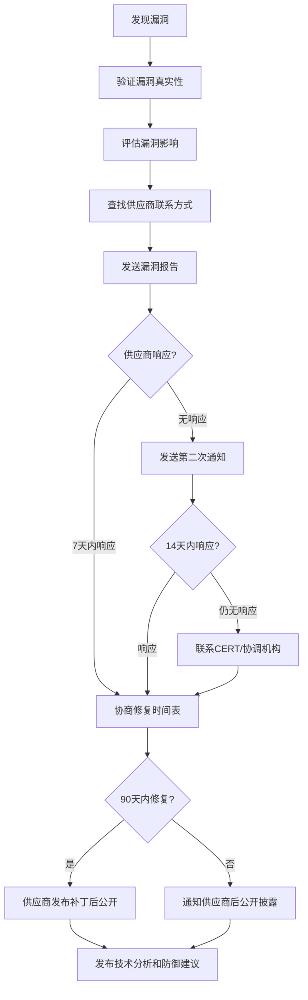

## 2.6 安全从业者的道德准则

安全从业者掌握着足以瘫痪基础设施、泄露数亿人隐私、动摇公众对数字世界信任的技术能力。这种能力本身是中性的——它既可用于守护，也可用于破坏。道德准则不是写在纸上的装饰品，而是区分"安全专家"与"技术罪犯"的唯一分界线。本节从行业组织的道德规范、安全研究员的行为准则、漏洞披露的伦理实践、新兴技术的道德挑战四个维度，系统阐述安全从业者应当遵守的道德准则。

---

### 2.6.1 为什么安全从业者需要道德准则

#### 技术能力与道德责任的不对称性

一名渗透测试工程师可以在数小时内找到企业网络中的关键漏洞，一名逆向工程师可以在几天内破解一个加密方案，一名社会工程学专家可以在几通电话内获取高管的密码。这些能力的破坏力远远超过物理世界的等价行为——一次数据泄露可能影响数亿人，一次勒索软件攻击可能导致医院停摆、供应链断裂。

这种能力与责任的不对称性，决定了安全行业不能仅靠法律来约束从业者。法律是底线，道德是上限。法律告诉你"不能做什么"，道德告诉你"应该做什么"。

#### 行业信任的基石

安全行业的商业模式建立在信任之上。企业允许渗透测试团队进入其核心网络，是因为信任他们的职业操守。政府将关键基础设施的安全评估交给第三方，是因为信任他们的道德标准。一旦这种信任被打破——无论是因为个别从业者的不当行为，还是因为行业整体缺乏统一的道德规范——整个行业将面临信任危机。

#### 法律的滞后性

网络安全技术发展极快，而法律的制定和修改是一个缓慢的过程。在AI安全、物联网安全、量子计算安全等新兴领域，往往缺乏明确的法律规定。在这种情况下，道德准则成为从业者自我约束的重要工具，填补法律空白地带的行为指南。

---

### 2.6.2 主要行业组织的道德准则

安全行业的主要认证机构和专业组织都制定了明确的道德准则，违反这些准则可能导致认证被撤销、行业声誉受损甚至法律追诉。

#### ISC²道德准则（CISSP等认证持有者）

ISC²（International Information System Security Certification Consortium，国际信息系统安全认证联盟）是全球最大的信息安全认证机构，其颁发的CISSP认证持有者必须遵守以下四条道德准则：

| 准则 | 核心要求 | 具体行为 |
|------|----------|----------|
| 保护社会 | 维护公共利益和公共信任 | 不参与损害社会的行为；发现威胁公共安全的漏洞时及时报告 |
| 行为得体 | 以荣誉、诚实、公正、合法的方式行事 | 不伪造资质；不歪曲事实；不因利益冲突而损害客户利益 |
| 提供优质服务 | 以勤奋和胜任的方式为委托人服务 | 不承接超出能力范围的工作；持续提升专业技能；保守客户秘密 |
| 发展和保护职业 | 推进行业发展，维护行业声誉 | 知识共享；指导后辈；不从事损害行业声誉的行为 |

ISC²设有道德委员会，负责调查违反准则的行为。严重违规者将被撤销所有ISC²认证，并在行业公告中公开通报。截至2025年，ISC²已处理数百起道德投诉案件，其中约15%导致认证被撤销。

#### EC-Council道德准则（CEH等认证持有者）

EC-Council（国际电子商务顾问委员会）是CEH（Certified Ethical Hacker）认证的颁发机构。其道德准则强调"黑客思维，道德行为"：

1. **合法授权原则**：所有安全测试必须获得系统所有者的书面授权
2. **最小损害原则**：测试过程中不得故意造成超出必要范围的损害
3. **数据保护原则**：测试过程中发现的数据必须严格保密，不得泄露或滥用
4. **持续学习原则**：保持技术能力的持续更新，确保服务质量
5. **法律合规原则**：严格遵守所在国家和地区的法律法规

EC-Council的认证持有者必须在每三年的认证更新周期内签署道德承诺书。违反道德准则的行为经调查确认后，将被永久撤销认证并列入黑名单。

#### Offensive Security道德准则（OSCP等认证持有者）

Offensive Security（OffSec）是OSCP（Offensive Security Certified Professional）认证的颁发机构，其道德准则的核心是"Try Harder"精神与负责任的攻击性安全实践：

- **只攻击授权目标**：未经书面授权，不得对任何系统进行安全测试
- **尊重数据隐私**：测试中接触到的所有数据视为机密
- **负责任地披露**：发现的漏洞必须通过负责任的披露流程报告
- **不提供攻击武器**：不得将OffSec培训中学习的技术用于非法目的

#### OWASP道德准则

OWASP（Open Web Application Security Project，开放式Web应用程序安全项目）虽然不是认证机构，但其道德准则对Web安全从业者具有重要指导意义：

1. **不作恶**（Do No Harm）：安全研究的目的是提升安全性，而非造成破坏
2. **负责任地分享**：技术分享必须考虑潜在的滥用风险
3. **尊重隐私**：不收集、存储或泄露超出研究必要范围的个人数据
4. **透明性**：研究方法和发现应当透明，接受同行审查
5. **独立性**：研究结论不受商业利益或政治压力的影响

#### 各组织道德准则对比

| 维度 | ISC² | EC-Council | OffSec | OWASP |
|------|------|------------|--------|-------|
| 核心理念 | 守护社会 | 合法黑客 | 负责任攻击 | 不作恶 |
| 适用对象 | 安全管理人员 | 渗透测试人员 | 攻击性安全人员 | Web安全从业者 |
| 违规后果 | 撤销CISSP等认证 | 撤销CEH等认证 | 撤销OSCP等认证 | 社区谴责/移除贡献者身份 |
| 强制力 | 道德委员会调查 | 签署承诺书 | 签署道德协议 | 社区自律 |
| 覆盖范围 | 全面（管理+技术） | 侧重技术操作 | 侧重攻击技术 | 侧重Web安全 |

---

### 2.6.3 安全研究员的行为准则

安全研究员是安全行业中技术能力最强、道德风险最高的群体。他们的工作本质上是在寻找和利用系统弱点，这种能力如果缺乏道德约束，后果不堪设想。

#### 研究前的道德准备

在开始任何安全研究之前，研究员必须完成以下道德准备：

**1. 明确研究目的**

研究目的必须是合法且正当的。正当的研究目的包括：
- 在授权范围内评估系统安全性
- 学习和提升安全技术能力
- 发现并报告安全漏洞以提升整体安全水平
- 开发安全工具和防御方案

不正当的研究目的包括：
- 未经授权探测他人系统
- 为获取经济利益而寻找可利用的漏洞
- 受雇于恶意组织进行攻击性研究
- 出于好奇心或炫耀心理探测他人系统

**2. 获取合法授权**

授权是区分合法研究与非法入侵的唯一标准。一份完整的授权书应包含：

```text
┌─────────────────────────────────────────────────┐
│              安全研究授权书要素                    │
├─────────────────────────────────────────────────┤
│ • 授权方与被授权方的完整信息                       │
│ • 明确的测试范围（IP/域名/应用/端口）              │
│ • 测试时间窗口（开始时间/结束时间）                │
│ • 允许使用的测试方法和工具清单                     │
│ • 禁止行为清单（如禁止DoS、禁止数据修改）          │
│ • 紧急联系人和联系方式                            │
│ • 数据处理和保密条款                              │
│ • 免责声明和责任划分                              │
│ • 双方签字和日期                                  │
└─────────────────────────────────────────────────┘
```

**3. 评估研究风险**

在开始研究前，必须评估潜在风险：
- **技术风险**：测试是否可能导致系统崩溃或数据丢失？
- **法律风险**：测试行为是否可能触犯当地法律？
- **隐私风险**：测试过程中是否可能接触到个人隐私数据？
- **声誉风险**：研究结果的公开是否可能对相关方造成声誉损害？

#### 研究中的道德约束

**1. 严格遵守授权范围**

授权范围是不可逾越的红线。常见的"越界"行为包括：
- 测试未授权的子域名或IP地址
- 使用授权范围外的攻击技术
- 访问授权范围外的数据
- 在授权时间窗口外继续测试

即使在测试过程中发现了范围外的严重漏洞，也不应自行深入探测，而应记录发现并向授权方报告，由授权方决定是否扩大测试范围。

**2. 最小化对系统的影响**

安全研究不应成为系统故障的原因。具体原则包括：
- 优先使用非侵入性技术（如被动信息收集、静态分析）
- 在可能的情况下使用测试环境而非生产环境
- 避免使用可能造成服务中断的攻击技术（如DoS攻击）
- 控制扫描速率，避免对系统造成过大负载
- 不修改生产数据，不创建后门账户

**3. 保护测试过程中发现的数据**

测试过程中可能接触到敏感数据，包括用户个人信息、商业机密、系统凭证等。研究员必须：
- 不复制超出研究必要范围的数据
- 对必须保留的数据进行加密存储
- 研究结束后彻底删除所有测试数据
- 不与未授权的第三方分享任何发现的数据
- 如果意外接触到明显的犯罪证据，应咨询法律顾问后决定处理方式

**4. 详细记录所有活动**

完整的测试日志是证明研究合法性的关键证据。应记录的内容包括：
- 每次测试的日期、时间、使用的工具和命令
- 测试结果和发现
- 发现的漏洞及其复现步骤
- 与授权方的所有沟通记录

#### 研究后的道德责任

**1. 负责任地披露漏洞**

负责任的漏洞披露（Responsible Disclosure）是安全研究道德的核心议题。完整的披露流程如下：



**2. 漏洞报告的规范格式**

一份专业的漏洞报告应包含以下内容：

```markdown
# 漏洞报告

## 基本信息
- 漏洞标题：[简洁描述漏洞类型和影响范围]
- 报告日期：[YYYY-MM-DD]
- 报告人：[姓名/联系方式]
- 严重程度：[Critical/High/Medium/Low]

## 漏洞描述
[详细描述漏洞的技术原理]

## 影响范围
[说明受影响的系统、版本、用户群]

## 复现步骤
1. [步骤1]
2. [步骤2]
3. [步骤3]

## 影响评估
[说明漏洞被利用后的潜在后果]

## 修复建议
[提供可行的修复方案]

## 附加信息
[截图、日志、PoC代码等]
```

**3. 保护受影响用户的隐私**

在漏洞披露过程中，必须保护受影响用户的隐私：
- 不公开任何可识别个人身份的信息
- 如果漏洞涉及用户数据泄露，在公开技术细节前确保数据已被保护
- 在技术演示中使用虚构数据或经过脱敏处理的数据

**4. 不利用发现的漏洞**

发现漏洞后，绝对不能利用漏洞进行以下行为：
- 访问、修改或删除未经授权的数据
- 获取经济利益（除非通过合法的漏洞赏金计划）
- 向第三方出售漏洞信息
- 公开未修复漏洞的完整利用代码（在合理期限内）

---

### 2.6.4 负责任漏洞披露的伦理实践

#### 披露模型对比

安全行业存在多种漏洞披露模型，每种模型都有其支持者和批评者：

| 模型 | 核心理念 | 优点 | 缺点 | 代表机构 |
|------|----------|------|------|----------|
| 负责任披露 | 先通知供应商，修复后再公开 | 给供应商修复时间，减少用户风险 | 可能被供应商拖延甚至忽略 | CERT/CC |
| 协调披露 | 多方协调，在最佳时机公开 | 平衡各方利益 | 流程复杂，协调成本高 | Google Project Zero |
| 完全公开 | 发现即公开 | 透明度高，迫使供应商快速响应 | 可能被恶意利用 | 早期安全社区 |
| 悬赏披露 | 通过漏洞赏金计划激励报告 | 经济激励驱动，流程规范 | 覆盖范围有限，奖励可能不足 | HackerOne/Bugcrowd |

#### 90天披露期限的实践

Google Project Zero于2015年提出的90天披露期限已成为行业标准。其核心规则：

- 发现漏洞后立即通知供应商
- 供应商有90天时间修复漏洞
- 90天后如果未修复，Google Project Zero将自动公开漏洞详情
- 如果漏洞正在被积极利用，披露期限缩短为7天
- 供应商可以申请最多14天的延期，但仅限特殊情况

这个标准的争议点在于：对于复杂系统，90天可能不够；对于简单漏洞，90天可能太长。实践中需要根据具体情况灵活调整。

#### 争议性披露场景的处理

**场景1：供应商完全不响应**

处理步骤：
1. 通过多种渠道尝试联系（邮件、安全团队、社交媒体）
2. 联系该供应商的上游供应商或合作伙伴
3. 向所在国家的CERT报告
4. 寻求行业组织（如FIRST）的协调帮助
5. 在合理等待期后（建议至少30天），考虑公开披露

**场景2：漏洞正在被积极利用（零日漏洞）**

当发现漏洞正在被恶意利用时，保护用户的安全优先于遵守常规披露流程：
1. 立即通知供应商和受影响的用户
2. 联系CERT和安全社区
3. 发布临时缓解措施（如WAF规则、配置变更建议）
4. 在供应商修复前，可以有限度地公开漏洞信息以帮助用户自我保护

**场景3：涉及国家安全**

涉及国家级漏洞的披露需要特殊处理：
1. 遵守所在国家的相关法律和政策
2. 通过政府指定的渠道报告
3. 评估公开披露是否可能危害国家安全
4. 寻求法律顾问的专业意见

---

### 2.6.5 安全从业者的隐私伦理

#### 数据最小化原则

安全从业者在工作中不可避免地会接触到大量数据，包括用户个人信息、企业商业机密等。数据最小化原则要求：

- **收集最小化**：只收集完成工作所必需的数据
- **使用最小化**：只在工作范围内使用收集到的数据
- **存储最小化**：工作完成后立即删除所有非必要数据
- **共享最小化**：不与未授权的第三方共享任何数据

#### 渗透测试中的隐私保护

渗透测试工程师在工作中可能接触到用户的密码、个人信息、通信内容等敏感数据。道德要求包括：

- 不查看超出测试必要范围的数据
- 不记录或复制个人敏感信息
- 不利用测试中获取的凭证访问个人账户
- 测试结束后彻底清除所有临时数据

#### 安全监控中的隐私平衡

安全运营中心（SOC）分析师需要监控大量的网络流量和系统日志，其中可能包含员工的个人通信。道德要求包括：

- 监控范围必须事先告知员工
- 不主动窥探与安全无关的个人通信
- 发现的个人信息不得用于安全以外的目的
- 监控数据的保留期限必须合理

---

### 2.6.6 AI与新兴技术的道德挑战

随着AI在安全领域的广泛应用，新的道德挑战不断涌现。

#### AI辅助安全研究的道德边界

AI工具（如大语言模型）可以极大提升安全研究效率，但也带来新的道德问题：

- **AI生成的漏洞利用代码**：如果AI被用于自动生成恶意代码，责任归属如何界定？
- **AI辅助的社会工程学**：AI生成的高度个性化钓鱼邮件，模糊了技术攻击与社会工程的边界
- **AI决策的可解释性**：当AI驱动的安全系统做出误判（如将合法流量标记为攻击），谁来承担责任？

#### 自动化安全工具的道德约束

自动化安全工具（如自动漏洞扫描器、自动化渗透测试平台）的道德约束：

1. **测试范围必须明确**：自动化工具不得扫描或攻击未授权的目标
2. **速率控制**：自动化测试不得对目标系统造成拒绝服务
3. **误报处理**：自动化工具的发现必须经过人工验证后再报告
4. **责任归属**：工具的使用者对工具的行为承担道德和法律责任

#### 数据安全与AI训练

使用真实数据训练安全AI模型时的道德考量：

- 训练数据中的个人信息必须经过脱敏处理
- 不使用非法获取的数据进行模型训练
- AI模型不应记住或泄露训练数据中的敏感信息
- 模型的输出不应被用于攻击目的

---

### 2.6.7 道德违规的后果与案例

#### 违规后果的层级

道德违规的后果从轻到重可以分为多个层级：

| 后层级 | 后果 | 适用情况 |
|--------|------|----------|
| 第一层 | 行业通报批评 | 轻微违规，如未按规定格式报告漏洞 |
| 第二层 | 暂停认证资格 | 中度违规，如超出授权范围测试 |
| 第三层 | 永撤认证 | 严重违规，如泄露客户数据 |
| 第四层 | 行业黑名单 | 极其严重，如利用漏洞牟利 |
| 第五层 | 法律追诉 | 触犯法律，如未经授权入侵系统 |

#### 典型道德违规案例

**案例1：利用职务之便获取利益**

某安全公司渗透测试工程师在为客户进行安全测试时，发现了客户系统中的严重漏洞。该工程师没有通过正规渠道报告，而是私下联系客户的竞争对手出售漏洞信息。该行为被发现后，工程师被永久撤销所有安全认证，并因违反商业秘密保护法被追究法律责任。

**案例2：超出授权范围的"善意"测试**

某独立安全研究员发现一家电商网站存在SQL注入漏洞，在未获得授权的情况下，该研究员进一步深入测试，下载了部分用户数据以"证明漏洞的严重性"。尽管研究员的初衷是帮助修复漏洞，但其行为仍然构成了非法入侵和数据窃取。该案件进入司法程序，研究员面临刑事指控。

**案例3：漏洞披露中的不当行为**

某安全研究员发现了一个影响广泛的软件漏洞，在通知供应商后仅等待了7天就公开了完整的漏洞利用代码。由于供应商尚未发布补丁，大量系统在公开后遭到攻击。该行为虽然不构成犯罪，但严重违反了负责任披露的道德准则，研究员的行业声誉受到严重影响。

---

### 2.6.8 道德自我评估清单

安全从业者应定期使用以下清单进行道德自我评估：

**基础合规检查**

- [ ] 是否始终在获得书面授权后才进行安全测试？
- [ ] 是否严格遵守授权范围，未进行任何越界行为？
- [ ] 是否妥善保管测试过程中接触到的所有数据？
- [ ] 是否在测试结束后彻底清除所有临时数据？
- [ ] 是否按照负责任披露流程报告发现的漏洞？

**专业能力检查**

- [ ] 是否只承接与自身能力匹配的工作？
- [ ] 是否持续学习最新的安全技术和道德规范？
- [ ] 是否了解所在国家和地区的网络安全法律？
- [ ] 是否定期参加行业会议和培训？

**社会责任检查**

- [ ] 是否积极参与安全社区的知识分享？
- [ ] 是否指导和帮助新入行的安全从业者？
- [ ] 是否在发现公共安全威胁时及时报告？
- [ ] 是否拒绝参与任何可能损害公共利益的工作？

**隐私保护检查**

- [ ] 是否遵循数据最小化原则？
- [ ] 是否对敏感数据进行适当加密？
- [ ] 是否在规定期限内删除不再需要的数据？
- [ ] 是否告知利益相关方数据处理的方式和范围？

---

### 2.6.9 建立个人道德框架

除了遵守行业组织的道德准则外，每位安全从业者还应建立自己的个人道德框架。

#### 道德决策的思考流程

当面临道德困境时，按以下流程思考：

1. **识别问题**：明确道德困境的核心是什么
2. **收集信息**：了解所有相关方的利益和立场
3. **评估选项**：列出所有可能的行动方案
4. **应用准则**：用行业道德准则和法律法规检验每个选项
5. **考虑后果**：评估每个选项的短期和长期后果
6. **做出决定**：选择最符合道德准则的方案
7. **记录决定**：记录决策过程和理由，以备后续审查

#### 道德勇气

安全从业者不仅需要遵守道德准则，还需要在面对压力时坚持道德立场。这包括：
- 拒绝执行明显违反道德的工作指令
- 在发现同事的不当行为时勇于举报
- 在客户要求隐瞒安全问题时坚持透明原则
- 在经济利益与道德原则冲突时选择后者

---

### 2.6.10 本节总结

安全从业者的道德准则不是一个抽象的概念，而是指导日常工作的具体行为规范。核心要点：

1. **道德准则的必要性**：技术能力的破坏力决定了安全行业必须有高于法律底线的道德标准
2. **遵守行业规范**：ISC²、EC-Council、OffSec、OWASP等组织的道德准则是行为的基准线
3. **负责任地研究和披露**：在研究前获取授权、在研究中最小化影响、在研究后负责任地披露
4. **保护隐私**：遵循数据最小化原则，严格保护接触到的个人和商业数据
5. **应对新挑战**：AI和新兴技术带来新的道德问题，需要持续关注和更新道德观念
6. **建立个人框架**：在行业准则的基础上，建立自己的道德决策框架，在压力下坚持正确立场

> **记住：** 道德不是约束，而是保护。遵守道德准则的从业者，保护的是整个行业的信任基础，也是保护自己的职业生涯。那些选择走捷径的人，最终付出的代价远远超过他们获得的短期利益。
