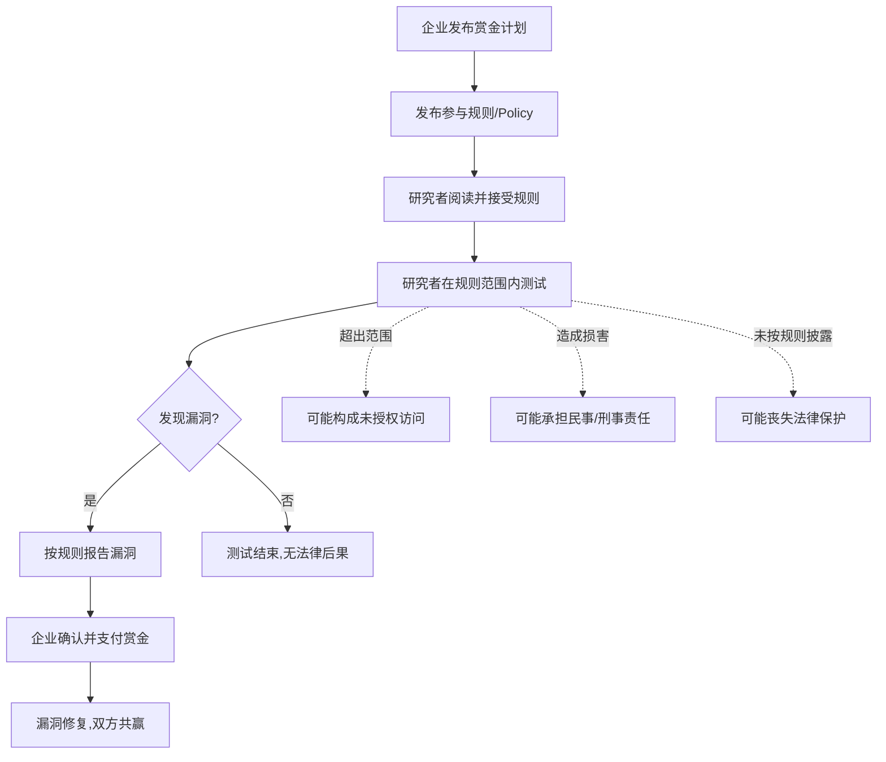

## 2.7 漏洞赏金计划的法律框架

漏洞赏金计划（Bug Bounty Program）是连接企业安全需求与安全研究者技能的桥梁。它在法律上处于一个独特的位置：既不同于企业自行雇佣的渗透测试（有完整合同），也不同于未经授权的安全研究（可能违法）。理解这个计划的法律框架，是每一个安全研究者参与赏金猎人活动的前提。

### 2.7.1 漏洞赏金计划的本质与法律定位

#### 什么是漏洞赏金计划

漏洞赏金计划是企业公开或限定范围的安全研究激励机制。企业通过发布明确的参与规则（称为"政策"或"Policy"），授权安全研究者在其指定范围内寻找并报告安全漏洞，根据漏洞的严重程度给予金钱奖励（赏金）或其他回报。

从法律角度看，漏洞赏金计划本质上是一种**附条件的授权许可**：



**关键法律特征：**

| 特征 | 说明 | 法律意义 |
|------|------|----------|
| 单方要约 | 企业发布规则，研究者自行决定参与 | 非传统合同，但具有法律约束力 |
| 附条件授权 | 授权仅在规则范围内有效 | 超出范围即失去授权保护 |
| 免责声明 | 企业通常声明不追究规则内的研究 | 但免责声明的法律效力因司法管辖区而异 |
| 保密义务 | 要求研究者在修复前不公开漏洞 | 违反保密可能导致丧失赏金和法律风险 |
| 赏金作为对价 | 金钱回报构成合同对价 | 强化了规则的合同效力 |

#### 漏洞赏金计划 vs 其他安全研究形式

```plaintext
┌─────────────────────────────────────────────────────────────────────┐
│                    安全研究的法律光谱                                │
│                                                                      │
│  完全合法                                              完全违法       │
│  ◄──────────────────────────────────────────────────────────────►   │
│                                                                      │
│  ┌──────────┐  ┌──────────┐  ┌──────────┐  ┌──────────┐            │
│  │ 雇佣渗透 │  │ 漏洞赏金 │  │ 协调漏洞 │  │ 未授权   │            │
│  │ 测试     │  │ 计划     │  │ 披露     │  │ 访问     │            │
│  └──────────┘  └──────────┘  └──────────┘  └──────────┘            │
│                                                                      │
│  ·完整合同     ·规则授权     ·无明确授权   ·无任何授权              │
│  ·明确SOW      ·范围限定     ·善意推定     ·恶意推定                │
│  ·NDA保护      ·保密条款     ·法律灰色     ·CFAA/刑法               │
│  ·法律确定性高 ·法律确定性中 ·法律风险中高 ·法律确定性低(违法)     │
└─────────────────────────────────────────────────────────────────────┘
```

**核心区别在于授权的明确程度：**

1. **雇佣渗透测试**：最安全。有完整合同、SOW、NDA、授权书，法律确定性最高。
2. **漏洞赏金计划**：较安全。有公开规则构成的授权，但授权边界可能模糊，法律确定性中等。
3. **协调漏洞披露（CVD）**：风险中等。没有事先授权，依赖"善意"推定和披露规范。
4. **未授权安全研究**：违法。无论动机如何，在大多数司法管辖区都可能构成犯罪。

### 2.7.2 主流漏洞赏金平台与法律机制

#### 全球主要平台

**HackerOne**

HackerOne 是全球最大的漏洞协调平台，截至2025年已处理超过40万份有效漏洞报告，支付赏金超过4亿美元。其法律机制的核心是"安全港"条款（Safe Harbor）：

- 平台标准条款要求企业在政策中承诺不对遵守规则的研究者采取法律行动
- HackerOne的"Disclosure Guidelines"规定了漏洞披露的时间线和方式
- 平台提供标准化的"漏洞赏金政策模板"，帮助企业明确授权范围
- 争议解决机制：当企业和研究者对漏洞有效性或赏金金额存在分歧时，平台提供仲裁

**Bugcrowd**

Bugcrowd 的法律框架与 HackerOne 类似，但增加了以下特色：

- "Crowdstream"功能：实时监控研究者行为，确保在授权范围内
- 强制性的"Rules of Engagement"（参与规则），比一般政策更详细
- 提供"Vulnerability Disclosure Program"（VDP）和"Bug Bounty Program"（BBP）两种模式，前者通常不含赏金但提供法律保护

**国内平台**

中国的主要漏洞响应平台在法律框架上有显著差异：

| 平台 | 运营方 | 法律定位 | 特点 |
|------|--------|----------|------|
| 补天 | 奇安信 | 企业授权+平台中介 | 最大中文漏洞平台，CNVD对接 |
| 漏洞盒子 | 漏洞盒科技 | 企业授权+平台中介 | 覆盖国内企业，支持众测 |
| CNVD | 国家信息安全漏洞共享平台 | 官方漏洞收集 | 非赏金性质，但具有法律合规意义 |
| CNNVD | 中国国家信息安全漏洞库 | 官方漏洞库 | 由中国信息安全测评中心运营 |

**重要提醒：** 在中国参与漏洞赏金计划时，需要特别注意《网络安全漏洞管理规定》（2021年）的要求。该规定明确：

- 任何组织和个人不得将未公开的漏洞提供给漏洞管理组织以外的其他组织或个人
- 不得发布网络安全漏洞信息，除非经漏洞相关产品提供者同意或已修复
- 不得利用漏洞从事危害网络安全的活动

#### 平台服务协议中的关键法律条款

参与任何漏洞赏金平台前，必须仔细阅读其服务协议。以下是需要特别关注的条款：

**1. 授权范围条款**

```text
典型表述：
"The Company authorizes you to perform security research on the 
Company's products and services within the scope defined in this 
policy. This authorization is conditional upon your compliance 
with all terms and conditions of this policy."

（"本公司授权您在本政策定义的范围内对本公司的产品和服务
进行安全研究。此授权以您遵守本政策的所有条款和条件为前提。"）
```

**2. 免责/安全港条款**

```text
典型表述：
"The Company will not initiate a lawsuit or law enforcement 
investigation against you for your security research conducted 
in compliance with this policy, including claims under the 
Computer Fraud and Abuse Act."

（"对于您按照本政策进行的安全研究，本公司不会对您提起
诉讼或启动执法调查，包括根据《计算机欺诈和滥用法》的索赔。"）
```

**3. 保密条款**

```text
典型表述：
"You agree to keep confidential any information you obtain 
through your security research until the Company has had a 
reasonable opportunity to address the vulnerability."

（"您同意对通过安全研究获得的任何信息保密，直到本公司
有合理的机会修复该漏洞。"）
```

**4. 数据处理条款**

```text
典型表述：
"If you encounter user data during your research, you must 
immediately stop testing, delete all copies of the data, and 
report the data exposure to the Company."

（"如果在研究过程中遇到用户数据，您必须立即停止测试，
删除所有数据副本，并向本公司报告数据暴露情况。"）
```

### 2.7.3 各司法管辖区的漏洞赏金法律分析

#### 美国：CFAA下的安全港

美国是漏洞赏金计划的发源地，其法律框架以CFAA为核心。

**CFAA §1030 的关键问题：**

CFAA将"未经授权或超出授权范围访问计算机"定为犯罪。漏洞赏金计划的核心法律功能就是提供这种"授权"。但授权的边界在哪里？

**2021年Van Buren v. United States案的里程碑意义：**

美国最高法院在Van Buren案中对CFAA的"未经授权"进行了限缩解释。法院裁定：

> CFAA覆盖的是那些本来无权访问计算机系统的人获取访问权限的行为（"门"的比喻），而不是那些有权访问但以不被允许的方式使用的人（"钥匙"的比喻）。

这个判决对安全研究者有重要影响：如果你有访问某个系统的合法途径（例如通过赏金计划获得的授权），那么即使你使用系统的方式不完全符合预期，也不一定构成CFAA违规。

**但Van Buren案的局限：**

- 该判决仅适用于联邦CFAA，各州可能有更宽泛的计算机犯罪法律
- "超出授权范围"仍可能构成违规，特别是当赏金政策明确规定了边界时
- 该判决未涉及故意造成损害的行为

**安全港的实际效力：**

美国的"安全港"承诺（如HackerOne上的承诺）在法律上是一种**合同性质的承诺**，而非法定豁免。这意味着：

- 企业理论上可以反悔，但会面临合同违约诉讼和声誉损害
- 安全港不能保护超出范围的研究行为
- 安全港不能保护造成实际损害的行为
- 安全港不能阻止第三方（如执法机构）的追究

**实用建议：**

```python
# 美国安全研究者的法律风险评估框架
def us_legal_risk_assessment(program, activity):
    """
    评估在美国参与漏洞赏金计划的法律风险
    注意：这是教育性框架，不构成法律建议
    """
    risk_factors = {
        'has_safe_harbor': {
            'weight': -30,
            'description': '计划是否包含安全港条款'
        },
        'within_scope': {
            'weight': -40,
            'description': '活动是否在明确的授权范围内'
        },
        'no_damage': {
            'weight': -20,
            'description': '是否未造成任何系统损害'
        },
        'data_handling': {
            'weight': -10,
            'description': '是否正确处理遇到的数据'
        },
        'timely_report': {
            'weight': -10,
            'description': '是否及时报告发现的漏洞'
        },
        'state_laws': {
            'weight': 15,
            'description': '所在州是否有更严格的计算机犯罪法'
        },
        'critical_infrastructure': {
            'weight': 20,
            'description': '目标是否涉及关键基础设施'
        },
        'personal_data_access': {
            'weight': 25,
            'description': '是否访问了个人可识别信息(PII)'
        }
    }
    
    risk_score = 50  # 基准风险分
    for factor, config in risk_factors.items():
        if activity.get(factor):
            risk_score += config['weight']
    
    risk_score = max(0, min(100, risk_score))
    
    return {
        'risk_score': risk_score,
        'risk_level': 'LOW' if risk_score < 25 else 'MEDIUM' if risk_score < 50 else 'HIGH',
        'recommendation': get_recommendation(risk_score)
    }
```

#### 欧盟：GDPR与漏洞赏金的交叉

欧盟没有专门的"安全港"法律，但多个法规共同构成了漏洞赏金的法律环境。

**GDPR对漏洞赏金研究者的影响：**

当研究者在测试过程中接触到个人数据时，GDPR立即产生约束力：

| 场景 | GDPR问题 | 应对措施 |
|------|----------|----------|
| 测试API发现返回用户数据 | 数据泄露风险 | 立即停止测试，不保存数据，报告漏洞 |
| 发现SQL注入可提取数据库 | 大规模数据暴露风险 | 仅证明可行性（如提取1条记录），不实际导出 |
| 发现身份认证绕过 | 可能访问他人账户 | 不登录他人账户，仅记录漏洞原理 |
| 发现CSRF可修改用户资料 | 数据完整性风险 | 不实际修改数据，仅构造PoC |

**NIS2指令的间接影响：**

NIS2指令（2022年通过，2024年10月起适用）要求关键基础设施运营商实施供应链安全管理，这间接影响了漏洞赏金计划：

- 关键基础设施运营商有义务评估其供应链的网络安全风险
- 这可能推动更多企业建立漏洞赏金计划
- 但同时也可能对研究者施加更严格的合规要求

**德国的"白帽黑客"法律提案：**

德国联邦司法部在2024年提出了专门保护"白帽黑客"的法律草案，如果通过将成为欧盟内首个明确保护善意安全研究者的法律。草案核心内容包括：

- 善意安全研究不构成刑事犯罪
- 研究者必须在合理时间内报告发现的漏洞
- 不得利用漏洞获取个人数据或造成损害
- 适用于所有形式的安全研究，不仅限于赏金计划

#### 中国：网络安全法下的漏洞研究

中国的法律环境对漏洞研究有特殊的要求，安全研究者必须了解以下法律框架：

**《网络安全法》（2017年）第27条：**

> 任何个人和组织不得从事非法侵入他人网络、干扰他人网络正常功能、窃取网络数据等危害网络安全的活动。

**《网络安全漏洞管理规定》（2021年）核心要求：**

```plaintext
漏洞研究者必须遵守的"四不得"：
┌─────────────────────────────────────────────────────────┐
│ 1. 不得将未公开漏洞提供给平台以外的组织或个人           │
│    └── 含义：只能通过合法渠道报告，不能私下交易         │
│                                                          │
│ 2. 不得公开发布未修复的漏洞信息                         │
│    └── 含义：必须等厂商修复后才能公开技术细节           │
│                                                          │
│ 3. 不得利用漏洞从事危害网络安全的活动                   │
│    └── 含义：不得利用漏洞入侵、破坏或窃取数据           │
│                                                          │
│ 4. 不得提供专门用于网络攻击的程序、工具                 │
│    └── 含义：漏洞利用代码的发布受严格限制               │
└─────────────────────────────────────────────────────────┘
```

**补天/漏洞盒子的合规路径：**

在中国参与漏洞赏金计划，最安全的合规路径是：

1. 仅在补天、漏洞盒子等有企业授权的平台上进行研究
2. 严格遵守平台规则和企业政策的范围
3. 通过平台的官方渠道报告漏洞
4. 不在任何公开渠道发布未修复漏洞的技术细节
5. 不私下出售或交换漏洞信息

**真实案例警示：**

2019年，某安全研究者因在未获授权的情况下测试某政务系统并获取了管理员权限，虽然其目的是报告漏洞，但仍被以"非法侵入计算机信息系统罪"起诉。法院认为，即使出于善意目的，未经授权的入侵行为仍然违法。

#### 日本：《不正竞争防止法》的特殊规定

日本的《不正竞争防止法》（Unfair Competition Prevention Act）对漏洞赏金有特殊规定：

- 2019年修订版增加了"限定提供数据"（限定提供データ）的保护条款
- 通过赏金计划获得的漏洞信息属于"限定提供数据"，受法律保护
- 未经授权泄露或出售漏洞信息可能构成不正当竞争

### 2.7.4 漏洞赏金的收入与税务

#### 全球税务处理概览

漏洞赏金收入在绝大多数国家属于**应税收入**。具体的税务处理因国家和收入性质而异：

| 国家/地区 | 收入分类 | 税率范围 | 特殊规定 |
|-----------|----------|----------|----------|
| 美国 | 自雇收入（1099-NEC） | 15.3%自雇税+所得税 | 需缴纳自雇税和联邦/州所得税 |
| 中国 | 劳务报酬所得 | 20%-40%预扣 | 超过一定金额需自行申报 |
| 欧盟各国 | 因国家而异 | 因国家而异 | 部分国家视为自由职业收入 |
| 日本 | 杂所得/事业所得 | 累进税率 | 取决于收入规模和频率 |
| 印度 | 业务收入 | 累进税率 | 需要在所得税申报中披露 |

**美国税务实务：**

```plaintext
美国漏洞赏金收入税务处理流程：
┌─────────────────────────────────────────────────────┐
│ 1. 平台发放赏金                                      │
│    ├── HackerOne: 通过Hacker支付                     │
│    ├── Bugcrowd: 直接银行转账                        │
│    └── 企业自有计划: 支票/电汇                       │
│                                                       │
│ 2. 平台发放1099-NEC表（年收入≥$600）                │
│    ├── 报告在Box 1: Nonemployee Compensation         │
│    └── 副本发送给IRS                                 │
│                                                       │
│ 3. 研究者报税                                        │
│    ├── Schedule C: 报告自雇收入                      │
│    ├── Schedule SE: 计算自雇税                       │
│    └── 可扣除相关费用（设备、培训、工具）           │
│                                                       │
│ 4. 可扣除的费用                                      │
│    ├── 电脑硬件和软件                                │
│    ├── 安全工具订阅（Burp Suite等）                  │
│    ├── 培训和认证费用                                │
│    ├── 互联网费用（按使用比例）                     │
│    └── 家庭办公费用（如适用）                       │
└─────────────────────────────────────────────────────┘
```

**中国税务实务：**

在中国，漏洞赏金收入通常按照**劳务报酬所得**处理：

- 单次收入不超过800元：免税
- 800-4000元：减除800元费用后，按20%税率
- 4000元以上：减除20%费用后，按20%-40%累进税率
- 年度汇算清缴时，可能需要补缴或退税

**重要提醒：** 无论收入金额大小，都应保留完整的赏金支付记录。这不仅是税务合规的需要，也是证明收入合法来源的重要证据。

#### 记录保存建议

```python
# 漏洞赏金收入记录模板
class BugBountyRecord:
    def __init__(self):
        self.records = []
    
    def add_record(self, 
                   date,           # 发现/报告日期
                   platform,       # 平台名称
                   program,        # 计划名称
                   vulnerability,  # 漏洞类型
                   severity,       # 严重程度
                   bounty_amount,  # 赏金金额
                   currency,       # 货币
                   payment_date,   # 支付日期
                   payment_method, # 支付方式
                   tax_document):  # 税务文档编号
        """记录一笔赏金收入"""
        self.records.append({
            'date': date,
            'platform': platform,
            'program': program,
            'vulnerability': vulnerability,
            'severity': severity,
            'bounty_amount': bounty_amount,
            'currency': currency,
            'payment_date': payment_date,
            'payment_method': payment_method,
            'tax_document': tax_document,
            'notes': ''
        })
    
    def annual_summary(self, year):
        """生成年度汇总，用于税务申报"""
        year_records = [r for r in self.records 
                       if r['payment_date'].year == year]
        return {
            'total_income': sum(r['bounty_amount'] for r in year_records),
            'by_platform': self._group_by_platform(year_records),
            'by_severity': self._group_by_severity(year_records),
            'record_count': len(year_records)
        }
```

### 2.7.5 漏洞披露的法律边界

#### 协调漏洞披露（CVD）vs 完全披露

漏洞赏金计划通常要求协调漏洞披露（Coordinated Vulnerability Disclosure, CVD），即研究者先报告给厂商，等待修复后再公开。这与"完全披露"（Full Disclosure）形成对比：

```plaintext
┌─────────────────────────────────────────────────────────────────┐
│                    漏洞披露方式对比                              │
├────────────────────┬────────────────────────────────────────────┤
│   协调漏洞披露     │            完全披露                        │
│   (CVD)            │            (Full Disclosure)               │
├────────────────────┼────────────────────────────────────────────┤
│ 流程：             │ 流程：                                     │
│ 1. 发现漏洞        │ 1. 发现漏洞                                │
│ 2. 报告给厂商      │ 2. 直接公开漏洞细节                        │
│ 3. 等待修复        │ 3. 厂商被迫快速响应                         │
│ 4. 厂商修复后公开  │                                            │
├────────────────────┼────────────────────────────────────────────┤
│ 优点：             │ 优点：                                     │
│ ·法律风险低        │ ·公众知情权                                │
│ ·厂商关系好        │ ·迫使厂商快速修复                          │
│ ·赏金收入稳定      │ ·推动安全标准提升                          │
├────────────────────┼────────────────────────────────────────────┤
│ 缺点：             │ 缺点：                                     │
│ ·修复周期长        │ ·法律风险高                                │
│ ·可能被厂商忽视    │ ·可能被恶意利用                            │
│ ·信息不对称        │ ·损害与厂商关系                            │
├────────────────────┼────────────────────────────────────────────┤
│ 法律风险：低       │ 法律风险：中到高                           │
│ (有授权保护)       │ (可能违反保密协议或计算机犯罪法)           │
└────────────────────┴────────────────────────────────────────────┘
```

#### 披露时间线的法律考量

大多数漏洞赏金计划规定了90天的修复窗口期（受Google Project Zero影响）。但法律上，披露时间线存在以下考量：

**1. 默认披露时间线**

```text
Day 0:  报告漏洞给厂商
Day 1-7:  厂商确认收到报告
Day 7-30: 厂商评估漏洞严重性
Day 30-90: 厂商开发和测试修复方案
Day 90:  默认公开日期（如未修复）
```

**2. 法律风险点**

- **提前公开**：如果厂商未在约定时间内修复，研究者提前公开可能面临合同违约诉讼
- **延迟公开**：如果研究者无限期等待，可能被厂商"拖死"，失去公开的时机
- **厂商施压**：某些厂商可能通过法律威胁阻止研究者公开漏洞

**3. 安全的披露策略**

```python
# 漏洞披露时间线管理策略
def disclosure_timeline_policy(vulnerability_report):
    """
    管理漏洞披露时间线，平衡法律风险和公众知情权
    """
    timeline = {
        'day_0': {
            'action': '通过官方渠道报告漏洞',
            'legal_check': '确认在授权范围内发现',
            'documentation': '保存报告提交的确认回执'
        },
        'day_7': {
            'action': '跟进确认厂商是否收到',
            'legal_check': '如未收到回复，发送书面提醒',
            'documentation': '保存所有通信记录'
        },
        'day_30': {
            'action': '评估厂商修复进度',
            'legal_check': '如厂商无响应，考虑第三方协调',
            'documentation': '记录厂商的响应时间线'
        },
        'day_60': {
            'action': '发出90天公开通知',
            'legal_check': '书面通知厂商公开日期',
            'documentation': '保存通知发送记录'
        },
        'day_90': {
            'action': '按计划公开漏洞信息',
            'legal_check': '确认不包含敏感数据',
            'documentation': '保留公开内容的法律审核记录'
        }
    }
    return timeline
```

### 2.7.6 真实案例与教训

#### 案例1：Orange Tsai与Facebook SSRF漏洞（2019年）

**背景：** 安全研究者Orange Tsai在Facebook的漏洞赏金计划中发现了一个SSRF（服务器端请求伪造）漏洞，该漏洞允许攻击者访问Facebook内部服务器。

**法律要点：**

- Orange Tsai严格在Facebook的赏金政策范围内进行测试
- 发现漏洞后立即通过HackerOne报告
- 未访问或下载任何用户数据
- Facebook确认漏洞并支付了赏金

**结果：** Facebook支付了$30,000赏金，Orange Tsai被邀请参加Facebook的Bug Bounty Hall of Fame。这是一个教科书式的合规漏洞赏金案例。

#### 案例2：Marcus Hutchins与Kronos恶意软件（2017年）

**背景：** Marcus Hutchins因发现WannaCry的"杀死开关"而闻名，但后来因在2014-2015年参与开发Kronos银行木马被美国司法部起诉。

**法律教训：**

- 安全研究者的合法行为（漏洞赏金）不能"清洗"之前的非法行为
- 即使是知名安全研究者，也不能免于法律追究
- 漏洞赏金计划的法律保护仅限于计划范围内的活动

**结果：** Hutchins最终认罪，被判缓刑，未入狱。此案成为安全社区的警示案例。

#### 案例3：中国"白帽黑客"非法入侵案（2019年）

**背景：** 某安全研究者在未获授权的情况下，自行测试某政务系统并发现SQL注入漏洞。研究者通过邮件向系统管理员报告了漏洞。

**法律要点：**

- 研究者未在任何平台的授权下进行测试
- 即使出于善意目的，测试行为本身已构成"非法侵入计算机信息系统"
- 通过邮件报告不改变行为的违法性质

**结果：** 研究者被以"非法侵入计算机信息系统罪"起诉。此案在中国安全社区引起广泛讨论。

**教训：** 在中国，没有授权的安全测试，无论动机如何，都可能构成犯罪。参与正规平台的漏洞赏金计划是唯一的合规路径。

#### 案例4：Weev与AT&T iPad数据泄露（2010年）

**背景：** Andrew Auernheimer（网名Weev）发现AT&T的网站存在漏洞，暴露了iPad用户的电子邮件地址。他将数据提供给媒体。

**法律要点：**

- Weev未获得AT&T的任何授权
- 他将漏洞信息提供给媒体而非AT&T
- 虽然漏洞是AT&T的代码缺陷，但Weev的行为仍被起诉

**结果：** Weev最初被判41个月监禁（后因管辖权问题推翻）。此案成为美国CFAA改革的推动力之一。

### 2.7.7 参与漏洞赏金的法律自检清单

在参与任何漏洞赏金计划之前，完成以下自检：

```plaintext
漏洞赏金参与法律自检清单
═══════════════════════════════════════════════════════════════════

□ 1. 授权确认
  □ 已阅读并理解该计划的完整政策文档
  □ 确认目标系统在计划范围内（IP、域名、应用）
  □ 确认测试方法在允许范围内
  □ 确认测试时间窗口允许
  □ 保存了政策文档的截图/存档

□ 2. 平台合规
  □ 使用正规平台（HackerOne/Bugcrowd/补天等）
  □ 已完成平台的身份验证
  □ 理解平台的服务条款
  □ 了解平台的争议解决机制

□ 3. 法律风险评估
  □ 确认所在国家/地区允许此类研究
  □ 评估测试是否涉及关键基础设施
  □ 评估测试是否可能访问个人数据
  □ 评估测试是否可能影响系统可用性
  □ 如有疑虑，咨询法律专业人士

□ 4. 数据处理
  □ 不存储任何在测试中遇到的用户数据
  □ 不导出数据库内容
  □ 如意外接触到PII，立即停止并报告
  □ PoC（概念验证）使用伪造数据

□ 5. 测试行为
  □ 不进行拒绝服务攻击
  □ 不修改或删除数据
  □ 不安装后门或持久化机制
  □ 不使用自动化扫描工具（除非政策允许）
  □ 不测试其他用户账户

□ 6. 报告与披露
  □ 通过官方渠道报告漏洞
  □ 报告内容不包含敏感数据
  □ 遵守规定的披露时间线
  □ 不在社交媒体上提前透露漏洞细节
  □ 保存所有通信记录

□ 7. 收入记录
  □ 记录每笔赏金的金额和日期
  □ 保存平台发放的税务文档
  □ 按当地税法申报收入
  □ 保留相关费用凭证用于抵扣
═══════════════════════════════════════════════════════════════════
```

### 2.7.8 进阶：建立个人的法律保护策略

#### 技术层面的法律保护

**1. 使用独立的测试环境**

```plaintext
测试环境隔离策略：
┌─────────────────────────────────────────────────────┐
│                    推荐设置                          │
│                                                      │
│  物理隔离                                           │
│  ├── 专用测试电脑（不含个人文件）                   │
│  ├── 独立网络（VPN/代理）                           │
│  └── 加密存储（全盘加密）                           │
│                                                      │
│  虚拟隔离                                           │
│  ├── 独立虚拟机用于每个项目                         │
│  ├── 快照管理（可回滚）                             │
│  └── 网络隔离（NAT/Host-only）                      │
│                                                      │
│  日志管理                                           │
│  ├── 记录所有测试活动                               │
│  ├── 时间戳自动化                                   │
│  └── 日志加密存储                                   │
└─────────────────────────────────────────────────────┘
```

**2. 测试活动的可审计性**

建立完整的测试日志系统，以便在法律纠纷时提供证据：

```python
import hashlib
import json
from datetime import datetime

class SecurityTestAuditLog:
    """安全测试审计日志系统"""
    
    def __init__(self, researcher_id, program_id):
        self.researcher_id = researcher_id
        self.program_id = program_id
        self.entries = []
    
    def log_action(self, action_type, target, description, evidence=None):
        """记录测试活动"""
        entry = {
            'timestamp': datetime.utcnow().isoformat(),
            'researcher': self.researcher_id,
            'program': self.program_id,
            'action_type': action_type,
            'target': target,
            'description': description,
            'evidence': evidence
        }
        # 生成不可篡改的哈希
        entry['hash'] = self._generate_hash(entry)
        self.entries.append(entry)
        return entry
    
    def _generate_hash(self, entry):
        """生成SHA-256哈希用于完整性验证"""
        entry_str = json.dumps(entry, sort_keys=True)
        return hashlib.sha256(entry_str.encode()).hexdigest()
    
    def export_for_legal(self):
        """导出法律用途的日志"""
        return {
            'metadata': {
                'researcher': self.researcher_id,
                'program': self.program_id,
                'export_date': datetime.utcnow().isoformat(),
                'total_entries': len(self.entries)
            },
            'entries': self.entries
        }
```

#### 法律文件模板

**1. 漏洞报告模板**

```plaintext
漏洞报告
═══════════════════════════════════════════════════════════════════

基本信息
────────
报告编号：[自动生成]
报告日期：[日期]
研究者：[姓名/ID]
计划名称：[计划名称]
平台：[HackerOne/Bugcrowd/补天等]

漏洞概述
────────
标题：[简明描述漏洞]
严重程度：[Critical/High/Medium/Low/Info]
CVSS评分：[如果适用]
漏洞类型：[OWASP分类/CWE编号]

影响范围
────────
受影响系统：[具体URL/IP]
影响功能：[具体功能描述]
潜在影响：[数据泄露/权限提升/服务中断等]

复现步骤
────────
1. [详细步骤1]
2. [详细步骤2]
3. [详细步骤3]

概念验证
────────
[PoC代码或截图，使用伪造数据]

修复建议
────────
[具体的修复方案]

法律声明
────────
本报告所述测试活动在[计划名称]的授权范围内进行。
测试过程中未访问、存储或传输任何用户数据。
所有测试活动均有完整日志记录。
═══════════════════════════════════════════════════════════════════
```

**2. 法律免责请求模板（当需要厂商确认时）**

```plaintext
致：[厂商安全团队]

主题：关于[计划名称]漏洞赏金计划的安全港确认

尊敬的安全团队：

我是[姓名]，通过[平台名称]参与贵公司的漏洞赏金计划。
在测试过程中，我发现了[简要描述]的安全问题。

在进一步深入测试之前，我希望确认以下事项：

1. 我的测试活动是否在贵公司授权范围内？
2. 贵公司是否承诺对按照政策进行的研究提供安全港保护？
3. 如果测试过程中意外接触到用户数据，应如何处理？

感谢您的时间。

此致
[姓名]
[平台ID]
[联系方式]
```

### 2.7.9 常见误区与纠正

```plaintext
常见误区                        正确认知
═══════════════════════════════════════════════════════════════════
"只要是找漏洞就合法"        →  必须在明确授权范围内才合法
"不造成损害就不会被起诉"    →  未授权访问本身就可能构成犯罪
"赏金计划是万能保护伞"      →  超出范围、造成损害仍可能被追责
"匿名测试就查不到"          →  网络取证技术可追溯大部分行为
"报告了就免责"              →  报告漏洞不改变之前行为的合法性
"国内平台更安全"            →  平台授权仅在平台规则范围内有效
"国际平台在中国不适用"      →  仍受中国法律约束
"漏洞赏金不用交税"          →  赏金收入在大多数国家属于应税收入
"测试一次就不算犯罪"        →  即使一次未授权访问也可能构成犯罪
"好意报告漏洞一定没事"      →  善意不是免责事由，授权才是
═══════════════════════════════════════════════════════════════════
```

### 2.7.10 本节总结

漏洞赏金计划为安全研究者提供了一条合法参与网络安全建设的道路，但它不是法律的"免死金牌"。核心原则可以归纳为三个词：**授权、范围、合规**。

**授权**是前提——没有明确授权的测试就是未授权访问，无论动机如何。**范围**是边界——超出授权范围的行为不受保护。**合规**是保障——遵守平台规则、当地法律、披露规范，才能获得完整的法律保护。

在实际操作中，建议每位安全研究者：

1. 选择正规平台，仔细阅读每份政策文档
2. 在测试前完成法律自检清单
3. 建立完整的测试活动审计日志
4. 及时、专业地报告漏洞
5. 依法申报赏金收入
6. 遇到法律疑虑时，咨询专业律师而非自行判断

网络安全研究是一项崇高的事业，但崇高的目的不能替代合法的手段。只有在法律框架内行事，安全研究者才能持续为网络安全做出贡献。
