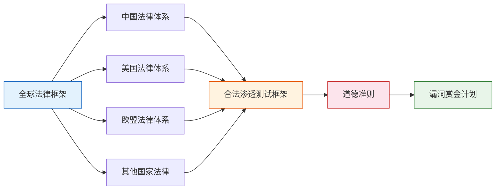
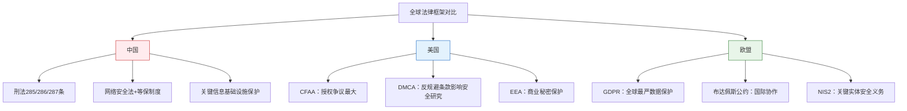
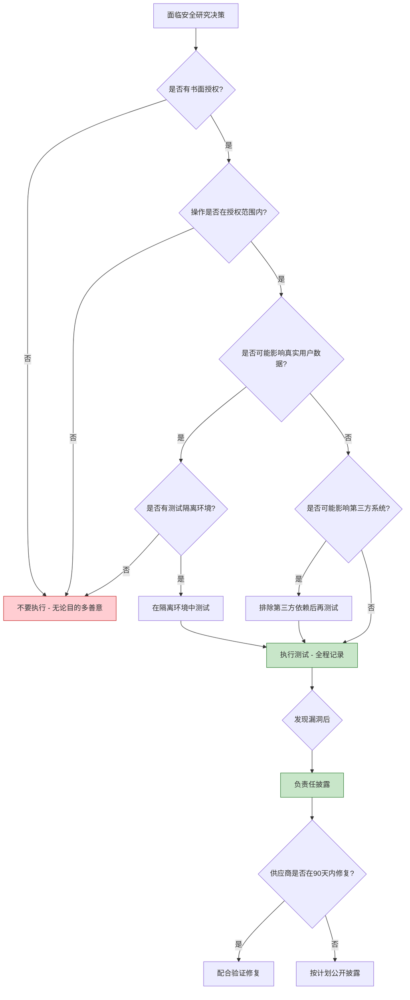

## 本节小结

本节从法律和道德两个维度，系统构建了网络安全从业者的"行为边界地图"。以下从知识体系总览、核心要点提炼、跨法域对比、关键决策框架四个层面进行全面回顾，帮助读者将分散的知识点整合为可操作的认知体系。

### 知识体系总览

本节共覆盖七个核心模块，形成从宏观法律认知到微观行为准则的完整知识链：

**学习路径回顾：**

| 序号 | 模块 | 核心问题 | 关键收获 |
|------|------|---------|---------|
| 2.1 | 中国法律体系 | 在中国做安全研究，哪些行为构成犯罪？ | 刑法285/286/287条的红线、等保制度、网络安全法的核心义务 |
| 2.2 | 美国法律体系 | CFAA如何影响安全研究？ | CFAA的"未经授权"争议、DMCA的反规避条款、Aaron Swartz案的警示 |
| 2.3 | 欧盟法律体系 | GDPR对安全研究有什么约束？ | 七项数据保护原则、72小时泄露通知义务、布达佩斯公约的国际框架 |
| 2.4 | 其他国家法律 | 不同法域有何差异？ | 英国CAA、日本不正访问禁止法、德国刑法典的计算机犯罪条款 |
| 2.5 | 渗透测试框架 | 合法测试与非法入侵的本质区别？ | 授权是唯一分界线、SOW+NDA+授权书三位一体、五大法律风险及缓解措施 |
| 2.6 | 道德准则 | 安全从业者应遵循什么行为标准？ | ISC²四条道德准则、研究前中后的行为规范、90天漏洞披露时间线 |
| 2.7 | 漏洞赏金框架 | 如何在赏金计划中保护自己？ | 平台规则优先、不超范围不访问数据、收入税务合规 |

### 核心要点提炼

#### 一、法律红线：三条不可逾越的底线

无论在哪个法域，以下三条底线是全球安全从业者的共识：

**底线一：无授权即违法**

合法渗透测试与非法入侵之间没有灰色地带，唯一的分界线是**书面授权**。即便你的目的是善意的、没有造成任何损害、甚至帮助修复了漏洞——没有授权的访问行为在法律上仍然构成犯罪。这一原则在中国刑法第285条、美国CFAA、英国CAA、日本不正访问禁止法中均有明确体现。

**底线二：不超范围**

即使获得了授权，超出授权范围的操作同样违法。授权书上写明测试A系统，你顺手测试了B系统，B系统的测试部分就是未经授权的访问。渗透测试合同中的SOW（声明工作）必须精确到IP地址段、域名、应用名称。

**底线三：不获取/破坏数据**

获取系统中的真实用户数据（即便是为了证明漏洞存在）和破坏系统功能，在所有主要法域中都是加重情节。在中国，非法获取数据罪（刑法285条第2款）最高可判7年；破坏计算机信息系统罪（刑法286条）后果特别严重的可判5年以上。

#### 二、全球法律框架的核心差异

| 对比维度 | 中国 | 美国 | 欧盟 |
|---------|------|------|------|
| 核心法律 | 刑法285-287条 + 网络安全法 | CFAA + DMCA | GDPR + NIS2 + 布达佩斯公约 |
| "授权"定义 | 法律未明确定义，实践中从严认定 | CFAA未明确定义，各法院判例不一 | 依具体法律和成员国立法而定 |
| 对安全研究的态度 | 严格限制，无明确豁免条款 | 有争议，DMCA有周期性豁免规则 | GDPR下有合法研究基础，但限制多 |
| 数据保护 | 网络安全法 + 数据安全法 + 个人信息保护法 | 无统一联邦数据保护法，各州不同 | GDPR统一适用，72小时泄露通知 |
| 漏洞披露 | 补天/漏洞盒子等平台，有行业惯例 | 法律模糊，靠行业自律（90天规则） | NIS2要求及时报告，成员国细则不同 |
| 最高刑罚 | 刑法286条：5年以上有期徒刑 | CFAA：最高20年（如涉及恐怖主义） | GDPR罚款：最高2000万欧元或全球营收4% |

#### 三、道德准则的核心框架

安全从业者的道德准则不是"可选的附加项"，而是与法律同等重要的行为约束。法律划定的是最低底线，道德准则设定的是职业标准。

**ISC²道德准则四条原则的实操含义：**

1. **保护社会** — 当你发现一个正在被积极利用的0day，即使没有授权，你是否有义务通知受影响方？道德上是的，但法律上你可能因未经授权访问而面临风险。这就是法律与道德冲突的典型场景。
2. **行为得体** — 在漏洞赏金计划中发现了一个严重的数据泄露漏洞，你可以选择卖掉它赚更多的钱，但你选择了按照规则报告并接受赏金。这就是"以荣誉、诚实的方式行事"。
3. **提供优质服务** — 给客户做渗透测试时，不是走过场交报告了事，而是真正深入测试、给出可操作的修复建议。
4. **发展和保护职业** — 分享知识、帮助新人成长、参与行业标准制定，而不是囤积知识作为个人筹码。

**负责任漏洞披露的90天规则：**

Google Project Zero确立的90天披露期限已成为行业标准：

| 时间节点 | 动作 | 说明 |
|---------|------|------|
| 第0天 | 发现并报告漏洞 | 向供应商/CERT提交详细报告 |
| 第0-7天 | 等待确认 | 供应商应确认收到报告 |
| 第7-90天 | 协调修复 | 与供应商合作制定和验证修复方案 |
| 第90天 | 公开披露 | 如供应商未修复，按计划公开漏洞细节 |

**特殊情形处理：**
- 供应商不回应：通过多种渠道尝试联系，保留沟通记录作为善意证据
- 修复需要更长时间：可适当延期，但应有明确的新时间节点
- 漏洞正在被积极利用：考虑提前披露以保护用户，但需谨慎权衡
- 涉及国家安全：遵循国家相关法律法规，不自行公开

#### 四、渗透测试的法律风险管理

合法渗透测试并不意味着零法律风险。即使持有完整的授权文件，以下五种情况仍可能导致法律问题：

| 风险类型 | 具体场景 | 后果 | 预防措施 |
|---------|---------|------|---------|
| 超出范围 | 测试了授权书未列明的系统 | 构成未经授权访问 | 严格对照SOW，不触碰范围外资产 |
| 数据访问 | 访问了生产环境的真实用户数据 | 违反数据保护法律 | 使用测试账号，发现真实数据立即停止 |
| 系统损害 | SQL注入测试导致数据库崩溃 | 承担赔偿责任，可能被起诉 | 在非生产环境测试，建立回滚机制 |
| 第三方影响 | 测试目标连接了第三方CDN/云服务 | 可能影响第三方系统 | 排查所有外部依赖，排除第三方 |
| 数据泄露 | 测试报告被未授权人员获取 | 暴露客户安全弱点 | 报告加密存储，限制访问权限 |

**自我保护清单：**

1. **书面授权优先** — 口头授权在法律上几乎无效，所有授权必须白纸黑字
2. **全程记录** — 保留所有测试日志、截图、时间戳，作为合规证据
3. **紧急停止机制** — 发现异常立即停止，通知客户紧急联系人
4. **专业责任保险** — 购买网络责任险或专业责任险，转移部分风险
5. **法律顾问** — 重大项目前咨询律师，确保合同条款无漏洞

#### 五、漏洞赏金计划的法律保护

漏洞赏金计划为安全研究者提供了一定程度的法律保护，但这种保护不是万能的：

**赏金计划提供的保护：**
- 明确的测试范围和规则，减少"越界"风险
- 事先同意的安全研究框架，构成一定程度的授权
- 平台作为中间方，协调研究者与企业的关系

**赏金计划不能保护的：**
- 超出计划范围的测试行为
- 违反计划规则的操作（如访问其他用户数据）
- 造成系统损害的行为
- 将漏洞信息出售给第三方的行为

**参与漏洞赏金的行动准则：**
1. 逐字逐句阅读计划规则，特别是"禁止事项"列表
2. 确认自己的测试方法在允许范围内
3. 发现漏洞后立即停止深入，按规则报告
4. 不在公开场合讨论未修复的漏洞
5. 保留所有沟通记录和测试证据

### 关键决策框架

当面临法律和道德决策时，可以使用以下决策流程：

### 从理论到实践的桥梁

本节建立了法律和道德的理论框架，这些知识将在后续章节中转化为具体的操作技能：

- **下一节（核心技巧）** 将讨论如何在合法范围内进行安全研究，包括合法研究方法、授权管理技巧、负责任披露的具体操作流程、自我保护技巧、道德决策框架和合规安全研究流程的建立
- **实战案例** 将通过Aaron Swartz案、Marcus Hutchins案、Weev案、中国网络安全法律案例、Google Project Zero案例、Equifax数据泄露事件和Colonial Pipeline勒索软件事件，将理论知识具象化为真实场景中的经验和教训

法律和道德不是安全研究的束缚，而是安全研究可持续发展的保障。只有在法律框架内、在道德准则指引下开展的安全研究，才能真正为网络安全生态做出贡献，同时保护研究者自身的职业生涯和人身自由。
