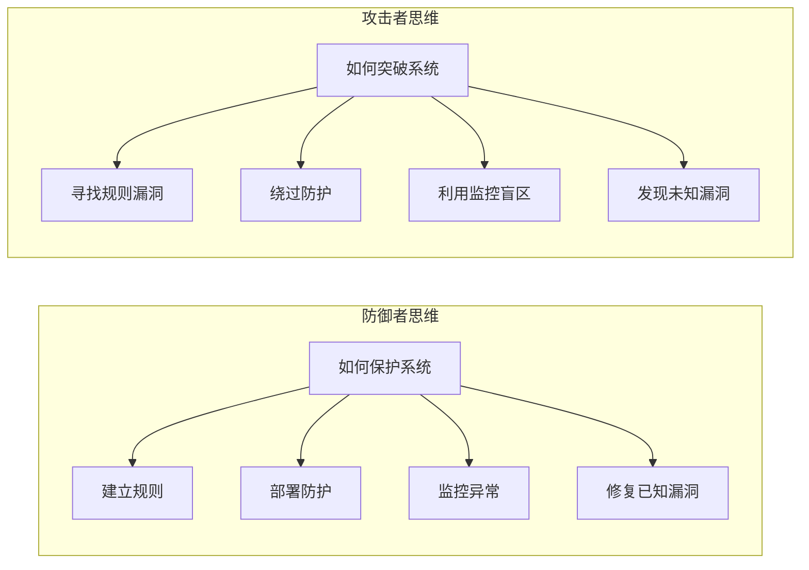
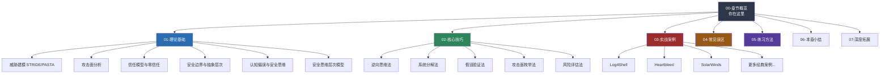

# 第三章：安全思维培养

## 为什么思维比工具更重要

在前两章中，我们了解了黑客文化的历史渊源和学习本教程所需的法律道德框架。从本章开始，正式进入核心能力培养阶段。

但在翻开任何工具手册之前，有一个根本性问题需要先回答：**是什么让一个黑客真正"厉害"？**

答案不是他知道多少工具的用法，不是他背下了多少 CVE 编号，而是他看世界的方式。安全思维是黑客与普通程序员最本质的区别——一个优秀的程序员可以写出功能完善的代码，但只有具备安全思维的人，才能在代码中发现别人看不到的漏洞，在系统中找到被忽略的风险点，在看似天衣无缝的设计中洞察致命缺陷。

安全思维不是一种天赋，而是一种可以通过系统训练获得的思维模式。本章就是这套训练的起点。

### 一个真实的对比

考虑同一个场景：你接到任务，审计一个电商平台的用户登录功能。

**普通开发者的思路**：
- 功能是否正常工作？输入正确密码能否登录？输入错误密码是否被拒绝？
- 界面是否友好？错误提示是否清晰？
- 性能是否达标？高并发下是否稳定？

**安全从业者的思路**：
- 如果输入为空会怎样？超长字符串呢？特殊字符呢？
- 密码错误时的提示与用户名错误时是否不同（用户名枚举）？
- 会话令牌是否可预测？是否设置了合理的过期时间？
- 登录失败是否有速率限制？是否可被暴力破解？
- 认证流程是否可被绕过（比如直接访问登录后的接口）？
- 第三方登录的 OAuth 回调是否验证了 redirect_uri？
- 密码重置流程中，token 是否在 URL 中暴露？是否可被缓存？

这两种思路的差距，就是本章要弥合的鸿沟。

## 本章目标

通过本章的学习，你将能够：

1. **理解安全思维的本质**：掌握攻击者思维与防御者思维的核心差异，建立主动安全意识——不是等到被攻击了才响应，而是提前预判对手的行动
2. **掌握威胁建模方法**：学会使用 STRIDE、PASTA、攻击树等结构化框架系统性地分析目标，识别潜在的攻击面和风险点，而不是凭直觉"觉得哪里可能有问题"
3. **培养逆向分析能力**：从结果倒推原因，从现象推导机制，建立逆向工程的基本思维框架——这是安全研究者区别于脚本小子的核心能力
4. **建立系统化思考习惯**：学会从全局角度审视安全问题，理解一个漏洞如何在整个系统架构中产生连锁反应，避免陷入局部视角的盲区
5. **理解安全边界概念**：明确安全与非安全的边界在哪里，理解信任模型的基本原理——大多数漏洞的本质都是信任边界的违反
6. **培养持续学习意识**：安全领域日新月异，新的攻击技术和防御手段每天都在涌现，建立终身学习的心态和方法论比掌握任何单一技术都重要

## 核心理念

### 攻击者思维 vs 防御者思维

安全领域存在两种截然不同的思维方式，它们的底层逻辑完全不同：

| 维度 | 防御者思维 | 攻击者思维 |
|------|-----------|-----------|
| 关注点 | 系统应当如何运行 | 系统可能如何失败 |
| 驱动力 | 合规与最佳实践 | 好奇心与探索欲 |
| 分析方向 | 正向：配置→检测→响应 | 逆向：目标→路径→手段 |
| 风险态度 | 厌恶风险，倾向保守 | 拥抱风险，寻找突破 |
| 评估标准 | "是否符合规范" | "是否可以被利用" |
| 典型工具 | 防火墙、IDS、SIEM | 渗透框架、模糊测试器 |
| 致命盲区 | 低估创新性攻击 | 忽视持久性防御 |

真正的安全专家需要同时具备这两种思维。只懂防御的人会遗漏攻击者视角下的弱点——他们把所有已知漏洞都打了补丁，却从未想过攻击者会用一种完全不同的方式入侵。只懂攻击的人无法构建有效的防护体系——他们能找到漏洞，但不知道如何在架构层面系统性地消除同类问题。

**关键认知**：攻击者思维和防御者思维不是对立的，而是互补的。最优秀的安全架构师在设计系统时，脑中同时运行着两个线程——一个在构建，一个在尝试破坏。

### 思维模式的三个层次

安全思维的成熟不是一蹴而就的。它可以分为三个清晰的递进层次，每个层次都有明确的特征和训练方法：

| 层次 | 名称 | 核心特征 | 典型表现 | 训练方法 |
|------|------|---------|---------|---------|
| 第一层 | 表层思维 | 关注已知的漏洞类型和攻击手法 | "这个是 SQL 注入，用参数化查询修复" | 学习 OWASP Top 10、背 CVE、练习 CTF 入门题 |
| 第二层 | 深层思维 | 理解漏洞产生的根本原因和系统设计缺陷 | "SQL 注入的本质是数据与指令的边界模糊，这个边界问题在其他领域也存在" | 阅读漏洞分析报告的根因部分、做代码审计、研究编译原理 |
| 第三层 | 本质思维 | 能够预见未知风险，从系统本质出发推演可能的攻击路径 | "这个协议设计没有考虑中间人场景，即使当前实现是安全的，未来也可能出问题" | 安全架构评审、协议分析、参与安全研究项目 |

**从表层到深层的过渡**是本章的核心目标。具体而言：

- **表层思维**的人看到一个登录页面，会想到"试试 SQL 注入"和"试试 XSS"——因为他知道这些是常见漏洞
- **深层思维**的人看到同一个登录页面，会想到"认证机制的信任边界在哪里""会话管理的生命周期是什么""密码存储使用了什么方案，这个方案的理论安全性如何"——因为他理解漏洞产生的机制
- **本质思维**的人还会进一步想"这个认证方案如果未来量子计算成熟了还能用吗""如果攻击者控制了用户的 DNS 会怎样""这个系统的认证模型假设了哪些前提条件，这些条件在什么情况下会被违反"

本章的目标是帮助你从表层思维向深层思维过渡，并为本质思维的建立打下基础。这不是一个可以速成的过程——需要大量的实践、反思和刻意训练。

## 本章路线图

### 各小节内容概要

| 小节 | 主题 | 核心内容 | 预计时长 |
|------|------|---------|---------|
| 01-理论基础 | 安全思维的理论框架 | STRIDE/PASTA 威胁建模、攻击面分析、信任模型、安全边界、认知偏误、安全架构设计原则——共 15 个专题，构建完整的理论体系 | 6-8 小时 |
| 02-核心技巧 | 安全思维的实践方法 | 逆向思维、系统分解、假设验证、攻击面枚举、风险评估、类比推理、情景推演——共 14 种技巧，每种都有具体的操作步骤和练习 | 4-6 小时 |
| 03-实战案例 | 真实安全事件深度分析 | Log4Shell、Heartbleed、SolarWinds 供应链攻击、Colonial Pipeline 勒索、Equifax 数据泄露等 10+ 个经典案例，每个案例都聚焦"安全思维是如何发挥作用的" | 4-6 小时 |
| 04-常见误区 | 安全思维的典型陷阱 | 确认偏误、过度自信、局部思维、安全工具迷信、合规即安全等——识别这些陷阱是避免犯错的第一步 | 1-2 小时 |
| 05-练习方法 | 系统化训练方案 | CTF 练习路线、代码审计实战、安全日记、红队演练、安全读书会——从今天就可以开始的具体行动 | 2-3 小时 |
| 06-本章小结 | 核心要点回顾 | 关键概念总结、知识图谱、学习建议、下一章衔接 | 0.5 小时 |
| 07-深度拓展 | 进阶阅读与资源 | 安全思维相关的经典论文、书籍、播客、社区——为想深入研究的人提供方向 | 自由安排 |

## 学习建议

本章的内容偏重思维层面，可能不像技术章节那样有立竿见影的效果。学完一个漏洞利用技术，你立刻就能上手操作；但学完一个思维框架，你可能需要几周甚至几个月的实践才能真正内化。

但请务必认真对待，原因有三：

**第一，思维决定上限**。技术可以快速学习——一个聪明的新手可以在几周内学会 Burp Suite 的基本用法，但如果不具备安全思维，他用 Burp Suite 做的只是跑扫描器的结果，而不会想到那些扫描器永远覆盖不到的逻辑漏洞。思维方式决定了你能达到的高度，工具只是实现想法的手段。

**第二，思维指导实践**。没有正确的思维方式，再好的工具也无法发挥最大价值。一个真正理解"信任边界"概念的安全工程师，在审计一个系统时会自然地聚焦于权限校验、认证流程、数据流交叉点——这些正是高价值漏洞最常出现的地方。而没有这个概念的人，只能漫无目的地"到处试试"。

**第三，思维持续有效**。技术会过时——十年前流行的攻击技术，今天很多已经被彻底修复了。但思维方式始终适用：逆向思维、假设验证、系统分解——这些方法论无论在 Web 安全、移动安全、IoT 安全还是 AI 安全领域，都是通用的。

### 具体学习策略

1. **不要急于求成**。每个概念都值得反复思考。建议每学完一个理论框架，花 30 分钟思考"这个框架可以用在我日常接触的哪些系统上"
2. **理论联系实践**。学完威胁建模后，立刻找一个你熟悉的应用（可以是你自己写的项目），用 STRIDE 做一次完整的分析
3. **建立安全日记**。每天记录一个你发现的安全相关问题或思考——可以是新闻中的安全事件分析，也可以是自己代码中的安全审查
4. **与人讨论**。安全思维的很多盲点需要通过与他人讨论来发现。加入安全社区，参与讨论，听听不同的视角
5. **做中学**。本章提供的练习和案例不是可选的附加内容，而是核心学习路径的一部分

## 前置知识

本章假设你已经具备以下基础：

| 领域 | 最低要求 | 理想状态 |
|------|---------|---------|
| 计算机基础 | 了解操作系统、网络、数据库的基本概念 | 能独立搭建和配置一个 Web 应用 |
| 网络知识 | 知道 HTTP、TCP/IP 是什么 | 理解 HTTP 请求/响应的完整生命周期 |
| 编程能力 | 能读懂代码逻辑 | 能用至少一种语言编写简单程序 |
| 安全认知 | 知道"黑客"和"漏洞"这两个词 | 了解 OWASP Top 10 的基本概念 |
| 前置章节 | 已完成第 1、2 章的学习 | 理解黑客文化和法律边界 |

如果某些领域还达不到最低要求，建议先补充相关知识再开始本章。安全思维的培养需要一定的技术基础作为支撑——你无法在真空中思考安全问题。

## 预计学习时间

| 阶段 | 内容 | 时间 | 说明 |
|------|------|------|------|
| 理论学习 | 阅读理论基础和核心技巧 | 8-12 小时 | 建议分 3-4 天完成，每天 2-3 小时 |
| 案例分析 | 研读实战案例 | 4-6 小时 | 重点理解思维方式，而非技术细节 |
| 误区与反思 | 识别常见误区 | 1-2 小时 | 结合自身经历反思 |
| 动手练习 | CTF、代码审计、安全日记 | 8-16 小时 | 这是最重要的部分，无法跳过 |
| **总计** | | **21-36 小时** | 建议在 2-3 周内完成 |

> 💡 **提示**：以上时间是基于"认真学、动手做"的标准估算。如果只是快速浏览文字，几个小时就能翻完，但那样做的意义接近于零。安全思维只能通过主动思考和实践来培养，不能通过被动阅读来获取。

## 本章的价值证明

也许你会问："花这么多时间在'思维'上，值得吗？"用数据说话：

根据 SANS Institute 的调查报告，在高级持续性威胁（APT）攻击中：
- **92%** 的初始入侵利用的是逻辑缺陷和配置错误，而非已知的软件漏洞
- **85%** 的漏洞可以在攻击面分析阶段被提前发现
- 具备系统化威胁建模能力的安全团队，发现关键漏洞的效率比没有的团队高 **3-5 倍**

Gartner 的研究也表明，将安全左移（Shift Left）到设计阶段的成本是在生产环境修复的 **1/100**。而安全思维正是"安全左移"的核心驱动力——它让你在写第一行代码之前就想到安全问题。

---

> "安全不是产品，而是一个过程。" —— Bruce Schneier

---

> ⚠️ **安全警告与免责声明**
>
> 本章内容仅供**合法的安全测试与教育目的**使用。所有技术、工具和方法的讨论均旨在帮助安全从业者在**获得明确授权**的前提下进行防御性安全研究。
>
> - 🚫 **未经授权**对任何系统、网络或应用进行安全测试是**违法行为**
> - ✅ 所有实践活动应在**隔离的实验环境**中进行（如虚拟机、CTF平台）
> - ✅ 遵守所在国家和地区的**网络安全法律法规**
> - ✅ 遵循**负责任的漏洞披露**原则
>
> 作者不对因滥用本章内容造成的任何后果承担责任。
