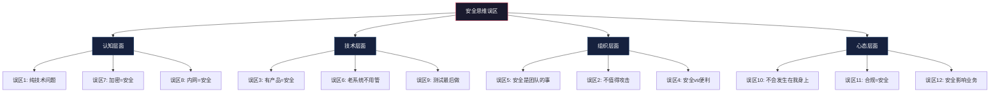
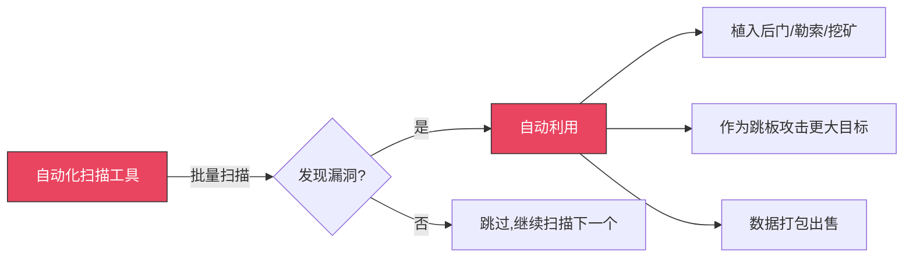
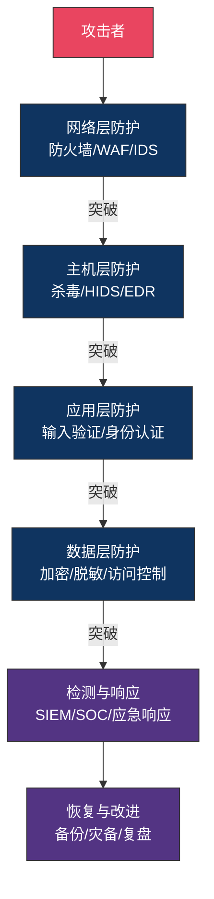
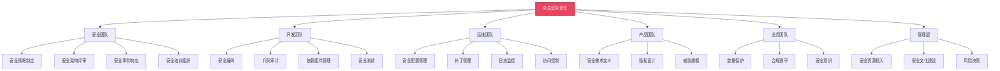
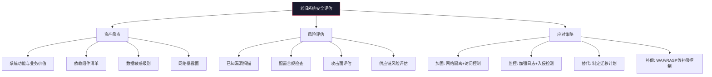
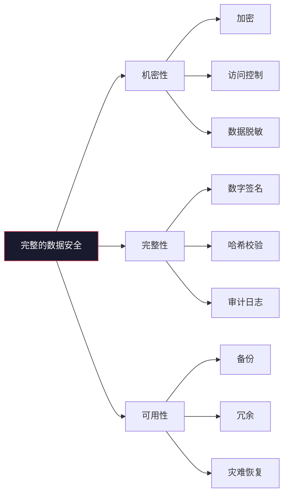
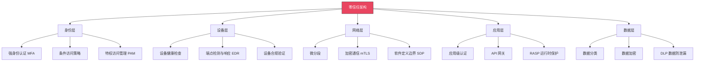
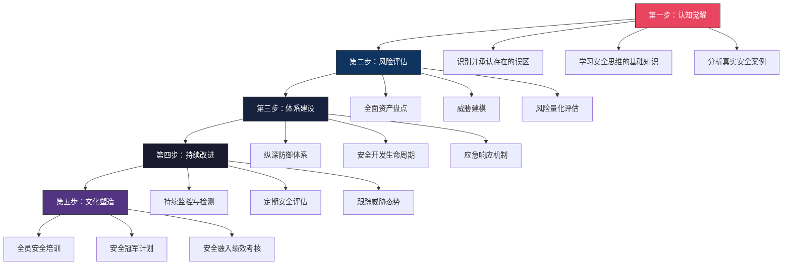

# 安全思维的常见误区

## 引言：为什么误区比无知更危险

在安全领域，**错误的认知比缺乏知识更具破坏性**。一个对安全一无所知的人至少知道自己需要寻求帮助，而一个抱持错误信念的人会自信地做出危险的决策，却浑然不觉。

安全思维的误区之所以根深蒂固，有三个核心原因：

1. **经验误导**：过去没出事不代表安全，只代表攻击者还没找到你，或者你还没发现自己已经被入侵。IBM《2024年数据泄露成本报告》显示，企业平均需要 **194 天** 才能发现数据泄露，最长可达数年。
2. **认知捷径**：人类大脑天然倾向于简化复杂问题，"有防火墙就安全"这种简单结论比"需要纵深防御体系"更容易接受和执行。
3. **利益驱动**：安全厂商倾向于夸大单一产品的效果，管理层倾向于用最小投入获得最大心理安慰，这些都强化了错误认知。

本章将逐一剖析安全思维中最常见的十大误区，每个误区都配有真实案例、深层分析和纠正方法。读完本章后，建议对照自身做一次"误区自检"——你可能正陷在其中某个误区里而不自知。



---

## 误区一：安全是纯技术问题

### 误区描述

许多人——尤其是技术背景出身的人——认为安全纯粹是技术问题：只要有足够好的防火墙、足够强的加密算法、足够多的安全工具，就能解决所有安全问题。

### 为什么这是误区

安全问题的根源从来不是单一维度的。Gartner 的研究数据显示，**超过 70% 的安全事件涉及人为因素**，而非纯粹的技术漏洞。将安全等同于技术，就像把健康等同于医疗设备一样片面。

**真实案例：2020年 Twitter 比特币诈骗事件**

2020年7月，Twitter 遭受了一次震惊全球的安全事件。攻击者通过 **电话社会工程学**（而非技术漏洞）欺骗 Twitter 员工，获取了内部管理工具的访问权限，然后劫持了奥巴马、马斯克、比尔·盖茨等高影响力账号，发布比特币诈骗信息。这次事件中：

- 没有复杂的漏洞利用
- 没有零日攻击
- 没有绕过任何技术防护
- 攻击者只是打了几个电话

Twitter 拥有世界顶级的安全技术团队和基础设施，但一个电话就突破了所有防线。这个案例深刻说明：**技术再强，也挡不住一个被社工的员工**。

安全问题的根源是多维度的：

| 维度 | 具体因素 | 典型失败模式 |
|------|----------|-------------|
| **人为因素** | 安全意识、操作习惯、社会工程学 | 钓鱼邮件点击率平均 3-5%，即使经过培训仍有 1-2% |
| **管理因素** | 策略制定、执行监督、资源分配 | 安全策略存在但无人执行检查 |
| **业务因素** | 安全与业务的平衡、成本效益 | 为赶上线跳过安全审查 |
| **技术因素** | 系统设计、代码实现、配置管理 | 默认配置未修改、依赖组件未更新 |
| **流程因素** | 变更管理、事故响应、访问审核 | 离职员工账号半年后仍在使用 |
| **物理因素** | 机房安全、设备管理、环境控制 | U盘插入未管控的电脑导致恶意软件传播 |

### 正确的理解

安全是一个 **系统工程**，需要技术、管理、人员三方面的协同。用一个公式来表达：

```text
实际安全能力 = 技术防护 × 管理有效性 × 人员意识
```

注意这里是 **乘法关系** 而非加法——任何一个维度为零，整体安全就归零。一个拥有顶级技术防护但管理混乱的组织，和一个管理完善但技术落后的组织，都可能遭受严重安全事件。

### 实践建议

1. **建立安全治理框架**：采用 NIST Cybersecurity Framework 或 ISO 27001，将安全从纯技术问题提升为组织治理问题
2. **推行安全文化建设**：定期安全培训、钓鱼演练、安全事件通报，让安全意识融入日常工作
3. **设置安全指标（KPI）**：钓鱼演练点击率、补丁及时率、安全事件响应时间等可量化指标
4. **安全左移**：将安全融入开发流程（DevSecOps），而非在最后才考虑

---

## 误区二：我没有什么值得攻击的

### 误区描述

很多人——尤其是中小企业和个人开发者——认为自己的系统或数据"不值钱"，不会成为攻击目标。"我只是个小网站，谁会来攻击我？"

### 为什么这是误区

这种想法基于一个根本性的错误假设：**攻击者只攻击有价值的目标**。事实上，现代网络攻击中，大量攻击是 **无差别自动化扫描**，攻击者根本不关心你是谁，只关心你是否容易被攻破。

**真实案例：Mirai 僵尸网络**

2016年，Mirai 僵尸网络感染了全球数十万台 IoT 设备（摄像头、路由器、DVR），发动了当时史上最大规模的 DDoS 攻击，导致 Twitter、Netflix、Reddit 等主流网站瘫痪。这些 IoT 设备的主人绝大多数是普通家庭用户，他们"没有什么值得攻击的"——但他们的设备被用来攻击了整个互联网。

攻击者的真实动机远比"偷你的数据"复杂：

| 攻击动机 | 说明 | 你是否是目标 |
|----------|------|-------------|
| **资源利用** | 你的服务器被用作挖矿、DDoS肉鸡、代理节点 | 任何有计算资源的系统 |
| **跳板攻击** | 你的系统被用作攻击其他目标的跳板，隐藏攻击者真实来源 | 任何可被控制的系统 |
| **数据聚合** | 看似无价值的数据在组合后具有价值（如邮箱+密码可用于撞库） | 任何存储用户数据的系统 |
| **供应链入口** | 你的系统是更大目标的入口（如供应商→大企业内网） | 任何与更大目标有关联的系统 |
| **勒索软件** | 加密你的数据索要赎金，不关心数据本身的价值 | 任何有数据且需要可用性的系统 |
| **机会主义** | 自动化工具批量扫描，有漏洞就打，不区分目标 | 任何暴露在网络上的系统 |

**真实案例：2021年 Colonial Pipeline 勒索事件**

美国最大的燃油管道运营商 Colonial Pipeline 遭受 DarkSide 勒索软件攻击，导致美国东海岸燃油供应中断。攻击入口是什么？一个 **未使用的旧 VPN 账号**，密码泄露在某次数据泄露中，且未启用多因素认证。攻击者不是针对这家公司的，他们只是在自动化扫描中发现了一个可用的入口。

**数据支撑**：Sophos《2023年勒索软件态势报告》显示，**66% 的受访组织在过去一年中遭受过勒索软件攻击**，其中中小企业占比超过 50%。攻击者偏好中小企业，正是因为中小企业安全投入少、容易攻破。

### 正确的理解



**任何连接到网络的系统都是潜在目标**。不要根据主观判断来决定是否需要安全防护。决定你是否需要安全防护的唯一标准是：你是否连接到网络。如果答案是"是"，你就需要安全防护。

### 实践建议

1. **最小暴露原则**：关闭不需要的端口和服务，减少攻击面
2. **自动化补丁管理**：确保系统和依赖组件及时更新
3. **基础安全措施**：强密码 + 多因素认证 + 定期备份（3-2-1 备份策略）
4. **监控与告警**：部署基础入侵检测（如 Fail2Ban、OSSEC），至少知道有人在尝试攻击你

---

## 误区三：部署了防火墙/杀毒软件就安全了

### 误区描述

认为部署了某种安全产品——防火墙、杀毒软件、WAF、IDS/IPS——就等于安全了。"我们有企业级防火墙，安全问题不用太担心。"

### 为什么这是误区

这种误区的核心错误是将 **安全产品等同于安全能力**。安全产品是工具，工具的效果取决于使用者的能力、配置的质量和整体体系的完备性。

**真实案例：WannaCry 勒索蠕虫（2017年）**

2017年5月，WannaCry 勒索蠕虫在 150 多个国家感染了超过 20 万台电脑，英国 NHS 医疗系统、西班牙电信、中国众多企事业单位均受影响。受影响的系统大多有杀毒软件和防火墙，但 WannaCry 利用的是 **已公开两个月的 EternalBlue 漏洞（MS17-010）**，微软早在 2017年3月就发布了补丁。这些系统的问题不在于缺少安全产品，而在于 **补丁未及时应用**。

安全产品的局限性：

| 局限性 | 说明 | 现实影响 |
|--------|------|----------|
| **每种产品有适用范围** | 防火墙防不了钓鱼邮件，杀毒软件防不了零日漏洞 | 产品选择不当等于无效防护 |
| **配置不当等于没有** | 默认配置往往过于宽松，需要根据实际环境调整 | 据 NIST 统计，80% 的安全事件与错误配置有关 |
| **攻击手法在进化** | 攻击者会研究绕过安全产品的方法 | 无文件攻击、内存马、合法工具滥用等都难以被传统产品检测 |
| **产品本身有漏洞** | 安全产品也是软件，也可能存在漏洞 | Fortinet、Palo Alto、Cisco 等安全产品的漏洞多次被大规模利用 |
| **签名库滞后** | 杀毒软件依赖已知特征库，对新型攻击无能为力 | 平均滞后时间 24-72 小时，APT 攻击可能使用从未见过的恶意软件 |
| **告警疲劳** | 大量误报导致真实告警被淹没 | 大型组织每天产生数万条安全告警，真正需要处理的可能不到 1% |

**真实案例：SolarWinds 供应链攻击（2020年）**

攻击者入侵了 SolarWinds 的软件构建流程，在 Orion 平台的更新包中植入了后门（SUNBURST）。这个带有后门的更新包被推送给 18000 多个组织，包括美国财政部、国土安全部、五角大楼等。这些组织都有世界级的安全产品和安全团队，但 **合法软件的合法更新** 不会触发任何安全告警。防火墙、杀毒软件、IDS 在这种攻击面前全部失效。

### 正确的理解

安全产品是安全体系的一部分，但不是全部。真正的安全需要 **纵深防御（Defense in Depth）**——在多个层次部署不同的防护措施，即使一层被突破，其他层仍然有效。



### 实践建议

1. **安全产品只是起点**：部署产品后，必须进行针对性配置、持续调优、定期验证
2. **定期红蓝对抗**：通过模拟攻击验证安全产品的实际效果
3. **关注配置基线**：使用 CIS Benchmarks 等标准检查安全配置
4. **建立安全运营能力**：产品需要人来运营，至少需要具备日志分析、告警响应、事件调查的能力

---

## 误区四：安全与便利性不可兼得

### 误区描述

认为提高安全性必然会降低系统的便利性和用户体验。"加了多因素认证用户会抱怨"、"安全审查拖慢了开发进度"。

### 为什么这是误区

这种误区将安全与便利性放在了对立面，但 **好的安全设计应该让安全变得"隐形"**——用户在享受便利的同时，安全已经在背后得到了保障。

**正面案例：Passkey（通行密钥）**

传统的密码认证是"不安全但方便"（用户记不住强密码，重复使用密码），后来加了短信验证码是"更安全但更麻烦"。而 Passkey 技术（FIDO2/WebAuthn）实现了：用户只需使用设备的生物识别（指纹、面部识别）即可完成认证，既比密码更安全（抗钓鱼、无法被暴力破解），又比密码更方便（无需记忆、无需输入）。

安全与便利性的关系有三种模式：

| 模式 | 描述 | 示例 |
|------|------|------|
| **安全↑ 便利↓** | 传统做法：加安全就加摩擦 | 每次操作都要输密码+验证码+审批 |
| **安全↓ 便利↑** | 危险做法：为便利牺牲安全 | 自动登录、永不过期的 Token |
| **安全↑ 便利↑** | 理想做法：好的安全设计同时提升体验 | Passkey、SSO、风险自适应认证 |

**为什么"安全影响效率"往往是设计问题**

如果安全措施让用户难以使用，问题通常不在安全本身，而在于安全措施的设计不够好：

- 用户抱怨记不住密码？→ 用密码管理器 + Passkey，而不是降低密码要求
- 开发者抱怨安全审查慢？→ 将安全检查自动化集成到 CI/CD，而不是取消审查
- 用户抱怨多因素认证麻烦？→ 用设备信任 + 风险评估实现自适应认证，只在高风险场景要求二次验证

### 正确的理解

安全应该是 **内建的（Security by Design）**，而不是外加的。当安全成为系统设计的核心考虑因素时，它可以同时提升安全性和用户体验。关键在于投入足够的设计思考，而不是简单地在现有流程上叠加安全检查。

### 实践建议

1. **安全设计优先**：在系统设计阶段就考虑安全，而非在完成后补丁
2. **用户体验测试**：对安全措施进行可用性测试，确保不产生不必要的摩擦
3. **风险自适应**：根据风险级别动态调整安全措施的强度
4. **自动化安全**：将安全检查融入自动化流程（CI/CD、自动化合规检查），减少人工干预

---

## 误区五：安全只是安全团队的事

### 误区描述

认为安全只是安全团队（安全部门、信息安全官）的责任，与开发、运维、产品、业务等部门无关。"出了安全问题找安全团队就好。"

### 为什么这是误区

安全团队通常只有 3-10 人（即使在大型企业），而开发、运维、业务团队可能有数百甚至数千人。**安全团队无法参与每一个代码提交、每一次配置变更、每一个业务决策**。将安全责任全部推给安全团队，就像把公司财务责任全部推给 CFO 一样荒谬。

**安全责任的分布：**



**真实案例：Capital One 数据泄露（2019年）**

2019年，Capital One 遭受数据泄露，影响超过 1 亿用户。攻击者利用的是一个 **WAF 配置错误**——Web 应用防火墙被赋予了过高的权限（可以访问 S3 存储桶），而这个配置错误发生在云架构部署阶段，属于运维团队的职责范围，安全团队直到数据泄露后才发现。如果运维团队在部署时有安全意识，这个配置错误在一开始就不会发生。

### 正确的理解

安全是每个人的责任，但不是每个人都要成为安全专家。正确的做法是：

1. **安全团队的角色**：制定策略、提供工具和指导、进行评审和审计、响应安全事件
2. **其他团队的角色**：在各自的工作中遵循安全最佳实践、及时报告安全问题
3. **管理层的角色**：提供资源支持、做出风险决策、建立安全文化

这就是 **"安全左移"（Shift Left Security）** 的核心思想——将安全责任从安全团队一个人扛，分散到整个开发和运维流程中。越早考虑安全，成本越低，效果越好：

| 发现阶段 | 修复成本（相对值） | 说明 |
|----------|-------------------|------|
| 需求设计阶段 | 1× | 在设计时发现安全问题，修改设计方案即可 |
| 开发编码阶段 | 5× | 需要修改代码，可能影响其他模块 |
| 测试阶段 | 15× | 需要返工开发、重新测试 |
| 上线后 | 100× | 需要紧急修复、可能面临数据泄露、法律诉讼、声誉损失 |

### 实践建议

1. **安全冠军计划**：在每个开发团队中培养 1-2 名"安全冠军"，负责团队内的安全推广
2. **安全即代码**：将安全策略编码化（Policy as Code），通过自动化工具强制执行
3. **安全培训分层**：不同角色接受不同内容的安全培训（开发者侧重安全编码，运维侧重安全配置，管理层侧重风险管理）
4. **安全融入绩效**：将安全指标纳入团队和个人的绩效考核

---

## 误区六：老旧系统不需要更新安全

### 误区描述

认为老旧系统已经稳定运行多年，没有出过安全问题，不需要更新安全措施。"这个系统跑了8年了，从来没出过事，别动它。"

### 为什么这是误区

"从来没出过事"有两种可能：一是真的没出过事，二是出了事你不知道。根据 Mandiant 的报告，**中位检测时间（Median Dwell Time）为 16 天**，但有些组织的入侵可能持续数年才被发现。

更关键的是，威胁环境在不断变化：

**真实案例：Log4Shell（CVE-2021-44228）**

Log4j 是一个存在了 20 多年的 Java 日志库，被全球数百万应用使用。2021年12月，一个严重的远程代码执行漏洞被公开，CVSS 评分 10.0（最高）。许多使用 Log4j 的老旧系统从未被更新过，因为它们"一直稳定运行"。但这个漏洞影响了 Log4j 2.0-beta9 到 2.14.1 的所有版本——一个存在了 20 年的代码库中的漏洞，直到 2021年才被发现。

老旧系统面临的安全挑战：

| 挑战 | 说明 | 示例 |
|------|------|------|
| **依赖组件过时** | 使用的库和框架版本已停止维护 | Python 2.7 已于 2020年停止支持 |
| **已知漏洞未修复** | 已公开的漏洞无补丁可用 | Windows Server 2003 不再收到安全更新 |
| **不支持现代安全特性** | 缺少 TLS 1.3、HTTP/2、CSP 等现代安全机制 | 只支持 SSLv3/TLS 1.0 的旧系统 |
| **配置管理混乱** | 多次变更后的配置已无人完全理解 | "别动它"背后是"谁都不知道改了会怎样" |
| **合规要求变化** | 新法规对老系统提出新要求 | GDPR、等保 2.0 对数据保护的新要求 |

### 正确的理解

所有系统都需要持续的安全维护，无论其新旧。对于老旧系统，正确的策略不是"别动它"，而是 **系统性地评估风险并制定应对计划**：



### 实践建议

1. **建立资产清单**：记录所有系统及其依赖组件、版本、负责人、业务价值
2. **定期漏洞扫描**：使用 Nessus、OpenVAS 等工具定期扫描已知漏洞
3. **网络隔离**：将老旧系统放在独立的网络区域，严格控制访问
4. **补偿控制**：在老旧系统前部署 WAF、RASP 等补偿性安全措施
5. **制定淘汰计划**：为每个老旧系统制定迁移或替代的时间表

---

## 误区七：加密就是安全

### 误区描述

认为使用了加密技术就等于安全了。"数据已经加密了，不用担心泄露"、"我们用了 AES-256，绝对安全"。

### 为什么这是误区

加密保护的是数据的 **机密性**（Confidentiality），但安全还包括 **完整性**（Integrity）和 **可用性**（Availability），即 CIA 三要素。更重要的是，加密的效果完全取决于 **密钥管理** 和 **实现质量**。

**真实案例：Adobe 密码泄露（2013年）**

2013年，Adobe 遭受数据泄露，影响 1.53 亿用户。Adobe 确实对用户密码进行了加密——但使用的是 **ECB 模式的 3DES**，且所有用户使用相同的加密密钥。这导致相同密码的加密结果相同，攻击者通过频率分析可以轻易推断出常见密码。更糟糕的是，Adobe 还在密码加密时附带了密码提示，很多提示直接暴露了密码内容。**加密了，但加密方式是灾难性的**。

加密常见陷阱：

| 陷阱 | 说明 | 正确做法 |
|------|------|----------|
| **自制加密算法** | "安全性不透明"不等于"安全" | 永远使用经过验证的标准算法（AES、ChaCha20） |
| **ECB 模式** | 相同明文→相同密文，泄露模式 | 使用 CBC、GCM 等安全模式 |
| **密钥硬编码** | 密钥写在代码中，泄露即失效 | 使用密钥管理服务（KMS、HashiCorp Vault） |
| **弱随机数生成** | 使用时间戳等可预测值做种子 | 使用 CSPRNG（密码学安全伪随机数生成器） |
| **忽略完整性** | 只加密不签名，密文可被篡改 | 使用 AEAD（如 AES-GCM）同时保证机密性和完整性 |
| **过时算法** | 使用 MD5、SHA1、DES、RC4 等已不安全的算法 | 跟随 NIST 等机构的算法推荐 |
| **密钥管理混乱** | 密钥未定期轮换、未安全存储、离职员工仍持有密钥 | 建立密钥生命周期管理流程 |

**真实案例：加密货币交易所被盗**

多个加密货币交易所声称"私钥已加密存储"，但仍被黑客盗取大量加密资产。原因包括：加密密钥与加密数据存储在同一服务器、密钥管理流程存在缺陷、热钱包与冷钱包未做有效隔离。**加密只是安全链条中的一环，链条中最弱的环节决定了整体安全**。

### 正确的理解



加密是重要的安全工具，但需要 **正确使用**。完整的加密安全包含：算法选择 → 密钥生成 → 密钥存储 → 密钥分发 → 密钥轮换 → 密钥销毁。其中任何一个环节出问题，整个加密体系就可能崩溃。

### 实践建议

1. **使用标准库**：不要自己实现加密算法，使用 OpenSSL、libsodium、Tink 等经过审计的库
2. **密钥管理专业化**：使用 HSM 或 KMS 管理密钥，密钥与数据分离存储
3. **定期算法审查**：检查系统中使用的加密算法是否仍然安全，及时替换过时算法
4. **加密≠替代其他安全措施**：加密要与访问控制、完整性校验、审计日志等配合使用

---

## 误区八：内部网络是安全的

### 误区描述

认为内部网络（企业内网、数据中心内网）是可信的，只有外部网络才需要重点防护。"这是内网，不需要 HTTPS"、"内网服务不需要认证"。

### 为什么这是误区

这种误区基于一个已经过时的安全模型——**城堡模型（Castle Model）**：建一堵高墙（防火墙），墙外是不可信的，墙内是可信的。但现代攻击已经证明，这种模型存在致命缺陷。

**真实案例：NotPetya（2017年）**

2017年，NotPetya 勒索蠕虫通过乌克兰的 M.E.Doc 会计软件更新传播。一旦进入企业内网，它利用 **EternalBlue 漏洞** 和 **Mimikatz 抓取的凭据** 在内网中快速横向移动，在几小时内加密了整个企业网络中的所有系统。Maersk（全球最大的集装箱航运公司）在 10 分钟内失去了全部 45000 台 PC 和 4000 台服务器，损失超过 3 亿美元。

NotPetya 的扩散路径暴露了"内网=安全"的致命漏洞：

1. 内网服务之间没有认证（SMB 协议不验证来源）
2. 管理员凭据在多台机器上相同（Pass-the-Hash 攻击）
3. 内网没有微分段，一个节点被攻破即可访问整个网络
4. 内网流量未加密，凭据在网络中明文传输

内部网络面临的真实威胁：

| 威胁类型 | 说明 | 统计数据 |
|----------|------|----------|
| **内部人员威胁** | 员工有意或无意造成安全事件 | Verizon DBIR 报告：25% 的数据泄露涉及内部人员 |
| **已入侵的设备** | 攻击者已控制内网中的某个设备 | 平均横向移动时间不到 2 小时 |
| **横向移动** | 从一个被入侵的设备移动到其他设备 | 内网中 80% 的攻击涉及横向移动 |
| **特权滥用** | 拥有过多权限的内部人员滥用权限 | 平均 60% 的员工拥有超出工作需要的权限 |
| **供应链入侵** | 通过供应商/合作伙伴的连接进入内网 | SolarWinds、Codecov 等供应链攻击影响了数万组织 |

### 正确的理解

零信任架构（Zero Trust Architecture）是替代城堡模型的现代安全理念，其核心原则：

1. **永不信任，始终验证**（Never Trust, Always Verify）：不因为请求来自内网就默认信任
2. **最小权限原则**（Least Privilege）：每个实体只获得完成任务所需的最小权限
3. **微分段**（Micro-segmentation）：将网络分割成小的安全区域，限制横向移动
4. **持续验证**（Continuous Verification）：不是一次验证后就永久信任，而是持续评估
5. **假设已被入侵**（Assume Breach）：假设攻击者已经在内网中，所有安全措施都基于这个假设



### 实践建议

1. **内网服务也需要认证**：所有服务间通信都需要认证和授权，不能因为"在内网"就跳过
2. **实施微分段**：使用网络虚拟化技术将内网分割成小的安全区域
3. **加密内网流量**：使用 mTLS 加密服务间通信，防止内网嗅探
4. **部署内网检测**：使用 NDR（网络检测与响应）工具监控内网异常流量
5. **特权访问管理**：使用 PAM 工具管理特权账号，实施即时权限提升（JIT）

---

## 误区九：安全测试可以在最后做

### 误区描述

认为安全测试可以在开发完成后、上线前集中进行。"先完成功能开发，安全测试放到最后两周"。

### 为什么这是误区

这就像盖一栋楼，等楼盖好了才检查地基是否牢固——如果地基有问题，整个楼都得推倒重来。

**安全缺陷的修复成本随发现时间指数增长：**


**真实案例：设计层面的安全缺陷**

某电商平台在设计订单系统时，没有考虑并发场景下的库存超卖问题。上线后在大促期间出现库存超卖，直接经济损失数百万元。如果在设计阶段进行威胁建模，这个问题可以在成本最低的阶段被发现和解决。

在最后才做安全测试，会面临以下困境：

| 困境 | 说明 |
|------|------|
| **时间压力** | 临近上线发现安全问题，可能因为"赶进度"而被忽略或降级 |
| **修复成本高** | 涉及架构变更的安全问题，修复成本是设计阶段的 100 倍 |
| **回归风险** | 安全修复可能引入新的功能 Bug，需要额外测试时间 |
| **遗漏风险** | 集中测试容易遗漏，因为测试范围和时间都有限 |
| **团队士气** | 反复被要求修改已"完成"的代码，影响开发团队积极性 |

### 正确的理解

安全应该贯穿整个开发生命周期（SDL - Security Development Lifecycle），而非集中在最后阶段：

| 阶段 | 安全活动 | 输出物 |
|------|----------|--------|
| **需求** | 安全需求分析、隐私评估 | 安全需求文档、隐私影响评估（PIA） |
| **设计** | 威胁建模、安全架构评审 | 威胁模型文档、安全架构方案 |
| **编码** | 安全编码规范、SAST 静态分析 | 安全编码检查清单、SAST 报告 |
| **测试** | DAST 动态分析、渗透测试、模糊测试 | 安全测试报告、漏洞清单 |
| **部署** | 安全配置审查、镜像扫描 | 部署安全检查清单 |
| **运维** | 持续监控、漏洞管理、应急响应 | 安全事件响应计划 |

### 实践建议

1. **威胁建模前置**：在设计阶段进行威胁建模，识别潜在安全风险
2. **SAST 集成到 CI/CD**：使用 SonarQube、Semgrep、CodeQL 等工具在代码提交时自动检测安全问题
3. **安全门禁**：在 CI/CD 流程中设置安全质量门禁，高危漏洞阻断部署
4. **定期渗透测试**：每个迭代或版本发布前进行针对性渗透测试
5. **安全评审常态化**：代码评审中包含安全审查环节

---

## 误区十：安全事件不会发生在我身上

### 误区描述

抱有侥幸心理，认为安全事件是"别人的事"，不会发生在自己身上。"我们的系统运行得好好的，不需要应急响应计划。"

### 为什么这是误区

这是一种典型的 **乐观偏误（Optimism Bias）** 和 **幸存者偏差（Survivorship Bias）** 的结合。你没有经历过安全事件，不代表你没有风险，可能只是你还没有被发现。

**数据支撑：**

- IBM《2024年数据泄露成本报告》：全球平均数据泄露成本为 **488 万美元**
- Verizon《2024年数据泄露调查报告》：**74% 的数据泄露涉及人为因素**
- Sophos《2023年勒索软件态势报告》：**66% 的组织在过去一年遭受过勒索软件攻击**
- Ponemon Institute：中小企业在遭受严重安全事件后，**60% 在 6 个月内倒闭**

**真实案例：中小企业的真实遭遇**

一家 50 人的设计公司，使用盗版软件和弱密码，未部署任何安全防护。某天早上所有员工发现电脑被勒索软件加密，公司 10 年的设计文件全部无法访问。攻击者索要 3 比特币（当时约 15 万元）。公司没有备份，没有应急响应计划，最终支付了赎金，但部分文件仍无法恢复。这不是假设，这是在全球各地每天都在发生的真实事件。

### 正确的理解

安全事件是 **概率性** 的，概率不为零就代表它可能发生。正确的思维方式是：

```text
风险 = 威胁可能性 × 影响程度
```

即使威胁可能性很低，如果影响程度足够高（如数据全部丢失、公司倒闭），风险仍然很高。你需要做的不是祈祷安全事件不发生，而是 **做好准备让安全事件发生时影响最小**。

### 实践建议

1. **制定应急响应计划**：明确安全事件发生时的处理流程、负责人、联系方式
2. **定期演练**：通过桌面推演或实战演练验证应急响应计划的有效性
3. **备份验证**：不仅要备份，还要定期验证备份的可恢复性（3-2-1 备份策略：3 份副本、2 种介质、1 份异地）
4. **安全保险**：考虑购买网络安全保险，转移部分风险
5. **威胁情报订阅**：关注当前活跃的威胁和攻击手法，提前做好防护

---

## 误区十一：合规就是安全

### 误区描述

认为通过了安全合规认证（如 ISO 27001、等保测评、PCI DSS）就等于安全了。"我们刚过了等保三级，安全方面没问题。"

### 为什么这是误区

合规是 **最低标准**，不是 **最佳实践**。合规检查通常是基于过去已知风险制定的清单，而攻击者在不断创新。通过合规认证只代表你在检查的那一刻满足了某些最低要求，不代表你真的安全。

**真实案例：Equifax 数据泄露（2017年）**

Equifax 在数据泄露前通过了 PCI DSS 合规审计。但在 2017年，攻击者利用一个 **已公开两个月的 Apache Struts 漏洞**（CVE-2017-5638）入侵了 Equifax 系统，窃取了 1.47 亿用户的个人信息。Equifax 通过了合规审计，但没有及时修补已知漏洞——合规审计并没有检查这一点。

合规与安全的关系：

| 维度 | 合规 | 安全 |
|------|------|------|
| **驱动力** | 法规要求、行业标准 | 实际风险、威胁态势 |
| **时间视角** | 基于过去已知风险 | 面向当前和未来威胁 |
| **评估方式** | 清单式检查、定期审计 | 持续监控、动态评估 |
| **覆盖范围** | 有明确边界和范围 | 需要覆盖所有资产和攻击面 |
| **标准** | 最低要求 | 最佳实践 |
| **灵活性** | 变更慢，需要修订标准 | 需要快速响应新威胁 |

### 正确的理解

合规是安全的 **起点**，不是终点。合规给你一个框架和最低标准，但真正的安全需要在此基础上持续改进。正确的做法是：以合规为基础，以实际风险为导向，建立超越合规的安全能力。

### 实践建议

1. **合规+风险双驱动**：不要只做合规要求的事情，要根据实际风险评估结果补充安全措施
2. **持续合规**：不要只在审计前突击准备，要建立持续合规的机制
3. **超越清单**：合规检查清单是最低要求，主动进行超出清单范围的安全评估
4. **威胁情报驱动**：根据当前威胁态势调整安全措施，而非只依赖合规标准

---

## 误区十二：安全会阻碍业务发展

### 误区描述

认为安全投入是"成本中心"，会拖慢产品上市速度、增加开发成本、阻碍业务创新。"先把业务做起来，安全以后再说。"

### 为什么这是误区

这种思维将安全与业务放在了对立面，但实际上 **安全是业务的保障，而非阻碍**。没有安全的业务就像没有刹车的汽车——跑得越快，风险越大。

**数据支撑：**

- IBM 报告显示，有成熟安全团队的组织，数据泄露平均成本比没有的低 **220 万美元**
- 拥有 Incident Response（事件响应）计划并定期演练的组织，平均节省 **242 万美元** 的泄露成本
- Ponemon Institute 数据显示，安全事件导致的平均业务中断时间为 **23 天**

**反面案例：没有安全的代价**

一家快速发展的互联网创业公司，为了快速迭代，跳过了所有安全措施——无代码审计、无渗透测试、无安全培训。在获得大额融资后一个月，遭受勒索软件攻击，全部用户数据被加密。公司不得不向用户公开披露安全事件，导致大量用户流失，融资款大部分用于赎金支付和危机公关。公司最终在 6 个月后倒闭。

### 正确的理解

安全不是业务的对立面，而是业务的 **赋能器**。良好的安全能力可以：

1. **赢得客户信任**：安全认证和合规资质是进入很多市场的前提
2. **降低运营风险**：减少因安全事件导致的业务中断和经济损失
3. **加速合规**：满足 GDPR、CCPA、等保等法规要求，避免高额罚款
4. **提升品牌价值**：安全能力是品牌竞争力的一部分

### 实践建议

1. **用业务语言沟通安全**：将安全风险转化为业务风险（财务损失、声誉损害、法律后果）
2. **安全融入 DevOps**：通过 DevSecOps 将安全融入开发流程，减少安全对效率的影响
3. **自动化安全**：投资自动化安全工具，减少人工安全检查的开销
4. **风险量化**：使用 FAIR（Factor Analysis of Information Risk）等方法量化安全风险，用数据支撑安全投入决策

---

## 如何系统性地避免安全误区

### 误区自检清单

对照以下清单，检查你或你的组织是否陷入了安全误区：

| 检查项 | 问题 | 陷阱指示 |
|--------|------|----------|
| □ | 你的安全策略是否主要依赖单一安全产品？ | 误区三 |
| □ | 你的内网服务是否不做认证和加密？ | 误区八 |
| □ | 你的安全测试是否只在上线前进行？ | 误区九 |
| □ | 你的安全责任是否主要由安全团队承担？ | 误区五 |
| □ | 你的老旧系统是否处于"别动它"状态？ | 误区六 |
| □ | 你是否有完整的应急响应计划并定期演练？ | 误区十 |
| □ | 你是否将合规认证等同于安全？ | 误区十一 |
| □ | 你是否认为安全只是成本投入？ | 误区十二 |

### 建立正确安全思维的五步法



1. **认知觉醒**：识别并承认自己存在的安全误区，这是改变的第一步
2. **风险评估**：全面评估自身面临的安全风险，建立风险基线
3. **体系建设**：基于风险评估结果，建立纵深防御安全体系
4. **持续改进**：安全不是一次性工程，需要持续监控、评估和改进
5. **文化塑造**：将安全意识融入组织文化，让安全成为每个人的本能

### 避免误区的核心原则

1. **持续学习**：安全领域不断发展，需要持续更新知识。订阅 CVE、关注安全社区（如 OWASP、MITRE ATT&CK）、参加安全会议
2. **多角度思考**：从攻击者、防御者、管理者、用户等不同角度审视安全问题
3. **实践验证**：不要仅凭理论判断，通过红蓝对抗、渗透测试验证安全措施的有效性
4. **同行交流**：与其他安全从业者交流，了解不同的观点和经验，避免闭门造车
5. **案例学习**：通过学习真实的安全案例（如 MITRE ATT&CK 的案例库），理解安全问题的复杂性
6. **量化思维**：用数据而非直觉做安全决策，将安全风险转化为可量化的业务风险

---

*** 
> "最大的安全风险，是认为自己没有安全风险。"
