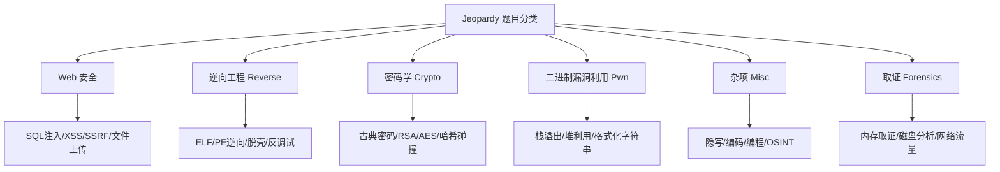
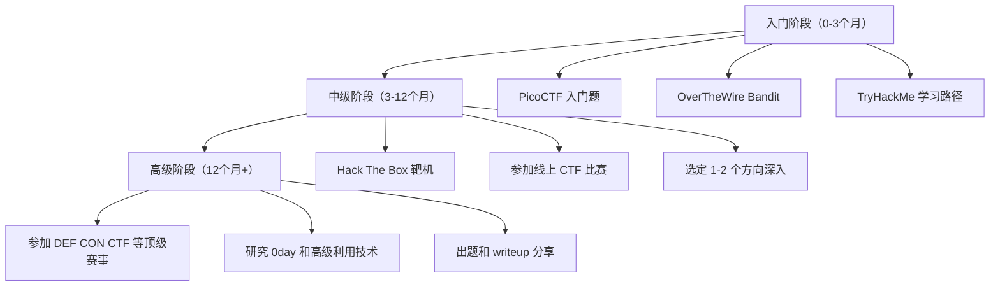
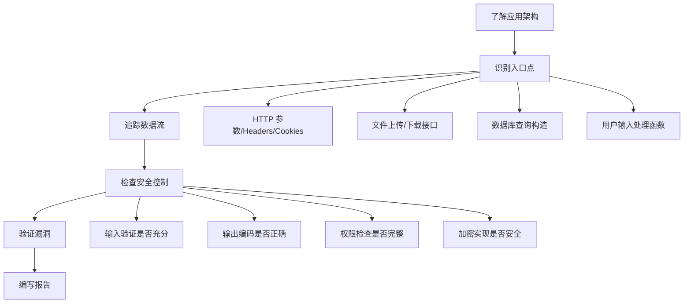
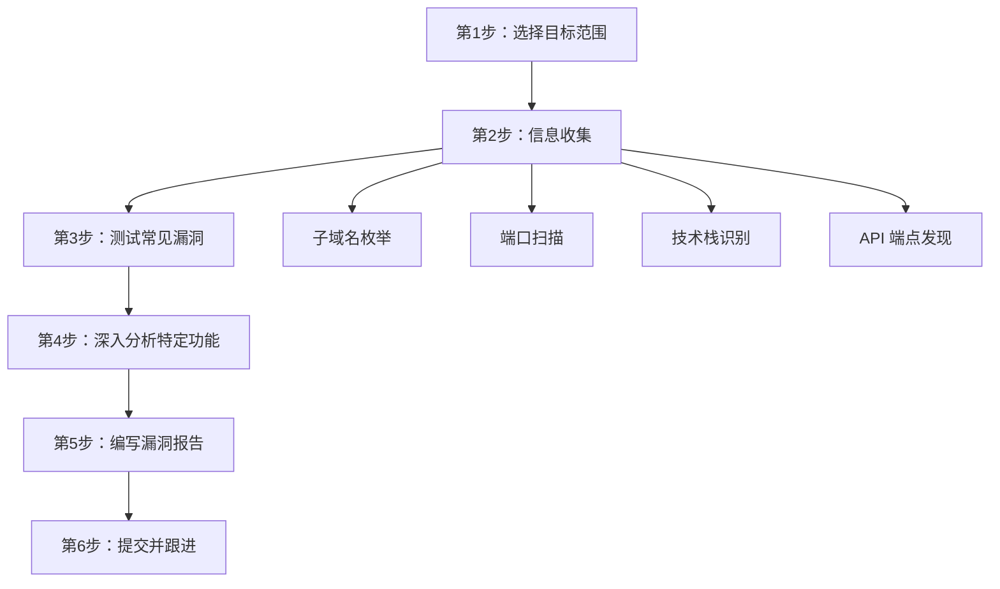
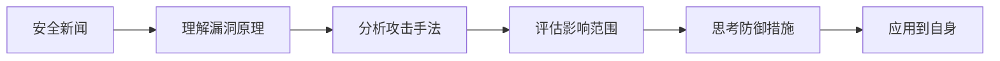
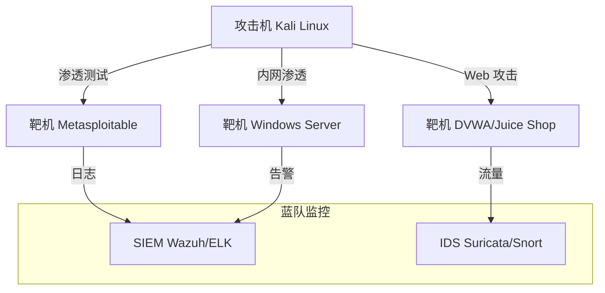
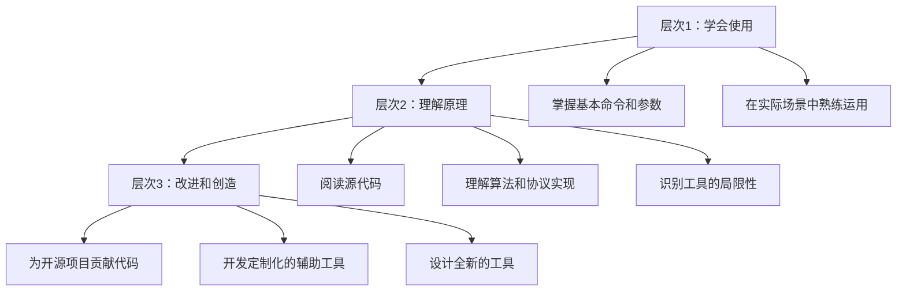

# 安全思维的练习方法

安全思维不是知识——你无法通过阅读一本书就"学会"它。安全思维是一种技能，必须通过大量、系统、有目的的练习才能内化。正如钢琴家需要数万小时的指法训练，安全研究者也需要持续的刻意练习来磨练自己的"安全直觉"。

本章提供一套完整的练习体系，从入门到精通，覆盖 CTF 竞赛、代码审计、漏洞赏金、模糊测试、威胁建模、红蓝对抗、安全工具研究、社区参与八大方向，并给出可执行的每日/每周计划模板和进度跟踪方法。

## 一、刻意练习：安全技能成长的底层逻辑

### 1.1 什么是刻意练习

刻意练习（Deliberate Practice）是心理学家 Anders Ericsson 提出的技能习得理论。其核心要素：

| 要素 | 说明 | 在安全领域的映射 |
|------|------|------------------|
| 明确目标 | 每次练习有具体的技能目标 | "今天练习 SQL 注入的盲注技巧"而非"学学 Web 安全" |
| 即时反馈 | 练习后能快速知道对错 | CTF 的 flag 验证、代码审计的 PoC 复现 |
| 舒适区边缘 | 难度略高于当前能力 | 从 Jeopardy 简单题 → 中等题 → 竞赛题 |
| 重复与修正 | 反复练习同一技能直到自动化 | 同一类漏洞反复审计，直到形成肌肉记忆 |
| 心理表征 | 建立高效的思维模型 | 看到文件上传功能就自动联想到 5 种攻击路径 |

### 1.2 安全技能的四个阶段


- **无意识无能力**：初学者不知道 SQL 注入是什么，自然不会去检测它
- **有意识无能力**：学了 SQL 注入的概念，但审计时找不到它
- **有意识有能力**：能通过系统化的检查清单找到 SQL 注入，但需要刻意努力
- **无意识有能力**：看到 `string query = "SELECT * FROM users WHERE id=" + id` 就本能地警觉

大多数练习方法的目标是帮助你从第二阶段推进到第四阶段。

### 1.3 练习的常见失败模式

| 失败模式 | 表现 | 纠正方法 |
|----------|------|----------|
| 只看不做 | 阅读大量 writeup 但从不自己动手 | 强制自己先尝试 30 分钟再看答案 |
| 刷题机器 | 追求数量，做完就忘 | 每道题写解题报告，定期回顾 |
| 舒适区停留 | 只做自己擅长的题目类型 | 每周安排 2 道不擅长类型的题目 |
| 缺乏反馈 | 做完练习不知道对错 | 使用自动化验证（flag、测试用例） |
| 孤立练习 | 从不与他人交流 | 加入 CTF 战队或安全社区 |

## 二、CTF 竞赛练习

### 2.1 什么是 CTF

CTF（Capture The Flag）是信息安全领域最广泛使用的实战训练方式。参赛者通过解决安全挑战题目来获取隐藏的"flag"字符串（通常格式为 `flag{...}` 或 `CTF{...}`）。CTF 的价值在于它将抽象的安全知识转化为具体的、可验证的实践任务。

### 2.2 CTF 的三大赛制

**Jeopardy（解题模式）**

最常见、最适合自学的赛制。题目按类别分组，每道题独立计分，难度从 100 到 1000+ 不等。



**Attack-Defense（攻防模式）**

每支队伍运行相同的服务程序，需要同时完成两项任务：攻击对手的服务获取 flag，修补自己服务中的漏洞防止被攻击。这种赛制节奏极快（通常每 5-15 分钟刷新一轮 flag），对综合能力要求最高。

**King of the Hill（抢占模式）**

多支队伍争夺同一台或多台目标机器的控制权。需要快速发现漏洞、获取 root 权限、植入后门、清除其他队伍的痕迹。强调速度和持久化控制能力。

### 2.3 推荐的 CTF 练习平台

| 平台 | 难度 | 特点 | 适合阶段 | 网址 |
|------|------|------|----------|------|
| PicoCTF | 入门 | 卡通化界面，有引导教程，题目覆盖面广 | 完全零基础 | picoctf.org |
| OverTheWire | 入门-中级 | 通过 Bandit/Natas 等系列关卡循序渐进 | 学习 Linux 和 Web 基础 | overthewire.org |
| TryHackMe | 入门-中级 | 引导式学习路径，内含虚拟机 | 系统化入门 | tryhackme.com |
| Hack The Box | 中级-高级 | 大量真实环境靶机，活跃社区 | 有一定基础后 | hackthebox.com |
| PentesterLab | 中级 | Web 安全专项，从基础到高级的完整路径 | 专注 Web 安全 | pentesterlab.com |
| CTFtime | 全级别 | 全球 CTF 赛事聚合平台，可查看 writeup | 参加比赛 | ctftime.org |
| pwnable.kr | 中级-高级 | 二进制漏洞利用专项 | 学习 Pwn 方向 | pwnable.kr |
| CryptoHack | 中级 | 密码学专项练习 | 学习 Crypto 方向 | cryptohack.org |
| Root Me | 全级别 | 法国平台，题目种类齐全 | 综合练习 | root-me.org |

### 2.4 CTF 练习的正确方法

**Step 1：建立解题框架**

不要拿到题目就盲目尝试。建立一个标准化的解题流程：

```text
1. 审题 → 2. 信息收集 → 3. 分析 → 4. 假设 → 5. 验证 → 6. 求解 → 7. 复盘
```

**Step 2：写解题报告（Writeup）**

每道题完成后，必须写解题报告。解题报告的结构：

```markdown
# 题目名称 - [难度] - [分类]

## 题目描述
简述题目给出的信息和目标。

## 解题过程
### 1. 初始分析
我首先注意到了什么，初步判断是什么方向。

### 2. 尝试与失败
我尝试了什么方法，为什么失败了。

### 3. 关键突破
什么思路或工具帮助我找到了关键线索。

### 4. 最终解法
完整的解题步骤和代码。

## Flag
flag{...}

## 学到了什么
这道题教会了我什么新知识或新技巧。

## 可以改进的地方
如果重来，我会用什么更高效的方法。
```

**Step 3：建立个人知识库**

将解题报告按分类整理，建立自己的安全知识库。随着时间积累，这个知识库会成为你最宝贵的学习资产。

### 2.5 CTF 学习路径建议



## 三、代码审计练习

### 3.1 什么是代码审计

代码审计（Code Audit）是对源代码进行系统性安全检查的过程。与 CTF 的"黑盒"思维不同，代码审计要求你以"白盒"视角理解程序的每一个细节。这种练习直接培养你在真实工作中发现漏洞的能力。

代码审计培养的核心能力：

- **数据流追踪能力**：追踪用户输入从入口到出口的完整路径
- **危险模式识别能力**：快速识别不安全的编码模式
- **上下文理解能力**：理解代码在什么条件下执行、被谁调用
- **漏洞链构造能力**：将多个低危问题串联成高危漏洞

### 3.2 代码审计的标准流程



**Step 1：了解应用架构**

在开始审计之前，花时间理解：
- 项目使用了什么框架和技术栈
- 目录结构和模块划分
- 数据库类型和 ORM 层
- 认证和授权机制的实现方式

**Step 2：识别入口点（Source）**

入口点是所有用户可控数据进入系统的位置。常见的入口点：

```python
# Web 应用的常见入口点
request.args.get('param')       # URL 查询参数
request.form['field']           # 表单数据
request.json                    # JSON 请求体
request.headers['X-Custom']     # HTTP 头
request.cookies['session']      # Cookie
request.files['upload']         # 文件上传
os.environ.get('CONFIG')        # 环境变量
open(user_input).read()         # 文件读取
subprocess.call(user_cmd)       # 命令执行
```

**Step 3：追踪数据流（Source → Sink）**

从入口点出发，追踪数据流向危险函数（Sink）的过程。关键问题是：数据在到达 Sink 之前是否经过了充分的验证和编码？

| 危险 Sink | 攻击类型 | 安全的处理方式 |
|-----------|----------|----------------|
| `execute(query)` | SQL 注入 | 使用参数化查询 |
| `eval(code)` | 代码注入 | 避免 eval，使用安全的替代方案 |
| `os.system(cmd)` | 命令注入 | 使用 `subprocess` 的列表参数 |
| `render(template)` | 模板注入 | 使用自动转义的模板引擎 |
| `open(path)` | 路径遍历 | 验证路径在允许的目录内 |
| `write(response, data)` | XSS | 对输出进行上下文相关的编码 |

**Step 4：检查安全控制**

验证系统是否实施了足够的安全控制：
- 认证：每个需要认证的接口是否都检查了登录状态？
- 授权：用户 A 是否能访问用户 B 的资源（IDOR）？
- 输入验证：验证逻辑是否在服务端执行？是否可被绕过？
- 输出编码：不同上下文（HTML/JS/URL/SQL）是否使用了正确的编码？

**Step 5：验证漏洞**

发现可疑问题后，必须构造 PoC（Proof of Concept）来验证漏洞是否真实可利用。不可利用的理论问题优先级较低。

### 3.3 推荐的练习项目

**故意设计的漏洞应用（入门）**：

| 项目 | 类型 | 特点 | 安装方式 |
|------|------|------|----------|
| DVWA | Web | 经典的漏洞 Web 应用，支持难度切换 | Docker: `vulnerables/web-dvwa` |
| WebGoat | Web | OWASP 出品，有详细教程 | Docker: `webgoat/webgoat` |
| Juice Shop | Web | 现代 Web 应用，覆盖 OWASP Top 10 | Docker: `bkimminich/juice-shop` |
| SQLi-labs | SQL 注入 | 75 个 SQL 注入练习关卡 | GitHub 下载 |
| XSS Game | XSS | Google 出品的 XSS 练习 | xss-game.appspot.com |
| Metasploitable | 系统 | 整个操作系统充满漏洞 | 虚拟机镜像 |
| Vulhub | 综合 | 真实 CVE 环境的 Docker 复现集合 | GitHub: vulhub/vulhub |

**真实开源项目（进阶）**：

当漏洞应用的练习不够刺激时，转向真实项目审计：

1. **选择目标**：GitHub 上 star 数 100-1000 的小型项目（代码量可控，维护者较活跃，更可能接受你的安全贡献）
2. **关注高危区域**：认证模块、文件处理、支付逻辑、权限检查
3. **使用自动化工具辅助**：Semgrep、CodeQL、SonarQube 发现候选点，人工确认
4. **负责任披露**：发现漏洞后通过项目的安全策略或平台（如 HackerOne）进行披露

### 3.4 代码审计的进阶技巧

**危险函数追踪法**：

从危险函数（Sink）出发反向追踪，寻找是否有未经过滤的用户输入能到达此处：

```bash
# 使用 grep 快速定位危险函数调用
grep -rn "eval\|exec\|system\|os\.popen\|subprocess" --include="*.py" .
grep -rn "query\|execute\|raw_sql" --include="*.py" .
grep -rn "\.innerHTML\|\.outerHTML\|document\.write" --include="*.js" .
```

**认证绕过检查清单**：

```text
□ 登录接口是否有速率限制？
□ 密码重置流程是否存在逻辑漏洞？
□ 会话令牌是否在登出后失效？
□ 是否存在"记住我"功能的令牌安全问题？
□ 多因素认证是否可被绕过？
□ 是否存在 IDOR（不安全的直接对象引用）？
```

## 四、Bug Bounty 练习

### 4.1 什么是 Bug Bounty

Bug Bounty（漏洞赏金）是企业授权安全研究者在指定范围内寻找漏洞并给予报酬的计划。与 CTF 不同，Bug Bounty 是在真实系统上练习，且发现的漏洞有真实的经济回报。它是从"练习"到"实战"的过渡桥梁。

### 4.2 主流 Bug Bounty 平台

| 平台 | 特点 | 适合阶段 | 网址 |
|------|------|----------|------|
| HackerOne | 全球最大，企业客户多 | 中级+ | hackerone.com |
| Bugcrowd | 涵盖 Web/移动/IoT | 中级+ | bugcrowd.com |
| Intigriti | 欧洲平台，门槛较低 | 初级+ | intigriti.com |
| 漏洞盒子 | 国内最大平台 | 初级+ | vulbox.com |
| 补天 | 国内知名平台 | 初级+ | butian.net |

### 4.3 Bug Bounty 入门路径



**新手建议**：

1. **选择 VDP（漏洞披露计划）**：不给钱但接受漏洞报告的项目，压力小，适合练手
2. **从小目标开始**：选择范围较小的项目，避免海量攻击面导致无从下手
3. **关注业务逻辑漏洞**：自动化工具难以发现的逻辑漏洞，是新手的机会
4. **写好报告**：一份清晰的漏洞报告比漏洞本身更重要。报告应包含：漏洞描述、复现步骤、影响分析、修复建议

### 4.4 常见的高回报漏洞类型

| 漏洞类型 | 说明 | 自动化发现难度 |
|----------|------|----------------|
| IDOR | 通过修改对象 ID 访问他人数据 | 中 |
| 认证绕过 | 绕过登录/2FA 机制 | 高 |
| 业务逻辑漏洞 | 价格篡改、竞态条件、流程绕过 | 极高 |
| SSRF | 服务端请求伪造，访问内部资源 | 中 |
| 存储型 XSS | 恶意脚本持久化存储 | 低-中 |
| 账户接管 | 完全控制他人账户 | 高 |
| 供应链漏洞 | 第三方组件的已知漏洞 | 低 |

## 五、模糊测试（Fuzzing）练习

### 5.1 什么是模糊测试

模糊测试是一种自动化安全测试技术，通过向目标程序输入大量随机或半随机的数据，观察程序是否出现崩溃、异常行为或安全漏洞。Fuzzing 是发现 0day 漏洞最有效的方法之一，Google 的 OSS-Fuzz 项目已经发现了超过 10,000 个漏洞。

### 5.2 Fuzzing 的分类

| 类型 | 说明 | 代表工具 |
|------|------|----------|
| 基于变异的 Fuzzing | 对已有的合法输入进行随机变异 | AFL++, libFuzzer |
| 基于生成的 Fuzzing | 根据输入格式规范生成测试数据 | Peach, Boofuzz |
| 覆盖率引导的 Fuzzing | 根据代码覆盖率反馈调整输入 | AFL++, Honggfuzz |
| 智能合约 Fuzzing | 针对 Solidity 等合约语言 | Echidna, Foundry |

### 5.3 Fuzzing 入门练习

**练习 1：使用 AFL++ Fuzz 一个简单的 C 程序**

```c
// vuln.c - 故意设计的漏洞程序
#include <stdio.h>
#include <string.h>
#include <stdlib.h>

int process_input(const char *input) {
    char buffer[64];
    // 漏洞：没有检查 input 长度
    strcpy(buffer, input);
    
    if (strcmp(buffer, "SECRET") == 0) {
        // 漏洞：格式化字符串
        printf(input);
        return 1;
    }
    return 0;
}

int main(int argc, char *argv[]) {
    if (argc < 2) {
        printf("Usage: %s <input>\n", argv[0]);
        return 1;
    }
    return process_input(argv[1]);
}
```

```bash
# 编译（使用 AFL++ 的编译器）
afl-cc -o vuln vuln.c

# 创建种子输入
mkdir -p fuzz_input
echo "hello" > fuzz_input/test.txt
echo "SECRET" > fuzz_input/secret.txt

# 启动 Fuzzing
afl-fuzz -i fuzz_input -o fuzz_output ./vuln @@
```

**练习 2：使用 Python 的 Fuzzing 框架测试 Web API**

```python
# 简单的 Web API Fuzzing 示例
import requests
import random
import string

url = "http://target.example.com/api/search"

# 生成变异输入
payloads = [
    # SQL 注入探测
    "' OR '1'='1",
    "'; DROP TABLE users;--",
    "1 UNION SELECT * FROM users--",
    # XSS 探测
    "<script>alert(1)</script>",
    '">',
    # 路径遍历
    "../../../etc/passwd",
    "..\\..\\..\\windows\\system32\\config\\sam",
    # 特殊字符
    "A" * 10000,
    "\x00\x01\x02\x03",
    "%00%0a%0d",
]

for payload in payloads:
    try:
        r = requests.get(url, params={"q": payload}, timeout=5)
        # 检查异常响应
        if r.status_code == 500:
            print(f"[!] 服务器错误: {payload[:50]}")
        if "error" in r.text.lower() or "exception" in r.text.lower():
            print(f"[!] 可能存在漏洞: {payload[:50]}")
        if payload in r.text:
            print(f"[!] 反射输入: {payload[:50]}")
    except Exception as e:
        print(f"[!] 请求异常: {payload[:50]} - {e}")
```

### 5.4 Fuzzing 进阶方向

- **结构感知 Fuzzing**：理解输入格式（如 JSON、XML、Protobuf），生成语法正确的变异数据
- **内核 Fuzzing**：使用 syzkaller 对操作系统内核进行 Fuzzing
- **协议 Fuzzing**：对网络协议（如 HTTP/2、DNS、MQTT）进行 Fuzzing
- **编译器 Fuzzing**：使用 Csmith 等工具对编译器进行测试

## 六、安全日记与复盘

### 6.1 为什么安全日记有效

安全日记的核心价值不是记录本身，而是**强制你进行反思性思考**。认知科学的研究表明，将想法写下来（externalization）能够显著提升理解和记忆。安全日记强迫你将模糊的"感觉"转化为清晰的"逻辑"。

### 6.2 安全日记的结构化模板

```markdown
# 安全日记 - 2026-06-25

## 今日学习
- **主题**：SSRF 漏洞的绕过技巧
- **关键知识点**：使用 `file://` 协议读取本地文件，
  使用 `dict://` 协议探测内部服务
- **来源**：HTB 靶机 Obscurity writeup

## 今日练习
- **类型**：CTF - Web
- **题目**：[题目名称]
- **用时**：45 分钟
- **结果**：成功 / 失败
- **关键思路**：[什么想法帮助你解决了问题]
- **卡住的地方**：[什么地方让你困惑]
- **学到的新技巧**：[具体技巧]

## 安全观察
- **事件**：[今天看到的安全新闻/漏洞]
- **分析**：[用自己的话分析这个事件]
- **关联**：[这和我学过的东西有什么联系]

## 明日计划
- [ ] [具体任务 1]
- [ ] [具体任务 2]
```

### 6.3 每周复盘模板

```markdown
# 周复盘 - 第 XX 周

## 本周统计
- CTF 题目完成数：X 道
- 代码审计时间：X 小时
- 安全文章阅读：X 篇
- Bug Bounty 提交：X 个

## 本周最大收获
[描述本周最重要的一个学习收获]

## 本周最大困难
[描述本周遇到的最大困难和如何克服]

## 技能矩阵自评
| 方向 | 上周 | 本周 | 变化 |
|------|------|------|------|
| Web 安全 | 3/10 | 4/10 | +1 |
| 逆向工程 | 2/10 | 2/10 | 0 |
| 密码学 | 1/10 | 1/10 | 0 |
| 二进制 | 1/10 | 1/10 | 0 |

## 下周计划
[具体的下周学习和练习计划]
```

### 6.4 安全日记的长期价值

持续记录 6 个月后，你的安全日记将具备以下价值：

- **个人知识库**：覆盖数百个安全知识点和实战经验
- **成长轨迹**：清晰记录了你从入门到进阶的每一步
- **面试准备**：安全日记本身就是最好的面试准备材料
- **教学素材**：当你需要教导他人时，日记提供了大量真实案例

## 七、安全新闻跟踪与分析

### 7.1 为什么要跟踪安全新闻

安全领域每天都在发生变化。2023 年全年，CVE 数据库新增了超过 29,000 个漏洞。如果你不跟踪这些信息，你的知识库会迅速过时。更重要的是，跟踪安全新闻培养的是**将理论知识与现实世界连接**的能力——看到一个新漏洞时，你能分析它的根因、评估它的影响、思考如何防御，这就是安全思维的实战应用。

### 7.2 推荐的安全信息源

**漏洞情报（必须跟踪）**：

| 来源 | 类型 | 更新频率 | 推荐理由 |
|------|------|----------|----------|
| NVD (nvd.nist.gov) | CVE 官方数据库 | 实时 | 权威数据源，含 CVSS 评分 |
| Exploit-DB (exploit-db.com) | PoC 代码库 | 日更 | 可直接运行的漏洞利用代码 |
| GitHub Advisory Database | 开源组件漏洞 | 实时 | 覆盖 npm/pip/maven 等生态 |
| CISA KEV Catalog | 已被利用的漏洞 | 周更 | 聚焦真实攻击中使用的漏洞 |

**安全新闻与分析**：

| 来源 | 语言 | 特点 |
|------|------|------|
| The Hacker News | 英文 | 全球安全事件的首选来源 |
| Krebs on Security | 英文 | 深度调查报道，关注数据泄露和网络犯罪 |
| Schneier on Security | 英文 | Bruce Schneier 的博客，侧重安全思维和政策 |
| Dark Reading | 英文 | 企业安全视角的深度分析 |
| FreeBuf | 中文 | 国内最大的安全社区之一 |
| 安全客 | 中文 | 安全资讯和技术文章 |
| 先知社区 | 中文 | 阿里安全旗下的漏洞研究社区 |

**Twitter/X 安全圈**：

关注安全研究者的 Twitter 是获取最新漏洞信息的最快途径。推荐关注：
- @malaboratory（恶意软件分析）
- @GossiTheDog（漏洞情报）
- @tavaborley（安全研究员）
- @haborneaux（安全架构）
- 各大安全厂商的官方账号

### 7.3 安全新闻分析方法

看到一条安全新闻时，不要只是"知道了"，而是按以下框架进行分析：



**具体操作**：

1. **理解漏洞原理**：不要只看"某个软件有漏洞"，要理解这个漏洞是什么类型（内存损坏？逻辑错误？配置问题？），它利用了什么机制
2. **分析攻击手法**：这个漏洞如何被利用？需要什么前置条件？攻击的复杂度如何？
3. **评估影响范围**：哪些系统受影响？影响的严重程度如何？是否已经被野外利用？
4. **思考防御措施**：如何检测这种攻击？如何修复漏洞？有没有临时的缓解措施？
5. **应用到自身**：我负责的系统是否受影响？我使用的组件是否有同样的问题？

### 7.4 自动化信息收集

手动浏览效率低下，使用工具自动化信息收集：

```bash
# 使用 RSS 订阅安全新闻（推荐 miniflux 或 Tiny Tiny RSS）
# RSS 源示例：
# https://feeds.feedburner.com/TheHackersNews
# https://krebsonsecurity.com/feed/

# 使用 cve-monitor 等工具监控特定软件的 CVE
# 设置关键词告警，当出现相关漏洞时自动通知
```

## 八、威胁建模实战练习

### 8.1 为什么威胁建模需要练习

威胁建模是安全思维最直接的应用。但仅仅理解 STRIDE 和攻击树的理论是不够的——你需要在真实系统上反复练习，直到威胁建模成为你看待任何系统的本能反应。

### 8.2 威胁建模练习项目

**练习 1：微信登录系统威胁建模**

选择你每天都在使用的微信登录系统，完成以下分析：

```text
系统组件：
├── 用户设备（手机/PC）
├── 微信客户端
├── 微信认证服务器
├── 第三方应用服务器
└── OAuth 2.0 协议

信任边界：
- 用户设备 ↔ 微信客户端（物理控制边界）
- 微信客户端 ↔ 微信服务器（网络边界）
- 微信服务器 ↔ 第三方服务器（API 边界）
- 第三方服务器 ↔ 第三方数据库（进程边界）

STRIDE 分析（示例）：
- S（仿冒）：攻击者能否伪造微信授权码？
- T（篡改）：access_token 在传输中能否被篡改？
- R（抵赖）：用户能否否认通过微信登录过某个应用？
- I（信息泄露）：OAuth 重定向是否泄露了 token？
- D（拒绝服务）：认证服务是否可被 DDoS？
- E（权限提升）：第三方应用能否获取超出授权范围的用户信息？
```

**练习 2：家庭 WiFi 网络威胁建模**

对你自己的家庭网络进行威胁建模：

```text
资产清单：
- 个人电脑/手机中的数据
- 智能家居设备（摄像头、音箱）
- NAS 存储设备
- 路由器管理权限

攻击面：
- WiFi 密码强度
- 路由器固件是否为最新版本
- 是否启用了 WPS（已知漏洞）
- 智能设备是否使用默认密码
- 是否有访客网络隔离

威胁场景：
- 邻居蹭网后横向渗透到你的设备
- 钓鱼 AP（Evil Twin）窃取凭据
- 智能设备固件漏洞被利用
- DNS 劫持导致流量被窃听
```

**练习 3：外卖 App 订单流程威胁建模**

分析从"下单"到"收到外卖"的完整流程中可能存在的安全问题：

- 订单篡改（修改价格、地址）
- 支付环节的中间人攻击
- 骑手位置信息泄露
- 用户地址和电话的隐私风险
- 商家端的虚假订单攻击

### 8.3 威胁建模工具推荐

| 工具 | 类型 | 特点 |
|------|------|------|
| Microsoft Threat Modeling Tool | 桌面应用 | 微软官方工具，支持 STRIDE |
| OWASP Threat Dragon | Web/桌面 | 开源，支持攻击树 |
| draw.io + 模板 | Web | 通用绘图工具，灵活度高 |
| PlantUML | 文本转图 | 用代码生成架构图和数据流图 |

## 九、红蓝对抗练习

### 9.1 红蓝对抗的核心价值

红蓝对抗是安全思维的终极训练场。红队（攻击方）需要创造性地发现和利用漏洞，蓝队（防御方）需要系统化地检测和响应攻击。这种对抗性的练习迫使你在压力下快速思考，是其他练习方式无法替代的。

### 9.2 个人自建靶场

即使没有团队，你也可以搭建完整的红蓝对抗环境：

**靶场架构**：



**搭建步骤**：

```bash
# 1. 使用 VirtualBox/VMware 创建虚拟网络
# 攻击机：Kali Linux（官方镜像）
# 靶机：Metasploitable 2/3、DVWA、Juice Shop
# 监控：Wazuh（开源 SIEM）

# 2. 配置网络隔离
# 所有虚拟机使用 Host-Only 网络，避免影响真实网络

# 3. 部署监控
# 在靶机上安装 Wazuh agent
# 配置 Suricata 进行网络入侵检测
# 使用 ELK Stack 收集和分析日志

# 4. 开始练习
# 红队：对靶机进行完整的渗透测试
# 蓝队：通过 SIEM 和 IDS 检测攻击行为
# 复盘：对比红队的攻击路径和蓝队的检测覆盖
```

### 9.3 线上靶场平台

| 平台 | 特点 | 费用 |
|------|------|------|
| Hack The Box | 大量真实靶机，活跃社区 | 免费/会员 |
| TryHackMe | 引导式学习，适合新手 | 免费/会员 |
| PentesterLab | Web 安全专项 | 订阅制 |
| VulnHub | 可下载的虚拟机靶场 | 免费 |
| CyberDefenders | 蓝队取证练习 | 免费 |

### 9.4 红蓝对抗的练习要点

1. **记录每一步操作**：使用 `script` 命令或 tmux 日志记录所有终端操作
2. **写渗透测试报告**：即使只是练习，也要写出专业的报告格式
3. **复盘蓝队视角**：攻击成功后，思考蓝队如何检测这次攻击
4. **迭代改进**：改进攻击手法后再次尝试，检验蓝队的检测能力是否提升

## 十、安全工具研究

### 10.1 工具研究的三个层次



### 10.2 必须深入研究的核心工具

**网络扫描工具 — Nmap**：

不要只停留在 `nmap -sV target.com`。深入研究：
- 不同扫描类型（SYN/ACK/UDP/NULL/XMAS）的工作原理
- NSE（Nmap Scripting Engine）脚本编写
- 防火墙/IDS 规避技术（分片、诱饵、时序控制）
- 大规模网络扫描的优化策略

```bash
# 基础使用
nmap -sV -sC target.com

# 进阶：NSE 脚本编写
# 编写自定义脚本探测特定服务
local nmap = require "nmap"
local shortport = require "shortport"

portrule = shortport.port_or_service(8080, "http")

action = function(host, port)
    local socket = nmap.new_socket()
    socket:connect(host, port)
    socket:send("GET /health HTTP/1.0\r\n\r\n")
    local status, result = socket:receive_lines(1)
    if status and result:find("200") then
        return "Service is healthy"
    end
end
```

**Web 安全测试工具 — Burp Suite**：

- 学习 Intruder 的四种攻击模式（Sniper/Battering Ram/Pitchfork/Cluster Bomb）
- 编写 Burp 扩展（Java/Python）
- 理解 Burp 的代理原理（HTTP 中间人）
- 掌握 Collaborator 的 Out-of-Band 检测技巧

**渗透测试框架 — Metasploit**：

- 理解模块化架构（Exploit/Payload/Auxiliary/Post）
- 学习编写自定义 Exploit 模块
- 掌握 Meterpreter 的高级功能
- 理解编码器和免杀技术的原理

### 10.3 工具研究的实践方法

```python
# 方法1：阅读源代码时的注释式学习
# 在阅读工具源代码时，在关键位置添加自己的注释

# 方法2：简化复现
# 尝试用 Python 复现工具的核心功能
# 例如：用 50 行 Python 实现一个简单的端口扫描器

import socket
from concurrent.futures import ThreadPoolExecutor

def scan_port(host, port):
    try:
        sock = socket.socket(socket.AF_INET, socket.SOCK_STREAM)
        sock.settimeout(1)
        result = sock.connect_ex((host, port))
        sock.close()
        if result == 0:
            return port
    except:
        pass
    return None

def port_scan(host, ports, threads=100):
    open_ports = []
    with ThreadPoolExecutor(max_workers=threads) as executor:
        futures = {executor.submit(scan_port, host, port): port for port in ports}
        for future in futures:
            result = future.result()
            if result:
                open_ports.append(result)
    return sorted(open_ports)

# 使用示例
if __name__ == "__main__":
    target = "127.0.0.1"
    ports = range(1, 1025)
    results = port_scan(target, ports)
    print(f"Open ports on {target}: {results}")
```

## 十一、安全社区参与

### 11.1 为什么要参与社区

安全领域的知识更新极快，个人学习的天花板很低。参与社区的核心价值：

- **获取信息差**：社区成员分享的实战经验是最新的、最真实的
- **获得反馈**：你的分析和工具能得到专业人士的反馈
- **建立声誉**：安全圈子很小，声誉就是机会
- **找到合作者**：CTF 战队、开源项目、安全研究都需要团队

### 11.2 参与方式

**在线社区**：

| 平台 | 参与方式 | 价值 |
|------|----------|------|
| GitHub | 参与开源安全项目，提交 PR，报告漏洞 | 提升编码能力，积累贡献记录 |
| Stack Overflow | 回答安全相关问题 | 教是最好的学 |
| Reddit (r/netsec, r/HowToHack) | 分享和讨论安全话题 | 获取多元视角 |
| Discord/Telegram | 加入安全研究群组 | 实时交流和信息共享 |
| 看雪论坛 | 国内最大的安全技术论坛 | 中文安全社区的核心 |
| 先知社区 | 提交漏洞研究文章 | 提升影响力 |

**线下活动**：

- **安全会议**：DEF CON、Black Hat、HITB、KCon（国内）、XCON（国内）
- **黑客空间**：加入本地的黑客空间或安全俱乐部
- **CTF 战队**：组建或加入 CTF 战队，团队协作远胜单打独斗

**贡献方式**：

1. **编写安全工具并开源**：这是最直接的能力证明
2. **撰写技术博客**：分享学习笔记、漏洞分析、工具使用心得
3. **翻译安全文档**：将优秀的英文安全资料翻译成中文
4. **参与开源项目**：为安全工具贡献代码、文档、测试用例
5. **出 CTF 题目**：为比赛或平台出题，检验自己的创造力

## 十二、练习计划与进度跟踪

### 12.1 初学者计划（0-6 个月，每天 1-2 小时）

| 时间段 | 内容 | 目标 |
|--------|------|------|
| 周一-周五 30min | 阅读安全新闻和文章 | 建立安全信息敏感度 |
| 周一-周五 30min | 完成 1 道 CTF 题目 | 积累解题经验 |
| 周末 2-3h | 深入学习一个安全工具 | 掌握 5+ 核心工具 |
| 每天 15min | 记录安全日记 | 建立反思习惯 |

**里程碑**：
- 第 1 个月：完成 PicoCTF 入门题 30+ 道
- 第 3 个月：完成 OverTheWire Bandit 全部关卡
- 第 6 个月：独立完成 HTB Easy 靶机 5+ 台

### 12.2 中级计划（6-18 个月，每天 2-3 小时）

| 时间段 | 内容 | 目标 |
|--------|------|------|
| 周一-周五 30min | 跟踪安全新闻和 CVE | 保持信息更新 |
| 周一-周五 1h | CTF 中等难度题目或 HTB 靶机 | 提升实战能力 |
| 周一-周五 30min | 代码审计练习 | 培养白盒审计能力 |
| 周末 3-4h | Bug Bounty 测试或安全研究 | 向实战过渡 |

**里程碑**：
- 第 9 个月：在 CTFtime 上参加 3+ 场 CTF 比赛
- 第 12 个月：在 Bug Bounty 平台提交 3+ 个有效漏洞
- 第 18 个月：在安全社区发布 3+ 篇技术文章

### 12.3 高级计划（18 个月+，每天 3-4 小时）

| 时间段 | 内容 | 目标 |
|--------|------|------|
| 每天 30min | 分析最新安全事件和 0day | 保持技术前沿 |
| 每天 1.5h | 深度安全研究或漏洞挖掘 | 发现原创漏洞 |
| 每天 1h | 开发安全工具或撰写技术文章 | 输出影响力 |
| 每周 2h | 指导他人或参与社区建设 | 反哺社区 |

### 12.4 进度跟踪方法

使用技能矩阵定期自评（每 2 周一次）：

```text
技能矩阵（1-10 分）

          月1  月3  月6  月12
Web安全    1    3    5    7
逆向工程   0    1    3    5
密码学     0    1    2    4
二进制     0    0    2    4
代码审计   0    2    4    6
威胁建模   1    3    5    7
工具使用   1    4    6    8
报告撰写   1    3    5    7
```

## 十三、练习的注意事项

### 13.1 法律红线

这是最重要的一条：**只在授权的环境中进行安全测试**。

- **合法环境**：CTF 靶场、自己搭建的靶机、Bug Bounty 授权范围、自己开发的程序
- **违法后果**：未经授权的渗透测试可能触犯《刑法》第 285 条（非法侵入计算机信息系统罪）、第 286 条（破坏计算机信息系统罪），最高可处 7 年有期徒刑
- **灰色地带**：即使是善意的安全测试，如果没有书面授权也可能构成违法

### 13.2 心态管理

- **接受挫折**：安全学习的路上，失败是常态。CTF 做不出来、漏洞找不到、代码看不懂——这些都是正常的
- **避免冒名顶替综合征**：觉得自己不够好、不配被称为"安全研究者"。事实上，每个安全专家都经历过你现在的阶段
- **保持好奇心**：安全的本质是对"为什么"的追问。保持对系统如何工作、为什么会失败的好奇心
- **平衡广度和深度**：初期广泛涉猎，中期选择方向深入，后期再扩展

### 13.3 避免的常见错误

| 错误 | 为什么是错的 | 正确做法 |
|------|-------------|----------|
| 只收藏不学习 | 收藏了 100 篇文章但从未读完 | 每篇文章读完后写 3 句话总结 |
| 工具依赖症 | 只会用自动化工具，不懂原理 | 每个工具至少理解其核心算法 |
| 跳过基础 | 直接学高级技术，基础不牢 | TCP/IP、HTTP、Linux 基础必须扎实 |
| 单打独斗 | 从不与他人交流 | 加入社区，找学习伙伴 |
| 追求速成 | 期望 3 个月成为专家 | 安全能力需要 2-3 年持续积累 |
| 只攻不防 | 只学攻击，不懂防御 | 攻防兼备才能成为真正的安全专家 |

***

> "安全思维的培养没有捷径，唯有持续的练习和思考。但正确的练习方法可以让你的每一分努力都产生最大的回报。"
