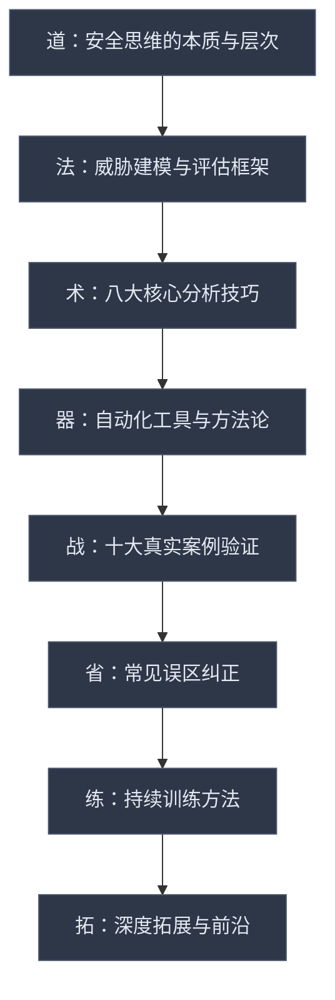
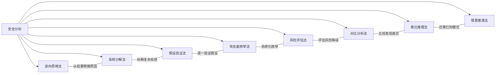
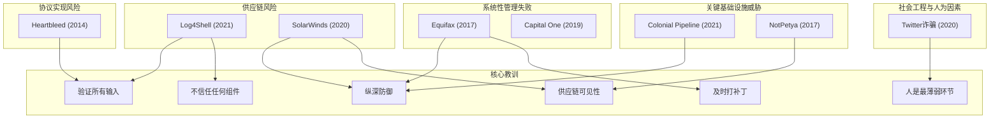

# 第三章小结：安全思维培养

## 一、本章核心思想

安全思维不是一种零散的技巧集合，而是一种**系统性的认知操作系统**。它改变了你观察世界的方式——从"系统如何工作"转变为"系统如何失败"。本章的核心命题可以用一句话概括：

> **安全思维的本质，是在所有人都假设"一切正常"的时候，主动追问"如果这里出问题会怎样"。**

这个追问看似简单，却要求你同时具备三重视角：以攻击者的敏锐发现弱点，以防御者的严谨构建屏障，以研究者的深度理解本质。本章围绕这三个维度，从理论基础到核心技巧再到真实案例，构建了完整的安全思维训练体系。

## 二、知识体系全景回顾

本章按照"道法术器"的层次展开，构建了从理论认知到实战落地的完整知识链：



### 2.1 理论基础层：从认知框架到评估方法论

本章理论基础部分系统构建了安全思维的认知框架，涵盖15个核心知识点。以下是关键理论工具的体系化梳理：

**威胁建模方法论矩阵**

威胁建模是安全思维的"操作系统"，本章详细介绍了五种主流方法：

| 方法 | 核心思想 | 适用场景 | 复杂度 | 关键优势 |
|------|----------|----------|--------|----------|
| **STRIDE** | 将威胁分为六类：仿冒(Spoofing)、篡改(Tampering)、抵赖(Repudiation)、信息泄露(Information Disclosure)、拒绝服务(DoS)、权限提升(Elevation of Privilege) | 系统设计阶段的威胁识别 | 低 | 结构清晰，易于学习和应用 |
| **PASTA** | 七阶段攻击模拟：定义目标→定义技术范围→分解应用→威胁分析→弱点分析→攻击建模→风险分析 | 以风险为中心的威胁分析 | 高 | 将业务目标与技术威胁关联 |
| **VAST** | 敏捷威胁建模，区分应用层和基础设施层威胁 | 大型敏捷开发团队 | 中 | 可扩展，与DevOps集成 |
| **LINDDUN** | 隐私威胁建模：关联(Linkability)、可识别(Identifiability)、不可否认(Non-repudiation)、检测(Detectability)、信息披露(Disclosure of Information)、不合规(Non-compliance)、数据偏差(Unawareness) | 隐私敏感系统 | 中 | 专注隐私维度 |
| **DREAD** | 风险评估：损害潜力(Damage)、可复现性(Reproducibility)、可利用性(Exploitability)、受影响用户(Affected Users)、可发现性(Discoverability) | 威胁优先级排序 | 低 | 量化风险等级 |

**攻击面分析的三个层次**

攻击面分析要求你像侦察兵一样全面摸清目标的地形。本章将其分为三个递进层次：

1. **入口点识别**：网络接口、API端点、用户输入点、文件解析器、消息队列、第三方集成
2. **可达性评估**：入口点是否暴露在公网？是否需要认证？访问频率如何？
3. **可利用性分析**：入口点处理的数据类型？是否存在已知漏洞模式？攻击载荷的投递难度？

**信任模型与零信任架构**

传统安全模型建立在"边界信任"之上——内网可信，外网不可信。本章深入分析了这种模型的致命缺陷，并引入零信任架构的三大核心原则：

- **永不信任，持续验证**（Never Trust, Always Verify）：每次访问都需要认证和授权
- **最小权限**（Least Privilege）：只授予完成任务所需的最小权限
- **假设已被入侵**（Assume Breach）：假设攻击者已经在内网，设计防御时考虑内部威胁

**安全边界与抽象层次**

安全边界是安全思维中的关键概念。本章揭示了一个重要洞察：**安全问题往往发生在抽象层次的交界处**。HTTP与应用逻辑之间、操作系统与应用程序之间、硬件与软件之间——这些边界是攻击者最常利用的薄弱环节。理解这一点，你就能预判"哪里最可能出问题"。

**认知偏误与安全思维**

本章独特地引入了认知科学视角，分析了安全从业者的常见认知偏误：

| 偏误类型 | 表现 | 对安全分析的影响 | 纠正方法 |
|----------|------|------------------|----------|
| **确认偏误** | 只关注支持自己假设的证据 | 忽略不符合预期的攻击路径 | 主动寻找反证 |
| **锚定效应** | 过度依赖第一个获得的信息 | 威胁评估不准确 | 多角度独立评估 |
| **可得性偏误** | 高估近期/印象深刻事件的概率 | 过度关注热点漏洞，忽略常规风险 | 基于数据和框架评估 |
| **乐观偏误** | 低估风险发生的概率 | "这种事不会发生在我们身上" | 假设最坏情况 |
| **沉没成本** | 因为已投入资源而继续错误决策 | 坚持不安全的架构设计 | 以未来收益为决策依据 |

### 2.2 核心技巧层：八大分析方法

本章核心技巧部分提炼了安全分析的八种关键方法，这些方法相互配合，构成了完整的安全分析工具箱：



**八大技巧的核心逻辑与应用场景**

| 技巧 | 核心问题 | 典型应用场景 | 输出物 |
|------|----------|-------------|--------|
| **逆向思维法** | "如果我是攻击者，我会怎么做？" | 漏洞发现、红队评估 | 攻击路径清单 |
| **系统分解法** | "这个系统由哪些组件组成？" | 复杂系统分析、架构审查 | 组件清单与信任边界图 |
| **假设验证法** | "我们假设了什么？这些假设成立吗？" | 安全审计、风险评估 | 假设验证报告 |
| **攻击面枚举法** | "所有可能的入口点有哪些？" | 渗透测试前期侦察 | 攻击面清单 |
| **风险评估法** | "哪个威胁最值得优先处理？" | 安全规划、资源分配 | 风险优先级矩阵 |
| **对比分析法** | "这个系统与已知安全架构有何差异？" | 架构审查、合规检查 | 差异分析报告 |
| **类比推理法** | "这个问题与已知的哪个模式相似？" | 漏洞研究、威胁情报分析 | 类比映射关系 |
| **情景推演法** | "如果攻击真的发生了，会怎样？" | 应急预案制定、安全演练 | 攻击场景剧本 |

**持续监控与自动化测试**

本章还深入探讨了两种进阶能力：持续监控思维（从"事件驱动"转向"持续验证"）和自动化安全测试（将安全检查嵌入CI/CD流程）。这两种能力是从"安全分析师"进阶到"安全架构师"的关键跳板。

### 2.3 实战案例层：十大事件的深度解剖

本章通过十个真实安全事件，将理论与技巧落地到具体场景。每个案例都不是孤立的"故事"，而是安全思维的活教材：



**案例核心教训速查表**

| 案例 | 年份 | 攻击类型 | 核心教训 | 安全思维启示 |
|------|------|----------|----------|-------------|
| **Log4Shell** (CVE-2021-44228) | 2021 | JNDI注入/RCE | 日志库这种"最不可能出问题"的组件也会成为致命入口 | 不信任任何组件，追踪所有数据流路径 |
| **Heartbleed** (CVE-2014-0160) | 2014 | 内存越界读取 | OpenSSL这种基础设施库存在严重缺陷，且长期未被发现 | 验证所有输入，包括"元数据"（长度字段） |
| **SolarWinds Sunburst** | 2020 | 供应链后门 | 攻击者通过污染软件更新渠道，渗透了18000+组织 | 供应链安全是纵深防御的第一层 |
| **Twitter比特币诈骗** | 2020 | 社会工程学 | 攻击者通过电话欺骗Twitter员工获取内部工具访问权 | 人是安全链中最薄弱的环节 |
| **Equifax数据泄露** | 2017 | 未打补丁的Apache Struts漏洞 | 1.47亿人的敏感数据泄露，损失超7亿美元 | 及时打补丁、网络分段、数据加密 |
| **Colonial Pipeline** | 2021 | 勒索软件 | 关键基础设施因单一VPN账户被入侵而停运6天 | 关键基础设施需要额外的安全层 |
| **NotPetya** | 2017 | 破坏性恶意软件 | 通过被污染的会计软件传播，造成全球100亿美元损失 | 供应链攻击的破坏力远超预期 |
| **Capital One** | 2019 | 云配置错误 | WAF配置错误导致1亿用户数据泄露 | 云环境的安全配置需要持续审计 |

**安全思维的六大共同模式**

从这十个案例中，我们可以提炼出安全思维的六大共同模式，这些模式是所有安全分析的基础框架：

1. **不信任任何组件**：无论开源库、供应商软件、内部工具还是员工，都不应被默认信任。持续验证是安全的基石。
2. **关注数据流**：追踪数据从输入到输出的完整路径，分析每个节点的安全性。多数漏洞与数据流有关。
3. **假设最坏情况**：假设系统已被入侵，假设攻击者拥有内部访问权限，假设安全措施可能失败。
4. **纵深防御**：没有单一安全措施是完美的。建立多层防御，即使某一层被突破，其他层仍能提供保护。
5. **持续监控和改进**：安全不是一次性工作，而是持续的过程。需要持续监控系统状态，及时发现和响应安全事件。
6. **从失败中学习**：每个安全事件都是学习的机会。从失败中总结教训，不断改进安全措施。

## 三、必须牢记的误区纠正

本章纠正了十个常见误区。这些误区的危险之处在于，它们看起来"合理"甚至"理所当然"，但每一个都可能导致严重的安全盲区：

**误区一：安全只是技术问题**
→ **事实：安全是技术、管理、人员三方面的系统工程。** 90%以上的安全事件涉及人为因素。单纯依赖技术手段而忽视管理和人员培训，安全措施必然失效。

**误区二：我的系统不值得被攻击**
→ **事实：任何连接网络的系统都可能成为攻击目标。** 攻击者的动机多样——利用你的服务器作为僵尸网络节点、将你的系统作为跳板攻击他人、自动化工具无差别扫描。目标价值不是你说了算的。

**误区三：有防火墙就安全了**
→ **事实：防火墙只是安全体系中的一层。** 它无法防御应用层攻击、社会工程学攻击、内部威胁、零日漏洞。把全部安全寄托在单一产品上，是最常见的安全幻觉。

**误区四：安全和便利性不可兼得**
→ **事实：好的安全设计应该让用户"安全地便利"。** SSO（单点登录）、生物认证、上下文感知认证都是安全与便利兼得的例子。安全不应该成为用户绕过规则的理由。

**误区五：安全是安全团队的事**
→ **事实：安全是每个人的责任。** 开发者写出安全的代码、运维人员正确配置系统、员工识别钓鱼邮件——安全是全员参与的事情。

**误区六：老系统不需要安全维护**
→ **事实：老系统往往是最脆弱的环节。** 它们可能运行着过时的软件、使用已知漏洞的组件、缺乏现代安全机制。攻击者最喜欢找的就是这些"被遗忘的角落"。

**误区七：加密就等于安全**
→ **事实：加密只解决了数据保密性问题。** 安全还包括完整性、可用性、认证、授权等多个维度。一个加密的系统仍然可能存在SQL注入、权限绕过、逻辑漏洞。

**误区八：内网是安全的**
→ **事实：内网需要和外网同等甚至更高的防护。** 横向移动、内部威胁、已经被入侵的设备——内网并不"可信"。零信任架构的核心假设就是"内网已被入侵"。

**误区九：安全是上线前的一次性检查**
→ **事实：安全应该贯穿整个软件开发生命周期。** 从需求分析到设计、开发、测试、部署、运维，每个阶段都有对应的安全活动（Security by Design）。

**误区十：这种事不会发生在我身上**
→ **事实：侥幸心理是安全最大的敌人。** 安全事件不是"会不会发生"的问题，而是"什么时候发生"的问题。提前准备比事后补救成本低100倍。

## 四、知识检验清单

完成本章学习后，你应该能够回答以下问题并解释原因：

**理论基础**
- [ ] STRIDE模型的六类威胁分别是什么？能举出每类威胁的实际例子吗？
- [ ] PASTA方法的七个阶段是什么？每个阶段的输入和输出是什么？
- [ ] 零信任架构的三大核心原则是什么？如何在实际系统中落地？
- [ ] 认知偏误如何影响安全分析？如何在实际工作中避免？

**分析技巧**
- [ ] 能否用逆向思维法分析一个Web应用的潜在漏洞？
- [ ] 能否对一个三层架构系统进行系统分解并绘制信任边界图？
- [ ] 能否用假设验证法审查一个安全配置？
- [ ] 能否对一个安全事件进行情景推演，预测攻击者下一步行动？

**案例理解**
- [ ] Log4Shell漏洞为什么影响如此广泛？它暴露了什么深层问题？
- [ ] SolarWinds攻击如何绕过了传统的安全防御？
- [ ] Twitter事件如何证明"人是安全链中最薄弱的环节"？
- [ ] 这些案例有哪些共同的安全思维模式？

**综合能力**
- [ ] 能否使用STRIDE模型对一个系统进行完整的威胁建模？
- [ ] 能否识别一个系统的攻击面并按风险等级排序？
- [ ] 能否分析一个安全事件的根本原因（而非表面原因）？
- [ ] 能否制定一个个人的安全思维训练计划？

## 五、安全思维成熟度自评

安全思维的培养是一个渐进过程。以下四级成熟度模型可以帮助你评估当前水平并设定进阶目标：

| 级别 | 名称 | 特征 | 典型表现 | 能力标志 |
|------|------|------|----------|----------|
| **L1** | 被动响应 | 只在安全事件发生后才关注安全 | "出了问题再说" | 能使用安全工具进行基本检查 |
| **L2** | 主动防御 | 开始在设计阶段考虑安全 | "提前堵住已知漏洞" | 能使用STRIDE进行威胁建模 |
| **L3** | 攻防思维 | 以攻击者视角审视系统 | "如果我是攻击者，我会怎么做？" | 能发现未知攻击路径 |
| **L4** | 系统思维 | 将安全视为系统工程 | "安全是整个组织的事" | 能设计安全架构和治理体系 |

大多数安全从业者在L1-L2之间。本章的目标是帮助你跨越到L2-L3，并为L4奠定基础。

## 六、构建你的安全思维训练体系

本章的最终目标不是让你记住理论，而是帮助你建立一套**可执行的安全思维训练体系**：

### 6.1 日常训练：每日安全思维三问

每天花5分钟问自己三个问题，逐步将安全思维内化为本能：

```text
┌─────────────────────────────────────────────────┐
│              每日安全思维三问                       │
├─────────────────────────────────────────────────┤
│ 1. 今天接触的系统/应用，攻击面在哪里？               │
│ 2. 今天处理的数据，如果泄露会怎样？                  │
│ 3. 今天做的操作，有没有更安全的方式？                 │
└─────────────────────────────────────────────────┘
```

### 6.2 周度练习：CTF与代码审计

| 练习类型 | 推荐平台 | 时间投入 | 核心收益 |
|----------|----------|----------|----------|
| CTF解题 | PicoCTF（入门）、Hack The Box（进阶）、CTFtime（赛事） | 每周2-3小时 | 培养实战能力，学习新攻击技术 |
| 代码审计 | GitHub开源项目、CVE分析 | 每周1-2小时 | 培养分析能力，理解漏洞根因 |
| 安全日记 | 个人笔记系统 | 每周30分钟 | 建立系统化思维，积累经验 |
| 新闻跟踪 | Krebs on Security、The Hacker News、安全客 | 每天15分钟 | 保持对领域的敏感度 |

### 6.3 月度项目：威胁建模实战

每月选择一个真实系统（可以是开源项目、自己的项目、或公开的架构图），完成一次完整的威胁建模：

1. **系统分解**：绘制系统架构图，标注组件和数据流
2. **攻击面枚举**：列出所有入口点，评估可达性和可利用性
3. **STRIDE分析**：对每个组件和数据流进行六类威胁分析
4. **风险评估**：使用DREAD对威胁进行优先级排序
5. **缓解措施**：针对高优先级威胁制定缓解方案
6. **复盘总结**：记录分析过程中的盲点和收获

### 6.4 进阶方向：安全思维的深度拓展

当你掌握了基础的安全思维后，以下进阶方向可以帮助你持续精进：

| 方向 | 内容 | 适合人群 | 推荐资源 |
|------|------|----------|----------|
| **威胁情报分析** | 从被动防御转向主动预测 | 有2年以上安全经验 | MITRE ATT&CK框架、威胁情报平台 |
| **安全架构设计** | 从发现问题转向预防问题 | 有系统设计经验 | SABSA、TOGAF安全扩展 |
| **红蓝对抗** | 在实战中磨练攻防思维 | 有渗透测试基础 | CPTS、OSCP认证 |
| **安全治理** | 从技术视角转向组织视角 | 有管理经验 | ISO 27001、NIST CSF |

## 七、从本章到下一章的过渡

安全思维建立了安全从业者的**认知操作系统**。有了正确的思维方式，接下来的问题是：**如何将这种思维转化为职业能力？**

第四章《职业发展路径》将从以下维度展开：

| 维度 | 核心问题 | 与本章的联系 |
|------|----------|-------------|
| 职业路径选择 | 安全领域有哪些细分方向？ | 安全思维是所有方向的共同基础 |
| 技能树构建 | 每个方向需要哪些具体技能？ | 安全思维指导技能学习的优先级 |
| 认证规划 | 哪些认证值得投入？ | 安全思维帮助你理解认证背后的知识体系 |
| 职业成长 | 从初级到专家的成长路径是什么？ | 安全思维的成熟度决定职业天花板 |

安全思维是所有技术能力的根基。在接下来的技术学习中，请始终携带本章的核心理念：

1. **不只学"怎么做"，更要理解"为什么"** —— 知其然更知其所以然
2. **不只学"防御方法"，更要理解"攻击原理"** —— 不懂攻击的防御是盲目的
3. **不只关注"技术细节"，更要把握"整体架构"** —— 局部优化不如全局最优
4. **不只追求"工具使用"，更要培养"分析能力"** —— 工具会过时，思维不会

## 八、推荐下一步行动

1. **自测**：用第四节的知识检验清单逐项检查，对无法回答的问题回到对应章节复习
2. **定位**：用第五节的成熟度模型评估自己的当前水平，设定进阶目标
3. **训练**：按第六节的训练体系开始日常练习，从"每日三问"开始
4. **进入第四章**：开始规划你的安全职业发展路径

---

> *"安全思维不是一种技能，而是一种生活方式。它改变的不仅是你看待技术的方式，更是你看待世界的方式。"*

记住：安全思维的培养没有捷径，只有持续的练习和反思。每一次对系统的追问、每一次对漏洞的分析、每一次对案例的复盘，都在潜移默化地重塑你的认知模式。当"如果出问题会怎样"成为你的本能反应时，你就真正拥有了安全思维。

**本章完成，进入下一章：第04章-职业发展路径**
