# 第03章 安全思维培养 - 深度拓展

本章的前六节从理论基础、核心技巧、实战案例、常见误区、练习方法五个维度建立了安全思维的基本框架。本节作为全章的"天花板"，将从认知科学、高级方法论、行业前沿三个方向进行深度拓展，帮助你从"知道安全思维是什么"进化到"能在复杂场景中自如运用安全思维"。

## 一、认知科学与安全思维

安全思维的本质是人类认知过程在安全领域的特化应用。理解认知科学的底层机制，能帮助你更高效地训练直觉、规避偏误、做出高质量的安全决策。

### 1.1 双系统思维理论

Daniel Kahneman在《Thinking, Fast and Slow》中提出的双系统思维理论，是理解安全思维的认知基础。

**系统1（快思维）** — 直觉的、自动的、几乎不消耗认知资源：

| 特征 | 安全领域表现 |
|------|-------------|
| 速度极快（毫秒级） | 看到URL中的`admin.php.bak`立刻警觉 |
| 基于模式匹配 | 扫一眼日志就能发现异常的User-Agent |
| 易受偏误影响 | 看到HTTPS就认为"安全"，忽略证书验证 |
| 通过经验积累 | 资深安全工程师的"第六感" |

**系统2（慢思维）** — 分析的、有意识的、消耗大量认知资源：

| 特征 | 安全领域表现 |
|------|-------------|
| 速度较慢（秒到分钟级） | 逐行审计代码寻找逻辑漏洞 |
| 基于逻辑推理 | 分析加密协议的正确性 |
| 可以纠正系统1 | 发现直觉判断的错误并修正 |
| 需要刻意训练 | 学习新的漏洞类型和利用技术 |

**实战启示**：安全从业者的成长路径，本质上是不断将系统2的分析过程"编译"到系统1的直觉库中。一个初学者看到`<script>alert(1)</script>`需要思考"这是XSS攻击"，而专家看到这个字符串会立即反射性地警觉——这就是系统1接管了原本属于系统2的工作。

训练系统1的具体方法：

1. **大量阅读漏洞报告**：每天阅读1-2篇CVE分析或漏洞writeup，让大脑建立更多安全模式
2. **刻意练习代码审计**：反复审计不同类型的代码，直到危险模式（如未过滤的用户输入、硬编码密钥）成为视觉上的"刺眼信号"
3. **建立检查清单**：将系统2的分析步骤固化为清单，通过重复使用逐渐内化
4. **复盘安全事件**：每次安全事件后问自己"我应该在哪个环节、用什么直觉就能提前发现问题"

### 1.2 认知偏误的深度识别与对策

在第03章理论基础/06中，我们介绍了常见的认知偏误。这里深入分析每种偏误在安全工作中的具体表现、真实案例和对抗策略。

#### 确认偏误（Confirmation Bias）

**定义**：倾向于寻找、解释和记忆支持自己已有假设的证据，忽略或低估反面证据。

**安全领域的典型场景**：

渗透测试中，你假设某个API端点存在SQL注入。你发送了`' OR 1=1--`，返回了正常数据。你认为"注入成功了"，但实际上后端使用了ORM框架，返回正常数据只是因为WHERE子句被注释后的默认行为。你没有继续验证（比如尝试报错注入、时间盲注），因为第一个结果"确认"了你的假设。

**对抗策略**：

- **主动寻找反证**：在每次假设"X存在漏洞"之后，花同样的时间假设"X不存在漏洞"，尝试证明自己错了
- **使用结构化方法论**：遵循OWASP Testing Guide的完整测试流程，不跳过任何步骤
- **结对审计（Pair Audit）**：两人互相检查对方的分析过程，一人负责"挑刺"
- **强制冷却期**：分析完成后搁置一段时间（至少几小时），然后以"第一次看到"的视角重新审视

#### 可得性偏误（Availability Heuristic）

**定义**：根据事件在记忆中的易获得程度来判断其发生的概率——越容易想到的事件，被估计的概率越高。

**安全领域的典型场景**：

2021年Log4Shell爆发后，很多安全团队把大量资源投入到Java日志框架的排查上，却忽略了同时期曝光的Spring4Shell（CVE-2022-22965）等其他高危漏洞。原因是Log4Shell的媒体曝光度极高，占据了团队的注意力带宽。

**对抗策略**：

- **数据驱动优先级**：使用CVSS评分、资产暴露面、利用难度等客观数据来排序修复优先级，而不是"最近看到什么就修什么"
- **威胁情报订阅**：订阅多个来源的威胁情报（NVD、CISA KEV、厂商公告），避免单一来源造成的注意力偏差
- **定期"冷门扫描"**：每季度专门安排时间审查那些"不热门但可能很危险"的攻击面

#### 锚定效应（Anchoring Effect）

**定义**：过度依赖第一个获得的信息（锚点），后续判断被这个锚点不当地牵引。

**安全领域的典型场景**：

在风险评估会议上，第一个发言的人说"这个漏洞的风险等级是中等"，后续讨论中大多数人会围绕"中等"进行微调，而不是独立评估。即使后续发现了更严重的影响因素，整体评估仍然被锚定在初始值附近。

**对抗策略**：

- **独立评估先行**：在讨论之前，让每位评估者独立给出评分，再汇总讨论
- **使用量化框架**：采用DREAD、CVSS等标准化评分框架，减少主观锚定
- **刻意引入极端值**：在评估时先考虑"最坏情况是什么"和"最好情况是什么"，打破锚定

#### 达克效应（Dunning-Kruger Effect）

**定义**：能力不足的人倾向于高估自己的能力，而能力很强的人可能低估自己。

**安全领域的典型场景**：

初学者在成功完成几个CTF题目后，可能认为自己已经"掌握了渗透测试"，然后在真实环境中犯下严重错误（如在未授权的系统上执行高危操作）。相反，资深安全研究员在面对新的攻击面时可能过于谨慎，花了过多时间在分析上而错过了行动窗口。

**对抗策略**：

- **建立能力评估标准**：参考OSCP、OSCE、GPEN等认证的知识体系，客观评估自己的能力边界
- **在安全环境中测试自己的能力**：通过Hack The Box、TryHackMe等平台的真实靶机验证自己
- **寻找导师和同行评审**：让更有经验的人定期审查你的工作
- **保持"初学者心态"**：即使是专家，在面对新领域时也应假设自己有盲区

#### 框架效应（Framing Effect）

**定义**：同一事实的不同表述方式会导致不同的决策。

**安全领域的典型场景**：

向管理层汇报时，"我们有10个严重漏洞需要修复，预计需要2周"可能被拒绝（因为"2周太长了"）。但如果换一种说法："如果我们不修复这10个漏洞，一旦被利用，预计损失将超过500万元，而修复成本仅需10万元"，同样的事实更可能获得支持。

**对抗策略**：

- **同时呈现正面和负面框架**："修复成本10万元，不修复的潜在损失500万元"
- **使用数据和类比**：用具体的数字和行业案例替代抽象描述
- **自问"如果换个说法，我的结论会变吗？"**：检测框架效应是否在影响自己的判断

#### 正常化偏差（Normalcy Bias）

**定义**：倾向于认为事情会按照正常方式发展，低估灾难性事件发生的可能性。

**安全领域的典型场景**：

"我们的系统运行了5年都没出过安全事件"→ "所以未来也不会出事"。这种思维在Equifax数据泄露事件前普遍存在——该公司在泄露发生前已经存在已知的Apache Struts漏洞数月未修复。

**对抗策略**：

- **假设分析（What-if Analysis）**：定期问"如果明天被入侵，攻击者会怎么进来？"
- **行业对标**：关注同行业其他组织的安全事件，打破"不会发生在我身上"的幻觉
- **红队演练**：定期进行实战化的红队演练，用事实打破正常化偏差

### 1.3 元认知与安全思维的高阶应用

元认知（Metacognition）是"对认知的认知"——你对自己思维过程的觉察和调控能力。在安全领域，元认知是区分优秀安全从业者和普通从业者的关键能力。

**元认知在安全工作中的具体应用**：

**1. 分析过程的自我监控**

在进行渗透测试或安全分析时，定期暂停并问自己：

```text
我现在在做什么？（描述当前活动）
我为什么在做这个？（连接到目标）
我刚才的假设是什么？（暴露隐含前提）
有什么证据支持/反对我的假设？（检验假设）
我是否遗漏了什么？（检查盲区）
```

**2. 策略调整能力**

当你花了2小时在某个攻击路径上没有进展时，元认知能力促使你思考：

- 这条路径可能是死胡同，我需要评估是否继续
- 有没有其他我还没尝试的路径？
- 我是不是陷入了"沉没成本"谬误（因为已经花了2小时所以不想放弃）？

**3. 知识边界感知**

高级安全从业者能够准确评估自己对某个技术领域的掌握程度：

- "我对Web安全很熟悉，但对硬件安全几乎不了解"
- "我知道这个漏洞的利用方式，但不清楚其根因"
- "我对这个系统的了解还不够进行全面的安全评估"

这种自我评估能力帮助你做出更可靠的判断——在不擅长的领域，你知道应该寻求外部专家意见，而不是凭有限知识做决策。

**4. 失败分析与模式提取**

每次安全分析（无论成功或失败）后，进行结构化复盘：

```markdown
## 分析复盘模板

### 目标
- 本次分析的目标是什么？

### 过程
- 我的分析步骤是什么？
- 每一步的依据是什么？
- 遇到了什么困难？如何应对的？

### 结果
- 发现了什么？
- 是否达到了目标？
- 有哪些遗漏？

### 认知反思
- 我的哪些判断是正确的？为什么？
- 我的哪些判断是错误的？是什么偏误导致的？
- 下次遇到类似场景，我会怎么做不同？

### 提炼
- 可以提炼出什么新的启发式规则？
- 需要补充什么知识？
```

**培养元认知的日常练习**：

1. **安全日记**：每天花10分钟记录当天的安全思考，重点记录"我为什么做了这个判断"
2. **解题过程外化**：在做CTF或代码审计时，大声说出自己的思考过程（或写下来）
3. **定期回顾**：每月回顾过去一个月的安全日记，寻找思维模式中的盲区
4. **同行讨论**：与同事讨论安全问题时，不仅讨论结论，还讨论推理过程

### 1.4 决策理论与安全

安全决策通常在不确定性条件下进行——你很少拥有完美的信息。理解决策理论的基本原理，能帮助你在信息不完整时做出更好的判断。

#### 贝叶斯思维在安全中的应用

贝叶斯定理描述了如何根据新证据更新对假设的信心：

```text
P(H|E) = P(E|H) × P(H) / P(E)
```

**安全场景示例**：

假设你在分析一个告警：

- **先验概率 P(H)**：在收到告警之前，这个系统存在入侵的概率。假设基于历史数据，这个系统每月约有0.1%的概率被入侵
- **似然度 P(E|H)**：如果系统确实被入侵了，出现这个告警的概率。假设入侵时有80%的概率触发此类告警
- **边缘概率 P(E)**：这个告警在所有情况下出现的概率。假设总体告警触发率为5%
- **后验概率 P(H|E)**：收到告警后，系统被入侵的概率

```text
P(H|E) = 0.8 × 0.001 / 0.05 = 0.016 = 1.6%
```

即使收到了告警，实际被入侵的概率也只有1.6%。这个计算帮助你避免对单一告警过度反应，同时也提醒你需要收集更多证据来提高后验概率。

**实用简化**：你不需要每次都手动计算贝叶斯公式，但需要内化其核心思想——

1. 从基础概率（base rate）出发，不要被单一证据过度影响
2. 每条新证据都应更新你的判断，但更新幅度取决于证据的可靠性
3. 高质量的证据（如多个独立告警同时触发）应导致更大的判断调整

#### 期望值决策

在安全投资决策中，使用期望值（Expected Value）框架：

```text
风险期望值 = 威胁发生概率 × 威胁造成的损失
安全投资回报 = 风险降低量 - 安全投资成本
```

**示例**：

| 威胁场景 | 发生概率 | 潜在损失 | 风险期望值 | 防御成本 | 净收益 |
|----------|---------|---------|-----------|---------|--------|
| SQL注入导致数据泄露 | 5%/年 | 500万元 | 25万元 | 5万元 | +20万元 |
| DDoS导致服务中断 | 20%/年 | 100万元 | 20万元 | 15万元 | +5万元 |
| 内部员工泄密 | 2%/年 | 200万元 | 4万元 | 30万元 | -26万元 |

这个框架帮助你做出数据驱动的安全投资决策，而不是"感觉上哪个更重要就先做哪个"。

### 1.5 博弈论视角下的安全思维

安全本质上是一个对抗性博弈——防御者和攻击者之间存在策略互动。博弈论为理解这种互动提供了形式化框架。

#### 不对称博弈

安全博弈的一个核心特征是**不对称性**：

- **攻击者只需要找到一个突破口，防御者需要守住所有入口**
- **攻击者可以选择时间和方式，防御者必须全天候防守**
- **攻击者的试错成本可能很低（尤其是自动化攻击），防御者的错误成本可能极高**

这意味着防御者需要在资源有限的情况下，将防御资源集中到最高风险的区域。攻击面分析和威胁建模正是为了实现这种资源优化配置。

#### 信号博弈（Signaling Game）

在安全领域，"信号"有着特殊的意义：

- **蜜罐（Honeypot）**：防御者发送"这里有有价值的目标"的虚假信号，引诱攻击者暴露
- **安全公告**：防御者公开披露漏洞修复信息，发送"此路已封"的信号
- **威胁情报共享**：防御者之间交换攻击者信息，提高整体防御水平
- **威慑信号**：公开宣传安全能力（如红队演练成果），提高攻击者的预期成本

理解信号博弈，有助于设计更有效的安全策略——不仅要考虑"做什么"，还要考虑"对手会如何解读我的行为"。

## 二、高级威胁建模方法论

在理论基础/02中，我们介绍了STRIDE模型和攻击树的基本方法。这里深入介绍更高级的威胁建模框架和实战应用技巧。

### 2.1 MITRE ATT&CK框架的深度应用

MITRE ATT&CK是全球最广泛使用的攻击者行为知识库，截至2025年已涵盖14个战术（Tactics）、200+个技术（Techniques）和400+个子技术（Sub-techniques）。

#### ATT&CK的核心结构

```text
战术（Tactics）—— 攻击者的"为什么"（目标）
  └── 技术（Techniques）—— 攻击者的"怎么做"（方法）
       └── 子技术（Sub-techniques）—— 具体实现细节
            └── 检测方法（Detections）
            └── 缓解措施（Mitigations）
```

14个战术按攻击链排列：

| 序号 | 战术 | 英文 | 攻击阶段 |
|------|------|------|---------|
| 1 | 侦察 | Reconnaissance | 攻击前 |
| 2 | 资源开发 | Resource Development | 攻击前 |
| 3 | 初始访问 | Initial Access | 入侵 |
| 4 | 执行 | Execution | 入侵后 |
| 5 | 持久化 | Persistence | 入侵后 |
| 6 | 提权 | Privilege Escalation | 入侵后 |
| 7 | 防御绕过 | Defense Evasion | 入侵后 |
| 8 | 凭证访问 | Credential Access | 入侵后 |
| 9 | 发现 | Discovery | 横向移动 |
| 10 | 横向移动 | Lateral Movement | 横向移动 |
| 11 | 收集 | Collection | 目标达成 |
| 12 | 命令与控制 | Command and Control | 贯穿全程 |
| 13 | 渗出 | Exfiltration | 目标达成 |
| 14 | 影响 | Impact | 目标达成 |

#### 使用ATT&CK进行威胁建模的完整流程

**第一步：确定威胁行为者**

根据组织的行业、地理位置、资产价值，确定最可能面临的威胁行为者。ATT&CK提供了多个APT组织的行为档案：

```bash
# 示例：查看APT29（Cozy Bear）使用的技术
# 访问 https://attack.mitre.org/groups/G0016/
# 或使用ATT&CK Navigator工具
```

**第二步：映射技术到防御能力**

使用ATT&CK Navigator（一个基于Web的可视化工具），创建热力图来展示防御覆盖情况：

```python
# 使用mitreattck-python库进行程序化分析
# pip install mitreattck-python

import mitreattck.attackToExcel.attackToExcel as attack_to_excel
import mitreattck.attackToExcel.stixToDf as stix_to_df

# 下载ATT&CK数据
attack_to_excel.export("enterprise")
```

**第三步：识别防御差距**

将组织当前的检测能力映射到ATT&CK技术上，识别覆盖空白。重点关注：

- 高频被APT组织使用但组织没有检测能力的技术
- 攻击链早期（侦察、初始访问）的检测能力缺失
- 防御绕过技术的覆盖情况

**第四步：优先改善**

使用以下优先级矩阵：

| 优先级 | 条件 |
|--------|------|
| P0-紧急 | 被多个APT使用 + 组织无检测 + 攻击影响严重 |
| P1-高 | 被主要威胁行为者使用 + 组织检测能力弱 |
| P2-中 | 被少量APT使用 + 组织有一定检测能力 |
| P3-低 | 使用频率低 + 组织已有基本检测 |

### 2.2 攻击图（Attack Graph）与攻击路径分析

攻击图比攻击树更灵活，能够表示节点之间的复杂依赖关系（如一个漏洞的利用可能需要先利用另一个漏洞获取必要权限）。

#### 攻击图的基本类型

**1. 状态攻击图（State-based Attack Graph）**

节点表示系统状态，边表示状态转换（利用漏洞导致的状态变化）：

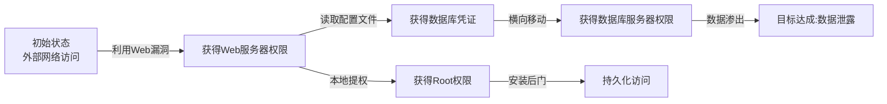

**2. 属性攻击图（Attribute-based Attack Graph）**

节点表示前提条件和目标，边表示利用关系。比状态攻击图更紧凑，适合大规模网络：

```text
前提条件: 网络可达(Web服务器) + 存在SQL注入漏洞
         ↓ 利用
中间结果: 获得数据库读取权限
         ↓ + 前提条件: 数据库存储明文密码
中间结果: 获得管理员凭证
         ↓ 利用
目标: 完全控制应用
```

#### 实战：为Web应用构建攻击图

以一个典型的电商Web应用为例：

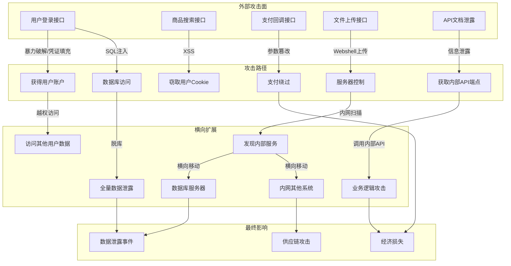

### 2.3 PASTA威胁建模方法

PASTA（Process for Attack Simulation and Threat Analysis）是一种以风险为中心的七阶段威胁建模方法。与STRIDE不同，PASTA从业务目标出发，将威胁建模与业务风险对齐。

#### PASTA的七个阶段

**阶段1：定义业务目标（Define Business Objectives）**

明确系统支撑的核心业务目标。例如：
- 电商平台的核心目标：处理订单、保护支付数据、维护用户信任
- 医疗系统的核心目标：保护患者隐私、确保系统可用性、满足合规要求

**阶段2：定义技术范围（Define the Technical Scope）**

识别系统的架构组件和技术栈：

```text
前端: React SPA → CDN → 负载均衡
后端: Spring Boot微服务 → API网关
数据: MySQL主从 → Redis缓存 → S3对象存储
基础设施: Kubernetes集群 → VPC网络
集成: 第三方支付API、短信网关、邮件服务
```

**阶段3：应用威胁情报（Application Threat Intelligence）**

结合威胁情报数据，确定组织面临的实际威胁：
- 行业报告（如Verizon DBIR、IBM X-Force Threat Intelligence Index）
- CERT公告和漏洞数据库
- 暗网情报（是否有关于组织或行业的攻击讨论）

**阶段4：漏洞分析（Vulnerability Analysis）**

结合自动化扫描和手动审计，识别系统中的漏洞：
- 使用SAST/DAST工具扫描应用代码
- 使用漏洞扫描器检查基础设施
- 手动审查架构设计和配置

**阶段5：威胁建模（Threat Modeling）**

将前四个阶段的输入综合起来，建立威胁模型：
- 识别攻击面和信任边界
- 使用STRIDE或其他框架枚举威胁
- 建立攻击树或攻击图

**阶段6：攻击建模（Attack Modeling）**

模拟攻击者的攻击路径，验证威胁的可利用性：
- 使用MITRE ATT&CK映射攻击技术
- 构建攻击场景和攻击脚本
- 在安全环境中验证攻击可行性

**阶段7：风险和影响分析（Risk and Impact Analysis）**

量化风险并制定应对策略：

```text
风险评分 = 可能性 × 影响
可能性 = f(漏洞严重性, 威胁能力, 暴露面)
影响 = f(数据价值, 业务影响, 合规影响)
```

#### PASTA vs STRIDE vs LINDDUN 对比

| 维度 | STRIDE | PASTA | LINDDUN |
|------|--------|-------|---------|
| 驱动方式 | 以威胁类型驱动 | 以业务风险驱动 | 以隐私风险驱动 |
| 适用场景 | 通用安全威胁 | 企业级应用 | 隐私敏感系统 |
| 复杂度 | 低-中 | 高 | 中 |
| 输出 | 威胁列表 | 风险驱动的威胁模型 | 隐私威胁模型 |
| 优势 | 简单易学 | 与业务对齐 | 专门针对隐私 |
| 劣势 | 不考虑业务优先级 | 耗时较长 | 仅覆盖隐私维度 |

### 2.4 Kill Chain与ATT&CK的联合应用

Lockheed Martin的Cyber Kill Chain将攻击分为7个阶段。将Kill Chain与ATT&CK结合使用，可以建立更完整的威胁视图：

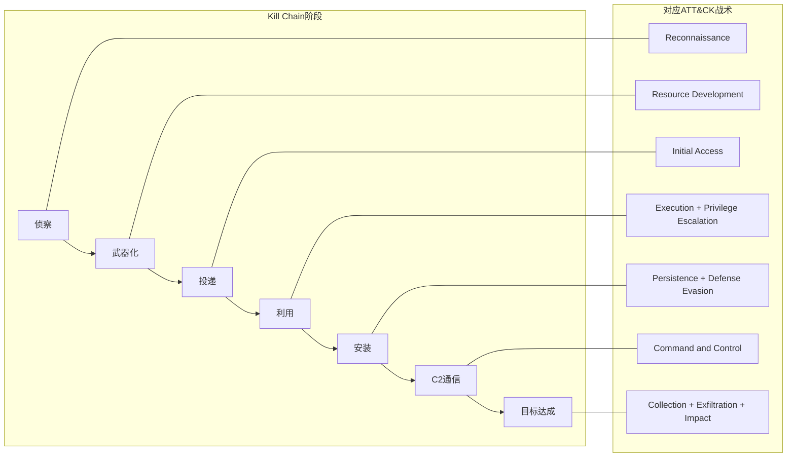

**防御策略制定**：在Kill Chain的每个阶段设置检测和防御措施。越早拦截攻击，损失越小：

| 阶段 | 检测手段 | 防御措施 |
|------|---------|---------|
| 侦察 | DNS查询监控、Web日志分析 | 减少信息暴露、使用WAF |
| 正器化 | 威胁情报匹配 | 情报驱动的主动防御 |
| 投递 | 邮件网关、沙箱检测 | 邮件过滤、网络隔离 |
| 利用 | 入侵检测系统（IDS） | 补丁管理、最小权限 |
| 安装 | 端点检测与响应（EDR） | 应用白名单、文件完整性监控 |
| C2通信 | 网络流量分析、DNS监控 | 出站流量过滤、域名黑名单 |
| 目标达成 | 数据防泄漏（DLP） | 数据加密、访问控制 |

## 三、系统性安全思维的进阶

### 3.1 瑞士奶酪模型的深度应用

James Reason的瑞士奶酪模型是理解多层防护失效机制的核心框架。

#### 事故的四层防护

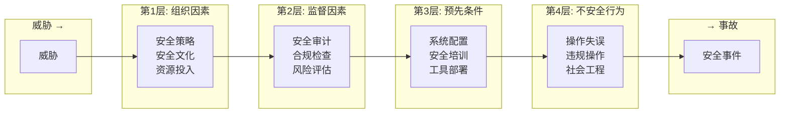

每一层都有"孔洞"——弱点和缺陷。当多层防护的孔洞恰好对齐时，威胁就能穿透所有防线导致事故。

#### 案例分析：Equifax数据泄露（2017年）

用瑞士奶酪模型分析Equifax泄露事件中各层防护的失效：

| 防护层 | 应有的防护 | 实际的孔洞 |
|--------|-----------|-----------|
| 组织因素 | 安全优先的文化、充足的安全预算 | 安全团队人手不足、补丁管理流程缺失 |
| 监督因素 | 定期漏洞扫描、合规审计 | Apache Struts漏洞CVE-2017-5638的补丁发布后数月未修复 |
| 预先条件 | 网络分段、SSL检查 | 内部网络未分段，加密流量未检查，TLS证书过期导致DLP失效 |
| 不安全行为 | 安全凭证管理 | 使用默认凭证（admin/admin）访问内部系统 |

**关键教训**：没有任何单一防护层的失败会导致如此规模的泄露。正是所有层同时失效，才造成了1.47亿用户数据泄露的灾难。

### 3.2 反脆弱性在安全架构中的实践

Nassim Taleb的反脆弱概念超越了"韧性"——韧性系统能够抵御冲击恢复原状，反脆弱系统在冲击中变得更强。

#### 从韧性到反脆弱的进化路径

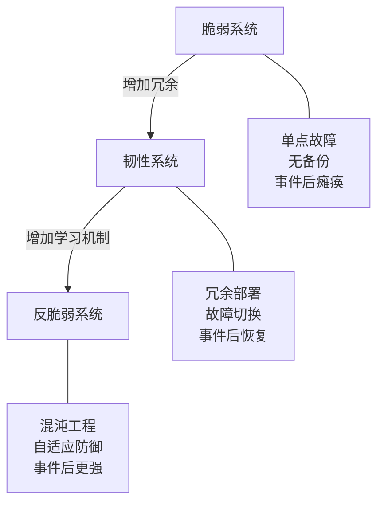

**反脆弱安全架构的设计原则**：

**1. 混沌工程（Chaos Engineering）**

主动注入故障来测试和增强系统的安全韧性：

```bash
# 使用Chaos Monkey随机终止实例
# 测试安全监控是否能在实例异常消失时告警
# 测试故障切换过程中是否有安全窗口

# 示例：模拟证书过期
openssl x509 -in cert.pem -noout -enddate
# 提前将测试环境的证书设为即将过期
# 验证告警系统和自动续期机制
```

**2. 自动化安全响应（SOAR）**

将安全事件响应自动化，使系统能够自主应对攻击：

```python
# 伪代码：自动化安全响应流程
def handle_security_alert(alert):
    # 自动分类
    severity = classify_alert(alert)
    
    if severity == "critical":
        # 自动隔离受感染主机
        isolate_host(alert.host)
        # 自动阻断攻击源IP
        block_ip(alert.source_ip)
        # 自动创建工单
        create_incident_ticket(alert)
        # 通知安全团队
        notify_soc_team(alert)
    
    elif severity == "high":
        # 增强监控
        increase_monitoring(alert.host)
        # 收集取证数据
        collect_forensics(alert.host)
        # 创建调查工单
        create_investigation_ticket(alert)
    
    # 将事件添加到知识库
    update_threat_intelligence(alert)
```

**3. 红队驱动的安全改进**

将红队演练从"一年一次的合规检查"转变为"持续的安全改进机制"：

- 每次红队发现的漏洞，不仅修复漏洞本身，还修复导致漏洞存在的流程缺陷
- 将红队发现的攻击路径添加到蓝队的检测规则中
- 建立"发现→修复→验证→预防"的闭环

### 3.3 复杂系统与涌现行为

现代IT系统是复杂适应系统（Complex Adaptive Systems），其安全行为不能通过简单分析各组件来预测。

#### 涌现性安全问题的真实案例

**案例：微服务架构中的级联认证失败**

一个电商平台采用微服务架构，20个微服务之间通过JWT令牌进行认证。某个微服务的JWT验证逻辑存在bug——在接收到过期令牌时不是拒绝，而是使用默认权限。单独测试每个微服务时，这个问题不明显。但在生产环境中，当认证服务出现短暂延迟导致大量令牌同时过期时，这个bug导致了级联权限降级：多个微服务同时以默认（通常是高）权限运行，攻击者利用这个窗口获取了管理员访问权限。

这个安全问题是"涌现"的——没有任何单个组件的设计缺陷能预见这种级联效应。

#### 应对复杂系统的安全策略

**1. 关注接口和边界**

复杂系统的安全问题往往出现在组件之间的接口和信任边界上：

- 服务间认证是否正确实现？
- 数据在组件间传递时是否保持完整性？
- 信任边界是否明确定义和强制执行？

**2. 故障模式与影响分析（FMEA）**

对每个关键组件，分析其故障模式和对整体系统安全的影响：

| 组件 | 故障模式 | 对安全的影响 | 严重性 | 当前防护 | 建议改进 |
|------|---------|-------------|--------|---------|---------|
| 认证服务 | 服务不可用 | 所有认证请求失败或降级 | 高 | 多实例部署 | 添加熔断机制，降级时拒绝而非放行 |
| JWT验证 | 过期令牌处理错误 | 权限降级 | 严重 | 单元测试 | 添加集成测试和混沌测试 |
| API网关 | 规则配置错误 | 未授权访问 | 高 | 配置审计 | 自动化配置验证 |

**3. 涌现行为的监控**

建立能够检测"异常组合"的监控，而不仅仅是"单个指标异常"：

- 多个微服务同时出现认证降级 → 级联故障告警
- 同一用户在短时间内访问大量不同资源 → 横向移动嫌疑
- 内部服务突然开始向外部发送大量数据 → 数据渗出嫌疑

## 四、安全数据分析思维

### 4.1 统计思维在安全运营中的应用

#### 基线建立与异常检测

安全运营的第一步是建立"正常"的基线，才能识别"异常"。

```python
# 简化的基线建立示例
import numpy as np
from datetime import datetime, timedelta

def establish_baseline(logins_per_hour, window_days=30):
    """
    建立每小时登录次数的基线
    使用均值和标准差定义正常范围
    """
    mean = np.mean(logins_per_hour)
    std = np.std(logins_per_hour)
    
    # 3-sigma规则：99.7%的正常数据落在均值±3标准差内
    upper_bound = mean + 3 * std
    lower_bound = mean - 3 * std
    
    return {
        'mean': mean,
        'std': std,
        'normal_range': (lower_bound, upper_bound)
    }

# 实际使用时需要考虑：
# 1. 时间维度：工作日vs周末、白天vs夜晚
# 2. 季节性：促销活动期间的流量高峰
# 3. 趋势：业务增长导致的自然增长
# 4. 突发事件：安全事件导致的异常模式
```

#### 误报与漏报的权衡

安全检测系统面临的核心挑战是**假阳性（False Positive）**与**假阴性（False Negative）**的权衡：

| | 实际有威胁 | 实际无威胁 |
|---|---|---|
| **检测到告警** | 真阳性（TP）✓ | 假阳性（FP）误报 |
| **未检测到告警** | 假阴性（FN）漏报 | 真阴性（TN）✓ |

**关键指标**：

- **精确率（Precision）** = TP / (TP + FP)：告警中有多少是真正的威胁
- **召回率（Recall）** = TP / (TP + FN)：真正的威胁中有多少被检测到
- **F1分数** = 2 × Precision × Recall / (Precision + Recall)：精确率和召回率的调和平均

**实际权衡**：

- 高精确率（低误报）：告警少但准确，适合人手有限的安全团队
- 高召回率（低漏报）：不放过任何威胁，但可能产生大量误报
- 金融行业通常偏好高召回率（宁可误报也不漏报）
- 初创公司可能偏好高精确率（人手有限，无法处理大量误报）

### 4.2 因果推断在安全事件分析中的应用

在安全事件分析中，区分**相关性（Correlation）**和****因果性（Causation）**至关重要。

**相关≠因果的典型案例**：

- 观察："每次服务器CPU使用率飙升后，都会出现安全告警"
- 错误结论："CPU使用率飙升导致了安全告警"
- 真实原因：攻击者使用的挖矿程序同时导致了CPU飙升和安全告警

**结构化因果分析方法**：

**1. 五个为什么（5 Whys）**

```text
问题：用户数据库被泄露
为什么1：攻击者获得了数据库的读取权限 → 为什么？
为什么2：数据库使用了默认凭证 → 为什么？
为什么3：部署脚本没有强制修改默认密码 → 为什么？
为什么4：部署流程中没有安全检查点 → 为什么？
为什么5：安全团队没有参与部署流程的评审

根因：部署流程缺少安全评审环节
```

**2. 鱼骨图（Fishbone Diagram）**

将安全事件的原因分为多个维度系统分析：

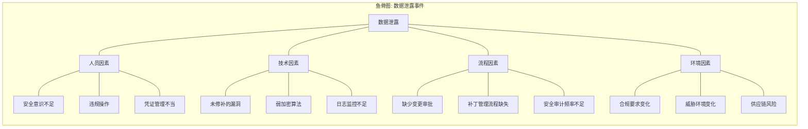

### 4.3 数据驱动的安全运营成熟度

将安全运营从"凭经验判断"进化到"数据驱动决策"：

#### 安全运营关键指标（Security KPIs）

| 指标类别 | 具体指标 | 定义 | 目标参考值 |
|----------|---------|------|-----------|
| 检测能力 | MTTD（平均检测时间） | 从入侵发生到检测到的时间 | < 24小时 |
| 响应能力 | MTTR（平均响应时间） | 从检测到到开始响应的时间 | < 4小时 |
| 修复能力 | MTTM（平均修复时间） | 从发现漏洞到完成修复的时间 | 关键漏洞 < 7天 |
| 覆盖率 | 漏洞覆盖率 | 已扫描资产 / 应扫描资产 | > 95% |
| 有效性 | 告警精确率 | 真阳性告警 / 总告警 | > 80% |
| 合规性 | 补丁合规率 | 已打补丁系统 / 应打补丁系统 | > 98% |

#### 数据收集与分析架构

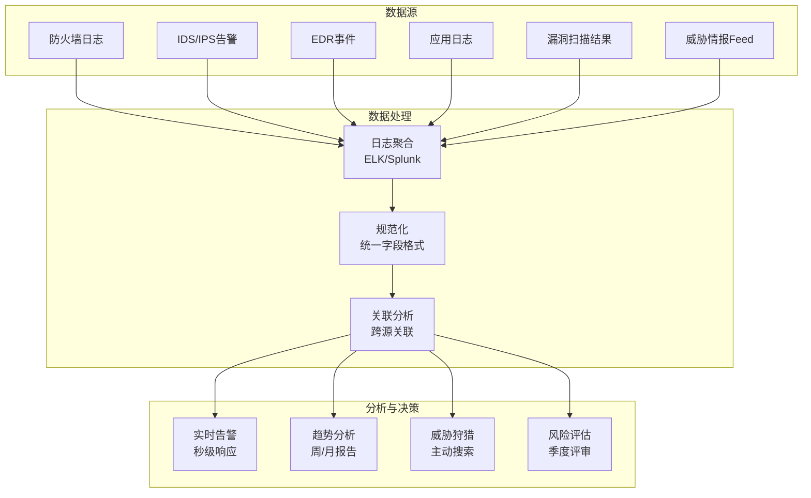

## 五、行业前沿：2024-2025年安全思维演进

### 5.1 AI驱动的安全攻防

AI正在深刻改变攻防双方的能力边界。

#### AI增强的攻击能力

- **自动化漏洞发现**：AI代码分析工具能够以超人速度扫描代码库发现漏洞模式
- **智能钓鱼**：大语言模型生成的钓鱼邮件在语法、风格、个性化方面远超传统模板
- **深度伪造（Deepfake）**：语音和视频伪造技术被用于社会工程攻击
- **对抗性机器学习**：通过精心构造的输入欺骗AI安全系统

#### AI增强的防御能力

- **智能告警分诊**：AI自动分析告警上下文，减少误报，优先处理真正威胁
- **异常行为检测**：基于机器学习的UEBA（用户和实体行为分析）能够发现传统规则无法检测的异常
- **自动化响应**：AI驱动的SOAR平台能够自动执行复杂的响应playbook
- **代码安全审计**：AI辅助的代码审计能够快速识别常见的安全漏洞模式

#### 安全从业者需要的新思维

- **AI系统的攻击面**：理解AI/ML系统特有的攻击面（数据投毒、模型窃取、对抗样本）
- **AI辅助决策的可靠性**：不盲目信任AI的判断，保持人类审核环节
- **AI幻觉风险**：AI安全工具可能产生虚假告警或遗漏真实威胁
- **提示注入（Prompt Injection）**：针对AI系统的新型攻击向量

### 5.2 零信任架构的深化实践

零信任从"永不信任，始终验证"的核心原则，正在向更细粒度的实践演进。

#### 零信任的核心原则

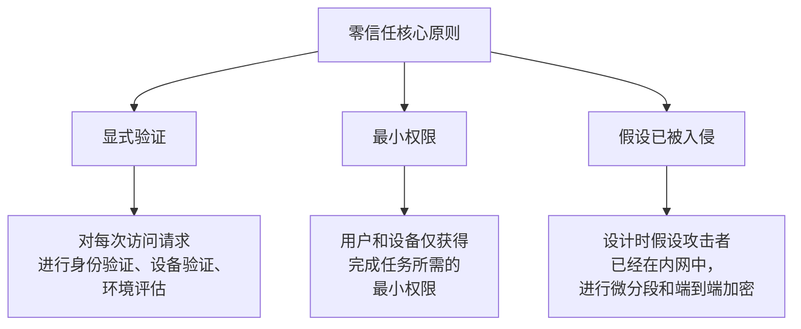

#### 零信任的技术组件

| 组件 | 功能 | 代表产品/标准 |
|------|------|-------------|
| 身份验证 | 多因素认证、持续认证 | Okta、Azure AD、FIDO2 |
| 设备信任 | 设备健康状态评估 | Intune、Jamf、CrowdStrike |
| 网络微分段 | 细粒度的网络隔离 | Illumio、Guardicore |
| 应用代理 | 隐藏应用，按需授权访问 | Zscaler、Cloudflare Access |
| 数据分类 | 根据数据敏感度执行策略 | Microsoft Purview、Varonis |
| 持续监控 | 实时评估信任状态变化 | SIEM、UEBA |

### 5.3 供应链安全思维

SolarWinds（2020）和Log4Shell（2021）彻底改变了行业对供应链安全的认知。

#### 软件供应链的攻击面

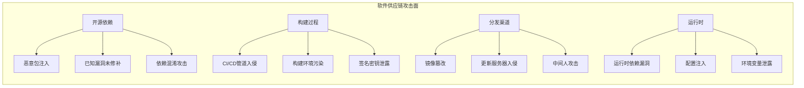

#### 供应链安全防御策略

**1. 软件物料清单（SBOM）**

维护所有软件组件的清单，包括直接依赖和传递依赖：

```json
{
  "bomFormat": "CycloneDX",
  "components": [
    {
      "name": "log4j-core",
      "version": "2.14.1",
      "purl": "pkg:maven/org.apache.logging.log4j/log4j-core@2.14.1",
      "vulnerabilities": [
        {
          "id": "CVE-2021-44228",
          "severity": "critical"
        }
      ]
    }
  ]
}
```

**2. SLSA框架（Supply chain Levels for Software Artifacts）**

Google提出的供应链安全框架，定义了四个安全级别：

| 级别 | 要求 | 防御的攻击 |
|------|------|-----------|
| SLSA 1 | 构建过程有文档记录 | 无自动化保护 |
| SLSA 2 | 使用版本控制和托管构建服务 | 防止篡改构建脚本 |
| SLSA 3 | 构建过程经过审查，来源可验证 | 麻醉攻击者伪造来源 |
| SLSA 4 | 双人审查，可复现构建 | 麻醉所有已知攻击向量 |

**3. 依赖安全实践**

```bash
# 使用npm audit检查Node.js项目的已知漏洞
npm audit --production

# 使用pip-audit检查Python项目
pip-audit

# 使用OWASP Dependency-Check检查Java项目
dependency-check --project "MyApp" --scan ./lib

# 使用trivy检查容器镜像
trivy image myapp:latest
```

### 5.4 云原生安全思维

云环境改变了安全的边界和责任模型。

#### 共同责任模型

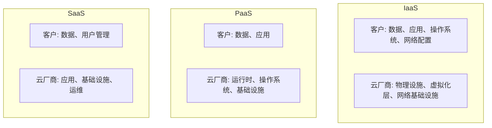

#### 云环境特有的安全挑战

| 挑战 | 描述 | 应对策略 |
|------|------|---------|
| 配置错误 | S3桶公开、安全组规则过宽 | CSPM（云安全态势管理）工具持续扫描 |
| 身份管理复杂 | IAM策略数量爆炸 | 最小权限原则 + 定期权限审计 |
| 影子IT | 员工私自使用未授权的云服务 | CASB（云访问安全代理）监控 |
| 容器安全 | 容器逃逸、镜像漏洞 | 容器安全平台 + 运行时保护 |
| 无服务器安全 | Lambda/函数的攻击面 | 函数级别的权限控制和监控 |

## 六、OODA循环在安全运营中的实战应用

OODA循环（Observe-Orient-Decide-Act）由美国空军战略家John Boyd提出，是安全运营中最重要的决策框架之一。

### 6.1 OODA循环的四个阶段

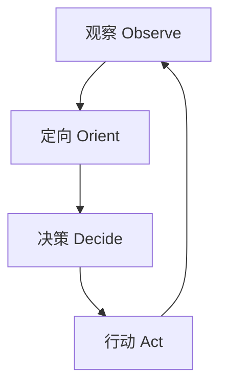

#### 观察（Observe）

收集环境信息，建立态势感知：

- **数据源**：SIEM告警、EDR事件、网络流量、威胁情报、漏洞扫描
- **关键能力**：全面覆盖（不留盲区）、实时性（减少延迟）、数据质量（减少噪声）
- **常见盲区**：加密流量未解密检查、影子IT资产未纳入监控、日志保留期不足

#### 定向（Orient）

分析收集到的信息，理解当前态势：

- **上下文关联**：将多个孤立事件关联为有意义的攻击链
- **威胁情报匹配**：将观察到的IOC（Indicators of Compromise）与已知威胁关联
- **环境理解**：结合资产重要性、业务影响来评估威胁的严重程度
- **偏误检查**：警惕确认偏误、可得性偏误等认知陷阱

#### 决策（Decide）

基于分析结果选择行动方案：

- **响应选项**：隔离主机、阻断IP、禁用账户、通知用户、升级处理
- **权衡考量**：业务影响vs安全风险、即时响应vs深入调查、自动化vs人工审核
- **决策框架**：使用预定义的响应playbook，减少决策时间

#### 行动（Act）

执行决策并验证效果：

- **执行动作**：实施选定的响应措施
- **效果验证**：确认响应措施是否有效
- **反馈循环**：将行动结果反馈到下一轮观察中

### 6.2 OODA循环的时间竞赛

安全攻防本质上是一场时间竞赛。攻击者的OODA循环和防御者的OODA循环在竞争：

- 如果防御者的OODA循环比攻击者快 → 能够在攻击者完成目标之前检测和阻断
- 如果攻击者的OODA循环比防御者快 → 能够在防御者做出响应之前完成攻击并消除痕迹

**缩短OODA循环的策略**：

| 阶段 | 缩短时间的方法 |
|------|---------------|
| 观察 | 自动化日志收集和聚合、部署EDR全覆盖 |
| 定向 | 预建关联规则、AI辅助告警分析 |
| 决策 | 预定义响应playbook、自动化决策树 |
| 行动 | SOAR自动化响应、预授权的自动阻断 |

## 七、安全思维的自我评估框架

### 7.1 安全思维成熟度模型

评估自己在安全思维方面的成熟度，有助于找到需要重点提升的方向：

| 层级 | 特征 | 典型表现 |
|------|------|---------|
| L1-规则遵循 | 按照安全检查清单行事 | "我知道要使用强密码、及时打补丁" |
| L2-模式识别 | 能识别已知的攻击模式 | "这个日志看起来像是SQL注入" |
| L3-根因分析 | 能分析漏洞的根本原因 | "这个SQL注入的根因是缺乏输入验证架构" |
| L4-系统思维 | 能从系统角度理解安全问题 | "这个漏洞是架构层面信任模型设计不当的体现" |
| L5-预见思维 | 能预见未知的安全风险 | "这个新技术的引入可能会产生X和Y类新的攻击面" |

### 7.2 自评清单

诚实回答以下问题，评估自己的安全思维水平：

**攻击者思维（每题1-5分）**：

1. 我能否在不使用自动化工具的情况下，手动发现一个Web应用的至少3个安全问题？
2. 我能否为一个新系统在30分钟内构建一棵完整的攻击树？
3. 我是否理解OWASP Top 10中每个漏洞的技术原理和利用方式？
4. 我能否描述至少3个APT组织的典型TTP（战术、技术和程序）？

**防御者思维（每题1-5分）**：

5. 我能否为一个Web应用设计包含至少5层防护的纵深防御方案？
6. 我能否使用STRIDE或PASTA方法完成一次完整的威胁建模？
7. 我能否解释零信任架构的核心原则和实施路径？
8. 我能否为一个安全事件编写完整的根因分析报告？

**系统思维（每题1-5分）**：

9. 我能否画出一个典型Web应用的完整数据流图并标注信任边界？
10. 我能否使用瑞士奶酪模型分析一个多层防护失效的安全事件？
11. 我能否评估一个安全投资的ROI（投资回报率）？
12. 我能否识别复杂系统中的涌现性安全风险？

**评分解读**：

- **12-24分**：L1-L2层级，需要加强基础安全知识和攻击面识别能力
- **25-36分**：L2-L3层级，具备基本安全思维，需要加强系统分析能力
- **37-48分**：L3-L4层级，具有较强的安全思维，可以向预见性思维发展
- **49-60分**：L4-L5层级，安全思维已经相当成熟，可以开始指导他人

## 八、推荐学习资源

### 8.1 书籍

#### 认知科学与决策

| 书名 | 作者 | 核心价值 |
|------|------|---------|
| 《Thinking, Fast and Slow》 | Daniel Kahneman | 理解双系统思维和认知偏误的经典 |
| 《Thinking in Systems: A Primer》 | Donella H. Meadows | 系统思维入门，理解复杂系统的动态 |
| 《The Art of Thinking Clearly》 | Rolf Dobelli | 99个认知偏误的实用指南 |
| 《Antifragile》 | Nassim Nicholas Taleb | 反脆弱概念，适用于安全架构设计 |
| 《Superforecasting》 | Philip Tetlock | 如何在不确定性中做出更好的预测 |

#### 安全工程与威胁建模

| 书名 | 作者 | 核心价值 |
|------|------|---------|
| 《Threat Modeling: Designing for Security》 | Adam Shostack | 威胁建模领域的权威著作 |
| 《Security Engineering (3rd Ed.)》 | Ross Anderson | 安全工程的百科全书，免费在线阅读 |
| 《The Web Application Hacker's Handbook》 | Dafydd Stuttard | Web安全攻击与防御的实战指南 |
| 《Cybersecurity and Cyberwar》 | P.W. Singer | 理解网络安全的战略维度 |

### 8.2 框架与标准

| 资源 | URL | 用途 |
|------|-----|------|
| MITRE ATT&CK | https://attack.mitre.org/ | 攻击者行为知识库 |
| OWASP Threat Modeling | https://owasp.org/www-community/Threat_Modeling | 威胁建模社区资源 |
| Threat Modeling Manifesto | https://www.threatmodelingmanifesto.org/ | 威胁建模原则和价值观 |
| NIST Cybersecurity Framework | https://www.nist.gov/cyberframework | 美国网络安全框架 |
| NIST SP 800-207 | https://csrc.nist.gov/publications/detail/sp/800-207/final | 零信任架构标准 |
| SLSA Framework | https://slsa.dev/ | 供应链安全级别框架 |
| SANS Reading Room | https://www.sans.org/reading-room/ | 安全研究论文库 |

### 8.3 工具

| 工具 | 类型 | 用途 |
|------|------|------|
| MITRE ATT&CK Navigator | 可视化 | ATT&CK覆盖度热力图 |
| OWASP Threat Dragon | 威胁建模 | 开源的威胁建模工具 |
| Microsoft Threat Modeling Tool | 威胁建模 | 微软免费的威胁建模工具 |
| Draw.io (diagrams.net) | 图表 | 绘制架构图、攻击树、数据流图 |
| Miro | 协作白板 | 威胁建模工作坊 |
| IriusRisk | 自动化威胁建模 | AI辅助的威胁建模平台 |

### 8.4 持续学习路径

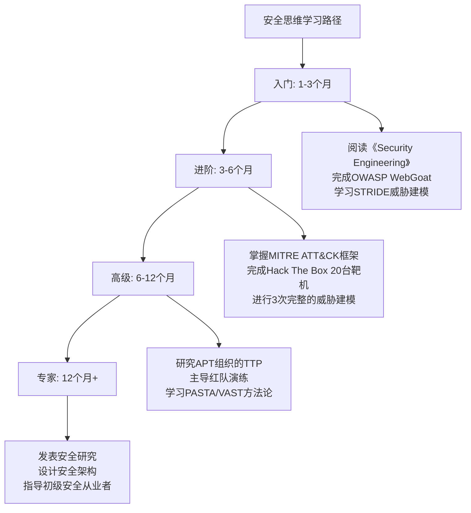

## 九、思考题与讨论问题

### 9.1 深度思考题

1. **贝叶斯实战**：假设你的SIEM系统每天产生1000条告警，其中5条是真正的安全事件。一个新部署的AI检测引擎声称有95%的检测率和5%的误报率。如果AI引擎产生了一条告警，这条告警是真正威胁的概率是多少？（提示：使用贝叶斯定理）

2. **攻击图实战**：选择一个你熟悉的Web应用，画出至少包含8个节点、3条不同攻击路径的攻击图。标注每条路径的难度等级和潜在影响。

3. **OODA循环分析**：选择一个公开的安全事件报告（如CISA的分析报告），用OODA循环框架分析防御方在每个阶段的表现——他们在哪个阶段失误了？如何改进？

4. **反脆弱设计**：为一个在线支付系统设计3个"反脆弱"安全机制，使其在遭受攻击后能够变得更强。具体说明每个机制如何实现"从冲击中获益"。

5. **涌现性风险识别**：分析一个微服务架构系统，识别至少2个可能因组件交互而"涌现"的安全风险。说明为什么单独分析每个组件无法发现这些风险。

### 9.2 讨论问题

1. **AI与安全思维**：AI工具（如大语言模型、自动化代码审计工具）的普及，是否会导致安全从业者"思维退化"？如何在利用AI提升效率的同时保持深度思考能力？

2. **安全思维的可迁移性**：安全思维中的"攻击者视角"、"纵深防御"、"最小权限"等原则，能否迁移到非技术领域（如个人安全、金融风险管理、人际关系）？举3个具体例子。

3. **过度安全思维**：一个安全从业者如果过度应用安全思维——对所有系统都假设最坏情况、不信任任何人——会对个人生活和组织效率产生什么影响？如何在"安全意识"和"偏执"之间找到平衡？

4. **安全思维的教育**：大学的网络安全课程应该如何教授安全思维？纯理论教学和CTF实战哪种更有效？是否应该从中小学就开始培养安全思维？

5. **攻防不对称性**：从博弈论角度分析，防御者永远处于"不对称劣势"——攻击者只需找到一个漏洞，防御者必须守住所有入口。这种不对称性是否可以被打破？如何打破？

## 十、综合实践项目

### 10.1 项目一：完整威胁建模

选择一个你日常使用的应用（如微信、支付宝、钉钉），完成一次完整的PASTA威胁建模：

1. **业务目标分析**：该应用的核心业务是什么？哪些数据最有价值？
2. **技术范围界定**：该应用使用了哪些技术栈？有哪些外部集成？
3. **威胁情报收集**：该行业面临哪些主要威胁？有哪些相关的CVE？
4. **漏洞分析**：该应用可能存在哪些类型的漏洞？
5. **威胁建模**：使用STRIDE枚举所有可能的威胁
6. **攻击建模**：构建攻击树，识别最高风险的攻击路径
7. **风险评估**：使用DREAD或CVSS对每个威胁评分，确定优先级

### 10.2 项目二：安全事件复盘

选择一个真实的安全事件（可从CISA、Mandiant、CrowdStrike等的公开报告中选取），完成深度复盘：

1. **事件概述**：发生了什么？影响了什么？
2. **Kill Chain分析**：攻击者经历了哪些阶段？使用了什么技术？
3. **ATT&CK映射**：将攻击者的每一步映射到ATT&CK框架
4. **防护层分析**：使用瑞士奶酪模型分析各层防护的失效点
5. **OODA循环评估**：防御方在OODA循环的每个阶段表现如何？
6. **改进建议**：如果由你来防御，你会在哪些环节做不同？
7. **认知偏误分析**：在事件中，防御方是否受到了认知偏误的影响？

### 10.3 项目三：个人安全思维训练计划

基于本节内容，为自己制定一个为期3个月的安全思维训练计划：

```text
## 月1：基础强化
- 每天：阅读1篇安全漏洞writeup（30分钟）
- 每周：完成2道CTF题目，重点记录解题思路
- 每周：对1个应用进行STRIDE威胁建模练习
- 月底：完成一次完整的自评（使用第七节的自评清单）

## 月2：系统提升
- 每天：跟踪安全新闻，用ATT&CK框架分析新事件（30分钟）
- 每周：研究1个APT组织的完整TTP
- 每周：完成1次代码审计练习（使用DVWA/Juice Shop）
- 月底：完成一个完整的威胁建模项目（项目一）

## 月3：实战应用
- 每天：分析1条SIEM告警，练习贝叶斯思维更新判断（30分钟）
- 每周：进行1次红队思维练习（选择一个系统，思考如何攻击）
- 每月：完成一个安全事件深度复盘（项目二）
- 月底：重新自评，对比月1的进步
```

---

> **本章寄语**：安全思维不是天赋，而是可以通过科学方法系统训练的技能。它需要认知科学的知识来理解自己的思维机制，需要方法论来指导分析过程，需要实战来磨练直觉，需要持续反思来突破认知边界。在这个攻防双方都在快速进化的时代，唯有不断磨练安全思维的深度和广度，才能在对抗中保持优势。记住Bruce Schneier的话："安全是一个过程，不是一个产品。"安全思维的培养，同样是一个永无止境的过程。
