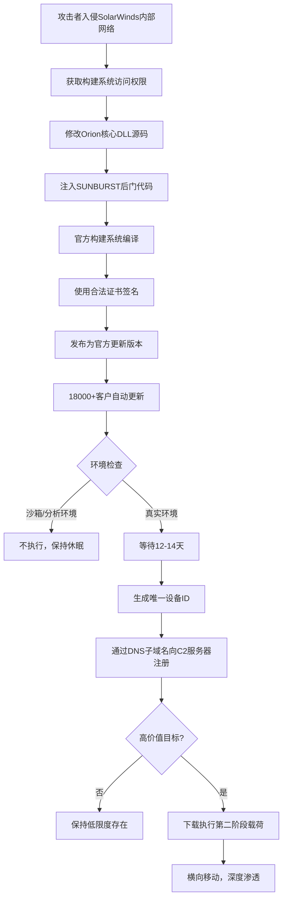
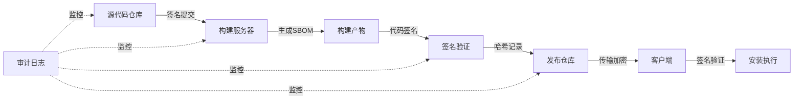
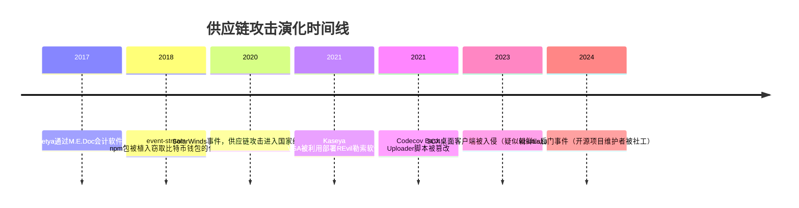

## 案例三：SolarWinds供应链攻击——软件供应链安全的分水岭事件

### 事件概览

2020年12月8日，网络安全公司FireEye在调查自身红队工具失窃事件时，意外发现了一个影响深远的供应链攻击：攻击者入侵了IT管理软件公司SolarWinds的构建系统，在其旗舰产品Orion平台的软件更新包中植入了名为**SUNBURST**的后门程序。这个后门随合法的软件更新被分发到全球超过18,000个组织的网络中，攻击者从中精选了约100个高价值目标进行深度渗透。

**关键数据：**

| 指标 | 数据 |
|------|------|
| 受影响软件版本 | Orion Platform 2019.4 HF 5 至 2020.2.1 |
| 分发时间窗口 | 2020年3月至6月（约4个月） |
| 受影响组织数量 | 超过18,000个 |
| 被深度渗透的高价值目标 | 约100个 |
| 已确认的被入侵机构 | 美国财政部、国土安全部、国务院、商务部、五角大楼、核安全管理局（NNSA）等 |
| 攻击者潜伏时间 | 在被检测到之前潜伏超过9个月 |
| 攻击归因 | 俄罗斯对外情报局（SVR）下属的APT29（Cozy Bear） |

### 攻击背景与动机分析

#### 为什么是SolarWinds？

SolarWinds成立于1999年，是全球最大的IT基础设施管理软件供应商之一，其Orion平台被广泛用于网络监控、性能管理和配置管理。选择SolarWinds作为攻击入口，体现了攻击者极高的战略眼光：

**第一，覆盖面极广。** Orion平台的客户涵盖美国政府几乎所有核心部门、全球500强企业中的大部分、以及数千家中小型组织。攻击一个供应商，等于同时攻击了整个客户群。

**第二，信任等级极高。** 作为IT管理软件，Orion需要在客户网络中拥有极高的权限——它可以访问网络设备、服务器、数据库的监控数据，甚至具备远程管理能力。这意味着一旦被攻破，攻击者自动获得这些权限。

**第三，通信渠道合法。** Orion作为监控软件，正常运行时就需要与SolarWinds的服务器通信（用于许可证验证、更新检查等），这为攻击者的命令与控制（C2）通信提供了完美的掩护。

#### 攻击者画像：APT29

APT29（又称Cozy Bear、The Dukes）是俄罗斯对外情报局（SVR）下属的高级持续性威胁组织，自2008年以来一直活跃。该组织以极其谨慎的操作安全（OPSEC）著称：

- **技术能力顶级**：能够入侵高度防护的软件供应链
- **耐心极强**：愿意花数月甚至数年时间潜伏和准备
- **目标精准**：专注于情报收集，不进行破坏性攻击
- **擅长掩护**：使用的工具和通信方式极难与正常流量区分

### 攻击技术全链路分析

#### 第一阶段：侦察与初始入侵（2019年）

攻击者首先对SolarWinds进行了详细的侦察，了解其开发环境、构建流程和代码仓库结构。初始入侵的确切途径至今未被公开确认，但安全研究人员提出了几种可能的入口：

**可能的入侵向量：**

1. **员工凭证窃取**：通过钓鱼邮件或凭证填充攻击获取SolarWinds员工的访问凭证
2. **第三方库污染**：SolarWinds的开发依赖中可能存在被污染的第三方组件
3. **内部人员协助**：虽然无直接证据，但不能完全排除
4. **零日漏洞利用**：利用SolarWinds内部系统的未公开漏洞

无论通过哪种方式，攻击者最终获得了SolarWinds内部网络的访问权限，并逐步提升特权，最终能够访问Orion产品的源代码仓库和构建系统。

#### 第二阶段：源代码注入与构建系统操控（2020年初）

这是整个攻击链中最精妙的环节。攻击者没有简单地向源代码中添加恶意文件，而是对合法的源代码文件进行了极其隐蔽的修改：

**核心注入手法：**

攻击者修改了Orion平台中的`SolarWinds.Orion.Core.BusinessLayer.dll`文件。这个DLL是Orion的核心业务逻辑层，被所有Orion组件加载。修改的关键在于：

```csharp
// 原始代码（简化示意）
public class NotificationLibrary
{
    // 正常的Orion功能代码...
}

// 攻击者注入的代码（嵌入在正常类中）
// 注意：这不是一个独立的恶意文件，而是混入了合法代码的修改
internal static class OrionImprovementBusinessLayer
{
    // 混淆后的恶意逻辑，使用与正常代码相同的命名风格
    private static bool AlreadyAddedHost(string hostId) { ... }
    private static string GetOrCreateAppId() { ... }  // 生成唯一的受害者ID
    
    // 条件执行：只在满足特定条件时才激活
    static OrionImprovementBusinessLayer()
    {
        if (!CheckHTTPProxy() || !CheckNetworkAdapter())
            return;  // 如果在沙箱或分析环境中，不执行恶意代码
        
        // 延迟激活：等待12-14天后才开始通信
        Thread.Sleep(new Random().Next(12, 14) * 24 * 60 * 60 * 1000);
    }
}
```

**注入代码的隐蔽特征：**

| 隐蔽技术 | 具体实现 |
|----------|---------|
| 代码风格模仿 | 使用与SolarWinds原始代码相同的命名规范、注释风格和编码习惯 |
| 编译环境一致性 | 在SolarWinds的官方构建环境中编译，确保编译器指纹一致 |
| 混淆技术 | 使用合法的字符串混淆方法，恶意代码看起来像正常的业务逻辑 |
| 条件执行 | 包含反分析检查：检测虚拟机环境、安全工具进程、沙箱特征 |
| 时间延迟 | 注入后等待12-14天才会启动C2通信，躲避基于时间的检测 |
| 内存执行 | 恶意载荷解码后在内存中执行，不写入磁盘 |

**构建系统入侵的关键问题：**

攻击者成功绕过了SolarWinds的构建安全措施，包括：

- **源代码控制**：攻击者修改了代码但没有在Git提交记录中留下明显痕迹（可能直接修改了构建时使用的代码，而不是提交到仓库）
- **代码审查**：修改被隐藏在大量的正常代码变更中，没有触发审查警报
- **构建验证**：构建产物的哈希值与预期一致，因为修改后的代码就是从构建系统中生成的
- **数字签名**：SolarWinds使用有效的代码签名证书对构建产物进行了签名



#### 第三阶段：SUNBURST后门的通信机制

SUNBURST后门的C2通信设计是整个攻击中最令人印象深刻的工程成就之一。它完全避免了传统恶意软件的通信模式：

**DNS子域名编码通信：**

```text
攻击者的C2服务器域名：avsvmcloud.com

SUNBURST的DNS查询格式：
[encoded-victim-id].appsync-api.us-east-1.avsvmcloud.com
[encoded-victim-id].appsync-api.us-west-2.avsvmcloud.com
[encoded-victim-id].appsync-api.eu-west-1.avsvmcloud.com
[encoded-victim-id].appsync-api.sa-east-1.avsvmcloud.com
```

**DNS查询的隐蔽编码：**

```python
# SUNBURST的域名编码算法（简化示意）
def encode_domain(victim_id, command_data):
    """
    将受害者ID和命令数据编码为看似合法的子域名
    使用与合法CDN子域名相似的命名模式
    """
    # 受害者ID经过哈希和编码处理
    encoded_id = hash_and_encode(victim_id)
    
    # 命令数据被分割并编码到多个DNS查询中
    # 每个查询看起来都像是对合法AWS服务的API调用
    subdomain = f"{encoded_id}.appsync-api.{region}.avsvmcloud.com"
    
    # C2服务器通过DNS响应返回指令
    # 使用CNAME记录编码响应数据
    return subdomain
```

**通信协议的特点：**

1. **完全基于DNS**：不使用HTTP/HTTPS，绕过了大多数网络流量检测
2. **模仿合法流量**：子域名格式模仿AWS API Gateway的域名模式
3. **低频通信**：仅在需要时才发送DNS查询，不进行持续心跳
4. **地理伪装**：使用不同区域的子域名，看起来像是正常的CDN访问
5. **数据分片**：将大量数据分割到多个DNS查询中传输

#### 第四阶段：第二阶段载荷（Teardrop/Raindrop）

对于被选中的高价值目标，SUNBURST会下载并执行第二阶段的载荷：

**Teardrop（用于通过SolarWinds入口的攻击）和Raindrop（用于在已入侵网络中横向移动）：**

这两个工具的功能包括：

| 功能 | 描述 |
|------|------|
| 内存注入 | 将Cobalt Strike Beacon注入到合法进程的内存空间 |
| 进程隐藏 | 使用反射式DLL加载，不创建新的进程 |
| 持久化 | 通过WMI事件订阅、计划任务等方式实现持久化 |
| 凭证窃取 | 使用Mimikatz变体提取内存中的凭证 |
| 横向移动 | 利用窃取的凭证在内网中移动 |
| 数据窃取 | 压缩并加密敏感文件，通过合法渠道外传 |

**攻击者在目标网络中的行为模式：**

- 极其谨慎地选择横向移动路径，避免触发告警
- 使用合法的管理工具（如PowerShell、WMI）进行操作
- 在正常工作时间之外进行数据窃取，减少异常
- 定期清除操作痕迹
- 使用被盗的合法账户进行认证

### 发现与响应过程

#### 发现经过

这次攻击的发现带有偶然性。2020年12月8日，FireEye披露自己遭到了"高度复杂的国家级攻击者"的入侵，红队工具被盗。在调查自身入侵事件时，FireEye的安全团队发现了共同的线索——SUNBURST后门。

**关键时间线：**

| 日期 | 事件 |
|------|------|
| 2019年10月 | 攻击者可能首次入侵SolarWinds内部网络 |
| 2020年2月20日 | 攻击者开始修改Orion源代码 |
| 2020年3月26日 | 含后门的Orion更新版本（2019.4 HF 5）开始分发 |
| 2020年6月4日 | 攻击者在SolarWinds环境中删除了后门代码（但已分发的版本不受影响） |
| 2020年12月8日 | FireEye披露自身被入侵，公开红Team工具被盗 |
| 2020年12月13日 | 美国CISA发布紧急指令，要求所有联邦机构断开SolarWinds Orion |
| 2020年12月14日 | SolarWinds正式确认其软件被植入后门 |
| 2021年1月5日 | 美国FBI、NSA、CISA联合声明将攻击归因于俄罗斯SVR |
| 2021年4月15日 | 美国政府正式对俄罗斯实施制裁 |

#### 响应措施

**短期应急响应：**

1. **隔离与断开**：所有使用受影响版本Orion的组织被要求立即断开连接
2. **取证分析**：安全团队对所有受影响系统进行数字取证
3. **IOC共享**：FireEye和微软公开了攻击指标（IOC），帮助全球组织检测
4. **补丁发布**：SolarWinds发布了修复版本（Orion Platform 2020.2.1 HF 2）

**长期改进措施：**

- SolarWinds重组了安全团队，任命了新的CISO
- 实施了更严格的构建安全流程
- 增强了代码审查和构建验证机制
- 与安全社区建立了更紧密的合作关系

### 技术检测方法

#### 基于网络的检测

```python
# DNS查询异常检测脚本
import dns.resolver
import re
from collections import defaultdict

class SUNBURSTDetector:
    """SUNBURST后门DNS活动检测工具"""
    
    # 已知的SUNBURST C2域名
    C2_DOMAINS = [
        "avsvmcloud.com",
        "freescanonline.com",
        "deftsecurity.com",
        "highdatabase.com",
        "incomeupdate.com",
        "databasegalore.com",
        "panhardware.com",
        "zupertech.com",
        "websitetheme.com",
        "virtualdataserver.com"
    ]
    
    def __init__(self):
        self.dns_logs = []
        self.alerts = []
    
    def analyze_dns_query(self, query_domain, source_ip, timestamp):
        """
        分析DNS查询是否包含SUNBURST特征
        """
        # 检查是否包含已知C2域名
        for c2_domain in self.C2_DOMAINS:
            if c2_domain in query_domain.lower():
                self.alerts.append({
                    'type': 'KNOWN_C2_DOMAIN',
                    'domain': query_domain,
                    'source': source_ip,
                    'timestamp': timestamp,
                    'severity': 'CRITICAL'
                })
                return True
        
        # 检查可疑的子域名模式（模仿AWS API Gateway）
        suspicious_patterns = [
            r'^[a-f0-9]{8,}\.appsync-api\.',  # 十六进制ID + appsync-api
            r'\.avsvmcloud\.com$',              # 已知C2域名
            r'^[a-z0-9]{32,}\.',                # 超长随机子域名
        ]
        
        for pattern in suspicious_patterns:
            if re.match(pattern, query_domain, re.IGNORECASE):
                self.alerts.append({
                    'type': 'SUSPICIOUS_DNS_PATTERN',
                    'domain': query_domain,
                    'source': source_ip,
                    'timestamp': timestamp,
                    'severity': 'HIGH'
                })
                return True
        
        return False
    
    def detect_high_frequency_dns(self, threshold=100, time_window=60):
        """
        检测异常高频的DNS查询（可能的数据外泄）
        """
        query_counts = defaultdict(list)
        for log in self.dns_logs:
            key = (log['source_ip'], log['query_domain'])
            query_counts[key].append(log['timestamp'])
        
        for (source, domain), timestamps in query_counts.items():
            # 计算时间窗口内的查询频率
            recent = [t for t in timestamps 
                     if timestamps[-1] - t <= time_window]
            if len(recent) > threshold:
                self.alerts.append({
                    'type': 'HIGH_FREQ_DNS',
                    'domain': domain,
                    'source': source,
                    'count': len(recent),
                    'severity': 'MEDIUM'
                })
```

#### 基于主机的检测

```powershell
# PowerShell: 检测SUNBURST后门的主机特征
function Invoke-SUNBURSTScan {
    <#
    .SYNOPSIS
        扫描系统中的SUNBURST后门特征
    .DESCRIPTION
        检查Orion安装目录、注册表、服务配置等位置的已知IOC
    #>
    
    $findings = @()
    
    # 1. 检查受影响的DLL文件
    $orionPaths = @(
        "C:\Program Files (x86)\SolarWinds\Orion",
        "C:\Program Files\SolarWinds\Orion"
    )
    
    foreach ($path in $orionPaths) {
        $dllPath = Join-Path $path "SolarWinds.Orion.Core.BusinessLayer.dll"
        if (Test-Path $dllPath) {
            $hash = (Get-FileHash -Path $dllPath -Algorithm SHA256).Hash
            $knownBadHashes = @(
                "32519b85c0b422e4656de6e6c4179e92ed9b15e7d8d5acc8223271d67823b7e0",
                "d130bd75645c2433f88ac03e7339b02c76f28d6681a0e34abf2b40d3edf527f4"
            )
            if ($hash -in $knownBadHashes) {
                $findings += @{
                    Type = "MALICIOUS_DLL"
                    Path = $dllPath
                    Hash = $hash
                    Severity = "CRITICAL"
                }
            }
        }
    }
    
    # 2. 检查SUNBURST创建的文件
    $maliciousFiles = @(
        "C:\Windows\Temp\*.tmp",  # Teardrop/Raindrop使用临时文件
        "C:\Windows\SysWOW64\config\systemprofile\AppData\*"
    )
    
    foreach ($pattern in $maliciousFiles) {
        $files = Get-ChildItem -Path $pattern -ErrorAction SilentlyContinue
        foreach ($file in $files) {
            if ($file.CreationTime -lt (Get-Date).AddDays(-14) -and 
                $file.CreationTime -gt (Get-Date).AddDays(-180)) {
                $findings += @{
                    Type = "SUSPICIOUS_FILE"
                    Path = $file.FullName
                    Created = $file.CreationTime
                    Severity = "HIGH"
                }
            }
        }
    }
    
    # 3. 检查可疑的WMI事件订阅（SUNBURST的持久化机制）
    $wmiSubscriptions = Get-WMIObject -Namespace root\subscription -Class __EventFilter
    foreach ($sub in $wmiSubscriptions) {
        if ($sub.Query -match "SELECT.*FROM.*__InstanceCreationEvent.*Win32_Process") {
            $findings += @{
                Type = "SUSPICIOUS_WMI"
                Name = $sub.Name
                Query = $sub.Query
                Severity = "HIGH"
            }
        }
    }
    
    # 4. 检查服务配置（SUNBURST通过合法SolarWinds服务运行）
    $solarwindsServices = Get-Service -DisplayName "*SolarWinds*" -ErrorAction SilentlyContinue
    foreach ($svc in $solarwindsServices) {
        $svcConfig = Get-WmiObject Win32_Service | Where-Object { $_.Name -eq $svc.Name }
        if ($svcConfig.PathName -and $svcConfig.PathName -notmatch "SolarWinds") {
            $findings += @{
                Type = "SUSPICIOUS_SERVICE"
                Name = $svc.Name
                Path = $svcConfig.PathName
                Severity = "CRITICAL"
            }
        }
    }
    
    return $findings
}
```

#### 基于行为的检测

检测SUNBURST这类高级供应链攻击，传统基于签名的方法效果有限。更有效的是基于行为的异常检测：

```python
# 供应链软件行为基线监控框架
import hashlib
import json
import psutil
import socket
from datetime import datetime, timedelta

class SoftwareBehaviorMonitor:
    """
    监控已安装软件的网络行为、文件系统访问和进程创建，
    建立正常行为基线并检测异常
    """
    
    def __init__(self, baseline_period_days=30):
        self.baseline_period = timedelta(days=baseline_period_days)
        self.baselines = {}  # 软件ID -> 正常行为基线
        self.alerts = []
    
    def establish_baseline(self, software_name, observed_behaviors):
        """
        为指定软件建立正常行为基线
        包括：网络连接目标、DNS查询模式、文件访问模式
        """
        baseline = {
            'dns_domains': set(observed_behaviors['dns']),
            'network_endpoints': set(observed_behaviors['network']),
            'file_access_patterns': observed_behaviors['files'],
            'process_children': observed_behaviors['children'],
            'typical_hours': observed_behaviors['active_hours']
        }
        self.baselines[software_name] = baseline
    
    def check_anomaly(self, software_name, current_behavior):
        """
        将当前行为与基线对比，检测异常
        """
        if software_name not in self.baselines:
            self.alerts.append({
                'type': 'NO_BASELINE',
                'software': software_name,
                'severity': 'LOW',
                'message': f'{software_name} 没有行为基线，无法检测异常'
            })
            return
        
        baseline = self.baselines[software_name]
        
        # 1. 检测新的DNS查询目标
        new_domains = set(current_behavior['dns']) - baseline['dns_domains']
        if new_domains:
            self.alerts.append({
                'type': 'NEW_DNS_DOMAINS',
                'software': software_name,
                'domains': list(new_domains),
                'severity': 'HIGH',
                'message': f'{software_name} 开始查询从未见过的域名: {new_domains}'
            })
        
        # 2. 检测新的网络连接目标
        new_endpoints = set(current_behavior['network']) - baseline['network_endpoints']
        if new_endpoints:
            self.alerts.append({
                'type': 'NEW_NETWORK_ENDPOINTS',
                'software': software_name,
                'endpoints': list(new_endpoints),
                'severity': 'HIGH',
                'message': f'{software_name} 开始连接新的网络端点: {new_endpoints}'
            })
        
        # 3. 检测异常的文件访问模式
        for access in current_behavior.get('file_access', []):
            if not self.matches_pattern(access, baseline['file_access_patterns']):
                self.alerts.append({
                    'type': 'ANOMALOUS_FILE_ACCESS',
                    'software': software_name,
                    'path': access,
                    'severity': 'MEDIUM',
                    'message': f'{software_name} 访问了不寻常的文件路径: {access}'
                })
        
        # 4. 检测异常的子进程创建
        for child in current_behavior.get('children', []):
            if child not in baseline['process_children']:
                self.alerts.append({
                    'type': 'UNEXPECTED_CHILD_PROCESS',
                    'software': software_name,
                    'process': child,
                    'severity': 'HIGH',
                    'message': f'{software_name} 创建了非预期的子进程: {child}'
                })
        
        # 5. 检测非工作时间的活动
        current_hour = datetime.now().hour
        if current_hour not in baseline['typical_hours']:
            self.alerts.append({
                'type': 'OFF_HOURS_ACTIVITY',
                'software': software_name,
                'hour': current_hour,
                'severity': 'MEDIUM',
                'message': f'{software_name} 在非典型工作时间({current_hour}:00)活跃'
            })
```

### 防御策略与供应链安全框架

#### 构建安全的软件供应链

SolarWinds事件之后，美国政府发布了第14028号行政命令，要求加强软件供应链安全。以下是企业和开发者应采取的核心措施：

**1. 构建过程的安全加固**



**SBOM（软件物料清单）示例：**

```json
{
  "bomFormat": "CycloneDX",
  "specVersion": "1.4",
  "version": 1,
  "metadata": {
    "timestamp": "2024-01-15T10:30:00Z",
    "tools": [{
      "vendor": "MyCompany",
      "name": "BuildSystem",
      "version": "2.1.0"
    }],
    "component": {
      "type": "application",
      "name": "MyProduct",
      "version": "1.0.0"
    }
  },
  "components": [
    {
      "type": "library",
      "name": "openssl",
      "version": "3.1.4",
      "purl": "pkg:generic/openssl@3.1.4",
      "hashes": [{
        "alg": "SHA-256",
        "content": "8402462e57e7ae853b306c21f754dd8682091e12b0e27a7b291b12c17593db28"
      }]
    },
    {
      "type": "library",
      "name": "libxml2",
      "version": "2.11.5",
      "purl": "pkg:generic/libxml2@2.11.5"
    }
  ]
}
```

**2. 多层签名验证**

```python
# 构建产物的多层签名验证框架
import hashlib
import json
import subprocess
from pathlib import Path

class BuildArtifactVerifier:
    """
    验证构建产物的完整性和真实性
    实施SLSA（Supply-chain Levels for Software Artifacts）框架
    """
    
    def __init__(self, trusted_signers, expected_sbom_hash):
        self.trusted_signers = trusted_signers
        self.expected_sbom_hash = expected_sbom_hash
        self.verification_results = []
    
    def verify_full_chain(self, artifact_path, signature_path, provenance_path):
        """
        执行完整的验证链：
        1. 文件哈希验证
        2. 数字签名验证
        3. SBOM完整性验证
        4. 构建溯源验证
        """
        results = {
            'file_hash': self.verify_file_hash(artifact_path),
            'signature': self.verify_signature(artifact_path, signature_path),
            'sbom': self.verify_sbom(artifact_path, provenance_path),
            'provenance': self.verify_provenance(provenance_path)
        }
        
        # 所有验证都必须通过
        all_passed = all(r['passed'] for r in results.values())
        
        return {
            'overall': 'PASS' if all_passed else 'FAIL',
            'details': results,
            'artifact': str(artifact_path)
        }
    
    def verify_file_hash(self, artifact_path):
        """计算并验证文件哈希"""
        sha256_hash = hashlib.sha256()
        with open(artifact_path, "rb") as f:
            for byte_block in iter(lambda: f.read(4096), b""):
                sha256_hash.update(byte_block)
        
        computed_hash = sha256_hash.hexdigest()
        
        return {
            'passed': computed_hash in self.expected_hashes,
            'computed': computed_hash,
            'algorithm': 'SHA-256'
        }
    
    def verify_signature(self, artifact_path, signature_path):
        """使用cosign/sigstore验证数字签名"""
        try:
            result = subprocess.run(
                ['cosign', 'verify-blob',
                 '--signature', str(signature_path),
                 '--certificate-identity', self.trusted_signers[0],
                 '--certificate-oidc-issuer', 'https://token.actions.githubusercontent.com',
                 str(artifact_path)],
                capture_output=True, text=True
            )
            return {
                'passed': result.returncode == 0,
                'output': result.stdout,
                'error': result.stderr if result.returncode != 0 else None
            }
        except FileNotFoundError:
            return {
                'passed': False,
                'error': 'cosign工具未安装，无法验证签名'
            }
    
    def verify_provenance(self, provenance_path):
        """
        验证构建溯源信息（SLSA Provenance）
        确保构建发生在受信任的环境中
        """
        with open(provenance_path) as f:
            provenance = json.load(f)
        
        checks = {
            'builder_id': provenance.get('predicate', {}).get('builder', {}).get('id'),
            'source_repo': provenance.get('predicate', {}).get('buildType'),
            'timestamp': provenance.get('predicate', {}).get('metadata', {}).get('buildFinishedOn')
        }
        
        # 验证构建者身份
        trusted_builder = 'https://github.com/slsa-framework/slsa-github-generator'
        checks['builder_trusted'] = checks['builder_id'] == trusted_builder
        
        return {
            'passed': all(v is not None and v != False for v in checks.values()),
            'details': checks
        }
```

**3. 零信任网络架构在供应链安全中的应用**

```text
传统信任模型（SolarWinds事件前）：
供应商 → 信任 → 软件更新 → 自动安装

零信任模型（推荐）：
供应商 → 验证签名 → 检查SBOM → 沙箱测试 → 人工审批 → 安装
    ↓           ↓          ↓          ↓           ↓         ↓
  身份验证    完整性     依赖审计    行为分析     合规检查   持续监控
```

#### 企业级供应链安全监控方案

```yaml
# 供应链安全监控配置示例（适用于SIEM/SOAR平台）
supply_chain_monitoring:
  # 软件更新监控
  software_updates:
    watch_patterns:
      - "*.msi"
      - "*.exe"
      - "*.dll"
      - "*.sys"
    checks:
      - signature_validation
      - hash_comparison
      - publisher_verification
      - certificate_revocation
    
  # 网络行为监控
  network_behavior:
    baseline_period: 30  # 天
    alert_thresholds:
      new_dns_domains: 5  # 单日内新域名查询阈值
      unusual_hours: true  # 非工作时间活动告警
      data_exfiltration_volume: 10485760  # 10MB数据外传阈值
    
  # 供应链风险评估
  vendor_risk:
    factors:
      - vendor_security_posture
      - incident_history
      - third_party_dependencies
      - geographic_risk
    review_frequency: quarterly
    
  # 自动响应策略
  auto_response:
    on_critical_finding:
      - isolate_affected_system
      - notify_security_team
      - block_vendor_updates
      - initiate_forensics
    on_high_finding:
      - increase_monitoring
      - require_manual_approval
      - log_all_activity
```

### 供应链攻击的演化趋势

SolarWinds事件后，供应链攻击的频率和复杂度持续上升：



#### 攻击类型分类

| 类型 | 描述 | 代表案例 | 防御难度 |
|------|------|----------|---------|
| 构建系统入侵 | 攻击者直接入侵软件供应商的构建环境 | SolarWinds | 极高 |
| 开源包投毒 | 在流行开源库中注入恶意代码 | event-stream, ua-parser-js | 高 |
| 维护者接管 | 通过社工或收购获取开源项目维护者权限 | xz-utils | 极高 |
| 分发渠道劫持 | 篡改软件下载链接或镜像站 | Linux Mint网站入侵 | 中 |
| 开发工具感染 | 感染开发IDE、编译器或SDK | XcodeGhost | 高 |
| 依赖混淆 | 利用包管理器的优先级机制发布同名恶意包 | Alex Birsan的研究 | 中 |

### 安全思维的核心提炼

#### 1. 信任链的脆弱性

SolarWinds事件揭示的根本问题是：**现代软件系统的信任链极其脆弱**。

```text
信任链的完整路径：
开发者的意图 → 源代码 → 构建系统 → 编译器 → 签名证书 → 分发渠道 → 用户系统

每一个环节都可能被攻破：
- 源代码被篡改（SolarWinds）
- 构建系统被操控（SolarWinds）
- 编译器被污染（Ken Thompson的"Reflections on Trusting Trust"）
- 签名证书被盗（Stuxnet使用被盗的Realtek/JMicron证书）
- 分发渠道被劫持（各种镜像站攻击）
```

#### 2. 纵深防御的必要性

单一的安全措施无法防御供应链攻击。必须建立多层防御体系：

| 防御层 | 措施 | SolarWinds事件中的失败点 |
|--------|------|------------------------|
| 源代码层 | 代码审查、静态分析 | 攻击者的修改未被发现 |
| 构建层 | 可重现构建、构建隔离 | 构建系统被完全控制 |
| 分发层 | 签名验证、哈希校验 | 签名本身是合法的 |
| 部署层 | 沙箱测试、行为监控 | 大多数组织未对更新进行测试 |
| 运行层 | EDR、网络监控、异常检测 | 大多数检测工具未能发现 |

#### 3. 最小权限原则的深化

Orion作为IT监控软件，拥有过度的权限：

```powershell
# SolarWinds Orion默认要求的权限（过度授权的典型例子）
# 应该通过最小权限原则进行限制

# Orion要求的域管理员权限 → 应该使用独立的服务账户，仅授予必要的读取权限
# Orion要求访问所有网络设备 → 应该限制到特定的管理VLAN
# Orion要求本地管理员权限 → 应该使用最小权限的Windows服务账户
# Orion要求数据库sa权限 → 应该创建专用的只读数据库用户
```

#### 4. 假设已被攻破（Assume Breach）

SolarWinds事件证明：**任何软件供应商都可能被攻破，任何更新都可能包含后门**。

基于这个假设的安全策略：

- 不自动安装任何更新，先在隔离环境中测试
- 对所有第三方软件实施行为基线监控
- 网络分段限制任何单一软件的影响范围
- 建立快速响应和隔离机制

### 实践练习

**练习1：构建验证框架**

搭建一个本地的软件完整性验证系统：
1. 使用cosign对本地构建的软件进行签名
2. 编写验证脚本，自动检查签名和哈希
3. 模拟签名被篡改的场景，验证检测能力

**练习2：行为基线监控**

为一个常用的开发工具建立行为基线：
1. 使用Wireshark/tshark记录软件的网络活动
2. 使用ProcMon记录文件系统和注册表访问
3. 建立正常行为模型
4. 模拟异常行为（如注入额外的DNS查询），验证检测

**练习3：供应链风险评估**

对你的项目依赖进行安全评估：
1. 使用`npm audit`/`pip audit`/`cargo audit`检查已知漏洞
2. 使用SBOM工具生成依赖清单
3. 评估每个依赖的维护状态和安全历史
4. 制定高风险依赖的替代方案

### 扩展阅读

- **SLSA Framework**：Google提出的软件供应链安全分级框架（https://slsa.dev）
- **NIST SP 800-218**：安全软件开发框架（SSDF）
- **Executive Order 14028**：美国关于改善国家网络安全的行政命令
- **SolarWinds事件官方报告**：CrowdStrike、Microsoft、FireEye的详细技术分析
- **"Reflections on Trusting Trust"**：Ken Thompson的经典论文，探讨编译器信任问题
