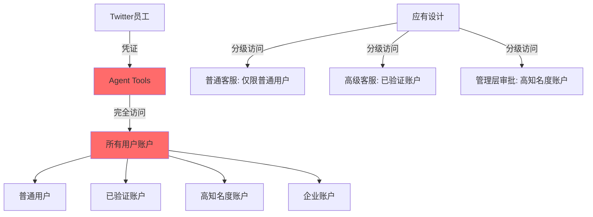
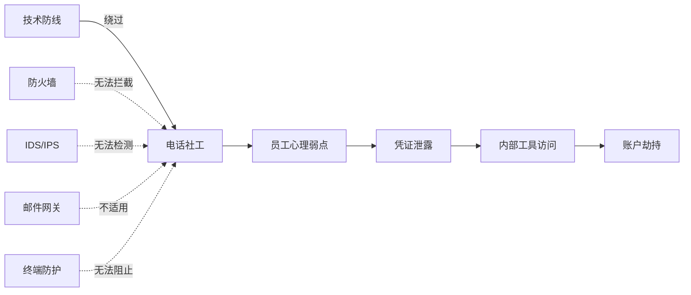

## 案例四：Twitter比特币诈骗事件（2020年）

### 事件概述

2020年7月15日，Twitter遭遇了其历史上最严重的安全事件。攻击者通过电话社会工程学手段获取了Twitter内部管理工具的访问权限，随后劫持了包括巴拉克·奥巴马、乔·拜登、埃隆·马斯克、比尔·盖茨、杰夫·贝索斯、坎耶·韦斯特以及苹果、优步等企业官方账户在内的130多个高知名度账户，发布比特币诈骗推文。这是社交媒体平台有史以来影响范围最广的内部安全事件之一，直接暴露了"人在回路"（Human-in-the-Loop）安全模型的根本性缺陷。

### 攻击时间线

| 时间（UTC-7，太平洋时间） | 事件 |
|---|---|
| 7月15日 凌晨 | 攻击者开始对Twitter员工实施电话社会工程学攻击 |
| 7月15日 ~14:00 | 成功获取内部管理工具"Agent Tools"的访问权限 |
| 7月15日 ~15:45 | 首批高知名度账户（加密货币KOL账户）被劫持 |
| 7月15日 ~16:00 | 马斯克、盖茨、贝索斯等账户开始发布比特币诈骗推文 |
| 7月15日 ~16:30 | 苹果、优步等企业官方账户被劫持并发布诈骗内容 |
| 7月15日 ~17:00 | Twitter开始意识到异常，启动应急响应 |
| 7月15日 ~17:30 | Twitter锁定所有已验证账户，禁止发推和重置密码 |
| 7月15日 ~20:00 | 内部工具访问被切断，受影响账户逐步恢复 |
| 7月16日 | Twitter发布官方声明，承认遭遇社会工程学攻击 |
| 7月31日 | FBI逮捕主犯Graham Ivan Clark（17岁，佛罗里达州坦帕市） |
| 2021年3月 | Clark认罪，被判处3年监禁 |

### 攻击手法深度剖析

#### 第一阶段：电话社会工程学（Vishing）

攻击者采用了一种被称为"语音钓鱼"（Vishing，即Voice Phishing）的社会工程学技术。与传统钓鱼邮件不同，Vishing通过电话直接与目标交互，利用人类心理弱点获取敏感信息。

**具体攻击流程：**

攻击者首先通过LinkedIn、Twitter员工公开信息等渠道收集了Twitter客服和技术支持团队的员工信息，包括姓名、职位、联系方式等。然后，攻击者伪装成Twitter内部IT支持人员，拨打了多个员工的电话。

在电话中，攻击者使用了以下话术策略：

- **权威冒充**：声称自己是新入职的IT运维工程师，正在处理"紧急安全更新"
- **紧迫性制造**：告知员工"系统检测到你的账户有异常登录"，需要立即验证身份
- **技术术语轰炸**：使用Twitter内部可能使用的术语和缩写，增强可信度
- **互惠原则**：先提供一些"帮助"信息，再提出访问内部工具的请求

通过这种方式，攻击者成功说服了部分员工在钓鱼页面上输入了他们的企业VPN凭证。值得注意的是，Twitter在COVID-19疫情期间大量采用远程办公，员工对远程访问和技术支持的需求增加，这为Vishing攻击创造了更有利的条件。

#### 第二阶段：横向移动与权限提升

获取员工凭证后，攻击者通过VPN连接到了Twitter的内部网络。然而，仅有基础的员工凭证并不足以访问高权限的管理工具。攻击者需要进一步提升权限。

Twitter的内部管理工具"Agent Tools"是客服团队用于处理账户问题（如密码重置、账户恢复等）的专用平台。该工具的访问控制存在以下关键缺陷：

1. **权限过大**：客服人员可以重置任何账户的密码，包括已验证的名人账户
2. **缺乏分级**：没有按照账户敏感度实施分级访问控制
3. **审计不足**：高风险操作（如名人账户密码重置）没有触发实时告警
4. **会话管理薄弱**：一旦获取了可访问管理工具的账户凭证，攻击者可以直接操作

攻击者通过已获取的凭证访问了具有管理工具权限的账户，然后进一步利用该工具对目标账户进行操作。

#### 第三阶段：账户劫持与诈骗执行

获得管理工具访问权限后，攻击者的操作变得直接而高效：

```text
攻击者操作流程：
┌─────────────────────────────────────────────────────────────┐
│  1. 在管理工具中搜索目标账户（@BarackObama, @elonmusk等）   │
│  2. 使用"重置密码"功能将目标账户密码更改为攻击者控制的密码   │
│  3. 关闭账户的双因素认证（2FA），防止账户所有者恢复控制       │
│  4. 使用新密码登录目标账户                                    │
│  5. 发布预先编写的比特币诈骗推文                              │
│  6. 删除账户所有者的设备会话，切断其访问路径                   │
│  7. 下载账户私信数据（部分账户）                              │
└─────────────────────────────────────────────────────────────┘
```

诈骗推文内容高度一致，典型的推文如下：

> "我在回馈社区。所有发送到以下地址的比特币将在30分钟内双倍返还！发送1000美元，回报2000美元。仅限前1000笔交易。[比特币地址]"

这种"双倍返还"骗局在加密货币社区中早已存在，但从未在如此多的高知名度账户上同时出现。利用名人效应和时间紧迫性，该骗局在短时间内骗取了约11.7万美元的比特币。

### 被影响账户与损失统计

| 类别 | 数量 | 说明 |
|---|---|---|
| 被攻击的账户总数 | ~130 | 攻击者尝试重置密码的账户 |
| 成功发推的账户 | 45 | 实际发布诈骗推文的账户 |
| 被访问私信的账户 | 36 | 攻击者查看了DM收件箱 |
| 数据被下载的账户 | 7 | 通过"Your Twitter Data"功能下载完整数据 |
| 比特币诈骗收入 | ~$117,000 | 约12.87 BTC（在当时） |
| Twitter市值影响 | 数十亿美元 | 事件后股价下跌约4% |
| Twitter业务影响 | 巨大 | 多个大广告主暂停投放 |

**被劫持的知名账户包括：**

- 政治人物：巴拉克·奥巴马、乔·拜登、迈克尔·布隆伯格
- 科技领袖：埃隆·马斯克、比尔·盖茨、杰夫·贝索斯、沃伦·巴菲特
- 企业账户：苹果（Apple）、优步（Uber）、比特币官方（Bitcoin）
- 娱乐明星：坎耶·韦斯特、弗洛伊德·梅威瑟
- 加密货币KOL：多个拥有大量关注者的加密货币推广账户

### 攻击者身份与司法结果

本案共有三名主要嫌疑人被捕：

#### Graham Ivan Clark（主犯）

- 年龄：17岁（事发时）
- 居住地：美国佛罗里达州坦帕市
- 身份：加密货币社区活跃成员
- 逮捕时间：2020年7月31日
- 指控罪名：30项重罪指控，包括有组织欺诈、通信欺诈等
- 判决结果：2021年认罪协商，判处3年监禁（含已服刑时间）
- 特殊说明：由于犯罪时未成年，案件最初在少年法庭审理，后因犯罪严重性被移交成人法庭

#### Mason Sheppard（共犯）

- 年龄：19岁
- 居住地：英国博格诺里吉斯
- 身份：在线昵称"Chaewon"
- 指控罪名：电信欺诈、共谋洗钱、故意访问受保护计算机
- 现状：美国司法部已发出逮捕令，英国引渡程序进行中

#### Nima Fazeli（共犯）

- 年龄：22岁
- 居住地：美国佛罗里达州奥兰多市
- 身份：在线昵称"Rolex"
- 指控罪名：故意协助和教唆访问受保护计算机
- 说明：Fazeli被指控帮助Sheppard联系到具有管理工具访问权限的Twitter员工

### 技术漏洞根因分析

#### 漏洞一：内部工具权限模型缺陷

Twitter的"Agent Tools"设计存在根本性的权限架构问题。该工具采用了扁平化的权限模型，即所有具有工具访问权限的员工都可以对所有账户进行操作，没有按照账户敏感度进行分级。



正确的权限模型应该是：

| 访问级别 | 适用角色 | 可操作账户范围 | 敏感操作审批 |
|---|---|---|---|
| L1 - 基础客服 | 初级客服 | 普通用户（<1万粉丝） | 无需审批 |
| L2 - 高级客服 | 资深客服 | 已验证账户（1万-100万粉丝） | 需要L2+主管确认 |
| L3 - 特权操作 | 安全团队 | 高知名度账户（>100万粉丝） | 需要双人审批 + MFA |
| L4 - 紧急操作 | 安全主管 | 任何账户 | 需要VP级别审批 + 审计日志 |

#### 漏洞二：缺乏异常行为检测

在事件发生期间，攻击者在短时间内对大量高知名度账户进行了密码重置和2FA禁用操作。这种行为模式与正常客服操作存在显著差异，但Twitter的监控系统未能及时检测到这些异常。

应被检测的异常行为模式包括：

- 同一账户在短时间内重置多个高知名度账户的密码
- 在非工作时间（事件发生在太平洋时间下午）进行大量敏感操作
- 同时禁用多个账户的2FA
- 单个客服账户访问了远超其日常工作量的名人账户
- 从非惯常IP地址或地理位置访问管理工具

#### 漏洞三：2FA可被客服直接禁用

这是一个设计层面的根本性问题：客服人员能够直接禁用任何账户的双因素认证，而不需要账户所有者的确认。这意味着2FA的安全保护完全依赖于Twitter内部流程的安全性，一旦内部流程被突破，2FA形同虚设。

正确的设计应该是：禁用2FA必须通过账户所有者已验证的备用联系方式（如已验证的手机号码或备用邮箱）进行确认，客服人员只能发起请求，不能直接完成操作。

#### 漏洞四：远程办公期间的安全控制弱化

2020年COVID-19疫情期间，Twitter大量员工远程办公。这带来了以下安全风险：

- 员工使用个人设备访问内部系统，设备安全状态不可控
- VPN连接成为唯一的网络边界保护
- 面对面的同事确认机制消失（"你是谁"无法通过物理位置验证）
- 员工在家庭环境中可能更容易被电话社工攻击（缺少同事旁听和即时确认）

### 社会工程学攻击手法详解

本次攻击使用的核心手法是"电话社会工程学"（Vishing），这是一种比传统网络钓鱼更难防御的攻击方式。

#### 为什么Vishing如此有效

| 攻击方式 | 可扩展性 | 检测难度 | 成功率 | 技术门槛 |
|---|---|---|---|---|
| 钓鱼邮件 | 极高（批量发送） | 中等（可被邮件网关拦截） | 低（1-5%） | 低 |
| 鱼叉式钓鱼 | 中等（定向攻击） | 较高（高度定制化） | 中等（10-20%） | 中等 |
| Vishing（语音钓鱼） | 低（需要人工交互） | 极高（几乎无法技术检测） | 高（30-50%） | 中等 |
| 水坑攻击 | 中等 | 高 | 中等 | 高 |

Vishing难以防御的根本原因在于：它绕过了几乎所有技术安全控制（防火墙、邮件网关、URL过滤、沙箱检测），直接针对人类心理弱点。技术安全工具无法"拦截"一通电话。

#### 攻击者使用的关键心理操控技术

1. **权威性（Authority）**：冒充IT支持人员，利用员工对IT部门的信任
2. **紧迫性（Urgency）**："你的账户已经被入侵了，需要立即处理"
3. **社会认同（Social Proof）**："其他同事都已经完成了这个操作"
4. **互惠原则（Reciprocity）**：先提供"帮助"，再提出请求
5. **承诺一致（Commitment）**：从小的配合开始，逐步升级请求
6. **稀缺性（Scarcity）**："这个操作窗口只有15分钟"

### Twitter的应急响应与事后处置

#### 应急响应时间线

Twitter在事件发生后采取了一系列应急措施：

1. **锁定已验证账户**：第一时间禁止所有已验证账户发推或重置密码，这是史无前例的措施
2. **切断内部工具访问**：禁用了"Agent Tools"的后台访问权限
3. **回滚受影响账户**：恢复被劫持账户的所有者访问权限
4. **删除诈骗推文**：批量删除所有包含比特币诈骗地址的推文
5. **通知受影响用户**：向账户被访问私信或数据被下载的用户发送通知

#### 事后安全改进措施

Twitter在事件后公布了多项安全改进计划：

**短期措施（事件后立即实施）：**
- 限制内部管理工具的访问范围
- 对高知名度账户实施额外的访问保护
- 增加高风险操作的审批流程

**中期措施（事件后数月内实施）：**
- 重新设计内部工具的权限模型
- 部署内部行为分析系统
- 加强员工安全意识培训，特别是针对社会工程学攻击

**长期措施（事件后持续改进）：**
- 零信任架构的逐步实施
- 硬件安全密钥的强制使用
- Bug Bounty计划的扩展
- 安全事件响应流程的全面重构

### 安全思维分析

#### 思维模式一：最薄弱环节分析

本案例是"木桶效应"在信息安全领域的典型体现。Twitter拥有专业的安全团队、先进的技术防护手段，但一个电话社工攻击就绕过了所有技术防线。



**防御启示**：安全体系的强度取决于最薄弱的环节，而"人"几乎总是最薄弱的环节。因此，安全设计必须假设"人会犯错"，通过技术手段限制人为错误的影响范围。

#### 思维模式二：最小权限原则的违反

最小权限原则（Principle of Least Privilege, PoLP）要求每个主体只拥有完成其工作所需的最小权限。Twitter的"Agent Tools"违反了这一原则：一个普通客服人员不应该拥有重置名人账户密码并禁用其2FA的权限。

**权限设计的核心原则：**

```text
最小权限原则的实现层次：

第1层：权限分离
  - 将"查看账户信息"与"修改账户设置"分离
  - 将"重置密码"与"禁用2FA"分离
  - 将"普通账户操作"与"高知名度账户操作"分离

第2层：审批流程
  - 敏感操作需要双人确认
  - 高知名度账户的操作需要管理层审批
  - 跨区域操作需要额外验证

第3层：时间窗口
  - 权限按需分配，使用后自动回收
  - 特权会话有时间限制
  - 非工作时间的敏感操作需要额外审批

第4层：审计与告警
  - 所有敏感操作实时记录
  - 异常行为实时告警
  - 定期权限审查
```

#### 思维模式三：信任边界的重新定义

传统的安全模型以网络边界为核心：内部网络是"可信的"，外部网络是"不可信的"。然而，本案例表明，内部人员（或被冒充的内部人员）可能比外部攻击者更危险。

这正是"零信任架构"（Zero Trust Architecture）产生的背景。零信任的核心思想是：永不信任，始终验证（Never Trust, Always Verify）。

**零信任原则在本案例中的应用：**

- **身份验证**：每次访问内部工具都应要求强身份验证，而不仅仅是登录时的一次验证
- **设备信任**：访问内部工具的设备必须符合安全策略（如安装了最新补丁、启用了磁盘加密）
- **行为验证**：即使身份和设备都可信，行为异常时仍应触发额外验证
- **微分段**：内部工具应与核心基础设施隔离，防止横向移动

#### 思维模式四：攻击面分析

本案例展示了"攻击面"概念在实践中的应用。攻击面不仅包括技术接口（API、端口、服务），还包括人员和流程。

| 攻击面类型 | 本案例中的体现 | 防御策略 |
|---|---|---|
| 人员攻击面 | 员工可被电话社工 | 安全意识培训 + 流程验证 |
| 流程攻击面 | 客服流程允许直接操作名人账户 | 流程重构 + 审批机制 |
| 技术攻击面 | 内部工具权限过大 | 最小权限 + 零信任 |
| 物理攻击面 | 远程办公环境不可控 | 设备合规检查 |
| 供应链攻击面 | 员工个人信息可被公开获取 | 最小化公开信息 |

### 从本案例提炼的防御原则

#### 原则一：假设人会犯错

安全设计的核心前提是：人一定会犯错。因此，安全架构应该：

- 限制单个人员错误的影响范围
- 对高风险操作实施多层审批
- 使用技术手段强制执行安全策略（而非依赖人员自觉）
- 建立快速响应和恢复机制

#### 原则二：分层防御

单一的安全控制永远是脆弱的。本案例中，如果Twitter实施了以下任何一项控制，攻击的影响都会大幅降低：

- 内部工具需要硬件安全密钥认证
- 高知名度账户的操作需要双人审批
- 异常行为实时告警
- 2FA禁用需要账户所有者确认

每增加一层防御，攻击者需要突破的关卡就更多，攻击成功的概率就更低。

#### 原则三：监控与响应并重

预防永远无法做到100%有效。因此，检测和响应能力同样重要：

- **检测**：建立内部行为基线，及时发现异常
- **响应**：制定详细的应急响应预案，定期演练
- **恢复**：确保能够快速恢复受影响的系统和账户
- **复盘**：每次事件后进行根因分析，改进防御措施

### 类似事件的横向对比

| 维度 | Twitter 2020 | Uber 2022 | MGM 2023 |
|---|---|---|---|
| 攻击方式 | Vishing（电话社工） | Vishing + MFA疲劳攻击 | Vishing + MFA疲劳攻击 |
| 攻击目标 | 内部管理工具 | 内部系统（Slack等） | 内部IT系统 |
| 攻击者身份 | 17岁少年 + 共犯 | Lapsus$组织 | Scattered Spider |
| 攻击持续时间 | 数小时 | 数天 | 数天 |
| 经济损失 | ~$117,000 + 市值损失 | ~$300万（赎金未付） | ~$1亿美元 |
| 根本原因 | 内部工具权限过大 | MFA实施薄弱 | 人员安全意识不足 |
| 改进措施 | 权限重构 + 零信任 | 硬件密钥强制 + MFA改进 | 全面安全审计 |

### 实践建议：如何防范此类攻击

#### 对组织的建议

1. **实施零信任架构**：内部系统不应自动信任内部用户
2. **硬件安全密钥**：对所有内部工具的访问强制使用FIDO2/WebAuthn硬件密钥
3. **分级访问控制**：根据账户敏感度实施多级访问控制
4. **双人审批机制**：高敏感操作需要两名授权人员确认
5. **内部行为监控**：部署UEBA（用户和实体行为分析）系统
6. **定期安全培训**：特别是针对社会工程学攻击的识别和应对
7. **红队演练**：定期模拟社会工程学攻击，测试员工的防御意识

#### 对个人的建议

1. **警惕意外来电**：任何自称"IT支持"的电话都应通过官方渠道反向验证
2. **不提供凭证**：合法的IT支持人员永远不会要求你提供密码
3. **启用硬件安全密钥**：尽可能使用YubiKey等硬件密钥作为2FA
4. **监控账户活动**：定期检查账户的登录历史和授权应用
5. **保持怀疑**：如果一个请求让你感到"奇怪"或"紧迫"，先停下来思考

#### 社会工程学防御流程模板

```text
收到可疑请求时的标准应对流程：

1. 暂停（STOP）
   - 不要立即执行请求
   - 不要因为"紧急"而跳过验证

2. 验证（VERIFY）
   - 通过已知的官方联系方式反向联系对方
   - 不要使用对方提供的联系方式进行验证
   - 如可能，面对面确认

3. 确认（CONFIRM）
   - 与你的主管或安全团队确认该请求是否合理
   - 检查该请求是否符合标准操作流程

4. 报告（REPORT）
   - 如果确认是攻击，立即报告安全团队
   - 记录所有细节：时间、方式、内容、对方信息
   - 即使不确定，也应报告——宁可误报，不可漏报
```

### 本案例的安全思维核心提炼

Twitter比特币诈骗事件的核心教训可以浓缩为一句话：**技术安全的上限取决于人的安全水平**。

无论你的防火墙多么坚固，加密算法多么先进，安全架构多么精密，只要有一名员工在电话中说出了他的密码，一切都会崩塌。这不是技术问题，而是人的问题。安全思维的核心，就是永远不要忽视"人"这个因素——它既是最大的风险，也是最好的防线。

作为安全从业者，我们需要时刻提醒自己：

- 攻击者永远不会按照你的防御思路来攻击
- 最危险的漏洞往往不是代码中的Bug，而是流程中的缺口
- 安全不是产品，而是持续的过程
- 每一次安全事件都是学习的机会，关键是从中提取正确的教训
