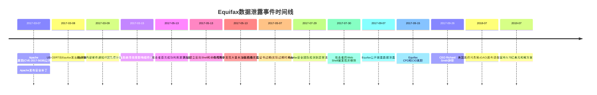
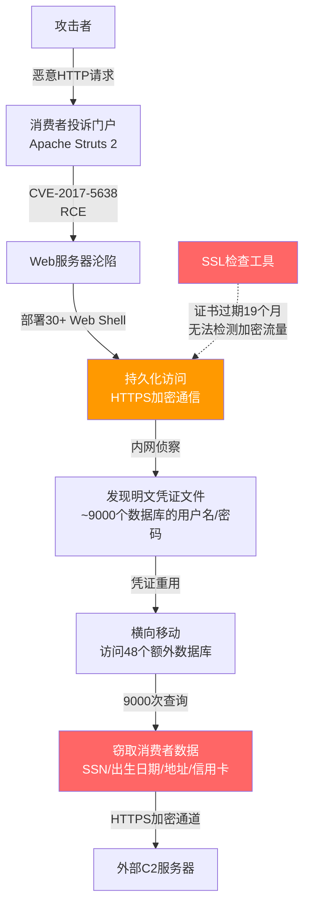
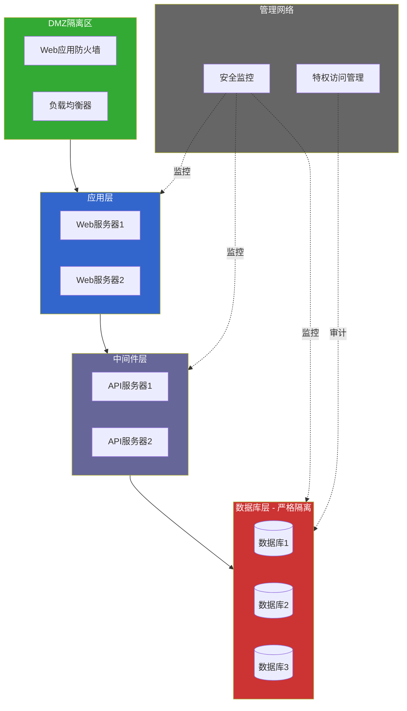
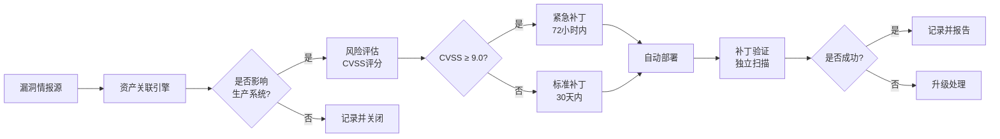
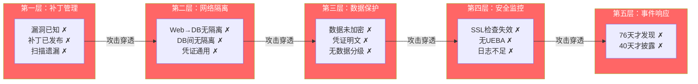

## 案例五：Equifax数据泄露（2017年）

### 一、事件概述

2017年，美国三大征信机构之一的Equifax遭受了有史以来最严重的消费者数据泄露事件之一。攻击者利用Apache Struts框架的一个已知漏洞（CVE-2017-5638），在长达76天的时间内悄无声息地渗透系统，最终窃取了约1.47亿美国消费者、1520万英国公民和约1.9万加拿大公民的敏感个人信息。泄露数据包括姓名、社会安全号码（SSN）、出生日期、家庭住址、驾照号码，以及约20.9万张信用卡号码。

这不是一个"未知零日漏洞"的故事——这是一个已知漏洞打了两个月补丁没修的故事。它深刻暴露了大型企业在补丁管理、网络隔离、数据加密、安全监控和企业治理方面的系统性失败。

**关键数据一览：**

| 指标 | 数据 |
|------|------|
| 受影响美国消费者 | 约1.47亿人 |
| 受影响英国公民 | 约1520万人 |
| 泄露的信用卡号 | 约20.9万张 |
| 攻击持续时间 | 76天（2017年5月13日 - 7月30日） |
| 漏洞披露到被利用的时间差 | 约67天（漏洞3月7日披露，5月13日被利用） |
| 发现到公开披露的时间差 | 40天（7月29日发现，9月7日披露） |
| 累计和解金额 | 超过14亿美元 |
| 股价下跌幅度 | 约35%（披露后两周内） |

---

### 二、Equifax：为什么它是一个高价值目标

#### 2.1 公司背景

Equifax成立于1899年，总部位于美国亚特兰大，是全球最大的消费者信用报告机构之一，与Experian、TransUnion并称美国"三大征信局"。截至2017年数据泄露发生时，Equifax拥有以下规模：

- **数据资产**：掌握超过8.2亿消费者的信用数据和超过9100万家企业的商业信息
- **年收入**：约34亿美元（2017年）
- **员工数量**：约10,000人
- **全球覆盖**：在美国、加拿大、英国、巴西等24个国家运营

#### 2.2 为什么征信机构是顶级攻击目标

征信机构之所以成为攻击者的"首选猎物"，在于其数据的不可替代性：

1. **数据不可撤销**：信用卡号泄露可以换卡，但SSN、出生日期、母亲婚前姓氏无法更换
2. **数据全面集中**：一个机构同时掌握身份、财务、地址等完整画像
3. **数据长期有效**：信用记录跨越数十年，不像会话令牌会过期
4. **下游攻击链长**：获取征信数据后可以进行身份盗用、信用欺诈、社会工程攻击等连锁犯罪

#### 2.3 并购扩张的隐患

Equifax在2005年至2017年间通过激进的并购策略快速扩张，收购了至少18家公司。这种增长模式带来了严重的IT整合挑战：

- 被收购公司的遗留系统未能完全整合到统一的安全架构中
- 不同系统之间的安全标准参差不齐
- 遗留系统的技术债务不断累积
- 安全团队需要保护的攻击面持续扩大，但资源未能同比例增长

---

### 三、攻击技术深度分析

#### 3.1 漏洞本质：CVE-2017-5638

CVE-2017-5638是Apache Struts 2框架中的一个远程代码执行（RCE）漏洞，存在于Jakarta Multipart解析器中。该漏洞的CVSS评分为10.0（满分），属于最高严重级别。

**漏洞原理：**

当Apache Struts处理文件上传请求时，Jakarta Multipart解析器会解析`Content-Type` HTTP头。如果`Content-Type`头中包含恶意构造的OGNL（Object-Graph Navigation Language）表达式，Struts会将其作为代码执行，从而实现远程代码执行。

攻击者只需发送一个精心构造的HTTP请求即可在目标服务器上执行任意命令：

```http
POST /action HTTP/1.1
Host: target.example.com
Content-Type: %{(#_='multipart/form-data').(#dm=@ognl.OgnlContext@DEFAULT_MEMBER_ACCESS).(#_memberAccess?(#_memberAccess=#dm):((#container=#context['com.opensymphony.xwork2.ActionContext.container']).(#ognlUtil=#container.getInstance(@com.opensymphony.xwork2.ognl.OgnlUtil@class)).(#ognlUtil.getExcludedPackageNames().clear()).(#ognlUtil.getExcludedClasses().clear()).(#context.setMemberAccess(#dm)))).(#cmd='whoami').(#iswin=(@java.lang.System@getProperty('os.name').toLowerCase().contains('win'))).(#cmds=(#iswin?{'cmd','/c',#cmd}:{'/bin/bash','-c',#cmd})).(#p=new java.lang.ProcessBuilder(#cmds)).(#p.redirectErrorStream(true)).(#process=#p.start()).(#ros=(@org.apache.struts2.ServletActionContext@getResponse().getOutputStream())).(@org.apache.commons.io.IOUtils@copy(#process.getInputStream(),#ros)).(#ros.flush())}
```

**漏洞的底层机制：**

```text
用户输入 Content-Type 头
        │
        ▼
Jakarta Multipart 解析器解析 Content-Type
        │
        ▼
解析过程中对 Content-Type 值进行 OGNL 表达式求值
        │
        ▼
OGNL 表达式中的恶意代码被服务器执行
        │
        ▼
攻击者获得远程代码执行权限
```

#### 3.2 时间线全景



#### 3.3 攻击路径详细分解

**阶段一：初始入侵（2017年5月13日）**

攻击者通过Equifax消费者投诉门户网站（consumer complaint portal）的Apache Struts组件发起攻击。该门户是Equifax为消费者提供的在线投诉工具，使用了Apache Struts 2框架。

攻击者发送了一个包含恶意OGNL表达式的HTTP请求，利用CVE-2017-5638在Web服务器上执行了系统命令。

**阶段二：建立持久化访问**

成功入侵后，攻击者立即采取了以下措施：

1. **部署Web Shell**：在受损的Web服务器上植入了超过30个Web Shell，通过加密的HTTPS通道与之通信，确保命令和控制流量不被明文检测
2. **使用合法工具**：利用系统自带工具（如cURL）发起对外连接，模仿正常网络行为，降低被检测的概率
3. **加密通信**：所有与外部C2服务器的通信均采用SSL/TLS加密

**阶段三：凭证收集与横向移动**

攻击者在内网中发现了一个令人震惊的事实：

- **近9000个数据库系统**使用了包含用户名和密码的明文登录凭证
- 这些凭证存储在多个未加密的文件中
- 很多系统共用相同的管理员账户和密码
- 内部系统之间的访问缺乏有效认证

攻击者使用收集到的凭证访问了额外的48个数据库，逐步扩大了数据窃取范围。

**阶段四：数据窃取（持续约76天）**

攻击者执行了约9000次数据库查询，每次查询返回最多数百条记录。窃取的数据通过加密通道传输到外部服务器。整个过程中，Equifax的内部安全监控系统未能触发任何有效警报。

**为什么没有被检测到？**

最关键的失败因素是：Equifax内部用于检查加密网络流量（SSL/TLS inspection）的工具的SSL证书已于2016年1月过期，而直到2017年7月29日才被修复。这意味着在长达19个月的时间里，Equifax无法检查其内部网络中的加密流量。攻击者的Web Shell使用HTTPS通信，因此完全绕过了流量检测。



---

### 四、安全思维深度分析

#### 4.1 补丁管理的系统性崩溃

CVE-2017-5638的漏洞在2017年3月7日公开披露，Apache同日发布了安全补丁。US-CERT在3月8日向包括Equifax在内的所有已知受影响方发出了警告。Equifax的IT安全团队在3月9日收到了内部通知，并在3月15日进行了系统扫描。

然而，这次扫描未能识别出所有受影响的系统。具体失败原因包括：

1. **资产清单不完整**：Equifax没有维护一个全面、准确的IT资产清单。消费者投诉门户使用的Apache Struts组件未被纳入漏洞扫描范围
2. **扫描覆盖不足**：漏洞扫描工具只检查了部分已知系统，遗漏了通过并购获得的遗留系统
3. **流程断层**：IT团队发出了修补通知，但没有建立验证机制来确保所有受影响系统都被修补
4. **责任不明确**：多个IT团队之间缺乏明确的漏洞修复责任划分

**安全思维要点：补丁管理不是"发通知"就结束的流程，而是一个从发现→评估→分发→修补→验证的完整闭环。任何一个环节的断裂都可能导致安全灾难。**

**企业补丁管理成熟度对比：**

| 成熟度级别 | 补丁流程 | Equifax现状 | 理想状态 |
|-----------|---------|------------|---------|
| L1-被动响应 | 漏洞被利用后才修补 | ✓ 符合 | - |
| L2-定期扫描 | 定期扫描但覆盖不全 | ✓ 符合 | - |
| L3-主动管理 | 有完整资产清单和修补SLA | - | ✓ 目标 |
| L4-持续验证 | 自动化修补+独立验证+审计 | - | ✓ 最佳 |
| L5-自愈系统 | 自动检测+自动修补+自动验证 | - | ✓ 卓越 |

#### 4.2 网络隔离的形同虚设

攻击者从Web应用服务器能够直接访问数据库服务器，并进一步横向移动到48个其他数据库。这暴露了严重的网络架构问题：

**问题一：扁平化网络架构**

Equifax的内部网络缺乏有效的分段隔离。Web前端、应用层、数据库层之间没有严格的网络访问控制，攻击者一旦突破Web服务器就能自由访问内网资源。

**问题二：数据库间缺乏隔离**

48个数据库之间没有独立的访问控制。使用一个数据库的凭证就能访问其他数据库，这意味着攻击者不需要针对每个系统单独突破，一套凭证就能"一钥开百锁"。

**正确的网络隔离架构：**



**对比：Equifax实际架构 vs 安全架构**

| 维度 | Equifax实际情况 | 安全最佳实践 |
|------|---------------|-------------|
| 网络分段 | 扁平化，Web可直接访问DB | DMZ/应用层/数据层严格隔离 |
| 数据库间隔离 | 无隔离，凭证通用 | 每个数据库独立认证和授权 |
| 访问控制 | 明文凭证存储 | PAM（特权访问管理）系统 |
| 流量监控 | SSL检查工具证书过期 | 全流量SSL解密+检测 |
| 内部信任模型 | 高度信任内部流量 | 零信任架构 |

#### 4.3 数据保护的严重缺失

Equifax对敏感数据的保护几乎可以用"形同虚设"来形容：

**未加密存储**

大量敏感数据——包括SSN、出生日期、驾照号码——以明文形式存储在数据库中。攻击者一旦获得数据库访问权限，无需任何解密操作即可直接读取全部数据。

**明文凭证存储**

调查发现，Equifax在多个系统中以明文形式存储了用户名和密码，包括数据库连接凭证、服务账户密码等。这些凭证被硬编码在配置文件中或存储在共享文件系统上，攻击者可以通过内网侦察轻易获取。

**缺乏数据分级**

Equifax没有对数据进行有效的安全分级。SSN等最高敏感级别的数据与普通业务数据使用相同的保护策略，导致最高价值的数据处于最低保护水平。

**数据保护层级模型：**

```text
┌─────────────────────────────────────────────┐
│ L5: 硬件安全模块(HSM)                        │ ← 根密钥、主加密密钥
│     硬件级加密，密钥不可导出                   │
├─────────────────────────────────────────────┤
│ L4: 应用层加密 + 令牌化                       │ ← SSN、信用卡号
│     数据在应用层加密，存储仅保留令牌           │
├─────────────────────────────────────────────┤
│ L3: 数据库透明加密(TDE)                      │ ← 个人信息、财务数据
│     数据库级加密，密钥独立管理                 │
├─────────────────────────────────────────────┤
│ L2: 传输层加密(TLS)                          │ ← 所有网络传输
│     全链路TLS，证书有效期管理                  │
├─────────────────────────────────────────────┤
│ L1: 存储层加密(FDE)                          │ ← 磁盘级加密
│     防止物理介质泄露                           │
├─────────────────────────────────────────────┤
│ L0: 无加密（明文存储）                        │ ← Equifax的现状 ✗
│     纯明文，零保护                             │
└─────────────────────────────────────────────┘
```

#### 4.4 安全监控的全面失败

Equifax的安全监控体系在此次事件中几乎毫无作用，原因涉及多个层面：

**SSL检查工具证书过期**

这是整个事件中最荒谬的失败之一。Equifax部署了一个用于检查内部加密流量的SSL/TLS检查工具，该工具需要自己的SSL证书来解密和重新加密流量。然而，这个证书在2016年1月就已经过期，直到2017年7月29日才被发现和修复。

在长达19个月的时间里，Equifax完全无法检查内部网络中的加密流量。攻击者所有的Web Shell通信、数据窃取传输都通过HTTPS进行，在Equifax的安全团队眼中，这些流量与正常的HTTPS流量无法区分。

**缺乏异常行为检测**

Equifax没有部署有效的用户和实体行为分析（UEBA）系统。攻击者的以下行为均未触发警报：

- 从Web服务器发起大量数据库查询（约9000次）
- 数据库查询模式与正常应用行为显著不同
- 内网中出现新的、非授权的网络连接
- 大量数据通过加密通道外传

**日志管理不足**

即使有日志记录，Equifax也缺乏有效的日志集中分析能力。安全信息和事件管理（SIEM）系统的规则配置过于简单，无法识别复杂的攻击行为模式。

#### 4.5 企业治理的结构性缺陷

2018年，美国政府问责局（GAO）发布了对Equifax数据泄露事件的详细调查报告（GAO-18-559），揭示了以下治理层面的系统性问题：

**安全投入不足**

Equifax在快速增长（通过并购扩张）的过程中，安全投入未能跟上业务扩张的速度。安全团队的规模和技术能力相对于其保护的数据资产价值严重不足。

**管理层责任缺位**

- CEO Richard Smith在事件曝光后于2017年9月26日辞职
- CIO David Webb和CSO Susan Mauldin也在事件后离职
- 事后调查显示，管理层对安全团队提出的风险警告未给予足够重视

**合规导向而非风险导向**

Equifax的安全策略更多是为了满足合规要求（如PCI DSS），而非真正基于风险评估来驱动安全投入。这种"打勾式安全"（checkbox security）导致了安全措施的形式化。

---

### 五、攻击影响与后果

#### 5.1 直接影响

**消费者层面：**

- 约1.47亿美国消费者的SSN、出生日期、地址等不可撤销的个人信息被泄露
- 约20.9万张信用卡号被盗
- 消费者面临长期的身份盗用和信用欺诈风险——这些数据不会"过期"

**企业层面：**

| 影响维度 | 具体后果 |
|---------|---------|
| 股价 | 披露后两周内下跌约35%，市值蒸发约50亿美元 |
| 和解费用 | 累计超过14亿美元 |
| 监管罚款 | FTC罚款5.75亿美元 + CFPB罚款 + 各州检察长和解 |
| 高管变动 | CEO、CIO、CSO集体辞职 |
| 业务影响 | 信用卡业务审批量短期下降 |
| 声誉损失 | 消费者信任度长期受损 |

#### 5.2 和解方案详情

2019年7月，Equifax与FTC、CFPB及50个州的检察长达成了里程碑式的和解协议：

- **消费者赔偿基金**：4.25亿美元，用于为受影响消费者提供信用监控服务和现金赔偿
- **FTC罚款**：1.75亿美元
- **各州和解**：约1.75亿美元
- **CFPB罚款**：1亿美元
- **网络安全改进要求**：Equifax被要求在2020年底前实施全面的信息安全改进计划，并接受独立第三方评估

#### 5.3 行业级影响

Equifax事件直接推动了美国乃至全球在数据保护领域的立法和监管变革：

1. **推动CCPA立法**：加州消费者隐私法案（CCPA）的出台直接受Equifax事件推动，被称为"美国版GDPR"
2. **加速GDPR执行**：欧盟借此事件强化了GDPR的执行力度
3. **征信行业监管升级**：美国国会加强了对征信机构的监管要求
4. **SEC监管介入**：美国证券交易委员会对Equifax的事件披露延迟进行了调查，指控其在发现泄露和公开披露之间的内幕交易

---

### 六、技术防御方案深度解析

#### 6.1 补丁管理自动化体系



**具体实施建议：**

```bash
# 使用开源工具进行漏洞扫描（示例：OpenVAS）
# 1. 定期全量扫描
openvas-cli -X "<create_target><name>Weekly Scan</name><hosts>10.0.0.0/8</hosts></create_target>"

# 2. 使用Nessus/Nuclei进行漏洞验证
nuclei -u https://target.example.com -t cves/ -severity critical,high

# 3. Apache Struts漏洞专项检测
nuclei -u https://target.example.com -t cves/2017/CVE-2017-5638.yaml

# 4. 自动化补丁部署（以Ansible为例）
ansible-playbook patch-management.yml --limit struts_servers --extra-vars "cve=CVE-2017-5638"
```

**补丁管理核心规则：**

1. **资产清单必须完整**：所有IT资产（包括并购获得的遗留系统）必须纳入统一管理
2. **扫描必须全覆盖**：漏洞扫描必须覆盖所有已知资产，不能依赖人工筛选
3. **修补必须有SLA**：CVSS ≥ 9.0的漏洞必须在72小时内修补
4. **修补必须有验证**：修补后必须通过独立扫描验证，不能"打了就算完"
5. **补偿措施必须就位**：在无法立即修补的情况下，必须部署虚拟补丁或WAF规则作为补偿

#### 6.2 网络隔离实施方案

**微分段（Micro-segmentation）策略：**

```yaml
# 网络策略示例（Kubernetes NetworkPolicy风格）
apiVersion: networking.k8s.io/v1
kind: NetworkPolicy
metadata:
  name: consumer-complaint-portal
spec:
  podSelector:
    matchLabels:
      app: consumer-portal
  policyTypes:
  - Ingress
  - Egress
  ingress:
  - from:
    - ipBlock:
        cidr: 0.0.0.0/0  # 仅允许外部HTTP/HTTPS访问
    ports:
    - port: 443
      protocol: TCP
  egress:
  - to:
    - podSelector:
        matchLabels:
          app: api-gateway  # 仅允许访问API网关
    ports:
    - port: 8443
      protocol: TCP
  # 注意：不允许直接访问数据库层
```

**零信任网络架构原则：**

1. **永不信任，始终验证**：内部网络流量与外部流量同等对待，每次访问都需要认证和授权
2. **最小权限访问**：每个系统只被授予完成其功能所需的最小网络访问权限
3. **持续验证**：访问权限不是一次授予永久有效，而是持续评估和动态调整
4. **假设已被入侵**：设计网络架构时假设攻击者已经在内网，通过微分段限制爆炸半径

#### 6.3 数据加密与令牌化方案

**敏感数据保护技术栈：**

```text
┌────────────────────────────────────────────┐
│ 应用层                                      │
│  ┌─────────────┐  ┌─────────────────────┐ │
│  │ 字段级加密   │  │ 格式保留加密(FPE)    │ │
│  │ AES-256-GCM  │  │ SSN格式不变          │ │
│  └─────────────┘  └─────────────────────┘ │
├────────────────────────────────────────────┤
│ 数据库层                                    │
│  ┌─────────────┐  ┌─────────────────────┐ │
│  │ TDE透明加密  │  │ 令牌化(Tokenization) │ │
│  │ 磁盘级加密   │  │ 真实数据与存储分离    │ │
│  └─────────────┘  └─────────────────────┘ │
├────────────────────────────────────────────┤
│ 密钥管理层                                  │
│  ┌─────────────┐  ┌─────────────────────┐ │
│  │ HSM硬件模块  │  │ 密钥轮换策略         │ │
│  │ 密钥不可导出 │  │ 自动化轮换+审计      │ │
│  └─────────────┘  └─────────────────────┘ │
└────────────────────────────────────────────┘
```

**SSN令牌化示例流程：**

```text
原始SSN: 123-45-6789
    │
    ▼
令牌化服务（调用HSM）
    │
    ▼
令牌值: TK-8f3a-9b2c-1d4e（格式保留，可索引）
    │
    ├──→ 应用数据库：存储令牌 TK-8f3a-9b2c-1d4e
    │
    └──→ 令牌保险库（独立HSM）：存储映射关系 123-45-6789 ↔ TK-8f3a-9b2c-1d4e
    
即使数据库被攻破，攻击者获得的只是令牌，无法还原真实SSN
```

#### 6.4 安全监控与检测体系

**解决SSL检查证书过期问题的根本方案：**

```bash
# 自动化证书监控脚本
#!/bin/bash
# 监控所有关键安全工具的证书有效期

CERTS=(
    "/etc/ssl/inspection-tool.crt"
    "/etc/ssl/waf.crt"
    "/etc/ssl/siem-forwarder.crt"
)

ALERT_DAYS=30

for cert in "${CERTS[@]}"; do
    EXPIRY=$(openssl x509 -enddate -noout -in "$cert" | cut -d= -f2)
    EXPIRY_EPOCH=$(date -d "$EXPIRY" +%s)
    NOW_EPOCH=$(date +%s)
    DAYS_LEFT=$(( (EXPIRY_EPOCH - NOW_EPOCH) / 86400 ))
    
    if [ "$DAYS_LEFT" -lt "$ALERT_DAYS" ]; then
        echo "CRITICAL: Certificate $cert expires in $DAYS_LEFT days!"
        # 发送告警到SIEM/通知系统
        curl -X POST "https://siem.internal/alert" \
            -d "{\"type\":\"cert_expiry\",\"cert\":\"$cert\",\"days\":$DAYS_LEFT}"
    fi
done
```

**UEBA（用户与实体行为分析）检测规则示例：**

```yaml
# 异常数据库查询检测规则
rule: abnormal_database_query
description: "检测来自Web服务器的异常数据库查询模式"
conditions:
  - source.type: "web_server"
  - query.count: "> 100 in 1 hour"  # 正常Web应用不会在1小时内执行100+数据库查询
  - query.tables: "sensitive_data.*"
  - query.pattern: "SELECT * FROM"  # 全表扫描
severity: HIGH
actions:
  - alert: security_team
  - block: source_ip
  - forensic_capture: true

# 异常数据外传检测规则
rule: data_exfiltration_detection
description: "检测大量数据通过加密通道外传"
conditions:
  - destination.type: "external"
  - protocol: "HTTPS"
  - data_volume: "> 100MB in 1 hour"
  - destination.reputation: "unknown"
severity: CRITICAL
actions:
  - alert: security_team
  - block: destination_ip
  - session_capture: true
```

#### 6.5 检测CVE-2017-5638的Nmap脚本

```bash
# 使用Nmap检测Apache Struts CVE-2017-5638
nmap -sV --script http-vuln-cve2017-5638 -p 80,443,8080,8443 target.example.com

# 使用Metasploit模块验证
msfconsole -q -x "
  use exploit/multi/http/struts2_content_type_ognl;
  set RHOSTS target.example.com;
  set RPORT 443;
  set SSL true;
  check;
  exit
"

# 手动检测方法：发送畸形Content-Type
curl -H "Content-Type: %{(#_='multipart/form-data').(#dm=@ognl.OgnlContext@DEFAULT_MEMBER_ACCESS).(#dm)" \
  https://target.example.com/action
# 如果返回500错误且包含OGNL异常信息，则确认存在漏洞
```

---

### 七、与同类事件的对比分析

#### 7.1 Equifax vs Capital One（2019）

| 对比维度 | Equifax（2017） | Capital One（2019） |
|---------|----------------|-------------------|
| 受影响人数 | 1.47亿 | 1.06亿 |
| 攻击入口 | 已知漏洞未修补（CVE-2017-5638） | 云WAF配置错误（SSRF） |
| 漏洞性质 | 传统Web应用漏洞 | 云原生配置错误 |
| 检测时间 | 76天 | 约4个月 |
| 根本原因 | 补丁管理失败 | 云安全配置错误 |
| 共同点 | 内部安全监控失效、数据未加密 | 内部安全监控失效、IAM权限过大 |

#### 7.2 Equifax vs SolarWinds（2020）

| 对比维度 | Equifax（2017） | SolarWinds（2020） |
|---------|----------------|-------------------|
| 攻击类型 | 单点漏洞利用 | 供应链攻击 |
| 攻击复杂度 | 低（已知漏洞，公开PoC） | 极高（国家级APT） |
| 检测难度 | 低（有签名可检测） | 极高（合法软件更新通道） |
| 防御重点 | 基本安全卫生（补丁+隔离） | 零信任+供应链安全 |
| 安全教训 | 基础安全做不好是最致命的 | 即使基础安全做好也可能被突破 |

**关键洞察：Equifax事件比SolarWinds更令人震惊——不是因为攻击技术有多高超，而是因为它本不应该发生。CVE-2017-5638是一个有公开补丁、有公开PoC的已知漏洞，攻击门槛极低。Equifax的失败不是技术层面的，而是治理和运营层面的。**

---

### 八、安全思维要点提炼

#### 8.1 核心思维模型

**瑞士奶酪模型（Swiss Cheese Model）在Equifax事件中的体现：**



在Equifax事件中，每一层防御都失效了。瑞士奶酪模型的关键洞见是：**当所有防护层的"洞"排成一线时，灾难就不可避免。** Equifax的问题不在于某一层被突破，而在于所有层都千疮百孔。

#### 8.2 五个关键安全思维教训

**教训一：基础安全比高级安全更重要**

Equifax不是被APT组织用零日漏洞攻破的，而是被一个已知的、有补丁的、公开PoC的漏洞攻破的。在投资高级威胁检测（EDR、NTDR、威胁情报）之前，先把基础安全做好：补丁管理、网络隔离、数据加密、访问控制。

**教训二：你无法保护你不知道的东西**

Equifax没有完整的IT资产清单，导致漏洞扫描遗漏了关键系统。资产发现和管理是所有安全工作的前提——如果你不知道自己有什么，你就无法保护它。

**教训三：安全工具需要安全管理**

Equifax部署了SSL检查工具，但工具本身的证书过期了19个月无人发现。安全工具不是部署了就万事大吉，它们自身也需要纳入运维监控范围。

**教训四：数据泄露的损失远超安全投入**

Equifax为这次泄露支付了超过14亿美元的和解费用，加上股价下跌带来的约50亿美元市值蒸发，以及长期的声誉损失。相比之下，一个完善的补丁管理系统和网络隔离方案的成本可能不到泄露损失的1%。

**教训五：安全是治理问题，不是技术问题**

技术上，修补Apache Struts漏洞可能只需要几小时。但Equifax的失败根植于企业治理层面：管理层对安全的重视不足、安全团队资源不足、安全流程缺乏验证机制、安全文化缺失。技术方案再完美，如果没有治理层面的支撑，也无法落地。

---

### 九、实战演练：用Equifax事件进行安全审计

#### 9.1 自查清单

将Equifax事件的教训转化为可执行的安全审计检查项：

```markdown
## Equifax事件教训自查清单

### 补丁管理（Equifax最致命的失败点）
- [ ] 是否维护了完整的IT资产清单（包括并购获得的系统）？
- [ ] 是否有自动化的漏洞扫描覆盖所有系统？
- [ ] 关键漏洞（CVSS≥9.0）是否有72小时内修补的SLA？
- [ ] 补丁修补后是否有独立验证机制？
- [ ] 无法立即修补的系统是否有补偿控制措施？

### 网络隔离
- [ ] Web层、应用层、数据库层是否有严格的网络分段？
- [ ] 数据库之间是否有独立的访问控制？
- [ ] 内部网络是否采用了零信任架构原则？
- [ ] 横向移动是否有检测和阻断机制？

### 数据保护
- [ ] 敏感数据（SSN、身份证、信用卡）是否加密存储？
- [ ] 数据库连接凭证是否使用安全的密钥管理系统？
- [ ] 是否有数据分级制度，不同级别的数据采用不同保护策略？
- [ ] 是否有数据泄露自动检测机制？

### 安全监控
- [ ] SSL/TLS检查工具的证书是否在有效期内？
- [ ] 是否有证书过期自动告警机制？
- [ ] 是否部署了异常行为检测（UEBA）系统？
- [ ] 加密流量是否有有效的检测机制？
- [ ] 日志是否集中收集和分析？

### 企业治理
- [ ] 安全团队是否有足够的资源和权限？
- [ ] 安全预算是否与保护的数据资产价值匹配？
- [ ] 是否有定期的安全风险评估和管理层汇报机制？
- [ ] 安全事件响应流程是否经过演练？
```

#### 9.2 思维训练题

**题目一：攻击路径重建**

假设你是2017年5月的攻击者，已知CVE-2017-5638的PoC。请基于以下信息重建攻击路径：

- Equifax消费者投诉门户使用Apache Struts 2
- 该门户部署在DMZ，可以访问内网数据库
- SSL检查工具证书已过期

你需要：（1）列出攻击的每个步骤；（2）分析每一步可能被检测到的信号；（3）解释为什么这些信号最终没有被检测到。

**题目二：防御方案设计**

如果你是2016年的Equifax安全架构师，预算有限，只能优先投资三个安全项目。基于2017年事件的教训，你会选择哪三个项目？请说明优先级排序的理由。

**题目三：事件响应推演**

假设你是2017年7月29日检测到异常的安全分析师，此时攻击者已经在内网活动了76天。请设计一个事件响应计划：（1）如何确定攻击范围？（2）如何在不惊动攻击者的情况下收集证据？（3）何时以及如何通知管理层？（4）何时以及如何公开披露？

---

### 十、延伸阅读与参考

| 资源 | 说明 |
|------|------|
| GAO-18-559报告 | 美国政府问责局对Equifax事件的官方调查报告，详细分析了技术失败和治理缺陷 |
| US-CERT Alert TA17-093A | 关于Apache Struts漏洞的官方安全警报 |
| CVE-2017-5638 | NIST漏洞详情页面，包含CVSS评分和技术描述 |
| Equifax和解协议文件 | FTC官方网站上的完整和解方案文本 |
| Apache Struts安全公告 | Apache官方对S2-045/S2-046漏洞的安全公告 |

**进一步学习方向：**

1. **补丁管理体系**：NIST SP 800-40《Guide to Enterprise Patch Management Planning》
2. **网络隔离架构**：NIST SP 800-125B《Secure Virtual Network Configuration for Virtual Machine (VM) Protection》
3. **数据加密标准**：NIST SP 800-175B《Guideline for Using Cryptographic Standards in the Federal Government》
4. **安全监控框架**：MITRE ATT&CK框架，用于设计针对性的检测规则
5. **零信任架构**：NIST SP 800-207《Zero Trust Architecture》
