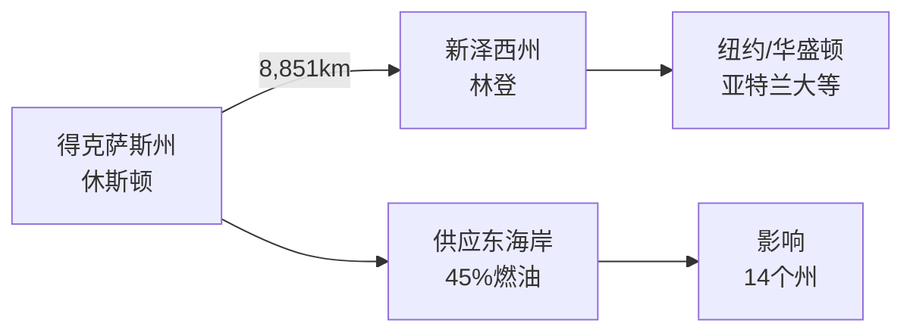
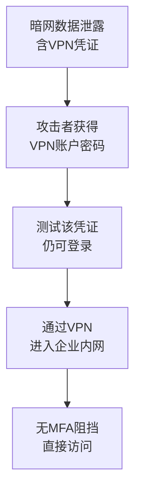
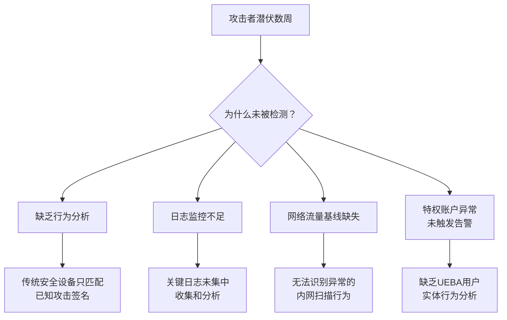
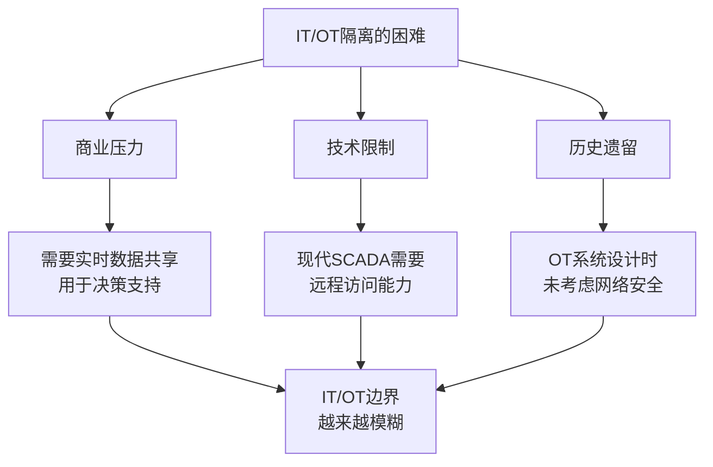
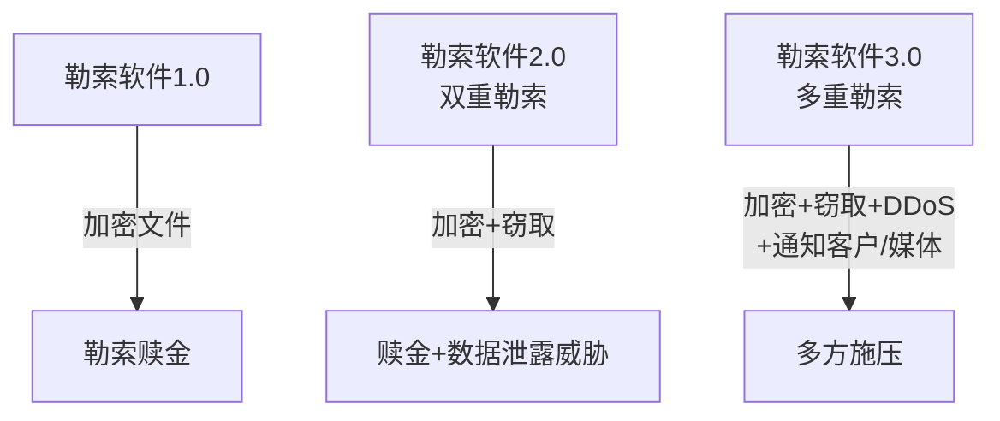

## 案例六：Colonial Pipeline勒索软件攻击（2021年）

> 2021年5月，一条VPN密码引发了一场震动整个美国的能源危机。Colonial Pipeline事件不仅是勒索软件攻击的教科书案例，更是理解"关键基础设施安全"与"IT/OT融合风险"的必修课。

### 背景介绍

#### Colonial Pipeline是谁

Colonial Pipeline是美国最大的燃油管道运营商，运营着从得克萨斯州休斯顿到新泽西州林登的一条长达8,851公里的输油管道，日输油量约250万桶——占美国东海岸燃油供应的45%。它为纽约、华盛顿特区、亚特兰大等核心城市提供汽油、柴油、航空燃油和取暖油。



这不是一家"普通企业"的网络事件——它直接关系到一个超级大国的能源命脉。理解这一点，是理解这次事件为何产生如此巨大政治和经济冲击的前提。

#### DarkSide勒索组织画像

DarkSide是一个以"勒索软件即服务"（RaaS, Ransomware-as-a-Service）模式运营的网络犯罪组织。其运营模式如下：

| 角色 | 职责 | 分成比例 |
|------|------|---------|
| 开发者（DarkSide核心团队） | 开发维护勒索软件、管理基础设施 | 赎金的20-25% |
| 附属成员（Affiliates） | 执行具体攻击、谈判赎金 | 赎金的75-80% |
| 初始访问代理（IAB） | 出售已入侵网络的访问权限 | 单独收费（$5,000-$100,000） |

DarkSide的几个特征值得注意：

- **"商业"运营**：有专门的新闻发布会、客户支持、甚至"道德准则"——声称不攻击医院、学校和政府部门（后来被证明并非如此）
- **技术成熟**：采用双重勒索——不仅加密数据，还窃取数据并威胁公开
- **俄语背景**：服务器基础设施位于俄语区，被广泛认为与俄罗斯有关联，且刻意避免攻击独联体（CIS）国家的目标
- **赎金规模**：平均赎金在200-300万美元之间，Colonial Pipeline的440万美元属于其最大单笔收入之一

### 攻击全过程深度还原

#### 第一阶段：初始入侵（2021年4月）

攻击的起点令人震惊——一个**已不再使用的VPN账户**。



**关键细节**：

1. 该VPN账户用于远程访问Colonial Pipeline的IT网络
2. 账户密码此前已在某次数据泄露中被公开（很可能出现在暗网的"凭证数据库"中）
3. 该账户**未启用多因素认证（MFA）**
4. 该账户虽然不再被员工使用，但**从未被禁用或删除**

**安全思维分析——这个"小失误"为何致命？**

表面上看，这是一个"密码泄露"问题。但从安全思维的深层角度分析，这暴露了至少五个层面的失败：

| 层面 | 具体失败 | 根因 |
|------|---------|------|
| 凭证管理 | 未禁用闲置账户 | 缺乏账户生命周期管理流程 |
| 认证安全 | 未启用MFA | VPN作为远程入口，MFA是基本要求 |
| 威胁情报 | 未监控泄露凭证 | 缺乏暗网情报监控机制 |
| 访问控制 | VPN可访问内网资源 | 远程接入未做最小权限控制 |
| 审计检测 | 入侵未被及时发现 | VPN登录异常行为未触发告警 |

> **思考题**：如果Colonial Pipeline使用了零信任架构（Zero Trust），这次攻击是否还能得手？答案将在后文分析。

#### 第二阶段：内网潜伏与横向移动（2021年4月-5月）

攻击者进入内网后，花费了数周时间进行侦察和横向移动。这不是一个"脚本小子"的行为——这是一次精心策划的、带有APT特征的攻击。

**攻击者的技术行动链**：

```text
VPN接入 → 网络侦察 → 凭证窃取 → 权限提升 → 横向移动 → 数据窃取 → 部署勒索
```

具体步骤包括：

1. **网络侦察**：扫描内网拓扑，识别关键资产、域控制器、文件服务器
2. **凭证窃取**：使用Mimikatz等工具从内存中提取凭证，获取域管理员权限
3. **权限提升**：通过Pass-the-Hash、Pass-the-Ticket等技术扩展访问范围
4. **数据窃取**：在部署勒索软件之前，先窃取约100GB的敏感数据（用于双重勒索）
5. **持久化**：在多个系统上植入后门，确保即使某个入口被关闭仍能维持访问
6. **部署勒索软件**：在IT环境中部署DarkSide勒索软件，加密约100台服务器

**安全思维要点——为什么数周的潜伏未被发现？**



这是大多数企业的通病：安全防御过度依赖"已知威胁匹配"（签名检测），而缺乏"异常行为发现"（行为分析）的能力。攻击者在内网中的活动——虽然对安全团队来说应该是"明显的异常"——因为缺乏基线而被视为正常。

#### 第三阶段：勒索软件爆发（2021年5月7日）

2021年5月7日凌晨，DarkSide勒索软件在Colonial Pipeline的IT网络中引爆。

**加密范围**：

| 系统类型 | 影响程度 | 说明 |
|---------|---------|------|
| 企业IT系统 | 严重加密 | 邮件、ERP、计费、调度系统全部瘫痪 |
| 运营技术（OT）系统 | 未被加密 | 管道控制SCADA系统理论上未被入侵 |
| 业务连续性 | 完全中断 | 无法计费、调度、监控管道状态 |

**关键决策：主动关闭管道运营**

这里有一个经常被误解的点：**勒索软件并未直接加密管道控制系统**。Colonial Pipeline主动关闭管道运营的原因是：

1. IT系统被加密后，公司无法准确掌握管道的运营状态
2. 无法进行计费和调度——不知道向谁收费、收多少、在哪里注入燃油
3. 担心勒索软件可能已渗透到OT网络（IT/OT边界不清，无法确认安全）
4. 面对不确定的风险，选择了"安全优先"的保守策略

**安全思维分析**：

这个决策体现了安全思维中的一个重要原则——**在不确定性面前，选择安全而非便利**。但从另一个角度看，它也暴露了一个根本问题：**如果IT和OT网络真正做到了物理隔离或严格逻辑隔离，公司就不需要做出这个代价高昂的决策**。

#### 第四阶段：赎金支付与部分追回

事件发生后，Colonial Pipeline在5月8日支付了约440万美元（75比特币）的赎金。

**赎金决策的复杂性**：

| 考量因素 | 分析 |
|---------|------|
| 恢复速度 | 解密工具可加速恢复（但DarkSide的解密器速度极慢） |
| 数据泄露威胁 | 100GB数据被窃取，拒绝支付将面临公开泄露 |
| 政治压力 | 东海岸燃油告急，社会影响巨大 |
| 法律风险 | FBI当时已不建议支付赎金，但不禁止 |
| 道德困境 | 支付赎金会资助犯罪组织，鼓励更多攻击 |

**FBI追回部分赎金**：

2021年6月7日，美国司法部宣布成功追回了约63.7万美元（约63.7枚比特币）。这是通过追踪比特币交易链实现的——攻击者将赎金转移到了一个FBI能访问私钥的比特币钱包中。

这个事件具有重要的信号意义：**加密货币并不完全"不可追踪"**，执法机构在链上分析方面的能力在持续提升。

### 安全思维深度分析

#### 凭证管理的系统性失败

Colonial Pipeline事件最直接的教训是凭证管理，但这个教训远比"换密码"深刻得多。

**凭证生命周期管理模型**：


Colonial Pipeline在"退役"和"销毁"阶段完全失守。一个完整的凭证管理体系应包含：

| 环节 | 应有措施 | Colonial Pipeline现状 |
|------|---------|---------------------|
| 创建 | 遵循最小权限原则 | 未知 |
| 分发 | 安全通道传递，不以明文存储 | 未知 |
| 使用 | MFA + 条件访问策略 | 未启用MFA |
| 监控 | 暗网泄露监控 + 登录异常告警 | 无泄露监控 |
| 轮换 | 定期轮换，高权限账户强制缩短周期 | 未知 |
| 退役 | 员工离职/不再使用时立即禁用 | 未退役 |
| 销毁 | 从所有系统中彻底移除 | 未执行 |

**实操建议——凭证泄露监控方案**：

企业应建立凭证泄露监控机制。以下是几种可行的技术方案：

```bash
# 方案一：使用Have I Been Pwned API检查企业域名的泄露情况
curl -s -H "hibp-api-key: YOUR_API_KEY" \
  "https://haveibeenpwned.com/api/v3/enterprisesearch/example.com"

# 方案二：使用DeHashed等服务监控企业凭证泄露
# （需要API密钥，适合集成到SIEM系统）

# 方案三：自建监控脚本框架
cat > credential_monitor.py << 'EOF'
#!/usr/bin/env python3
"""凭证泄露监控示例框架"""
import hashlib
import requests

def check_password_pwned(password: str) -> int:
    """通过k-anonymity模型检查密码是否已泄露（不发送明文密码）"""
    sha1 = hashlib.sha1(password.encode('utf-8')).hexdigest().upper()
    prefix, suffix = sha1[:5], sha1[5:]
    response = requests.get(f"https://api.pwnedpasswords.com/range/{prefix}")
    for line in response.text.splitlines():
        hash_suffix, count = line.split(':')
        if hash_suffix == suffix:
            return int(count)
    return 0

def check_domain_breaches(domain: str, api_key: str) -> list:
    """检查企业域名是否出现在已知数据泄露中"""
    headers = {"hibp-api-key": api_key, "user-agent": "CredentialMonitor"}
    resp = requests.get(
        f"https://haveibeenpwned.com/api/v3/enterprisesearch/{domain}",
        headers=headers
    )
    return resp.json() if resp.status_code == 200 else []
EOF
```

#### IT/OT融合的致命风险

Colonial Pipeline事件的核心教训之一是**IT（信息技术）与OT（运营技术）网络的隔离不足**。

**IT与OT的本质差异**：

| 维度 | IT网络 | OT网络 |
|------|--------|--------|
| 核心目标 | 数据的机密性、完整性 | 物理过程的可用性和安全性 |
| 可用性要求 | 可容忍短暂中断 | 几乎零容忍（停机=物理危险） |
| 补丁策略 | 可频繁更新 | 更新窗口极有限（停产才能更新） |
| 典型协议 | TCP/IP, HTTP/S | Modbus, DNP3, OPC-UA |
| 设备生命周期 | 3-5年 | 15-30年 |
| 安全事件后果 | 数据泄露、经济损失 | 人员伤亡、环境灾难 |

**为什么IT/OT隔离如此困难？**



在Colonial Pipeline的案例中，尽管勒索软件最终没有加密OT系统，但公司**无法确认**OT系统是否安全——这本身就是IT/OT隔离失败的证据。如果隔离足够严格，公司可以确切地说"OT系统不受影响"，从而避免关闭管道运营。

**正确的IT/OT安全架构**：

```text
┌─────────────────────────────────────────────┐
│                  企业IT网络                   │
│  (邮件、ERP、办公系统)                        │
├──────────────┬──────────────────────────────┤
│              │  DMZ / 数据缓冲区             │
│  企业防火墙  │  (数据二极管/安全网关)         │
│              │                              │
├──────────────┼──────────────────────────────┤
│              │  OT监控层                     │
│  OT防火墙    │  (HMI、工程工作站)            │
│              │                              │
├──────────────┼──────────────────────────────┤
│              │  OT控制层                     │
│  控制网络    │  (PLC、RTU、DCS)              │
│              │                              │
├──────────────┼──────────────────────────────┤
│              │  物理过程层                   │
│  物理隔离    │  (传感器、执行器)             │
└──────────────┴──────────────────────────────┘
```

每层之间的访问应遵循：

1. **单向数据流**优先（从OT到IT，使用数据二极管）
2. **白名单策略**：只允许明确授权的通信
3. **协议转换**：在边界处终止OT协议，用IT标准协议中转
4. **深度包检测**：对穿越边界的流量进行协议级验证

#### 勒索软件的"双重勒索"模型

Colonial Pipeline事件展示了现代勒索软件的演进——从单纯的"加密勒索"到"数据窃取+加密勒索"的双重模型。



这种演进意味着：

- **备份不再是万能的**：即使有完整的备份可以恢复数据，攻击者仍然可以通过公开窃取的数据来施压
- **数据保护的需求升级**：不仅要防加密，还要防数据外泄
- **事件响应更复杂**：需要同时处理数据恢复和数据泄露应对

**防御双重勒索的关键控制**：

| 控制措施 | 防加密 | 防外泄 | 实施难度 |
|---------|--------|--------|---------|
| 离线备份 | 强 | 无 | 低 |
| 数据加密存储 | 中 | 强 | 中 |
| DLP（数据防泄漏） | 无 | 强 | 高 |
| 网络流量异常检测 | 弱 | 中 | 中 |
| 微隔离（Micro-segmentation） | 强 | 强 | 高 |
| 终端检测与响应（EDR） | 强 | 中 | 中 |

#### 零信任架构能否阻止这次攻击？

回到之前的思考题：如果Colonial Pipeline采用了零信任架构，结果会不同吗？

**零信任的核心原则**：

1. **永不信任，始终验证**：每次访问都必须经过身份验证和授权
2. **最小权限访问**：只授予完成任务所需的最低权限
3. **假设已被攻破**：设计时假设网络中已有攻击者

**对Colonial Pipeline攻击链的逐环节分析**：

| 攻击阶段 | 零信任控制 | 是否能阻止 |
|---------|-----------|-----------|
| VPN凭证滥用 | MFA + 设备证书 + 条件访问 | 大概率能阻止 |
| 内网横向移动 | 微隔离 + 每次访问都验证身份 | 能显著限制 |
| 凭证窃取提升 | 特权访问管理 + JIT即时权限 | 能大幅降低影响 |
| 数据窃取 | DLP + 数据分类 + 访问审计 | 能检测并阻止部分 |
| 勒索软件部署 | 应用白名单 + EDR + 行为分析 | 能检测并阻止 |

**结论**：零信任架构无法保证100%阻止攻击（没有任何单一措施可以），但它能将攻击的影响从"全面瘫痪"降低到"有限入侵"。最关键的是，零信任的MFA要求就能阻止初始入侵——而这本是这次攻击的起点。

### 事件响应复盘

#### 时间线

| 时间 | 事件 |
|------|------|
| 2021年4月下旬 | 攻击者通过VPN账户入侵IT网络 |
| 2021年4月-5月初 | 内网侦察、横向移动、数据窃取 |
| 2021年5月7日凌晨 | DarkSide勒索软件在IT网络中引爆 |
| 2021年5月7日 | Colonial Pipeline检测到攻击并关闭管道 |
| 2021年5月8日 | 支付440万美元比特币赎金 |
| 2021年5月12日 | 管道逐步恢复运营 |
| 2021年5月13日 | DarkSide宣布关闭（受执法压力） |
| 2021年6月7日 | FBI追回约63.7万美元赎金 |

#### 响应中的关键决策分析

**决策1：关闭管道运营**

- 优点：防止勒索软件扩散到OT系统，避免物理安全风险
- 代价：东海岸燃油供应中断，引发恐慌性抢购，经济损失巨大
- 事后评估：在当时的信息条件下，这是**正确的决策**——公司无法确认OT安全

**决策2：支付赎金**

- 优点：获得解密工具（虽然速度极慢），缓解数据泄露压力
- 代价：资助犯罪组织，引发道德争议
- 事后评估：**争议最大**的决策。FBI不建议支付但不禁止。从纯商业角度，支付440万赎金vs每天数千万的停运损失，商业逻辑成立。但从公共安全角度，这个决策鼓励了更多针对关键基础设施的攻击

**决策3：与FBI合作**

- Colonial Pipeline在发现攻击后迅速联系了FBI
- FBI介入后，通过区块链分析追踪赎金流向
- 最终追回约230万美元中的63.7万美元（约29%）
- 这证明了**与执法机构合作的价值**——单独行动无法追回赎金

### 攻击面映射：从安全思维框架审视

用本章理论部分介绍的**攻击面分析**框架来审视Colonial Pipeline事件：

| 攻击面类型 | 具体暴露 | 利用情况 | 防御缺失 |
|-----------|---------|---------|---------|
| 人员攻击面 | 员工密码在数据泄露中暴露 | 间接利用（泄露密码→VPN登录） | 无泄露监控 |
| 网络攻击面 | VPN无MFA | 直接利用 | 认证策略不足 |
| 应用攻击面 | VPN软件本身的漏洞 | 未利用（直接用凭证登录） | — |
| 物理攻击面 | 远程办公场景 | 间接（远程→VPN→内网） | 远程接入安全策略不足 |
| 社会工程攻击面 | 无直接社工 | — | — |

**核心发现**：这次攻击的**初始攻击面极小**（一个闲置VPN账户），但**影响面极大**（整个东海岸燃油供应）。这正是安全思维需要关注的重点——**不是最大的攻击面最危险，而是被忽视的攻击面最危险**。

### 对其他行业的启示

#### 关键基础设施行业的通用教训

Colonial Pipeline事件的教训不仅适用于能源行业，对所有关键基础设施行业都有参考价值：

| 行业 | 类似风险场景 | 需要优先部署的控制 |
|------|------------|-------------------|
| 电力 | SCADA系统被入侵导致停电 | IT/OT隔离 + 安全监控 |
| 供水 | 化学品添加量被篡改 | 物理安全 + OT独立认证 |
| 金融 | 交易系统被加密导致市场混乱 | 业务连续性 + 灾难恢复 |
| 医疗 | 医院系统被加密导致手术中断 | 离线备份 + 网络分段 |
| 交通 | 航空管制/铁路信号被干扰 | 冗余系统 + 安全审计 |

#### 企业的行动清单

无论企业规模大小，以下措施应作为优先级排序后的行动项：

**立即行动（0-30天）**：

1. 盘点所有VPN/远程访问账户，禁用不再使用的账户
2. 为所有远程访问启用MFA（优先使用硬件密钥，次选TOTP应用）
3. 确认勒索软件备份策略——至少一份离线备份，定期验证可恢复性
4. 检查企业邮箱域名是否出现在已知数据泄露中

**短期行动（1-3个月）**：

5. 部署EDR（终端检测与响应）覆盖所有终端
6. 建立网络流量基线，配置异常告警
7. 实施特权访问管理（PAM），高权限账户使用JIT（即时权限）模式
8. 制定并演练勒索软件事件响应预案

**中期行动（3-12个月）**：

9. 推进网络微隔离，特别是IT/OT边界
10. 部署DLP（数据防泄漏）系统监控敏感数据外流
11. 建立暗网情报监控能力
12. 逐步向零信任架构迁移

### 与同类事件的对比分析

将Colonial Pipeline与其他重大勒索软件事件进行对比，有助于理解攻击模式的共性和差异：

| 维度 | Colonial Pipeline | WannaCry (2017) | NotPetya (2017) | Kaseya (2021) |
|------|-------------------|-----------------|-----------------|---------------|
| 攻击动机 | 经济利益 | 经济利益 | 地缘政治破坏 | 经济利益 |
| 初始入口 | 泄露的VPN凭证 | EternalBlue漏洞 | 供应链（M.E.Doc） | 供应链（Kaseya VSA） |
| 传播方式 | 人工横向移动 | 蠕虫自动传播 | 蠕虫+供应链 | 供应链分发 |
| 勒索模式 | 双重勒索 | 单一加密 | 伪装勒索（实为破坏） | 双重勒索 |
| 赎金支付 | 440万美元 | 少量（多数未支付） | 无（无法解密） | 7000万美元（后降低） |
| 影响范围 | 美国东海岸能源 | 全球150+国家 | 全球，100亿美元损失 | 1,500+企业 |
| 政治后果 | 拜登签署网络安全行政令 | 推动全球补丁管理 | 加速网络安全立法 | 推动供应链安全标准 |

**共性模式**：

1. 所有事件都利用了**已知但未修复的弱点**（泄露密码、未打补丁、供应链信任）
2. 都暴露了**防御体系的系统性缺陷**而非单一漏洞
3. 都产生了**远超技术层面的连锁反应**（经济、政治、社会）

### 常见误区与纠正

**误区1："我们不是关键基础设施，不会被盯上"**

现实：DarkSide等RaaS组织并不挑目标——它们通过附属成员广泛撒网。Colonial Pipeline的附属成员可能只是因为发现了一个未保护的VPN账户就选择了这个目标。任何有可利用弱点的组织都可能成为目标。

**误区2："有了备份就不怕勒索软件"**

现实：双重勒索模式下，备份只能解决加密问题，无法解决数据泄露威胁。Colonial Pipeline即使有完美备份，仍然面临100GB数据被公开的风险。

**误区3："支付赎金就能解决问题"**

现实：DarkSide的解密器速度极慢（恢复全部数据可能需要数周），且支付赎金不保证数据不被二次泄露。更重要的是，支付赎金资助了犯罪组织的后续攻击。

**误区4："网络隔离了就安全了"**

现实：Colonial Pipeline的IT和OT网络"理论上"是隔离的，但隔离不够严格，导致公司无法确认OT安全。"隔离"不是一个二元状态，而是一个光谱——需要持续验证隔离的有效性。

**误区5："安全是IT部门的事"**

现实：Colonial Pipeline事件后，美国政府成立了专门的跨部门工作组，拜登总统签署了网络安全行政令。当安全事件影响到国家基础设施时，这是**整个组织和国家层面**的问题。

### 进阶分析：攻击经济学

从经济学角度理解勒索软件生态，有助于更深刻地理解为什么这类攻击持续发生。

**攻击者的成本-收益分析**：

```text
攻击成本：
  - 暗网购买泄露凭证：$10-500
  - RaaS订阅费用：赎金的20-25%
  - 攻击基础设施（VPN、C2服务器）：$500-2,000/月
  - 初始访问代理费用：$5,000-100,000（如需购买）
  ────────────────────────────
  总成本：约$10,000-150,000

攻击收益：
  - Colonial Pipeline赎金：$4,400,000
  - 附属成员分成（75%）：$3,300,000
  ────────────────────────────
  ROI：22x - 330x
```

**防御者的成本-收益分析**：

```text
防御成本（全面防护）：
  - 零信任架构改造：$500,000-5,000,000
  - SOC运营（年）：$1,000,000-5,000,000
  - 安全意识培训（年）：$50,000-200,000
  - 渗透测试和红队演练（年）：$100,000-500,000
  ────────────────────────────
  总成本：约$1,650,000-10,700,000/年

不防御的代价：
  - 赎金：$4,400,000
  - 运营中断损失：$100,000,000+（估算）
  - 股价下跌：市值蒸发数十亿
  - 声誉损失：难以量化
  - 监管罚款：$1,000,000+
  ────────────────────────────
  总代价：超过1亿美元
```

**核心洞察**：攻击者的ROI远高于防御者的ROI——这是勒索软件泛滥的根本经济驱动力。只有当防御成本（通过标准化和自动化）降低到远低于攻击代价时，这个等式才能平衡。

### 参考资源

| 资源 | 说明 |
|------|------|
| CISA Alert AA21-131A | 美国网络安全和基础设施安全局发布的Colonial Pipeline分析报告 |
| 美国白宫行政令14028 | 拜登在事件后签署的改善国家网络安全行政令 |
| Mandiant调查报告 | 对DarkSide组织和攻击链的技术分析 |
| NIST SP 800-82 Rev.3 | 工控系统安全指南 |
| SANS ICS安全课程 | 针对工业控制系统的安全培训 |

---

> **本案例核心教训**：一个从未被禁用的旧VPN账户、一个没有MFA的远程入口——这些"小问题"在一个关键时刻叠加，就足以瘫痪一个国家45%的燃油供应。安全不是关于部署了多少高级工具，而是关于是否处理好了每一个基础问题。Colonial Pipeline事件证明：在安全领域，**基础不牢，地动山摇**。
