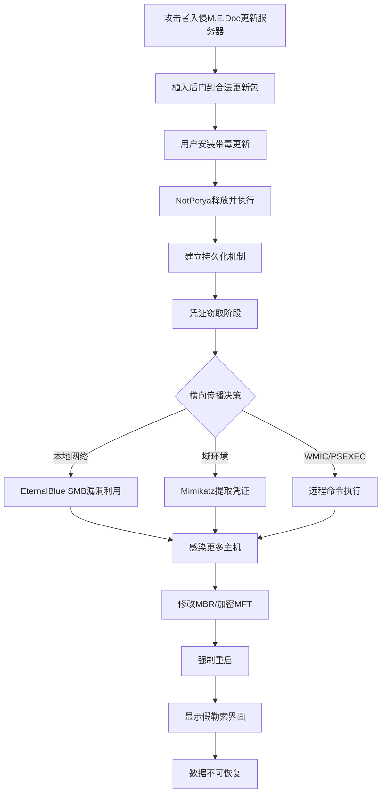
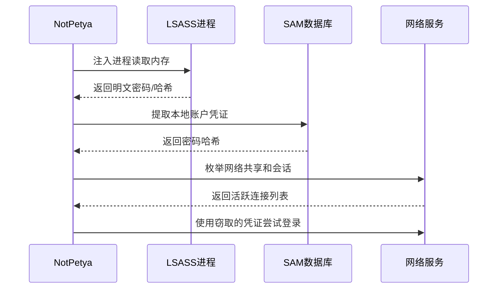
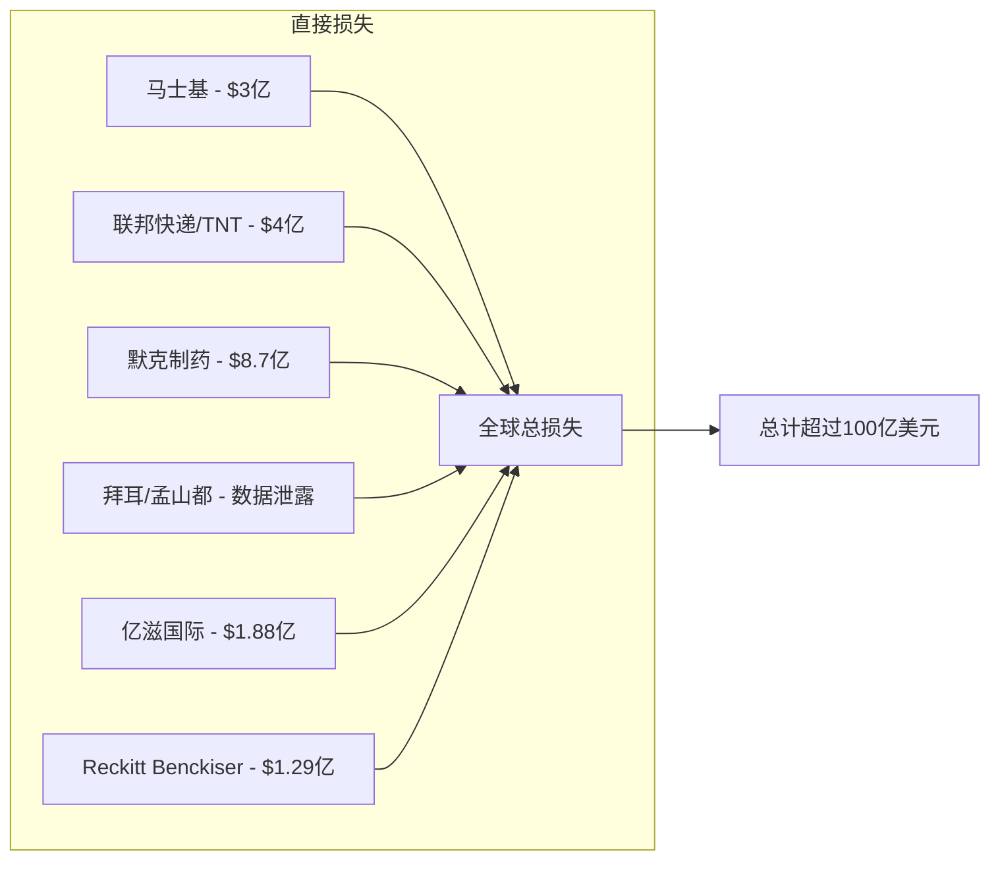
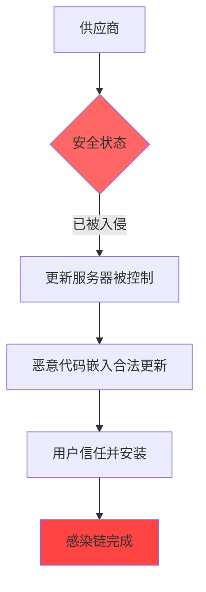
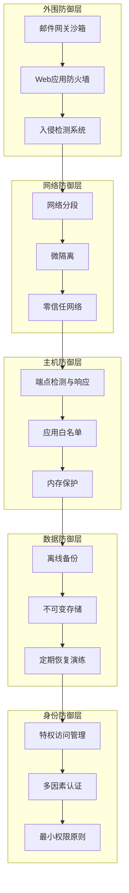
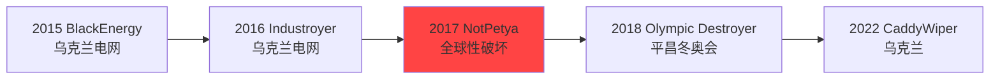

## 案例七：NotPetya攻击（2017年）

### 概述

2017年6月27日，一种伪装成勒索软件的破坏性恶意软件席卷全球。它通过乌克兰主流会计软件M.E.Doc的更新机制爆发，在数小时内感染了全球超过65个国家的数万台计算机，造成超过100亿美元的经济损失——这是人类历史上经济损失最大的单次网络攻击事件。

这不是一个简单的勒索软件案例。NotPetya（又名ExPetr、Petya变种、GoldenEye）实际上是一种**伪装成勒索软件的国家级网络武器**，其真正目的是对乌克兰关键基础设施进行破坏，但其失控的传播机制让它成为了一场全球性灾难。

本文将从技术细节、攻击链分析、影响评估、防御思路等多个维度，深入解剖这场改变网络安全格局的攻击事件。

---

### 历史背景与地缘政治

#### 乌克兰的数字化困境

2017年的乌克兰处于特殊的地缘政治环境之中。自2014年克里米亚危机以来，乌克兰与俄罗斯之间的网络对抗持续升级：

| 时间 | 事件 | 影响 |
|------|------|------|
| 2015年12月 | 乌克兰电网遭受BlackEnergy攻击 | 约23万用户断电数小时 |
| 2016年12月 | 乌克兰电网再次遭受Industroyer攻击 | 基辅部分地区断电 |
| 2017年6月27日 | NotPetya爆发 | 全球性灾难 |

选择6月27日并非偶然——这是乌克兰的**宪法日**（Constitution Day）前夕，全国放假，IT人员不在岗位，响应速度大打折扣。这一时间节点的选择，体现了国家级攻击者对目标国社会节奏的精确把握。

#### 从Petya到NotPetya

Petya最初是一款2016年出现的普通勒索软件，以其独特的感染方式著称——它会覆盖主引导记录（MBR），在系统启动前就劫持整个硬盘。2017年的NotPetya虽然借用了Petya的部分代码，但本质完全不同：

- **Petya**：真正的勒索软件，付款后可以解密
- **NotPetya**：伪装成勒索软件的擦除器（Wiper），加密是不可逆的，付款也无法恢复数据

这一区分至关重要——它直接揭示了攻击者的真正意图不是牟利，而是**破坏**。

---

### 攻击链深度分析

#### 攻击流程全景



#### 阶段一：供应链入侵——M.E.Doc

M.E.Doc是乌克兰最广泛使用的会计与税务申报软件，几乎所有在乌克兰运营的企业都需要使用它向税务机关提交报告。攻击者选择它作为初始感染载体，是一次教科书级的供应链攻击。

**入侵手法推测**：

攻击者很可能通过以下路径入侵M.E.Doc的基础设施：

1. **社会工程**：针对M.E.Doc员工的定向钓鱼
2. **漏洞利用**：利用M.E.Doc服务器的已知漏洞
3. **内部人员**：可能存在的内部配合（虽然无直接证据）

**投毒方式**：

攻击者在M.E.Doc的更新服务器上植入了恶意代码，伪装成合法的软件更新。当用户启动M.E.Doc时，软件会自动检查更新并下载带毒版本。关键细节：

- 更新包签名可能被绕过或替换
- 恶意代码被嵌入到正常的DLL文件中
- 更新服务器的访问日志在攻击后被清除

#### 阶段二：初始执行——dropper

当用户运行M.E.Doc更新后，恶意代码通过以下方式启动：

```text
M.E.Doc主进程 → 加载恶意DLL → 触发dropper → 释放NotPetya本体
```

dropper的核心行为：

1. 从资源段中解压NotPetya的加密载荷
2. 将载荷写入`C:\Windows\[随机名].exe`
3. 通过计划任务或服务注册实现持久化
4. 使用合法的PsExec工具或WMI启动主程序

#### 阶段三：凭证窃取

NotPetya内置了一个定制版的Mimikatz——这是它最具破坏力的组件之一。攻击流程：



NotPetya的凭证窃取策略：

| 技术 | 目标 | 实现方式 |
|------|------|----------|
| Mimikatz | LSASS内存中的明文密码 | 读取进程内存，提取WDigest/NTLM凭证 |
| 离线哈希提取 | SAM数据库 | 通过卷影副本或注册表导出获取哈希 |
| 凭证缓存 | Windows凭证管理器 | 提取CachedDomainCredentials |
| 会话枚举 | 活跃的网络会话 | NetSessionEnum API获取远程主机的会话信息 |

#### 阶段四：横向传播——三管齐下

NotPetya的横向传播是其破坏力的核心，它同时利用了三种传播机制：

**机制一：EternalBlue + EternalRomance（MS17-010）**

这两个漏洞来自NSA的泄露工具包（Shadow Brokers），微软已于2017年3月发布补丁。NotPetya同时利用了这两个SMB漏洞：

```python
# EternalBlue利用的核心原理（简化示意）
# 攻击者发送特制的SMB Trans2请求，触发缓冲区溢出
# 溢出后执行shellcode，获取SYSTEM权限

# EternalRomance利用的原理
# 通过SMBv1的Transaction处理逻辑漏洞实现代码执行
# 相比EternalBlue，它更加稳定，成功率更高

# NotPetya的策略：先尝试EternalRomance，失败则回退到EternalBlue
```

**机制二：Mimikatz + PsExec（Pass-the-Hash）**

在域环境中，NotPetya利用窃取的域管理员凭证，通过PsExec远程执行恶意代码：

```text
窃取域管理员凭证 → PsExec连接目标主机 → 远程写入并执行恶意程序
```

这使得即使目标主机已修补MS17-010漏洞，只要域内存在一台未修补的主机，整个域都可能被感染。

**机制三：WMI远程执行**

NotPetya还使用WMI（Windows Management Instrumentation）进行横向移动：

```powershell
# NotPetya使用的WMI横向移动（攻击者视角）
wmic /node:"<target_ip>" /user:"<domain>\<user>" /password:"<password>" process call create "C:\Windows\System32\rundll32.exe C:\Windows\temp\<malware>.dll,#1"
```

#### 阶段五：数据破坏——伪装的勒索

感染主机后，NotPetya执行以下破坏操作：

1. **建立持久化**：创建计划任务，设定1小时后重启
2. **覆写MBR**：将自定义的引导代码写入主引导记录
3. **加密MFT**：使用AES-128加密主文件表（MFT），使文件系统不可访问
4. **清除日志**：执行`wevtutil cl system`、`wevtutil cl security`、`wevtutil cl application`清除事件日志
5. **强制重启**：触发蓝屏或强制重启，显示假勒索界面

关键发现——**加密是不可逆的**：

安全研究人员（包括Comae Technologies的Matt Suiche和卡巴斯基实验室）发现，NotPetya的"加密"实际上是**永久性破坏**：

- 它生成的个人ID是随机的64字节数据，不包含恢复密钥的信息
- 即使支付赎金，攻击者也无法还原加密密钥
- MFT被覆写而非加密，数据无法恢复

这一发现直接证明了NotPetya的本质是**破坏性武器**，而非勒索软件。

---

### 影响范围与经济损失

#### 主要受害者



**马士基（Maersk）——最具代表性的案例**

全球最大的集装箱航运公司马士基是NotPetya受创最重的企业之一：

- 全球约**49,000台PC和4,000台服务器**被感染
- 业务中断长达**两周**
- 不得不手动处理所有港口业务
- 重建整个IT基础设施——从零开始
- 直接损失约**3亿美元**

马士基的恢复过程堪称传奇：由于域控制器全部被毁，Active Directory无法恢复。幸运的是，一家位于加纳拉各斯的小办公室恰好在攻击发生时**断网**（因为当地的网络中断），其域控制器上保留了一份完整的AD备份。马士基紧急将这台服务器空运到伦敦，以此为基础重建了整个全球AD环境。

**联邦快递/TNT Express**

- TNT Express的业务系统被完全摧毁
- 荷兰总部和多个欧洲枢纽瘫痪
- 包裹追踪系统长时间不可用
- 直接损失约**4亿美元**
- TNT Express最终被整合进FedEx，品牌消失

**默克制药（Merck）**

- 全球约**30,000台PC**和**7,500台服务器**被感染
- 生产系统中断，影响疫苗生产线
- 紧急借用美国国家战略储备的疫苗
- 直接损失约**8.7亿美元**

#### 乌克兰本土影响

在乌克兰，NotPetya的影响是灾难性的：

- **政府机构**：多个部委和机构的系统瘫痪
- **银行系统**：部分银行ATM和网上银行服务中断
- **能源系统**：电网监控系统受影响
- **交通系统**：博里斯波尔机场的航班信息系统瘫痪
- **切尔诺贝利**：辐射监测系统一度下线，工作人员不得不手动检测辐射水平

---

### 归因分析

#### 谁是幕后黑手？

多个独立研究机构和政府将NotPetya归因于**俄罗斯军事情报机构GRU**，具体是其下属的**Sandworm Team（沙虫团队）**：

| 归因方 | 结论 | 依据 |
|--------|------|------|
| 美国政府（CIA/NSA） | GRU/Sandworm | 情报信号和内部评估 |
| 英国政府 | 俄罗斯军方 | 网络安全中心评估 |
| 微软 | 高度复杂的国家级行为者 | 攻击技术和目标分析 |
| 卡巴斯基 | 与BlackEnergy/TeleBots相关 | 代码和基础设施重叠 |
| CrowdStrike | Fancy Bear关联 | 战术、技术和程序（TTP）匹配 |

#### 归因的技术线索

1. **代码重叠**：NotPetya的代码与此前攻击乌克兰电网的BlackEnergy/Industroyer恶意软件家族存在关联
2. **基础设施**：命令与控制服务器与已知的GRU基础设施有重叠
3. **时间线**：攻击时机与乌克兰宪法日重合，符合地缘政治动机
4. **目标选择**：初始感染载体明确指向乌克兰用户
5. **持续活动**：Sandworm团队后续又发动了2018年平昌冬奥会攻击（Olympic Destroyer）和2017年Industroyer攻击

---

### 安全思维深度剖析

#### 思维一：供应链信任模型的瓦解

NotPetya最深刻的教训是**信任链的脆弱性**。传统的安全模型假设：

```text
合法供应商 → 合法更新 → 可以信任
```

但NotPetya证明这个假设是错误的：



**防御思路**：

1. **零信任更新**：不信任任何单一来源，要求多因素验证更新的合法性
2. **代码签名验证**：不仅检查签名是否存在，还要验证签名密钥的来源
3. **沙箱测试**：在生产环境部署前，先在隔离环境中测试更新行为
4. **行为监控**：监控更新后的行为异常，而非仅信任更新来源

#### 思维二：蠕虫式传播的指数效应

NotPetya的传播速度远超传统恶意软件，因为它结合了三种横向移动机制。这形成了一个**正反馈循环**：

```text
感染主机 → 窃取凭证 + 利用漏洞 → 感染更多主机 → 更多凭证 + 更多目标 → ...
```

这种传播模式的可怕之处在于，**一台未修补的主机就足以感染整个网络**。这与传统的"每台机器独立防护"思路形成了根本冲突。

**关键洞察**：在网络蠕虫面前，安全链的强度取决于**最薄弱的环节**。一个网络中只要有10%的主机未修补MS17-010，蠕虫就能找到传播路径。

#### 思维三：破坏性攻击的伪装艺术

NotPetya伪装成勒索软件，这给防御者带来了巨大的判断困难：

| 时间点 | 防御者的反应 | 正确反应 | 差距 |
|--------|-------------|---------|------|
| 感染初期 | 以为是勒索软件，考虑是否支付赎金 | 立即隔离受影响主机 | 数小时 |
| 发现MBR被覆盖 | 认为是典型的Petya变种 | 识别为破坏性攻击 | 数小时 |
| 分析加密机制 | 希望找到解密方法 | 确认数据已永久损坏 | 数天 |
| 归因分析 | 初期归因为犯罪团伙 | 识别为国家级攻击 | 数周 |

**启示**：面对勒索软件，防御者不应假设攻击者的目的是牟利。**在国家级攻击中，勒索只是掩护**，真实意图可能是情报收集、基础设施破坏或制造恐慌。

#### 思维四：恢复能力比防御能力更重要

NotPetya事件证明了一个残酷的事实：**即使防御做得再好，也无法保证不被攻破**。马士基、默克等公司都拥有专业的安全团队和完善的防护体系，但仍然被感染。

真正的差距体现在**恢复能力**上：

| 企业 | 防御水平 | 恢复能力 | 结果 |
|------|---------|---------|------|
| 马士基 | 中等 | 差（无完整备份）→ 好（奇迹恢复） | 两周恢复 |
| 某些乌克兰企业 | 低 | 差 | 无法恢复，数据永久丢失 |
| 有完整离线备份的企业 | 中等 | 好 | 数天恢复 |

---

### 技术检测与防御

#### 检测方法

**网络层检测**：

```python
# 检测SMBv1的EternalBlue利用尝试（使用Scapy）
from scapy.all import *

def detect_eternalblue(pkt):
    """检测可能的EternalBlue利用尝试"""
    if pkt.haslayer(TCP) and pkt[TCP].dport == 445:
        if pkt.haslayer(Raw):
            payload = pkt[Raw].load
            # 检查SMB Trans2请求中的异常参数
            # EternalBlue利用特征：非标准的Trans2 SESSION_SETUP请求
            if b'\x00\x00' in payload[:4] and b'\x25' in payload[4:5]:
                # 检查TreeConnect的特殊标识
                if b'\x5c\x00\x5c\x00' in payload:
                    print(f"[!] 可疑SMB流量: {pkt[IP].src} → {pkt[IP].dst}")
                    return True
    return False

# 使用Snort规则检测NotPetya活动
SNORT_RULE = """
alert tcp any any -> $HOME_NET 445 (msg:"ET TROJAN NotPetya SMB Worm Propagation"; \
flow:established,to_server; content:"|FF|SMB"; depth:4; \
content:"|25 00 00 00 00 00 00 00|"; distance:0; \
sid:2024567; rev:1;)
"""
```

**主机层检测**：

```powershell
# 检测NotPetya的典型行为特征

# 1. 检测计划任务中的持久化机制
Get-ScheduledTask | Where-Object {$_.TaskName -match "at[A-Z0-9]{8}" -and $_.TaskPath -eq "\"} | 
    Select-Object TaskName, State, @{N='Actions';E={$_.Actions.Execute}}

# 2. 检测可疑的PsExec服务创建（事件ID 7045）
Get-WinEvent -FilterHashtable @{LogName='System'; Id=7045} | 
    Where-Object {$_.Message -match "PSEXESVC|dllhost\.dat"} |
    Select-Object TimeCreated, Message

# 3. 检测Mimikatz的LSASS访问行为（需要Sysmon）
# Sysmon规则：检测lsass.exe的内存访问
# Event ID 10 - ProcessAccess
Get-WinEvent -FilterHashtable @{LogName='Microsoft-Windows-Sysmon/Operational'; Id=10} |
    Where-Object {
        $_.Properties[7].Value -match "lsass.exe" -and 
        $_.Properties[6].Value -match "0x1010|0x1410|0x1038|0x143a|0x1438"
    } | Select-Object TimeCreated, @{N='Source';E={$_.Properties[4].Value}}, @{N='Target';E={$_.Properties[7].Value}}

# 4. 检测MBR修改
$disk = Get-Disk | Where-Object {$_.OperationalStatus -eq "Online"} | Select-Object -First 1
$mbr = [byte[]]::new(512)
$stream = [System.IO.File]::OpenRead("\\.\PhysicalDrive$($disk.Number)")
$stream.Read($mbr, 0, 512)
$stream.Close()
# NotPetya的MBR特征：检查引导代码中的特定字节序列
$mbpBytes = [BitConverter]::ToString($mbr[0..4])
if ($mbpBytes -eq "EB-09-4E-6F-74") {
    Write-Host "[!] 发现NotPetya感染的MBR特征" -ForegroundColor Red
}
```

**YARA检测规则**：

```yara
rule NotPetya_Dropper {
    meta:
        description = "检测NotPetya dropper"
        author = "安全分析"
        date = "2017-06"
    strings:
        $mz = {4D 5A}
        $s1 = "cmd.exe /c" ascii
        $s2 = "rundll32" ascii
        $s3 = "C:\\Windows\\temp\\" ascii
        $s4 = "dllhost.dat" ascii
        $s5 = {8B 45 ?? 89 45 ?? E8} // 常见的函数调用模式
        $mutex = "Global\\" ascii
    condition:
        ($mz at 0) and (3 of ($s*)) and filesize < 500KB
}

rule NotPetya_RansomNote {
    meta:
        description = "检测NotPetya勒索信息"
    strings:
        $ransom_note = "Send your Bitcoin wallet ID and personal installation key to e-mail" ascii
        $bitcoin_addr = "1Mz7153HMuxXTuR2R1t78mGSdzaAtNbBWX" ascii
    condition:
        any of them
}
```

#### 防御措施

**即时防御（24小时内完成）**：

1. **紧急补丁**：部署MS17-010补丁（微软为此事件专门为Windows XP/2003发布了紧急补丁）
2. **禁用SMBv1**：
   ```powershell
   # Windows Server 2012+ / Windows 8+
   Set-SmbServerConfiguration -EnableSMB1Protocol $false -Force
   # Windows 7 / Server 2008 R2
   sc.exe config lanmanworkstation depend= bowser/mrxsmb20/nsi
   sc.exe config mrxsmb10 start= disabled
   ```
3. **限制PsExec执行**：
   ```powershell
   # 通过AppLocker限制PsExec
   New-AppLockerPolicy -RuleType Publisher, Hash -User Everyone -RuleNamePrefix "PsExec限制" -AllowWindowsMode
   ```

**短期防御（1周内完成）**：

4. **凭证保护**：
   ```powershell
   # 启用LSASS保护（Windows 10/Server 2016+）
   Set-ItemProperty -Path "HKLM:\SYSTEM\CurrentControlSet\Control\Lsa" -Name "RunAsPPL" -Value 1
   # 禁用WDigest明文密码存储
   Set-ItemProperty -Path "HKLM:\SYSTEM\CurrentControlSet\Control\SecurityProviders\WDigest" -Name "UseLogonCredential" -Value 0
   ```

5. **网络分段**：
   - 在子网之间实施严格的访问控制
   - 禁止工作站之间的直接SMB通信
   - 对域管理员账户实施特权工作站策略

6. **备份验证**：
   - 验证所有关键系统的离线备份可用性
   - 测试备份恢复流程
   - 确保备份与生产网络物理隔离

**长期防御架构**：



---

### 与其他攻击的对比

#### NotPetya vs WannaCry

2017年被称为"勒索软件之年"，WannaCry（5月）和NotPetya（6月）接连爆发，但两者差异巨大：

| 维度 | WannaCry | NotPetya |
|------|----------|----------|
| 爆发时间 | 2017年5月12日 | 2017年6月27日 |
| 传播机制 | 仅EternalBlue | EternalBlue + Mimikatz + PsExec + WMI |
| 初始感染 | 不明（可能邮件附件） | 供应链攻击（M.E.Doc更新） |
| 攻击目的 | 勒索（可解密） | 破坏（不可恢复） |
| 杀死开关 | 有（注册特定域名） | 无 |
| 造成损失 | 约40-80亿美元 | 超过100亿美元 |
| 归因 | 朝鲜Lazarus Group | 俄罗斯GRU Sandworm |
| 目标范围 | 广泛无差别 | 主要针对乌克兰 |
| 技术复杂度 | 中等 | 极高 |
| 持续时间 | 数天（被杀死开关停止） | 数周 |

#### NotPetya攻击模式的历史演进



---

### 从NotPetya看现代网络安全态势

#### 供应链攻击成为主流

NotPetya之后，供应链攻击持续升级：

| 年份 | 事件 | 影响 |
|------|------|------|
| 2020 | SolarWinds（Sunburst） | 美国多个政府机构被渗透 |
| 2021 | Kaseya VSA | 约1,500家企业被感染 |
| 2021 | Codecov | CI/CD环境被渗透，影响数万企业 |
| 2023 | 3CX供应链攻击 | 通过合法桌面应用投毒 |

#### 国家级网络武器的"溢出"效应

NotPetya证明了一个重要事实：**国家级网络武器一旦释放，就会失控**。攻击者可能精心设计了针对特定目标的攻击，但蠕虫式的传播机制让它无法被控制在预期范围内。

这对全球网络安全治理提出了根本性的挑战：
- 如何在网络空间建立类似核武器的"不扩散"机制？
- 如何区分网络犯罪与网络战争？
- 如何对国家支持的网络攻击进行追责？

---

### 实战启示与最佳实践

#### 对企业的建议

1. **假设已被入侵**：采用"假设已被入侵"（Assume Breach）的思维方式设计安全架构
2. **备份是生命线**：3-2-1备份规则（3份备份，2种介质，1份离线），并定期测试恢复
3. **供应链审计**：对关键供应商进行安全评估，监控其安全态势
4. **网络分段**：实施严格的网络分段，限制横向移动路径
5. **最小权限**：限制域管理员账户的使用，实施分层管理模型
6. **事件响应演练**：定期进行针对勒索软件的应急响应演练

#### 对个人安全从业者的启示

1. **深入理解攻击技术**：不要停留在表面，要理解每种攻击技术的原理和局限性
2. **关注地缘政治**：网络攻击往往与地缘政治紧密相关，理解背景有助于预判威胁
3. **培养系统性思维**：安全是一个系统工程，单点防御无法应对复杂威胁
4. **持续学习**：NotPetya使用的EternalBlue漏洞已有补丁，但大量系统仍未修补，这反映了安全管理的系统性问题

#### 常见误区

| 误区 | 事实 |
|------|------|
| "我们的数据不重要，不会被攻击" | 国家级攻击的目标可能是你的供应商或合作伙伴，你只是附带损害 |
| "打了补丁就安全了" | NotPetya同时利用多种传播机制，单一防护措施不足以阻止 |
| "备份了就没事" | 如果备份在网络上且未隔离，同样会被加密或删除 |
| "防火墙能保护我们" | 供应链攻击绕过了所有边界防御 |
| "杀毒软件能检测到" | 零日攻击和定制化恶意软件可以绕过传统杀毒软件 |

---

### 总结

NotPetya不仅仅是一次网络攻击事件，它是网络安全史上的一个**分水岭**。它第一次让全世界看到了国家级网络武器在失控状态下能够造成的灾难性后果。100亿美元的经济损失、全球企业的业务中断、国际政治的紧张——这些都是一个失控的网络武器带来的连锁反应。

对安全从业者而言，NotPetya最核心的教训是：

> **网络安全不是一个技术问题，而是一个系统性问题。它涉及技术、管理、地缘政治、供应链等多个维度。只有采用系统性的思维方式，才能在日益复杂的威胁环境中保护关键资产。**

记住：**你的安全水平，不是由你最好的防御决定的，而是由你最薄弱的环节决定的。**
