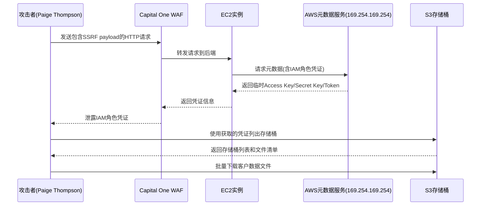
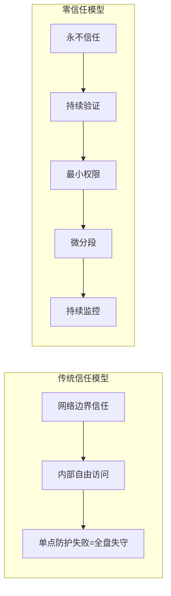

## 案例八：Capital One数据泄露（2019年）

2019年7月，美国第五大银行Capital One遭遇了一次灾难性的数据泄露事件，超过1.06亿客户和申请人的个人财务信息被窃取。这是美国金融行业历史上最大的数据泄露事件之一，也是首个因云基础设施配置缺陷导致的重大金融数据泄露案例。这起事件深刻揭示了云计算时代"共享责任模型"的实际困境——即使底层云平台（AWS）本身没有漏洞，客户的错误配置同样可以引发灾难性后果。

### 背景介绍

#### Capital One的企业概况

Capital One Financial Corporation是美国最大的银行控股公司之一，总部位于弗吉尼亚州麦克莱恩市。2019年事件发生时，该银行拥有以下关键数据：

| 指标 | 数据 |
|------|------|
| 受影响美国客户 | 约1亿人 |
| 受影响加拿大客户 | 约600万人 |
| 泄露的SSN数量 | 约14万个 |
| 泄露的银行账号数量 | 约8万个 |
| 申请人的信用评分/限额 | 数百万条记录 |
| 数据存储平台 | AWS S3 |
| 事件发现日期 | 2019年7月19日 |
| 泄露时间窗口 | 2019年3月12日 - 7月17日 |

#### 云优先战略的技术背景

Capital One是美国银行业最早全面拥抱公有云的金融机构之一。2016年，该银行宣布关闭所有传统数据中心，将核心业务系统迁移至Amazon Web Services (AWS)。这一决策使Capital One成为当时云迁移最激进的大型银行之一。

其云架构的核心组成：

- **计算层**：大量EC2实例承载Web应用和微服务
- **存储层**：S3存储桶存放客户数据、应用日志和配置文件
- **网络层**：通过WAF（Web Application Firewall）和VPC保护入站流量
- **身份层**：IAM角色为EC2实例提供访问其他AWS服务的权限
- **元数据服务**：EC2实例通过IMDSv1访问实例元数据，获取临时安全凭证

这一架构中隐藏着一个关键的安全设计缺陷：WAF配置允许了对AWS内部元数据服务的访问请求，而IAM角色被授予了远超业务需要的S3访问权限。

### 攻击过程深度还原

#### 第一阶段：信息收集与漏洞发现（2019年3月-6月）

攻击者Paige Thompson（网名"erratic"）是一名前AWS软件工程师。她对AWS平台的内部运作机制有深入了解，这使她能够识别出许多安全从业者忽视的攻击面。

Thompson的攻击并非始于对Capital One的定向攻击。她的初始方法是系统性地扫描部署在AWS上的企业Web应用防火墙配置：

1. **识别目标**：通过扫描GitHub上的公开代码库，寻找使用特定WAF软件的企业。Capital One使用的是一款基于开源ModSecurity的WAF产品。

2. **探测WAF行为**：Thompson向WAF发送精心构造的HTTP请求，测试WAF是否会将某些类型的请求转发到内部服务。

3. **发现SSRF入口**：她发现WAF的配置允许将特定格式的请求转发到后端服务器。通过在请求中嵌入对AWS元数据服务端点（`169.254.169.254`）的引用，WAF会代为发起请求。

#### 第二阶段：SSRF攻击与凭证获取

SSRF（Server-Side Request Forgery）攻击的核心原理是：让服务器端应用发起攻击者指定的HTTP请求，从而访问服务器可以访问但攻击者无法直接访问的内部资源。



SSRF攻击的具体实现：

```http
GET / HTTP/1.1
Host: [Capital One WAF Endpoint]
X-Forwarded-For: 169.254.169.254
[其他自定义头部]

POST /prod/cc/api/oauth2/token HTTP/1.1
Host: [Capital One WAF Endpoint]
Content-Type: application/x-www-form-urlencoded

[Payload that triggers SSRF to metadata endpoint]
```

通过这个SSRF漏洞，Thompson成功获取了以下信息：

1. **IAM角色名称**：WAF实例关联的IAM角色名称
2. **临时凭证**：AccessKeyId、SecretAccessKey、SessionToken
3. **权限范围**：该角色被授权访问的S3存储桶列表

这里暴露的第一个严重问题是**IAM角色权限过大**。WAF实例的IAM角色被授予了对存储客户数据的S3存储桶的完整读取权限，而实际上WAF只需要网络层面的访问权限，根本不需要S3访问权限。

#### 第三阶段：数据窃取（2019年3月-7月）

获取IAM凭证后，Thompson使用AWS CLI工具进行了大规模数据窃取：

```bash
# 配置获取的临时凭证
export AWS_ACCESS_KEY_ID="ASIA..."
export AWS_SECRET_ACCESS_KEY="..."
export AWS_SESSION_TOKEN="..."

# 列出可访问的S3存储桶
aws s3 ls

# 列出存储桶中的对象
aws s3 ls s3://[bucket-name]/ --recursive

# 批量下载数据（分批下载以避免触发速率限制）
aws s3 sync s3://[bucket-name]/ ./stolen-data/ --exclude "*.log"

# 特定文件下载
aws s3 cp s3://[bucket-name]/path/to/customer-data.csv ./customer-data.csv
```

Thompson在近四个月的时间里，从超过700个S3存储桶中下载了大量文件。泄露的数据包括：

| 数据类型 | 影响范围 | 敏感级别 |
|----------|----------|----------|
| 姓名、地址、邮编、电话 | 约1亿申请人 | 高 |
| 电子邮件地址、出生日期 | 约1亿申请人 | 高 |
| 自报收入 | 约1亿申请人 | 中 |
| 信用评分、信用限额、支付历史 | 约1亿申请人 | 高 |
| 社会安全号码（SSN） | 约14万客户 | 极高 |
| 银行账号 | 约8万客户 | 极高 |
| 信用卡号（部分） | 数百万条 | 极高 |

#### 第四阶段：攻击者暴露（2019年7月）

Thompson的暴露方式极具讽刺性——她并非被安全监控系统发现，而是因为自己的行为导致暴露：

1. **GitHub公开**：Thompson在GitHub上使用真实身份发布了一些与攻击相关的信息。
2. **Slack聊天**：她在Slack群组中向其他人展示了窃取的数据样本，并吹嘘自己的行为。
3. **外部举报**：一名看到GitHub信息的安全研究人员于7月17日向Capital One发送了警报邮件。
4. **内部确认**：Capital One安全团队在收到警报后的两天内确认了泄露事件。
5. **执法介入**：FBI于7月29日逮捕了Thompson。

### 安全思维深度分析

#### 一、云安全配置缺陷的系统性分析

这起事件并非单一配置错误导致，而是多个安全控制点同时失效的"瑞士奶酪模型"典型案例。

**缺陷1：WAF配置中的SSRF漏洞**

WAF本身作为安全设备，却成为攻击入口。Capital One的WAF配置存在以下问题：

- 允许了对内部IP地址段（169.254.169.254/16）的出站请求
- 未对WAF转发请求的目标地址进行白名单限制
- 未对请求头中的`X-Forwarded-For`等字段进行严格过滤
- 使用的WAF规则集未覆盖针对元数据服务的SSRF检测

正确的WAF配置应该包含以下规则：

```yaml
# 示例：防止SSRF的WAF规则配置（伪代码）
rules:
  - id: "block-metadata-access"
    description: "Block requests targeting AWS metadata service"
    match:
      any:
        - header: "X-Forwarded-For"
          contains: "169.254.169.254"
        - uri: "contains: /latest/meta-data"
        - body: "contains: 169.254.169.254"
    action: block
    response_code: 403

  - id: "block-internal-cidr"
    description: "Block SSRF to internal CIDR ranges"
    match:
      any:
        - header: "X-Forwarded-For"
          regex: "^(10\.|172\.(1[6-9]|2[0-9]|3[01])\.|192\.168\.|169\.254\.)"
    action: block
```

**缺陷2：IAM角色权限过大**

WAF实例关联的IAM角色策略过于宽松：

```json
// 实际使用的过度宽松策略（问题示例）
{
  "Version": "2012-10-17",
  "Statement": [
    {
      "Effect": "Allow",
      "Action": [
        "s3:GetObject",
        "s3:ListBucket",
        "s3:PutObject"
      ],
      "Resource": "*"
    }
  ]
}

// 应该使用的最小权限策略（正确示例）
{
  "Version": "2012-10-17",
  "Statement": [
    {
      "Effect": "Allow",
      "Action": [
        "logs:CreateLogGroup",
        "logs:CreateLogStream",
        "logs:PutLogEvents"
      ],
      "Resource": "arn:aws:logs:*:*:*"
    }
  ]
}
```

**缺陷3：缺乏S3存储桶级别的访问控制**

- S3存储桶策略未限制访问来源（基于VPC端点或IP）
- 未启用S3访问日志的实时监控
- 未对异常数据下载量设置告警阈值

#### 二、AWS元数据服务（IMDS）的安全演进

这起事件直接推动了AWS对元数据服务的安全升级。

**IMDSv1的工作原理与风险**

IMDSv1使用简单的HTTP GET请求获取元数据：

```bash
# IMDSv1：任何能在EC2实例上发起HTTP请求的进程都能获取凭证
curl http://169.254.169.254/latest/meta-data/iam/security-credentials/
curl http://169.254.169.254/latest/meta-data/iam/security-credentials/[role-name]
```

IMDSv1的致命缺陷：任何能够从EC2实例发起HTTP请求的应用程序（包括遭受SSRF攻击的应用）都可以获取该实例的临时安全凭证，无需任何额外认证。

**IMDSv2的安全改进**

IMDSv2引入了"会话令牌"机制，增加了安全层：

```bash
# IMDSv2：需要先获取会话令牌（PUT请求，有TTL限制）
TOKEN=$(curl -X PUT "http://169.254.169.254/latest/api/token" \
  -H "X-aws-ec2-metadata-token-ttl-seconds: 21600")

# 使用令牌获取元数据（需要在请求头中携带令牌）
curl -H "X-aws-ec2-metadata-token: $TOKEN" \
  http://169.254.169.254/latest/meta-data/iam/security-credentials/
```

IMDSv1与IMDSv2的对比：

| 特性 | IMDSv1 | IMDSv2 |
|------|--------|--------|
| 请求方法 | 仅GET | PUT获取令牌 + GET获取数据 |
| SSRF防护 | 无防护（GET请求可被SSRF利用） | 有效防护（PUT请求无法通过大多数SSRF途径发起） |
| 令牌机制 | 无 | 基于TTL的会话令牌 |
| 配置方式 | 默认启用 | 需显式启用 |
| 兼容性 | 兼容所有应用 | 需要应用支持自定义HTTP头 |

**迁移至IMDSv2的实操步骤**

```bash
# 1. 检查当前实例的IMDS配置
aws ec2 describe-instances --instance-ids i-1234567890abcdef0 \
  --query 'Reservations[].Instances[].MetadataOptions'

# 2. 设置IMDSv2为必需（阻止IMDSv1请求）
aws ec2 modify-instance-metadata-options \
  --instance-id i-1234567890abcdef0 \
  --http-tokens required \
  --http-put-response-hop-limit 1

# 3. 在启动模板中配置IMDSv2（新实例默认使用v2）
aws ec2 create-launch-template \
  --launch-template-name secure-template \
  --launch-template-data '{
    "MetadataOptions": {
      "HttpTokens": "required",
      "HttpPutResponseHopLimit": 1
    }
  }'

# 4. 验证应用兼容性（测试应用是否支持IMDSv2）
# 需要确保应用代码中的SDK版本支持IMDSv2
# AWS SDK版本要求：
#   - Java SDK >= 1.11.826
#   - Python boto3 >= 1.9.234
#   - Node.js SDK >= 2.521.0
```

#### 三、安全监控与事件响应的失败

Capital One的安全团队在多个监控层面存在盲区。

**失败点1：缺乏SSRF攻击检测**

WAF日志中本应记录所有对元数据服务的异常请求，但以下条件导致了告警缺失：

- 未将对`169.254.169.254`的请求标记为高风险
- WAF日志未被实时分析
- 缺乏基于行为模式的异常检测（正常流量不应包含对元数据服务的请求）

**失败点2：S3访问行为分析缺失**

- 未对单个IAM角色的S3 API调用频率设置基线
- 未对异常的`ListBucket`和`GetObject`调用量触发告警
- 未对跨多个存储桶的大量读取操作设置速率限制

**理想的监控告警规则示例：**

```yaml
# CloudWatch告警配置示例
alerts:
  - name: "SSRF Metadata Access Attempt"
    metric: "WAFBlockedRequests"
    filter:
      uri_pattern: "*169.254.169.254*"
    threshold: 1
    action: immediate_page

  - name: "Anomalous S3 Download Volume"
    metric: "S3GetObjectCount"
    filter:
      iam_role: "waf-role-*"
      time_window: "5 minutes"
    threshold: 100
    action: security_team_alert

  - name: "Cross-Bucket Enumeration"
    metric: "S3ListBucketCount"
    filter:
      iam_role: "waf-role-*"
      distinct_buckets: "> 3"
      time_window: "1 hour"
    threshold: 1
    action: security_team_alert
```

**失败点3：事件响应延迟**

从攻击开始到被发现，中间经过了约4个月（2019年3月至7月）。如果Capital One具备有效的异常检测机制，这个时间窗口可以缩短到数小时甚至数分钟。

### 法律后果与行业影响

#### 监管处罚

| 处罚方 | 处罚内容 | 金额 |
|--------|----------|------|
| 美国货币监理署（OCC） | 民事罚款（2020年8月） | 8000万美元 |
| 联邦贸易委员会（FTC） | 和解协议（2021年） | 未公开 |
| 多州检察长联合诉讼 | 集体诉讼和解 | 1.9亿美元 |

#### 行业标准变化

Capital One事件直接推动了以下安全标准的更新：

1. **AWS安全最佳实践更新**：AWS将IMDSv2设为推荐默认配置，并在控制台中增加了IMDS版本选择。
2. **PCI DSS云安全指南**：支付卡行业标准增加了针对云元数据服务的安全控制要求。
3. **金融监管指导**：OCC和联邦储备委员会发布了针对银行云服务使用的增强安全指导。
4. **SSRF防护成为标准测试项**：OWASP将SSRF提升为Web应用安全风险Top 10的独立类别（2021版）。

#### 对攻击者的审判结果

Paige Thompson于2022年6月被联邦陪审团裁定犯有电信欺诈罪和非法访问受保护计算机罪。2022年11月，她被判处五年缓刑和500美元罚款。这一相对较轻的判决引发了争议，但法官考虑到Thompson的心理健康状况（被诊断为自闭症和双相情感障碍）做出了这一裁决。

### 防御体系建设：从事件中提炼的最佳实践

#### 一、云环境SSRF防护体系

SSRF防护需要在多个层面实施：

```mermaid
graph TB
    subgraph 网络层防护
        A[网络ACL] -->|阻止对元数据服务的访问| B[安全组规则]
        B -->|限制出站流量目标| C[VPC端点策略]
    end

    subgraph 应用层防护
        D[WAF规则] -->|检测SSRF payload| E[输入验证]
        E -->|白名单允许的URL/域名| F[请求目标过滤]
    end

    subgraph 身份层防护
        G[IAM最小权限] -->|限制角色能力| H[权限边界]
        H -->|防止权限提升| I[SCPs]
    end

    subgraph 监控层防护
        J[实时日志分析] -->|异常检测| K[行为基线告警]
        K -->|即时响应| L[自动化阻断]
    end
```



**网络层SSRF防护配置：**

```bash
# 使用iptables阻止EC2实例直接访问元数据服务（作为额外防护层）
# 注意：不应完全阻止，因为合法应用可能需要元数据服务
# 应使用IMDSv2代替

# 通过VPC端点策略限制S3访问来源
aws ec2 create-vpc-endpoint \
  --vpc-id vpc-12345678 \
  --service-name com.amazonaws.us-east-1.s3 \
  --vpc-endpoint-type Gateway \
  --policy-document '{
    "Version": "2012-10-17",
    "Statement": [
      {
        "Effect": "Allow",
        "Principal": "*",
        "Action": "s3:*",
        "Resource": [
          "arn:aws:s3:::approved-bucket-1",
          "arn:aws:s3:::approved-bucket-1/*"
        ]
      }
    ]
  }'
```

#### 二、IAM权限治理框架

最小权限原则不应仅停留在口号层面，需要落地为可执行的治理流程：

```python
#!/usr/bin/env python3
"""
IAM角色权限审计脚本
检查所有IAM角色的实际使用情况与已授予权限的差异
"""

import boto3
from datetime import datetime, timedelta

def audit_iam_roles():
    iam = boto3.client('iam')
    cloudtrail = boto3.client('cloudtrail')

    roles = iam.list_roles()['Roles']

    for role in roles:
        role_name = role['RoleName']

        # 跳过AWS服务关联角色
        if role_name.startswith('AWSServiceRole'):
            continue

        # 获取角色附加的策略
        attached_policies = iam.list_attached_role_policies(RoleName=role_name)
        inline_policies = iam.list_role_policies(RoleName=role_name)

        # 获取过去90天的访问记录
        lookback = datetime.utcnow() - timedelta(days=90)

        try:
            last_used = iam.get_role(RoleName=role_name)['Role'].get('RoleLastUsed', {})
            last_used_date = last_used.get('LastUsedDate')
            last_used_region = last_used.get('Region')

            if last_used_date and last_used_date < lookback:
                print(f"[警告] 角色 {role_name} 已超过90天未使用")
                print(f"  最后使用: {last_used_date} (区域: {last_used_region})")
                print(f"  建议: 审查是否应删除此角色")
        except Exception as e:
            print(f"[错误] 无法获取角色 {role_name} 的使用信息: {e}")

        # 检查过度宽泛的权限
        for policy_arn in attached_policies['AttachedPolicies']:
            policy = iam.get_policy(PolicyArn=policy_arn['PolicyArn'])
            policy_doc = iam.get_policy_version(
                PolicyArn=policy_arn['PolicyArn'],
                VersionId=policy['Policy']['DefaultVersionId']
            )

            for stmt in policy_doc['PolicyVersion']['Document']['Statement']:
                actions = stmt.get('Action', [])
                resources = stmt.get('Resource', [])
                effect = stmt.get('Effect', 'Allow')

                if effect == 'Allow':
                    if '*' in resources and '*' in actions:
                        print(f"[严重] 角色 {role_name} 拥有完全管理员权限")
                    elif '*' in resources:
                        print(f"[警告] 角色 {role_name} 对所有资源拥有 {actions} 权限")

if __name__ == '__main__':
    audit_iam_roles()
```

#### 三、数据访问异常检测系统

```python
#!/usr/bin/env python3
"""
S3访问行为基线与异常检测
基于CloudTrail日志分析异常的S3访问模式
"""

import boto3
from datetime import datetime, timedelta
from collections import defaultdict

class S3AccessMonitor:
    def __init__(self, region='us-east-1'):
        self.cloudtrail = boto3.client('cloudtrail', region_name=region)
        self.cloudwatch = boto3.client('cloudwatch', region_name=region)

        # 行为基线阈值
        self.thresholds = {
            'GetObject': {
                'max_per_minute': 50,
                'max_per_hour': 500,
                'max_distinct_keys_per_hour': 200
            },
            'ListBucket': {
                'max_per_hour': 10
            }
        }

    def get_access_logs(self, hours_back=24):
        """获取指定时间范围内的S3访问日志"""
        end_time = datetime.utcnow()
        start_time = end_time - timedelta(hours=hours_back)

        events = []
        paginator = self.cloudtrail.get_paginator('lookup_events')

        for page in paginator.paginate(
            LookupAttributes=[
                {
                    'AttributeKey': 'EventSource',
                    'AttributeValue': 's3.amazonaws.com'
                }
            ],
            StartTime=start_time,
            EndTime=end_time
        ):
            events.extend(page['Events'])

        return events

    def analyze_patterns(self, events):
        """分析访问模式，识别异常"""
        alerts = []

        # 按IAM角色和操作类型统计
        role_action_counts = defaultdict(lambda: defaultdict(int))
        role_bucket_access = defaultdict(set)
        role_key_access = defaultdict(set)

        for event in events:
            event_name = event['EventName']
            user_identity = event.get('Username', 'unknown')
            resources = event.get('Resources', [])

            for resource in resources:
                if resource.get('ResourceType') == 'AWS::S3::Bucket':
                    role_bucket_access[user_identity].add(resource['ResourceName'])

            role_action_counts[user_identity][event_name] += 1

        # 检测异常
        for role, actions in role_action_counts.items():
            for action, count in actions.items():
                if action in self.thresholds:
                    threshold = self.thresholds[action].get('max_per_hour', float('inf'))
                    if count > threshold:
                        alerts.append({
                            'severity': 'HIGH',
                            'type': 'ANOMALOUS_S3_ACCESS',
                            'role': role,
                            'action': action,
                            'count': count,
                            'threshold': threshold
                        })

        # 检测跨桶枚举
        for role, buckets in role_bucket_access.items():
            if len(buckets) > 5:
                alerts.append({
                    'severity': 'CRITICAL',
                    'type': 'CROSS_BUCKET_ENUMERATION',
                    'role': role,
                    'bucket_count': len(buckets),
                    'buckets': list(buckets)[:10]
                })

        return alerts

if __name__ == '__main__':
    monitor = S3AccessMonitor()
    events = monitor.get_access_logs(hours_back=1)
    alerts = monitor.analyze_patterns(events)

    for alert in alerts:
        print(f"[{alert['severity']}] {alert['type']}: {alert}")
```

### 常见误区与纠正

#### 误区一：云服务提供商会保护一切

**误区**：迁移到AWS/Azure/GCP等公有云后，安全责任完全由云服务商承担。

**纠正**：云计算遵循"共享责任模型"（Shared Responsibility Model）。云服务商负责"云的安全"（Security of the Cloud），即基础设施、物理安全、虚拟化层安全。客户负责"在云中的安全"（Security in the Cloud），即操作系统、应用、数据、网络配置、身份与访问管理。Capital One事件正是在"在云中的安全"层面失败。

#### 误区二：WAF是万能的防护

**误区**：部署了WAF就等于防御了所有Web攻击。

**纠正**：WAF只能防御已知攻击模式和规则覆盖的攻击。未经正确配置的WAF甚至可能成为攻击入口。WAF需要持续更新规则、配合其他安全控制（如输入验证、最小权限、网络分段）才能发挥作用。

#### 误区三：内部IP地址是安全的

**误区**：169.254.169.254、10.0.0.0/8等内部IP地址段对外部不可达，因此是安全的。

**纠正**：SSRF攻击的本质就是利用应用服务器作为代理访问内部地址。任何接受用户输入URL或地址的应用都可能成为SSRF的入口。内部地址的"安全性"不应依赖于网络可达性，而应通过应用层验证和网络层策略共同保障。

#### 误区四：安全监控等同于日志收集

**误区**：只要收集了足够的日志，安全事件就能被发现。

**纠正**：日志收集只是第一步。Capital One拥有大量日志，但缺乏有效的实时分析和告警机制。安全监控需要包含以下完整闭环：

1. 日志收集 → 2. 实时分析 → 3. 行为基线 → 4. 异常检测 → 5. 自动告警 → 6. 人工调查 → 7. 响应处置 → 8. 规则优化

缺少任何一个环节都会导致监控体系失效。

### 进阶思考：云原生安全架构设计

Capital One事件促使安全架构师重新思考云环境下的安全设计原则：

#### 零信任在云环境的应用



零信任原则在云环境中的具体实施：

1. **身份为新边界**：不再依赖网络位置判断信任，每个API调用都需要验证身份和权限。
2. **最小权限动态授权**：权限不是静态分配，而是根据上下文（时间、位置、设备、行为）动态调整。
3. **持续验证与监控**：每次访问都需要验证，每次会话都受到监控。
4. **自动化策略执行**：使用策略即代码（Policy as Code）确保安全配置的一致性。

#### Infrastructure as Code（IaC）安全扫描

将安全检查嵌入到基础设施部署流程中：

```yaml
# 示例：使用Checkov进行Terraform代码安全扫描
# .github/workflows/terraform-security.yml
name: Terraform Security Scan
on:
  pull_request:
    paths:
      - 'terraform/**'

jobs:
  security-scan:
    runs-on: ubuntu-latest
    steps:
      - uses: actions/checkout@v3

      - name: Run Checkov
        uses: bridgecrewio/checkov-action@v12
        with:
          directory: terraform/
          framework: terraform
          # 检查项包括：
          # - IAM角色权限是否过大
          # - S3存储桶是否公开可访问
          # - EC2实例是否启用了IMDSv2
          # - WAF规则是否覆盖SSRF防护
          soft_fail: false
```

### 总结：Capital One事件的安全思维启示

Capital One数据泄露事件是云计算时代安全思维转变的分水岭事件。它揭示了以下核心安全思维原则：

1. **共享责任不是推卸责任**：云服务商和客户各自承担安全责任。客户必须主动管理自己控制的安全层面，包括IAM配置、应用安全、数据保护和监控告警。

2. **最小权限是底线而非理想**：IAM角色的权限应该严格限制在业务所需范围内。过度宽松的权限是这起事件的根本原因之一。

3. **SSRF是云环境中的系统性风险**：任何接受外部输入并发起HTTP请求的Web应用都可能成为SSRF的入口。防御SSRF需要在应用层、网络层、身份层和监控层同时建立防线。

4. **安全监控必须实时且智能**：仅收集日志不等于有效监控。需要建立基于行为基线的异常检测机制，并确保告警能够及时传达给安全团队。

5. **前员工的知识是双刃剑**：Thompson的AWS内部知识使她能够发现普通攻击者可能忽略的漏洞。企业需要对前员工的账户和访问权限进行彻底清理，并对内部安全架构进行定期外部审计。

6. **技术防线需要组织能力支撑**：即使拥有完善的技术控制，如果缺乏安全文化、响应流程和持续改进机制，技术防线也会在关键时刻失效。

这起事件最终促使整个云计算行业重新审视安全配置的默认值、监控体系的有效性，以及共享责任模型的实际落地方式。对于安全从业者而言，Capital One事件是一个经典的教学案例——它展示了当多个安全控制点同时失效时，即使是技术领先的企业也可能遭受灾难性打击。
