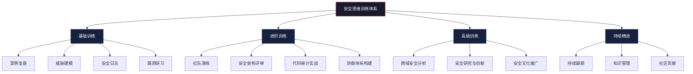
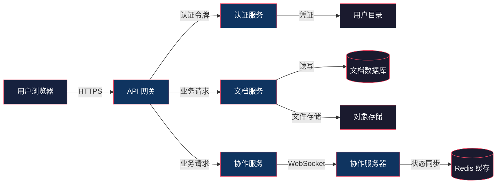
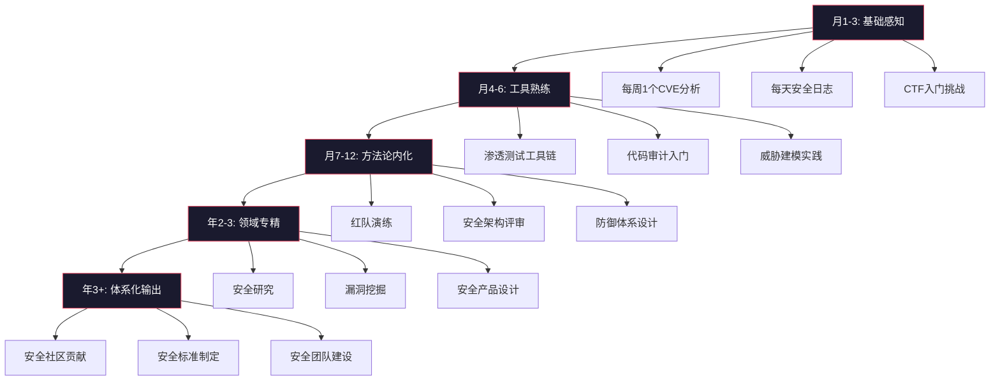

## 安全思维训练实践

前面的案例分析和综合总结提供了安全思维的理论框架和真实世界的印证，但安全思维本质上是一种**实践性能力**——它不能仅靠阅读获得，必须通过刻意练习才能内化为直觉。本节提供一套系统的训练体系，将前面章节中归纳的不信任原则、数据流追踪、假设最坏情况、纵深防御、持续监控、从失败中学习六大核心模式，转化为可执行的日常训练计划。

### 为什么需要系统化的训练

安全思维与骑自行车、弹钢琴一样，属于**程序性知识**——它的核心不是"知道什么"，而是"遇到情况时本能地做出正确反应"。认知心理学将技能习得分为三个阶段：

| 阶段 | 特征 | 安全思维中的表现 |
|------|------|-----------------|
| 认知阶段 | 刻意遵循规则，速度慢，容易出错 | 需要逐条检查 STRIDE 清单，容易遗漏 |
| 联结阶段 | 规则开始自动化，错误减少 | 能快速识别常见攻击模式，偶尔需要回溯 |
| 自动化阶段 | 直觉反应，几乎不需要刻意思考 | 看到代码/架构立即感知"哪里不对劲" |

大多数人停留在认知阶段，因为他们只读不练。以下训练体系的目标是帮助你从认知阶段推进到联结阶段，最终接近自动化阶段。

### 训练体系总览



---

## 一、基础训练：建立安全思维的感知基线

基础训练的目标是培养对安全问题的**敏感度**。就像医生通过大量病例积累诊断直觉，安全从业者需要通过大量案例分析来建立对攻击模式的识别能力。

### 1.1 练习一：案例复盘——从事件中提取思维模型

案例复盘不是读新闻，而是一种**结构化的逆向工程**：从结果倒推原因，从原因提炼模式。

#### 复盘五步法

以 Colonial Pipeline 勒索软件攻击（2021年）为例，演示完整的复盘流程：

**第一步：事件重建——还原时间线**

```text
2021-05-07  05:00  DarkSide 勒索软件激活，加密 Colonial Pipeline IT 系统
2021-05-07  06:00  运营团队发现异常，决定关闭 OT 网络（预防性）
2021-05-07  09:00  管道运输全面停止
2021-05-07  ~11:00 公司向 FBI 报告事件
2021-05-08  全天   美国东海岸出现燃油恐慌性抢购
2021-05-09  全天   政府宣布 17 个州进入紧急状态
2021-05-13  全天   DarkSide 声称其基础设施被"未知方"破坏
2021-05-13  下午   Colonial Pipeline 恢复运营
```

> **训练要点**：时间线是复盘的骨架。每一分钟的决策延迟都可能意味着数百万美元的损失。注意"06:00 关闭 OT 网络"这个决策——它是正确的预防性措施还是过度反应？这就是安全思维的核心：在信息不完整时做出合理的风险权衡。

**第二步：攻击链分析——映射 MITRE ATT&CK**

将攻击过程映射到 MITRE ATT&CK 框架：

| 攻击阶段 | 具体技术 | ATT&CK ID | 关键细节 |
|----------|----------|-----------|---------|
| 初始访问 | 通过泄露的 VPN 凭证访问 | T1078（有效账户） | 密码泄露与之前的凭证数据库泄露有关 |
| 持久化 | 在多台服务器部署后门 | T1053（计划任务） | 确保即使凭证被重置也能维持访问 |
| 发现 | 内网扫描，识别关键系统 | T1046（网络服务扫描） | 攻击者花了数天在内网中侦察 |
| 横向移动 | 使用合法的管理工具 | T1021（远程服务） | 滥用 PsExec 等合法工具 |
| 影响 | 部署 DarkSide 勒索软件 | T1486（数据加密勒索） | 同时加密 100+ 服务器 |

> **训练要点**：不要只看"发生了什么"，要问"攻击者为什么选择这条路径"。DarkSide 使用合法管理工具横向移动，是因为他们清楚地知道——使用合法工具比自研工具更难被检测。这就是第二章提到的"假设最坏情况"的实战体现。

**第三步：防御分析——评估响应有效性**

```text
防御环节              有效性评估         改进建议
─────────────────────────────────────────────────────
入侵检测(IDS/EDR)    ❌ 失败           部署行为分析引擎，检测异常的管理工具使用模式
网络分段              ⚠️ 部分失败        IT/OT 存在隐性连接路径，需要物理级隔离
日志审计              ❌ 失败           SIEM 规则未覆盖 VPN 异常登录告警
事件响应              ⚠️ 部分成功        响应速度可以，但决策依赖个人判断缺乏预案
备份恢复              ⚠️ 部分成功        存在备份但恢复测试不充分
```

**第四步：思维模型提取——从个案到通用模式**

复盘的最终目的是从这个具体案例中提取可复用的思维模型：

- **供应链依赖风险**：一个 VPN 凭证泄露导致整个管道停运，说明关键基础设施的单点故障风险极高
- **OT/IT 融合风险**：IT 系统被攻破后，出于谨慎关闭 OT，说明即使 OT 未被直接攻击，IT 入侵也能间接瘫痪 OT
- **连锁反应思维**：管道停运 → 燃油短缺 → 恐慌抢购 → 宣布紧急状态，一个技术事件引发社会危机

**第五步：改进建议与行动项**

```text
┌─────────────────────────────────────────────────────┐
│ 改进项           │ 责任方    │ 优先级  │ 预期效果      │
├─────────────────────────────────────────────────────┤
│ 部署 MFA         │ IT 部门   │ P0     │ 消除凭证泄露  │
│ 强化网络分段     │ 安全团队  │ P0     │ 限制横向移动  │
│ VPN 日志告警     │ SOC       │ P1     │ 早期发现入侵  │
│ 定期恢复演练     │ 运维      │ P1     │ 确保备份可用  │
│ 事件响应预演     │ 安全团队  │ P2     │ 缩短响应时间  │
└─────────────────────────────────────────────────────┘
```

#### 推荐复盘的案例清单

按难度递进排列，建议每周至少完成一个完整复盘：

**入门级（单一漏洞导致的事件）**：
- Heartbleed（CVE-2014-0160）：理解内存安全漏洞的影响范围
- Log4Shell（CVE-2021-44228）：理解组件级漏洞的连锁效应
- Twitter 比特币诈骗（2020）：理解社会工程学的威力

**进阶级（多步骤攻击链）**：
- SolarWinds 供应链攻击：理解供应链攻击的检测难度
- Equifax 数据泄露（2017）：理解补丁管理的延迟风险
- Capital One 数据泄露（2019）：理解云环境中的配置风险

**高级（国家级攻击 / 复杂攻击链）**：
- NotPetya 攻击（2017）：理解混合型攻击（勒索 + 破坏）的意图分析
- Colonial Pipeline：理解关键基础设施攻击的社会影响
- Stuxnet：理解物理世界攻击的工程复杂度

#### 复盘报告模板

每次复盘结束后，按以下模板输出一份 500-800 字的报告：

```markdown
# [事件名称] 复盘报告

## 基本信息
- 事件时间：
- 影响范围：
- 损失估计：

## 攻击链摘要（一句话）
[用一句话概括攻击的核心路径]

## 关键决策点
列出事件中的 2-3 个关键决策节点，分析当时的可选方案

## 最大教训
[提取一条最重要的、可推广的安全思维原则]

## 我的行动项
[基于这个案例，我需要在自己的工作中检查/改进什么]
```

---

### 1.2 练习二：威胁建模——在设计阶段消灭漏洞

威胁建模是安全思维最核心的实践。它要求你在系统**设计阶段**就假设它已经被攻击者盯上了，然后系统性地找出所有可能的攻击路径。

#### 完整的威胁建模流程

以一个"在线文档编辑系统"（类似腾讯文档）为例：

**第一步：绘制数据流图（DFD）**



**第二步：识别信任边界**

| 信任边界 | 边界类型 | 两侧的差异 |
|----------|----------|-----------|
| 用户浏览器 ↔ API 网关 | 网络边界 | 不可信的外部网络 → 可控的内部网络 |
| API 网档 ↔ 文档服务 | 内部服务边界 | 经过认证的请求 → 需要进一步授权校验 |
| 文档服务 ↔ 文档数据库 | 存储边界 | 应用层逻辑 → 底层数据存储 |
| 文档服务 ↔ 对象存储 | 存储边界 | 结构化数据 → 非结构化文件 |
| 协作服务 ↔ Redis 缓存 | 内部服务边界 | 业务逻辑 → 共享状态存储 |

**第三步：STRIDE 逐组件分析**

以"API 网关"组件为例，完整应用 STRIDE 模型：

| 威胁类型 | 具体威胁 | 可能的攻击场景 | 缓解措施 |
|----------|---------|---------------|---------|
| **S**poofing（假冒） | 攻击者伪造用户身份 | 窃取 JWT 令牌后冒充用户调用 API | 短时效令牌 + 令牌绑定 + 异常行为检测 |
| **T**ampering（篡改） | 篡改请求参数 | 修改文档 ID 访问他人文档 | 服务端权限校验 + 请求签名 |
| **R**epudiation（抵赖） | 用户否认执行过操作 | "我没有删除那个文档" | 全链路审计日志 + 操作签名 |
| **I**nformation Disclosure（信息泄露） | 错误信息暴露内部细节 | API 返回详细的数据库错误堆栈 | 统一错误格式 + 日志脱敏 |
| **D**enial of Service（拒绝服务） | 大量请求耗尽资源 | 并发创建大文档导致服务不可用 | 速率限制 + 资源配额 + 自动扩缩容 |
| **E**levation of Privilege（权限提升） | 普通用户获取管理员权限 | 通过 API 参数注入提升角色 | RBAC + 输入验证 + 最小权限原则 |

> **训练要点**：每个 STRIDE 威胁类型都必须思考，即使你觉得某个组件"看起来很安全"。安全思维的核心就是——信任是需要证明的，而不是默认赋予的。

**第四步：攻击树分析**

针对最严重的信息泄露威胁，构建攻击树：

```text
目标：获取其他用户的文档内容
├── 路径1：身份认证绕过
│   ├── 1.1 暴力破解弱密码
│   ├── 1.2 凭证填充攻击
│   └── 1.3 JWT 令牌伪造/重放
├── 路径2：权限校验绕过
│   ├── 2.1 IDOR（不安全的直接对象引用）
│   ├── 2.2 水平越权（访问同级用户的文档）
│   └── 2.3 垂直越权（以管理员身份访问）
├── 路径3：数据泄露
│   ├── 3.1 数据库未授权访问
│   ├── 3.2 对象存储桶公开访问
│   └── 3.3 日志中包含文档内容
└── 路径4：客户端攻击
    ├── 4.1 XSS 窃取文档内容
    ├── 4.2 中间人攻击
    └── 4.3 恶意浏览器扩展
```

**第五步：风险评估与优先级**

使用 DREAD 模型对每个攻击路径进行评分：

| 攻击路径 | D(amage) | R(eproducibility) | E(xploitability) | A(affected Users) | D(iscoverability) | 总分 | 优先级 |
|----------|----------|-------------------|-------------------|-------------------|-------------------|------|--------|
| IDOR 越权 | 9 | 9 | 8 | 10 | 7 | 43 | P0 |
| JWT 重放 | 9 | 7 | 6 | 10 | 5 | 37 | P0 |
| 数据库泄露 | 10 | 8 | 4 | 10 | 3 | 35 | P1 |
| XSS 窃取 | 8 | 8 | 7 | 8 | 6 | 37 | P0 |
| 存储桶公开 | 10 | 10 | 5 | 10 | 4 | 39 | P0 |

> **训练要点**：DREAD 评分不是数学精确值，它的价值在于强迫你**量化思考**，而不是凭感觉说"这个很重要"。即使两个人对同一个威胁给出不同的分数，讨论分数差异本身就能暴露思维盲区。

#### 威胁建模练习清单

选择你熟悉的系统进行建模练习，由易到难：

| 难度 | 目标系统 | 重点训练能力 |
|------|---------|------------|
| 入门 | 个人博客系统 | 基础 DFD 绘制、STRIDE 应用 |
| 入门 | 文件分享工具 | 信任边界识别、权限分析 |
| 中等 | 即时通讯系统 | 实时通信安全、端到端加密分析 |
| 中等 | 电商平台 | 支付安全、供应链风险 |
| 高级 | 微服务电商系统 | 服务网格安全、零信任架构 |
| 高级 | 云原生 CI/CD 流水线 | 供应链安全、密钥管理 |

---

### 1.3 练习三：安全日志——建立持续反思的习惯

安全日志是**个人版的安全运营中心（SOC）**。它不是简单的学习笔记，而是一种结构化的反思工具。

#### 日志模板

```markdown
# 安全日志 - YYYY-MM-DD

## 今日安全观察
[今天看到/听到/遇到的安全相关事物]

## 攻击者视角
[如果我是攻击者，我会怎么利用今天看到的这个系统/功能/漏洞？]

## 防御者视角
[如果我是防御者，我怎么检测/阻止这种攻击？]

## 盲点发现
[今天我意识到自己对哪个安全领域了解不足？]

## 连接与类比
[今天的观察与之前学过的哪个知识点有关联？]
```

#### 日志的价值

很多人觉得写日志浪费时间，但它的核心价值在于**强制输出**。阅读是被动输入，只有当你尝试用文字表达时，才能发现自己是否真正理解了某个概念。认知心理学研究表明，**检索练习**（retrieval practice）比重复阅读的记忆效果高出 50% 以上。

建议每天花 15-20 分钟记录，重点不是写多少字，而是**触发"攻击者/防御者"双视角切换**。

---

### 1.4 练习四：漏洞研习——从 CVE 中学习攻击模式

#### CVE 分析框架

每周深入分析一个 CVE，按以下框架展开：

```text
CVE 编号：CVE-XXXX-XXXXX
漏洞类型：[分类]
影响组件：[组件名称及版本]

## 漏洞根因
[根本原因是什么？是设计缺陷还是实现缺陷？]

## 攻击路径
[从攻击者视角描述完整利用流程]

## 影响分析
[机密性/完整性/可用性分别受到什么影响？]

## 修复方案
[厂商的修复方案是什么？是否有临时缓解措施？]

## 通用教训
[这个漏洞暴露了什么通用的安全设计/实现原则？]

## 类似漏洞
[历史上有哪些类似根因的漏洞？]
```

#### 推荐分析的 CVE 列表

| CVE | 核心教训 |
|-----|---------|
| CVE-2014-0160 (Heartbleed) | 内存越界读取 → 不信任输入长度 |
| CVE-2017-0144 (EternalBlue) | 协议解析漏洞 → 不信任网络协议数据 |
| CVE-2017-5638 (Struts2) | OGNL 注入 → 不信任任何表达式引擎输入 |
| CVE-2018-8174 (VBScript) | UAF → 类型混淆的破坏力 |
| CVE-2019-0708 (BlueKeep) | RDP 协议漏洞 → 远程桌面攻击面 |
| CVE-2020-0688 (Exchange) | 硬编码密钥 → 密钥管理失败 |
| CVE-2021-34527 (PrintNightmare) | 打印服务权限 → 特权提升路径 |
| CVE-2021-44228 (Log4Shell) | JNDI 注入 → 组件级输入处理 |
| CVE-2023-23397 (Outlook) | NTLM 哈希泄露 → 认证协议设计缺陷 |
| CVE-2024-3094 (XZ Utils) | 开源供应链 → 信任链的脆弱性 |

---

## 二、进阶训练：在模拟实战中磨砺技能

基础训练建立感知，进阶训练的目标是**在有对抗性的环境中验证和强化安全思维**。

### 2.1 练习五：红队演练——以攻击者视角审视系统

#### 渗透测试五阶段实操

以下流程基于 PTES（Penetration Testing Execution Standard）方法论：

**阶段一：信息收集（占比 40-60% 的时间）**

信息收集是渗透测试中最重要的阶段，也是安全思维最直接的锻炼。它要求你像攻击者一样**耐心、系统地**拼凑目标画像。

```bash
# 被动信息收集（不直接接触目标）
# 子域名枚举
subfinder -d target.com -o subdomains.txt
amass enum -passive -d target.com >> subdomains.txt

# 技术栈指纹识别
whatweb https://target.com
wappalyzer target.com  # 浏览器插件

# 历史信息泄露
# GitHub 搜索敏感信息
site:github.com "target.com" password
site:github.com "target.com" api_key

# 主动信息收集（直接探测目标）
# 端口扫描
nmap -sV -sC -oA nmap_scan target.com

# 目录枚举
gobuster dir -u https://target.com -w /usr/share/wordlists/dirb/common.txt

# 子域名 HTTP 探活
httpx -l subdomains.txt -o alive_subdomains.txt
```

> **训练要点**：信息收集阶段培养的是**全局视野**和**耐心**。初学者常犯的错误是急于扫描漏洞，忽略了被动信息的价值。一个泄露在 GitHub 上的 API Key，比任何高危漏洞都更容易利用。

**阶段二：漏洞发现与分析**

```bash
# 自动化扫描
nuclei -l alive_subdomains.txt -t cves/ -o vuln_results.txt
nikto -h https://target.com

# 手动测试（重点关注自动化工具无法覆盖的逻辑漏洞）
# 认证绕过测试
# - 默认凭证
# - 密码重置逻辑缺陷
# - OAuth 回调 URL 篡改
# 授权绕过测试
# - IDOR（修改 API 中的资源 ID）
# - 垂直越权（普通用户访问管理功能）
# 输入验证测试
# - XSS（反射型、存储型、DOM 型）
# - SQL 注入（联合查询、布尔盲注、时间盲注）
# - SSTI（服务端模板注入）
# - 命令注入
```

**阶段三：漏洞利用与后渗透**

```bash
# 获取初始访问后
# 信息收集（内网）
whoami /all                    # Windows 用户和权限
cat /etc/passwd                # Linux 用户列表
ipconfig /all                  # 网络接口
netstat -ano                   # 网络连接
tasklist                       # 运行中的进程

# 权限提升检查
# Linux
# - SUID 二进制文件
# - 定时任务写权限
# - 内核版本漏洞
# Windows
# - 未加引号的服务路径
# - DLL 劫持
# - AlwaysInstallElevated

# 横向移动
# - Pass-the-Hash
# - Kerberoasting
# - 利用共享凭证
```

> **训练要点**：后渗透阶段训练的是**系统性思维**——你需要在复杂环境中快速建立对目标的理解，识别关键资产和攻击路径。这与第二章提到的"系统分解法"和"攻击面枚举法"直接对应。

**阶段四：报告撰写**

渗透测试报告是红队工作的最终产出，也是训练"换位思考"能力的关键：

```markdown
# 渗透测试报告

## 1. 执行摘要
[面向管理层：发现了什么、影响有多大、紧急程度如何]

## 2. 技术发现
### 2.1 高危：XXX API 端点 IDOR 漏洞
- 描述：[技术描述]
- 复现步骤：[详细的、可复现的步骤]
- 影响范围：[受影响的用户/数据/系统]
- 风险等级：高危（CVSS 8.6）
- 修复建议：[具体的、可执行的修复方案]

### 2.2 中危：...

## 3. 攻击路径图
[完整的攻击链可视化]

## 4. 建议优先级矩阵
[按紧急程度和影响范围排序的修复建议]
```

#### 个人红队练习环境

| 平台 | 难度 | 特色 | 费用 |
|------|------|------|------|
| TryHackMe | 入门-中级 | 引导式学习路径，新手友好 | 免费/付费 |
| Hack The Box | 中级-高级 | 真实靶机，社区活跃 | 免费/付费 |
| VulnHub | 中级 | 可下载虚拟机，离线练习 | 免费 |
| PentesterLab | 入门-中级 | Web 安全专项 | 付费 |
| PortSwigger Web Academy | 入门-高级 | Burp Suite 官方教程 | 免费 |
| DVWA / WebGoat / Juice Shop | 入门 | 本地部署，完全可控 | 免费 |

---

### 2.2 练习六：安全架构评审——用清单和原则检验设计

安全架构评审是将安全思维**系统化应用到工程实践**的关键能力。它要求你同时具备攻击者的视角和架构师的视野。

#### 架构评审检查清单

**认证与授权**

```markdown
- [ ] 是否实现了多因素认证（MFA）？
- [ ] 密码策略是否满足最小强度要求（长度≥12，包含字符类别）？
- [ ] 会话管理是否安全（Token 过期时间、刷新机制、注销清除）？
- [ ] 授权模型是否遵循最小权限原则？
- [ ] 是否存在权限提升路径（水平越权/垂直越权）？
- [ ] API 是否使用了标准的认证框架（OAuth 2.0 / JWT）？
- [ ] JWT 的算法是否为 RS256（避免 HS256 公钥混淆攻击）？
```

**数据保护**

```markdown
- [ ] 敏感数据是否在传输中加密（TLS 1.2+）？
- [ ] 敏感数据是否在存储中加密（AES-256-GCM）？
- [ ] 数据库连接字符串是否使用了密钥管理服务？
- [ ] 日志中是否包含敏感信息（密码、Token、身份证号）？
- [ ] 数据备份是否加密？
- [ ] 数据销毁流程是否可靠（不是简单删除）？
```

**网络安全**

```markdown
- [ ] 是否实施了网络分段（DMZ、内网、管理网分离）？
- [ ] 防火墙规则是否遵循默认拒绝原则？
- [ ] 是否有入侵检测/防御系统（IDS/IPS）？
- [ ] 内部服务是否通过服务网格/零信任架构进行通信？
- [ ] 外部访问是否有速率限制和 DDoS 防护？
```

**应用安全**

```markdown
- [ ] 输入验证是否在服务端执行（不信任客户端）？
- [ ] 输出编码是否正确（防 XSS）？
- [ ] SQL 查询是否使用参数化语句（防 SQL 注入）？
- [ ] 文件上传是否有限制（类型、大小、存储位置）？
- [ ] 错误处理是否不泄露内部信息？
- [ ] 依赖组件是否有已知漏洞（SCA 扫描）？
```

**运维安全**

```markdown
- [ ] CI/CD 流水线是否有安全扫描（SAST/DAST/SCA）？
- [ ] 生产环境是否有多人审批的部署流程？
- [ ] 基础设施是否使用 IaC（基础设施即代码）管理？
- [ ] 密钥和凭证是否使用密钥管理服务（Vault/AWS Secrets Manager）？
- [ ] 是否有安全监控和告警（SIEM）？
- [ ] 事件响应计划是否经过演练？
- [ ] 备份和恢复流程是否经过验证？
```

#### 评审发现的记录格式

每个发现项按以下格式记录：

```text
发现编号：SA-001
严重程度：高危
标题：API 网关缺少请求速率限制
位置：api-gateway/配置文件
描述：API 网关未对单个客户端的请求频率进行限制，
      攻击者可通过暴力枚举凭证或发送大量请求导致服务降级。
影响：凭证暴力破解、API 滥用、服务可用性
修复建议：
  1. 实施基于 IP 的速率限制（如 100 次/分钟）
  2. 对敏感端点（登录、密码重置）实施更严格的限制
  3. 添加基于用户身份的配额管理
  4. 部署 WAF 规则拦截自动化攻击
参考资料：OWASP API Security Top 10 - API4:2023
```

---

### 2.3 练习七：防御体系构建——从攻击者到防御者的视角转换

安全思维的完整闭环不只是"找到漏洞"，而是"构建可靠的防御"。

#### 纵深防御实操

针对常见攻击向量，设计至少三层防御：

```text
攻击向量：SQL 注入
  第一层（预防）：参数化查询 / ORM
  第二层（检测）：WAF 规则 + SQL 注入特征检测
  第三层（缓解）：数据库账户最小权限（只读/只写分离）
  第四层（响应）：SQL 查询日志审计 + 异常查询告警

攻击向量：凭证泄露
  第一层（预防）：强制 MFA
  第二层（检测）：异常登录检测（IP/设备/时间）
  第三层（缓解）：短时效 Token + 令牌绑定
  第四层（响应）：自动会话撤销 + 用户通知

攻击向量：供应链攻击
  第一层（预防）：依赖锁定（lock file）+ 镜像仓库
  第二层（检测）：SCA 扫描 + SBOM（软件物料清单）
  第三层（缓解）：构建时隔离 + 最小化运行时依赖
  第四层（响应）：快速回滚能力 + 紧急补丁流程
```

> **训练要点**：纵深防御不是"堆叠安全产品"，而是确保每一层防御**假设其他层已经被突破**。这个思维转换是安全从业者最重要的能力之一。

---

## 三、高级训练：跨越技术边界的系统性安全思维

高级训练面向有 2-3 年安全经验的从业者，目标是培养**跨领域、跨层级的系统性安全思维**。

### 3.1 练习八：跨域安全分析

安全问题不会停留在一个技术域内。一个完整的安全事件可能同时涉及 Web 应用、移动客户端、云基础设施、CI/CD 流水线和人员。

#### 跨域分析框架

选择一个实际场景，分析所有可能的安全影响域：

```text
场景：公司内部使用 GitLab 进行代码管理和 CI/CD

影响域分析：
┌─────────────────────────────────────────────────┐
│ 域           │ 攻击面           │ 潜在影响        │
├─────────────────────────────────────────────────┤
│ Web 应用     │ XSS、CSRF、SSRF   │ 会话劫持、数据泄露│
│ 认证系统     │ SAML/OAuth 缺陷   │ 全面未授权访问   │
│ CI/CD 流水线 │ 恶意 .gitlab-ci   │ 代码篡改、后门注入│
│ Runner 环境 │ 容器逃逸          │ 宿主机控制       │
│ 密钥管理     │ CI 变量泄露       │ 云账户接管       │
│ 人员         │ 钓鱼+社会工程     │ 管理员凭证泄露   │
│ 供应链       │ 恶意依赖引入      │ 运行时后门       │
└─────────────────────────────────────────────────┘
```

### 3.2 练习九：安全研究与创新

安全思维的最高层次是**发现新的攻击模式**，而不是重复已知的攻击。

#### 安全研究路径

1. **选择一个你深入理解的技术领域**（如浏览器引擎、数据库、容器运行时）
2. **阅读该领域的安全历史**（已知漏洞、攻击手法演变）
3. **分析最新的代码变更**（关注安全相关的提交和修复）
4. **尝试复现已知漏洞**（在本地环境中重现 CVE）
5. **在复现基础上探索变体**（同一个类别的其他组件是否有类似问题）
6. **撰写安全分析报告**（即使没有发现新漏洞，分析过程本身也有价值）

> **训练要点**：安全研究的核心技能不是"使用工具"，而是**理解系统的工作原理**。只有深入理解了一个系统，才能发现它的边界条件和异常行为。

### 3.3 练习十：安全文化推广

安全思维不应该是安全团队的专属能力。一个组织的安全水平取决于**最薄弱的环节**——往往是缺乏安全意识的开发者或运维人员。

#### 推广方法

- **内部安全培训**：针对开发团队，用真实案例讲解 OWASP Top 10
- **安全编码指南**：为团队编写语言特定的安全编码规范
- **事件复盘会**：每次安全事件后组织无责复盘，聚焦系统改进而非个人追责
- **安全冠军计划**：在每个开发团队指定一名"安全冠军"，接受额外的安全培训
- **攻防演练**：定期组织内部 CTF 或红蓝对抗

---

## 四、持续精进：将安全思维融入职业生命

### 4.1 学习路线图



### 4.2 每日训练计划

| 阶段 | 时间投入 | 内容 |
|------|---------|------|
| 初学者（0-6月） | 1-2 小时/天 | 30 分钟安全新闻 + 30 分钟 CTF + 30 分钟工具学习 + 15 分钟日志 |
| 进阶者（6-18月） | 2-3 小时/天 | 30 分钟漏洞跟踪 + 1.5 小时实操（渗透/审计）+ 30 分钟社区交流 |
| 高级（18月+） | 3-4 小时/天 | 30 分钟安全研究 + 2 小时漏洞挖掘/工具开发 + 1 小时知识输出 |

### 4.3 常见训练误区

**误区一：只练攻击不练防御**
很多人沉迷于"发现漏洞"的快感，忽略了防御体系的建设。真实工作中，防御能力（安全架构、监控、响应）往往比攻击能力更重要。

**误区二：依赖自动化工具**
工具只是放大器，不是替代品。如果你不理解漏洞的原理，工具的输出对你来说就是噪音。先理解原理，再使用工具。

**误区三：追求单点突破忽略系统思维**
找到一个 XSS 不难，但理解"为什么这个系统会产生 XSS"、"这个 XSS 在整个攻击链中扮演什么角色"、"如何从系统层面消灭这一类问题"才是安全思维的真正体现。

**误区四：纸上谈兵不实操**
读 100 篇安全文章不如动手复现 1 个漏洞。安全思维是**肌肉记忆**，必须通过反复练习才能形成。

**误区五：忽视合规与业务**
技术安全只是安全的一部分。一个在技术上完美但在业务上不可行的安全方案，等于没有方案。安全思维需要包含业务影响分析和风险管理。

### 4.4 推荐资源体系

| 类别 | 资源 | 适合阶段 |
|------|------|---------|
| 入门书籍 | 《Web安全攻防：渗透测试实战指南》 | 初学者 |
| 入门书籍 | 《白帽子讲Web安全》（吴翰清） | 初学者 |
| 进阶书籍 | 《Metasploit渗透测试指南》 | 进阶 |
| 进阶书籍 | 《黑客攻防技术宝典：Web实战篇》 | 进阶 |
| 高级书籍 | 《The Art of Software Security Assessment》 | 高级 |
| 高级书籍 | 《The Tangled Web》（Michal Zalewski） | 高级 |
| 方法论 | OWASP Testing Guide | 全阶段 |
| 方法论 | PTES（Penetration Testing Execution Standard） | 进阶+ |
| 方法论 | NIST Cybersecurity Framework | 高级 |
| 在线课程 | PortSwigger Web Academy | 入门-高级 |
| 在线课程 | SANS（付费，质量极高） | 进阶-高级 |
| 社区 | Reddit r/netsec, r/AskNetsec | 全阶段 |
| 社区 | HackerOne Hacktivity（公开漏洞报告） | 进阶+ |
| 会议 | DEF CON, Black Hat（录像免费） | 全阶段 |
| 会议 | 国内：KCon, XCTF, 补天白帽大会 | 全阶段 |

---

## 五、综合实战：将所有训练融合为一体

### 5.1 端到端安全评估项目

将前述所有练习整合为一个完整的项目——对你熟悉的某个系统进行端到端的安全评估：

```text
项目流程：
┌──────────┐   ┌──────────┐   ┌──────────┐   ┌──────────┐
│ 1.威肋建模│──→│ 2.信息收集│──→│ 3.漏洞发现│──→│ 4.报告撰写│
│ (练习二)  │   │ (练习五)  │   │ (练习五)  │   │ (练习五)  │
└──────────┘   └──────────┘   └──────────┘   └──────────┘
      │                                                │
      │              ┌──────────┐                     │
      └──────────────│ 5.架构评审│←────────────────────┘
                     │ (练习六)  │
                     └──────────┘
                           │
                     ┌──────────┐
                     │ 6.防御设计│
                     │ (练习七)  │
                     └──────────┘
                           │
                     ┌──────────┐
                     │ 7.复盘总结│
                     │ (练习一)  │
                     └──────────┘
```

### 5.2 评估报告模板

完成端到端评估后，输出以下结构的报告：

```markdown
# [系统名称] 安全评估报告

## 一、评估概述
- 评估范围：
- 评估方法：
- 评估时间：

## 二、威胁建模结果
- 数据流图
- 关键信任边界
- STRIDE 分析摘要
- 攻击树

## 三、发现汇总
- 高危：X 个
- 中危：X 个
- 低危：X 个
- 信息：X 个

## 四、详细发现
[按风险等级排列的详细发现]

## 五、攻击路径分析
[完整的攻击链描述]

## 六、防御建议
[按优先级排列的防御改进措施]

## 七、安全架构评估
[整体架构的安全性评价]

## 八、长期改进建议
[需要长期推进的安全改进计划]
```

---

## 六、训练效果自评

完成一段时间的训练后，通过以下标准自评安全思维的成长：

| 级别 | 特征 | 自评标准 |
|------|------|---------|
| L1 感知期 | 知道安全很重要，但不知道从何入手 | 能说出 OWASP Top 10 中的 5 个以上 |
| L2 认知期 | 理解常见攻击类型和防御方法 | 能独立完成入门级 CTF 题目 |
| L3 实践期 | 能在实际系统中发现安全问题 | 能独立完成完整的渗透测试报告 |
| L4 体系期 | 能设计安全的系统架构 | 能独立进行安全架构评审并提出改进方案 |
| L5 洞察期 | 能发现新的攻击模式 | 能在安全社区发表原创安全研究 |
| L6 领导期 | 能建立团队/组织的安全能力 | 能设计和推动组织级安全改进计划 |

---

> **核心信念**：安全思维不是天赋，而是训练的结果。每一个优秀的安全从业者都经历过从"看什么都安全"到"看什么都危险"的转变。这种转变不是靠阅读发生的，而是靠**反复的实践、反思和修正**发生的。坚持训练，安全直觉终将成为你的第二本能。
