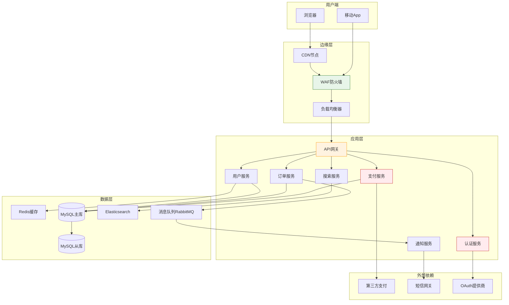
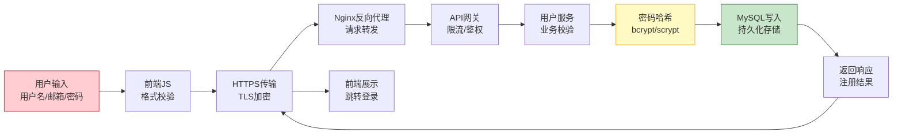
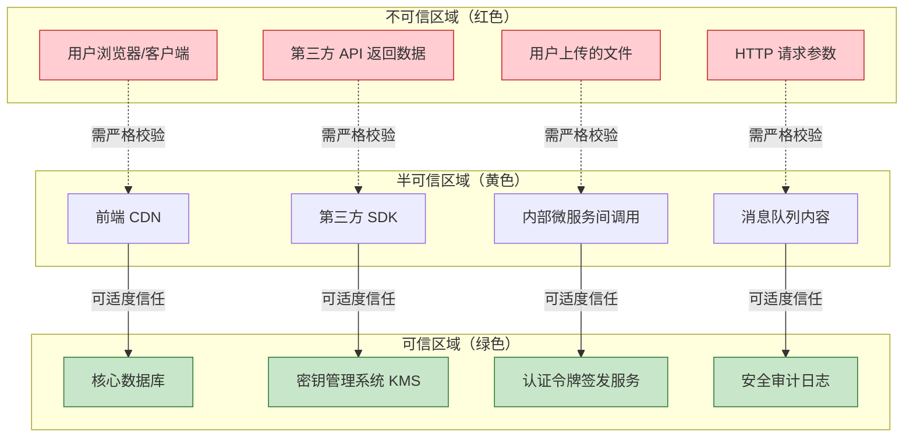
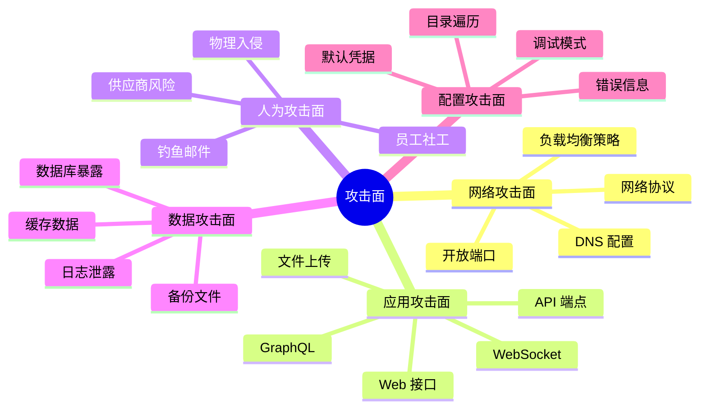

## 二、系统分解法

> 任何足够复杂的系统，都不可能一次性理解。但你可以把它拆成足够小的块，逐一攻破。

系统分解法是安全分析中最基础、最通用的结构化方法。它的核心思想是：**将一个复杂系统按照某种维度拆解为若干子系统或组件，然后分别对每个组件及其交互关系进行安全分析，最后综合得出整体安全评估**。

这听起来简单，但实际操作中，分解的方式、粒度、维度选择直接决定了分析的质量。分解得当，漏洞无处遁形；分解不当，盲区遍地。

### 2.1 为什么需要系统分解

人类的工作记忆容量有限（认知心理学中的"米勒定律"——7±2 个信息块）。一个真实的生产系统可能包含数百个组件、数千个接口、数万个数据流。试图一次性理解整个系统，大脑会自动跳过细节、简化模型、产生安全盲区。

系统分解解决的核心问题：

| 问题 | 不分解的后果 | 分解后的效果 |
|------|------------|------------|
| 组件数量过多 | 注意力分散，遗漏关键组件 | 每次聚焦一个组件，分析彻底 |
| 交互关系复杂 | 忽略组件间的安全影响 | 明确接口和信任边界 |
| 数据流路径长 | 丢失中间节点的安全风险 | 逐段追踪，每段独立验证 |
| 信任模型模糊 | 默认信任一切输入 | 明确信任等级，逐级验证 |
| 攻击面不清晰 | 不知道从哪里开始分析 | 系统化枚举，无遗漏 |

### 2.2 分解维度一：按组件分解

这是最直觉的分解方式——把系统画成组件图，然后逐一审查。

#### 2.2.1 组件分解的标准步骤

**第一步：绘制系统架构图**

不要凭记忆画，要对照实际代码、配置文件、部署拓扑来画。遗漏一个组件就遗漏一个攻击面。

**第二步：识别每个组件的职责边界**

每个组件"做什么"和"不做什么"必须明确。职责越模糊的组件，安全问题越多。

**第三步：标记组件间的数据流方向**

数据是单向还是双向？是同步还是异步？方向决定了攻击路径的可利用性。

**第四步：识别每个组件的输入来源**

组件的输入来自哪里？来自用户？来自其他组件？来自外部系统？每种输入的信任级别不同。

**第五步：识别每个组件的输出去向**

组件的输出去了哪里？输出中是否包含敏感信息？是否可能泄露给未授权方？

#### 2.2.2 Web 应用系统分解实例

以一个典型的电商 Web 应用为例，完整的组件分解如下：



图中标红的组件（认证服务、支付服务）是高危组件——它们处理认证凭证和资金流动，一旦被攻破影响最大。橙色的 API 网关是流量枢纽，是 DoS 攻击的首要目标。

#### 2.2.3 组件安全审查清单

对每个组件，逐项检查以下内容：

| 检查项 | 具体内容 | 常见漏洞 |
|--------|---------|---------|
| 输入验证 | 所有外部输入是否经过校验？校验规则是否完整？ | SQL 注入、XSS、命令注入 |
| 输出编码 | 输出到不同上下文时是否做了对应编码？ | 存储型 XSS、HTTP 头注入 |
| 认证机制 | 组件间调用是否需要认证？认证凭据如何管理？ | 未授权访问、硬编码密钥 |
| 权限控制 | 每个接口是否有权限检查？权限粒度是否足够细？ | 水平/垂直越权 |
| 错误处理 | 错误信息是否泄露内部细节？ | 信息泄露、堆栈跟踪暴露 |
| 日志审计 | 关键操作是否有日志？日志是否防篡改？ | 无法溯源、日志注入 |
| 依赖管理 | 第三方依赖是否有已知漏洞？ | 供应链攻击、已知 CVE |
| 配置安全 | 默认配置是否安全？敏感配置是否加密？ | 默认密码、明文凭据 |

### 2.3 分解维度二：按数据流分解

组件分解回答"系统有什么"，数据流分解回答"数据怎么动"。很多安全漏洞不在组件内部，而在组件之间的数据传递过程中。

#### 2.3.1 数据流分析的核心原则

**原则一：永远不信任传输中的数据**

数据从 A 组件传到 B 组件，B 组件不能假设数据已经被 A 组件安全处理过。每个组件必须独立验证自己接收到的数据。

**原则二：关注数据的"变形"节点**

数据在流经不同组件时会发生格式转换（JSON → SQL、HTML → URL、明文 → 密文）。每次转换都是一次潜在的安全风险点。

**原则三：追踪数据的"落点"**

数据最终存储在哪里？存储格式是什么？谁能访问？保留多长时间？落点决定了数据泄露的影响范围。

#### 2.3.2 数据流分解实战：用户注册流程

以用户注册为例，追踪数据从输入到存储的完整路径：



**每个节点的安全分析：**

**节点 A — 用户输入**
- 风险：用户名中注入 SQL/NoSQL 注入 payload；邮箱格式伪造；弱密码
- 防护：输入长度限制、格式白名单校验、密码强度策略
- 攻击者视角：输入 `<script>alert(1)</script>` 作为用户名，看后续是否原样输出

**节点 B — 前端校验**
- 风险：前端校验可被绕过（直接调用 API 跳过前端）
- 防护：前端校验仅用于用户体验，不能作为安全防线
- 关键认知：**前端校验 = 方便用户，后端校验 = 防御攻击，两者缺一不可**

**节点 C — HTTPS 传输**
- 风险：TLS 版本过低（SSLv3/TLS1.0）、证书验证不当、中间人攻击
- 防护：强制 TLS1.2+、HSTS 头、证书固定（移动端）
- 攻击者视角：用 Burp Suite 代理抓包，检查是否有敏感数据明文传输

**节点 D — Nginx 反向代理**
- 风险：请求走私（HTTP Request Smuggling）、Host 头注入、路径遍历
- 防护：严格的请求解析配置、限制 Host 头白名单
- 攻击者视角：发送 `Transfer-Encoding: chunked` + `Content-Length` 双重头部，测试走私

**节点 E — API 网关**
- 风险：限流绕过（分布式 IP、API Key 泄露）、认证绕过
- 防护：多维度限流（IP+用户+API）、API Key 定期轮换
- 攻击者视角：枚举 API Key 格式，尝试未授权访问

**节点 F — 用户服务**
- 风险：重复注册竞态条件、业务逻辑绕过
- 防护：数据库唯一约束、乐观锁/悲观锁
- 攻击者视角：并发发送注册请求，看是否能创建重复账户

**节点 G — 密码哈希**
- 风险：使用 MD5/SHA1 等弱哈希、未加盐、盐值可预测
- 防护：bcrypt/scrypt/Argon2 + 随机盐 + 适当 cost factor
- 关键认知：**密码哈希不是加密，不可逆是设计目标，不是缺陷**

**节点 H — 数据库写入**
- 风险：SQL 注入（如果 ORM 使用不当）、数据库权限过大、备份未加密
- 防护：参数化查询、最小权限数据库账户、备份加密
- 攻击者视角：检查数据库连接字符串是否泄露在错误信息中

#### 2.3.3 数据流威胁标注法

对每个数据流路径，用 STRIDE 模型逐段标注威胁：

| 数据流段 | S欺骗 | T篡改 | R抵赖 | I泄露 | D拒绝服务 | E提权 |
|---------|-------|-------|-------|-------|----------|-------|
| 用户→前端 | — | ✅输入篡改 | — | — | — | — |
| 前端→代理 | ✅会话劫持 | ✅中间人 | — | ✅抓包 | — | — |
| 代理→网关 | ✅请求伪造 | ✅走私 | ✅无日志 | — | ✅洪泛 | — |
| 网关→服务 | ✅身份伪造 | — | — | ✅日志泄露 | — | ✅服务间提权 |
| 服务→数据库 | — | ✅注入 | ✅无审计 | ✅拖库 | ✅慢查询 | ✅UDF执行 |

### 2.4 分解维度三：按信任级别分解

信任级别分解是安全分析中最关键也最容易被忽视的维度。它回答一个核心问题：**系统中哪些部分是可信的，哪些是不可信的？**

#### 2.4.1 信任等级划分



#### 2.4.2 信任边界穿越规则

每次数据穿越信任边界时，必须执行以下操作：

**从不可信→半可信：全面校验**
- 输入格式白名单校验
- 输入长度/范围限制
- 类型强制转换
- 特殊字符转义或拒绝
- 记录原始输入（用于审计和取证）

**从半可信→可信：最小化传递**
- 只传递必要的数据字段
- 去除不必要的元数据
- 确认数据来源身份
- 校验数据完整性（签名/HMAC）

**从可信→半可信：脱敏处理**
- 移除内部标识符（如数据库自增 ID 改用 UUID）
- 隐藏内部实现细节
- 限制返回数据范围

**从半可信→不可信：输出编码**
- 根据输出上下文选择编码方式（HTML/URL/JS/SQL）
- 移除敏感信息
- 设置安全响应头（CSP、X-Content-Type-Options）

#### 2.4.3 信任边界常见的错误认知

**错误一："内部网络就是可信的"**

事实：内网渗透是 APT 攻击的标准步骤。一旦攻击者获得内网立足点（通过钓鱼邮件、恶意 USB、被入侵的供应商 VPN），内网的"可信"假设就变成了致命漏洞。

正确做法：零信任架构——内网通信同样需要认证和加密。

**错误二："来自本服务的请求就是可信的"**

事实：如果服务 A 调用服务 B，B 不能仅凭请求来自"内网 IP"就信任它。攻击者可以伪造请求来源，或者服务 A 本身已被入侵。

正确做法：服务间调用使用 mTLS（双向 TLS）或签名令牌。

**错误三："数据库里的数据就是可信的"**

事实：如果存在 SQL 注入、业务逻辑漏洞或被入侵的管理员账户，数据库中的数据可能已经被篡改。

正确做法：从数据库读取数据后，仍需进行格式和范围校验。

**错误四："HTTPS 加密了就安全了"**

事实：HTTPS 保护的是传输层，不保护端点。如果客户端或服务器已被入侵，HTTPS 无法防止数据在端点被窃取。

正确做法：HTTPS 是必要条件，不是充分条件。需要端到端的安全设计。

### 2.5 分解维度四：按攻击面分解

攻击面分解是从攻击者视角进行的分解——不是问"系统有什么组件"，而是问"系统暴露了什么入口"。

#### 2.5.1 攻击面分类



#### 2.5.2 攻击面枚举实操

以一个公网可访问的 Web 应用为例，攻击面枚举流程：

**步骤一：信息收集**

```bash
# 子域名枚举
subfinder -d target.com -o subdomains.txt

# 端口扫描
nmap -sV -sC -p- target.com -oN nmap_full.txt

# Web 技术指纹
whatweb https://target.com

# 目录爆破
gobuster dir -u https://target.com -w /usr/share/wordlists/dirb/common.txt

# JS 文件分析（寻找 API 端点）
cat page_source.html | grep -oP 'https?://[^\s"]+\.js' | sort -u
```

**步骤二：API 端点发现**

```bash
# 从 Swagger/OpenAPI 文档提取
curl -s https://target.com/swagger.json | jq '.paths | keys[]'

# 从 JS 文件中提取 API 路径
cat app.js | grep -oP '"/api/v[0-9]+/[a-z/]+"' | sort -u

# 枚举 API 版本
for v in 1 2 3; do
  curl -s -o /dev/null -w "%{http_code}" "https://target.com/api/v$v/"
done
```

**步骤三：攻击面分类与优先级排序**

| 攻击面 | 暴露范围 | 敏感程度 | 攻击难度 | 优先级 |
|--------|---------|---------|---------|--------|
| 登录接口 | 公网 | 高 | 低 | P0 |
| API 端点 | 公网 | 中-高 | 中 | P0 |
| 管理后台 | 公网 | 极高 | 中 | P0 |
| 文件上传 | 公网 | 高 | 中 | P1 |
| 第三方组件 | 内部 | 中 | 高 | P1 |
| 内部服务 | 内网 | 高 | 高 | P2 |
| 物理设备 | 现场 | 中 | 极高 | P3 |

### 2.6 分解维度五：按生命周期分解

系统的不同生命周期阶段面临不同的安全风险。

| 阶段 | 安全关注点 | 典型风险 |
|------|-----------|---------|
| 设计阶段 | 威胁建模、安全架构评审 | 设计缺陷、信任模型错误 |
| 开发阶段 | 安全编码、代码审计 | 注入漏洞、逻辑漏洞 |
| 测试阶段 | 渗透测试、模糊测试 | 未发现的漏洞 |
| 部署阶段 | 安全配置、密钥管理 | 默认配置、硬编码凭据 |
| 运行阶段 | 监控、日志、应急响应 | 0day 攻击、内部威胁 |
| 维护阶段 | 补丁管理、依赖更新 | 已知漏洞未修复 |
| 退役阶段 | 数据销毁、服务下线 | 残留数据、幽灵服务 |

### 2.7 分解技巧与实战方法

#### 2.7.1 四大分解技巧

**技巧一：寻找接口——组件之间的接口是安全分析的重灾区**

接口是两个组件的"接触面"，也是攻击者最容易下手的地方。分析接口时关注：
- 接口暴露了哪些参数？参数的类型和范围是什么？
- 接口是否需要认证？认证方式是否足够强？
- 接口是否有速率限制？是否可以被暴力枚举？
- 接口的错误信息是否泄露内部实现细节？

**技巧二：识别假设——每个组件对其他组件有什么假设？这些假设是否成立？**

安全漏洞的本质往往是"被违反的假设"。常见假设清单：
- 假设用户输入总是合法的 → 被 SQL 注入违反
- 假设请求总是来自合法用户 → 被 CSRF 违反
- 假设文件名不会包含路径分隔符 → 被路径遍历违反
- 假设回调 URL 指向合法地址 → 被 SSRF 违反
- 假设时间戳不可伪造 → 被重放攻击违反

**技巧三：分析边界——组件之间的边界是否有足够的防护？**

边界是信任等级发生变化的地方。边界防护的三个层次：
- 第一层：认证——确认"你是谁"
- 第二层：授权——确认"你能做什么"
- 第三层：校验——确认"你给我的数据是安全的"

三层缺一不可。只有认证没有授权，合法用户可以越权操作。只有授权没有校验，合法操作可以携带恶意数据。

**技巧四：追踪数据——数据在组件间传递时是否保持完整性？**

数据完整性关注：
- 数据在传输过程中是否可能被篡改？
- 数据在存储过程中是否可能被修改？
- 数据在处理过程中是否可能发生类型混淆？
- 数据的生命周期是否被正确管理（创建、使用、销毁）？

#### 2.7.2 分解粒度的选择

分解粒度是一个权衡：

| 粒度 | 适用场景 | 优点 | 缺点 |
|------|---------|------|------|
| 粗粒度（系统级） | 初步评估、资源有限 | 快速、概览全局 | 遗漏细节 |
| 中粒度（服务级） | 常规安全审计 | 平衡深度和广度 | 需要一定经验 |
| 细粒度（函数级） | 深度代码审计 | 发现逻辑漏洞 | 耗时、需要源码 |
| 极细粒度（指令级） | 二进制逆向 | 发现内存漏洞 | 极度耗时、门槛高 |

**选择原则：从粗到细，逐步深入。** 先用粗粒度快速识别高风险区域，再对高风险区域进行细粒度分析。

#### 2.7.3 分解结果的记录模板

```markdown
# 系统分解分析报告

## 1. 系统概述
- 系统名称：
- 分析范围：
- 分析日期：
- 分析人员：

## 2. 组件清单
| 编号 | 组件名称 | 职责描述 | 部署位置 | 暴露范围 | 风险等级 |
|------|---------|---------|---------|---------|---------|
| C01  |         |         |         |         |         |

## 3. 数据流图
（插入数据流图）

## 4. 信任边界
| 编号 | 边界位置 | 信任等级变化 | 穿越规则 | 防护措施 |
|------|---------|------------|---------|---------|
| TB01 |         |            |         |         |

## 5. 攻击面清单
| 编号 | 攻击面 | 影响组件 | 暴露方式 | 威胁等级 | 缓解措施 |
|------|--------|---------|---------|---------|---------|
| AS01 |        |         |         |         |         |

## 6. 发现的安全问题
| 编号 | 问题描述 | 影响组件 | 严重程度 | 修复建议 | 状态 |
|------|---------|---------|---------|---------|------|
| F01  |         |         |         |         |      |
```

### 2.8 案例：Heartbleed 漏洞的系统分解分析

Heartbleed（CVE-2014-0160）是 OpenSSL 的 TLS Heartbeat 扩展中的一个缓冲区越界读取漏洞。用系统分解法来分析这个漏洞是如何被遗漏的。

#### 2.8.1 组件分解视角

OpenSSL 作为 TLS 库，是无数系统的底层依赖。从组件分解看：
- OpenSSL 是"基础设施层"组件
- 大多数开发者将其视为"黑盒"，不做安全审计
- 没有边界校验——上层应用信任 OpenSSL 处理所有 TLS 细节

#### 2.8.2 数据流视角

TLS Heartbeat 请求的数据流：
1. 客户端发送 Heartbeat 请求，包含 payload 和 payload 长度字段
2. 服务端读取 payload 和长度字段
3. 服务端将 payload 复制到响应缓冲区，并按照长度字段发送回去

**关键漏洞点**：步骤 3 中，服务端没有验证 payload 的实际长度是否与长度字段一致。攻击者可以声称 payload 长度为 65535 字节，但实际只发送 1 字节，导致服务端从内存中读取并返回最多 64KB 的相邻内存数据。

#### 2.8.3 信任边界视角

这个漏洞的根本原因是**信任边界违反**：
- Open SSL 信任了客户端声称的 payload 长度
- 客户端（不可信区域）提供的数据直接控制了服务端（可信区域）的内存读取范围
- 没有在信任边界（网络输入→内存操作）处进行校验

#### 2.8.4 教训

- 即使是"经过审计"的成熟组件也可能存在严重漏洞
- 所有外部输入（包括长度字段、类型字段、标志位）都必须独立校验
- 内存安全是系统安全的基石——这也是为什么 Rust 等内存安全语言越来越受重视

### 2.9 常见误区

**误区一：分解了就等于分析了**

分解只是第一步。很多人画完架构图就结束了，没有对每个组件做深入分析。分解是手段，分析才是目的。

**误区二：只分解技术组件，忽略人为因素**

系统不只是代码和服务器。人（员工、用户、供应商）也是系统的组成部分。社工攻击、内部威胁、配置错误，这些"人为组件"的安全风险同样需要分解分析。

**误区三：分解是一次性的工作**

系统在不断演化，新的组件被添加、旧的组件被修改、数据流发生变化。系统分解需要定期更新，建议在以下时机重新分解：
- 架构发生重大变更时
- 引入新的第三方依赖时
- 发生安全事件后
- 定期审计时（至少每年一次）

**误区四：分解粒度越细越好**

过度分解会导致分析成本急剧上升，反而降低效率。正确的做法是风险驱动——对高风险区域做细粒度分解，对低风险区域保持粗粒度即可。

**误区五：只关注单一维度**

只做组件分解会遗漏数据流风险，只做数据流分解会遗漏信任边界问题。完整的系统分解应该多维度交叉分析。

### 2.10 进阶：自动化系统分解

对于大型系统，手动分解效率太低。以下是一些自动化辅助工具和方法：

#### 2.10.1 自动化架构发现

```bash
# 使用 Kubernetes 可视化工具获取服务拓扑
kubectl get svc --all-namespaces -o json | jq '.items[] | {name: .metadata.name, namespace: .metadata.namespace, ports: .spec.ports}'

# 使用 Istio 获取服务间调用关系
istioctl proxy-config routes <pod-name> --name 8080 -o json

# 使用 Docker Compose 提取服务依赖
docker compose config --services | while read svc; do
  echo "=== $svc ==="
  docker compose config | yq ".services.$svc"
done
```

#### 2.10.2 自动化攻击面发现

```bash
# 使用 nuclei 扫描已知漏洞模板
nuclei -u https://target.com -t cves/ -severity critical,high

# 使用 ffuf 枚举隐藏端点
ffuf -u https://target.com/FUZZ -w /usr/share/wordlists/seclust/Discovery/Web-Content/common.txt -mc 200,301,302,403

# 使用 Arjun 发现隐藏参数
arjun -u https://target.com/api/endpoint
```

#### 2.10.3 架构即代码的安全分析

如果系统使用 Terraform/Pulumi 等 IaC 工具，可以直接从代码中提取安全相关信息：

```bash
# 使用 tfsec 扫描 Terraform 安全配置
tfsec /path/to/terraform/

# 使用 checkov 进行策略检查
checkov -d /path/to/terraform/ --framework terraform

# 使用 Semgrep 进行自定义规则扫描
semgrep --config=p/security-audit /path/to/code/
```

### 2.11 本节练习

**练习一：分解你熟悉的系统**

选择一个你日常使用的系统（如微信、淘宝、GitHub），尝试用五种维度进行分解：
1. 画出组件架构图（至少 10 个组件）
2. 追踪一个核心功能的数据流（如发送消息、下单、提交代码）
3. 标记信任边界（至少 3 个）
4. 列出 Top 10 攻击面
5. 分析该系统在设计阶段可能忽略的安全问题

**练习二：攻防转换**

基于你对某个系统的分解结果，针对每个组件和数据流，至少提出一种攻击思路。然后思考：如果你是该系统的安全工程师，你会如何防御这些攻击？

**练习三：团队协作分解**

找一个开源项目（如 WordPress、Nextcloud），下载源码后进行系统分解：
- 识别所有入口点（路由、API、文件处理）
- 追踪用户输入从接收到存储的完整路径
- 找出至少一个信任边界违反的案例
- 撰写安全分析报告，使用 2.7.3 节的模板
