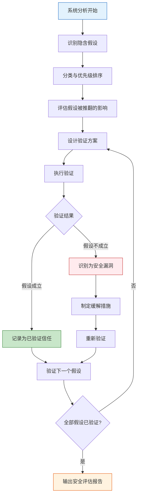
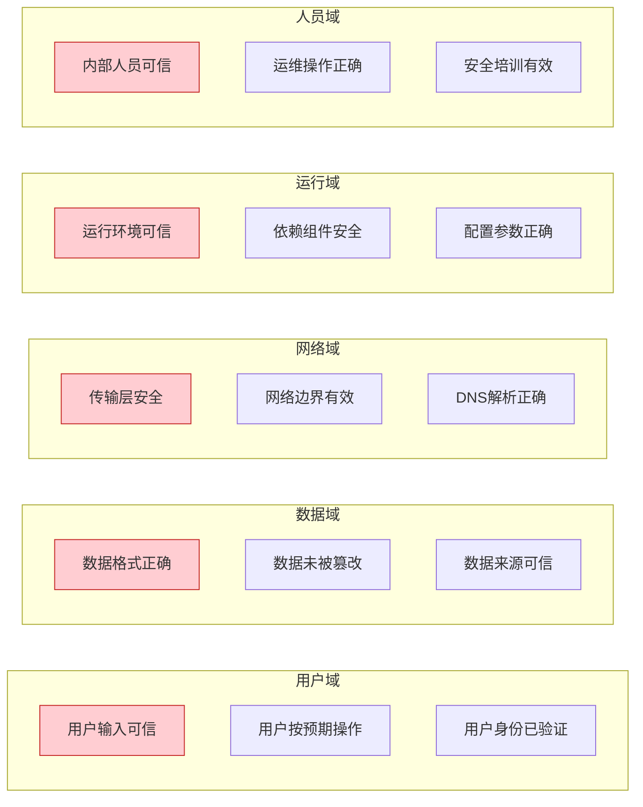
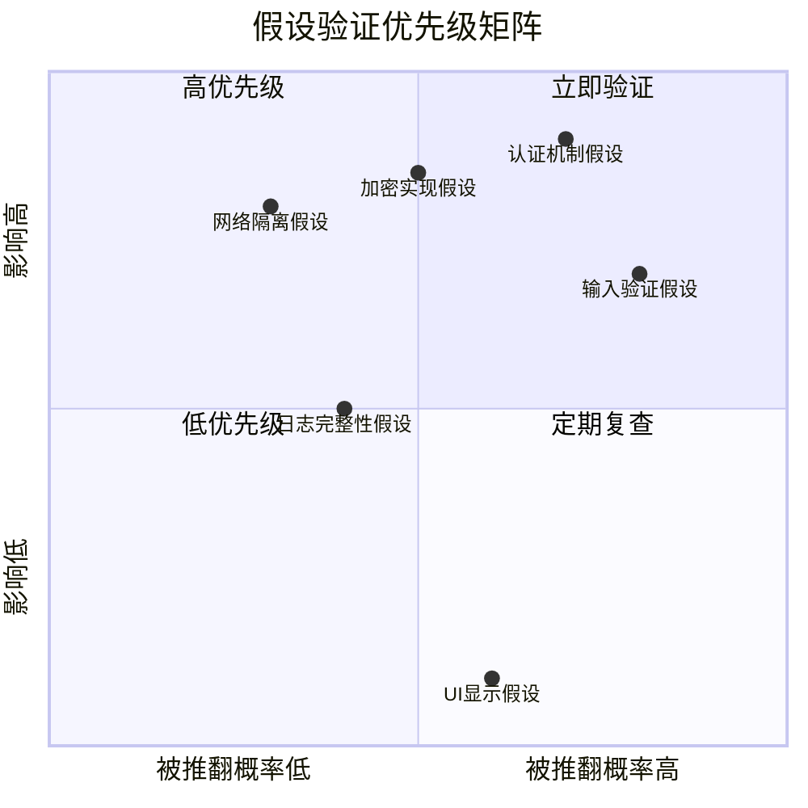
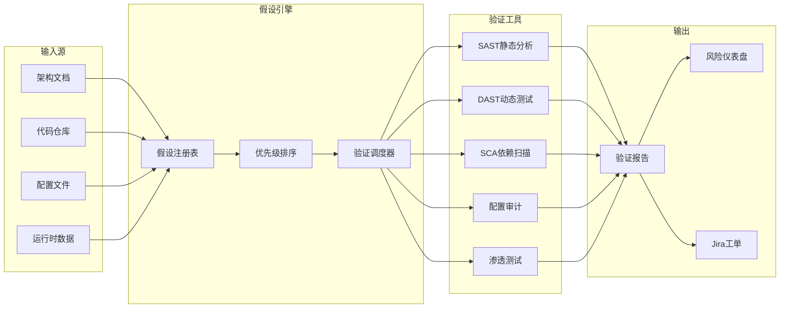
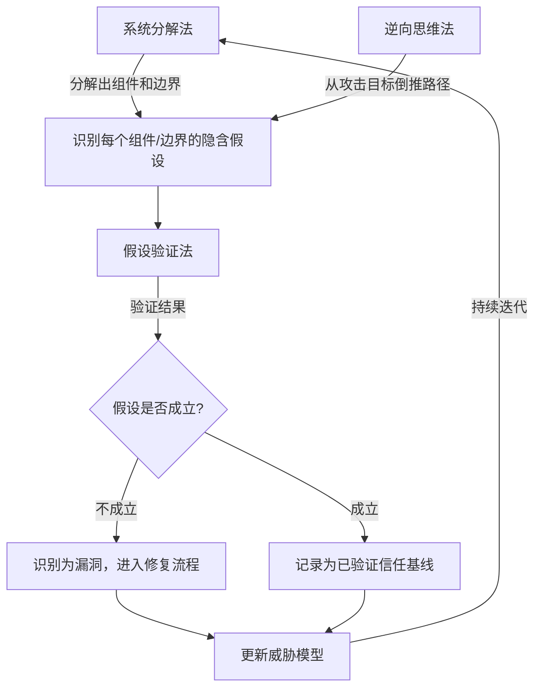

## 三、假设验证法

> "在安全领域，未经验证的假设是最危险的漏洞。" —— Gary McGraw,《Software Security》

安全分析中的系统性失败，往往不是因为技术能力不足，而是因为分析者在无意识中接受了大量未经验证的假设。假设验证法（Hypothesis-Driven Security Analysis）要求分析者**显式列出所有隐含假设，按风险排序，逐一通过技术手段验证或推翻**，从而消除认知盲区，发现被正向思维忽略的攻击面。

假设验证法的核心逻辑可以用一句话概括：**你信任什么，什么就是攻击面**。



### 3.1 为什么假设是安全的头号敌人

#### 3.1.1 认知科学视角

人类大脑在处理复杂系统时，会自动形成"认知快捷方式"——即假设。这些假设在日常生活中提高了决策效率，但在安全分析中却制造了致命盲区。认知心理学中的几个关键效应直接导致了安全假设的形成：

**确认偏误（Confirmation Bias）**：分析者倾向于寻找支持已有假设的证据，而忽略反面证据。例如，开发者假设"我们的输入验证足够安全"，于是只测试正常的输入边界，而不去验证是否真的无法绕过。

**锚定效应（Anchoring Effect）**：第一个接触的信息会成为后续判断的"锚点"。如果系统设计文档中写着"使用AES-256加密"，分析者可能假设加密实现是正确的，而不会去验证密钥管理、IV生成、填充方式等具体实现细节。

**熟悉度偏误（Familiarity Bias）**：对常用组件的信任会随时间增长。一个团队使用了三年的认证库，可能从未质疑过其默认配置的安全性——直到被CVE打脸。

#### 3.1.2 历史案例中的假设失败

几乎所有重大安全事件都可以追溯到一个或多个未被验证的假设：

| 事件 | 核心未验证假设 | 后果 |
|------|--------------|------|
| Equifax泄露（2017） | "Apache Struts框架的默认配置是安全的" | 1.47亿用户数据泄露 |
| SolarWinds后门（2020） | "构建环境是可信的" | 18000+组织被渗透 |
| Log4Shell（2021） | "日志库不需要输入安全审查" | 全球性RCE漏洞 |
| Heartbleed（2014） | "OpenSSL的内存管理是正确的" | TLS通信可被窃听 |
| Capital One泄露（2019） | "云WAF的默认规则足以防护" | 1亿用户数据泄露 |
| Colonial Pipeline（2021） | "VPN密码不会被泄露/爆破" | 美国东海岸燃油供应中断 |

这些案例的共同模式是：**假设越基础，验证缺失的后果越严重**。没有人假设"我们的系统不可破解"，但几乎所有人都假设了某些更具体、更隐蔽的前提条件成立。

#### 3.1.3 假设的隐蔽性

最危险的假设是那些"太显然以至于没人说出来"的隐含假设。它们通常隐藏在以下位置：

- **架构设计决策中**：选择某个消息队列时，默认假设其认证机制是安全的
- **代码实现中**：调用加密API时，假设默认参数是最优的
- **运维配置中**：部署服务时，假设默认端口和协议设置是安全的
- **团队协作中**：接口对接时，双方都假设对方做了输入验证
- **供应链中**：引入第三方库时，假设维护者已经做了安全审查

### 3.2 安全假设的系统化分类

#### 3.2.1 按信任域分类

理解假设的最佳方式是按信任域分类——每个信任域对应一类攻击面：



#### 3.2.2 按技术层次分类

每个技术层次都有其典型的假设模式：

**第一层：输入假设**

| 典型假设 | 攻击者视角 | 验证方法 |
|---------|----------|---------|
| 用户输入长度在合理范围内 | 超长输入导致缓冲区溢出或DoS | Fuzzing测试，边界值分析 |
| 用户输入格式符合预期 | 格式绕过导致注入攻击 | 输入变异测试，编码绕过测试 |
| 用户不会输入特殊字符 | SQL注入、XSS、命令注入 | 全字符集Fuzzing，WAF绕过测试 |
| 文件上传类型由扩展名决定 | 双重扩展名、MIME篡改、Content-Type伪造 | 多维度文件类型验证测试 |
| API参数类型由客户端保证 | 类型混淆攻击 | 类型变异Fuzzing（string→array→object） |

**第二层：认证与授权假设**

| 典型假设 | 攻击者视角 | 验证方法 |
|---------|----------|---------|
| 密码已经过安全哈希处理 | 可能是MD5、SHA1甚至明文存储 | 直接检查数据库密码字段格式 |
| 会话令牌不可预测 | 可能有时间戳、用户ID等可预测成分 | 收集大量令牌做统计随机性分析 |
| Token过期机制有效 | 可能过期后仍可使用 | 使用过期Token尝试访问受保护资源 |
| 权限校验在每个端点都执行 | 可能存在未保护的端点 | 枚举所有API端点逐一测试授权 |
| OAuth回调URL已限制 | 可能允许任意重定向 | 尝试修改redirect_uri参数 |

**第三层：数据处理假设**

| 典型假设 | 攻击者视角 | 验证方法 |
|---------|----------|---------|
| 加密算法实现正确 | 可能有填充Oracle、弱IV、ECB模式等问题 | 密码学实现审计，使用自动化工具扫描 |
| 序列化/反序列化是安全的 | 可能存在反序列化RCE | 检查序列化库版本，测试反序列化利用 |
| 数据库查询已参数化 | 可能存在拼接SQL的角落 | 代码审计+SQL注入Fuzzing |
| 日志不会记录敏感信息 | 可能记录了Token、密码、PII | 审查日志配置和实际输出 |
| 缓存数据与源数据一致 | 缓存投毒、缓存穿透 | 对比缓存与源数据的一致性测试 |

**第四层：基础设施假设**

| 典型假设 | 攻击者视角 | 验证方法 |
|---------|----------|---------|
| 服务器默认配置安全 | 默认凭据、不必要服务开放 | 配置基线扫描（CIS Benchmark） |
| 云环境隔离有效 | 可能存在元数据服务SSRF | 云安全态势评估，SSRF测试 |
| 容器运行时隔离完整 | 可能存在逃逸漏洞 | 容器逃逸测试，内核漏洞检查 |
| CI/CD管道可信 | 可能存在供应链注入 | 构建过程完整性验证，SLSA框架评估 |
| DNS响应可信 | 可能遭受DNS劫持/投毒 | DNSSEC验证，多源DNS交叉比对 |

**第五层：人员与流程假设**

| 典型假设 | 攻击者视角 | 验证方法 |
|---------|----------|---------|
| 员工不会点击钓鱼链接 | 社会工程成功率可达30%+ | 定期钓鱼模拟演练 |
| 安全策略已被执行 | 策略与执行存在差距 | 审计日志抽查，合规性检查 |
| 事件响应流程有效 | 从未真正测试过 | 红蓝对抗、桌面推演 |
| 供应商的安全实践达标 | 供应商可能有安全短板 | 供应商安全评估问卷+审计 |
| 离职员工权限已回收 | 可能存在残留账号/权限 | 定期权限审查，自动化账号生命周期管理 |

### 3.3 假设验证的完整方法论

#### 3.3.1 第一阶段：假设识别

假设识别是最关键也最难的阶段。隐含假设不会自己跳出来，需要系统化的方法来挖掘。

**方法一：信任边界映射法**

沿着系统中的每一条数据流，标记每一个信任边界。在每个边界处问自己："这里隐含了什么假设？"

```text
[用户浏览器] --HTTPS--> [CDN] --HTTP--> [负载均衡] --HTTP--> [应用服务器] --TCP--> [数据库]
      ↑              ↑               ↑                   ↑                  ↑
  信任边界1       信任边界2       信任边界3           信任边界4          信任边界5

信任边界1假设：用户浏览器正确实现了TLS
信任边界2假设：CDN到源站的HTTP连接在同一内网中（可能不成立）
信任边界3假设：负载均衡到应用的连接不可被窃听
信任边界4假设：应用服务器有资格访问数据库
信任边界5假设：数据库连接凭据不会泄露
```

**方法二：STRIDE枚举法**

对每个系统组件，使用STRIDE模型系统性地列出可能被违反的信任假设：

| STRIDE类别 | 对应的信任假设 | 验证问题 |
|-----------|--------------|---------|
| Spoofing（欺骗） | 身份验证机制是可靠的 | 是否存在认证绕过路径？凭据是否可被猜测或窃取？ |
| Tampering（篡改） | 数据完整性受到保护 | 传输中或存储中的数据能否被修改？ |
| Repudiation（抵赖） | 审计日志是完整且防篡改的 | 关键操作是否都有日志？日志能否被删除或修改？ |
| Info Disclosure（信息泄露） | 敏感数据受到适当保护 | 加密是否正确实施？是否存在信息泄露侧信道？ |
| Denial of Service（拒绝服务） | 系统具有足够的韧性和限流 | 是否存在资源耗尽攻击路径？ |
| Elevation of Privilege（权限提升） | 权限边界是严密的 | 是否存在从低权限到高权限的路径？ |

**方法三：否定假设法**

对每一句正面陈述，直接否定，然后验证否定是否可能成立：

```text
正面陈述：我们的API使用JWT认证
否定假设：JWT的签名验证可能不完整
验证：是否验证了iss、aud、exp？是否接受none算法？密钥强度是否足够？

正面陈述：密码使用bcrypt哈希
否定假设：bcrypt的cost factor可能过低
验证：检查实际cost factor值，是否>=12？

正面陈述：所有通信使用HTTPS
否定假设：可能允许HTTP降级或缺少HSTS
验证：是否强制HTTPS重定向？是否有HSTS头？是否在preload列表中？
```

**方法四：五问法（5 Whys）**

对每个安全机制，连续追问五次"为什么"，层层深入直到触及假设的根基：

```text
机制：使用JWT进行API认证
为什么安全？→ 因为JWT有签名
签名为什么可靠？→ 因为使用RS256算法
RS256为什么在这里适用？→ 因为私钥只有服务器知道
为什么私钥是安全的？→ 因为存储在环境变量中
为什么环境变量存储是安全的？→ 因为...（这里暴露了假设：环境变量不可被读取）

验证：是否有SSRF可以读取环境变量？日志是否打印环境变量？进程列表是否暴露命令行参数？
```

#### 3.3.2 第二阶段：风险评估与优先级排序

并非所有假设都需要同等投入来验证。使用二维风险矩阵进行排序：



**优先级评分公式**：

```text
风险分 = 被推翻概率(1-5) × 影响严重性(1-5) × 攻击可达性(1-5)

- 被推翻概率：该假设在类似系统中被证明错误的历史频率
- 影响严重性：假设被推翻后对CIA三元组的影响程度
- 攻击可达性：攻击者利用该假设所需的技术门槛和资源

风险分 >= 60：P0，立即验证
风险分 30-59：P1，本迭代内完成
风险分 10-29：P2，计划验证
风险分 < 10：P3，记录并定期复查
```

#### 3.3.3 第三阶段：验证执行

验证方法按可靠性从高到低排列：

**T1：直接技术验证（可靠性最高）**

直接通过代码审计、配置检查、工具扫描等方式验证：

```bash
# 验证假设："密码使用bcrypt哈希"
# 方法：直接检查数据库中的密码哈希格式
mysql -e "SELECT password FROM users LIMIT 5;"
# bcrypt格式：$2a$10$... 或 $2b$10$...
# MD5格式：5f4dcc3b5aa765d61d8327deb882cf99（32位十六进制）
# SHA256格式：5e884898da28047151d0e56f8dc6292773603d0d6aabbdd62a11ef721d1542d8（64位十六进制）

# 验证假设："会话令牌不可预测"
# 方法：收集令牌分析随机性
for i in $(seq 1 100); do
    curl -s -c - https://target.com/login | grep session_token >> /tmp/tokens.txt
done
# 使用ent或dieharder测试随机性
ent /tmp/tokens.txt
```

**T2：行为验证（可靠性高）**

通过观察系统行为来验证假设：

```bash
# 验证假设："过期Token会被拒绝"
# 方法：使用已知过期的Token访问受保护资源
curl -H "Authorization: Bearer <EXPIRED_TOKEN>" https://api.target.com/protected
# 预期：401 Unauthorized
# 如果200 OK → 假设被推翻

# 验证假设："权限校验在每个API端点都执行"
# 方法：使用低权限Token访问高权限端点
curl -H "Authorization: Bearer <LOW_PRIV_TOKEN>" https://api.target.com/admin/users
# 预期：403 Forbidden
# 如果200 OK → 假设被推翻（存在IDOR或权限绕过）
```

**T3：推理论证（可靠性中等）**

当无法直接验证时，通过逻辑推理和间接证据评估：

```text
假设：第三方支付SDK的回调验证是安全的
无法直接审计SDK源码（闭源）

间接验证：
1. 检查SDK版本是否最新 → 发现使用的是2年前的版本
2. 搜索该SDK已知漏洞 → 发现CVE-2023-XXXXX涉及回调伪造
3. 测试是否更新了该SDK → 未更新
结论：假设大概率不成立，标记为P0风险
```

**T4：假设监控（持续验证）**

对无法一次性验证的假设，建立持续监控：

```yaml
# 假设监控配置示例
hypothesis_monitor:
  - id: H001
    assumption: "第三方API密钥未泄露"
    monitor:
      - type: git_history_scan
        pattern: "api[_-]?key|secret|token"
        frequency: daily
      - type: public_repo_scan
        tool: trufflehog
        target: github.com/our-org
        frequency: weekly
      - type: dark_web_monitor
        service: haveibeenpwned
        frequency: weekly
    alert: critical
```

#### 3.3.4 第四阶段：结果记录与反馈

验证结果必须被结构化记录，形成可追溯的安全知识库：

```markdown
## 假设验证记录

### 假设编号：H-2024-003
- **假设内容**：用户密码使用bcrypt哈希存储，cost factor >= 12
- **风险评分**：75（概率3 × 影响5 × 可达性5）
- **验证方法**：直接检查数据库 + 代码审计
- **验证日期**：2024-01-15
- **验证人**：@security-analyst
- **验证结果**：❌ 假设不成立
  - 密码确实使用bcrypt，但cost factor仅为4
  - 在RTX 3090上，每秒可尝试约180,000个密码
  - 8位纯数字密码可在56秒内被暴力破解
- **影响范围**：全部用户（约200万）
- **修复方案**：提升cost factor到12，并触发密码重哈希迁移
- **修复状态**：已修复（2024-01-20）
- **回归验证**：已通过（2024-01-22）
```

### 3.4 实战案例：Web应用认证系统的假设验证

以一个典型的Web应用认证系统为例，演示完整的假设验证流程。

#### 3.4.1 系统描述

```text
用户 → 前端React应用 → API Gateway → 认证服务 → Redis(Session) + PostgreSQL(用户数据)
                   ↓
              OAuth2.0第三方登录(Google/GitHub)
```

#### 3.4.2 假设清单与验证

**假设1：用户密码使用安全的哈希算法存储**

```bash
# 验证步骤1：检查数据库密码字段格式
psql -c "SELECT substring(password, 1, 7) as hash_prefix, count(*) FROM users GROUP BY 1;"
# 期望结果：所有记录以 $2a$ 或 $2b$ 开头（bcrypt）
# 实际发现：部分记录以 $2a$ 开头，部分为32位hex（MD5）

# 验证步骤2：检查代码中的哈希逻辑
grep -rn "hash\|bcrypt\|md5\|sha" src/auth/
# 发现：旧版迁移脚本使用MD5，新用户使用bcrypt

# 结论：假设部分成立，存在遗留MD5密码
# 风险：旧用户密码可被快速破解
```

**假设2：会话令牌具有足够的随机性和安全的生命周期**

```bash
# 验证步骤1：收集会话令牌样本
for i in $(seq 1 50); do
    TOKEN=$(curl -s -X POST https://api.target.com/auth/login \
        -d '{"user":"testuser'$i'","pass":"testpass'$i'"}' | jq -r '.session_token')
    echo "$TOKEN" >> /tmp/session_tokens.txt
done

# 验证步骤2：分析令牌结构
# 检查是否可解码（JWT？）
for token in $(head -5 /tmp/session_tokens.txt); do
    echo "$token" | cut -d. -f2 | base64 -d 2>/dev/null | jq .
done
# 发现：令牌是JWT格式，包含iat（签发时间）和exp（过期时间）

# 验证步骤3：检查过期机制
OLD_TOKEN=$(head -1 /tmp/session_tokens.txt)
sleep 7200  # 等待超过过期时间
curl -H "Authorization: Bearer $OLD_TOKEN" https://api.target.com/me
# 如果返回200 → 过期机制无效
```

**假设3：OAuth回调URL已正确限制**

```bash
# 验证步骤1：检查OAuth配置
curl "https://accounts.google.com/o/oauth2/v2/auth?\
client_id=TARGET_CLIENT_ID&\
redirect_uri=https://evil.com/callback&\
response_type=code&\
scope=openid%20email"

# 验证步骤2：尝试使用授权码
# 如果Google接受非法redirect_uri → 假设不成立
# 如果Google拒绝 → 检查应用侧是否也验证redirect_uri

# 验证步骤3：检查redirect_uri是否可被参数污染
curl "https://api.target.com/auth/oauth/callback?code=xxx&redirect_uri=https://evil.com"
```

**假设4：API速率限制能有效防止暴力破解**

```bash
# 验证步骤1：测试登录端点的速率限制
for i in $(seq 1 1000); do
    RESPONSE=$(curl -s -o /dev/null -w "%{http_code}" \
        -X POST https://api.target.com/auth/login \
        -d '{"user":"admin","pass":"wrong'$i'"}')
    if [ "$RESPONSE" != "429" ] && [ "$RESPONSE" != "403" ]; then
        echo "尝试$i: HTTP $RESPONSE（未被限流）"
    fi
done

# 验证步骤2：测试是否按IP限流
# 使用不同IP重试 → 检查是否绕过了IP限流
# 使用同一账号不同密码 → 检查是否按账号限流

# 验证步骤3：测试其他认证端点
# 密码重置、邮箱验证、OTP验证等端点是否也有速率限制
```

**假设5：JWT签名验证完整且密钥安全**

```bash
# 验证步骤1：测试none算法攻击
# 修改JWT header中的alg为none，删除签名
python3 -c "
import base64, json
header = base64.b64encode(json.dumps({'alg':'none','typ':'JWT'}).encode()).rstrip(b'=')
payload = base64.b64encode(json.dumps({'sub':'admin','role':'admin'}).encode()).rstrip(b'=')
print(f'{header.decode()}.{payload.decode()}.')
"

# 验证步骤2：测试密钥强度（如果是HMAC）
# 使用常见弱密钥字典尝试签名
hashcat -a 0 -m 16500 jwt.txt common_secrets.txt

# 验证步骤3：检查密钥轮换机制
# 是否支持JWKS？密钥是否定期轮换？
curl https://api.target.com/.well-known/jwks.json
```

### 3.5 常见误区与纠正

#### 误区一："这个假设太显然了，不需要验证"

**问题**：越是"显然"的假设，越可能在实现层面出错。开发者和运维者对"显然"的理解可能不同。

**纠正**：建立"零信任假设"文化——所有假设都需要验证，不论其看起来多么"显然"。在安全审查清单中，即使是最基础的条目也要逐项确认。

#### 误区二："我们用的是知名组件，所以假设成立"

**问题**：知名组件也有漏洞，且默认配置不等于安全配置。Equifax事件中使用的Apache Struts是知名组件。

**纠正**：知名组件需要验证的具体项：
- 版本是否包含已知CVE
- 默认配置是否适合生产环境
- 是否启用了不必要的功能
- 依赖链中是否有已知漏洞

#### 误区三："上次验证过，所以这次不需要"

**问题**：系统在持续变化，代码更新、配置变更、依赖升级都可能改变之前验证过的假设状态。

**纠正**：将关键假设验证纳入CI/CD流水线，实现自动化持续验证：

```yaml
# CI/CD中的假设验证检查
security_hypothesis_checks:
  - name: "密码哈希算法检查"
    script: scripts/check_hash_algorithm.sh
    trigger: every_deploy
    fail_on: "any_md5_detected"

  - name: "JWT配置检查"
    script: scripts/check_jwt_config.sh
    trigger: every_deploy
    fail_on: "none_algorithm_allowed OR weak_key_detected"

  - name: "依赖漏洞扫描"
    tool: trivy
    trigger: every_pr
    fail_on: "critical_or_high_vulnerabilities"
```

#### 误区四："验证一次就够了"

**问题**：单一验证方法可能存在盲区。一个假设通过了代码审计，但在运行时可能因为配置覆盖而失效。

**纠正**：采用多维度验证策略——同一假设至少通过两种不同方法验证（如代码审计 + 运行时测试 + 自动化扫描）。

#### 误区五："假设被推翻就是安全漏洞"

**问题**：并非所有假设失败都直接构成安全漏洞。某些假设失败可能只是降低了安全裕度，但没有直接的利用路径。

**纠正**：区分假设失败的影响等级：
- **直接可利用**：假设失败 → 攻击者可直接利用（如SQL注入）
- **需组合利用**：假设失败需要与其他条件组合才能利用（如弱密码 + 无速率限制）
- **降低安全裕度**：假设失败降低了整体安全水平但无直接利用路径
- **合规性问题**：违反安全标准但无直接技术影响

### 3.6 进阶：假设验证的自动化框架

#### 3.6.1 假设驱动的安全测试框架

将假设验证系统化，可以构建一个持续运行的安全验证框架：

```python
import dataclasses
from enum import Enum
from typing import Callable

class Severity(Enum):
    CRITICAL = "critical"
    HIGH = "high"
    MEDIUM = "medium"
    LOW = "low"
    INFO = "info"

class VerificationStatus(Enum):
    CONFIRMED = "confirmed"      # 假设成立
    REFUTED = "refuted"          # 假设不成立
    INCONCLUSIVE = "inconclusive" # 无法确定
    NOT_TESTED = "not_tested"     # 尚未验证

@dataclasses.dataclass
class Hypothesis:
    id: str
    description: str
    trust_domain: str           # 用户域/数据域/网络域/运行域/人员域
    severity_if_refuted: Severity
    verification_method: str
    verification_function: Callable
    status: VerificationStatus = VerificationStatus.NOT_TESTED
    evidence: list = dataclasses.field(default_factory=list)
    last_verified: str = None

class HypothesisValidator:
    def __init__(self):
        self.hypotheses: list[Hypothesis] = []

    def register(self, hypothesis: Hypothesis):
        """注册一个需要验证的安全假设"""
        self.hypotheses.append(hypothesis)

    def verify_all(self):
        """验证所有注册的假设"""
        results = {"confirmed": [], "refuted": [], "inconclusive": []}
        for h in sorted(self.hypotheses,
                        key=lambda x: x.severity_if_refuted.value):
            h.status, h.evidence = h.verification_function()
            results[h.status.value].append(h)
        return results

    def generate_report(self):
        """生成假设验证报告"""
        report = []
        for h in self.hypotheses:
            icon = {"confirmed": "✅", "refuted": "❌",
                    "inconclusive": "⚠️", "not_tested": "⬜"}
            report.append(
                f"{icon[h.status.value]} [{h.id}] {h.description}\n"
                f"   信任域: {h.trust_domain} | "
                f"严重性: {h.severity_if_refuted.value}\n"
                f"   证据: {'; '.join(h.evidence) if h.evidence else '无'}"
            )
        return "\n".join(report)
```

#### 3.6.2 与现有安全工具的集成

假设验证框架可以与常见安全工具链集成：



#### 3.6.3 假设验证与威胁建模的联动

假设验证法不是孤立使用的，它与前文提到的系统分解法、逆向思维法形成互补的分析三角：



这三种方法的协同关系：
- **系统分解法**提供了分析的骨架（知道要分析什么）
- **逆向思维法**提供了攻击的视角（知道要找什么）
- **假设验证法**提供了验证的手段（知道如何确认）

### 3.7 假设验证清单模板

以下是一份可直接使用的假设验证清单，涵盖Web应用最常见的安全假设。在实际项目中，应根据系统特点进行裁剪和扩展。

```markdown
# 安全假设验证清单

## 认证假设
- [ ] 密码哈希算法为bcrypt/argon2，cost factor >= 12
- [ ] 会话令牌使用CSPRNG生成，至少128位熵
- [ ] 会话过期机制有效（服务端强制，非仅客户端）
- [ ] 多因素认证实现正确（TOTP时间窗口、备用码安全存储）
- [ ] 密码重置流程不可被枚举或重放
- [ ] 账户锁定机制能有效防止暴力破解

## 授权假设
- [ ] 每个API端点都有权限校验（包括新增端点）
- [ ] 水平越权（IDOR）防护有效
- [ ] 垂直越权防护有效（低权限用户不能访问高权限功能）
- [ ] RBAC/ABAC策略实现与设计一致

## 输入验证假设
- [ ] 所有用户输入在服务端重新验证
- [ ] SQL查询全部参数化，无拼接
- [ ] 输出编码与上下文匹配（HTML/URL/JS/CSS）
- [ ] 文件上传有类型、大小、内容多重校验
- [ ] 反序列化仅接受白名单类型

## 加密假设
- [ ] TLS版本 >= 1.2，禁用弱密码套件
- [ ] 密钥不在代码或配置文件中明文存储
- [ ] 加密模式不是ECB，IV不重复
- [ ] 证书验证链完整，不跳过校验

## 基础设施假设
- [ ] 无默认凭据（数据库、管理后台、中间件）
- [ ] 不必要的端口和服务已关闭
- [ ] 错误信息不泄露技术细节（栈追踪、版本号）
- [ ] 日志不包含敏感数据（密码、Token、PII）

## 供应链假设
- [ ] 所有依赖已扫描已知漏洞
- [ ] 依赖版本锁定，不使用latest标签
- [ ] 第三方SDK/Cookie同意机制已审计
- [ ] CI/CD管道有完整性保护
```

### 3.8 训练方法

#### 练习一：假设逆向工程（入门）

选择一个你熟悉的应用（如Gmail、微信、支付宝），列出10个它"应该"满足的安全假设，然后思考哪些假设你实际上无法验证——这些就是潜在的攻击面。

#### 练习二：假设验证实验室（中级）

部署一个已知漏洞的靶场应用（如DVWA、Juice Shop），在不查看源码的情况下，先列出你对该系统的假设，然后逐一验证，看哪些假设不成立构成了可利用的漏洞。

#### 练习三：假设审计实战（高级）

对你正在开发或维护的真实项目，完成一次完整的假设验证审计：
1. 绘制系统架构图和数据流图
2. 识别所有信任边界
3. 在每个边界列出隐含假设
4. 按风险矩阵排序
5. 逐一验证
6. 生成假设验证报告
7. 修复所有被推翻的假设
8. 建立自动化监控防止假设退化

#### 练习四：假设红队对抗（专家）

组建红蓝两队。蓝队列出系统的安全假设清单，红队尝试推翻每个假设。每次假设被推翻，双方共同分析：这个假设是如何形成的？为什么没有被更早发现？如何在流程中预防类似假设的形成？
