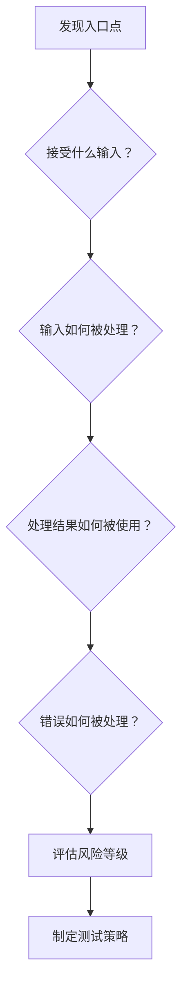
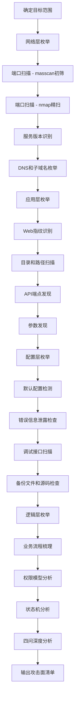

## 四、攻击面枚举法

攻击面枚举是安全评估的第一步，也是决定后续工作质量的关键环节。如果说攻击面分析回答了"攻击面是什么"，那么攻击面枚举要回答的是"如何把每一个入口点都找出来"。遗漏一个入口点，就等于给攻击者留了一扇没有锁的门。

本节介绍一套系统化的枚举方法论，从四个层次（网络层、应用层、配置层、逻辑层）逐层展开，配合工具链和实战案例，帮助你建立完整的枚举能力。

### 4.1 枚举的核心原则

在动手之前，先理解三条核心原则，它们决定了枚举的成败。

#### 4.1.1 完整性优于速度

枚举最大的敌人不是工具不够快，而是"以为找到了所有入口点"的错觉。经验表明，在一次完整的枚举中，最后 20% 的发现往往来自前 80% 时间之后。很多高危漏洞藏在被忽略的角落——一个遗留的管理接口、一个没下线的旧版本 API、一个暴露的调试端点。

**正确做法**：先用自动化工具做广度扫描，再用人工方法做深度挖掘。不要在第一轮扫描完成后就停止。

#### 4.1.2 分层枚举，逐层深入

现代系统的攻击面是分层的。网络层的发现会影响应用层的枚举方向，应用层的发现又会影响逻辑层的测试策略。盲目地在所有方向上同时推进，既浪费时间，又容易遗漏关联关系。

**正确做法**：按照 网络层 → 应用层 → 配置层 → 逻辑层 的顺序逐层推进，每一层的输出作为下一层的输入。

#### 4.1.3 动态更新，持续迭代

目标系统不是静态的。新服务上线、旧接口退役、配置变更、版本升级——每一次变化都可能引入新的攻击面。一次枚举的结果只代表一个时间点的快照。

**正确做法**：将枚举流程模板化，定期重复执行。对于关键系统，建议至少每月一次全量枚举，每次重大变更后做增量枚举。

### 4.2 第一层：网络层枚举

网络层是攻击者最先接触的层面。目标是绘制出目标系统的网络暴露面——哪些端口在监听、哪些服务在运行、哪些域名指向这个目标。

#### 4.2.1 端口扫描

端口扫描是网络枚举的起点。TCP/IP 协议有 65535 个端口，每个开放的端口都可能运行着一个可被攻击的服务。

**扫描策略选择**：

| 扫描类型 | 命令示例 | 速度 | 隐蔽性 | 适用场景 |
|---------|---------|------|--------|---------|
| TCP Connect | `nmap -sT` | 快 | 低（完成三次握手） | 内网扫描、授权测试 |
| TCP SYN | `nmap -sS` | 快 | 中（半开连接） | 最常用的外部扫描方式 |
| TCP FIN/Xmas/Null | `nmap -sF/-sX/-sN` | 慢 | 高（绕过简单防火墙） | 绕过 SYN 过滤的场景 |
| UDP | `nmap -sU` | 极慢 | 中 | DNS/DHCP/SNMP 等 UDP 服务 |
| 全端口扫描 | `nmap -p-` | 很慢 | 低 | 发现非标准端口上的服务 |

**关键实践**：

```bash
# 第一步：快速扫描常见端口（1000个最常用端口），快速了解目标
nmap -sS -T4 --open -oN quick_scan.txt target.com

# 第二步：全端口扫描，发现非标准端口上的隐藏服务
nmap -sS -p- --min-rate=5000 -oN full_scan.txt target.com

# 第三步：对发现的开放端口做服务版本和脚本扫描
nmap -sV -sC -p <discovered_ports> -oN detailed_scan.txt target.com

# UDP 扫描（耗时长，但不能跳过）
nmap -sU --top-ports 100 -oN udp_scan.txt target.com
```

**容易遗漏的端口**：

- **21 (FTP)**：匿名登录、明文传输
- **25 (SMTP)**：开放中继、用户枚举
- **53 (DNS)**：区域传送、DNS 劫持
- **161 (SNMP)**：默认 community string
- **3389 (RDP)**：BlueKeep 等历史漏洞
- **6379 (Redis)**：未授权访问的重灾区
- **27017 (MongoDB)**：默认无认证
- **9200 (Elasticsearch)**：默认无认证
- **8500 (Consul)**：服务发现，可 RCE
- **2375/2376 (Docker API)**：容器逃逸入口

#### 4.2.2 服务版本精确识别

知道端口开放不够，还需要知道运行的是什么服务、什么版本。版本信息直接决定了是否存在已知漏洞。

```bash
# 精确版本探测
nmap -sV --version-intensity 9 -p <port> target.com

# 针对特定服务的深入探测
nmap --script=ssl-cert,ssl-enum-ciphers -p 443 target.com
nmap --script=mysql-info -p 3306 target.com
nmap --script=memcached-info -p 11211 target.com
```

版本识别的难点在于服务指纹可能被伪装。管理员可以通过修改 banner 来隐藏真实版本，此时需要结合行为特征判断——比如 HTTP 响应头的顺序、TLS 握手的特征、错误页面的格式等。

**工具推荐**：

- **nmap**：最全面的端口扫描和服务识别工具
- **masscan**：超高速端口扫描，适合大范围初筛
- **RustScan**：Rust 编写的高速扫描器，配合 nmap 使用效果最佳
- **zmap**：互联网范围的单端口扫描

#### 4.2.3 DNS 枚举

DNS 记录是攻击面枚举的金矿。通过 DNS 可以发现子域名、邮件服务器、CDN 配置、内部 IP 泄露等关键信息。

```bash
# 基础记录查询
dig ANY target.com
dig A target.com
dig AAAA target.com
dig MX target.com
dig NS target.com
dig TXT target.com      # SPF/DKIM/DMARC/验证记录
dig SOA target.com

# 尝试区域传送（成功率低但回报高）
dig AXFR target.com @ns1.target.com

# CNAME 链追踪（发现托管服务和 CDN 配置）
dig +trace CNAME app.target.com
```

**子域名枚举方法**：

```bash
# 字典爆破
subfinder -d target.com -o subs.txt
amass enum -passive -d target.com -o amass_subs.txt
gobuster dns -d target.com -w /usr/share/wordlists/subdomains.txt

# 证书透明度日志查询（被动，不触发告警）
curl -s "https://crt.sh/?q=%25.target.com&output=json" | jq -r '.[].name_value' | sort -u

# 搜索引擎枚举
# Google: site:target.com -www
# Bing:   ip:target.com
# Shodan: hostname:target.com

# 第三方数据源
# SecurityTrails, VirusTotal, DNSDumpster, BufferOver
```

**为什么 DNS 枚举如此重要？**

1. **发现隐藏资产**：很多子域名不在主站上暴露，但 DNS 记录不会说谎。开发、测试、预发布环境的安全防护通常远弱于生产环境。
2. **绕过 CDN**：通过 CNAME 和历史 DNS 记录，可能找到源站真实 IP。
3. **识别技术栈**：MX 记录暴露邮件服务商，TXT 记录可能泄露内部系统名称。
4. **发现关联域名**：通过 NS 和 SOA 记录可以发现同一组织的其他域名。

#### 4.2.4 网络拓扑推测

通过 traceroute 和多点探测，可以推测目标的网络架构：

```bash
# 路由追踪
traceroute -n target.com
# TCP 模式（绕过 ICMP 过滤）
tcptraceroute target.com 443

# 多点探测（从不同位置出发）
# 使用在线工具：ping.pe, just-ping.com
```

关键观察点：
- TTL 值的变化可以推测跳数
- 响应的 IP 段可以识别 ISP 和云服务商
- 超时节点的位置可以推测防火墙位置

### 4.3 第二层：应用层枚举

应用层枚举针对的是运行在网络服务之上的 Web 应用、API 接口和其他业务系统。这一层的攻击面最为复杂，也是大多数漏洞的藏身之处。

#### 4.3.1 URL 路径枚举

Web 应用的每个 URL 路径都可能对应一个功能点或一个资源。路径枚举的目标是发现所有可达的路径，包括那些没有在前端页面上链接的隐藏路径。

```bash
# 目录和文件爆破
dirsearch -u target.com -e php,asp,jsp,html,js,json,xml,yaml,yml,conf,bak,old,zip,tar.gz
gobuster dir -u target.com -w /usr/share/wordlists/dirbuster/directory-list-2.3-medium.txt -x php,html,js

# 递归扫描（发现子目录）
feroxbuster -u target.com -w wordlist.txt --depth 3 --extract-links

# 基于 robots.txt 和 sitemap.xml 发现路径
curl -s target.com/robots.txt
curl -s target.com/sitemap.xml

# JavaScript 文件分析（从 JS 中提取 API 路径）
cat app.js | grep -oP '"/api/[^"]*"' | sort -u
# 工具：LinkFinder, katana
```

**高价值路径清单**：

| 路径模式 | 说明 | 风险等级 |
|---------|------|---------|
| `/admin`, `/manager`, `/console` | 管理后台 | 极高 |
| `/api/v1/`, `/graphql` | API 端点 | 高 |
| `/debug`, `/trace`, `/actuator` | 调试接口 | 极高 |
| `/.env`, `/config.yml` | 配置文件泄露 | 极高 |
| `/backup`, `/dump` | 数据备份 | 高 |
| `/.git/` | 源码泄露 | 极高 |
| `/swagger.json`, `/openapi.yaml` | API 文档 | 高 |
| `/wp-admin`, `/phpmyadmin` | CMS 管理 | 高 |
| `/.well-known/` | 安全策略文件 | 中 |
| `/server-status`, `/server-info` | Apache 状态 | 高 |

#### 4.3.2 API 端点发现

现代应用越来越多地使用 API（REST、GraphQL、gRPC）作为前后端通信的桥梁。API 的枚举需要专门的方法。

**REST API 枚举**：

```bash
# 从 Swagger/OpenAPI 文档获取端点列表
curl -s target.com/swagger.json | jq '.paths | keys[]'
curl -s target.com/openapi.yaml

# API 版本枚举
for v in v1 v2 v3 v4; do
  curl -s -o /dev/null -w "%{http_code}" target.com/api/$v/
done

# HTTP 方法测试（每个端点可能支持不同的方法）
for method in GET POST PUT PATCH DELETE OPTIONS HEAD; do
  curl -X $method -s -o /dev/null -w "%{http_code}" target.com/api/users
done
```

**GraphQL 枚举**：

```bash
# 内省查询（获取完整 schema）
curl -X POST target.com/graphql \
  -H "Content-Type: application/json" \
  -d '{"query":"{ __schema { types { name fields { name } } } }"}'

# 从 schema 中提取所有可查询的对象和字段
# 工具：InQL, graphql-path-enum, clairvoyance
```

**gRPC 枚举**：

```bash
# 服务发现
grpcurl -plaintext target.com:50051 list

# 方法枚举
grpcurl -plaintext target.com:50051 describe package.ServiceName
```

#### 4.3.3 参数发现

同一个端点接受不同的参数，每个参数都是一个潜在的攻击向量。参数发现的目标是找到所有可接受的输入点。

```bash
# 参数爆破
arjun -u target.com/api/user
parameth -u target.com/page.php

# 从 JavaScript 中提取参数名
cat main.js | grep -oP '[a-zA-Z_]+(?=:|,|\s*=)' | sort -u

# 隐藏参数发现（基于常见参数名字典）
# 常见参数：id, user, file, path, redirect, url, callback, token, key, debug, admin, test
```

**参数类型和攻击向量**：

| 参数类型 | 示例 | 常见攻击向量 |
|---------|------|------------|
| 路径参数 | `/user/{id}` | IDOR、路径遍历 |
| 查询参数 | `?page=1&size=10` | SQL 注入、XSS |
| 表单参数 | `username=xxx` | 注入、逻辑绕过 |
| Cookie 参数 | `session=xxx` | 会话固定、CSRF |
| Header 参数 | `X-Forwarded-For` | SSRF、IP 绕过 |
| Body 参数 | JSON/XML body | XXE、反序列化 |

#### 4.3.4 内容类型与编码测试

不同的内容类型和编码方式可能触发不同的处理逻辑：

```bash
# 测试不同的 Content-Type
curl -X POST target.com/api/data -H "Content-Type: application/json" -d '{"key":"value"}'
curl -X POST target.com/api/data -H "Content-Type: application/xml" -d '<root><key>value</key></root>'
curl -X POST target.com/api/data -H "Content-Type: application/x-www-form-urlencoded" -d 'key=value'
curl -X POST target.com/api/data -H "Content-Type: multipart/form-data" -F 'key=value'

# 编码绕过测试
# URL 编码、双重 URL 编码、Unicode 编码、HTML 实体编码、Base64 编码
```

### 4.4 第三层：配置层枚举

配置层的攻击面来自系统部署时的配置选择。默认配置、调试模式、错误处理方式——这些"小事"往往是高危漏洞的来源。

#### 4.4.1 默认配置检测

大量系统在部署时使用默认配置，攻击者可以利用已知的默认凭据、默认路径和默认行为。

```bash
# Web 服务器默认页面
curl -s target.com/server-status
curl -s target.com/server-info
curl -s target.com/.server-status

# 默认管理路径
# Tomcat: /manager/html  (默认: tomcat/tomcat)
# Jenkins: /manage, /script (默认无认证或 admin/admin)
# phpMyAdmin: /phpmyadmin (默认: root/空密码)
# Weblogic: /console (默认: weblogic/weblogic)
# JBoss: /jmx-console, /web-console
# Artifactory: /webapp/
# Grafana: /login (默认: admin/admin)
# Kibana: /app/kibana
# RabbitMQ: / (默认: guest/guest)
# MinIO: /minio/login (默认: minioadmin/minioadmin)

# 自动化默认凭据测试
hydra -L users.txt -P passwords.txt target.com http-post-form "/login:user=^USER^&pass=^PASS^:Invalid"
# 工具：changeme, ncrack, patator
```

#### 4.4.2 错误信息泄露

错误信息是攻击者的情报来源。详细的错误信息可以泄露技术栈、文件路径、数据库结构、内部 IP 等关键信息。

**常见的信息泄露类型**：

- **堆栈跟踪**：泄露框架版本、类名、文件路径
- **数据库错误**：泄露 SQL 语句结构、表名、列名
- **调试信息**：泄露环境变量、配置参数
- **自定义错误页面**：泄露内部域名、服务器 IP

```bash
# 触发错误以获取信息
curl -s target.com/nonexistent_page
curl -s target.com/api/users?id='
curl -s target.com/api/users?id=1/0

# 检查自定义错误页面是否泄露信息
for code in 400 401 403 404 500 502 503; do
  curl -s "target.com/error?code=$code" | head -20
done
```

#### 4.4.3 调试功能暴露

开发环境中开启的调试功能如果被带到生产环境，后果可能是灾难性的。

```bash
# 常见调试端点
curl -s target.com/debug
curl -s target.com/trace       # Spring Boot Actuator
curl -s target.com/env         # Spring Boot 环境变量
curl -s target.com/actuator    # Spring Boot 2.x+
curl -s target.com/actuator/env
curl -s target.com/actuator/heapdump  # JVM 堆转储（含密钥）
curl -s target.com/health
curl -s target.com/metrics
curl -s target.com/info
curl -s target.com/debug/vars  # Go expvar
curl -s target.com/debug/pprof # Go pprof
curl -s target.com/_debug       # Django debug toolbar
curl -s target.com/__debug__/
```

**JVM Heapdump 泄露案例**：

Spring Boot Actuator 的 `/actuator/heapdump` 端点如果未禁用，会返回一个 JVM 堆转储文件。攻击者可以用 Eclipse MAT 或 VisualVM 打开这个文件，搜索字符串来提取数据库密码、API 密钥、JWT Secret 等敏感信息。

```bash
# 下载并分析 heapdump
curl -s target.com/actuator/heapdump -o heap.hprof
# 用 jhat 或 Eclipse MAT 打开，搜索 "password"、"secret"、"key"
```

#### 4.4.4 备份文件和源码泄露

```bash
# Git 仓库泄露
curl -s target.com/.git/HEAD
curl -s target.com/.git/config
# 工具：GitHack, git-dumper

# SVN 仓库泄露
curl -s target.com/.svn/entries

# 常见备份文件
for ext in bak old backup orig copy tmp swp; do
  curl -s -o /dev/null -w "%{http_code}" target.com/index.php.$ext
  curl -s -o /dev/null -w "%{http_code}" target.com/config.$ext
done

# 压缩包泄露
for ext in zip tar tar.gz tgz rar 7z; do
  curl -s -o /dev/null -w "%{http_code}" target.com/backup.$ext
  curl -s -o /dev/null -w "%{http_code}" target.com/www.$ext
done

# 环境文件
curl -s target.com/.env
curl -s target.com/.env.local
curl -s target.com/.env.production
curl -s target.com/config.yml
curl -s target.com/config.json
curl -s target.com/web.config
curl -s target.com/appsettings.json
```

#### 4.4.5 管理接口和内部服务暴露

```bash
# 云元数据服务（SSRF 利用目标）
# AWS:   http://169.254.169.254/latest/meta-data/
# GCP:   http://metadata.google.internal/computeMetadata/v1/
# Azure: http://169.254.169.254/metadata/instance?api-version=2021-02-01

# 内部服务发现（通过 SSRF 或直接访问）
# Docker Socket: /var/run/docker.sock
# Kubernetes API: https://kubernetes.default.svc
# etcd: 2379
# Consul: 8500
# ZooKeeper: 2181
# Memcached: 11211

# CORS 配置检查（是否允许任意来源）
curl -s -H "Origin: evil.com" -I target.com/api/data | grep -i "access-control"
```

### 4.5 第四层：逻辑层枚举

逻辑层的攻击面不在端口、路径或配置中，而在业务逻辑的设计缺陷里。这一层最难枚举，也最难用自动化工具覆盖，需要深入理解业务流程。

#### 4.5.1 业务流程分析

每个业务功能都由一系列步骤组成。攻击者可以跳过步骤、重复步骤、打乱步骤顺序或在步骤之间注入异常数据。

**枚举方法**：

1. **绘制流程图**：把每个业务功能的正常流程画出来，包括每一步的输入、输出、前置条件和后置条件
2. **识别信任边界**：哪些步骤之间存在信任假设？客户端发送的数据是否被服务端重新验证？
3. **列出所有状态**：订单可以是"待支付→已支付→已发货→已完成"，但"待支付"能不能直接跳到"已发货"？
4. **分析并发场景**：两个请求同时提交会发生什么？余额扣减、库存扣减、优惠券使用——这些场景最容易出现竞态条件

```python
# 并发竞态条件测试示例
import threading
import requests

def exploit_race(url, data):
    """同时发送100个请求，测试是否可以重复使用同一张优惠券"""
    threads = []
    for _ in range(100):
        t = threading.Thread(target=requests.post, args=(url,), json=data)
        threads.append(t)
        t.start()
    for t in threads:
        t.join()

# 如果后端没有加锁，可能多次享受优惠
exploit_race("https://target.com/api/checkout", {"coupon": "SAVE50"})
```

#### 4.5.2 权限模型分析

权限系统的枚举重点是找到"应该禁止但实际允许"的操作。

**枚举矩阵**：

```bash
# 创建不同角色的账号
# admin, manager, user_a, user_b, anonymous

# 对每个 API 端点，用所有角色分别请求
# 记录哪些端点缺少权限控制

# 垂直越权测试：普通用户能否访问管理员功能？
curl -H "Authorization: Bearer <user_token>" target.com/api/admin/users

# 水平越权测试：用户 A 能否访问用户 B 的数据？
curl -H "Authorization: Bearer <user_a_token>" target.com/api/users/user_b_id/profile

# IDOR 测试：遍历 ID 访问其他用户的资源
for id in $(seq 1 1000); do
  curl -s -H "Authorization: Bearer <token>" "target.com/api/orders/$id" | jq '.status'
done
```

#### 4.5.3 状态机分析

系统中的对象（订单、账户、工单等）都有自己的状态转换规则。枚举的目标是找到非法的状态转换路径。

```text
正常流程：创建 → 审批 → 执行 → 完成

攻击测试：
- 创建 → 完成（跳过审批和执行）
- 已完成 → 创建（回退到初始状态）
- 创建 → 创建（重复创建）
- 并发执行（同一任务同时执行两次）
```

#### 4.5.4 输入验证逻辑枚举

```bash
# 边界值测试
# 数值字段：0, -1, 1, MAX_INT, MAX_INT+1, 0.001, NaN, Infinity
# 字符串字段：空字符串, 超长字符串, NULL字节, 特殊字符

# 类型混淆测试
# 期望数字的地方传字符串
# 期望字符串的地方传数组
# 期望布尔的地方传字符串 "true" vs true vs 1

# 格式混淆测试
# 日期格式：2024-01-01 vs 01/01/2024 vs January 1, 2024
# 金额格式：100.00 vs 100 vs 1e2
# 编码格式：UTF-8 vs Latin-1 vs UTF-16
```

### 4.6 枚举的深度：四问分析法

对于枚举发现的每一个入口点，不要满足于"发现了它"，还要深入理解它。用四个问题来驱动深度分析：



#### 问题一：这个入口点接受什么输入？

不只是看表单上有几个字段。要搞清楚：
- 接受哪些 HTTP 方法？（GET/POST/PUT/DELETE/OPTIONS/PATCH）
- 接受哪些 Content-Type？（JSON/XML/Form/Multipart）
- 是否接受路径参数、查询参数、Header 参数？
- 是否接受文件上传？支持哪些文件类型？
- 是否有长度限制、格式限制、类型限制？

#### 问题二：输入如何被处理？

- 输入是否经过验证？验证在哪里发生（客户端还是服务端）？
- 输入是否被转义？转义规则是什么？
- 输入是否被存储？存储格式是什么？
- 输入是否被传递给其他系统？（数据库、文件系统、第三方 API）

#### 问题三：处理结果如何被使用？

- 输出是否回显给用户？（XSS 风险）
- 输出是否被用于构造 SQL 查询？（SQL 注入风险）
- 输出是否被用于构造文件路径？（路径遍历风险）
- 输出是否被用于构造系统命令？（命令注入风险）

#### 问题四：错误如何被处理？

- 输入非法时返回什么状态码？
- 错误信息中是否包含敏感信息？
- 异常处理是否可能导致业务逻辑绕过？
- 错误处理是否一致？（不同端点对同一类错误的处理是否相同）

### 4.7 枚举工具链

将枚举过程工具化、自动化是提高效率的关键。以下是一个推荐的工具链，按枚举阶段组织。

#### 网络层工具

| 工具 | 用途 | 特点 |
|------|------|------|
| nmap | 端口扫描、服务识别 | 最全面，脚本引擎强大 |
| masscan | 大范围端口扫描 | 速度极快，适合初筛 |
| RustScan | 快速端口扫描 | 自动调用 nmap 做深度扫描 |
| dnsx | DNS 枚举 | 被动+主动，支持多解析器 |
| subfinder | 子域名发现 | 聚合多个被动数据源 |
| amass | 子域名枚举 | OWASP 项目，数据源最全面 |

#### 应用层工具

| 工具 | 用途 | 特点 |
|------|------|------|
| ffuf | 目录/参数模糊测试 | 速度快，过滤器灵活 |
| feroxbuster | 递归目录扫描 | 自动提取链接递归扫描 |
| katana | 爬虫 | 被动+主动，支持 JS 渲染 |
| Arjun | 隐藏参数发现 | 支持多种 HTTP 方法 |
| LinkFinder | JS 中的端点提取 | 正则提取 API 路径 |
| Param Miner | 隐藏参数发现 | Burp Suite 插件 |

#### 配置层工具

| 工具 | 用途 | 特点 |
|------|------|------|
| nuclei | 模板化漏洞扫描 | 模板库庞大，社区活跃 |
| nikto | Web 服务器扫描 | 检测已知漏洞和配置问题 |
| Wappalyzer | 技术栈识别 | 浏览器插件，快速识别框架 |
| WhatWeb | Web 指纹识别 | 命令行，适合批量扫描 |

#### 综合工具

| 工具 | 用途 | 特点 |
|------|------|------|
| Burp Suite | Web 安全测试平台 | 拦截代理+主动扫描+插件生态 |
| OWASP ZAP | Web 安全测试平台 | 开源免费，自动化扫描 |
| httpx | HTTP 探测 | 批量验证 HTTP 服务存活 |

### 4.8 枚举工作流模板

以下是一个完整攻击面枚举的工作流模板，可以作为日常安全评估的标准流程使用。



**输出模板——攻击面清单**：

```text
# 攻击面枚举报告

## 目标信息
- 目标域名：target.com
- 扫描时间：2024-01-15 14:00
- 扫描范围：*.target.com

## 网络层发现
### 开放端口
| IP | 端口 | 服务 | 版本 | 风险 |
|----|------|------|------|------|
| 1.2.3.4 | 80 | nginx | 1.18.0 | 低 |
| 1.2.3.4 | 443 | nginx | 1.18.0 | 低 |
| 1.2.3.4 | 3306 | MySQL | 5.7.38 | 高 |

### 子域名
| 子域名 | IP | 备注 |
|--------|-----|------|
| www.target.com | 1.2.3.4 | 主站 |
| api.target.com | 1.2.3.4 | API 服务 |
| admin.target.com | 5.6.7.8 | 管理后台 |

## 应用层发现
### URL 路径
| 路径 | 状态码 | 说明 | 风险 |
|------|--------|------|------|
| /admin | 200 | 管理后台 | 极高 |
| /api/v1/users | 200 | 用户 API | 中 |
| /.git/HEAD | 200 | Git 仓库泄露 | 极高 |

### API 端点
...

## 配置层发现
...

## 逻辑层发现
...

## 风险汇总
| 风险等级 | 数量 | 关键发现 |
|---------|------|---------|
| 极高 | 3 | Git 泄露、管理后台暴露、数据库端口暴露 |
| 高 | 5 | ... |
| 中 | 12 | ... |
```

### 4.9 常见误区与纠正

**误区一："自动化扫描就够了"**

自动化工具只能发现已知模式的攻击面。对于逻辑漏洞、业务逻辑缺陷、自定义协议的问题，自动化工具几乎无能为力。正确的做法是"自动化广度 + 人工深度"——用工具快速覆盖大面积，再用人工方法对高风险区域做深度挖掘。

**误区二："只扫描主域名"**

很多组织有大量子域名、关联域名和影子 IT 资产。只扫描 www.target.com 会遗漏大量攻击面。应该以根域名为起点，做全面的子域名枚举和关联资产发现。

**误区三："内部环境不需要枚举"**

内网的安全评估同样重要。很多组织的内网防护远弱于边界——内部服务没有认证、内网传输未加密、内部 API 没有鉴权。内网渗透测试中的枚举往往能发现比外网更多的问题。

**误区四："枚举一次就够了"**

攻击面是动态变化的。新代码部署、配置变更、新服务上线——都会引入新的攻击面。枚举应该是一个持续的过程，而不是一次性的任务。

**误区五："枚举等于漏洞扫描"**

枚举的目标是"发现所有入口点"，漏洞扫描的目标是"检测已知漏洞"。两者是不同阶段的工作，不能混为一谈。枚举是漏洞扫描的前提——你只能测试你发现的入口点。

### 4.10 进阶：大规模攻击面管理

当目标从单个系统扩展到整个组织时，需要引入攻击面管理（Attack Surface Management, ASM）的思路。

#### 资产发现与清单维护

```bash
# 使用 Project Discovery 工具链做自动化资产发现
# subfinder → dnsx → httpx → nuclei 流水线

subfinder -d target.com -silent | dnsx -silent | httpx -silent -title -tech-detect -status-code | tee assets.txt

# 增量监控：定期运行，对比差异
diff assets_old.txt assets_new.txt
```

#### 持续监控策略

1. **新增资产监控**：每周运行子域名枚举，与已知资产库对比，发现新增的子域名
2. **配置变更监控**：对关键资产做 HTTP 指纹快照，检测响应头、技术栈、证书的变化
3. **泄露监控**：监控 GitHub、Pastebin 等平台上出现的敏感信息
4. **证书透明度监控**：监控新签发的证书，发现新注册的子域名

#### 攻击面收敛

枚举不仅用于攻击，也是防御的基础。知道了攻击面有多大，才能有针对性地收敛它：

- 关闭不必要的端口和服务
- 删除调试接口和测试账户
- 统一错误处理，避免信息泄露
- 实施最小权限原则
- 定期清理过期的 DNS 记录和子域名
- 对内部服务实施网络隔离

### 4.11 实战案例：一次完整的枚举过程

以一个假设目标 `example-shop.com`（电商平台）为例，演示完整的枚举流程。

**第一步：信息收集**

```bash
# 子域名枚举
subfinder -d example-shop.com -o subs.txt
# 结果：www, api, admin, m, static, cdn, mail, staging, dev, test

# DNS 记录查询
dig A example-shop.com
# 结果：103.x.x.x (Cloudflare CDN)
dig A staging.example-shop.com
# 结果：52.x.x.x (AWS 直连，绕过了 CDN！)

# 证书透明度日志
curl -s "https://crt.sh/?q=%25.example-shop.com&output=json" | jq -r '.[].name_value' | sort -u
# 发现：old-shop.example-shop.com（旧版本，可能安全防护更弱）
```

**第二步：端口扫描**

```bash
# 对 staging 和 old-shop 做全端口扫描（因为它们不在 CDN 后面）
masscan 52.x.x.x -p0-65535 --rate=10000
# 发现：22(SSH), 80(HTTP), 443(HTTPS), 3306(MySQL), 6379(Redis), 9200(Elasticsearch)

# Redis 和 Elasticsearch 端口直接暴露！
redis-cli -h 52.x.x.x ping
# 返回 PONG → 未授权访问！
curl -s 52.x.x.x:9200/_cat/indices
# 返回了所有索引列表 → 未授权访问！
```

**第三步：应用层枚举**

```bash
# 目录扫描 staging 环境
ffuf -u staging.example-shop.com/FUZZ -w common.txt -mc 200,301,302,403
# 发现：/admin, /api-docs, /.env, /phpinfo.php

# .env 文件内容（包含数据库密码、API 密钥）
curl -s staging.example-shop.com/.env
# DB_PASSWORD=Stag1ng2024!
# STRIPE_KEY=sk_test_xxxxx
# AWS_ACCESS_KEY=AKIAXXXXX
```

**第四步：配置层分析**

```bash
# staging 环境的错误页面泄露了详细堆栈
curl -s staging.example-shop.com/api/users?id='
# 返回：MySQL error: You have an error in your SQL syntax...
# → SQL 注入！且泄露了 MySQL 5.7 + 库名 shop_staging

# admin 后台使用默认凭据
curl -X POST staging.example-shop.com/admin/login -d 'user=admin&pass=admin123'
# 返回 302 重定向到 /admin/dashboard → 默认凭据！
```

**枚举结果汇总**：

| 发现 | 层次 | 风险 | 来源 |
|------|------|------|------|
| staging 环境直接暴露（绕过 CDN） | 网络层 | 极高 | DNS 枚举 |
| Redis 未授权访问 (6379) | 网络层 | 极高 | 端口扫描 |
| Elasticsearch 未授权访问 (9200) | 网络层 | 极高 | 端口扫描 |
| .env 文件泄露（含密钥） | 配置层 | 极高 | 目录扫描 |
| admin 后台默认凭据 | 配置层 | 极高 | 默认凭据测试 |
| SQL 注入（错误信息泄露） | 应用层 | 高 | 错误触发测试 |
| phpinfo.php 暴露 | 配置层 | 中 | 目录扫描 |

这个案例展示了分层枚举的价值：从 DNS 枚举发现 staging 环境，从端口扫描发现未授权服务，从目录扫描发现泄露的配置文件，从错误测试发现 SQL 注入。每一层的发现都为下一层提供了方向。

### 4.12 本节小结

攻击面枚举是安全评估的基石。掌握以下核心要点：

1. **分层推进**：网络层 → 应用层 → 配置层 → 逻辑层，层层深入
2. **广度+深度**：自动化工具做广度覆盖，人工方法做深度挖掘
3. **四问分析法**：对每个入口点，追问"接受什么输入、如何处理、结果如何使用、错误如何处理"
4. **持续迭代**：枚举不是一次性任务，需要定期重复、增量更新
5. **工具链化**：将枚举流程标准化、自动化，提高效率和一致性

记住：你发现的攻击面决定了你后续所有安全工作的上限。遗漏一个入口点，就可能遗漏一个高危漏洞。
