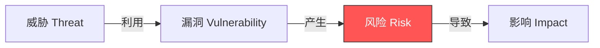
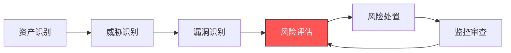
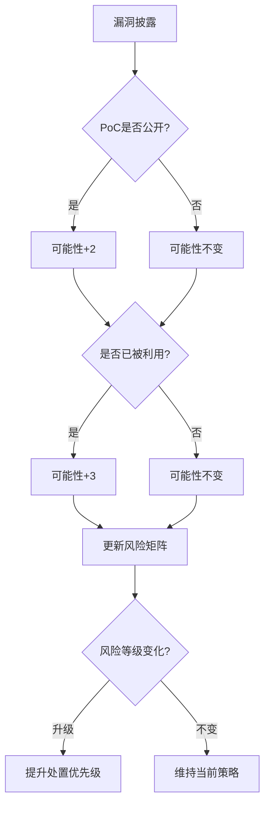
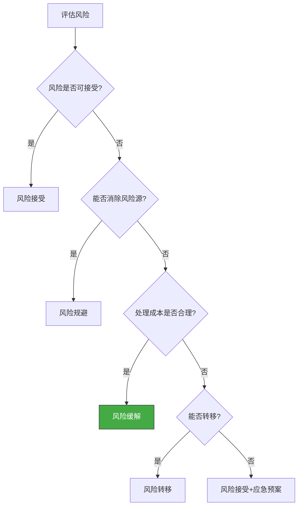
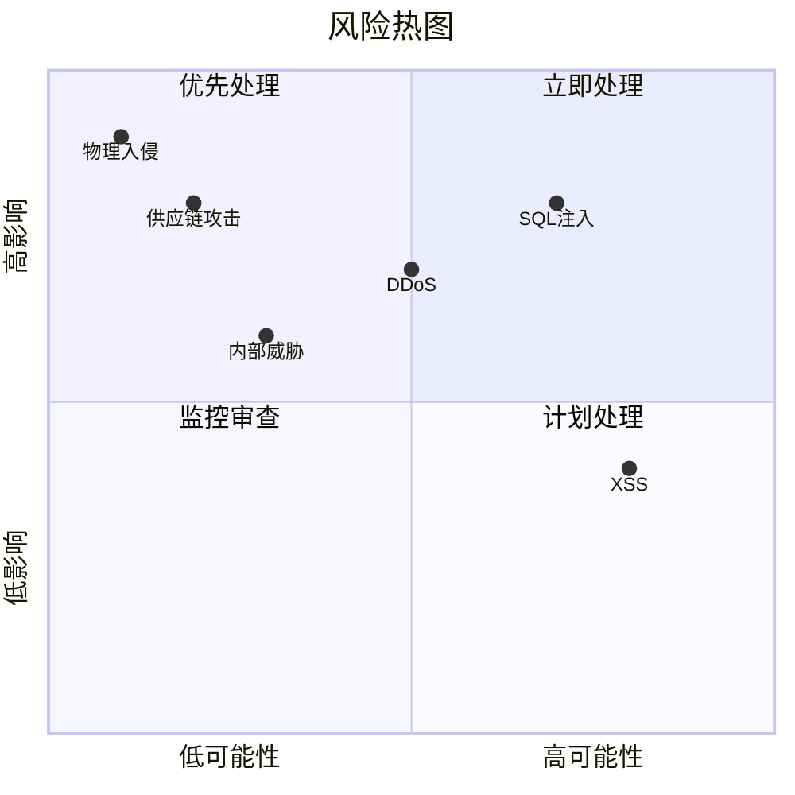
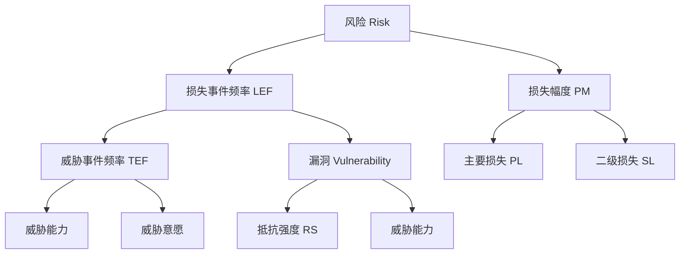
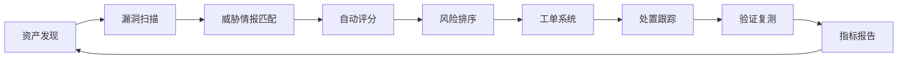

## 五、风险评估法

安全思维的核心目标不是消灭所有漏洞——这既不可能也不经济——而是在有限资源下做出最优的安全决策。风险评估法正是实现这一目标的系统化方法论：它将模糊的安全直觉转化为可量化、可比较、可决策的结构化分析过程。

### 5.1 什么是风险评估

#### 5.1.1 风险的本质定义

在安全领域，**风险（Risk）** 不等于 **漏洞（Vulnerability）**，也不等于 **威胁（Threat）**。三者的关系如下：



- **威胁**：可能对系统造成损害的外部力量（攻击者、自然灾害、内部人员）
- **漏洞**：系统中存在的弱点或缺陷（代码缺陷、配置错误、设计缺陷）
- **风险**：威胁利用漏洞造成损害的可能性和严重程度
- **影响**：风险实际发生后造成的具体损失

一个没有暴露面的漏洞不构成风险，一个没有漏洞的目标也不存在风险。风险评估的核心公式为：

> **风险 = 威胁可能性 × 影响程度**

这个公式看似简单，但每一项的展开都涉及大量判断和数据。

#### 5.1.2 为什么需要风险评估

没有风险评估的安全工作是盲目的：

| 场景 | 无风险评估 | 有风险评估 |
|------|-----------|-----------|
| 资源分配 | 平均用力，高危漏洞被忽视 | 按优先级集中资源处理最关键风险 |
| 安全投入 | 被动响应，成本失控 | 主动规划，投入产出比最优 |
| 决策依据 | 凭经验和直觉 | 数据驱动，可追溯可审计 |
| 合规应对 | 临时突击，漏洞百出 | 持续满足，从容应对 |
| 沟通效率 | 技术语言，管理层不理解 | 量化表达，风险语言通用 |

#### 5.1.3 风险评估在安全生命周期中的位置



风险评估不是一个一次性的活动，而是贯穿系统整个生命周期的持续过程。每一次系统变更、每一次新威胁情报的出现，都可能改变风险评估的结论。

### 5.2 威胁可能性评估

威胁可能性回答的问题是：**"这个风险被触发的概率有多大？"**

#### 5.2.1 评估维度

威胁可能性需要从多个维度综合评估：

**1. 攻击复杂度**

攻击复杂度衡量实施一次成功攻击所需的技术能力和条件：

| 复杂度等级 | 描述 | 示例 |
|-----------|------|------|
| **低** | 无需特殊条件，普通用户即可利用 | XSS反射型、默认密码登录 |
| **中** | 需要一定技术能力或特定条件 | 需要用户交互的CSRF、需要特定配置的SSRF |
| **高** | 需要高级技术能力、特殊条件或稀缺资源 | 内核提权漏洞、需要物理接触的攻击 |

**2. 攻击所需的前提条件**

前提条件越少，攻击可能性越高：

- **无需认证**：任何人都可以尝试利用（最高可能性）
- **需要低权限认证**：普通用户即可利用
- **需要高权限认证**：管理员或特权用户才能利用
- **需要物理访问**：必须接触目标设备
- **需要内部人员配合**：涉及社会工程学

**3. 攻击的自动化程度**

自动化程度直接决定了攻击的规模化能力：

- **可完全自动化**：可编写脚本批量扫描和利用，如永恒之蓝（EternalBlue）
- **半自动化**：需要部分人工判断，如大多数Web漏洞利用
- **需要手工操作**：每个目标都需要定制化攻击链

**4. 已知攻击工具的可用性**

当攻击工具公开后，威胁可能性会急剧上升：


以Log4Shell（CVE-2021-44228）为例：漏洞披露后24小时内Metasploit就集成了利用模块，72小时内出现了大规模自动化扫描，这使得其威胁可能性从"高"迅速飙升至"极高"。

**5. 威胁情报的辅助判断**

现代风险评估不能脱离威胁情报：

- 该漏洞是否已被APT组织利用？
- 暗网上是否有相关的攻击工具或数据在出售？
- 同行业同类型组织是否已遭受攻击？
- 监控数据显示是否有针对该漏洞的扫描活动？

#### 5.2.2 可能性量化标准

| 等级 | 评分 | 判定标准 |
|------|------|---------|
| **极高** | 5 | 已被大规模利用，攻击工具公开，无需特殊条件 |
| **高** | 4 | 已有利用实例，工具可用，需要较少前提条件 |
| **中** | 3 | 理论可行，需要一定技术能力或特定条件 |
| **低** | 2 | 利用难度大，需要高级技术或特殊环境 |
| **极低** | 1 | 理论上存在但几乎不可能利用 |

### 5.3 影响程度评估

影响程度回答的问题是：**"如果风险发生了，损失有多大？"**

#### 5.3.1 评估维度

**1. 数据泄露的范围**

数据是现代组织最核心的资产，泄露范围直接决定影响等级：

| 等级 | 数据类型 | 影响范围 |
|------|---------|---------|
| **极高** | 核心机密（密钥、源代码）、大规模个人敏感数据 | 全组织乃至全行业 |
| **高** | 个人身份信息（PII）、财务数据、商业秘密 | 大量用户或核心业务 |
| **中** | 内部文档、非敏感配置信息 | 部分用户或局部业务 |
| **低** | 公开信息、测试数据 | 极少数用户或无直接影响 |

**2. 服务中断的时间**

可用性是安全三要素（CIA）之一，服务中断的时长和范围直接影响业务：

- **分钟级中断**：对大多数业务可接受，但对高频交易等场景可能是灾难
- **小时级中断**：影响用户体验，可能造成订单流失
- **天级中断**：严重业务影响，可能触发SLA违约赔偿
- **周级中断**：可能导致客户永久流失，业务关系断裂
- **永久中断**：数据不可恢复，业务彻底瘫痪

**3. 财务损失的程度**

财务损失需要考虑直接损失和间接损失：

| 损失类型 | 包含内容 | 估算方法 |
|---------|---------|---------|
| **直接损失** | 赎金支付、数据恢复成本、应急响应费用 | 实际支出 |
| **业务损失** | 营业收入下降、合同违约赔偿 | 营收模型估算 |
| **合规罚款** | GDPR罚款（最高年营收4%）、行业处罚 | 法规条款 |
| **修复成本** | 系统重建、安全加固、第三方审计 | 项目预算 |
| **间接损失** | 股价下跌、客户流失、品牌贬值 | 长期影响模型 |

以Equifax 2017年数据泄露事件为例：直接经济损失超过14亿美元，包括7亿美元的和解金、1.38亿美元的诉讼费、以及数亿美元的系统修复和安全升级费用。这还不包括股价暴跌导致的市值蒸发和长期客户流失。

**4. 声誉损害的影响**

声誉损害是最难量化但影响最深远的损失：

- **客户信任度下降**：调查显示，60%的消费者在数据泄露后会减少或停止使用受影响企业的服务
- **合作伙伴关系受损**：供应链安全审查日趋严格，安全事件可能导致失去商业合作机会
- **人才招聘困难**：安全事件频发的企业难以吸引优秀的安全人才
- **监管关注度上升**：被标记为重点监管对象，面临更频繁的审查

**5. 法律与合规影响**

- 违反数据保护法规（GDPR、个人信息保护法等）可能导致巨额罚款
- 未及时披露安全事件可能面临证券监管处罚
- 涉及关键基础设施的安全事件可能触发国家安全层面的调查
- 集体诉讼风险

#### 5.3.2 影响程度量化标准

| 等级 | 评分 | 判定标准 |
|------|------|---------|
| **极高** | 5 | 导致核心业务永久中断、大规模敏感数据泄露、组织存续受威胁 |
| **高** | 4 | 导致重要业务长时间中断、大量数据泄露、重大财务损失 |
| **中** | 3 | 导致部分业务中断、有限数据泄露、可承受的财务损失 |
| **低** | 2 | 导致轻微业务影响、少量非敏感数据泄露 |
| **极低** | 1 | 几乎无业务影响、仅影响测试或公开数据 |

### 5.4 风险矩阵

风险矩阵是将威胁可能性和影响程度组合起来的可视化工具，是风险评估中最常用的决策辅助手段。

#### 5.4.1 基础风险矩阵

| | 极低影响(1) | 低影响(2) | 中影响(3) | 高影响(4) | 极高影响(5) |
|---|---|---|---|---|---|
| **极高可能性(5)** | 低(5) | 中(10) | 高(15) | 极高(20) | 极高(25) |
| **高可能性(4)** | 低(4) | 中(8) | 高(12) | 高(16) | 极高(20) |
| **中可能性(3)** | 低(3) | 低(6) | 中(9) | 高(12) | 高(15) |
| **低可能性(2)** | 低(2) | 低(4) | 低(6) | 中(8) | 中(10) |
| **极低可能性(1)** | 低(1) | 低(2) | 低(3) | 低(4) | 低(5) |

风险等级划分：
- **极高风险（20-25）**：必须立即处理，启动应急响应
- **高风险（12-19）**：优先处理，在下一个迭代/季度内解决
- **中风险（6-11）**：计划处理，在半年内解决
- **低风险（1-5）**：接受或监控，定期审查

#### 5.4.2 改进的OWASP风险矩阵

OWASP（开放Web应用安全项目）提出了一个更为精细的风险计算方法：

> **Risk = Likelihood × Impact**

其中Likelihood和Impact各自由多个因子加权计算：

```text
威胁可能性 = (攻击者动机 + 攻击者能力 + 攻击面大小 + 漏洞利用难度) / 4
影响程度   = (技术影响 + 业务影响 + 合规影响) / 3
```

每个因子按1-9评分，最终风险值在1-81之间，对应五个等级。

#### 5.4.3 动态风险矩阵

实际环境中，风险不是静态的。动态风险矩阵考虑时间因素：



### 5.5 风险处置策略

识别和评估风险只是第一步，关键是做出正确的处置决策。ISO 27005定义了四种基本的风险处置策略：

#### 5.5.1 四种处置策略

**1. 风险缓解（Mitigate）**

采取措施降低威胁可能性或影响程度。这是最常见的处置方式：

| 缓解方向 | 具体措施 | 效果 |
|---------|---------|------|
| 降低可能性 | 修补漏洞、加强认证、网络隔离 | 减少被攻击的概率 |
| 降低影响 | 数据加密、备份策略、访问控制 | 即使被攻击也能限制损失 |
| 增强检测 | 入侵检测、日志审计、行为监控 | 缩短发现和响应时间 |

**2. 风险转移（Transfer）**

将风险的财务后果转移给第三方：

- **网络安全保险**：覆盖数据泄露、勒索软件等事件的直接经济损失
- **外包服务**：将高风险功能交给专业安全公司运营
- **合同条款**：在SLA和合同中明确责任边界和赔偿机制

注意：风险转移不等于风险消除。即使购买了保险，数据泄露的声誉损害仍然由组织自己承担。

**3. 风险接受（Accept）**

当风险在可接受范围内，或处理成本远超风险可能造成的损失时，可以选择接受风险：

- **有意识接受**：经过评估后，明确记录并定期审查
- **被动接受**：未识别到的风险，这是最危险的情况

风险接受的前提条件：
- 风险已被充分评估
- 管理层已知情并批准
- 已制定应急预案
- 定期重新评估

**4. 风险规避（Avoid）**

通过消除产生风险的根源来彻底避免风险：

- 不存储不必要的敏感数据
- 不上线非核心的高风险功能
- 不使用已知存在系统性安全问题的技术栈
- 关闭不必要的服务和端口

#### 5.5.2 处置策略选择决策树



### 5.6 风险排序与优先级

在识别出多个风险后，需要进行排序以确定处理优先级。排序不是简单地按风险分数从高到低排列，还需要考虑以下因素：

#### 5.6.1 多维度排序模型

| 排序因素 | 权重 | 说明 |
|---------|------|------|
| 风险等级 | 35% | 基于风险矩阵的综合评分 |
| 修复成本 | 20% | 包括技术成本、人力成本、业务中断成本 |
| 时间紧迫性 | 20% | 漏洞是否已被利用、是否有公开PoC |
| 业务影响 | 15% | 对核心业务流程的影响程度 |
| 合规要求 | 10% | 是否有法规强制要求的修复时限 |

#### 5.6.2 快速排序决策

当需要快速决策时，可以使用以下简化规则：

1. **已被利用的漏洞 > 理论漏洞**：无论风险分数如何，正在被利用的漏洞必须优先处理
2. **面向互联网的资产 > 内部资产**：暴露面越大，优先级越高
3. **影响核心业务 > 影响边缘业务**：业务关键性是硬约束
4. **合规强制要求 > 自主优化**：先满足法律底线
5. **低成本高收益 > 高成本低收益**：优先处理投入产出比最优的风险

#### 5.6.3 风险热图

将所有已识别的风险绘制在可能性-影响二维图上，可以直观地看到风险分布：



### 5.7 行业标准与框架

风险评估不是凭空创造，业界已经建立了成熟的标准框架：

#### 5.7.1 主流框架对比

| 框架 | 组织 | 适用场景 | 特点 |
|------|------|---------|------|
| **ISO 27005** | ISO | 通用信息安全 | 系统全面，国际通用 |
| **NIST SP 800-30** | NIST | 美国联邦机构 | 步骤清晰，可操作性强 |
| **OCTAVE** | CMU SEI | 组织级风险评估 | 关注资产和威胁的关系 |
| **FAIR** | FAIR Institute | 定量风险分析 | 概率统计方法，量化精确 |
| **OWASP** | OWASP | Web应用安全 | 聚焦Web风险，社区驱动 |
| **CVSS** | FIRST | 漏洞评分 | 标准化漏洞严重度评估 |

#### 5.7.2 CVSS评分系统详解

CVSS（Common Vulnerability Scoring System）是最广泛使用的漏洞评分标准，当前版本为CVSS v4.0：

**基础指标组（Base Metrics）：**

| 指标 | 取值 | 说明 |
|------|------|------|
| 攻击向量(AV) | N/A/L/P | 网络/相邻/本地/物理 |
| 攻击复杂度(AC) | L/H | 低/高 |
| 所需权限(PR) | N/L/H | 无/低/高 |
| 用户交互(UI) | N/R | 无/需要 |
| 范围(S) | U/C | 不变/改变 |
| 机密性(C) | H/N/L | 高/无/低 |
| 完整性(I) | H/N/L | 高/无/低 |
| 可用性(A) | H/N/L | 高/无/低 |

评分范围：0.0（最低）到 10.0（最高），对应四个等级：
- **严重（Critical）**：9.0-10.0
- **高危（High）**：7.0-8.9
- **中危（Medium）**：4.0-6.9
- **低危（Low）**：0.1-3.9

**实际应用示例——Log4Shell（CVE-2021-44228）CVSS评分：**

```text
CVSS:3.1/AV:N/AC:L/PR:N/UI:N/S:C/C:H/I:H/A:H → 10.0（严重）
```

解析：网络可达（AV:N）、低复杂度（AC:L）、无需权限（PR:N）、无需用户交互（UI:N）、范围改变（S:C）、机密性/完整性/可用性全部高影响（C:H/I:H/A:H）。这个10.0分完美反映了Log4Shell的极端危险性。

### 5.8 FAIR定量风险分析方法

FAIR（Factor Analysis of Information Risk）是目前最成熟的定量风险分析框架，它将风险从定性判断推进到概率统计层面。

#### 5.8.1 FAIR的核心模型

FAIR将风险分解为损失事件频率（LEF）和损失幅度（PM）两个主要因子：

```text
风险 = 损失事件频率(LEF) × 损失幅度(PM)

LEF = 威胁事件频率(TEF) × 漏洞(Vulnerability)
PM  = 主要损失(PL) + 二级损失(SL)
```



#### 5.8.2 FAIR的定量方法

FAIR使用蒙特卡洛模拟来处理不确定性：

1. **收集数据**：为每个因子估计最小值、最可能值、最大值
2. **选择分布**：通常使用对数正态分布或PERT分布
3. **运行模拟**：生成10,000+次随机模拟
4. **分析结果**：输出概率分布曲线，包括平均值、中位数和置信区间

**示例输出**：

```text
年预期损失（ALE）分布：
  - 5%分位数：  $50,000
  - 中位数：    $200,000
  - 平均值：    $350,000
  - 95%分位数：  $800,000
  
解释：有95%的把握，年损失不会超过80万美元。
```

这种输出比"高风险"这样的定性描述更能支持管理层的决策。

### 5.9 实战：Web应用风险评估完整案例

以下以一个典型的电商Web应用为例，演示完整的风险评估流程。

#### 5.9.1 资产识别

| 资产 | 类型 | 价值 | 敏感度 |
|------|------|------|--------|
| 用户数据库 | 数据 | 高 | 高（含PII和支付信息） |
| 订单系统 | 业务系统 | 高 | 中 |
| 支付网关集成 | 接口 | 极高 | 极高 |
| 前端Web服务器 | 基础设施 | 中 | 低 |
| 管理后台 | 业务系统 | 高 | 高 |

#### 5.9.2 威胁识别与评估

**风险1：SQL注入 → 用户数据库泄露**

| 维度 | 评分 | 依据 |
|------|------|------|
| 攻击复杂度 | 低(1) | 有自动化工具如sqlmap |
| 前提条件 | 无需认证(1) | 搜索和登录页面均暴露 |
| 自动化程度 | 高(1) | 完全自动化 |
| 工具可用性 | 极高(1) | sqlmap开源免费 |
| **可能性评分** | **5（极高）** | |
| 数据泄露范围 | 极高(5) | 全部用户PII和支付信息 |
| 财务损失 | 极高(5) | 违规罚款+赔偿+修复 |
| 声誉损害 | 高(4) | 用户信任丧失 |
| **影响评分** | **5（极高）** | |
| **风险等级** | **25（极高）** | 必须立即处理 |

**风险2：XSS → 会话劫持**

| 维度 | 评分 | 依据 |
|------|------|------|
| 攻击复杂度 | 低(1) | 反射型XSS常见 |
| 前提条件 | 需用户交互(2) | 需要用户点击恶意链接 |
| 自动化程度 | 中(2) | 可批量发送但需定制 |
| 工具可用性 | 高(1) | Burp Suite等 |
| **可能性评分** | **4（高）** | |
| 数据泄露范围 | 中(3) | 单用户会话 |
| 服务中断 | 低(2) | 不影响服务可用性 |
| 财务损失 | 中(3) | 有限赔偿 |
| **影响评分** | **3（中）** | |
| **风险等级** | **12（高）** | 优先处理 |

**风险3：DDoS → 服务中断**

| 维度 | 评分 | 依据 |
|------|------|------|
| 攻击复杂度 | 低(1) | 租用僵尸网络即可 |
| 前提条件 | 无需认证(1) | 面向互联网 |
| 自动化程度 | 高(1) | 完全自动化 |
| 工具可用性 | 极高(1) | DDoS-as-a-Service |
| **可能性评分** | **4（高）** | |
| 服务中断 | 高(4) | 可能持续数小时 |
| 财务损失 | 高(4) | 营收损失+CDN费用 |
| 声誉损害 | 中(3) | 用户体验下降 |
| **影响评分** | **4（高）** | |
| **风险等级** | **16（高）** | 优先处理 |

#### 5.9.3 风险排序与处置

| 优先级 | 风险 | 等级 | 处置策略 | 预计成本 |
|--------|------|------|---------|---------|
| 1 | SQL注入 | 极高(25) | 缓解：参数化查询+WAF | 2周开发+1万/年WAF |
| 2 | DDoS | 高(16) | 转移：CDN防护服务 | 5万/年CDN |
| 3 | XSS | 高(12) | 缓解：CSP+输出编码 | 1周开发 |
| 4 | 管理后台暴露 | 中(9) | 规避：VPN+IP白名单 | 2天配置 |
| 5 | 日志泄露 | 中(6) | 接受：监控+定期审查 | 已有 |

### 5.10 常见误区与纠正

#### 误区一：只关注技术风险，忽视人为因素

很多安全团队只评估技术漏洞，却忽视了社会工程、内部威胁等人为因素。事实上，Verizon DBIR报告显示，超过80%的数据泄露涉及人为因素。

**纠正**：风险评估必须覆盖技术风险、人员风险、流程风险和第三方风险四大维度。

#### 误区二：追求精确数字，忽视判断质量

过度追求精确的风险数值（如"这个风险的概率是23.7%"）会让人忽视判断本身的质量。风险评估的价值不在于精确的数字，而在于系统化的思考过程和一致的评估标准。

**纠正**：使用相对等级（高/中/低）比虚假的精确数字更有意义。关键是一致性和可比较性。

#### 误区三：一次评估，终身使用

风险是动态变化的。新的漏洞披露、新的攻击技术出现、业务环境变化、安全措施实施，都会改变风险格局。

**纠正**：建立定期评估机制（至少年度），并在重大变更时触发重新评估。

#### 误区四：风险矩阵过于简化

将所有风险压缩到一个简单的高/中/低矩阵中，可能丢失重要信息。一个"高风险"可能是高可能性+低影响，另一个"高风险"可能是低可能性+高影响，两者的处置策略完全不同。

**纠正**：使用多维度评估模型，保留每个维度的详细信息，不要过早压缩。

#### 误区五：忽视残余风险

实施安全措施后的残余风险往往被忽视。没有任何安全措施是100%有效的，WAF可能被绕过，防火墙可能被突破。

**纠正**：评估缓解措施的有效性，计算残余风险，并确保残余风险在可接受范围内。

#### 误区六：评估与处置脱节

评估做了一大堆报告，但处置措施没有落地，或者处置措施没有被跟踪和验证。

**纠正**：将风险评估与安全运营流程紧密结合，每个风险都必须有明确的处置计划、责任人和时间线。

### 5.11 进阶：构建组织级风险评估体系

#### 5.11.1 风险评估成熟度模型

| 级别 | 名称 | 特征 | 适用规模 |
|------|------|------|---------|
| 1级 | 临时评估 | 出了事才评估，凭经验判断 | 初创/小型 |
| 2级 | 基础评估 | 有定期评估，使用简单矩阵 | 中小型 |
| 3级 | 系统评估 | 标准化流程，多维度评估 | 中型 |
| 4级 | 量化评估 | 定量分析，数据驱动 | 大型 |
| 5级 | 持续评估 | 实时风险感知，自动化评估 | 企业级 |

#### 5.11.2 自动化风险评估工具

| 工具 | 类型 | 适用场景 |
|------|------|---------|
| **Nessus** | 漏洞扫描 | 自动发现漏洞并评分 |
| **Qualys** | 云安全评估 | 持续漏洞管理和合规 |
| **OpenVAS** | 开源漏洞扫描 | 中小企业漏洞评估 |
| **DefectDojo** | 漏洞管理 | 汇总多源漏洞数据 |
| **Microsoft Threat Modeling Tool** | 威胁建模 | 架构设计阶段 |
| **OWASP Threat Dragon** | 威胁建模 | 开源免费威胁建模 |

#### 5.11.3 风险评估自动化流程



将风险评估集成到CI/CD管道中，实现开发阶段的安全左移：

```yaml
# 示例：GitHub Actions中的风险评估集成
name: Security Risk Assessment
on: [push, pull_request]
jobs:
  risk-assessment:
    runs-on: ubuntu-latest
    steps:
      - uses: actions/checkout@v4
      - name: SAST扫描
        uses: github/codeql-action/analyze@v3
      - name: 依赖漏洞检查
        uses: aquasecurity/trivy-action@master
      - name: 容器镜像扫描
        uses: aquasecurity/trivy-action@master
        with:
          image-ref: '${{ github.repository }}:${{ github.sha }}'
      - name: 风险评估报告
        run: python scripts/risk_assessment.py --output report.html
```

### 5.12 思维练习

**练习1：评估你身边的系统**

选择你日常使用的一个系统（如个人邮箱、公司内部系统、某个App），完成以下评估：
- 识别Top 5资产
- 列出Top 5威胁
- 为每个威胁评估可能性和影响
- 绘制风险矩阵
- 提出处置建议

**练习2：历史案例复盘**

选择一个知名安全事件（如Equifax泄露、SolarWinds供应链攻击），尝试复盘：
- 事件中的关键风险是什么？
- 用CVSS评分该漏洞
- 如果你是该组织的安全负责人，在事件发生前你会如何评估和处置这个风险？
- 事件后的处置措施是否合理？

**练习3：定量分析练习**

假设你的组织面临以下风险场景：
- 某Web应用存在SQL注入漏洞
- 估计每周有约1000次SQL注入尝试
- 约1%的尝试可能成功
- 成功的攻击可能导致约10万条用户记录泄露
- 每条泄露记录的平均损失约为$150

使用FAIR方法估算年预期损失（ALE），并与购买WAF（$30,000/年）+代码修复（一次性$20,000）的成本进行比较，做出处置决策。

---

> **核心要点**：风险评估法是安全思维的"决策引擎"——它将模糊的安全直觉转化为可比较、可决策的结构化信息。掌握风险评估，意味着你不再是在黑暗中摸索，而是有地图、有指南针的安全决策者。记住：完美的安全不存在，但最优的安全决策可以通过系统化的风险评估来实现。
