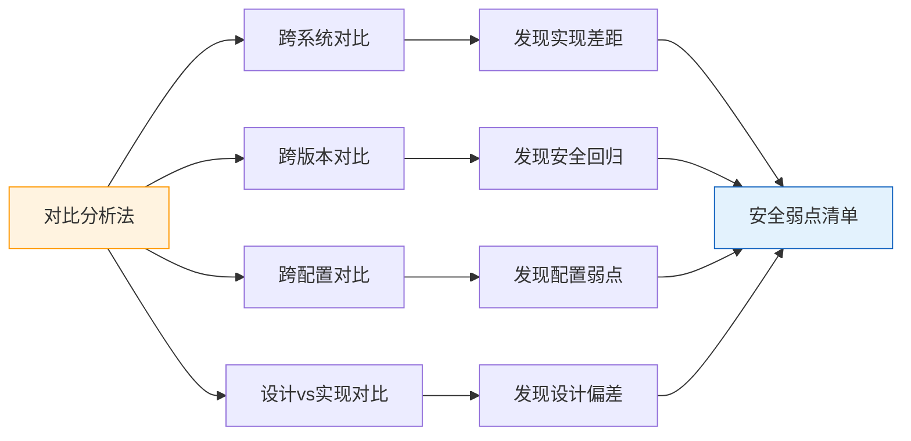
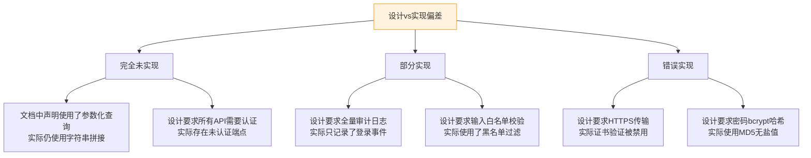
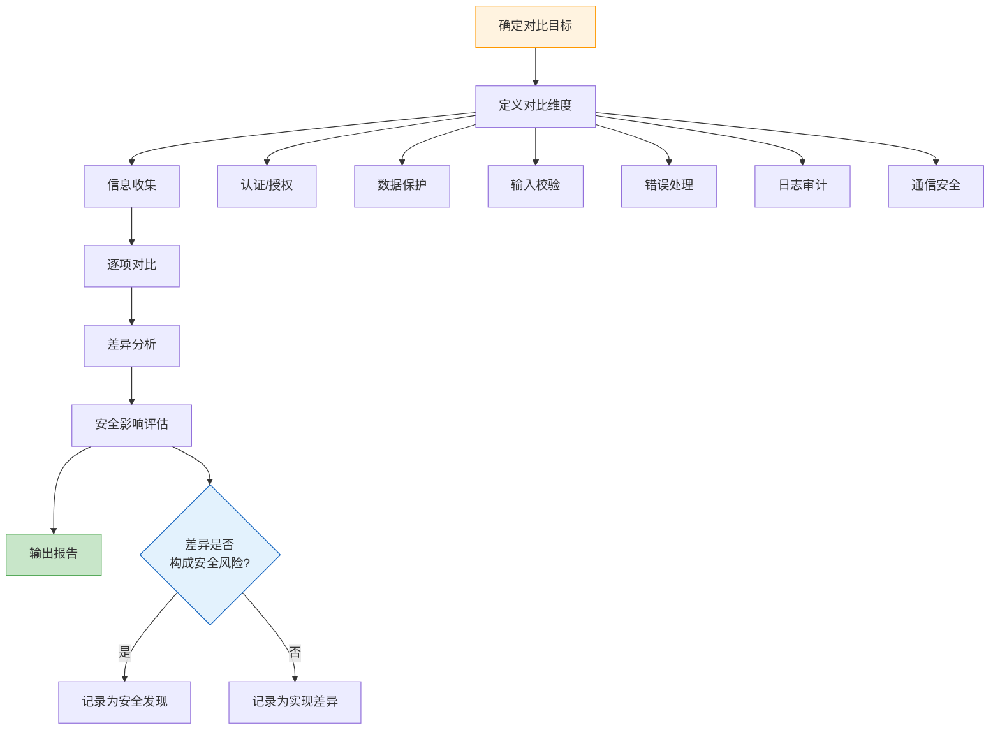
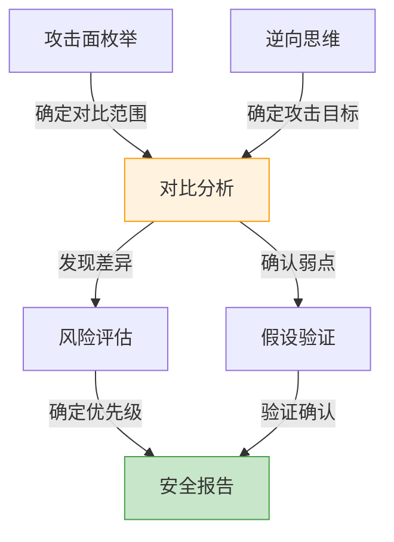

## 六、对比分析法

对比分析法是安全思维中一种极具实战价值的系统化方法论。其核心理念是：**通过比较两个或多个相似系统在安全实现上的差异，发现潜在的安全弱点和设计缺陷**。这种方法之所以有效，是因为同一功能的安全实现往往存在多种方案，而不同方案之间的差异恰恰暴露了各自的安全短板。

与逆向思维（从攻击者视角倒推）不同，对比分析法是从**横向比较**中找差异——差异即弱点。在实际渗透测试和安全评估中，这种方法常被忽略，但它能高效地发现那些"开发者觉得已经足够好、但实际存在明显差距"的安全缺陷。

### 6.1 为什么对比分析有效

对比分析的有效性建立在几个安全领域的基本观察之上：

**观察一：相同功能，不同实现**

实现同一业务功能（如用户认证、文件上传、支付处理）的系统，开发团队的技术水平、安全意识、预算约束各不相同，导致安全实现的成熟度存在显著差异。攻击者天然会关注那个"最弱的实现"。

**观察二：同一系统的版本演进引入回归**

系统升级过程中，新版本可能引入新功能，但旧版本中已修复的安全问题可能因为代码重构而在新版本中重新出现（安全回归）。版本间对比是发现这类问题的最直接手段。

**观察三：配置差异暴露默认风险**

同一软件在不同部署环境下的配置差异，往往暴露了默认配置的安全隐患。当某个环境关闭了某项安全特性（如 HTTPS 强制跳转、CSP 策略）时，攻击者就有了可乘之机。

**观察四：理论与实现的鸿沟**

系统设计文档中描述的安全机制，与代码实际实现之间经常存在偏差。对比设计文档与实际行为，是发现"承诺了但没做到"的安全缺陷的有效途径。



### 6.2 对比分析的四个维度

#### 6.2.1 维度一：跨系统对比

比较实现相同或相似功能的不同系统，发现各自的安全实现差异。

**对比要素清单：**

| 对比要素 | 说明 | 示例 |
|---------|------|------|
| 认证机制 | 身份验证的实现方式 | 密码认证 vs 多因素认证 vs 无密码认证 |
| 数据传输 | 数据在网络中的保护方式 | HTTP vs HTTPS vs HTTPS + Certificate Pinning |
| 输入校验 | 对用户输入的处理方式 | 前端校验 vs 前后端双重校验 vs 白名单校验 |
| 错误处理 | 异常情况的信息暴露 | 详细堆栈 vs 通用错误消息 vs 错误码 |
| 会话管理 | 会话令牌的安全管理 | 自增ID vs UUID vs JWT + 签名 |
| 审计日志 | 安全事件的记录范围 | 无日志 vs 关键操作日志 vs 全量审计 |
| 访问控制 | 权限粒度和实现方式 | 角色级控制 vs 属性级控制 vs ABAC |

**实操方法：**

对两个目标系统分别执行相同的安全测试用例，记录行为差异。以 Web 应用认证功能为例：

```python
# 对比测试脚本框架
import requests

def compare_auth_mechanisms(target_a, target_b):
    """对比两个系统的认证实现差异"""
    results = {"target_a": {}, "target_b": {}}

    for name, target in [("target_a", target_a), ("target_b", target_b)]:
        # 测试1: 是否支持暴力破解防护
        for i in range(10):
            resp = requests.post(f"{target}/login",
                data={"username": "admin", "password": f"wrong{i}"})
            if i == 9:
                results[name]["brute_force"] = {
                    "status": resp.status_code,
                    "locked_out": "locked" in resp.text.lower(),
                    "rate_limited": resp.status_code == 429
                }

        # 测试2: 密码错误时的错误消息
        resp = requests.post(f"{target}/login",
            data={"username": "admin", "password": "wrong"})
        results[name]["error_msg"] = resp.text[:200]

        # 测试3: 是否存在账号枚举
        resp_user = requests.post(f"{target}/login",
            data={"username": "nonexistent_user_xyz", "password": "test"})
        resp_admin = requests.post(f"{target}/login",
            data={"username": "admin", "password": "test"})
        results[name]["enum_diff"] = resp_user.text != resp_admin.text

    # 输出差异
    for key in results["target_a"]:
        val_a = results["target_a"][key]
        val_b = results["target_b"][key]
        if val_a != val_b:
            print(f"[DIFF] {key}:")
            print(f"  A: {val_a}")
            print(f"  B: {val_b}")
```

#### 6.2.2 维度二：跨版本对比

比较同一系统的不同版本，发现安全回归和新增攻击面。

**对比策略：**

1. **API 端点对比**：通过目录爆破或 OpenAPI 文档，对比新旧版本暴露的端点
2. **响应头对比**：检查安全头（CSP、HSTS、X-Frame-Options）在版本间的变化
3. **参数对比**：同一接口在不同版本中接受的参数差异
4. **权限模型对比**：不同版本对相同资源的访问控制是否一致

```bash
# 使用 diff 对比两个版本的 API 端点
# 从 OpenAPI 文档提取端点列表
jq '.paths | keys[]' api_v1.json | sort > endpoints_v1.txt
jq '.paths | keys[]' api_v2.json | sort > endpoints_v2.txt
diff endpoints_v1.txt endpoints_v2.txt

# 对比 HTTP 响应安全头
for url in "https://v1.example.com" "https://v2.example.com"; do
    echo "=== $url ==="
    curl -sI "$url" | grep -iE '(strict-transport|content-security|x-frame|x-content-type|x-xss|referrer-policy|permissions-policy)'
done
```

**版本对比的经典发现：**

- V1 中已修复的 SQL 注入在 V2 重写后重新出现
- V2 新增的 API 端点缺少 V1 中已有的权限校验
- V2 引入的新特性（如文件上传）扩大了攻击面
- V2 更换了 Web 框架但沿用了旧框架的安全配置，导致防护失效

#### 6.2.3 维度三：跨配置对比

比较同一系统在不同部署环境或配置下的安全表现。

**常见的配置差异点：**

| 配置项 | 生产环境 | 测试环境 | 安全风险 |
|-------|---------|---------|---------|
| 调试模式 | 关闭 | 开启 | 测试环境泄露详细错误信息 |
| CORS 策略 | 限制域名 | 允许所有来源 | 测试环境可被跨域利用 |
| 数据库凭据 | 独立账号，最小权限 | root/管理员 | 测试环境数据泄露影响范围大 |
| 日志级别 | WARN/ERROR | DEBUG | 测试环境日志包含敏感信息 |
| 访问限制 | IP 白名单 | 无限制 | 测试环境可能直接暴露在公网 |
| HTTPS | 强制 | 可选 | 测试环境可能以 HTTP 传输敏感数据 |
| 速率限制 | 启用 | 关闭 | 测试环境可被暴力破解 |

**自动化配置对比：**

```bash
#!/bin/bash
# compare_security_headers.sh
# 对比同一应用在不同环境下的安全配置

ENVIRONMENTS=("prod.example.com" "staging.example.com" "dev.example.com")

echo "| Header | ${ENVIRONMENTS[*]} |" | tr ' ' ' | '
echo "|--------|$(printf '--------|%.0s' "${ENVIRONMENTS[@]}")"

for header in "strict-transport-security" "content-security-policy" \
    "x-frame-options" "x-content-type-options" "referrer-policy"; do
    row="| $header |"
    for env in "${ENVIRONMENTS[@]}"; do
        value=$(curl -sI "https://$env" | grep -i "^$header:" | cut -d: -f2- | tr -d '\r')
        row+=" ${value:-MISSING} |"
    done
    echo "$row"
done
```

#### 6.2.4 维度四：设计与实现对比

对比系统的安全设计文档与实际实现，发现"承诺了但没做到"的安全缺陷。

**操作步骤：**

1. **收集设计文档**：安全架构文档、威胁建模报告、安全需求规格
2. **提取安全需求清单**：从文档中逐条提取安全控制措施
3. **实际验证**：逐一验证每项安全措施是否在代码/配置中实现
4. **记录偏差**：将未实现或实现不完整的安全措施记录为发现

**偏差分类：**



### 6.3 实战案例详解

#### 案例一：电商平台支付功能对比

网站 A 和网站 B 都实现了在线支付功能，通过系统化对比发现：

| 安全特性 | 网站 A | 网站 B | 安全差距分析 |
|---------|-------|-------|------------|
| 支付令牌化 | 使用支付令牌，卡号不经过商户服务器 | 直接传输原始银行卡号 | B 存在 PCI DSS 合规风险，卡号在传输和存储中暴露 |
| 交易签名 | 每笔交易附带 HMAC 签名 | 仅依赖 HTTPS | B 的交易数据可被中间人篡改（若 HTTPS 降级） |
| 重放防护 | 包含时间戳 + 随机 nonce | 无重放保护 | B 可被重放攻击，同一笔交易可被多次提交 |
| 回调验证 | 验证支付网关回调签名 | 信任所有回调请求 | B 攻击者可伪造支付成功回调 |
| 金额校验 | 服务端从数据库读取订单金额 | 使用客户端提交的金额 | B 可被篡改支付金额（0元购） |
| 审计日志 | 记录完整交易流水含异常 | 只记录成功交易 | B 的异常交易无法被追溯和告警 |

**关键发现：** 网站 B 存在至少 5 个可被直接利用的安全弱点，其中金额篡改（客户端金额）和回调伪造是最严重的问题，可直接导致资金损失。

#### 案例二：同一应用的 API 版本对比

某 SaaS 平台同时维护 V1 和 V2 两套 API，通过对比发现：

```bash
# V1 认证端点
POST /v1/users/login
# 响应：{"token": "jwt...", "user": {"id": 1, "role": "admin"}}

# V2 认证端点
POST /v2/auth/login
# 响应：{"access_token": "jwt...", "refresh_token": "jwt..."}

# 对比发现：
# 1. V1 返回用户完整信息（含 role），V2 只返回令牌 → V1 信息泄露
# 2. V2 有 refresh_token 机制，V1 没有 → V1 令牌过期后需要重新登录
# 3. V1 JWT 无过期时间，V2 有 → V1 的令牌永久有效
```

进一步发现 V2 新增了 `/v2/admin/users` 端点，但 V1 的 `/v1/admin/users` 仍然存在且**权限校验更宽松**——V2 需要 `admin` 角色，V1 只需要有效令牌。攻击者可以绕过 V2 的权限控制，通过 V1 端点访问相同的数据。

#### 案例三：开源 CMS 版本安全对比

以 WordPress 为例，对比 5.x 和 6.x 版本的安全差异：

| 安全特性 | WordPress 5.x | WordPress 6.x | 影响 |
|---------|--------------|---------------|------|
| REST API 认证 | 默认暴露用户端点 | 需要权限才能列出用户 | 5.x 允许用户枚举 |
| XML-RPC | 默认启用 | 可通过配置禁用 | 5.x 更易被暴力破解 |
| 自动更新 | 仅小版本自动更新 | 支持插件自动更新 | 6.x 减少了未打补丁插件的暴露窗口 |
| 内容安全策略 | 无默认 CSP | 编辑器区域沙箱化 | 5.x 存储型 XSS 风险更高 |

### 6.4 对比分析的系统化流程

将对比分析从"凭经验发现"提升为"系统化方法"，需要遵循以下流程：



**第一步：确定对比目标**

选择对比对象时，优先考虑：
- 同一业务功能的不同实现（如不同支付网关的集成）
- 同一系统的不同版本（如 API V1 vs V2）
- 同一系统的不同环境（如生产 vs 测试 vs 开发）
- 竞品或同类产品的安全实现

**第二步：定义对比维度**

根据目标类型选择对比维度：

| 对比类型 | 核心维度 | 补充维度 |
|---------|---------|---------|
| 跨系统 | 认证、授权、数据保护 | 错误处理、日志、配置 |
| 跨版本 | 新增端点、权限模型、安全头 | 依赖版本、已知 CVE |
| 跨配置 | 调试模式、CORS、速率限制 | 日志级别、访问控制 |
| 设计vs实现 | 安全需求清单 | 安全架构决策 |

**第三步：信息收集**

- 跨系统：通过正常业务流程交互，记录请求/响应差异
- 跨版本：使用 API 文档、变更日志、开源代码仓库
- 跨配置：访问不同环境实例，对比 HTTP 响应头和行为
- 设计vs实现：获取设计文档，对照代码和运行时行为

**第四步：逐项对比与差异分析**

使用对比矩阵记录每一项的差异：

```markdown
| 对比项 | 目标A | 目标B | 差异 | 安全影响 |
|-------|------|------|------|---------|
| 认证方式 | OAuth 2.0 + PKCE | API Key | A更安全 | B的API Key可被截获 |
| 传输加密 | TLS 1.3 | TLS 1.0 | B过时 | B可被降级攻击 |
| 输入校验 | 服务端白名单 | 无校验 | B缺失 | B存在注入风险 |
```

**第五步：安全影响评估**

对每项差异进行安全影响分级：
- **严重**：可直接导致数据泄露或资金损失（如缺失认证、明文传输密码）
- **高危**：可被利用扩大攻击面（如缺失速率限制、详细错误信息）
- **中危**：增加了攻击成功概率（如缺失安全头、弱加密算法）
- **低危**：需要配合其他漏洞才能利用（如日志不完整）

### 6.5 对比分析工具箱

| 工具 | 用途 | 典型用法 |
|------|------|---------|
| `diff` / `vimdiff` | 文件/配置对比 | 对比两个版本的配置文件 |
| `curl` + 自定义脚本 | HTTP 响应对比 | 对比不同环境的安全头和行为 |
| Burp Suite Comparer | HTTP 请求/响应对比 | 对比不同版本的 API 响应 |
| Nmap | 服务发现与版本对比 | 对比不同环境开放的端口和服务版本 |
| OWASP ZAP | 自动化扫描对比 | 对比两次扫描结果的差异 |
| Semgrep / CodeQL | 代码级对比 | 对比不同版本的安全代码模式 |
| `jq` + `diff` | JSON/API 对比 | 对比两个 API 文档的结构差异 |
| Git diff | 代码版本对比 | 对比代码变更中的安全影响 |

**Burp Suite Comparer 使用流程：**

1. 在 Proxy 中捕获两个目标系统的相同请求
2. 右键选择"Send to Comparer"
3. 在 Comparer 中选择"Words"或"Bytes"对比模式
4. 高亮显示差异区域，重点关注：
   - 响应头差异（安全头缺失）
   - 响应体差异（信息泄露、错误处理）
   - 状态码差异（权限校验行为）

### 6.6 常见误区与纠正

**误区一：只看表面差异，不分析安全影响**

> 错误做法：发现两个系统的响应时间不同，花大量时间分析
> 正确做法：聚焦安全相关的差异——认证、授权、加密、输入校验、错误处理

**误区二：对比对象选择不当**

> 错误做法：对比一个博客系统和一个银行系统的安全实现
> 正确做法：对比的对象应有可比性——相同功能、相同业务场景、相同威胁模型。不可比的对比只会得出"大系统比小系统安全"的无用结论。

**误区三：忽略安全特性的交互效应**

> 错误做法：逐项对比后简单计数"A有10项安全特性，B有7项，所以A更安全"
> 正确做法：分析安全特性之间的协同作用。例如，即使B的认证方式较弱，但如果B的网络隔离做得极好，实际风险可能低于认证更强但暴露在公网的A。

**误区四：对比结果不验证**

> 错误做法：看到A使用了HTTPS就认为通信安全
> 正确做法：实际验证——HTTPS是否强制跳转？证书是否有效？是否支持TLS 1.3？是否存在SSL Stripping风险？

**误区五：静态对比忽略动态行为**

> 错误做法：只对比配置文件和文档
> 正确做法：实际运行两个系统，对比运行时行为。某些安全差异只在特定条件下才会显现（如高并发下的竞态条件、特定输入触发的异常路径）。

### 6.7 进阶技巧

#### 6.7.1 差分模糊测试（Differential Fuzzing）

将对比分析与模糊测试结合：向两个相似系统发送相同的随机/畸形输入，对比它们的响应差异。响应差异往往暴露了处理逻辑中的安全缺陷。

```python
import subprocess
import hashlib

def differential_fuzz(target_a, target_b, input_generator, num_requests=1000):
    """对两个目标执行差分模糊测试"""
    diffs = []

    for i in range(num_requests):
        payload = input_generator()

        resp_a = send_request(target_a, payload)
        resp_b = send_request(target_b, payload)

        # 比较状态码
        if resp_a.status_code != resp_b.status_code:
            diffs.append({
                "type": "status_code_diff",
                "payload": payload,
                "a_status": resp_a.status_code,
                "b_status": resp_b.status_code
            })

        # 比较响应体哈希
        hash_a = hashlib.md5(resp_a.content).hexdigest()
        hash_b = hashlib.md5(resp_b.content).hexdigest()
        if hash_a != hash_b:
            # 检查差异是否涉及安全相关信息
            if any(keyword in resp_a.text or keyword in resp_b.text
                   for keyword in ["error", "exception", "stack", "debug", "sql"]):
                diffs.append({
                    "type": "security_relevant_diff",
                    "payload": payload,
                    "a_snippet": resp_a.text[:200],
                    "b_snippet": resp_b.text[:200]
                })

    return diffs
```

#### 6.7.2 供应链对比分析

对比同一依赖库的不同版本或不同实现的安全差异：

- 对比 `lodash` 和 `underscore` 的原型链处理方式（原型污染差异）
- 对比不同 JSON 解析库对嵌套深度和特殊字符的处理
- 对比不同 JWT 库对算法混淆攻击的防护

#### 6.7.3 跨协议对比

将同一功能在不同协议下的安全实现进行对比：

| 功能 | REST API | GraphQL | gRPC |
|------|---------|---------|------|
| 数据过滤 | 后端控制返回字段 | 客户端可查询任意字段 | Proto 定义固定结构 |
| 注入风险 | SQL/NoSQL 注入 | GraphQL 注入 | 较少（二进制协议） |
| 批量查询 | 受端点设计限制 | 可在单请求中嵌套大量查询 | 受 proto 定义限制 |
| 速率限制 | 按端点/按IP | 难以按查询复杂度限制 | 按方法调用 |

这种跨协议对比能帮助你在评估新系统时，快速识别该协议特有的安全风险。

#### 6.7.4 安全基准对比（Benchmarking）

建立安全基准线，用于持续对比：

```yaml
# security_baseline.yaml
authentication:
  min_factors: 2
  password_hash: bcrypt/scrypt/argon2
  session_timeout_minutes: 30
  mfa_methods: [totp, webauthn]

transport:
  min_tls_version: "1.2"
  preferred_tls_version: "1.3"
  hsts_max_age: 31536000
  cert_pinning: true

headers:
  content_security_policy: "required"
  x_frame_options: "DENY"
  x_content_type_options: "nosniff"
  referrer_policy: "strict-origin-when-cross-origin"

input_validation:
  approach: "whitelist"
  server_side: true
  client_side: "supplementary_only"

logging:
  scope: "all_auth_events, all_data_access, all_admin_actions"
  pii_handling: "masked"
  retention_days: 365
```

将任何目标系统的实际安全实现与基准线对比，可以快速定位差距。

### 6.8 对比分析与其他方法的结合

对比分析法很少单独使用，它通常与其他安全思维方法配合：

- **与逆向思维结合**：先用逆向思维确定攻击目标，再用对比分析找到实现最弱的入口
- **与攻击面枚举结合**：枚举出攻击面后，对比不同系统的攻击面大小和防护程度
- **与风险评估结合**：对比分析发现的差异，通过风险评估确定优先处理顺序
- **与假设验证结合**：对比分析提出假设（"B的认证更弱"），通过渗透测试验证假设



### 6.9 本节小结

对比分析法的核心价值在于：**不依赖零日漏洞或高级技术，仅通过系统化比较就能高效发现安全弱点**。它是一种"站在巨人肩膀上"的方法——别人系统的优点是你的参照，别人系统的缺点是你的教训。

**关键要点：**

1. 对比分析的四个维度（跨系统、跨版本、跨配置、设计vs实现）覆盖了最常见的安全评估场景
2. 每个对比维度都需要系统化的对比框架和具体的对比要素
3. 差异不等于弱点——必须评估差异的安全影响
4. 工具可以自动化对比过程，但安全影响的判断仍需人工分析
5. 对比分析法应与其他安全思维方法（逆向思维、风险评估、假设验证）配合使用
