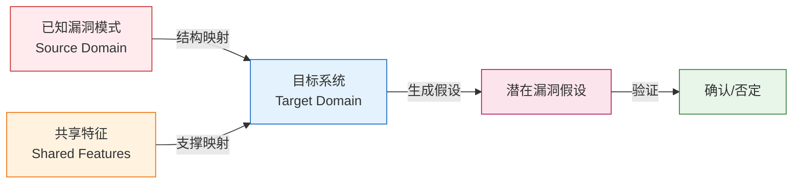
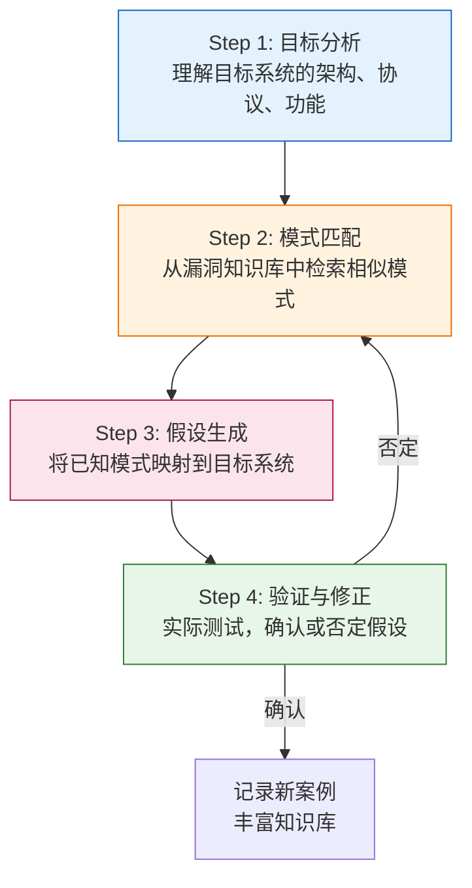

## 七、类比推理法

> **类比推理的核心公式：已知系统A存在漏洞模式P → 目标系统B与A共享结构特征S → B可能也存在P的变体 → 验证。**

类比推理（Analogical Reasoning）是安全研究者最常用的思维加速器。它的本质不是"猜测"，而是**利用已知漏洞模式的可迁移性，快速缩小对未知系统的攻击面搜索空间**。逆向思维告诉你"应该看什么"，类比推理则回答"从哪里开始看"。

### 7.1 什么是安全领域的类比推理

#### 7.1.1 定义与认知基础

类比推理是将**源域（Source Domain）** 的已知知识映射到**目标域（Target Domain）** 的推理过程。在安全领域，这意味着：

- **源域**：已知的漏洞类型、攻击手法、防御缺陷
- **映射条件**：两个系统共享相似的架构模式、协议逻辑、数据处理流程或信任模型
- **目标域**：待分析的新系统、新协议、新应用场景
- **结论**：目标系统可能存在与源域类似的安全问题（需验证）

从认知科学角度看，人类大脑天然擅长模式识别。安全专家之所以比新手更快发现问题，不是因为他们"更聪明"，而是因为他们的大脑中存储了大量已知的漏洞模式，能在看到新系统时迅速触发类比联想。



#### 7.1.2 类比推理 vs 其他安全思维方法

| 维度 | 类比推理法 | 逆向思维法 | 假设验证法 | 攻击面枚举法 |
|------|-----------|-----------|-----------|-------------|
| **起点** | 已知漏洞模式 | 攻击目标 | 初始假设 | 系统组件清单 |
| **驱动力** | 经验迁移 | 目标倒推 | 假设-验证循环 | 枚举遍历 |
| **速度** | 快（有经验库时） | 中等 | 慢（需反复验证） | 慢但全面 |
| **盲区** | 全新攻击面（无类比源） | 可能忽略低目标价值漏洞 | 假设来源受限 | 可能淹没在细节中 |
| **适用场景** | 跨平台/跨协议/跨版本分析 | 针对性深度分析 | 探索性分析 | 全面审计 |
| **互补关系** | 提供假设方向 | 验证具体路径 | 检验可行性 | 确保无遗漏 |

**关键洞察**：类比推理不是独立方法，而是为假设验证法提供"假设来源"、为攻击面枚举法提供"优先级排序"的**加速器**。

### 7.2 类比推理的五种模式

安全领域的类比推理可以归纳为五种经典模式，每种模式对应不同的映射关系。

#### 7.2.1 跨实现类比（Cross-Implementation Analogy）

**核心思想**：同一功能的不同实现，往往共享相似的漏洞模式。

**经典案例：SQL注入 → NoSQL注入 → GraphQL注入 → ORM注入**

SQL注入的基本原理是：用户输入改变了查询语句的语义结构。这个模式可以迁移到任何"用户输入参与查询构造"的场景。

**SQL注入（源域）**：

```sql
-- 正常查询
SELECT * FROM users WHERE username = 'alice' AND password = 'pass123'
-- 注入后
SELECT * FROM users WHERE username = 'admin'--' AND password = 'anything'
```

**NoSQL注入（目标域 - MongoDB）**：

```javascript
// 正常查询
db.users.find({ username: "alice", password: "pass123" })
// 注入：利用MongoDB操作符
db.users.find({ username: { "$gt": "" }, password: { "$gt": "" } })
// 结果：匹配所有记录，绕过认证
```

**GraphQL注入（目标域）**：

```graphql
# 正常查询
query { user(name: "alice") { email } }
# 注入：利用变量覆盖和内联片段
query { user(name: "admin") { email, role, passwordHash } }
# 信息泄露：GraphQL过度暴露（introspection enabled时）
```

**ORM注入（目标域 - Django ORM）**：

```python
# 正常查询
User.objects.filter(username=username, password=password)
# 注入：利用Q对象和__raw__查询
from django.db.models import Q
User.objects.filter(Q(username__contains=request.GET['q']))
# 如果q包含恶意ORM查询参数...
```

**映射分析**：

| 共享特征 | SQL | NoSQL | GraphQL | ORM |
|---------|-----|-------|---------|-----|
| 用户输入参与查询构造 | ✅ | ✅ | ✅ | ✅ |
| 有查询语法/操作符可被滥用 | ✅ | ✅ | ✅ | ✅ |
| 可改变查询语义 | ✅ | ✅ | ✅ | ✅ |
| 典型防御：参数化/预编译 | ✅ | ✅ | ✅ | ✅ |

**通用防御模式**：参数化查询 — 将数据与指令分离，是所有"输入参与查询"场景的通用防御。

#### 7.2.2 跨协议类比（Cross-Protocol Analogy）

**核心思想**：不同协议如果解决相似问题，往往存在相似的安全缺陷。

**案例：TCP SYN Flood → HTTP Slowloris → DNS Amplification**

这三种攻击虽然针对不同协议，但共享一个深层模式：**利用协议握手/维持阶段的不对称性，消耗服务器资源**。

| 攻击 | 协议 | 不对称性 | 资源消耗 |
|------|------|---------|---------|
| SYN Flood | TCP | 客户端发1个SYN，服务器维持半连接队列 | 半连接表内存 |
| Slowloris | HTTP | 客户端缓慢发送请求头，服务器维持连接 | 并发连接数 |
| DNS Amplification | DNS | 小请求触发大响应（50-100倍） | 带宽 |
| Hash Collision DoS | HTTP POST | 服务器解析哈希表O(1)，碰撞时O(n) | CPU |
| ReDoS | 正则引擎 | 特定输入使正则回溯指数级增长 | CPU |

**类比推理的安全价值**：当你发现一种协议存在资源不对称性时，应该立即检查其他协议是否存在类似问题。

**防御的类比迁移**：

```text
TCP SYN Flood 防御: SYN Cookie（无状态验证）
         ↓ 类比
HTTP Slowloris 防御: 连接超时 + 最大请求时间限制（资源上限）
         ↓ 类比
ReDoS 防御: 正则执行超时 + 复杂度分析（计算上限）
         ↓ 通用模式
所有资源不对称攻击的通用防御: 资源上限 + 超时机制 + 速率限制
```

#### 7.2.3 跨版本类比（Cross-Version Analogy）

**核心思想**：同一软件的新版本往往引入新功能，但老功能的漏洞模式可能以新形式重现。

**案例：Log4j 1.x → Log4j 2.x**

Log4j 1.x 已知存在JNDI查找功能的风险（CVE-2019-17571，SocketServer反序列化）。当Log4j 2.x重新引入Lookup机制时，经验丰富的安全研究者会立即检查：

1. Lookup是否可从用户输入触发？→ 是（`${jndi:...}`）
2. Lookup是否支持远程协议？→ 是（JNDI支持LDAP/RMI）
3. Lookup是否在日志消息中执行？→ 是（不仅在配置中）

这三个"是"叠加起来，就是Log4Shell（CVE-2021-44228）。

**类比推理在这里的作用**：如果你熟悉Log4j 1.x的反序列化漏洞模式，面对Log4j 2.x的新Lookup功能时，你的第一反应应该是"这个功能是否可被用户输入触发"——这比从零开始分析快得多。

#### 7.2.4 跨领域类比（Cross-Domain Analogy）

**核心思想**：从完全不同的技术领域借用安全模式。

**案例：生物免疫系统 → 网络安全防御**

| 免疫系统机制 | 网络安全类比 | 具体实现 |
|-------------|-------------|---------|
| 先天免疫（非特异性） | 网络防火墙/基础防护 | iptables、WAF规则 |
| 适应性免疫（特异性） | 入侵检测系统（IDS） | 签名检测、行为分析 |
| 免疫记忆（记忆B细胞） | 威胁情报库 | IOC数据库、YARA规则 |
| 自身/非自身识别 | 白名单/黑名单 | 应用白名单、文件哈希 |
| 炎症反应（隔离感染区） | 网络分段/隔离 | VLAN隔离、蜜罐引流 |
| 免疫缺陷（AIDS） | 供应链攻击 | 信任链被破坏 |
| 自身免疫病（攻击自身） | 误报/过度防御 | 安全工具阻止正常业务 |

**这种类比的实际价值**：免疫系统的"分层防御+记忆机制+自适应"模型，直接影响了现代纵深防御（Defense in Depth）和威胁情报共享架构的设计。

#### 7.2.5 跨时间类比（Cross-Temporal Analogy）

**核心思想**：历史上的攻击技术会以新形式回归。

**案例：历史攻击的"复活"周期**

| 时代 | 攻击技术 | "复活"形式 | 共享本质 |
|------|---------|-----------|---------|
| 1990s | 缓冲区溢出 | 2010s ROP链/JIT Spray | 内存控制流劫持 |
| 2000s | XSS注入 | 2020s 模板注入/原型链污染 | 代码与数据边界混淆 |
| 2000s | SQL注入 | 2010s NoSQL/GraphQL注入 | 输入改变查询语义 |
| 2010s | 服务端请求伪造(SSRF) | 2020s 云元数据SSRF | 信任边界被绕过 |
| 2000s | 木马/后门 | 2020s 供应链投毒 | 信任关系被利用 |

**规律总结**：攻击技术的本质只有有限几种（控制流劫持、数据注入、信任绕过、资源耗尽），变化的只是载体和表面形式。掌握本质模式，就能在新技术出现时快速识别旧问题的新马甲。

### 7.3 类比推理的系统化流程

类比推理不是凭直觉"想到就用"，而是可以系统化执行的流程。

#### 7.3.1 四步法



**Step 1：目标分析** — 提取关键特征

对目标系统回答以下问题：

- 它处理什么类型的用户输入？（文本/二进制/JSON/XML）
- 它使用什么协议/框架/语言？
- 它的认证和授权模型是什么？
- 它与哪些外部系统交互？
- 它的部署环境是什么？（云/本地/容器/嵌入式）

**Step 2：模式匹配** — 检索类比源

在已知漏洞知识库中搜索具有相似特征的系统：

- **CVE数据库**：搜索同类型软件的历史漏洞
- **OWASP Top 10**：检查是否落入已知风险类别
- **CWE分类**：按弱点类型检索
- **同类产品漏洞**：竞争对手/同类开源项目的已知问题
- **历史版本**：该产品自身的历史漏洞

**Step 3：假设生成** — 映射与推理

将已知模式映射到目标系统时，问三个关键问题：

1. **映射是否成立？** 共享特征是否足够相似，使漏洞模式可迁移？
2. **目标是否有缓解措施？** 目标系统是否已经针对此类攻击进行了防御？
3. **映射的置信度如何？** 高相似度 = 高置信度，低相似度 = 需要更多验证。

**Step 4：验证与修正** — 实测确认

假设必须通过实际测试来验证。验证过程中的关键原则：

- 先在安全的测试环境验证，绝不直接在生产系统测试
- 如果假设被否定，分析原因：是映射不成立，还是目标有缓解措施？
- 如果假设被肯定，进一步探索：相同的类比模式还能产生哪些变体？

#### 7.3.2 类比推理检查清单

在分析任何新系统时，使用以下检查清单确保不遗漏类比机会：

```markdown
## 类比推理检查清单

### 输入处理类比
- [ ] 是否有用户输入参与查询构造？→ 检查注入类漏洞
- [ ] 是否有文件上传功能？→ 检查文件类型绕过/解析漏洞
- [ ] 是否有用户输入参与模板渲染？→ 检查SSTI（服务端模板注入）
- [ ] 是否有用户输入参与正则匹配？→ 检查ReDoS
- [ ] 是否有用户输入参与序列化/反序列化？→ 检查反序列化漏洞

### 认证授权类比
- [ ] 是否有自定义认证逻辑？→ 检查认证绕过
- [ ] 是否有基于角色的访问控制？→ 检查权限提升
- [ ] 是否有API Key/Token机制？→ 检查Token伪造/泄露
- [ ] 是否有SSO/OAuth集成？→ 检查重定向劫持

### 通信与信任类比
- [ ] 是否与外部系统通信？→ 检查SSRF
- [ ] 是否依赖第三方服务？→ 检查供应链风险
- [ ] 是否有内部服务间通信？→ 检查信任边界问题
- [ ] 是否处理Webhook回调？→ 检查回调验证

### 数据处理类比
- [ ] 是否进行XML解析？→ 检查XXE
- [ ] 是否使用JSON解析？→ 检查原型链污染
- [ ] 是否进行URL解析？→ 检查URL解析差异攻击
- [ ] 是否处理编码/解码？→ 检查编码绕过
```

### 7.4 深度案例分析

#### 7.4.1 案例一：从Log4Shell到Spring4Shell

**类比链条**：Log4Shell（JNDI注入）→ Spring Framework RCE（Spring4Shell）

2021年12月，Log4Shell（CVE-2021-44228）震惊安全界。安全研究者立即开始类比搜索：还有哪些Java生态组件支持类似的"用户输入触发远程代码执行"模式？

**类比推理过程**：

1. **源域特征提取**：Log4Shell的核心模式是"日志框架支持表达式求值，且用户输入可控制表达式内容"
2. **类比搜索**：Spring Framework是否也有"用户输入参与表达式求值"的机制？
3. **发现**：Spring的Data Binding机制允许通过HTTP参数绑定到JavaBean属性，而JavaBean属性可以通过getter/setter链访问嵌套对象
4. **映射**：如果攻击者能通过参数绑定访问到`classLoader`属性，就能修改类加载器的行为
5. **验证**：CVE-2022-22965（Spring4Shell）确认了这个攻击路径

**关键教训**：两次攻击虽然具体技术不同（JNDI Lookup vs Data Binding），但共享同一个元模式——"用户输入跨越了数据与代码的边界"。

#### 7.4.2 案例二：从物理安全到网络安全

**类比链条**：物理入侵技术 → 网络攻击技术

| 物理入侵技术 | 网络安全类比 | 具体映射 |
|-------------|-------------|---------|
| 尾随进入（Tailgating） | 会话劫持（Session Hijacking） | 利用已有认证会话进入系统 |
| 撬锁（Lock Picking） | 密码破解/认证绕过 | 技术性突破访问控制 |
| 假冒维修人员 | 钓鱼攻击（Phishing） | 社会工程获得信任 |
| 复制门禁卡 | Token窃取/重放攻击 | 复制认证凭证 |
| 从窗户进入（绕过正门） | 侧信道攻击 | 绕过主要防御面 |
| 切断报警系统 | DDoS安全监控系统 | 使防御机制失效 |
| 在门锁中塞口香糖 | DoS攻击 | 使资源不可用 |
| 观察密码输入 | 侧信道信息泄露 | 通过旁路获取敏感信息 |

**实际应用价值**：在进行安全培训或风险评估时，物理安全的类比能帮助非技术人员直观理解网络攻击的概念。

#### 7.4.3 案例三：从Web安全到移动端安全

**类比链条**：Web XSS → 移动端Intent注入/WebView漏洞

Web XSS的核心模式是"不可信数据被当作代码执行"。这个模式在移动端有多种表现形式：

**Android平台**：

```java
// WebView XSS（直接类比Web XSS）
webView.loadData(userInput, "text/html", "UTF-8");
// 如果userInput包含<script>alert('XSS')</script>，在WebView中执行

// Intent注入（类比URL重定向）
String url = getIntent().getStringExtra("url");
webView.loadUrl(url);
// 恶意应用可以发送Intent，让受害应用的WebView加载恶意URL

// Content Provider注入（类比SQL注入）
contentResolver.query(
    Uri.parse("content://com.example.provider/users"),
    null, "name = '" + userInput + "'", null, null
);
// 如果userInput包含SQL注入payload
```

**iOS平台**：

```objectivec
// URL Scheme劫持（类比开放重定向）
NSURL *url = [NSURL URLWithString:
    [NSString stringWithFormat:@"myapp://action?param=%@", userInput]];
// userInput可能注入额外的URL参数或改变scheme行为
```

**类比推理的验证要点**：移动端的"注入点"比Web更多（Intent、Content Provider、URL Scheme、Deep Link），但核心防御思想相同——**所有外部输入都是不可信的，必须经过验证和编码**。

### 7.5 建立个人漏洞模式库

类比推理的效率直接取决于你的"类比源"质量。建立一个结构化的漏洞模式库，是提升类比推理能力的基础工程。

#### 7.5.1 模式库的结构设计

```text
vulnerability-patterns/
├── injection/                    # 注入类
│   ├── sql-injection.md         # 模式描述、检测方法、防御措施
│   ├── nosql-injection.md
│   ├── command-injection.md
│   ├── template-injection.md
│   └── _meta-pattern.md         # 注入类的通用元模式
├── authentication/               # 认证类
│   ├── session-fixation.md
│   ├── broken-auth.md
│   └── _meta-pattern.md
├── authorization/                # 授权类
│   ├── idor.md
│   ├── privilege-escalation.md
│   └── _meta-pattern.md
├── deserialization/              # 反序列化类
│   ├── java-deser.md
│   ├── python-pickle.md
│   └── _meta-pattern.md
└── resource-exhaustion/          # 资源耗尽类
    ├── dos-syn-flood.md
    ├── redos.md
    └── _meta-pattern.md
```

#### 7.5.2 每个模式条目的模板

```markdown
## 模式名称：[名称]

### 元模式
描述这类漏洞的通用本质（跨实现、跨语言不变的部分）

### 已知实现
| 实现 | CVE/案例 | 技术细节 |
|------|---------|---------|
| ... | ... | ... |

### 共享特征（用于类比匹配）
- 特征1：...
- 特征2：...

### 检测方法
1. ...
2. ...

### 防御措施
1. ...
2. ...

### 类比延伸
这个模式还能迁移到哪些场景？为什么？
```

#### 7.5.3 推荐的模式来源

| 来源 | 内容 | 更新频率 | 访问方式 |
|------|------|---------|---------|
| MITRE CWE | 弱点分类体系 | 持续更新 | cwe.mitre.org |
| OWASP Top 10 | Web应用十大风险 | 每3-4年 | owasp.org |
| CVE Details | 已公开漏洞数据库 | 每日更新 | cvedetails.com |
| HackerOne Hacktivity | 真实赏金漏洞报告 | 每日更新 | hackerone.com/hacktivity |
| PortSwigger Research | Web安全前沿研究 | 每周 | portswigger.net/research |
| Project Zero Blog | 浏览器/内核0day分析 | 不定期 | googleprojectzero.blogspot.com |
| BlackHat/DEFCON演讲 | 前沿攻击技术 | 年度 | youtube.com/BlackHat |

### 7.6 类比推理的局限性与应对

类比推理是启发式的（Heuristic），不是证明式的（Deductive）。理解它的局限性，才能正确使用它。

#### 7.6.1 三大局限

**局限一：类比失败 — 共享特征不充分**

两个系统表面相似，但关键的安全机制完全不同。类比推理可能生成错误假设。

*示例*：MySQL的`LOAD DATA INFILE`和MongoDB的`$lookup`都涉及"从外部读取数据"，但MySQL的`LOAD DATA`可以读取服务器本地文件（`/etc/passwd`），而MongoDB的`$lookup`只能在同一集群的集合间关联——不能直接读取文件系统。如果简单类比"都能读取外部数据"，会得出错误结论。

**应对策略**：始终检查目标系统是否有**额外的安全约束**使类比不成立。问自己："目标系统有没有源系统没有的限制？"

**局限二：类比盲区 — 全新攻击面无源可类**

当目标系统使用了全新的技术栈或架构模式时，可能没有任何已知的类比源。

*示例*：区块链智能合约在2016年刚出现时，传统的Web安全经验库中没有任何可类比的模式——重入攻击（Reentrancy）是全新的攻击类型，Web安全研究者不会想到"一个函数在执行过程中被多次调用"。

**应对策略**：类比推理必须与其他方法结合使用。当类比推理无法提供有效假设时，切换到系统分解法和攻击面枚举法。

**局限三：类比偏见 — 过度依赖已知模式**

经验丰富的安全研究者可能过度依赖已知模式，忽略与已知模式无关的漏洞。

*示例*：一个专注于Web安全的研究者可能只关注注入类漏洞，忽略业务逻辑漏洞（如价格篡改、竞态条件），因为业务逻辑漏洞的模式不容易用传统的类比框架描述。

**应对策略**：定期使用"无类比审计"——强制自己在不参考任何已知模式的情况下，从零开始分析目标系统。

#### 7.6.2 类比推理的置信度评估

不是所有类比都同等可靠。使用以下框架评估类比推理的置信度：

| 置信度等级 | 条件 | 建议行动 |
|-----------|------|---------|
| **高** | 目标系统与源系统使用相同框架/库/协议，共享多个安全相关特征 | 直接进行针对性测试 |
| **中** | 目标系统与源系统解决相似问题，但技术栈不同 | 先分析差异点，再进行测试 |
| **低** | 目标系统与源系统仅在抽象层面相似 | 仅作为探索方向，需要更多独立分析 |

**评估公式（简化版）**：

```text
置信度 = (共享安全特征数 / 总相关特征数) × 技术栈相似度系数

技术栈相似度系数:
  相同实现: 1.0
  同语言不同框架: 0.8
  同范式不同语言: 0.6
  不同范式: 0.3
```

### 7.7 高级应用：元模式思维

成熟的类比推理者不只记忆具体漏洞案例，而是抽象出**元模式（Meta-Pattern）**——跨所有具体实现不变的安全本质。

#### 7.7.1 七大安全元模式

```text
┌─────────────────────────────────────────────────┐
│              安全元模式全景图                      │
├─────────────────────────────────────────────────┤
│                                                  │
│  1. 代码/数据混淆 ──── 注入、XSS、SSTI、模板注入  │
│     (Code/Data Confusion)                        │
│                                                  │
│  2. 信任边界违反 ──── SSRF、CSRF、供应链攻击      │
│     (Trust Boundary Violation)                   │
│                                                  │
│  3. 状态机操纵 ──── 竞态条件、TOCTOU、认证绕过     │
│     (State Machine Manipulation)                 │
│                                                  │
│  4. 资源不对称 ──── DoS、ReDoS、放大攻击          │
│     (Resource Asymmetry)                         │
│                                                  │
│  5. 信息泄露链 ──── 侧信道、时序攻击、错误信息     │
│     (Information Leakage Chain)                  │
│                                                  │
│  6. 权限/能力提升 ──── 提权、沙箱逃逸、容器逃逸    │
│     (Privilege/Capability Escalation)            │
│                                                  │
│  7. 序列化/反序列化 ──── 反序列化RCE、XML XXE      │
│     (Serialization Abuse)                        │
│                                                  │
└─────────────────────────────────────────────────┘
```

**元模式的使用方式**：

1. 分析目标系统时，先确定它可能涉及哪些元模式
2. 对每个元模式，检索所有已知的具体实现
3. 将具体实现映射到目标系统
4. 验证映射是否成立

#### 7.7.2 元模式应用示例

**场景**：分析一个IoT设备的MQTT通信

```text
元模式扫描:
├── 代码/数据混淆 → MQTT topic是否有注入风险？
├── 信任边界违反 → 设备是否验证MQTT broker的身份？
├── 状态机操纵 → 设备是否处理重放消息？QoS降级攻击？
├── 资源不对称 → 是否可发送大量MQTT消息耗尽设备资源？
├── 信息泄露链 → MQTT消息是否加密？是否可嗅探？
├── 权限/能力提升 → 是否存在MQTT topic权限提升？
└── 序列化/反序列化 → MQTT payload是否经过反序列化处理？
```

每个子问题都可以继续用类比推理深入：IoT设备的MQTT认证绕过 ←→ Web API的API Key认证绕过 ←→ 传统C/S架构的Token伪造。

### 7.8 实战训练方法

#### 7.8.1 训练一：每日类比练习

每天选择一个CVE，尝试找到至少3个可类比的目标系统。

```text
练习模板：
CVE编号: CVE-XXXX-XXXXX
漏洞类型: [类型]
核心模式: [一句话描述本质]
类比目标1: [系统名] - [为什么类比成立] - [预期攻击路径]
类比目标2: [系统名] - [为什么类比成立] - [预期攻击路径]
类比目标3: [系统名] - [为什么类比成立] - [预期攻击路径]
验证结果: [实际测试结果]
```

#### 7.8.2 训练二：跨领域类比挑战

选择一个非安全领域的系统（如银行ATM、电梯控制系统、智能冰箱），尝试用安全元模式分析它的潜在漏洞。

#### 7.8.3 训练三：类比审计实战

在合法授权范围内，选择一个开源项目：

1. 阅读其架构文档，提取关键特征
2. 使用类比推理检查清单，逐项检查
3. 对高置信度的假设进行代码审计验证
4. 记录所有发现，无论是否确认

#### 7.8.4 训练四：类比推理复盘

每次完成安全测试后，复盘类比推理过程：

- 哪些类比是有效的？为什么？
- 哪些类比失败了？失败原因是什么？
- 是否存在没有类比覆盖到的漏洞？如何改进知识库？

### 7.9 本节小结

类比推理法的核心价值在于**利用已有知识加速对未知系统的分析**。掌握这种方法需要：

1. **丰富的知识库**：持续积累漏洞模式，建立结构化的模式库
2. **精确的映射能力**：识别两个系统间真正关键的共享特征，避免表面相似的误导
3. **严谨的验证习惯**：类比只生成假设，不代替验证——所有结论必须通过实际测试确认
4. **元模式思维**：从具体案例中抽象出通用模式，实现举一反三
5. **知其局限**：理解类比推理的三大局限（类比失败、类比盲区、类比偏见），与其他方法互补使用

> **最后的提醒**：类比推理的最大风险不是"找不到类比"，而是"找到错误的类比还深信不疑"。永远保持对类比结论的怀疑态度，用实际验证代替直觉判断。
