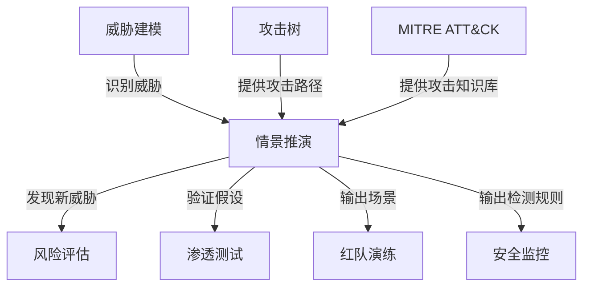
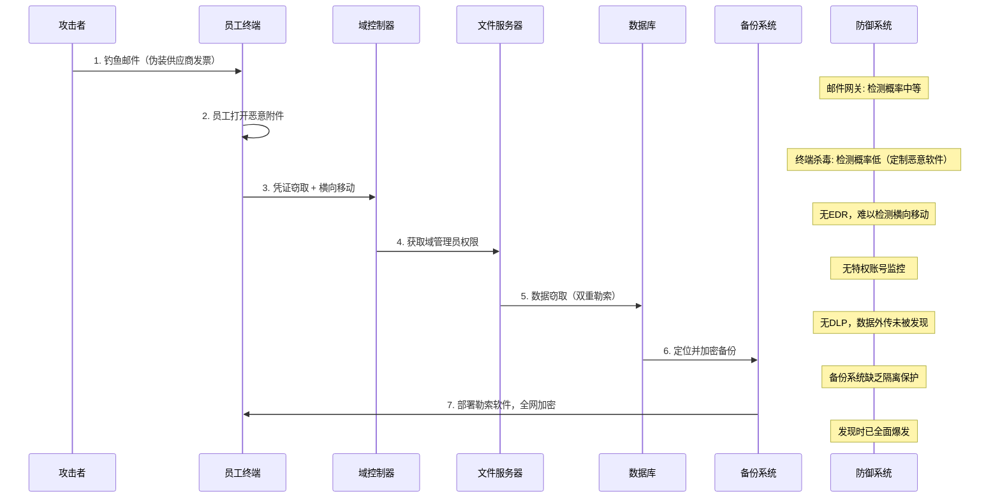

## 八、情景推演法

情景推演法（Scenario Deduction Method）是安全思维中最具实战价值的分析工具之一。它要求你像棋手一样，在脑海中构建完整的攻击-防御对弈过程，通过系统性地推演每一步棋，提前发现系统中的薄弱环节。与静态的漏洞扫描不同，情景推演关注的是**动态的攻击过程**——攻击者拥有什么样的能力、会采取什么路径、防御方如何响应、最终结果如何。

### 8.1 什么是情景推演

#### 8.1.1 定义与本质

情景推演法是一种基于假设-推演-验证的安全分析方法。其核心思想是：**在攻击发生之前，先在思维中模拟攻击的全过程**，从而发现现有防御体系的盲区。

它与其他安全分析方法的本质区别在于：

| 方法 | 视角 | 时间维度 | 核心问题 |
|------|------|----------|----------|
| 漏洞扫描 | 技术 | 当前快照 | 系统有什么已知漏洞？ |
| 渗透测试 | 攻击 | 当前窗口 | 能否利用漏洞突破系统？ |
| 威胁建模 | 设计 | 静态分析 | 系统可能面临哪些威胁？ |
| **情景推演** | **对抗** | **动态演化** | **攻击者会如何行动？防御能否跟上？** |

情景推演的独特价值在于它是**动态的、对抗性的、时间敏感的**。它不仅问"有什么漏洞"，更问"攻击者会如何利用这些漏洞的组合，在什么时间节点、以什么顺序发动攻击"。

#### 8.1.2 历史渊源

情景推演法的思想源自军事领域的**兵棋推演（Wargaming）**。早在19世纪，普鲁士军队就使用沙盘和棋子模拟战场态势，推演不同作战方案的可能结果。20世纪冷战期间，兰德公司（RAND Corporation）将情景推演系统化，用于核战略分析。

信息安全领域借鉴了这一方法论，并根据网络攻防的特点进行了改造：

- **军事兵棋推演**：红蓝双方在特定战场环境下对抗，关注战略目标和资源消耗
- **网络情景推演**：攻击方和防御方在IT基础设施上对抗，关注数据泄露、服务中断和业务影响
- **关键差异**：网络攻防的速度远快于军事行动（分钟级 vs 天级），且攻击者可以同时在多个战线发动攻击

#### 8.1.3 与相关方法的关系

情景推演法不是孤立存在的，它与多种安全分析方法相互补充：



- **威胁建模**提供静态的威胁清单，情景推演在此基础上增加时间维度和对抗逻辑
- **攻击树**提供可能的攻击路径，情景推演将这些路径组合成完整的攻击故事
- **MITRE ATT&CK**提供攻击者技术和战术的知识库，是构建推演场景的重要参考
- **渗透测试**验证推演结论的可行性，是推演结果的实证检验

### 8.2 情景推演的完整步骤

一个完整的情景推演包含七个步骤，每个步骤都有明确的输入、输出和质量标准。

#### 8.2.1 第一步：确定推演范围和目标

在开始推演之前，必须明确边界：

- **系统范围**：推演涉及哪些系统、网络、应用？是单个应用还是整个企业网络？
- **时间窗口**：推演覆盖多长时间？一小时的渗透攻击还是一年的APT潜伏？
- **资产目标**：攻击者瞄准的是什么？客户数据库、知识产权、财务系统、还是业务可用性？
- **推演目的**：是为了发现漏洞、检验应急预案、还是评估安全投资回报？

**范围界定清单**：

```text
□ 明确推演的系统边界（网络拓扑、应用清单、数据资产）
□ 确定推演的时间跨度（短期突袭 vs 长期潜伏）
□ 列出关键资产及其业务价值
□ 确认推演输出的预期形式（报告、改进建议、决策依据）
□ 确定参与角色（攻击者设定、防御方、观察评估者）
```

#### 8.2.2 第二步：定义攻击者画像

攻击者不是抽象的，必须为其建立具体的画像。不同类型的攻击者具有完全不同的动机、能力和行为模式。

| 攻击者类型 | 动机 | 技术能力 | 资源投入 | 典型行为 |
|-----------|------|---------|---------|---------|
| 脚本小子 | 炫耀、好奇 | 低 | 极低 | 使用现成工具扫描和利用已知漏洞 |
| 黑客活动分子 | 政治/社会诉求 | 中等 | 低 | DDoS攻击、网站篡改、数据泄露 |
| 有组织犯罪 | 经济利益 | 高 | 中等 | 勒索软件、数据窃取、金融欺诈 |
| 内部威胁 | 报复/经济 | 中-高 | 无额外成本 | 数据外泄、破坏、权限滥用 |
| 国家级APT | 情报/破坏 | 极高 | 极高 | 长期潜伏、供应链攻击、零日利用 |
| 竞争对手 | 商业情报 | 中-高 | 中等 | 商业间谍、知识产权窃取 |

**构建攻击者画像的模板**：

```markdown
## 攻击者画像

### 基本信息
- 类型：[选择上表中的类型]
- 动机：[具体描述为什么攻击]
- 时间压力：[急需获取还是可以长期潜伏]

### 能力评估
- 技术水平：[低/中/高/国家级]
- 可用工具：[已知漏洞利用/零日漏洞/定制工具]
- 资源投入：[人力、资金、时间]
- 社会工程能力：[是否有能力进行针对性钓鱼]

### 行为特征
- 攻击时间偏好：[工作时间/深夜/随机]
- 隐蔽程度要求：[低（一次性攻击）/高（长期潜伏）]
- 退出策略：[是否需要在攻击完成后隐藏痕迹]
```

#### 8.2.3 第三步：绘制攻击路径图

基于攻击者画像和系统架构，绘制可能的攻击路径。这一步结合攻击树和数据流分析。

**攻击路径图示例（针对企业Web应用）**：

```text
攻击目标：窃取客户数据库中的敏感数据

路径A：外部直接攻击
├── A1: 信息收集
│   ├── 子域名枚举
│   ├── 端口扫描
│   └── 技术栈识别
├── A2: 漏洞发现
│   ├── Web应用漏洞扫描（SQL注入、XSS）
│   ├── API端点发现和测试
│   └── 第三方组件漏洞检查
├── A3: 初始突破
│   ├── 利用SQL注入获取数据库访问
│   ├── 利用文件上传获取WebShell
│   └── 利用SSRF访问内部服务
└── A4: 数据窃取
    ├── 直接导出数据库
    ├── 通过WebShell分批下载
    └── 利用DNS隧道外传

路径B：社会工程攻击
├── B1: 目标调研
│   ├── LinkedIn收集员工信息
│   ├── 分析组织结构
│   └── 识别关键人员
├── B2: 钓鱼攻击
│   ├── 针对性邮件（伪装供应商/客户）
│   ├── 恶意附件（Office宏/伪装PDF）
│   └── 水坑攻击（感染常用网站）
├── B3: 立足点建立
│   ├── 在受害者机器上安装后门
│   ├── 窃取凭证
│   └── 横向移动到服务器
└── B4: 数据窃取
    ├── 定位数据库服务器
    ├── 提取数据
    └── 通过加密通道外传

路径C：供应链攻击
├── C1: 识别依赖关系
│   ├── 分析目标使用的第三方库
│   ├── 识别CI/CD管道
│   └── 找到最薄弱的供应商
├── C2: 感染供应链
│   ├── 向开源库注入恶意代码
│   ├── 入侵供应商系统
│   └── 篡改软件更新包
├── C3: 触发攻击
│   ├── 等待目标更新依赖
│   ├── 恶意代码在目标环境执行
│   └── 建立命令控制通道
└── C4: 数据窃取
    ├── 利用合法通道掩盖流量
    ├── 分阶段窃取数据
    └── 清除痕迹
```

#### 8.2.4 第四步：逐步推演攻击过程

这是情景推演的核心环节。对每条攻击路径，逐步推演攻击者和防御方的行动，形成完整的"故事线"。

**推演的三线叙事法**：

每一步推演需要同时考虑三条线索：

1. **攻击者行动线**：攻击者在这一步做什么？使用什么技术？需要什么前置条件？
2. **防御系统响应线**：现有的安全控制（防火墙、IDS、SIEM等）会产生什么反应？
3. **时间演化线**：这一步需要多长时间？是否给了防御方反应的窗口？

**推演记录模板**：

```text
步骤 N: [步骤名称]

攻击者行动:
  - 动作: [具体描述]
  - 技术: [MITRE ATT&CK 技术ID，如 T1566.001]
  - 前置条件: [需要什么条件才能执行]
  - 预计耗时: [分钟/小时/天]

防御系统响应:
  - 检测机制: [哪些安全控制可能检测到这个动作]
  - 检测概率: [高/中/低/无]
  - 检测延迟: [实时/分钟级/小时级/天级/可能永远检测不到]
  - 误报可能性: [高/中/低]

防御人员响应:
  - 响应动作: [安全团队会做什么]
  - 响应时间: [从检测到响应需要多久]
  - 响应效果: [能否阻止/延缓/仅能记录]

结果判断:
  - 攻击是否成功: [是/否/部分成功]
  - 对后续步骤的影响: [打开了什么新路径/关闭了什么路径]
  - 累计影响: [到此步骤的总损害评估]
```

#### 8.2.5 第五步：分析防御响应

推演完成后，系统性地分析防御体系的表现：

**防御效能评估矩阵**：

| 防御层 | 预期功能 | 推演中的实际表现 | 差距分析 | 改进建议 |
|--------|---------|----------------|---------|---------|
| 边界防护 | 阻止未授权访问 | 部分有效，绕过了X规则 | 规则覆盖不全 | 更新规则库 |
| 入侵检测 | 发现异常行为 | 仅检测到50%的攻击动作 | 签名库过旧 | 增加行为检测 |
| 日志监控 | 记录并告警 | 日志存在但无人监控 | 缺少告警流程 | 部署SIEM |
| 应急响应 | 快速遏制 | 响应时间超过24小时 | 缺少自动化 | 建立SOAR流程 |

#### 8.2.6 第六步：评估结果和影响

使用定量和定性相结合的方式评估推演结果：

**影响评估四维度**：

1. **数据影响**：多少数据被泄露？数据的敏感程度如何？
2. **业务影响**：服务中断多长时间？直接经济损失多少？
3. **合规影响**：是否触发数据泄露通知义务？可能的罚款金额？
4. **声誉影响**：对客户信任和品牌价值的损害程度？

**风险量化公式**：

```text
风险值 = 可能性 × 影响度

可能性评估（1-5分）：
  1 = 极不可能（需要多个零日漏洞配合）
  2 = 不太可能（需要较高的技术水平和资源）
  3 = 可能（中等技术水平的攻击者可以实现）
  4 = 很可能（常见攻击手法，工具易获取）
  5 = 几乎确定（已知漏洞未修复，攻击面暴露）

影响度评估（1-5分）：
  1 = 微小（无实质损害）
  2 = 轻微（局部影响，可快速恢复）
  3 = 中等（部分业务受影响，需要数天恢复）
  4 = 严重（核心业务中断，显著经济损失）
  5 = 灾难性（业务完全停摆，面临生存危机）
```

#### 8.2.7 第七步：输出改进计划

将推演发现转化为可执行的改进计划：

```markdown
## 情景推演改进计划

### 高优先级（立即执行）
| 编号 | 发现问题 | 改进措施 | 负责人 | 完成期限 | 预期效果 |
|------|---------|---------|--------|---------|---------|
| H-01 | DLP规则覆盖不全 | 更新敏感数据检测规则 | 安全运营 | 1周内 | 数据外泄检测率提升至90% |

### 中优先级（1个月内）
| 编号 | 发现问题 | 改进措施 | 负责人 | 完成期限 | 预期效果 |
|------|---------|---------|--------|---------|---------|
| M-01 | 缺少内部横向移动检测 | 部署EDR并配置横向移动规则 | 安全架构 | 1个月内 | 检测内部威胁能力提升 |

### 低优先级（季度规划）
| 编号 | 发现问题 | 改进措施 | 负责人 | 完成期限 | 预期效果 |
|------|---------|---------|--------|---------|---------|
| L-01 | 应急响应流程不完善 | 制定并演练IR手册 | 安全管理 | 本季度 | 响应时间缩短50% |
```

### 8.3 实战推演案例

以下案例展示了如何将七个步骤应用于具体场景。

#### 8.3.1 案例一：内部员工离职前窃取数据

**推演背景**：某金融科技公司的一名高级数据分析师提交了离职申请，还有两周离职时间。该员工拥有对客户数据库的只读访问权限，以及对数据仓库的查询权限。

**攻击者画像**：
- 类型：内部威胁
- 动机：跳槽到竞争对手，带走客户数据以建立业务关系
- 技术能力：中等（数据分析师，熟悉SQL和数据分析工具，但不是安全专家）
- 时间压力：两周离职窗口
- 隐蔽需求：中等（希望在离职前不被发现）

**推演过程**：

```text
步骤1: 数据定位（第1-2天）

攻击者行动:
  - 动作: 在数据仓库中查询客户表结构，了解有哪些敏感字段
  - 技术: 使用已有的数据库查询权限
  - 预计耗时: 2小时

防御系统响应:
  - 检测机制: 数据库审计日志
  - 检测概率: 低（查询表结构是日常操作）
  - 检测延迟: 无实时告警

结果判断:
  - 攻击是否成功: 是（完全正常的行为）
  - 对后续影响: 攻击者确定了目标数据的具体位置和字段
```

```text
步骤2: 小批量试探（第3-5天）

攻击者行动:
  - 动作: 以"数据分析"为名，执行多次小批量查询，每次导出几百条记录
  - 技术: 将查询结果导出为CSV文件
  - 预计耗时: 3天，每天执行5-10次查询

防御系统响应:
  - 检测机制: 数据库审计日志、DLP系统
  - 检测概率: 低-中（小批量查询不太触发告警，但频率异常可能被发现）
  - 检测延迟: DLP通常在数据外传时才触发，查询本身不易被检测

结果判断:
  - 攻击是否成功: 是（单次查询量小，不触发阈值）
  - 对后续影响: 累计获取数千条客户记录
```

```text
步骤3: 大规模数据导出（第6-8天）

攻击者行动:
  - 动作: 尝试一次导出完整客户列表（10万+条记录）
  - 技术: 编写SQL查询导出全量数据到本地文件
  - 预计耗时: 数小时

防御系统响应:
  - 检测机制: 数据库审计日志、DLP系统、异常行为分析（UEBA）
  - 检测概率: 中-高（大规模导出应触发告警）
  - 检测延迟: 如果有实时监控，应在小时内发现
  - 关键问题: 如果DLP阈值设置过高（如单次导出100万条），可能漏过

结果判断:
  - 攻击是否成功: 取决于DLP阈值配置
  - 如果成功: 一次性获取全部目标数据
  - 如果被检测: 进入步骤3b（绕过检测策略）
```

```text
步骤3b: 绕过检测策略

攻击者行动:
  - 动作: 改用分批导出，每天导出5000条，通过20天完成
  - 变体: 将数据混入正常分析报告中导出
  - 变体: 使用截图工具逐页截取数据

防御系统响应:
  - 检测机制: 累计导出量统计、行为基线分析
  - 检测概率: 低（分批导出接近正常工作模式）
  - 关键缺陷: 如果没有累计量监控，几乎无法检测

结果判断:
  - 攻击是否成功: 很可能成功（除非有累计量监控机制）
```

```text
步骤4: 数据外传（第9-12天）

攻击者行动:
  - 动作: 将数据文件通过以下方式外传
    - 方案A: 发送到个人邮箱（作为附件）
    - 方案B: 上传到个人云存储（Google Drive/百度网盘）
    - 方案C: 通过USB设备拷贝
    - 方案D: 通过手机拍照/录屏
  - 预计耗时: 1-3天

防御系统响应:
  - 检测机制: 邮件DLP、网络DLP、USB管控、终端DLP
  - 检测概率:
    - 方案A: 高（邮件DLP应检测到敏感数据）
    - 方案B: 中（如果HTTPS流量未解密则无法检测内容）
    - 方案C: 高（如果部署了USB管控）
    - 方案D: 极低（物理手段几乎无法技术检测）

结果判断:
  - 如果DLP配置完善: 方案A和C可被阻止
  - 如果网络未做SSL解密: 方案B可能成功
  - 方案D: 几乎无法防御（这是物理安全问题）
```

```text
步骤5: 痕迹清理（第13-14天）

攻击者行动:
  - 动作: 删除本地导出文件、清除浏览器历史
  - 限制: 通常无法清除服务器端审计日志
  - 预计耗时: 数小时

防御系统响应:
  - 检测机制: 服务器端日志完整性保护
  - 检测概率: 高（如果日志已集中存储到SIEM）
  - 关键点: 即使本地痕迹被清除，服务器端记录仍然存在

结果判断:
  - 攻击者能清除本地痕迹，但服务器端日志应保留
  - 事后取证的关键在于日志是否已集中存储且防篡改
```

**推演结论**：

| 防御层 | 表现评估 | 关键发现 |
|--------|---------|---------|
| 访问控制 | 合格 | 最小权限原则基本落实，员工仅有只读权限 |
| 数据库审计 | 合格 | 操作有记录，但缺乏实时告警 |
| DLP系统 | 不合格 | 阈值配置过高，分批导出可绕过；HTTPS流量未解密 |
| 终端管控 | 不合格 | 缺少USB管控，无屏幕水印 |
| 行为分析 | 不合格 | 无UEBA系统，无法识别异常数据访问模式 |
| 日志完整性 | 部分合格 | 日志存在但部分未集中存储 |

**改进建议**：

1. **部署UEBA系统**：建立员工数据访问行为基线，识别离职前的异常数据访问模式
2. **调整DLP策略**：降低单次告警阈值，增加累计量监控（如7天内同一用户导出超过X条记录）
3. **网络流量解密**：在合规允许的范围内对HTTPS流量进行DLP检测
4. **终端管控强化**：禁用USB存储设备，部署屏幕水印（含员工ID和时间戳）
5. **离职流程强化**：离职申请触发自动降低数据访问权限的流程

#### 8.3.2 案例二：勒索软件攻击（外部攻击者）

**推演背景**：一家制造业企业，员工约500人，使用混合云架构（本地AD + AWS），IT团队3人，安全团队0人。

**攻击者画像**：
- 类型：有组织犯罪（RaaS运营商的附属攻击者）
- 动机：经济利益（勒索赎金）
- 技术能力：高（熟练使用Cobalt Strike、了解AD攻击）
- 时间压力：中等（愿意花1-2周潜伏以获取更大收益）

**推演过程（概要）**：



**详细推演关键步骤**：

```text
关键转折点1: 钓鱼邮件突破邮件网关

攻击者行动:
  - 注册与供应商相似的域名（如 supplier-invoice.com vs supplierinvoice.com）
  - 发送携带恶意宏的Excel文件，伪装为发票
  - 邮件内容高度定制，引用真实采购订单号（从暗网购买的泄露数据）

防御系统响应:
  - 邮件网关: 检测到新域名发送的邮件，但未发现恶意附件（定制恶意软件绕过签名检测）
  - SPF/DKIM: 新域名有完整的邮件认证记录
  - 检测概率: 低

结果: 邮件送达员工收件箱

关键转折点2: 域管理员凭证获取

攻击者行动:
  - 在员工终端执行Mimikatz，获取内存中的明文凭证
  - 发现该员工是本地管理员（IT为方便管理赋予的权限）
  - 使用Pass-the-Hash技术横向移动到域控制器
  - 利用PrintNightmare（CVE-2021-34527）或类似漏洞获取SYSTEM权限
  - 使用DCSync攻击获取所有域用户哈希

防御系统响应:
  - 本地杀毒: 未检测到Mimikatz（使用了混淆版本）
  - 网络监控: 无内网流量监控
  - 域控制器: 无特权操作告警
  - 检测概率: 极低（无专业安全监控工具）

结果: 攻击者获得全域控制权

关键转折点3: 备份系统被加密

攻击者行动:
  - 通过域管理员权限访问备份服务器
  - 发现备份存储在同一网络中，无网络隔离
  - 删除/加密在线备份副本
  - 发现离线备份（磁带）但无法物理访问

防御系统响应:
  - 备份系统: 无访问控制（域管理员可直接访问）
  - 离线备份: 物理隔离，攻击者无法触及
  - 检测概率: 无（备份服务器无安全监控）

结果: 在线备份被破坏，离线备份幸存
```

**推演结论**：

- 攻击成功概率：**极高（90%+）** — 缺乏专业安全团队和基础安全工具
- 预计损失：在线备份被破坏，业务中断5-10天，可能需要支付赎金
- 唯一的安全网：离线备份（磁带）可以恢复数据，但恢复时间长

**改进优先级**：

1. **部署EDR**：在终端上部署端点检测与响应，检测凭证窃取和横向移动
2. **备份网络隔离**：将备份系统放入独立网络段，使用独立凭证访问
3. **最小权限原则**：取消普通员工的本地管理员权限
4. **安全意识培训**：针对钓鱼邮件的识别和报告流程
5. **考虑MSSP**：安全团队为零的情况下，考虑将安全监控外包给托管安全服务商

#### 8.3.3 案例三：供应链攻击（SolarWinds模式）

**推演背景**：某SaaS公司向数千家企业客户提供API服务，使用多个开源组件构建后端。

**攻击者画像**：
- 类型：国家级APT
- 动机：情报收集（瞄准使用该SaaS服务的政府和金融机构客户）
- 技术能力：极高（拥有零日漏洞、定制恶意软件）
- 时间压力：极低（可以花数月时间布局）
- 隐蔽需求：极高（必须长期不被发现）

**推演过程（概要）**：

```text
阶段1: 供应链侦察（第1-2个月）
  - 分析目标SaaS公司的技术栈和依赖关系
  - 识别其使用的某个中等流行度的开源库
  - 确认该库的维护者只有1-2人，代码审查不严格
  - 向该开源库贡献"性能优化"补丁，内含后门代码
  - 后门逻辑：在特定条件下（检测到生产环境）才会激活

阶段2: 后门激活（第3个月）
  - 目标SaaS公司更新依赖到包含后门的版本
  - 后门在生产环境中激活
  - 后门建立隐蔽的C2通信通道（使用DNS隧道）

阶段3: 数据窃取（第4-6个月）
  - 通过后门访问SaaS平台的API网关
  - 筛选高价值客户的API请求和响应
  - 将数据通过DNS隧道缓慢外传
  - 仅在工作时间活跃，模仿正常流量模式

阶段4: 影响扩散（持续）
  - 通过SaaS平台的API访问，间接获取下游客户数据
  - 影响范围从1家SaaS公司扩展到数千家下游企业
```

**关键发现**：供应链攻击的可怕之处在于**信任传递**——客户信任SaaS公司，SaaS公司信任开源库，攻击者只需要攻破最弱的那个环节。

### 8.4 情景推演的高级技术

#### 8.4.1 MITRE ATT&CK驱动的推演

MITRE ATT&CK框架提供了攻击者技术和战术的系统化知识库，是构建高质量推演场景的核心资源。

**使用ATT&CK进行推演的方法**：

1. **选择攻击者组（Threat Group）**：在ATT&CK知识库中找到与你定义的攻击者画像匹配的已知攻击组织
2. **提取技术清单**：该组织历史使用过的攻击技术
3. **映射到你的环境**：这些技术在你的系统中哪些可以实施、哪些会被检测
4. **构建攻击链**：按照ATT&CK战术阶段（侦察→初始访问→执行→持久化→提权→防御规避→凭证访问→发现→横向移动→收集→C2→外传）组织推演步骤

**ATT&CK覆盖率评估表**：

| ATT&CK战术阶段 | 攻击者可能使用的技术 | 检测能力 | 覆盖率 |
|---------------|-------------------|---------|--------|
| 侦察（Reconnaissance） | T1595 主动扫描 | 低 | 20% |
| 初始访问（Initial Access） | T1566 钓鱼 | 中 | 50% |
| 执行（Execution） | T1059 命令解释器 | 低 | 30% |
| 持久化（Persistence） | T1053 计划任务 | 低 | 25% |
| 提权（Privilege Escalation） | T1068 漏洞利用 | 无 | 10% |
| 防御规避（Defense Evasion） | T1070 清除日志 | 低 | 20% |
| 凭证访问（Credential Access） | T1003 凭证转储 | 无 | 5% |
| 横向移动（Lateral Movement） | T1021 远程服务 | 无 | 10% |
| 数据外传（Exfiltration） | T1041 C2通道外传 | 中 | 40% |

通过这个表可以清晰看到：该组织在凭证访问和横向移动阶段几乎没有检测能力，这是推演中的关键发现。

#### 8.4.2 攻杀链（Kill Chain）推演

洛克希德·马丁的网络杀伤链模型将攻击分为七个阶段，每个阶段都是防御的机会点：


**杀伤链推演的关键**：在每个阶段评估"能否在此处阻断攻击"。越早阻断，损失越小。如果推演发现防御只能在第7阶段（目标达成）才能检测到攻击，说明防御体系存在严重缺陷。

**各阶段防御能力推演清单**：

| 阶段 | 防御措施示例 | 推演问题 |
|------|------------|---------|
| 侦察 | 网络监控、蜜罐 | 能否发现攻击者的信息收集行为？ |
| 武器化 | 威胁情报 | 是否有关于该攻击工具的IOC？ |
| 投递 | 邮件网关、WAF | 恶意载荷能否被拦截？ |
| 利用 | 补丁管理、应用白名单 | 已知漏洞是否已修复？ |
| 安装 | EDR、应用白名单 | 恶意软件能否被检测和阻止？ |
| 命令控制 | 网络流量分析、DNS监控 | C2通信能否被发现和阻断？ |
| 目标达成 | DLP、数据加密 | 数据能否被窃取或破坏？ |

#### 8.4.3 红蓝对抗推演

将情景推演升级为实际的红蓝对抗演练：

**推演vs红蓝对抗的对比**：

| 维度 | 桌面推演 | 红蓝对抗 |
|------|---------|---------|
| 执行方式 | 思维实验/讨论 | 实际技术验证 |
| 成本 | 低（时间和人力） | 高（专业团队和工具） |
| 发现深度 | 中（受限于参与者知识） | 高（真实攻击模拟） |
| 风险 | 无 | 低-中（需要严格控制范围） |
| 适用频率 | 季度/月度 | 年度/半年度 |
| 输出 | 书面报告+改进计划 | 技术报告+实战证据 |

**推演到红蓝的升级路径**：

1. **桌面推演**：发现"域管理员凭证可能被窃取"的假设
2. **技术验证**：红队尝试实际执行凭证窃取，验证推演结论
3. **检测验证**：蓝队评估现有监控能否发现实际攻击
4. **流程验证**：触发应急响应流程，检验团队协作效率

#### 8.4.4 自动化推演工具

手动推演耗时且依赖个人经验，以下工具可以帮助自动化推演过程：

**ATT&CK Navigator**：
- MITRE官方工具，可视化ATT&CK矩阵
- 可以为不同攻击者和防御能力创建热力图
- 在线地址：https://mitre-attack.github.io/attack-navigator/

**CALDERA**：
- MITRE开发的自动化对手模拟平台
- 可以配置攻击场景并自动执行
- 自动生成检测覆盖率报告

**Atomic Red Team**：
- 开源的ATT&CK技术测试库
- 每个ATT&CK技术都有对应的可执行测试
- 可以批量验证防御检测能力

**推演自动化脚本示例**（使用Python评估ATT&CK覆盖率）：

```python
import json

def evaluate_attack_coverage(attack_techniques, detection_rules):
    """
    评估防御体系对攻击技术的检测覆盖率
    
    Args:
        attack_techniques: 攻击者可能使用的技术列表
        detection_rules: 已部署的检测规则与ATT&CK技术的映射
    
    Returns:
        覆盖率报告
    """
    covered = []
    uncovered = []
    
    for technique in attack_techniques:
        if technique in detection_rules:
            covered.append({
                "technique": technique,
                "detection_rule": detection_rules[technique]["rule_name"],
                "confidence": detection_rules[technique]["confidence"]
            })
        else:
            uncovered.append(technique)
    
    coverage_rate = len(covered) / len(attack_techniques) * 100
    
    return {
        "total_techniques": len(attack_techniques),
        "covered": len(covered),
        "uncovered": len(uncovered),
        "coverage_rate": f"{coverage_rate:.1f}%",
        "details_covered": covered,
        "details_uncovered": uncovered,
        "risk_level": "HIGH" if coverage_rate < 40 else 
                      "MEDIUM" if coverage_rate < 70 else "LOW"
    }

# 示例：APT29 (Cozy Bear) 常用技术
apt29_techniques = [
    "T1566.001",  # 钓鱼附件
    "T1059.001",  # PowerShell
    "T1053.005",  # 计划任务
    "T1055",      # 进程注入
    "T1003.001",  # LSASS内存凭证转储
    "T1021.002",  # SMB/Windows管理共享
    "T1071.001",  # Web协议C2
    "T1041",      # C2通道数据外传
    "T1070.004",  # 文件删除
    "T1562.001",  # 禁用安全工具
]

# 已部署的检测规则
detection_rules = {
    "T1566.001": {"rule_name": "邮件附件检测", "confidence": "MEDIUM"},
    "T1059.001": {"rule_name": "PowerShell执行监控", "confidence": "HIGH"},
    "T1003.001": {"rule_name": "LSASS访问告警", "confidence": "HIGH"},
    "T1071.001": {"rule_name": "异常HTTP流量检测", "confidence": "LOW"},
}

result = evaluate_attack_coverage(apt29_techniques, detection_rules)
print(json.dumps(result, indent=2, ensure_ascii=False))
```

输出结果：

```json
{
  "total_techniques": 10,
  "covered": 4,
  "uncovered": 6,
  "coverage_rate": "40.0%",
  "risk_level": "HIGH",
  "details_uncovered": [
    "T1053.005",
    "T1055",
    "T1021.002",
    "T1041",
    "T1070.004",
    "T1562.001"
  ]
}
```

### 8.5 常见推演误区

#### 8.5.1 误区一：只考虑单一攻击路径

**错误表现**：只推演一种攻击方式（如SQL注入），忽略社会工程、供应链、物理入侵等其他路径。

**正确做法**：使用攻击树方法系统枚举所有可能的攻击路径，至少覆盖以下维度：
- 技术漏洞利用
- 社会工程
- 内部威胁
- 供应链攻击
- 物理安全
- 第三方/供应商风险

#### 8.5.2 误区二：假设攻击者会犯错

**错误表现**：在推演中假设攻击者会使用低级手段、留下明显痕迹、或在被发现后立即停止。

**正确做法**：按照**最坏情况**推演。假设攻击者：
- 拥有你估计的最高技术水平
- 有足够的耐心和资源
- 会使用多条攻击路径同时尝试
- 在一条路径被阻断后会尝试其他路径
- 会主动规避已知的检测机制

#### 8.5.3 误区三：忽略时间维度

**错误表现**：只关注"能否检测到"，不关注"多久能检测到"。

**正确做法**：为每个推演步骤标注时间。攻击者在系统中每多停留一小时，潜在损害就增加一分。关键时间指标：

- **MTTD（平均检测时间）**：从攻击发生到被发现的时间
- **MTTR（平均响应时间）**：从发现到遏制的时间
- **潜伏时间**：攻击者在系统中未被发现的总时间

根据M-Trend 2024报告，全球平均检测时间（Dwell Time）为**10天**。这意味着攻击者平均有10天的时间在你的系统中为所欲为。

#### 8.5.4 误区四：推演只做一次

**错误表现**：只在系统上线前做一次推演，之后不再更新。

**正确做法**：情景推演应该定期进行，触发条件包括：
- 系统架构发生重大变化
- 新的威胁情报出现（如新的APT组织活动）
- 行业内发生重大安全事件
- 安全工具和流程发生变更
- 定期周期（至少每季度一次）

#### 8.5.5 误区五：过度自信于现有防御

**错误表现**：推演时默认所有安全工具都正常工作，告警都会被及时处理。

**正确做法**：推演中必须考虑：
- 安全工具本身可能有配置错误
- 告警疲劳导致重要告警被忽略
- 安全人员可能不在岗（节假日、深夜）
- 安全工具可能存在绕过方法
- 零日漏洞不在任何签名库中

### 8.6 情景推演的组织形式

#### 8.6.1 桌面推演（Tabletop Exercise）

最轻量级的推演形式，适合日常安全评估：

- **参与人员**：安全团队、IT运维、业务负责人
- **时间**：2-4小时
- **流程**：
  1. 主持人介绍攻击场景背景（15分钟）
  2. 逐步揭示攻击进展，参与者讨论防御响应（每步20-30分钟）
  3. 记录发现的差距和改进点
  4. 总结输出改进计划
- **频率**：每季度一次

**桌面推演主持指南**：

```text
推演前准备:
  □ 准备详细的情景剧本（包含攻击步骤和时间节点）
  □ 准备系统架构图和网络拓扑图
  □ 准备角色卡（攻击者、防御方、业务方）
  □ 确认所有关键参与者能出席

推演中控制:
  □ 控制讨论节奏，避免在单个步骤上过度纠结
  □ 确保每个参与者都有发言机会
  □ 记录所有发现和假设
  □ 如果讨论偏离主题，及时拉回

推演后跟进:
  □ 24小时内输出推演报告
  □ 明确每项改进措施的负责人和截止日期
  □ 安排后续跟进会议确认改进进展
```

#### 8.6.2 技术推演（Technical Walkthrough）

更深入的技术分析，适合安全工程团队：

- **参与人员**：安全工程师、开发团队、架构师
- **时间**：半天到一天
- **特点**：结合实际的技术架构图、日志数据、安全配置进行推演
- **输出**：详细的技术评估报告，包含具体的安全配置改进建议

#### 8.6.3 全面演练（Full-Scale Exercise）

最接近实战的推演形式：

- **参与人员**：全公司相关部门
- **时间**：1-3天
- **特点**：结合红队实际攻击、蓝队实际响应、管理层决策
- **场景**：模拟真实的重大安全事件（如勒索软件全面爆发）
- **输出**：全面的应急响应评估报告、改进行动计划、培训需求

### 8.7 情景推演模板

以下是一个完整的情景推演报告模板，可以直接用于实际工作：

```markdown
# 安全情景推演报告

## 1. 基本信息
- 推演日期：YYYY-MM-DD
- 推演场景：[场景名称]
- 参与人员：[角色列表]
- 推演范围：[系统/网络范围]
- 推演目标：[本次推演要回答的核心问题]

## 2. 攻击者画像
- 类型：[内部/外部/APT/犯罪组织]
- 动机：[经济/情报/破坏/政治]
- 能力水平：[低/中/高/国家级]
- 资源投入：[描述]

## 3. 推演步骤
### 步骤N: [名称]
- 时间节点：[攻击发生的时间点]
- 攻击行动：[具体描述]
- 使用技术：[ATT&CK ID]
- 防御响应：[系统和人员的反应]
- 检测结果：[成功/失败/部分成功]
- 时间指标：[MTTD/MTTR]

## 4. 关键发现
| 编号 | 发现 | 严重程度 | 影响 |
|------|------|---------|------|
| F-01 | [描述] | 高/中/低 | [影响描述] |

## 5. 改进计划
| 编号 | 改进措施 | 优先级 | 负责人 | 截止日期 |
|------|---------|--------|--------|---------|
| I-01 | [措施] | P0/P1/P2 | [人名] | YYYY-MM-DD |

## 6. 后续行动
- [ ] 将改进计划录入项目管理系统
- [ ] 安排改进措施的验证测试
- [ ] 安排下一次推演的时间和主题
```

### 8.8 本节小结

情景推演法是安全思维从"静态分析"走向"动态对抗"的关键工具。它的核心价值在于：

1. **提前发现盲区**：在攻击发生之前发现防御体系的薄弱环节
2. **验证假设**：检验"我们的防御是否真的有效"这一核心问题
3. **建立共识**：让技术团队、管理层和业务方对安全风险有统一认知
4. **驱动改进**：将抽象的安全需求转化为具体的、可执行的改进计划
5. **培养思维**：通过反复推演，培养团队的安全思维能力

记住：**最好的安全推演不是在攻击发生后回顾"如果当时..."，而是在攻击发生前就问"如果攻击者..."**。
