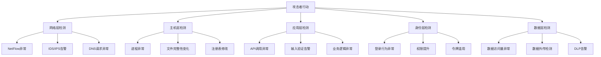
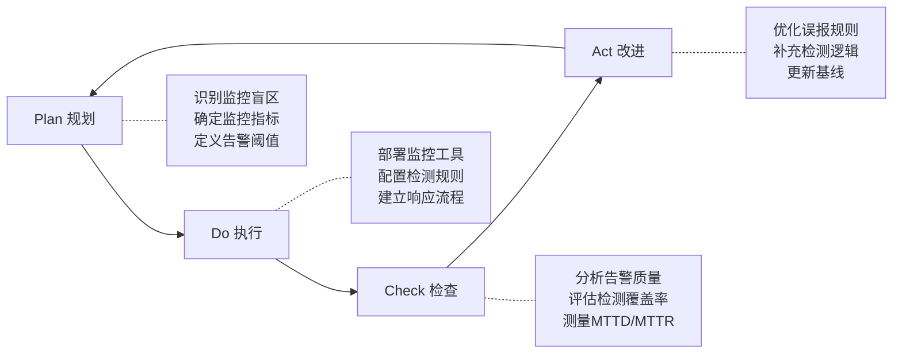

## 九、持续监控思维

### 9.1 为什么安全需要"持续"？

很多初入安全领域的人会犯一个致命的思维错误：把安全当成一个**项目**而非**过程**。他们认为部署了防火墙、完成了渗透测试、修补了漏洞，安全工作就"做完了"。这种"检查清单式安全"（Checklist Security）在现实中屡屡失败。

**核心问题在于：攻击者不会等你准备好。**

2013年Target百货数据泄露事件是最好的反面教材。Target部署了价值数百万美元的FireEye入侵检测系统，系统在攻击发生时确实检测到了异常并产生了告警——但安全团队忽略了这些告警。攻击者在Target网络中驻留了整整14天，最终窃取了4000万张信用卡数据。检测能力再强，如果没有持续监控的思维去驱动响应，一切都形同虚设。

持续监控思维的本质是三个认知转变：

| 旧认知 | 新认知 | 含义 |
|--------|--------|------|
| "我们的系统是安全的" | "我们的系统可能已经被入侵" | 从乐观假设转为怀疑默认 |
| "部署完安全工具就安全了" | "工具只是传感器，人才是大脑" | 工具不能替代人的判断 |
| "安全评估每年做一次" | "安全状态每秒都在变化" | 从周期性检查到实时感知 |

### 9.2 持续监控的思维模型

#### 9.2.1 "假设已被入侵"思维（Assume Breach）

这是持续监控思维中最核心、也最难真正内化的一个原则。

"假设已被入侵"不是让你恐慌，而是改变你的**提问方式**。传统安全问的是"怎么阻止攻击者进来"，假设已被入侵问的是"如果攻击者已经在里面了，我们怎么发现他们"。

**思维转换示例：**

```text
传统思维：                    持续监控思维：
"防火墙规则是否正确？"    →  "防火墙日志中有没有异常的通过记录？"
"系统有没有已知漏洞？"    →  "系统行为是否偏离了正常基线？"
"密码策略是否足够强？"    →  "最近有没有异常的认证成功记录？"
"部署了哪些安全工具？"    →  "这些工具最近产生了什么告警？"
```

这个思维模型在MITRE ATT&CK框架中得到了充分体现。ATT&CK将攻击分为14个战术阶段（从侦察到影响），每个阶段都有对应的检测方法。持续监控的核心就是：**在每个攻击阶段都部署检测点，缩短攻击者的驻留时间（Dwell Time）**。

根据Mandiant的年度报告，全球平均驻留时间在2023年为10天左右（较前几年有所下降），但仍有大量入侵在数月甚至数年后才被发现。缩短驻留时间的关键不是更好的防护，而是更好的监控。

#### 9.2.2 基线思维（Baseline Thinking）

持续监控的前提是知道"正常"长什么样。没有基线，所有告警都是噪音；有了基线，异常才能被识别。

**基线的三个层次：**

**1. 行为基线（Behavioral Baseline）**

记录系统和用户在正常状态下的行为模式：

- **时间基线**：正常的工作时间范围是几点到几点？哪些时段系统最繁忙？
- **流量基线**：正常情况下每个接口的入站/出站流量是多少？峰值是多少？
- **访问基线**：每个用户通常访问哪些资源？访问频率如何？
- **进程基线**：正常运行时系统上应该有哪些进程？每个进程的CPU/内存占用范围是多少？

**2. 配置基线（Configuration Baseline）**

记录系统在安全状态下的配置快照：

- 端口开放列表
- 用户账户列表和权限
- 服务和守护进程列表
- 关键文件的哈希值（完整性校验）
- 注册表关键项（Windows系统）
- 计划任务和启动项

**3. 网络基线（Network Baseline）**

记录网络通信的正常模式：

- 正常的DNS查询模式（查询频率、目标域名）
- 正常的外部通信IP列表
- 正常的协议分布（HTTP/HTTPS/DNS/SSH等占比）
- 内部横向移动的正常通信模式

**基线建立的实操流程：**

```bash
# 1. 网络流量基线采集（使用tcpdump）
# 持续采集24-72小时的网络流量作为基线数据
tcpdump -i eth0 -w /var/log/baseline/capture_$(date +%Y%m%d).pcap -G 3600 -W 72

# 2. 进程基线采集
ps aux --sort=-%cpu > /var/log/baseline/processes_cpu_$(date +%Y%m%d).txt
ps aux --sort=-%mem > /var/log/baseline/processes_mem_$(date +%Y%m%d).txt

# 3. 开放端口基线
ss -tlnp > /var/log/baseline/listening_ports_$(date +%Y%m%d).txt

# 4. 用户登录基线
last -a > /var/log/baseline/logins_$(date +%Y%m%d).txt

# 5. 定时任务基线
crontab -l > /var/log/baseline/crontab_$(date +%Y%m%d).txt
ls -la /etc/cron.* > /var/log/baseline/cron_dirs_$(date +%Y%m%d).txt

# 6. 关键文件完整性基线（使用AIDE或简单的sha256sum）
find /usr/bin /usr/sbin /bin /sbin -type f -exec sha256sum {} \; \
    > /var/log/baseline/file_hashes_$(date +%Y%m%d).txt
```

> **关键原则**：基线不是一次性采集。基线需要在不同时间段（工作日/周末、业务高峰/低谷）、不同场景下多次采集后取"正常范围"，而不是一个精确的点值。

#### 9.2.3 纵深检测思维（Defense in Depth Detection）

与纵深防御（Defense in Depth）对应的是**纵深检测**——在不同的层次部署检测能力，确保攻击者无法在任何一个层面完全隐身。



**各层检测的核心关注点：**

| 检测层 | 监控对象 | 典型异常指标 |
|--------|---------|-------------|
| 网络层 | 流量、连接、协议 | 异常目标IP、非常规端口通信、加密流量突增 |
| 主机层 | 进程、文件、注册表 | 未知进程启动、系统文件被修改、异常计划任务 |
| 应用层 | API、日志、错误 | 异常API调用频率、SQL错误日志、认证失败激增 |
| 身份层 | 认证、授权、会话 | 非工作时间登录、异地登录、横向移动 |
| 数据层 | 访问、传输、存储 | 大量数据下载、异常数据库查询、U盘拷贝 |

### 9.3 持续监控的六大核心指标

以下是持续监控思维中需要重点关注的六类指标，每一类都包含具体的检测思路。

#### 9.3.1 异常认证行为

认证是攻击链中的关键节点。几乎所有攻击最终都需要通过合法或被盗的凭证来获取持久访问。

**需要监控的认证指标：**

- **暴力破解特征**：短时间内大量认证失败，特别是针对同一账户或来自同一源IP
- **凭证填充（Credential Stuffing）**：来自多个源IP的分布式认证失败，成功率异常低
- **异常登录时间**：凌晨2-5点的认证成功记录，特别是特权账户
- **地理位置异常**：短时间内从不同地理位置登录（不可能旅行攻击）
- **密码喷洒（Password Spray）**：少量密码尝试对大量账户的攻击模式
- **会话异常**：单个用户同时从多个位置维持活跃会话

**检测逻辑示例（伪代码）：**

```python
def detect_impossible_travel(events, threshold_hours=2, threshold_km=500):
    """不可能旅行检测：同一用户短时间内从遥远地理位置登录"""
    user_events = group_by_user(events)
    alerts = []
    for user, evts in user_events.items():
        sorted_evts = sort_by_time(evts)
        for i in range(1, len(sorted_evts)):
            time_diff = sorted_evts[i].time - sorted_evts[i-1].time
            geo_diff = calculate_distance(
                sorted_evts[i].location,
                sorted_evts[i-1].location
            )
            if time_diff < threshold_hours and geo_diff > threshold_km:
                speed = geo_diff / time_diff
                if speed > 900:  # 每小时900公里以上不合理
                    alerts.append(Alert(
                        user=user,
                        type="impossible_travel",
                        severity="high",
                        detail=f"在{time_diff}小时内从{sorted_evts[i-1].location}移动到{sorted_evts[i].location}，距离{geo_diff}km"
                    ))
    return alerts
```

#### 9.3.2 权限变更监控

权限变更是攻击者从初始立足点扩展控制范围的核心手段。监控权限变更就像监控银行账户的转账——每一次变更都需要有合理的理由。

**监控清单：**

- 用户被添加到特权组（sudoers、Domain Admins、Administrators）
- 服务账户权限被提升
- 新的特权账户被创建
- ACL/DACL修改（特别是对关键资源）
- sudo策略被修改
- SSH密钥被添加到authorized_keys
- API密钥/Token被创建或修改

```bash
# Linux: 监控sudoers文件变化
inotifywait -m -e modify,create,delete /etc/sudoers /etc/sudoers.d/

# Linux: 监控用户组变化
auditctl -w /etc/group -p wa -k group_change
auditctl -w /etc/passwd -p wa -k user_change
auditctl -w /etc/shadow -p wa -k shadow_change

# Windows: 监控特权组成员变化（PowerShell）
Get-WinEvent -FilterHashtable @{
    LogName='Security'
    ID=4728,4732,4756  # 成员添加到安全组
} | Where-Object { $_.Message -match 'Administrators|Domain Admins' }
```

#### 9.3.3 数据访问与外传监控

数据是攻击者的最终目标。监控数据的访问和外传是检测数据泄露的最后一道防线。

**数据访问异常模式：**

- **量变引发质变**：正常用户一天查询100条记录，突然查询10万条
- **时间异常**：非工作时间的大量数据访问
- **范围异常**：访问了从未访问过的数据库表或文件目录
- **模式异常**：遍历式访问（从A到Z逐条读取）vs 正常的随机访问
- **聚合异常**：单条查询看起来正常，但聚合后发现异常（如多次小批量下载拼成完整数据库）

**外传监控的关键出口点：**

```text
内部网络 → 互联网出口（代理日志、NetFlow）
内部网络 → 云存储（OAuth审计日志）
内部网络 → 邮件（DLP、邮件网关日志）
内部网络 → USB设备（端点DLP）
内部网络 → 打印（打印审计日志）
内部网络 → DNS（DNS隧道检测）
```

#### 9.3.4 配置变更监控

配置变更是攻击者建立持久化的常见手段。一个被悄悄修改的SSH配置、一个被添加的后门用户、一个被关闭的安全策略，都可能是入侵的信号。

**关键配置文件的监控优先级：**

```yaml
critical:
  - /etc/passwd          # 用户账户
  - /etc/shadow          # 密码哈希
  - /etc/sudoers         # 提权策略
  - /etc/ssh/sshd_config # SSH配置
  - ~/.ssh/authorized_keys  # SSH密钥
  - /etc/crontab         # 定时任务
  - /etc/ld.so.preload   # 动态链接器劫持

high:
  - /etc/hosts           # DNS劫持
  - /etc/resolv.conf     # DNS配置
  - /etc/fstab           # 文件系统挂载
  - /etc/systemd/system/ # systemd服务
  - ~/.bashrc            # Shell初始化

medium:
  - /etc/nginx/          # Web服务器配置
  - /etc/apache2/        # Web服务器配置
  - 应用配置文件          # 数据库连接字符串等
```

#### 9.3.5 异常网络流量

网络流量是攻击者活动的"影子"——无论攻击者做什么，都会在网络上留下痕迹。

**需要关注的网络异常：**

| 异常类型 | 具体指标 | 可能的攻击场景 |
|---------|---------|--------------|
| 异常目标 | 连接到已知C2服务器IP | 命令控制通信 |
| 异常端口 | 使用非标准端口进行通信 | 隧道/绕过检测 |
| 异常协议 | DNS查询异常大（>512字节） | DNS隧道外传数据 |
| 异常时间 | 凌晨大量出站流量 | 定时数据外传 |
| 异常量级 | 出站流量突增 | 数据泄露 |
| 异常方向 | 内部主机接受大量入站连接 | 内网已被作为跳板 |
| 异常加密 | 到新域名的加密连接激增 | C2通信 |

**DNS隧道检测逻辑：**

正常的DNS查询域名通常较短（如 `www.google.com`），而DNS隧道中的域名往往包含大量编码数据，表现为：单个域名长度异常（>50字符）、子域名包含Base64/hex编码特征、单个客户端DNS查询频率异常高。

#### 9.3.6 端点行为异常

端点是攻击者的最终战场。无论是恶意软件执行、横向移动还是数据窃取，都必须在端点上发生。

**端点行为异常指标：**

- **进程链异常**：Word启动PowerShell、cmd启动certutil下载文件
- **父子进程关系异常**：services.exe创建了非系统进程
- **模块加载异常**：进程加载了来自临时目录的DLL
- **内存行为异常**：进程的RWX内存段异常增大（可能的Shellcode注入）
- **文件操作异常**：短时间内大量文件被重命名（勒索软件特征）

```powershell
# Windows: 检测可疑进程链
# 正常的Word不应该启动PowerShell
Get-WinEvent -FilterHashtable @{LogName='Security'; ID=4688} |
    Where-Object {
        $_.Properties[5].Value -match 'WINWORD|EXCEL|POWERPNT' -and
        $_.Properties[5].Value -match 'powershell|cmd|wscript|mshta|certutil'
    }
```

### 9.4 持续监控的实施方法论

#### 9.4.1 PDCA循环在安全监控中的应用

持续监控不是一个静态的系统，而是一个不断进化的循环。PDCA（Plan-Do-Check-Act）循环提供了持续改进的框架：



**关键指标——MTTD与MTTR：**

- **MTTD（Mean Time to Detect，平均检测时间）**：从攻击发生到被检测到的时间。行业优秀水平在24小时以内，而大量组织的MTTD在数周甚至数月。
- **MTTR（Mean Time to Respond，平均响应时间）**：从检测到到完成遏制的时间。优秀的安全团队能在1小时内完成初步遏制。

提升MTTD的核心是：更好的检测规则 + 更全面的日志覆盖 + 更低的信噪比。
提升MTTR的核心是：预定义的响应剧本（Playbook） + 自动化响应能力 + 充分的演练。

#### 9.4.2 告警疲劳的治理

持续监控最大的敌人不是技术限制，而是**告警疲劳（Alert Fatigue）**。

当安全团队每天面对数千条告警，其中95%以上是误报时，真正的告警就会被淹没在噪音中。根据Ponemon Institute的研究，安全团队平均每周收到约17,000条告警，其中近30%的告警被直接忽略。

**告警疲劳的四个阶段：**

```text
阶段1: 警觉期 → 每条告警都认真处理
阶段2: 倦怠期 → 开始选择性忽略低优先级告警
阶段3: 麻木期 → 只处理最紧急的告警，其余搁置
阶段4: 失效期 → 告警系统形同虚设，真正的入侵被错过
```

**治理策略：**

1. **告警分级与路由**：不是所有告警都需要人工处理。建立告警分级体系，将低优先级告警路由到自动化处理，高优先级告警才通知人工。

2. **告警聚合**：将同一事件产生的多条告警聚合为一条事件。例如，一次暴力破解攻击可能产生500条认证失败告警，但应该聚合为1条"疑似暴力破解"事件。

3. **上下文富化**：纯告警信息不够，需要关联上下文。"IP 192.168.1.50触发告警"远不如"IP 192.168.1.50（财务部张三的工位电脑，Windows 10，昨天刚打了补丁）在非工作时间访问了HR数据库"有信息量。

4. **持续调优**：定期审查告警规则，删除无效规则，降低误报率。目标是让每一条需要人工处理的告警都值得被处理。

```python
# 告警分级示例框架
class AlertRouter:
    def __init__(self):
        self.rules = {
            'critical': {
                'conditions': [
                    'admin_account_compromise',
                    'data_exfiltration_detected',
                    'ransomware_behavior',
                    'c2_communication_confirmed'
                ],
                'action': 'immediate_notification',  # 立即通知安全团队
                'sla': '15min'
            },
            'high': {
                'conditions': [
                    'privilege_escalation',
                    'lateral_movement',
                    'suspicious_powershell',
                    'multiple_auth_failures'
                ],
                'action': 'ticket_and_notify',  # 创建工单并通知
                'sla': '1h'
            },
            'medium': {
                'conditions': [
                    'config_change',
                    'new_service_detected',
                    'unusual_outbound_traffic'
                ],
                'action': 'auto_investigate',  # 自动调查，结果写入日报
                'sla': '4h'
            },
            'low': {
                'conditions': [
                    'routine_vulnerability_scan',
                    'known_false_positive_pattern',
                    'scheduled_maintenance_activity'
                ],
                'action': 'log_only',  # 仅记录，不通知
                'sla': 'next_business_day'
            }
        }
```

#### 9.4.3 威胁情报的持续集成

持续监控不能闭门造车，必须与外部威胁情报持续对接。威胁情报让监控系统知道"正在发生什么"以及"应该关注什么"。

**威胁情报的三个层次：**

| 层次 | 内容 | 来源 | 更新频率 |
|------|------|------|---------|
| 战略情报 | 攻击趋势、APT组织动向 | 行业报告、安全厂商博客 | 季度 |
| 战术情报 | TTP（战术、技术和过程） | MITRE ATT&CK、MISP | 月度 |
| 运营情报 | IOC（威胁指标）、恶意IP/域名 | VirusTotal、AlienVault OTX、商业Feed | 实时/每日 |

**IOC自动集成示例：**

```python
import requests
import json

def fetch_and_integrate_ioc():
    """从多个威胁情报源获取IOC并集成到监控系统"""

    # 1. 获取恶意IP列表
    malicious_ips = set()

    # AlienVault OTX（免费）
    otx_key = "YOUR_OTX_KEY"
    otx_url = f"https://otx.alienvault.com/api/v1/pulses/subscribed?limit=10"
    headers = {"X-OTX-API-KEY": otx_key}
    response = requests.get(otx_url, headers=headers)
    if response.ok:
        for pulse in response.json().get('results', []):
            for indicator in pulse.get('indicators', []):
                if indicator['type'] == 'IPv4':
                    malicious_ips.add(indicator['indicator'])

    # 2. 获取恶意域名列表
    malicious_domains = set()
    # 类似逻辑...

    # 3. 更新防火墙/IDS规则
    for ip in malicious_ips:
        # 添加到防火墙黑名单
        update_firewall_blocklist(ip, source="threat_intel", ttl="7d")

    # 4. 更新SIEM观察列表
    update_siem_watchlist("malicious_ips", malicious_ips)
    update_siem_watchlist("malicious_domains", malicious_domains)

    print(f"更新完成: {len(malicious_ips)}个恶意IP, {len(malicious_domains)}个恶意域名")
```

### 9.5 真实案例：持续监控如何改变结局

#### 案例1：从14天到4小时——改进监控缩短响应时间

**背景**：某金融企业2019年遭遇入侵，从初始入侵到发现用了14天。事后复盘发现，虽然部署了SIEM系统，但告警规则覆盖不足，大量告警被标记为误报忽略了。

**改进措施**：
1. 建立了网络流量基线系统，使用机器学习模型检测流量异常
2. 部署了UEBA（用户和实体行为分析），自动学习用户行为模式
3. 建立了三层告警体系：自动处理→安全分析师→安全经理
4. 每周进行告警规则审查和调优

**结果**：2021年再次遭遇类似攻击时，检测时间从14天缩短到4小时，遏制时间从3天缩短到30分钟。入侵造成的损失从数百万降低到几乎为零。

#### 案例2：SolarWinds事件中的监控教训

2020年SolarWinds供应链攻击中，攻击者通过被篡改的Orion软件更新渗透了约18,000个组织，包括多个美国政府部门。FireEye之所以率先发现入侵，正是因为其安全团队在持续监控中注意到一个员工的多因素认证（MFA）注册信息异常——有人注册了一个新的MFA设备。

这个发现看似微不足道，但正是持续监控思维的体现：**关注每一个微小的异常，而不是只关注"重大"告警**。如果不关注MFA设备注册这类低优先级事件，SolarWinds攻击可能还会继续潜伏更长时间。

#### 案例3：一个DNS查询发现数据泄露

某企业在例行审查DNS查询日志时，安全分析师注意到一个内部服务器对一个不常见域名的DNS查询量异常高，查询频率为每秒1-2次，远高于正常基线。深入调查发现，这是一个被植入后门的数据库服务器，正在通过DNS隧道缓慢外传客户数据。

如果没有持续监控DNS查询基线，这种低速数据外传几乎不可能被发现。

### 9.6 持续监控的常见误区

#### 误区1："部署了SIEM就等于有持续监控"

**真相**：SIEM只是数据汇聚平台，不等于监控能力。没有合理的日志源接入、没有经过调优的检测规则、没有持续运营的团队，SIEM只是一台昂贵的日志存储服务器。

**正确做法**：SIEM需要配套的日志接入规划、检测规则库、告警响应流程、持续调优机制。

#### 误区2："监控越多越好"

**真相**：过度监控会导致两个问题——告警疲劳和性能损耗。监控每一行代码的调用、记录每一个API请求的完整payload，不仅不现实，还会产生海量无用数据，让真正有价值的信息被噪音淹没。

**正确做法**：基于风险的监控策略。对高价值资产和高风险行为部署精细监控，对低风险场景采用粗粒度监控。

#### 误区3："只监控已知威胁"

**真相**：如果只基于已知的IOC（IP、域名、文件哈希）进行检测，就永远只能发现已知攻击。高级攻击者会使用定制工具、新域名、新IP，绕过所有基于签名的检测。

**正确做法**：结合签名检测（已知威胁）和行为检测（未知威胁）。签名检测负责快速匹配已知威胁，行为检测负责发现异常行为模式。

#### 误区4："安全监控是安全团队的事"

**真相**：安全监控不能只靠安全团队。开发团队需要监控应用层异常，运维团队需要监控系统层异常，业务团队需要监控业务逻辑异常。安全是全员责任。

**正确做法**：建立分层监控体系，每个团队负责自己层面的监控，安全团队负责全局关联和威胁分析。

#### 误区5："监控系统本身不需要监控"

**真相**：攻击者如果知道你在监控他们，第一件事就是攻击你的监控系统。日志被篡改、SIEM被入侵、告警被静默——这些都是真实发生过的攻击手段。

**正确做法**：对监控系统本身进行监控。日志完整性校验、SIEM访问审计、告警系统的健康检查——确保"看门人"本身没有被收买。

### 9.7 进阶：从监控到威胁狩猎

当基础的持续监控体系成熟后，安全团队应该从**被动响应**（等告警触发再处理）进化到**主动狩猎**（主动寻找隐藏的威胁）。

**威胁狩猎（Threat Hunting）的核心假设**：你的网络中已经有入侵者，只是还没被发现。

**威胁狩猎的基本流程：**

```text
1. 形成假设 → "攻击者可能正在使用DNS隧道外传数据"
2. 收集数据 → 获取近30天的DNS查询日志
3. 开发查询 → 编写分析脚本检测长域名、高频查询、编码模式
4. 执行分析 → 对数据执行查询
5. 验证发现 → 对可疑结果进行取证验证
6. 总结反馈 → 将有效检测逻辑固化为自动化规则
```

**威胁狩猎与持续监控的关系：**

| 维度 | 持续监控 | 威胁狩猎 |
|------|---------|---------|
| 驱动方式 | 规则驱动（告警触发） | 假设驱动（主动探索） |
| 时间特性 | 实时/准实时 | 周期性（每周/每月） |
| 技能要求 | 安全运维级别 | 高级分析/取证级别 |
| 覆盖范围 | 已知威胁模式 | 未知/高级威胁 |
| 输出 | 告警→响应 | 假设验证→新规则 |

**一个威胁狩猎的实战示例——检测隐秘C2通信：**

```bash
# 假设：攻击者可能使用DNS进行C2通信
# 狩猎方法：分析DNS查询中的异常模式

# 1. 提取所有DNS查询
tcpdump -r capture.pcap -n 'port 53' | \
    awk '{print $NF}' | \
    grep -E '\.com$|\.net$|\.org$' | \
    sort | uniq -c | sort -rn > dns_frequency.txt

# 2. 查找长域名（可能是DNS隧道）
awk '{if(length($0) > 50) print}' dns_frequency.txt > suspicious_long_domains.txt

# 3. 查找高熵域名（可能是编码数据）
python3 -c "
import math
from collections import Counter

def entropy(s):
    p = [n/len(s) for n in Counter(s).values()]
    return -sum(x * math.log2(x) for x in p)

with open('dns_frequency.txt') as f:
    for line in f:
        parts = line.strip().split()
        if len(parts) >= 2:
            domain = parts[1]
            if entropy(domain) > 3.5:
                print(f'HIGH ENTROPY: {domain} (entropy={entropy(domain):.2f})')
"
```

### 9.8 持续监控思维的自检清单

以下清单用于评估你的持续监控思维是否到位：

**基础层（必选项）：**
- [ ] 是否建立了关键系统的行为基线？
- [ ] 是否监控了认证行为（登录时间、地点、频率）？
- [ ] 是否监控了权限变更（账户创建、提权、组成员变化）？
- [ ] 是否监控了关键配置文件的变化？
- [ ] 是否有足够的日志保留期（至少90天）？
- [ ] 告警是否经过分级和路由？

**进阶层（推荐项）：**
- [ ] 是否集成了外部威胁情报？
- [ ] 是否部署了行为检测（不只是签名检测）？
- [ ] 是否有告警调优机制（定期审查误报率）？
- [ ] 是否有自动化的响应剧本？
- [ ] 是否进行了分层监控（网络/主机/应用/身份/数据）？
- [ ] 是否定期进行威胁狩猎？

**高阶层（优秀标准）：**
- [ ] MTTD是否低于24小时？
- [ ] MTTR是否低于4小时？
- [ ] 是否有UEBA能力（用户和实体行为分析）？
- [ ] 监控系统本身是否受到监控？
- [ ] 是否有红蓝对抗来验证监控有效性？
- [ ] 安全监控是否覆盖了云环境和容器环境？

### 9.9 本节小结

持续监控思维是安全思维的核心组成部分。它不是一个可以"部署"的工具，而是一种需要**内化**的思考方式。核心要点回顾：

1. **假设已被入侵**——改变默认假设，从"我们的系统是安全的"转向"攻击者可能已经在里面了"
2. **建立基线**——没有基线就没有异常检测，基线需要多维度、多时段持续更新
3. **纵深检测**——在不同层次部署检测能力，确保攻击者无法完全隐身
4. **治理告警疲劳**——分级、聚合、富化、调优，确保每条告警都值得处理
5. **集成威胁情报**——持续对接外部情报源，保持对最新威胁的感知
6. **从监控到狩猎**——成熟后从被动响应进化到主动寻找隐藏威胁

记住：**安全不是一个目的地，而是一段旅程。持续监控思维的本质，就是在旅途中保持警觉，不断调整方向。**
